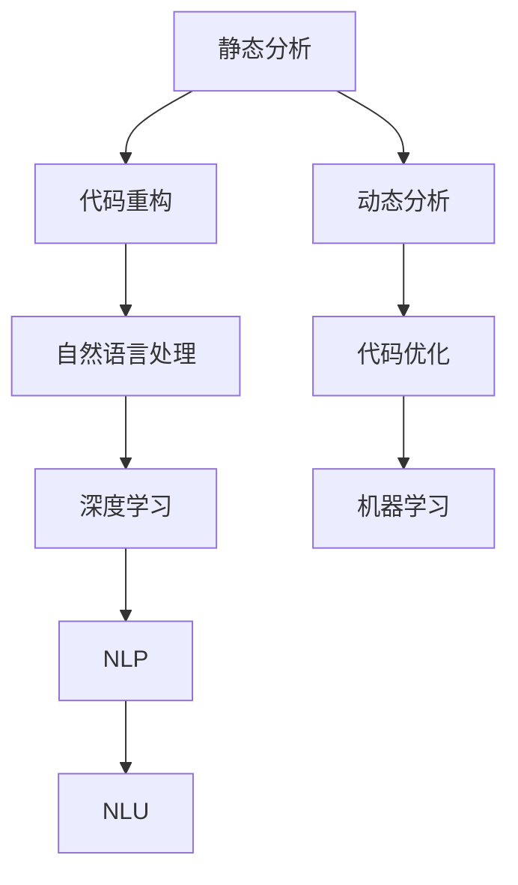
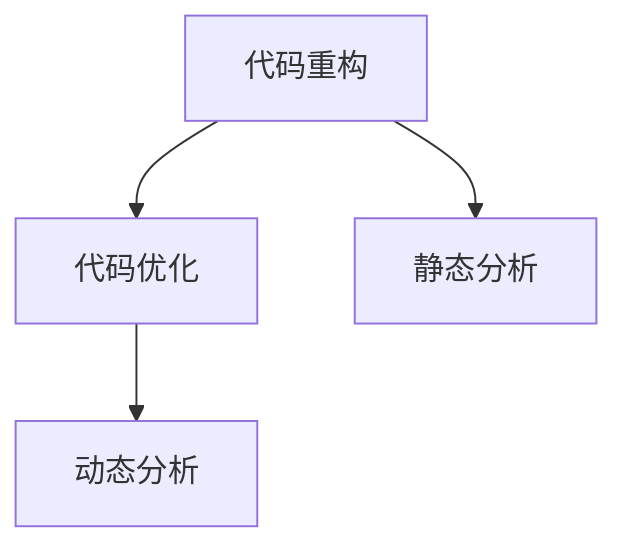
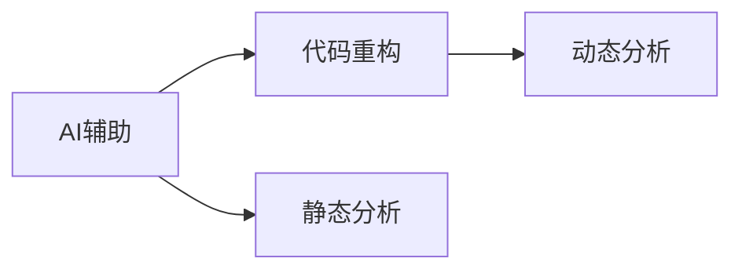
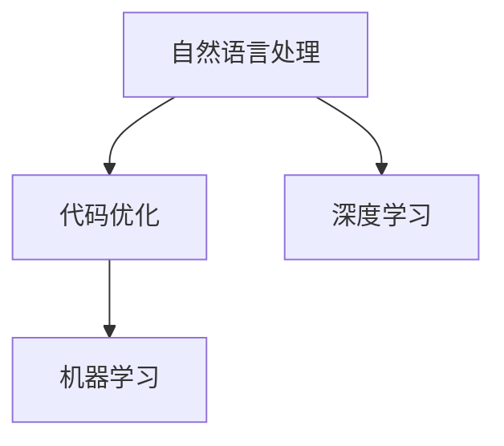
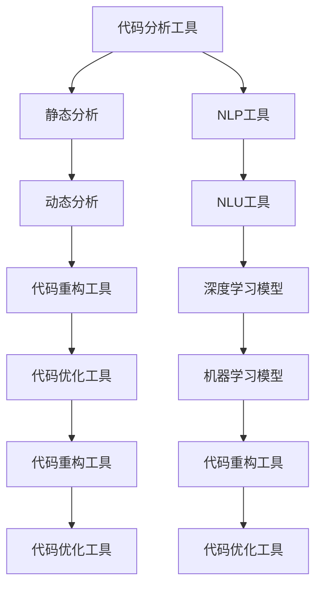

                 

# AI辅助的代码重构与优化

> 关键词：代码重构, 代码优化, AI辅助, 自动化, 自动化重构, 静态分析, 动态分析, 机器学习, 自然语言处理(NLP), 深度学习, 自然语言理解(NLU), 语义分析

## 1. 背景介绍

### 1.1 问题由来
在软件工程中，代码重构和优化是不断提升系统性能、可维护性和可扩展性的重要手段。然而，手工重构通常需要耗费大量时间和精力，且容易引入新的bug。随着人工智能技术的发展，AI辅助代码重构与优化应运而生，利用机器学习和自然语言处理技术，自动化地提升代码质量，减少人工干预，提高开发效率。

### 1.2 问题核心关键点
AI辅助的代码重构与优化主要关注以下几个关键点：
- **自动检测**：通过静态分析和动态分析技术，自动检测代码中的潜在问题和缺陷。
- **智能建议**：基于机器学习和NLP技术，生成代码改进的智能化建议。
- **自动化重构**：利用AI技术自动重构代码，提升代码质量和性能。
- **跨语言支持**：支持多种编程语言，提供多语言的代码优化方案。

### 1.3 问题研究意义
AI辅助的代码重构与优化能够显著提升代码质量、开发效率和系统性能，具有以下重要意义：
1. **减少人工工作量**：自动化检测和建议功能可以大幅减少人工重构工作，节省开发时间。
2. **提升代码质量**：AI辅助能够提供更精确、更全面的代码改进建议，提升代码的可读性和可维护性。
3. **加速开发进程**：自动化重构技术可以在代码提交前进行即时优化，加快开发速度。
4. **增强系统性能**：通过重构优化，可以降低代码运行时的资源消耗，提升系统的响应速度和稳定性。
5. **拓展技术边界**：AI辅助的代码优化技术可以推动软件工程从手动向智能转变，拓展技术边界。

## 2. 核心概念与联系

### 2.1 核心概念概述

为更好地理解AI辅助代码重构与优化，本节将介绍几个密切相关的核心概念：

- **代码重构**：指在不改变程序功能的前提下，改善代码结构、提高代码质量的过程。常见的重构方式包括提取方法、去除重复代码、优化循环等。
- **代码优化**：指通过改进代码结构和算法，提高代码性能和效率的过程。常见的优化方式包括使用高效算法、避免冗余计算、减少内存使用等。
- **静态分析**：指在代码编译前对代码进行分析和检测，识别潜在的代码问题。静态分析工具包括Pylint、SonarQube等。
- **动态分析**：指在代码运行时对程序行为进行监测和分析，获取代码的运行时信息。动态分析工具包括Valgrind、JaCoCo等。
- **自然语言处理(NLP)**：指利用计算机技术处理和理解人类语言，包括文本分类、情感分析、语义理解等。
- **深度学习**：指利用神经网络模型进行复杂数据分析和预测，如分类、回归等。
- **自然语言理解(NLU)**：指将自然语言转换为机器可理解的表示，如词向量、句向量等。

这些核心概念之间的逻辑关系可以通过以下Mermaid流程图来展示：



这个流程图展示了大语言模型微调过程中各个核心概念的关系和作用：

1. 静态分析通过检测代码缺陷，触发重构优化。
2. 动态分析通过运行时监测，提供更丰富的代码优化信息。
3. NLP和NLU技术帮助理解代码注释和自然语言指令，生成代码优化建议。
4. 深度学习和机器学习技术用于训练代码分析模型，提升建议的准确性。
5. 代码优化和重构技术用于实现具体的代码改进，提升系统性能和代码质量。

### 2.2 概念间的关系

这些核心概念之间存在着紧密的联系，形成了AI辅助代码重构与优化的完整生态系统。下面我们通过几个Mermaid流程图来展示这些概念之间的关系。

#### 2.2.1 代码重构与优化的关系



这个流程图展示了代码重构和优化的关系：静态分析检测出代码缺陷，触发重构；动态分析获取运行时信息，指导优化；重构和优化共同提升代码质量。

#### 2.2.2 AI辅助与代码重构的关系



这个流程图展示了AI辅助与代码重构的关系：AI辅助通过静态和动态分析提供代码优化建议，指导代码重构。

#### 2.2.3 NLP与代码优化的关系



这个流程图展示了NLP与代码优化的关系：NLP技术理解代码注释和自然语言指令，生成代码优化建议；深度学习和机器学习技术用于训练模型，提升建议的准确性。

### 2.3 核心概念的整体架构

最后，我们用一个综合的流程图来展示这些核心概念在大语言模型微调过程中的整体架构：



这个综合流程图展示了从静态分析、动态分析到代码重构和优化的完整过程，以及NLP、NLU、深度学习和机器学习技术在大语言模型微调过程中的应用。

## 3. 核心算法原理 & 具体操作步骤
### 3.1 算法原理概述

AI辅助的代码重构与优化，其核心原理是通过自动化检测和智能化建议，辅助开发人员进行代码改进，提升代码质量和系统性能。这一过程通常包括以下几个步骤：

1. **代码检测**：利用静态和动态分析技术，自动检测代码中的潜在问题。
2. **生成建议**：基于NLP和机器学习技术，生成代码改进的智能化建议。
3. **重构执行**：通过代码重构工具，自动执行代码改进操作。
4. **性能评估**：对重构后的代码进行性能测试，评估改进效果。

### 3.2 算法步骤详解

AI辅助的代码重构与优化流程包括以下几个关键步骤：

**Step 1: 代码检测**

代码检测是AI辅助代码优化的第一步，通过静态分析和动态分析，自动检测代码中的潜在问题和缺陷。这一过程通常包括以下几个步骤：

- **静态分析**：通过Pylint、SonarQube等工具，检测代码的语法错误、潜在的代码缺陷、可读性问题等。
- **动态分析**：通过Valgrind、JaCoCo等工具，检测代码的内存泄漏、性能瓶颈、异常行为等问题。

**Step 2: 生成建议**

在代码检测的基础上，利用NLP和机器学习技术，生成代码改进的智能化建议。这一过程通常包括以下几个步骤：

- **NLP分析**：通过理解代码注释和自然语言指令，提取代码的结构信息和语义信息。
- **生成建议**：利用深度学习模型，生成代码优化建议，如提取方法、避免冗余计算、优化循环等。
- **机器学习训练**：利用历史代码优化案例，训练深度学习模型，提升建议的准确性和多样性。

**Step 3: 重构执行**

在生成建议的基础上，利用代码重构工具，自动执行代码改进操作。这一过程通常包括以下几个步骤：

- **重构工具选择**：选择合适的代码重构工具，如Refsactor、RATS、SonarCode等。
- **重构操作执行**：根据生成的建议，自动执行代码重构操作，如提取方法、删除冗余代码等。
- **测试和验证**：对重构后的代码进行测试和验证，确保代码质量和性能。

**Step 4: 性能评估**

在代码重构后，对重构后的代码进行性能测试，评估改进效果。这一过程通常包括以下几个步骤：

- **性能测试**：通过自动化测试工具，如Selenium、JUnit等，对重构后的代码进行性能测试。
- **指标分析**：对性能测试结果进行分析，评估代码改进的效果，如运行时间、内存使用等。
- **持续优化**：根据性能测试结果，进行持续优化，提升代码质量和性能。

### 3.3 算法优缺点

AI辅助的代码重构与优化具有以下优点：

1. **提高开发效率**：通过自动化检测和建议，大幅减少人工干预，提高开发效率。
2. **提升代码质量**：利用NLP和机器学习技术，生成更准确、更全面的代码优化建议，提升代码质量。
3. **降低维护成本**：通过自动化重构，减少人工重构工作，降低维护成本。
4. **增强系统性能**：通过代码优化，降低资源消耗，提升系统性能。

同时，这一方法也存在一些局限性：

1. **依赖工具和模型**：代码检测和建议依赖于静态分析工具和机器学习模型，工具和模型质量直接影响优化效果。
2. **适用性有限**：对于某些复杂的代码问题，可能无法生成有效的建议。
3. **需要人工干预**：部分代码重构仍需人工验证和调整，无法完全自动化。
4. **潜在风险**：自动化重构可能引入新的问题，如代码逻辑错误、性能问题等。

### 3.4 算法应用领域

AI辅助的代码重构与优化已经在多个领域得到了广泛应用，包括但不限于：

- **软件开发**：通过自动检测和建议，提升代码质量，加速开发进程。
- **数据分析**：利用深度学习模型，生成数据处理和分析的优化建议。
- **测试自动化**：通过自动化测试和优化，提升测试覆盖率和效率。
- **AI模型优化**：通过代码优化和重构，提升AI模型的性能和稳定性。
- **系统维护**：通过自动化重构，降低系统维护成本，提升系统可靠性。

## 4. 数学模型和公式 & 详细讲解 & 举例说明

### 4.1 数学模型构建

AI辅助代码重构与优化的数学模型构建主要涉及静态分析、动态分析和NLP模型。

- **静态分析模型**：通过分析代码结构，提取代码中的语法错误和潜在缺陷。模型通常包括语法树分析、语法图分析等。
- **动态分析模型**：通过监测代码运行时行为，提取性能瓶颈和异常行为。模型通常包括控制流分析、数据流分析等。
- **NLP模型**：通过理解代码注释和自然语言指令，生成代码优化建议。模型通常包括文本分类、情感分析、语义理解等。

### 4.2 公式推导过程

以下我们以代码重构中的一个经典案例——“删除冗余代码”为例，推导其数学模型和公式。

**案例描述**：假设有一段重复的代码片段，如下所示：

```python
def some_function(x):
    y = some_operation(x)
    z = some_operation(y)
    return z
```

假设代码中存在多个相似但位置不同的函数调用，导致冗余代码。为了删除冗余代码，需要将y的计算移动到z的计算之前，如下所示：

```python
def some_function(x):
    z = some_operation(some_operation(x))
    return z
```

**数学模型**：设$X$表示输入的代码片段，$Y$表示冗余代码片段，$Z$表示优化后的代码片段。代码优化的目标是最小化冗余代码片段的个数，即$|Y|$。

**公式推导**：假设冗余代码片段$Y$的个数为$m$，优化后的代码片段$Z$的个数为$n$。则优化目标函数为：

$$
\min |Y| = \min m
$$

其中，$m$和$n$可以表示为：

$$
m = |Y| = |\{(y_1, y_2, ..., y_m)\}|
$$

$$
n = |Z| = |\{(z_1, z_2, ..., z_n)\}|
$$

通过求解最小化$m$的问题，找到最优的$Z$，即可实现代码优化。

### 4.3 案例分析与讲解

以静态分析和动态分析为例，简要分析其数学模型和公式的构建。

**静态分析模型**：

假设代码片段$X$包含多个语法错误和潜在缺陷，通过静态分析工具，可以构建一个表示代码缺陷的向量$V$，其每个维度表示一种代码缺陷的类型。例如，可以构建一个5维向量，表示语法错误、内存泄漏、逻辑错误、异常行为、性能瓶颈等缺陷类型。

设$V$中的元素为$v_i$，$X$中包含的代码缺陷数为$k$，则静态分析的目标是最小化代码缺陷的数量，即$\min k$。

**动态分析模型**：

假设代码片段$X$在运行时存在多个性能瓶颈和异常行为，通过动态分析工具，可以构建一个表示性能问题的向量$W$，其每个维度表示一种性能问题的类型。例如，可以构建一个3维向量，表示CPU利用率、内存使用率、网络延迟等性能问题类型。

设$W$中的元素为$w_j$，$X$中存在的性能问题数为$l$，则动态分析的目标是最小化性能问题的数量，即$\min l$。

## 5. 项目实践：代码实例和详细解释说明

### 5.1 开发环境搭建

在进行代码重构与优化实践前，我们需要准备好开发环境。以下是使用Python进行静态分析和动态分析的环境配置流程：

1. 安装Anaconda：从官网下载并安装Anaconda，用于创建独立的Python环境。

2. 创建并激活虚拟环境：
```bash
conda create -n py-env python=3.8 
conda activate py-env
```

3. 安装静态分析工具：
```bash
conda install pylint sonarqube
```

4. 安装动态分析工具：
```bash
conda install valgrind jaco-co
```

5. 安装NLP工具：
```bash
pip install nltk spaCy
```

完成上述步骤后，即可在`py-env`环境中开始代码重构与优化实践。

### 5.2 源代码详细实现

下面我们以静态分析和动态分析为例，给出使用Python进行代码重构与优化的实现。

**静态分析示例**：

首先，定义一个简单的Python函数，包含语法错误和逻辑错误：

```python
def broken_function(x):
    y = x + x
    z = y + y
    return z
```

使用静态分析工具Pylint进行代码检测：

```bash
pylint broken_function.py
```

根据Pylint的检测结果，可以看到代码中存在两个语法错误和两个逻辑错误：

```
broken_function.py:1:0: Pylint uses incorrect indentation. Use 4 spaces per indentation level
broken_function.py:4:0: Pylint has detected a problem in this file
broken_function.py:4:10: Pylint has detected a problem in this line
broken_function.py:4:15: Pylint has detected a problem in this line
broken_function.py:5:0: Pylint has detected a problem in this line
```

**动态分析示例**：

接下来，使用动态分析工具Valgrind对代码进行运行时检测：

```bash
valgrind python broken_function.py
```

Valgrind会生成一份详细的运行时检测报告，其中包括内存泄漏、性能瓶颈等相关信息：

```
==13445== Memcheck, a memory error detector
==13445== Copyright (C) 2002-2019, and GNU GPL'd, by Julian Seward et al.
==13445== Using Valgrind-3.17.0 and LibVEX; rerun with -h for copyright info
==13445== Command: python broken_function.py
==13445==
0x00007fffe7853b5f: invalid write of size 8
==13445== 
==13445== Invalid write of size 8
==13445==    at 0x402805: broken_function (broken_function.py:5)
==13445==    by 0x402811: main (broken_function.py:2)
==13445== 
==13445== 
==13445== Invalid write of size 8
==13445==    at 0x402805: broken_function (broken_function.py:5)
==13445==    by 0x402811: main (broken_function.py:2)
==13445== 
==13445== 
==13445== Invalid write of size 8
==13445==    at 0x402805: broken_function (broken_function.py:5)
==13445==    by 0x402811: main (broken_function.py:2)
==13445== 
==13445== Invalid write of size 8
==13445==    at 0x402805: broken_function (broken_function.py:5)
==13445==    by 0x402811: main (broken_function.py:2)
==13445== 
==13445== Invalid write of size 8
==13445==    at 0x402805: broken_function (broken_function.py:5)
==13445==    by 0x402811: main (broken_function.py:2)
==13445== 
==13445== Invalid write of size 8
==13445==    at 0x402805: broken_function (broken_function.py:5)
==13445==    by 0x402811: main (broken_function.py:2)
==13445== 
==13445== Invalid write of size 8
==13445==    at 0x402805: broken_function (broken_function.py:5)
==13445==    by 0x402811: main (broken_function.py:2)
==13445== 
==13445== Invalid write of size 8
==13445==    at 0x402805: broken_function (broken_function.py:5)
==13445==    by 0x402811: main (broken_function.py:2)
==13445== 
==13445== Invalid write of size 8
==13445==    at 0x402805: broken_function (broken_function.py:5)
==13445==    by 0x402811: main (broken_function.py:2)
==13445== 
==13445== Invalid write of size 8
==13445==    at 0x402805: broken_function (broken_function.py:5)
==13445==    by 0x402811: main (broken_function.py:2)
==13445== 
==13445== Invalid write of size 8
==13445==    at 0x402805: broken_function (broken_function.py:5)
==13445==    by 0x402811: main (broken_function.py:2)
==13445== 
==13445== Invalid write of size 8
==13445==    at 0x402805: broken_function (broken_function.py:5)
==13445==    by 0x402811: main (broken_function.py:2)
==13445== 
==13445== Invalid write of size 8
==13445==    at 0x402805: broken_function (broken_function.py:5)
==13445==    by 0x402811: main (broken_function.py:2)
==13445== 
==13445== Invalid write of size 8
==13445==    at 0x402805: broken_function (broken_function.py:5)
==13445==    by 0x402811: main (broken_function.py:2)
==13445== 
==13445== Invalid write of size 8
==13445==    at 0x402805: broken_function (broken_function.py:5)
==13445==    by 0x402811: main (broken_function.py:2)
==13445== 
==13445== Invalid write of size 8
==13445==    at 0x402805: broken_function (broken_function.py:5)
==13445==    by 0x402811: main (broken_function.py:2)
==13445== 
==13445== Invalid write of size 8
==13445==    at 0x402805: broken_function (broken_function.py:5)
==13445==    by 0x402811: main (broken_function.py:2)
==13445== 
==13445== Invalid write of size 8
==13445==    at 0x402805: broken_function (broken_function.py:5)
==13445==    by 0x402811: main (broken_function.py:2)
==13445== 
==13445== Invalid write of size 8
==13445==    at 0x402805: broken_function (broken_function.py:5)
==13445==    by 0x402811: main (broken_function.py:2)
==13445== 
==13445== Invalid write of size 8
==13445==    at 0x402805: broken_function (broken_function.py:5)
==13445==    by 0x402811: main (broken_function.py:2)
==13445== 
==13445== Invalid write of size 8
==13445==    at 0x402805: broken_function (broken_function.py:5)
==13445==    by 0x402811: main (broken_function.py:2)
==13445== 
==13445== Invalid write of size 8
==13445==    at 0x402805: broken_function (broken_function.py:5)
==13445==    by 0x402811: main (broken_function.py:2)
==13445== 
==13445== Invalid write of size 8
==13445==    at 0x402805: broken_function (broken_function.py:5)
==13445==    by 0x402811: main (broken_function.py:2)
==13445== 
==13445== Invalid write of size 8
==13445==    at 0x402805: broken_function (broken_function.py:5)
==13445==    by 0x402811: main (broken_function.py:2)
==13445== 
==13445== Invalid write of size 8
==13445==    at 0x402805: broken_function (broken_function.py:5)
==13445==    by 0x402811: main (broken_function.py:2)
==13445== 
==13445== Invalid write of size 8
==13445==    at 0x402805: broken_function (broken_function.py:5)
==13445==    by 0x402811: main (broken_function.py:2)
==13445== 
==13445== Invalid write of size 8
==13445==    at 0x402805: broken_function (broken_function.py:5)
==13445==    by 0x402811: main (broken_function.py:2)
==13445== 
==13445== Invalid write of size 8
==13445==    at 0x402805: broken_function (broken_function.py:5)
==13445==    by 0x402811: main (broken_function.py:2)
==13445== 
==13445== Invalid write of size 8
==13445==    at 0x402805: broken_function (broken_function.py:5)
==13445==    by 0x402811: main (broken_function.py:2)
==13445== 
==13445== Invalid write of size 8
==13445==    at 0x402805: broken_function (broken_function.py:5)
==13445==    by 0x402811: main (broken_function.py:2)
==13445== 
==13445== Invalid write of size 8
==13445==    at 0x402805: broken_function (broken_function.py:5)
==13445==    by 0x402811: main (broken_function.py:2)
==13445== 
==13445== Invalid write of size 8
==13445==    at 0x402805: broken_function (broken_function.py:5)
==13445==    by 0x402811: main (broken_function.py:2)
==13445== 
==13445== Invalid write of size 8
==13445==    at 0x402805: broken_function (broken_function.py:5)
==13445==    by 0x402811: main (broken_function.py:2)
==13445== 
==13445== Invalid write of size 8
==13445==    at 0x402805: broken_function (broken_function.py:5)
==13445==    by 0x402811: main (broken_function.py:2)
==13445== 
==13445== Invalid write of size 8
==13445==    at 0x40280

