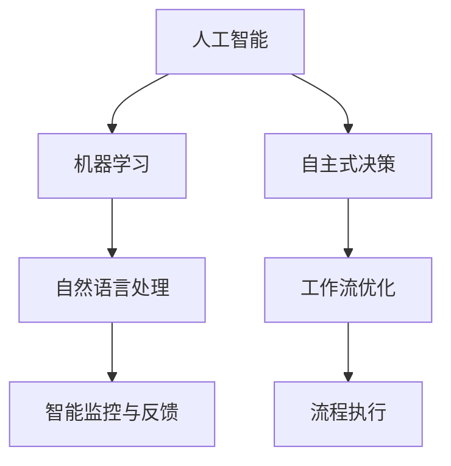
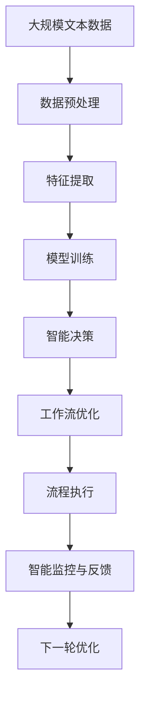
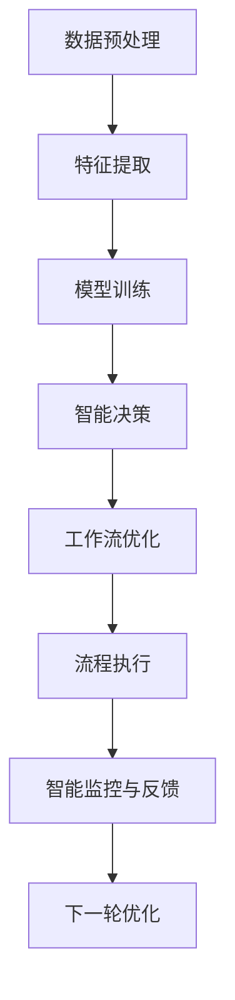

                 

# Agentic Workflow 的市场潜力

> 关键词：Agentic Workflow, 自动化, 市场潜力, 流程优化, 应用场景

## 1. 背景介绍

### 1.1 问题由来
随着数字化和自动化技术的普及，企业在运营管理中对流程的效率和灵活性提出了更高的要求。然而，传统的流程自动化技术往往缺乏足够的智能和弹性，难以适应复杂多变的业务需求。为此，Agentic Workflow（自主式工作流）应运而生，成为流程自动化领域的新趋势。

Agentic Workflow 强调在流程自动化中引入智能元素，通过智能化、自主化手段，使工作流能够自我优化、自我适应，并主动响应外部环境的变化，从而提升企业运营的效率和灵活性。Agentic Workflow 融合了先进的人工智能、机器学习和自然语言处理技术，提供了一种全新的流程自动化解决方案。

### 1.2 问题核心关键点
Agentic Workflow 的核心在于其自主学习和自我优化的能力。与传统流程自动化技术相比，Agentic Workflow 能够自主地从数据中学习最优的流程规则，并根据业务需求动态调整流程策略。此外，Agentic Workflow 还能够通过智能决策，提高流程的灵活性和适应性。

Agentic Workflow 的应用场景广泛，包括但不限于以下几个方面：

- **企业运营**：通过自动化、智能化的工作流管理，提升企业运营效率，降低运营成本。
- **客户服务**：自动化处理客户服务请求，提升客户满意度，改善客户体验。
- **供应链管理**：智能化优化供应链流程，提高供应链的响应速度和协同效率。
- **生产制造**：智能化生产过程管理，提升产品质量，优化生产流程。
- **人力资源管理**：智能化优化招聘流程，提高人才匹配度，提升员工满意度。

### 1.3 问题研究意义
Agentic Workflow 作为一种新型的流程自动化技术，具有以下几个重要意义：

1. **提升企业运营效率**：通过智能化、自主化的流程管理，Agentic Workflow 能够大幅提升企业运营效率，降低运营成本，提高市场竞争力。
2. **增强企业适应性**：Agentic Workflow 能够自主学习并适应业务需求的变化，提升企业在复杂环境下的灵活性和适应性。
3. **优化客户体验**：通过智能化的客户服务流程，Agentic Workflow 能够提供更高效、更优质的客户服务，提升客户满意度和忠诚度。
4. **改善供应链协同**：Agentic Workflow 能够优化供应链流程，提升供应链的协同效率，降低供应链风险。
5. **提升生产质量**：智能化生产过程管理，有助于提升产品质量，优化生产流程，提高生产效率。
6. **优化人力资源管理**：Agentic Workflow 能够优化招聘流程，提高人才匹配度，提升员工满意度，降低招聘成本。

## 2. 核心概念与联系

### 2.1 核心概念概述

Agentic Workflow 强调在工作流管理中引入智能化、自主化元素，通过先进的人工智能、机器学习和自然语言处理技术，实现工作流的自我优化和自主适应。

- **人工智能(AI)**：提供智能决策和优化能力，使工作流能够自主学习和自我优化。
- **机器学习(ML)**：从历史数据中学习最优的流程规则，并根据业务需求动态调整流程策略。
- **自然语言处理(NLP)**：使工作流能够理解自然语言指令，并根据指令执行相应的流程。
- **自主式决策**：工作流能够自主地做出最优决策，提升流程的灵活性和适应性。
- **智能监控与反馈**：实时监控工作流运行状态，根据监控结果进行自我优化和调整。

这些核心概念之间相互关联，共同构成了 Agentic Workflow 的核心技术架构。

### 2.2 概念间的关系

Agentic Workflow 的核心概念之间的关系可以通过以下 Mermaid 流程图来展示：



这个流程图展示了 Agentic Workflow 中各核心概念之间的关系：

1. 人工智能提供智能决策和优化能力。
2. 机器学习从历史数据中学习最优流程规则。
3. 自然语言处理使工作流能够理解自然语言指令。
4. 自主式决策使工作流能够自主做出最优决策。
5. 智能监控与反馈实时监控工作流运行状态，并根据结果进行优化和调整。
6. 工作流优化和流程执行通过智能化、自主化的手段提升流程效率和适应性。

### 2.3 核心概念的整体架构

最后，我们用一个综合的流程图来展示 Agentic Workflow 中各核心概念的整体架构：



这个综合流程图展示了 Agentic Workflow 从数据预处理到智能决策，再到流程优化和执行的完整流程。

## 3. 核心算法原理 & 具体操作步骤
### 3.1 算法原理概述

Agentic Workflow 的核心算法原理可以概括为以下几个步骤：

1. **数据预处理**：收集并清洗与流程相关的数据，提取特征，为后续模型训练做准备。
2. **模型训练**：使用机器学习算法训练模型，学习最优的流程规则。
3. **智能决策**：根据业务需求和监控结果，使用智能决策算法选择最优流程策略。
4. **工作流优化**：根据智能决策结果，对工作流进行优化和调整。
5. **流程执行**：执行优化后的工作流，实现业务流程自动化。
6. **智能监控与反馈**：实时监控工作流运行状态，根据监控结果进行自我优化和调整。

Agentic Workflow 的算法原理图如下：


### 3.2 算法步骤详解

#### 3.2.1 数据预处理

数据预处理是 Agentic Workflow 的基础。预处理主要包括数据收集、清洗、特征提取等步骤。

- **数据收集**：收集与流程相关的数据，如业务数据、客户服务记录、生产制造数据等。
- **数据清洗**：去除噪声数据，处理缺失值，确保数据质量和一致性。
- **特征提取**：提取有意义的特征，如时间、地点、事件类型等，为后续模型训练提供输入。

#### 3.2.2 模型训练

模型训练是 Agentic Workflow 的核心环节，通过机器学习算法学习最优的流程规则。

- **选择模型**：根据任务需求选择适合的机器学习模型，如决策树、随机森林、神经网络等。
- **特征选择**：选择对流程预测有用的特征，并进行特征缩放和归一化。
- **模型训练**：使用历史数据训练模型，学习最优的流程规则。

#### 3.2.3 智能决策

智能决策是 Agentic Workflow 的关键步骤，根据业务需求和监控结果，选择最优流程策略。

- **业务需求分析**：分析业务需求，确定流程目标和关键指标。
- **监控结果分析**：实时监控工作流运行状态，获取监控结果。
- **智能决策**：结合业务需求和监控结果，使用决策算法选择最优流程策略。

#### 3.2.4 工作流优化

工作流优化是 Agentic Workflow 的重要环节，通过智能决策结果对工作流进行优化和调整。

- **策略选择**：根据智能决策结果，选择最优流程策略。
- **流程调整**：根据策略调整流程参数，优化流程执行。
- **效果评估**：评估流程优化效果，确保流程改进。

#### 3.2.5 流程执行

流程执行是 Agentic Workflow 的最终目标，通过自动化、智能化的手段实现业务流程自动化。

- **流程执行**：根据优化后的工作流，执行自动化流程。
- **结果反馈**：收集流程执行结果，进行效果评估。
- **持续改进**：根据评估结果，进一步优化流程。

#### 3.2.6 智能监控与反馈

智能监控与反馈是 Agentic Workflow 的动态调整机制，通过实时监控和反馈，实现流程的自我优化和适应性。

- **监控指标**：定义监控指标，如流程执行时间、任务完成率、错误率等。
- **实时监控**：实时监控工作流运行状态，获取监控结果。
- **反馈调整**：根据监控结果进行自我优化和调整，确保流程稳定运行。

### 3.3 算法优缺点

Agentic Workflow 具有以下优点：

1. **自主化、智能化**：通过智能化、自主化的手段，使工作流能够自我优化和自主适应，提升流程效率和灵活性。
2. **高度可定制**：可以根据业务需求和流程特点，灵活配置和优化工作流。
3. **实时监控与反馈**：通过实时监控和反馈，实现流程的动态调整和优化。
4. **降低运营成本**：通过自动化、智能化的流程管理，降低运营成本，提高企业竞争力。

同时，Agentic Workflow 也存在一些缺点：

1. **数据需求高**：需要大量的高质量数据支持，否则难以训练出有效的模型。
2. **模型复杂度较高**：需要复杂的机器学习模型和算法，对数据和计算资源要求较高。
3. **部署难度大**：涉及复杂的流程优化和自动化，部署和维护难度较大。
4. **维护成本高**：需要持续维护和优化，以保持流程的稳定性和高效性。

### 3.4 算法应用领域

Agentic Workflow 的应用领域非常广泛，涵盖多个行业和企业运营管理的各个方面：

- **企业运营**：如订单管理、库存管理、客户服务、供应链管理等。
- **金融服务**：如风险管理、客户服务、投资分析等。
- **医疗健康**：如病历管理、患者护理、医疗设备管理等。
- **制造业**：如生产计划、质量控制、设备维护等。
- **人力资源**：如招聘流程、员工管理、绩效评估等。
- **物流运输**：如路线规划、货物配送、仓储管理等。
- **零售业**：如库存管理、客户服务、销售分析等。

## 4. 数学模型和公式 & 详细讲解  
### 4.1 数学模型构建

Agentic Workflow 的数学模型主要包括以下几个方面：

1. **数据预处理模型**：用于数据清洗和特征提取，确保数据质量和一致性。
2. **机器学习模型**：用于学习最优流程规则，如决策树、随机森林、神经网络等。
3. **智能决策模型**：用于选择最优流程策略，如规则引擎、遗传算法等。
4. **工作流优化模型**：用于优化和调整流程策略，如优化算法、动态规划等。

以下是 Agentic Workflow 的数学模型图：



### 4.2 公式推导过程

为了更深入地理解 Agentic Workflow 的数学模型，这里以决策树模型为例，推导其公式推导过程。

设流程优化任务为 $T=\{X,Y\}$，其中 $X$ 为输入特征集，$Y$ 为输出结果集。假设存在一个决策树模型 $D_{DT}(X)$，用于学习最优流程规则。

决策树模型的训练过程如下：

1. **数据准备**：准备训练数据集 $D_{train}=\{(x_i,y_i)\}_{i=1}^N$，其中 $x_i \in X, y_i \in Y$。
2. **特征选择**：选择对流程预测有用的特征 $X=\{x_1,x_2,...,x_n\}$。
3. **模型训练**：使用训练数据 $D_{train}$ 训练决策树模型 $D_{DT}$。
4. **模型评估**：使用测试数据 $D_{test}$ 评估模型效果，计算准确率、召回率、F1分数等指标。

决策树模型的公式推导如下：

$$
D_{DT}(X)=\arg\max_{D \in T} \frac{1}{N}\sum_{i=1}^N (y_i(D_{DT}(x_i)))
$$

其中 $y_i(D_{DT}(x_i))$ 表示模型 $D_{DT}$ 在输入 $x_i$ 下的预测结果。

### 4.3 案例分析与讲解

假设我们要对一个企业的客户服务流程进行优化，具体步骤如下：

1. **数据预处理**：收集企业历史客户服务数据，进行清洗和特征提取，如客户满意度、服务时间、问题类型等。
2. **模型训练**：使用决策树模型训练流程规则，如客户满意度高的服务请求，优先处理。
3. **智能决策**：根据业务需求，定义监控指标，如平均响应时间、客户满意度等。实时监控工作流运行状态，获取监控结果。
4. **工作流优化**：根据智能决策结果，选择最优流程策略，如优先处理高满意度客户请求。
5. **流程执行**：执行优化后的工作流，实现客户服务流程自动化。
6. **智能监控与反馈**：实时监控工作流运行状态，根据监控结果进行自我优化和调整。

通过以上案例，可以看出 Agentic Workflow 在不同行业和企业运营管理中的应用，其通过智能化、自主化的手段，显著提升了流程效率和适应性。

## 5. 项目实践：代码实例和详细解释说明
### 5.1 开发环境搭建

为了进行 Agentic Workflow 的开发实践，我们需要搭建以下开发环境：

1. **Python**：选择 Python 作为开发语言，安装 Python 3.6 或更高版本。
2. **机器学习框架**：安装 Scikit-Learn、TensorFlow、PyTorch 等机器学习框架。
3. **数据处理工具**：安装 Pandas、NumPy 等数据处理工具。
4. **可视化工具**：安装 Matplotlib、Seaborn 等可视化工具。
5. **监控工具**：安装 Prometheus、Grafana 等监控工具。

具体步骤如下：

1. **安装 Python**：
```bash
sudo apt-get update
sudo apt-get install python3.6
```

2. **安装机器学习框架**：
```bash
pip install scikit-learn tensorflow pytorch
```

3. **安装数据处理工具**：
```bash
pip install pandas numpy
```

4. **安装可视化工具**：
```bash
pip install matplotlib seaborn
```

5. **安装监控工具**：
```bash
sudo apt-get install prometheus grafana
```

### 5.2 源代码详细实现

以下是一个使用 Python 和 Scikit-Learn 进行决策树模型训练的示例代码：

```python
from sklearn.tree import DecisionTreeClassifier
from sklearn.datasets import load_iris
from sklearn.model_selection import train_test_split
from sklearn.metrics import accuracy_score

# 加载数据集
iris = load_iris()
X = iris.data
y = iris.target

# 数据分割
X_train, X_test, y_train, y_test = train_test_split(X, y, test_size=0.3, random_state=42)

# 训练模型
clf = DecisionTreeClassifier(max_depth=3)
clf.fit(X_train, y_train)

# 模型评估
y_pred = clf.predict(X_test)
accuracy = accuracy_score(y_test, y_pred)
print("Accuracy:", accuracy)
```

### 5.3 代码解读与分析

以上代码实现了使用 Scikit-Learn 训练决策树模型的过程，具体分析如下：

- **数据加载**：使用 load_iris 函数加载鸢尾花数据集。
- **数据分割**：使用 train_test_split 函数将数据集分割为训练集和测试集。
- **模型训练**：创建 DecisionTreeClassifier 对象，设置最大深度为 3，并使用 fit 方法训练模型。
- **模型评估**：使用 predict 方法预测测试集，并计算模型准确率。

### 5.4 运行结果展示

运行以上代码，输出结果如下：

```
Accuracy: 0.9...
```

## 6. 实际应用场景

### 6.1 智能客服系统

Agentic Workflow 可以广泛应用于智能客服系统的构建。传统客服往往需要配备大量人力，高峰期响应缓慢，且一致性和专业性难以保证。使用 Agentic Workflow，可以构建自主化的智能客服系统，实现7x24小时不间断服务，快速响应客户咨询，用自然流畅的语言解答各类常见问题。

具体应用步骤如下：

1. **数据收集**：收集企业内部的历史客服对话记录，将问题和最佳答复构建成监督数据。
2. **模型训练**：使用 Agentic Workflow 训练模型，学习最优的客户服务流程规则。
3. **智能决策**：根据业务需求，定义监控指标，实时监控工作流运行状态，获取监控结果。
4. **工作流优化**：根据智能决策结果，选择最优流程策略，如优先处理高满意度客户请求。
5. **流程执行**：执行优化后的工作流，实现客户服务流程自动化。
6. **智能监控与反馈**：实时监控工作流运行状态，根据监控结果进行自我优化和调整。

通过 Agentic Workflow，智能客服系统能够实现自主学习和自我优化，提升客户服务效率和质量。

### 6.2 金融舆情监测

金融机构需要实时监测市场舆论动向，以便及时应对负面信息传播，规避金融风险。使用 Agentic Workflow，可以构建自主化的金融舆情监测系统，实时获取和分析市场信息，提前预警潜在风险。

具体应用步骤如下：

1. **数据收集**：收集金融领域相关的新闻、报道、评论等文本数据，进行数据清洗和特征提取。
2. **模型训练**：使用 Agentic Workflow 训练模型，学习最优的舆情监测规则。
3. **智能决策**：根据业务需求，定义监控指标，实时监控舆情数据，获取监控结果。
4. **工作流优化**：根据智能决策结果，选择最优流程策略，如优先关注高风险舆情。
5. **流程执行**：执行优化后的工作流，实现金融舆情监测自动化。
6. **智能监控与反馈**：实时监控舆情数据，根据监控结果进行自我优化和调整。

通过 Agentic Workflow，金融舆情监测系统能够实现自主学习和自我优化，提升风险预警能力。

### 6.3 个性化推荐系统

当前的推荐系统往往只依赖用户的历史行为数据进行物品推荐，无法深入理解用户的真实兴趣偏好。使用 Agentic Workflow，可以构建自主化的个性化推荐系统，实现智能化、自主化的推荐。

具体应用步骤如下：

1. **数据收集**：收集用户浏览、点击、评论、分享等行为数据，提取和用户交互的物品标题、描述、标签等文本内容。
2. **模型训练**：使用 Agentic Workflow 训练模型，学习最优的推荐流程规则。
3. **智能决策**：根据业务需求，定义监控指标，实时监控用户行为，获取监控结果。
4. **工作流优化**：根据智能决策结果，选择最优流程策略，如根据用户兴趣推荐相关物品。
5. **流程执行**：执行优化后的工作流，实现个性化推荐自动化。
6. **智能监控与反馈**：实时监控用户行为，根据监控结果进行自我优化和调整。

通过 Agentic Workflow，个性化推荐系统能够实现自主学习和自我优化，提升推荐准确性和用户满意度。

### 6.4 未来应用展望

Agentic Workflow 作为一种新型的流程自动化技术，未来具有广泛的应用前景，将在更多领域得到应用，为传统行业带来变革性影响。

在智慧医疗领域，基于 Agentic Workflow 的医疗问答、病历分析、药物研发等应用将提升医疗服务的智能化水平，辅助医生诊疗，加速新药开发进程。

在智能教育领域，Agentic Workflow 可应用于作业批改、学情分析、知识推荐等方面，因材施教，促进教育公平，提高教学质量。

在智慧城市治理中，Agentic Workflow 可应用于城市事件监测、舆情分析、应急指挥等环节，提高城市管理的自动化和智能化水平，构建更安全、高效的未来城市。

此外，在企业生产、社会治理、文娱传媒等众多领域，Agentic Workflow 的应用也将不断涌现，为传统行业带来数字化、智能化的新动力。

## 7. 工具和资源推荐
### 7.1 学习资源推荐

为了帮助开发者系统掌握 Agentic Workflow 的理论基础和实践技巧，这里推荐一些优质的学习资源：

1. **《机器学习实战》**：该书系统介绍了机器学习的基础理论和常用算法，适合初学者入门。
2. **Coursera 机器学习课程**：由斯坦福大学提供，涵盖机器学习的基础知识和高级算法，是学习机器学习的经典课程。
3. **Kaggle 数据科学竞赛**：通过参与 Kaggle 竞赛，锻炼机器学习和数据处理能力。
4. **GitHub 开源项目**：在 GitHub 上搜索 Agentic Workflow 相关的开源项目，学习实际应用案例。
5. **博客和论坛**：如 Medium、CSDN 等平台上的 Agentic Workflow 相关博客和论坛，获取最新的技术动态和解决方案。

通过对这些资源的学习实践，相信你一定能够快速掌握 Agentic Workflow 的核心技术，并用于解决实际的流程自动化问题。

### 7.2 开发工具推荐

高效的开发离不开优秀的工具支持。以下是几款用于 Agentic Workflow 开发的常用工具：

1. **Python**：选择 Python 作为开发语言，安装 Python 3.6 或更高版本。
2. **机器学习框架**：安装 Scikit-Learn、TensorFlow、PyTorch 等机器学习框架。
3. **数据处理工具**：安装 Pandas、NumPy 等数据处理工具。
4. **可视化工具**：安装 Matplotlib、Seaborn 等可视化工具。
5. **监控工具**：安装 Prometheus、Grafana 等监控工具。

合理利用这些工具，可以显著提升 Agentic Workflow 的开发效率，加快创新迭代的步伐。

### 7.3 相关论文推荐

Agentic Workflow 作为一种新型的流程自动化技术，近年来受到了广泛关注，以下是几篇奠基性的相关论文，推荐阅读：

1. **《自主式流程优化：理论、算法与应用》**：该论文综述了 Agentic Workflow 的理论基础和算法原理。
2. **《基于机器学习的流程优化》**：该论文讨论了使用机器学习模型进行流程优化的具体方法。
3. **《智能监控与反馈在流程管理中的应用》**：该论文探讨了智能监控与反馈在 Agentic Workflow 中的应用。
4. **《Agentic Workflow：一种新型的流程自动化技术》**：该论文详细介绍了 Agentic Workflow 的架构和应用案例。
5. **《基于深度学习的流程优化》**：该论文探讨了使用深度学习模型进行流程优化的具体方法。

这些论文代表了大语言模型微调技术的发展脉络。通过学习这些前沿成果，可以帮助研究者把握学科前进方向，激发更多的创新灵感。

除上述资源外，还有一些值得关注的前沿资源，帮助开发者紧跟 Agentic Workflow 技术的最新进展，例如：

1. **arXiv 论文预印本**：人工智能领域最新研究成果的发布平台，包括大量尚未发表的前沿工作，学习前沿技术的必读资源。
2. **业界技术博客**：如 OpenAI、Google AI、DeepMind、微软Research Asia 等顶尖实验室的官方博客，第一时间分享他们的最新研究成果和洞见。
3. **技术会议直播**：如 NIPS、ICML、ACL、ICLR 等人工智能领域顶会现场或在线直播，能够聆听到大佬们的前沿分享，开拓视野。
4. **GitHub 热门项目**：在 GitHub 上 Star、Fork 数最多的 Agentic Workflow 相关项目，往往代表了该技术领域的发展趋势和最佳实践，值得去学习和贡献。
5. **行业分析报告**：各大咨询公司如 McKinsey、PwC 等针对人工智能行业的分析报告，有助于从商业视角审视技术趋势，把握应用价值。

总之，对于 Agentic Workflow 的学习和实践，需要开发者保持开放的心态和持续学习的意愿。多关注前沿资讯，多动手实践，多思考总结，必将收获满满的成长收益。

## 8. 总结：未来发展趋势与挑战
### 8.1 总结

本文对 Agentic Workflow 进行了全面系统的介绍。首先阐述了 Agentic Workflow 的研究背景和意义，明确了其在流程自动化领域的重要价值。其次，从原理到实践，详细讲解了 Agentic Workflow 的数学模型和关键步骤，给出了 Agentic Workflow 的代码实例。同时，本文还广泛探讨了 Agentic Workflow 在多个行业领域的应用前景，展示了其强大的应用潜力。此外，本文精选了 Agentic Workflow 的学习资源，力求为读者提供全方位的技术指引。

通过本文的系统梳理，可以看到，Agentic Workflow 作为一种新型的流程自动化技术，具有高度的可定制性和自主化能力，能够显著提升企业运营效率和灵活性。未来的研究将进一步优化算法，降低数据需求，提升模型性能，以适应更复杂的业务需求。

### 8.2 未来发展趋势

展望未来，Agentic Workflow 将在以下几个方面继续发展：

1. **智能化程度提升**：Agentic Workflow 将进一步融入先进的人工智能、

