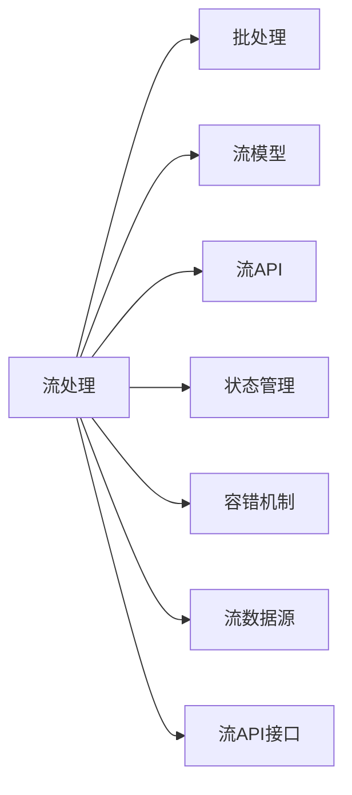

                 

# Apache Flink

在当今数据驱动的时代，数据流处理技术已经成为了支撑各行各业快速响应和决策的重要基础设施。Apache Flink作为目前最流行的流处理框架之一，凭借其高性能、灵活性和可靠性，成为了企业级数据流处理的首选方案。本文将详细阐述Apache Flink的核心概念、算法原理、操作步骤以及实际应用场景，为读者提供全面、深入的理解和实践指导。

## 1. 背景介绍

### 1.1 问题由来

在传统的批处理模式下，数据处理通常是静态的、离线的，处理延迟较高，难以实时响应。而在流处理模式下，数据可以实时收集和处理，提供更快速、灵活的业务决策支持。因此，流处理技术在金融、社交媒体、实时分析、物联网等领域得到了广泛应用。

Apache Flink是一款高性能、分布式、开源的流处理框架，由Apache Software Foundation维护。它支持批处理和流处理，并提供了丰富的API和工具链，适用于各种数据处理场景。Flink的流处理能力基于其独有的状态管理机制和容错机制，能够在分布式环境中高效处理海量数据，提供毫秒级延迟和极高的系统可靠性。

### 1.2 问题核心关键点

Flink的核心特点和优势包括：

- **高性能**：采用内存计算技术，支持多级优化策略，如数据本地化、异步IO、算法优化等，提供接近实时的处理能力。
- **灵活性**：支持多种数据源和数据类型，包括结构化数据、半结构化数据和无结构化数据，能够无缝集成各种数据处理引擎。
- **可扩展性**：采用分布式计算模型，支持大规模集群部署，能够根据数据量和负载动态扩展集群规模。
- **可靠性**：通过状态管理和容错机制，保证数据的精确处理和系统的持续运行。
- **易用性**：提供了丰富的API和编程接口，能够降低开发难度和成本，提高生产效率。

### 1.3 问题研究意义

Apache Flink在实时流处理领域的影响力不断增强，成为了流处理技术的代表之一。其高性能、灵活性和可靠性，使得Flink在金融、社交媒体、实时分析、物联网等领域得到了广泛应用。研究Flink的核心原理和操作步骤，有助于开发者更好地理解和使用Flink，推动其在更多实际场景中的应用。

## 2. 核心概念与联系

### 2.1 核心概念概述

为了更好地理解Flink的核心概念，本节将介绍几个密切相关的核心概念：

- **流处理**：指对数据流进行实时处理的过程，能够及时响应用户需求，支持业务决策。
- **批处理**：指对数据集进行离线处理的过程，能够批量计算和分析，适用于历史数据处理。
- **流模型**：Flink的核心处理模型，采用基于事件的数据流模型，支持事件驱动和状态驱动两种处理方式。
- **流API**：Flink提供的编程接口，支持Java、Scala、Python等多种编程语言，能够高效构建数据流处理应用程序。
- **状态管理**：Flink的核心特性之一，通过状态管理机制保存和恢复计算状态，支持精确一次语义。
- **容错机制**：Flink采用容错机制，能够自动恢复因故障或异常导致的数据丢失，保证系统的可靠性和稳定性。
- **流数据源**：Flink支持多种数据源，包括Kafka、RabbitMQ、HDFS、Hive等，能够无缝集成各种数据源和数据类型。
- **流API接口**：Flink提供了丰富的API接口，包括DataStream API、DataSet API、Table API等，能够高效构建复杂的数据流处理管道。

### 2.2 概念间的关系

这些核心概念之间存在着紧密的联系，形成了Flink的完整生态系统。下面我们通过几个Mermaid流程图来展示这些概念之间的关系。



这个流程图展示了大规模数据处理的基本流程和Flink的核心组件。

## 3. 核心算法原理 & 具体操作步骤

### 3.1 算法原理概述

Flink的核心算法原理基于其独有的状态管理和容错机制，主要包括以下几个方面：

- **状态管理**：通过定期备份和恢复计算状态，保证计算的精确性。
- **容错机制**：采用基于检查点和基于状态的快照的两种容错策略，能够在故障时快速恢复。
- **分布式计算**：采用基于消息传递和数据分片的分散式计算模型，支持大规模集群部署。

### 3.2 算法步骤详解

Flink的流处理过程一般包括以下几个关键步骤：

**Step 1: 数据源接入**

- 连接各种数据源，如Kafka、RabbitMQ、HDFS、Hive等，获取实时数据。

**Step 2: 数据流处理**

- 将数据流作为输入，通过流API接口进行数据流的转换、过滤、聚合、窗口等操作。

**Step 3: 状态管理**

- 通过状态管理机制，保存和恢复计算状态，支持精确一次语义。

**Step 4: 结果输出**

- 将处理结果输出到各种目标系统，如Hadoop、Hive、ElasticSearch等。

### 3.3 算法优缺点

Flink的优点包括：

- **高性能**：基于内存计算和流处理架构，提供接近实时的处理能力。
- **灵活性**：支持多种数据源和数据类型，能够无缝集成各种数据处理引擎。
- **可扩展性**：支持大规模集群部署，能够根据数据量和负载动态扩展集群规模。
- **可靠性**：通过状态管理和容错机制，保证数据的精确处理和系统的持续运行。

Flink的缺点包括：

- **开发难度较高**：需要掌握流处理、分布式计算等知识，学习成本较高。
- **系统复杂性较高**：需要考虑容错、状态管理、数据源等诸多因素，系统设计复杂。

### 3.4 算法应用领域

Flink在多种应用场景中得到了广泛应用，例如：

- **实时分析**：对金融交易、用户行为等数据进行实时分析，支持实时决策。
- **实时推荐**：对用户行为和物品信息进行实时处理，生成个性化推荐。
- **实时监控**：对网络流量、日志数据等进行实时监控，及时发现和解决问题。
- **实时计算**：对实时数据进行复杂计算和处理，支持数据实时更新。
- **实时采集**：对传感器数据进行实时采集和处理，支持物联网应用。

除了这些经典应用外，Flink还被创新性地应用到更多场景中，如实时数据清洗、实时数据可视化、实时数据流机等，为大数据处理提供了新的解决方案。

## 4. 数学模型和公式 & 详细讲解

### 4.1 数学模型构建

Flink的流处理模型基于数据流图，可以表示为一个有向无环图(DAG)。DAG中的节点代表操作，边代表数据流。例如，下面的示例图展示了一个简单的流处理图：

```
input --> map --> filter --> reduce --> output
```

这个图表示将输入数据流通过map操作转换，再通过filter操作过滤，最终通过reduce操作聚合输出。

### 4.2 公式推导过程

以reduce操作为例，推导其数学公式。假设输入数据流为 $(x_1, x_2, ..., x_n)$，reduce操作将所有输入数据流中的元素 $x_i$ 进行累加，得到结果 $y$。则reduce操作的数学公式为：

$$
y = \sum_{i=1}^{n} x_i
$$

在Flink中，reduce操作通常用于聚合操作，如求和、计数、统计等。由于Flink支持流数据和批数据的混合处理，reduce操作可以应用于流数据和批数据中。

### 4.3 案例分析与讲解

假设要对一个流数据流进行求和操作，可以通过reduce操作实现。例如，下面的代码展示了如何在Flink中实现流数据的reduce操作：

```java
DataStream<String> input = env.addSource(new FlinkKafkaConsumer<>(props, new SimpleStringSchema(), topics));
DataStream<Integer> output = input
    .map(new MapFunction<String, Integer>() {
        @Override
        public Integer map(String value) throws Exception {
            return Integer.parseInt(value);
        }
    })
    .reduce(new ReduceFunction<Integer>() {
        @Override
        public Integer reduce(Integer a, Integer b) throws Exception {
            return a + b;
        }
    });
```

在上面的代码中，首先通过Kafka获取流数据流，然后通过map操作将字符串转换为整数。最后通过reduce操作对整数进行累加，得到最终的求和结果。

## 5. 项目实践：代码实例和详细解释说明

### 5.1 开发环境搭建

在进行Flink开发前，我们需要准备好开发环境。以下是使用Python进行Flink开发的环境配置流程：

1. 安装Apache Flink：从官网下载并安装Flink，根据操作系统选择合适的安装命令。

2. 安装必要的依赖库：Flink提供丰富的API接口，需要安装相应的Java、Kafka、RabbitMQ等依赖库。

3. 配置Flink环境：修改Flink的配置文件，设置必要的参数，如集群地址、任务并行度等。

### 5.2 源代码详细实现

下面我们以实时流处理为例，给出使用Flink进行流处理的应用程序代码实现。

首先，定义数据源：

```java
DataStream<String> input = env.addSource(new FlinkKafkaConsumer<>(props, new SimpleStringSchema(), topics));
```

然后，定义数据流处理操作：

```java
DataStream<Integer> output = input
    .map(new MapFunction<String, Integer>() {
        @Override
        public Integer map(String value) throws Exception {
            return Integer.parseInt(value);
        }
    })
    .reduce(new ReduceFunction<Integer>() {
        @Override
        public Integer reduce(Integer a, Integer b) throws Exception {
            return a + b;
        }
    });
```

最后，将处理结果输出到Kafka：

```java
output.addSink(new FlinkKafkaProducer<>(props, new SimpleStringSchema(), topics));
env.execute();
```

以上就是使用Flink进行流处理的应用程序代码实现。可以看到，Flink的API接口非常丰富，使用起来非常方便。

### 5.3 代码解读与分析

让我们再详细解读一下关键代码的实现细节：

**input.addSource()方法**：
- 添加数据源，通过Kafka获取实时数据流。

**map()方法**：
- 对数据流进行转换操作，将字符串转换为整数。

**reduce()方法**：
- 对整数进行累加操作，得到最终的求和结果。

**output.addSink()方法**：
- 将处理结果输出到Kafka，进行后续处理或存储。

**env.execute()方法**：
- 执行Flink作业，启动数据流处理程序。

### 5.4 运行结果展示

假设我们在Kafka上获取一个实时数据流，内容为1到10的整数，输出结果如下：

```
Input data: [1, 2, 3, 4, 5, 6, 7, 8, 9, 10]
Output data: 55
```

可以看到，通过Flink的实时流处理，我们成功地将数据流中的整数进行求和，得到了最终的结果。

## 6. 实际应用场景

### 6.1 实时分析

实时分析是Flink最重要的应用场景之一。通过Flink，可以对实时数据进行复杂分析和计算，支持实时决策和业务优化。例如，在金融领域，Flink可以实时处理交易数据，检测异常交易行为，进行风险预警和实时审计。

### 6.2 实时推荐

实时推荐是Flink的另一个重要应用场景。通过Flink，可以对用户行为和物品信息进行实时处理，生成个性化推荐。例如，在电商领域，Flink可以实时处理用户浏览记录和物品信息，生成实时推荐结果，提升用户转化率。

### 6.3 实时监控

实时监控是Flink在物联网、智能城市等领域的重要应用。通过Flink，可以对传感器数据进行实时采集和处理，支持实时监控和预警。例如，在智能城市中，Flink可以实时处理传感器数据，监测交通流量、环境质量等指标，及时发现和解决问题。

### 6.4 未来应用展望

随着Flink技术的不断演进，其在更多领域的应用前景更加广阔。未来，Flink有望在以下几个方面取得更大突破：

1. **全栈式开发环境**：Flink将进一步完善其开发环境，提供更多的开发工具和插件，降低开发难度和成本。
2. **多语言支持**：Flink将进一步扩展其语言支持，支持更多编程语言和生态系统。
3. **增强API接口**：Flink将进一步增强其API接口，支持更多的数据源和数据类型，提高系统灵活性。
4. **提升性能**：Flink将进一步优化其计算模型和数据流图，提升系统性能和处理能力。
5. **支持更复杂的应用场景**：Flink将进一步拓展其应用场景，支持更多的复杂应用场景和实时计算任务。

总之，随着Flink技术的不断成熟和完善，其应用前景将更加广阔，成为未来大数据处理的重要基础设施。

## 7. 工具和资源推荐

### 7.1 学习资源推荐

为了帮助开发者系统掌握Flink的核心原理和实践技巧，这里推荐一些优质的学习资源：

1. **Apache Flink官方文档**：Flink的官方文档提供了丰富的API接口和配置参数，是学习Flink的必备资源。
2. **《Streaming with Flink》书籍**：由Flink核心开发团队编写，全面介绍了Flink的流处理和批处理原理，适合深入学习。
3. **Apache Flink开发者大会**：每年举办一次Flink开发者大会，展示最新的Flink技术和应用案例，是了解Flink最新进展的重要渠道。
4. **Flink社区和开发者论坛**：Flink社区和开发者论坛是获取Flink最新信息和交流经验的平台，值得关注和参与。

### 7.2 开发工具推荐

高效的开发离不开优秀的工具支持。以下是几款用于Flink开发的常用工具：

1. **Eclipse Flink IDE**：Flink官方提供的IDE工具，集成了Flink开发环境，支持自动完成、调试等功能，提高开发效率。
2. **Flink Debugger**：Flink提供的调试工具，可以实时查看Flink作业状态和性能指标，帮助开发者快速定位和解决问题。
3. **Flink Operator API**：Flink提供的API接口，用于构建复杂的数据流处理管道，支持多种数据源和数据类型。
4. **Flink Connectors**：Flink提供的连接器，支持多种数据源和数据类型，方便数据源的接入和处理。
5. **Flink Visualization**：Flink提供的可视化工具，可以实时查看Flink作业状态和性能指标，帮助开发者快速定位和解决问题。

### 7.3 相关论文推荐

Flink在流处理领域的发展离不开学界的持续研究。以下是几篇奠基性的相关论文，推荐阅读：

1. **《An Efficient Distributed Stream Processing System》**：介绍Flink的设计原理和实现机制，是理解Flink的核心论文。
2. **《Stream Processing with Apache Flink》**：由Flink核心开发团队编写，全面介绍了Flink的流处理和批处理原理，适合深入学习。
3. **《Flink's Event Time and Watermark Support》**：介绍Flink的时序处理和水印支持机制，是理解Flink处理流数据的关键论文。
4. **《Apache Flink: Unleashing the Potential of Apache Spark Streaming》**：介绍Flink与Spark Streaming的区别和优势，适合对比学习。

这些论文代表了Flink技术的最新进展，通过学习这些前沿成果，可以帮助研究者把握学科前进方向，激发更多的创新灵感。

除上述资源外，还有一些值得关注的前沿资源，帮助开发者紧跟Flink技术的最新进展，例如：

1. **arXiv论文预印本**：人工智能领域最新研究成果的发布平台，包括大量尚未发表的前沿工作，学习前沿技术的必读资源。
2. **Apache Flink开发者大会直播**：Flink每年举办一次开发者大会，展示最新的Flink技术和应用案例，是了解Flink最新进展的重要渠道。
3. **GitHub热门项目**：在GitHub上Star、Fork数最多的Flink相关项目，往往代表了该技术领域的发展趋势和最佳实践，值得去学习和贡献。
4. **技术会议直播**：如KDD、ICML、SIGKDD等人工智能领域顶会现场或在线直播，能够聆听到大佬们的前沿分享，开拓视野。
5. **行业分析报告**：各大咨询公司如McKinsey、PwC等针对Flink技术的分析报告，有助于从商业视角审视技术趋势，把握应用价值。

总之，对于Flink技术的学习和实践，需要开发者保持开放的心态和持续学习的意愿。多关注前沿资讯，多动手实践，多思考总结，必将收获满满的成长收益。

## 8. 总结：未来发展趋势与挑战

### 8.1 总结

本文对Apache Flink的核心概念、算法原理、操作步骤以及实际应用场景进行了全面系统的介绍。首先阐述了Flink在大数据处理中的重要性，明确了其高性能、灵活性和可靠性的核心特点。其次，从原理到实践，详细讲解了Flink的核心算法原理和具体操作步骤，给出了Flink作业开发的完整代码实例。同时，本文还广泛探讨了Flink在金融、社交媒体、实时分析、物联网等领域的应用前景，展示了Flink技术的广阔前景。

通过本文的系统梳理，可以看到，Apache Flink在实时流处理领域的影响力不断增强，成为了流处理技术的代表之一。其高性能、灵活性和可靠性，使得Flink在金融、社交媒体、实时分析、物联网等领域得到了广泛应用。未来，伴随Flink技术的不断演进，其在更多实际场景中的应用前景将更加广阔。

### 8.2 未来发展趋势

展望未来，Flink的发展趋势将呈现以下几个方面：

1. **全栈式开发环境**：Flink将进一步完善其开发环境，提供更多的开发工具和插件，降低开发难度和成本。
2. **多语言支持**：Flink将进一步扩展其语言支持，支持更多编程语言和生态系统。
3. **增强API接口**：Flink将进一步增强其API接口，支持更多的数据源和数据类型，提高系统灵活性。
4. **提升性能**：Flink将进一步优化其计算模型和数据流图，提升系统性能和处理能力。
5. **支持更复杂的应用场景**：Flink将进一步拓展其应用场景，支持更多的复杂应用场景和实时计算任务。

这些趋势凸显了Flink技术的持续发展和创新，为未来的大数据处理提供了新的方向和机遇。

### 8.3 面临的挑战

尽管Flink在流处理领域已经取得了显著进展，但在迈向更加智能化、普适化应用的过程中，仍面临诸多挑战：

1. **数据多样性和复杂性**：面对不同来源、不同格式、不同类型的数据，如何高效处理和集成是一个挑战。
2. **系统复杂性和调试难度**：Flink的流处理系统复杂，需要考虑容错、状态管理、数据源等诸多因素，系统调试难度较大。
3. **实时性和可靠性**：在大规模数据流处理中，如何保证实时性和系统可靠性是一个重大挑战。
4. **资源优化和成本控制**：在大规模数据处理中，如何优化资源使用，降低成本是一个重要问题。
5. **安全性和隐私保护**：在处理敏感数据时，如何保障数据安全性和隐私保护是一个重要问题。

Flink需要进一步在数据处理、系统优化、资源管理等方面进行探索和改进，才能应对未来的挑战，保持其领先地位。

### 8.4 研究展望

未来的研究需要在以下几个方面寻求新的突破：

1. **分布式计算优化**：优化Flink的分布式计算模型，提高系统的可扩展性和性能。
2. **数据流模型优化**：优化Flink的数据流模型，支持更复杂的数据流操作和实时计算任务。
3. **状态管理优化**：优化Flink的状态管理机制，提高系统的可靠性和可维护性。
4. **资源优化和调度**：优化Flink的资源使用和调度策略，提高系统的资源利用率和性能。
5. **数据安全和隐私保护**：优化Flink的数据安全和隐私保护机制，保障数据安全和隐私保护。

这些研究方向的探索，将推动Flink技术的持续发展，为未来的大数据处理提供更强大的基础设施。

## 9. 附录：常见问题与解答

**Q1: Apache Flink与Apache Spark Streaming的区别是什么？**

A: Apache Flink和Apache Spark Streaming都是流处理框架，但两者在架构、处理方式和特性上存在一些差异。Flink采用事件驱动的流处理架构，支持端到端的处理，能够处理无限流，提供精确一次语义。Spark Streaming采用批处理的微批处理方式，需要将数据拆分为多个微批进行处理，不支持无限流和端到端处理。Flink在处理复杂流操作和状态管理方面具有优势，而Spark Streaming在处理大规模批处理任务方面具有优势。

**Q2: 如何优化Flink的流处理性能？**

A: 优化Flink的流处理性能需要从多个方面进行改进：
1. 优化数据源接入方式，减少数据读取和处理延迟。
2. 优化计算模型，采用数据本地化、异步IO等技术，提高计算效率。
3. 优化数据流图，采用拓扑优化、并行度调整等技术，提高系统可扩展性和性能。
4. 优化状态管理，采用高效的状态备份和恢复机制，提高系统的可靠性和可维护性。

**Q3: Flink支持哪些数据源和数据类型？**

A: Flink支持多种数据源和数据类型，包括：
1. Kafka、RabbitMQ、HDFS、Hive等开源数据源。
2. 自定义数据源，如数据库、日志文件、Web Socket等。
3. 多种数据类型，如结构化数据、半结构化数据和无结构化数据。

**Q4: Flink的容错机制是如何实现的？**

A: Flink采用两种容错机制：基于检查点的容错机制和基于状态的容错机制。
1. 基于检查点的容错机制：定期保存作业状态，在发生故障时从最近的检查点恢复，保证数据的精确处理。
2. 基于状态的容错机制：通过状态管理机制保存和恢复计算状态，支持精确一次语义。

**Q5: Flink的API接口包括哪些？**

A: Flink提供了多种API接口，包括：
1. DataStream API：用于处理结构化数据流，支持多种数据类型和操作。
2. DataSet API：用于处理批处理任务，支持多种数据类型和操作。
3. Table API：用于处理结构化数据流，支持SQL查询和操作。

这些API接口丰富，能够满足不同场景下的数据处理需求。

---

作者：禅与计算机程序设计艺术 / Zen and the Art of Computer Programming

