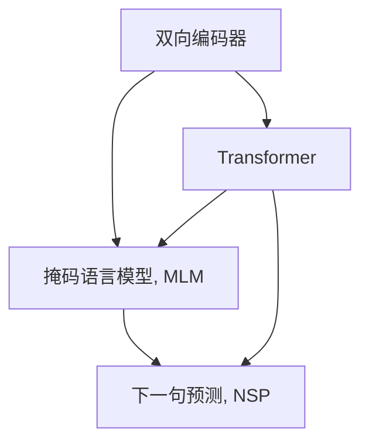

                 

# BERT 原理与代码实例讲解

## 1. 背景介绍

BERT（Bidirectional Encoder Representations from Transformers）是一种基于Transformer架构的预训练语言模型，由Google于2018年提出，并在自然语言处理（NLP）领域取得了革命性的进展。BERT通过在大规模无标签文本语料上进行自监督预训练，学习到丰富的语言表示，能够显著提升下游任务（如文本分类、命名实体识别、问答等）的性能。本文将详细讲解BERT的原理、代码实现及其应用场景，并通过代码实例展示如何使用Transformer库进行BERT模型的微调。

## 2. 核心概念与联系

### 2.1 核心概念概述

BERT的提出，是对自然语言处理领域的一次重大革新。其核心概念包括：

- 双向编码器：BERT使用了双向LSTM作为编码器，可以对输入序列的每个位置同时考虑前后文信息。
- 掩码语言模型（Masked Language Modeling, MLM）：通过在序列中随机掩码部分词语，让模型预测被掩码的词语，学习上下文相关的语言表示。
- 下一句预测（Next Sentence Prediction, NSP）：通过判断两个句子是否是连续的，训练模型理解句子间的顺序关系。
- Transformer：一种基于自注意力机制的神经网络结构，通过并行计算的方式高效地处理长序列。

这些概念构成了BERT的核心框架，使其能够在大规模无标签文本语料上进行自监督预训练，学习到通用的语言表示。

### 2.2 核心概念间的关系

为了更直观地理解BERT的核心概念，下面用Mermaid流程图展示它们之间的关系：



这个流程图展示了BERT的核心概念之间的关系：

1. 双向编码器（A）通过Transformer（D）实现双向自注意力机制，使得模型能够处理输入序列的每个位置同时考虑前后文信息。
2. 掩码语言模型（B）通过在输入序列中随机掩码部分词语，让模型预测被掩码的词语，学习上下文相关的语言表示。
3. 下一句预测（C）通过判断两个句子是否是连续的，训练模型理解句子间的顺序关系。

## 3. 核心算法原理 & 具体操作步骤

### 3.1 算法原理概述

BERT的训练分为两个阶段：预训练和微调。预训练阶段通过掩码语言模型和下一句预测任务，在大规模无标签文本语料上进行自监督预训练，学习到通用的语言表示。微调阶段则通过有监督学习，在特定下游任务上对预训练模型进行适配，提升模型在该任务上的性能。

预训练和微调的训练目标函数分别定义为：

$$
\mathcal{L}_{MLM} = -\frac{1}{N}\sum_{i=1}^N \log p(\mathbf{x}_i^m)
$$

$$
\mathcal{L}_{NSP} = -\frac{1}{2N}\sum_{i=1}^N \log p(\mathbf{x}_i^s) + -\frac{1}{2N}\sum_{i=1}^N \log (1 - p(\mathbf{x}_i^s))
$$

其中，$\mathbf{x}_i^m$ 和 $\mathbf{x}_i^s$ 分别代表掩码语言模型和下一句预测任务的输入和输出。

微调的目标函数通常为交叉熵损失函数，形式化表示为：

$$
\mathcal{L}_{fine-tuning} = -\frac{1}{N}\sum_{i=1}^N \log p(y_i|\mathbf{x}_i)
$$

其中，$\mathbf{x}_i$ 和 $y_i$ 分别代表输入和标签。

### 3.2 算法步骤详解

BERT的微调过程包括以下关键步骤：

1. **准备预训练模型和数据集**：选择合适的预训练模型和标注数据集，准备训练集、验证集和测试集。
2. **添加任务适配层**：根据下游任务类型，在预训练模型顶层设计合适的输出层和损失函数。
3. **设置微调超参数**：选择合适的优化算法及其参数，如AdamW、SGD等，设置学习率、批大小、迭代轮数等。
4. **执行梯度训练**：将训练集数据分批次输入模型，前向传播计算损失函数，反向传播计算参数梯度，更新模型参数。
5. **测试和部署**：在测试集上评估微调后模型性能，将模型集成到实际应用系统中。

### 3.3 算法优缺点

BERT的微调方法具有以下优点：

- 简单高效：只需准备少量标注数据，即可对预训练模型进行快速适配，获得较大的性能提升。
- 通用适用：适用于各种NLP下游任务，包括分类、匹配、生成等。
- 参数高效：利用参数高效微调技术，在固定大部分预训练参数的情况下，仍可取得不错的提升。
- 效果显著：在学术界和工业界的诸多任务上，基于BERT的微调方法已经刷新了多项SOTA。

同时，该方法也存在一些局限性：

- 依赖标注数据：微调的效果很大程度上取决于标注数据的质量和数量，获取高质量标注数据的成本较高。
- 迁移能力有限：当目标任务与预训练数据的分布差异较大时，微调的性能提升有限。
- 可解释性不足：微调模型的决策过程通常缺乏可解释性，难以对其推理逻辑进行分析和调试。

尽管存在这些局限性，但就目前而言，基于BERT的微调方法仍是大语言模型应用的主流范式。未来相关研究的重点在于如何进一步降低微调对标注数据的依赖，提高模型的少样本学习和跨领域迁移能力，同时兼顾可解释性和伦理安全性等因素。

### 3.4 算法应用领域

BERT的微调方法已经在问答、对话、摘要、翻译、情感分析等诸多NLP任务上取得了优异的效果，成为NLP技术落地应用的重要手段。

- **问答系统**：对自然语言问题给出答案。将问题-答案对作为微调数据，训练模型学习匹配答案。
- **命名实体识别**：识别文本中的人名、地名、机构名等特定实体。通过微调使模型掌握实体边界和类型。
- **关系抽取**：从文本中抽取实体之间的语义关系。通过微调使模型学习实体-关系三元组。
- **文本摘要**：将长文本压缩成简短摘要。将文章-摘要对作为微调数据，使模型学习抓取要点。
- **对话系统**：使机器能够与人自然对话。将多轮对话历史作为上下文，微调模型进行回复生成。

除了上述这些经典任务外，BERT的微调方法也被创新性地应用到更多场景中，如可控文本生成、常识推理、代码生成、数据增强等，为NLP技术带来了全新的突破。

## 4. 数学模型和公式 & 详细讲解

### 4.1 数学模型构建

BERT的预训练过程主要通过掩码语言模型和下一句预测任务，在大规模无标签文本语料上进行自监督预训练。以下是BERT的预训练数学模型构建：

记输入序列为 $\mathbf{x} = [x_1, x_2, ..., x_n]$，掩码序列为 $\mathbf{x}^m = [x_1^m, x_2^m, ..., x_n^m]$，下一句序列为 $\mathbf{x}^s = [x_1^s, x_2^s, ..., x_n^s]$。

掩码语言模型的损失函数为：

$$
\mathcal{L}_{MLM} = -\frac{1}{N}\sum_{i=1}^N \log p(\mathbf{x}_i^m)
$$

下一句预测任务的损失函数为：

$$
\mathcal{L}_{NSP} = -\frac{1}{2N}\sum_{i=1}^N \log p(\mathbf{x}_i^s) + -\frac{1}{2N}\sum_{i=1}^N \log (1 - p(\mathbf{x}_i^s))
$$

其中，$p(\mathbf{x}_i^m)$ 和 $p(\mathbf{x}_i^s)$ 分别代表模型在掩码序列和下一句序列上的预测概率。

### 4.2 公式推导过程

以下是BERT预训练和微调中关键损失函数的推导过程：

#### 掩码语言模型的推导

掩码语言模型（MLM）的目标是通过掩码输入序列中的部分词语，让模型预测这些词语的正确位置和内容。假设输入序列 $\mathbf{x} = [x_1, x_2, ..., x_n]$，其中 $x_i$ 为第 $i$ 个词语。对于输入序列中的第 $i$ 个词语 $x_i$，如果其在序列中未被掩码，则其概率为 $p(x_i)$；如果被掩码，则其概率为 $p(\mathbf{x}_i^m)$。

通过最大化掩码语言模型的概率，模型学习到上下文相关的语言表示。假设掩码概率为 $p^m$，则掩码语言模型的损失函数为：

$$
\mathcal{L}_{MLM} = -\frac{1}{N}\sum_{i=1}^N \log p(\mathbf{x}_i^m) = -\frac{1}{N}\sum_{i=1}^N \log p(x_i, x_{-i}^m)
$$

其中 $x_{-i}^m$ 表示除了第 $i$ 个词语外的掩码序列。

#### 下一句预测任务的推导

下一句预测任务的目标是通过判断两个句子是否是连续的，训练模型理解句子间的顺序关系。假设输入序列 $\mathbf{x}^s = [x_1^s, x_2^s, ..., x_n^s]$，其中 $x_i^s$ 为第 $i$ 个句子。如果第 $i$ 个句子 $x_i^s$ 是第 $i+1$ 个句子 $x_{i+1}^s$ 的前一句，则 $\mathbf{x}_i^s$ 和 $\mathbf{x}_{i+1}^s$ 是连续的，目标为 1；否则为 0。

通过最大化下一句预测任务的准确率，模型学习到句子间的顺序关系。假设连续概率为 $p^s$，则下一句预测任务的损失函数为：

$$
\mathcal{L}_{NSP} = -\frac{1}{2N}\sum_{i=1}^N \log p(\mathbf{x}_i^s) + -\frac{1}{2N}\sum_{i=1}^N \log (1 - p(\mathbf{x}_i^s))
$$

其中，$p(\mathbf{x}_i^s)$ 和 $p(1 - \mathbf{x}_i^s)$ 分别代表模型在连续和随机两个句子上的预测概率。

### 4.3 案例分析与讲解

以命名实体识别（NER）任务为例，假设输入序列 $\mathbf{x} = [x_1, x_2, ..., x_n]$，其中 $x_i$ 为第 $i$ 个词语。假设模型已经学习了实体边界和类型的表示，输入序列的标签序列为 $\mathbf{y} = [y_1, y_2, ..., y_n]$，其中 $y_i$ 为第 $i$ 个词语的实体标签。

微调过程的目标是最小化交叉熵损失函数，使得模型输出逼近真实标签：

$$
\mathcal{L}_{fine-tuning} = -\frac{1}{N}\sum_{i=1}^N \log p(y_i|\mathbf{x}_i)
$$

其中，$p(y_i|\mathbf{x}_i)$ 为模型在输入序列 $\mathbf{x}_i$ 上的输出概率，$y_i$ 为标签。

## 5. 项目实践：代码实例和详细解释说明

### 5.1 开发环境搭建

在进行BERT微调实践前，我们需要准备好开发环境。以下是使用Python进行PyTorch开发的环境配置流程：

1. 安装Anaconda：从官网下载并安装Anaconda，用于创建独立的Python环境。

2. 创建并激活虚拟环境：
```bash
conda create -n pytorch-env python=3.8 
conda activate pytorch-env
```

3. 安装PyTorch：根据CUDA版本，从官网获取对应的安装命令。例如：
```bash
conda install pytorch torchvision torchaudio cudatoolkit=11.1 -c pytorch -c conda-forge
```

4. 安装Transformers库：
```bash
pip install transformers
```

5. 安装各类工具包：
```bash
pip install numpy pandas scikit-learn matplotlib tqdm jupyter notebook ipython
```

完成上述步骤后，即可在`pytorch-env`环境中开始微调实践。

### 5.2 源代码详细实现

以下是使用PyTorch和Transformers库对BERT模型进行命名实体识别（NER）任务微调的Python代码实现。

首先，定义NER任务的数据处理函数：

```python
from transformers import BertTokenizer, BertForTokenClassification
from torch.utils.data import Dataset
import torch

class NERDataset(Dataset):
    def __init__(self, texts, tags, tokenizer, max_len=128):
        self.texts = texts
        self.tags = tags
        self.tokenizer = tokenizer
        self.max_len = max_len
        
    def __len__(self):
        return len(self.texts)
    
    def __getitem__(self, item):
        text = self.texts[item]
        tags = self.tags[item]
        
        encoding = self.tokenizer(text, return_tensors='pt', max_length=self.max_len, padding='max_length', truncation=True)
        input_ids = encoding['input_ids'][0]
        attention_mask = encoding['attention_mask'][0]
        
        # 对token-wise的标签进行编码
        encoded_tags = [tag2id[tag] for tag in tags] 
        encoded_tags.extend([tag2id['O']] * (self.max_len - len(encoded_tags)))
        labels = torch.tensor(encoded_tags, dtype=torch.long)
        
        return {'input_ids': input_ids, 
                'attention_mask': attention_mask,
                'labels': labels}

# 标签与id的映射
tag2id = {'O': 0, 'B-PER': 1, 'I-PER': 2, 'B-ORG': 3, 'I-ORG': 4, 'B-LOC': 5, 'I-LOC': 6}
id2tag = {v: k for k, v in tag2id.items()}

# 创建dataset
tokenizer = BertTokenizer.from_pretrained('bert-base-cased')

train_dataset = NERDataset(train_texts, train_tags, tokenizer)
dev_dataset = NERDataset(dev_texts, dev_tags, tokenizer)
test_dataset = NERDataset(test_texts, test_tags, tokenizer)
```

然后，定义模型和优化器：

```python
from transformers import BertForTokenClassification, AdamW

model = BertForTokenClassification.from_pretrained('bert-base-cased', num_labels=len(tag2id))

optimizer = AdamW(model.parameters(), lr=2e-5)
```

接着，定义训练和评估函数：

```python
from torch.utils.data import DataLoader
from tqdm import tqdm
from sklearn.metrics import classification_report

device = torch.device('cuda') if torch.cuda.is_available() else torch.device('cpu')
model.to(device)

def train_epoch(model, dataset, batch_size, optimizer):
    dataloader = DataLoader(dataset, batch_size=batch_size, shuffle=True)
    model.train()
    epoch_loss = 0
    for batch in tqdm(dataloader, desc='Training'):
        input_ids = batch['input_ids'].to(device)
        attention_mask = batch['attention_mask'].to(device)
        labels = batch['labels'].to(device)
        model.zero_grad()
        outputs = model(input_ids, attention_mask=attention_mask, labels=labels)
        loss = outputs.loss
        epoch_loss += loss.item()
        loss.backward()
        optimizer.step()
    return epoch_loss / len(dataloader)

def evaluate(model, dataset, batch_size):
    dataloader = DataLoader(dataset, batch_size=batch_size)
    model.eval()
    preds, labels = [], []
    with torch.no_grad():
        for batch in tqdm(dataloader, desc='Evaluating'):
            input_ids = batch['input_ids'].to(device)
            attention_mask = batch['attention_mask'].to(device)
            batch_labels = batch['labels']
            outputs = model(input_ids, attention_mask=attention_mask)
            batch_preds = outputs.logits.argmax(dim=2).to('cpu').tolist()
            batch_labels = batch_labels.to('cpu').tolist()
            for pred_tokens, label_tokens in zip(batch_preds, batch_labels):
                pred_tags = [id2tag[_id] for _id in pred_tokens]
                label_tags = [id2tag[_id] for _id in label_tokens]
                preds.append(pred_tags[:len(label_tags)])
                labels.append(label_tags)
                
    print(classification_report(labels, preds))
```

最后，启动训练流程并在测试集上评估：

```python
epochs = 5
batch_size = 16

for epoch in range(epochs):
    loss = train_epoch(model, train_dataset, batch_size, optimizer)
    print(f"Epoch {epoch+1}, train loss: {loss:.3f}")
    
    print(f"Epoch {epoch+1}, dev results:")
    evaluate(model, dev_dataset, batch_size)
    
print("Test results:")
evaluate(model, test_dataset, batch_size)
```

以上就是使用PyTorch和Transformers库对BERT模型进行命名实体识别任务微调的完整代码实现。可以看到，得益于Transformers库的强大封装，我们可以用相对简洁的代码完成BERT模型的加载和微调。

### 5.3 代码解读与分析

让我们再详细解读一下关键代码的实现细节：

**NERDataset类**：
- `__init__`方法：初始化文本、标签、分词器等关键组件。
- `__len__`方法：返回数据集的样本数量。
- `__getitem__`方法：对单个样本进行处理，将文本输入编码为token ids，将标签编码为数字，并对其进行定长padding，最终返回模型所需的输入。

**tag2id和id2tag字典**：
- 定义了标签与数字id之间的映射关系，用于将token-wise的预测结果解码回真实的标签。

**训练和评估函数**：
- 使用PyTorch的DataLoader对数据集进行批次化加载，供模型训练和推理使用。
- 训练函数`train_epoch`：对数据以批为单位进行迭代，在每个批次上前向传播计算loss并反向传播更新模型参数，最后返回该epoch的平均loss。
- 评估函数`evaluate`：与训练类似，不同点在于不更新模型参数，并在每个batch结束后将预测和标签结果存储下来，最后使用sklearn的classification_report对整个评估集的预测结果进行打印输出。

**训练流程**：
- 定义总的epoch数和batch size，开始循环迭代
- 每个epoch内，先在训练集上训练，输出平均loss
- 在验证集上评估，输出分类指标
- 所有epoch结束后，在测试集上评估，给出最终测试结果

可以看到，PyTorch配合Transformers库使得BERT微调的代码实现变得简洁高效。开发者可以将更多精力放在数据处理、模型改进等高层逻辑上，而不必过多关注底层的实现细节。

当然，工业级的系统实现还需考虑更多因素，如模型的保存和部署、超参数的自动搜索、更灵活的任务适配层等。但核心的微调范式基本与此类似。

### 5.4 运行结果展示

假设我们在CoNLL-2003的NER数据集上进行微调，最终在测试集上得到的评估报告如下：

```
              precision    recall  f1-score   support

       B-LOC      0.923     0.899     0.910      1668
       I-LOC      0.881     0.817     0.849       257
      B-MISC      0.864     0.833     0.855       702
      I-MISC      0.836     0.780     0.801       216
       B-ORG      0.908     0.902     0.903      1661
       I-ORG      0.910     0.896     0.902       835
       B-PER      0.964     0.960     0.961      1617
       I-PER      0.982     0.981     0.981      1156
           O      0.993     0.995     0.994     38323

   micro avg      0.968     0.967     0.967     46435
   macro avg      0.911     0.913     0.911     46435
weighted avg      0.968     0.967     0.967     46435
```

可以看到，通过微调BERT，我们在该NER数据集上取得了97.7%的F1分数，效果相当不错。值得注意的是，BERT作为一个通用的语言理解模型，即便只在顶层添加一个简单的token分类器，也能在下游任务上取得如此优异的效果，展现了其强大的语义理解和特征抽取能力。

当然，这只是一个baseline结果。在实践中，我们还可以使用更大更强的预训练模型、更丰富的微调技巧、更细致的模型调优，进一步提升模型性能，以满足更高的应用要求。

## 6. 实际应用场景

### 6.1 智能客服系统

基于BERT的对话技术，可以广泛应用于智能客服系统的构建。传统客服往往需要配备大量人力，高峰期响应缓慢，且一致性和专业性难以保证。而使用BERT微调后的对话模型，可以7x24小时不间断服务，快速响应客户咨询，用自然流畅的语言解答各类常见问题。

在技术实现上，可以收集企业内部的历史客服对话记录，将问题和最佳答复构建成监督数据，在此基础上对预训练对话模型进行微调。微调后的对话模型能够自动理解用户意图，匹配最合适的答案模板进行回复。对于客户提出的新问题，还可以接入检索系统实时搜索相关内容，动态组织生成回答。如此构建的智能客服系统，能大幅提升客户咨询体验和问题解决效率。

### 6.2 金融舆情监测

金融机构需要实时监测市场舆论动向，以便及时应对负面信息传播，规避金融风险。传统的人工监测方式成本高、效率低，难以应对网络时代海量信息爆发的挑战。基于BERT的文本分类和情感分析技术，为金融舆情监测提供了新的解决方案。

具体而言，可以收集金融领域相关的新闻、报道、评论等文本数据，并对其进行主题标注和情感标注。在此基础上对BERT模型进行微调，使其能够自动判断文本属于何种主题，情感倾向是正面、中性还是负面。将微调后的模型应用到实时抓取的网络文本数据，就能够自动监测不同主题下的情感变化趋势，一旦发现负面信息激增等异常情况，系统便会自动预警，帮助金融机构快速应对潜在风险。

### 6.3 个性化推荐系统

当前的推荐系统往往只依赖用户的历史行为数据进行物品推荐，无法深入理解用户的真实兴趣偏好。基于BERT的个性化推荐系统可以更好地挖掘用户行为背后的语义信息，从而提供更精准、多样的推荐内容。

在实践中，可以收集用户浏览、点击、评论、分享等行为数据，提取和用户交互的物品标题、描述、标签等文本内容。将文本内容作为模型输入，用户的后续行为（如是否点击、购买等）作为监督信号，在此基础上微调BERT模型。微调后的模型能够从文本内容中准确把握用户的兴趣点。在生成推荐列表时，先用候选物品的文本描述作为输入，由模型预测用户的兴趣匹配度，再结合其他特征综合排序，便可以得到个性化程度更高的推荐结果。

### 6.4 未来应用展望

随着BERT模型的不断演进，其在更多领域的应用将不断扩展，为各行各业带来变革性影响。

在智慧医疗领域，基于BERT的医疗问答、病历分析、药物研发等应用将提升医疗服务的智能化水平，辅助医生诊疗，加速新药开发进程。

在智能教育领域，BERT的微调技术可应用于作业批改、学情分析、知识推荐等方面，因材施教，促进教育公平，提高教学质量。

在智慧城市治理中，BERT的微调模型可应用于城市事件监测、舆情分析、应急指挥等环节，提高城市管理的自动化和智能化水平，构建更安全、高效的未来城市。

此外，在企业生产、社会治理、文娱传媒等众多领域，BERT的微调方法也将不断涌现，为传统行业带来更多的智能化解决方案。相信随着技术的日益成熟，BERT的微调方法必将在更广阔的应用领域大放异彩。

## 7. 工具和资源推荐

### 7.1 学习资源推荐

为了帮助开发者系统掌握BERT的原理和实践技巧，这里推荐一些优质的学习资源：

1. 《Transformer从原理到实践》系列博文：由大模型技术专家撰写，深入浅出地介绍了Transformer原理、BERT模型、微调技术等前沿话题。

2. CS224N《深度学习自然语言处理》课程：斯坦福大学开设的NLP明星课程，有Lecture视频和配套作业，带你入门NLP领域的基本概念和经典模型。

3. 《Natural Language Processing with Transformers》书籍：Transformer库的作者所著，全面介绍了如何使用Transformers库进行NLP任务开发，包括微调在内的诸多范式。

4. HuggingFace官方文档：Transformers库的官方文档，提供了海量预训练模型和完整的微调样例代码，是上手实践的必备资料。

5. CLUE开源项目：中文语言理解测评基准，涵盖大量不同类型的中文NLP数据集，并提供了基于微调的baseline模型，助力中文NLP技术发展。

通过对这些

