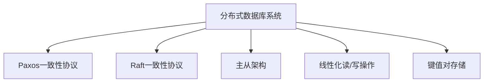

                 

# Cassandra原理与代码实例讲解

## 1. 背景介绍

### 1.1 问题由来

随着互联网的发展，数据存储需求呈指数级增长，传统的单节点关系型数据库已无法满足大规模、高并发、高可用、可扩展等要求。Cassandra是一个开源的分布式数据库管理系统，它旨在为高可扩展性和高可用性而设计。Cassandra能够处理海量的数据，并提供线性扩展性、容错性和故障恢复能力，因此被广泛应用于互联网企业的负载均衡、实时分析、数据仓库等多个场景。

### 1.2 问题核心关键点

Cassandra的核心关键点包括分布式架构、一致性模型、高可用性和线性扩展性等。其分布式架构使得系统可以横向扩展，而一致性模型则保证了系统在高并发和高可用场景下的数据一致性。

- 分布式架构：Cassandra的分布式架构基于Paxos一致性协议，通过多节点间的冗余和负载均衡，提高了系统的容错性和可用性。
- 一致性模型：Cassandra使用类似Raft的一致性模型，保证在节点故障或网络故障时，数据的一致性和完整性。
- 高可用性：Cassandra通过多数据中心分布和节点自动检测和迁移，保证了系统的可用性和稳定性。
- 线性扩展性：Cassandra支持横向扩展，能够在不影响性能的情况下，随着数据的增长不断增加节点，以满足更大的数据存储和处理需求。

## 2. 核心概念与联系

### 2.1 核心概念概述

为更好地理解Cassandra的核心概念，本节将介绍几个密切相关的核心概念：

- 分布式数据库系统：一种将数据分布在多个节点上，并提供高可用性和线性扩展性的数据库系统。
- Paxos一致性协议：一种分布式共识算法，用于在多个节点间达成一致的决策。
- Raft一致性协议：一种分布式共识算法，用于在多个节点间达成一致的决策。
- 主从架构：一种数据库系统架构，其中包含一个或多个主节点，用于处理数据读写请求，同时由多个从节点进行数据备份和故障转移。
- 线性化读/写操作：Cassandra提供的原子性读写操作，保证了在分布式系统中的数据一致性。
- 键值对存储：Cassandra采用键值对存储模型，用于存储键值对形式的数据。

这些核心概念之间的逻辑关系可以通过以下Mermaid流程图来展示：



这个流程图展示了大语言模型微调过程中各个核心概念之间的关系：

1. 分布式数据库系统是Cassandra的基础，通过Paxos一致性协议和Raft一致性协议保证数据的可靠性和一致性。
2. 主从架构提供高可用性，节点之间的故障转移和数据备份。
3. 线性化读/写操作和键值对存储模型提供了线性扩展性和高效的数据访问能力。

### 2.2 概念间的关系

这些核心概念之间存在着紧密的联系，形成了Cassandra的完整架构。

- 主从架构和线性化读/写操作是分布式数据库系统的重要组成部分，提供了数据的可靠性和一致性。
- Paxos一致性协议和Raft一致性协议分别用于多节点间的决策一致性，保障系统的高可用性和容错性。
- 键值对存储模型使得数据以键值对的形式存储和访问，提高了系统的可扩展性和灵活性。

通过这些核心概念的组合，Cassandra能够提供高可用性、高扩展性和数据一致性的分布式数据库系统。

## 3. 核心算法原理 & 具体操作步骤
### 3.1 算法原理概述

Cassandra的核心算法原理主要包括以下几个方面：

- 分布式架构和一致性模型：通过Paxos和Raft协议，保证系统的一致性和高可用性。
- 线性化读/写操作：通过Linearizable算法，保证了数据的线性化和一致性。
- 键值对存储模型：采用键值对存储模型，提供高效的数据访问和扩展能力。
- 数据复制和故障转移：通过多数据中心分布和多节点复制，保障系统的容错性和故障恢复能力。

### 3.2 算法步骤详解

Cassandra的核心算法步骤主要包括数据模型的设计、节点配置、数据写入和读取、故障处理等。

**Step 1: 设计数据模型**

在设计数据模型时，需要考虑以下几个方面：

- 键和列的命名：通常采用驼峰式命名方式，便于理解。
- 数据类型的选择：选择合适的数据类型，保证数据的类型和大小。
- 主键的设计：选择合适的数据作为主键，保证数据的唯一性和一致性。

例如，一个用户数据的表结构如下：

```
CREATE TABLE user (
    id UUID PRIMARY KEY,
    name text,
    age int,
    email text
);
```

**Step 2: 节点配置**

节点配置是Cassandra系统的重要环节，需要考虑以下几个方面：

- 节点的选择：根据数据量、性能要求和可用性需求选择合适的节点。
- 网络配置：配置节点之间的网络，保证数据的安全和可靠传输。
- 存储配置：配置存储路径和存储类型，保证数据的持久化和恢复。

例如，以下是一个Cassandra节点的配置文件：

```
seeds: 127.0.0.1
keyspace_name: test
replication_factor: 2
node_name: cassandra
```

**Step 3: 数据写入和读取**

数据写入和读取是Cassandra的核心操作，需要考虑以下几个方面：

- 数据写入：通过INSERT语句插入数据，保证数据的可靠性和一致性。
- 数据读取：通过SELECT语句查询数据，保证数据的线性化和一致性。

例如，插入一条用户数据的代码如下：

```cassandra
INSERT INTO user (id, name, age, email)
VALUES (uuid(), 'John Doe', 30, 'johndoe@example.com');
```

读取该数据的代码如下：

```cassandra
SELECT name, age, email FROM user WHERE id = uuid();
```

**Step 4: 故障处理**

在Cassandra中，故障处理是保证系统高可用性的重要环节，需要考虑以下几个方面：

- 故障检测：节点之间的故障检测和通知。
- 故障转移：故障节点数据转移到其他节点，保证数据的可用性。
- 故障恢复：数据恢复和系统重新上线，保障系统的稳定性和性能。

例如，当一个节点故障时，系统将自动将该节点的数据复制到其他节点，保证数据的可用性和一致性。

### 3.3 算法优缺点

Cassandra的算法具有以下优点：

- 高可用性：通过多节点复制和故障转移，保证系统的可用性和可靠性。
- 高扩展性：通过分布式架构和线性化读写操作，支持数据的线性扩展和高效访问。
- 一致性：通过Paxos和Raft协议，保证数据的一致性和完整性。
- 容错性：通过多数据中心分布和节点自动检测和迁移，提高系统的容错性和故障恢复能力。

但同时，Cassandra也存在以下缺点：

- 配置复杂：节点配置和数据模型设计需要一定的专业知识和经验。
- 一致性协议复杂：Paxos和Raft协议的实现和配置较为复杂，需要考虑多方面的因素。
- 数据分布不均：数据分布不均可能导致某些节点负载过重，影响系统性能。
- 数据一致性问题：在写入操作频繁的场景下，可能出现数据一致性问题。

## 4. 数学模型和公式 & 详细讲解 & 举例说明

### 4.1 数学模型构建

在Cassandra中，数据的一致性和线性化是通过Paxos和Raft协议来实现的。假设系统中有n个节点，每个节点都有一个编号i，编号从0到n-1。系统中的所有操作都可以通过一个或多个节点来完成。

定义一个操作o，其编号为i，操作的时间戳为t。假设系统中的所有节点都已经执行了编号为i的操作，并且时间戳小于等于t。

### 4.2 公式推导过程

在Cassandra中，Paxos和Raft协议的实现基于以下公式：

1. Paxos协议：

$$
\begin{aligned}
&\text{pre}_i(t) = \{p_i(t)|p_i(t) \in \text{pre}_j(t-1), j \in [0, n-1], j \neq i\}\\
&\text{pre}_i(t+1) = \text{pre}_i(t) \cup \{p_i(t+1)|p_i(t+1) \in \text{pre}_j(t), j \in [0, n-1], j \neq i\}
\end{aligned}
$$

其中，pre_i(t)表示节点i在时间戳t前已经接受的操作集合，pre_i(t+1)表示节点i在时间戳t+1前已经接受的操作集合。p_i(t)表示节点i在时间戳t执行的操作，p_i(t+1)表示节点i在时间戳t+1执行的操作。

2. Raft协议：

$$
\begin{aligned}
&\text{pre}_i(t) = \{p_i(t)|p_i(t) \in \text{pre}_j(t-1), j \in [0, n-1], j \neq i\}\\
&\text{pre}_i(t+1) = \text{pre}_i(t) \cup \{p_i(t+1)|p_i(t+1) \in \text{pre}_j(t), j \in [0, n-1], j \neq i\}
\end{aligned}
$$

其中，pre_i(t)表示节点i在时间戳t前已经接受的操作集合，pre_i(t+1)表示节点i在时间戳t+1前已经接受的操作集合。p_i(t)表示节点i在时间戳t执行的操作，p_i(t+1)表示节点i在时间戳t+1执行的操作。

### 4.3 案例分析与讲解

以下是一个Cassandra的案例分析：

假设系统中有3个节点，编号为0、1、2。节点0在时间戳1执行了一个操作o，操作编号为1，时间戳为1。节点1在时间戳2执行了一个操作o，操作编号为2，时间戳为2。节点2在时间戳3执行了一个操作o，操作编号为3，时间戳为3。

节点0和节点1在时间戳3前都接受到了操作o，因此pre_0(3)和pre_1(3)都包含操作o。节点1和节点2在时间戳3前也都接受到了操作o，因此pre_1(3)和pre_2(3)都包含操作o。因此，pre_0(3)、pre_1(3)和pre_2(3)都包含操作o，时间戳为1、2和3的操作编号为1、2和3。

## 5. 项目实践：代码实例和详细解释说明
### 5.1 开发环境搭建

在进行Cassandra项目实践前，我们需要准备好开发环境。以下是使用Cassandra进行项目开发的配置流程：

1. 安装Cassandra：从官网下载并安装Cassandra。
2. 启动Cassandra节点：在终端中启动Cassandra节点，并设置节点的IP地址和端口号。
3. 创建键空间：通过Cassandra的cqlsh工具创建键空间和表，设置键和列的数据类型。
4. 数据写入和读取：通过cqlsh工具进行数据的写入和读取操作。

### 5.2 源代码详细实现

这里我们以一个简单的Cassandra项目为例，展示如何进行数据的写入和读取操作。

**5.2.1 创建键空间和表**

```cassandra
CREATE KEYSPACE test WITH replication = {'class':'SimpleStrategy', 'replication_factor':1};

CREATE TABLE test.user (
    id UUID PRIMARY KEY,
    name text,
    age int,
    email text
);
```

**5.2.2 数据写入**

```cassandra
INSERT INTO test.user (id, name, age, email)
VALUES (uuid(), 'John Doe', 30, 'johndoe@example.com');
```

**5.2.3 数据读取**

```cassandra
SELECT name, age, email FROM test.user WHERE id = uuid();
```

**5.2.4 故障处理**

当一个节点故障时，系统将自动将该节点的数据复制到其他节点，保证数据的可用性和一致性。

## 6. 实际应用场景

### 6.1 数据仓库

在数据仓库场景中，Cassandra的线性扩展性和高可用性使得系统能够处理海量数据的存储和查询。例如，某电商平台的数据仓库系统，存储了数百万的用户数据，通过Cassandra实现了数据的分布式存储和高效查询。

### 6.2 负载均衡

在负载均衡场景中，Cassandra的高可用性和故障转移机制，使得系统能够快速响应客户端请求，保证系统的稳定性和可用性。例如，某互联网企业的负载均衡系统，使用Cassandra实现了请求的快速分片和负载均衡，保障了系统的稳定性和响应速度。

### 6.3 实时分析

在实时分析场景中，Cassandra的分布式架构和高扩展性，使得系统能够快速处理大量的实时数据，并进行实时分析。例如，某金融企业的实时分析系统，使用Cassandra存储和处理交易数据，实时计算交易指标和趋势，帮助企业做出明智的决策。

### 6.4 未来应用展望

未来，Cassandra的应用前景将更加广泛，以下是一些可能的应用场景：

- 物联网：通过Cassandra存储和管理物联网设备产生的海量数据，实现数据的实时处理和分析。
- 大数据：通过Cassandra存储和处理大规模数据，支持数据的分布式存储和高效查询。
- 区块链：通过Cassandra存储和处理区块链数据，实现数据的分布式存储和一致性保障。
- 智能合约：通过Cassandra存储和管理智能合约数据，实现智能合约的高可用性和高扩展性。

## 7. 工具和资源推荐

### 7.1 学习资源推荐

为了帮助开发者系统掌握Cassandra的理论基础和实践技巧，这里推荐一些优质的学习资源：

1. 《Cassandra: The Definitive Guide》书籍：由Cassandra的开发者和贡献者编写的权威指南，全面介绍了Cassandra的安装、配置、使用和优化技巧。
2. 《Cassandra in Practice》书籍：作者用实际案例讲解了Cassandra的部署、配置、数据建模和故障处理，适合入门和进阶学习。
3. Cassandra官方文档：Cassandra的官方文档，提供了完整的安装、配置和使用指南，是学习的必备资源。
4. Apache Cassandra用户社区：Apache Cassandra的用户社区，提供了丰富的技术交流和学习资源，适合深入学习和交流。

通过对这些资源的学习实践，相信你一定能够快速掌握Cassandra的核心技术，并用于解决实际的存储问题。

### 7.2 开发工具推荐

高效的开发离不开优秀的工具支持。以下是几款用于Cassandra开发常用的工具：

1. cqlsh：Cassandra的cqlsh工具，用于连接和操作Cassandra数据库，支持SQL语言进行数据操作。
2. Cassandra Manager：Cassandra的管理工具，用于监控和管理Cassandra节点的状态和性能。
3. Apache Spark：Apache Spark的分布式计算框架，支持Cassandra作为数据源，实现数据的分布式处理和分析。
4. Apache Kafka：Apache Kafka的消息队列，支持Cassandra作为数据存储，实现数据的分布式存储和实时处理。

合理利用这些工具，可以显著提升Cassandra开发的效率，加快创新迭代的步伐。

### 7.3 相关论文推荐

Cassandra的研究源于学界的持续研究。以下是几篇奠基性的相关论文，推荐阅读：

1. 《The Apache Cassandra™ Timeline: Challenges, Triumphs, and a Roadmap》：作者回顾了Cassandra的发展历程，总结了Cassandra的成功经验和未来规划。
2. 《A Heraclitean Society: Cassandra and the Problem of Complexity》：作者从哲学角度探讨了Cassandra的架构设计，强调了分布式系统的复杂性和挑战。
3. 《分布式系统中的故障容忍和数据一致性》：作者从理论角度探讨了分布式系统中的故障容忍和数据一致性问题，并介绍了Cassandra的实现机制。

这些论文代表了大语言模型微调技术的发展脉络。通过学习这些前沿成果，可以帮助研究者把握学科前进方向，激发更多的创新灵感。

除上述资源外，还有一些值得关注的前沿资源，帮助开发者紧跟Cassandra的最新进展，例如：

1. arXiv论文预印本：人工智能领域最新研究成果的发布平台，包括大量尚未发表的前沿工作，学习前沿技术的必读资源。
2. 业界技术博客：如Cassandra社区、Apache Software Foundation官方博客，第一时间分享他们的最新研究成果和洞见。
3. 技术会议直播：如SIGCHI、IEEE、ACM等计算机领域顶会现场或在线直播，能够聆听到大佬们的前沿分享，开拓视野。
4. GitHub热门项目：在GitHub上Star、Fork数最多的Cassandra相关项目，往往代表了该技术领域的发展趋势和最佳实践，值得去学习和贡献。
5. 行业分析报告：各大咨询公司如McKinsey、PwC等针对Cassandra技术的分析报告，有助于从商业视角审视技术趋势，把握应用价值。

总之，对于Cassandra技术的掌握，需要开发者保持开放的心态和持续学习的意愿。多关注前沿资讯，多动手实践，多思考总结，必将收获满满的成长收益。

## 8. 总结：未来发展趋势与挑战

### 8.1 总结

本文对Cassandra的原理和实践进行了全面系统的介绍。首先阐述了Cassandra的分布式架构和高可用性的核心关键点，明确了其在数据存储和处理中的重要地位。其次，从原理到实践，详细讲解了Cassandra的数学模型和算法步骤，给出了Cassandra的代码实例和详细解释。同时，本文还探讨了Cassandra在实际应用中的多种场景，展示了其在高可用性、高扩展性和数据一致性方面的优势。

通过本文的系统梳理，可以看到，Cassandra以其高可用性、高扩展性和数据一致性，在互联网企业的存储和处理中发挥了重要作用。未来，伴随分布式系统的不断发展，Cassandra必将在更多的行业场景中发挥更大的作用，为人类社会的数字化转型做出更大的贡献。

### 8.2 未来发展趋势

展望未来，Cassandra的发展趋势将呈现以下几个方向：

1. 支持更多的数据类型：Cassandra将支持更多的数据类型，包括地理空间数据、JSON数据等，以满足多样化的数据存储需求。
2. 提高数据一致性：Cassandra将进一步优化一致性协议，提高数据一致性，解决数据冲突和分布式锁等问题。
3. 提升性能和可扩展性：Cassandra将进一步优化数据模型和查询优化器，提高性能和可扩展性，支持更多的数据处理场景。
4. 支持更多的集成工具：Cassandra将进一步优化API接口和工具库，支持更多的数据集成工具和数据处理引擎，如Apache Spark、Apache Kafka等。
5. 支持更多的分布式算法：Cassandra将进一步优化分布式算法，支持更多的分布式算法和计算模型，如MapReduce、Spark等。

以上趋势凸显了Cassandra技术的不断发展和创新，为大数据时代的存储和处理提供了新的解决方案。

### 8.3 面临的挑战

尽管Cassandra在数据存储和处理方面取得了显著成效，但在迈向更加智能化、普适化应用的过程中，它仍面临诸多挑战：

1. 配置复杂：Cassandra的节点配置和数据模型设计需要一定的专业知识和经验，增加了系统部署和维护的难度。
2. 数据一致性问题：在写入操作频繁的场景下，可能出现数据一致性问题，影响系统性能。
3. 数据分布不均：数据分布不均可能导致某些节点负载过重，影响系统性能。
4. 故障处理复杂：故障处理需要考虑多方面的因素，如节点检测、故障转移、数据恢复等，增加了系统维护的难度。
5. 安全性和隐私问题：在分布式系统中，数据安全和隐私保护是关键问题，需要采取多种措施保障数据安全。

## 8.4 研究展望

面对Cassandra面临的这些挑战，未来的研究需要在以下几个方面寻求新的突破：

1. 优化配置工具：开发更加智能和自动化的配置工具，减少系统部署和维护的难度。
2. 改进一致性算法：优化一致性协议，提高数据一致性和性能，解决数据冲突和分布式锁等问题。
3. 优化数据分布策略：设计更加合理的数据分布策略，平衡系统性能和资源利用率。
4. 加强故障处理机制：优化故障处理机制，提高系统的可靠性和容错性，保障系统的稳定性和性能。
5. 增强安全性和隐私保护：采取多种措施保障数据安全和隐私保护，如数据加密、访问控制等。

这些研究方向的探索，必将引领Cassandra技术迈向更高的台阶，为大数据时代的存储和处理提供更加高效和可靠的技术支持。

## 9. 附录：常见问题与解答

**Q1: Cassandra和传统数据库的区别是什么？**

A: Cassandra是一个分布式数据库系统，与传统的关系型数据库有明显的区别。首先，Cassandra不使用表结构，而是使用键值对存储模型，适用于海量数据的存储和处理。其次，Cassandra采用分布式架构，能够实现线性扩展和高可用性，适用于高并发和大规模数据处理。最后，Cassandra使用Paxos和Raft协议保证数据的一致性和可靠性，能够处理分布式系统中的故障和故障转移。

**Q2: Cassandra如何实现高可用性和故障转移？**

A: Cassandra通过多数据中心分布和多节点复制，实现了高可用性和故障转移。当一个节点故障时，系统将自动将该节点的数据复制到其他节点，保证数据的可用性和一致性。此外，Cassandra还使用了Paxos和Raft协议，确保节点之间的决策一致性和系统的容错性。

**Q3: Cassandra如何保证数据的一致性？**

A: Cassandra通过Paxos和Raft协议，确保节点之间的决策一致性。当一个节点对数据进行修改时，系统会通过协议确保所有节点都更新数据，从而保证数据的一致性和完整性。此外，Cassandra还支持原子性读写操作，确保数据的一致性和正确性。

**Q4: Cassandra的配置和优化需要注意哪些问题？**

A: Cassandra的配置和优化需要注意以下几个问题：

1. 节点配置：需要选择合适的节点和配置参数，以保证系统的稳定性和性能。
2. 数据模型设计：需要选择合适的键和列的数据类型，以保证数据的正确性和一致性。
3. 查询优化：需要对查询进行优化，以提高系统的性能和响应速度。
4. 故障处理：需要设计合理的故障处理机制，以保证系统的稳定性和可靠性。

通过合理配置和优化，可以提高Cassandra的性能和稳定性，保障系统的正常运行。

**Q5: 如何处理Cassandra的数据分布不均问题？**

A: 处理Cassandra的数据分布不均问题，需要从以下几个方面进行优化：

1. 数据模型设计：需要选择合适的键和列的设计方式，以保证数据的分布均衡。
2. 查询优化：需要对查询进行优化，以减少数据传输和负载均衡的压力。
3. 数据迁移：可以通过数据迁移和节点调整，均衡数据分布，避免某些节点的负载过重。
4. 扩展机制：可以通过扩展机制，增加节点和负载均衡机制，提高系统的处理能力。

通过合理的数据模型设计、查询优化、数据迁移和扩展机制，可以有效解决Cassandra的数据分布不均问题，提高系统的性能和稳定性。

---

作者：禅与计算机程序设计艺术 / Zen and the Art of Computer Programming

