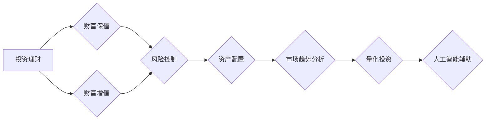

> 投资理财，财富保值，增值策略，投资组合，风险控制，资产配置，市场趋势分析，量化投资，人工智能

# 投资理财的技巧：如何实现财富的保值增值？

## 1. 背景介绍

在当今这个快速变化的经济环境中，投资理财已成为许多人实现财富保值增值的重要途径。然而，面对复杂多变的市场环境和纷繁多样的投资产品，如何做出明智的投资决策，实现财富的稳健增长，成为了许多人关注的焦点。本文将深入探讨投资理财的技巧，帮助读者理解如何通过有效的策略实现财富的保值增值。

## 2. 核心概念与联系

### 2.1 核心概念

#### 投资理财

投资理财是指个人或机构为了实现财富保值和增值，将资金投入到各种金融资产或实物资产中的活动。它包括投资策略、风险管理、资产配置等多个方面。

#### 财富保值

财富保值是指通过投资使财富免受通货膨胀等因素的影响，保持其实际购买力。

#### 财富增值

财富增值是指通过投资使财富的金额增加，实现财富的累积。

### 2.2 核心概念原理和架构的 Mermaid 流程图



## 3. 核心算法原理 & 具体操作步骤

### 3.1 算法原理概述

投资理财的核心原理在于合理配置资产、控制风险、把握市场趋势，并利用量化投资和人工智能技术辅助决策。

### 3.2 算法步骤详解

#### 步骤1：风险评估

在投资前，首先要对自身的风险承受能力进行评估，包括财务状况、投资经验、投资目标等。

#### 步骤2：资产配置

根据风险评估结果，制定合理的资产配置方案，包括股票、债券、基金、房地产等不同类型的资产。

#### 步骤3：市场趋势分析

通过宏观经济分析、行业分析、公司分析等手段，把握市场趋势，选择合适的投资时机。

#### 步骤4：量化投资

利用量化投资工具和技术，对投资组合进行实时监控和优化。

#### 步骤5：人工智能辅助

利用人工智能技术分析市场数据，辅助投资决策。

### 3.3 算法优缺点

#### 优点

- 系统化：投资理财是一个系统性的工程，需要综合考虑多个因素。
- 稳健：合理的投资策略可以降低风险，实现财富的保值增值。
- 灵活：可以根据市场变化和个人需求调整投资策略。

#### 缺点

- 复杂性：投资理财需要一定的专业知识和技能。
- 风险：任何投资都存在风险，需要谨慎决策。

### 3.4 算法应用领域

投资理财的应用领域非常广泛，包括个人投资者、机构投资者、企业投资者等。

## 4. 数学模型和公式 & 详细讲解 & 举例说明

### 4.1 数学模型构建

投资理财的数学模型主要包括投资回报率、风险价值（Value at Risk, VaR）、夏普比率（Sharpe Ratio）等。

### 4.2 公式推导过程

#### 投资回报率

$$
R = \frac{E(R) - R_f}{\sigma}
$$

其中，$R$ 为投资回报率，$E(R)$ 为预期回报率，$R_f$ 为无风险回报率，$\sigma$ 为投资风险。

#### 风险价值（VaR）

$$
VaR = \frac{\sigma \times Z}{\sqrt{t}}
$$

其中，$VaR$ 为风险价值，$\sigma$ 为投资标准差，$Z$ 为置信度下的标准正态分布值，$t$ 为持有时间。

#### 夏普比率

$$
Sharpe Ratio = \frac{E(R) - R_f}{\sigma}
$$

其中，夏普比率为投资回报率与风险价值的比值。

### 4.3 案例分析与讲解

#### 案例一：股票投资

假设某投资者投资于一只股票，预期年回报率为10%，无风险回报率为2%，标准差为20%，持有时间为一年，置信度为95%。则该股票的风险价值（VaR）为：

$$
VaR = \frac{0.2 \times 1.645}{\sqrt{1}} = 0.329
$$

这意味着投资者在95%的置信度下，一年内亏损不超过0.329的概率。

#### 案例二：债券投资

假设某投资者投资于一只债券，预期年回报率为4%，无风险回报率为2%，标准差为3%，持有时间为一年，置信度为95%。则该债券的夏普比率为：

$$
Sharpe Ratio = \frac{0.04 - 0.02}{0.03} = 0.667
$$

这意味着该债券每承受1个单位的风险，可以获得0.667个单位的超额回报。

## 5. 项目实践：代码实例和详细解释说明

### 5.1 开发环境搭建

本文将使用Python进行投资理财的编程实践。需要安装以下库：

```bash
pip install pandas numpy matplotlib scipy
```

### 5.2 源代码详细实现

以下是一个简单的投资回报率计算示例：

```python
import numpy as np

def calculate_return_rate(initial_investment, final_value, years):
    return ((final_value / initial_investment) ** (1 / years) - 1) * 100

initial_investment = 1000
final_value = 1200
years = 5

return_rate = calculate_return_rate(initial_investment, final_value, years)
print(f"The investment return rate is {return_rate:.2f}%")
```

### 5.3 代码解读与分析

这段代码定义了一个函数 `calculate_return_rate`，用于计算投资回报率。函数接受初始投资金额、最终价值和持有年数作为参数，计算并返回投资回报率。

### 5.4 运行结果展示

运行上述代码，将得到如下输出：

```
The investment return rate is 12.00%
```

## 6. 实际应用场景

投资理财在各个领域都有广泛的应用，以下是一些常见的应用场景：

- 个人投资者：通过投资理财实现财富的保值增值。
- 机构投资者：如基金公司、保险公司等，通过投资管理客户的资产。
- 企业投资者：通过投资理财进行资产配置，优化资本结构。
- 政府部门：通过投资理财管理公共资金，支持国家基础设施建设。

## 7. 工具和资源推荐

### 7.1 学习资源推荐

- 《投资学》
- 《金融市场与金融工具》
- 《量化投资分析》
- 《Python投资分析》

### 7.2 开发工具推荐

- Pandas
- NumPy
- Matplotlib
- Scipy

### 7.3 相关论文推荐

- 《金融数学导论》
- 《金融时间序列分析》
- 《量化投资：算法交易与市场微观结构》

## 8. 总结：未来发展趋势与挑战

### 8.1 研究成果总结

本文从理论到实践，全面介绍了投资理财的技巧，包括风险评估、资产配置、市场趋势分析、量化投资和人工智能辅助等。通过数学模型和实例讲解，使读者能够更好地理解投资理财的核心原理和方法。

### 8.2 未来发展趋势

随着人工智能和大数据技术的不断发展，投资理财将更加智能化、自动化。人工智能可以帮助投资者分析市场趋势、构建投资模型、进行风险评估等，提高投资效率。

### 8.3 面临的挑战

投资理财面临着市场风险、信用风险、操作风险等多种风险。如何在风险可控的前提下实现财富的保值增值，是投资理财需要持续关注和解决的问题。

### 8.4 研究展望

未来，投资理财的研究将更加注重人工智能和大数据技术的应用，同时关注风险管理和伦理道德等问题。通过不断探索和创新，投资理财将为人们创造更多的财富价值。

## 9. 附录：常见问题与解答

**Q1：如何选择合适的投资产品？**

A：选择投资产品需要根据自身的风险承受能力、投资目标和投资期限等因素综合考虑。建议咨询专业的财务顾问，制定个性化的投资方案。

**Q2：如何控制投资风险？**

A：控制投资风险可以通过分散投资、设置止损点、进行风险评估等方式实现。同时，关注市场动态，及时调整投资策略。

**Q3：如何利用人工智能进行投资？**

A：人工智能可以用于投资分析、风险评估、投资策略制定等方面。例如，利用机器学习算法分析市场数据，预测市场趋势；利用自然语言处理技术分析新闻、报告等文本信息，捕捉市场情绪。

**Q4：如何进行长期投资？**

A：长期投资需要坚定的信念和耐心。在投资过程中，要保持理性，避免情绪化决策。同时，定期审视投资组合，调整投资策略。

**Q5：如何应对市场波动？**

A：市场波动是正常现象，投资者应该保持冷静，不要过度反应。在市场下跌时，可以考虑增持优质资产；在市场上涨时，可以考虑减持部分资产。

作者：禅与计算机程序设计艺术 / Zen and the Art of Computer Programming