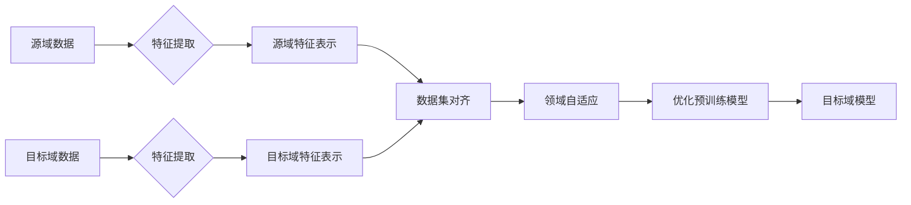

# 数据集对齐：跨领域迁移学习的新挑战

> 关键词：数据集对齐，跨领域迁移学习，特征表示，领域自适应，预训练模型，迁移学习，NLP，图像识别

## 1. 背景介绍

随着深度学习技术的飞速发展，迁移学习（Transfer Learning）已成为提高模型泛化能力、降低数据收集成本的重要手段。迁移学习的基本思想是将在一个领域（源域）学习到的知识迁移到另一个相关领域（目标域）中，以提高目标域上的模型性能。然而，在现实世界中，源域和目标域之间的差异往往很大，这给跨领域迁移学习带来了新的挑战。其中，数据集对齐（Dataset Alignment）是解决这一挑战的关键技术之一。

数据集对齐的目标是在源域和目标域之间建立一种对应关系，使得源域数据能够更好地指导目标域模型的训练。这一过程涉及到多个层面，包括特征表示、领域自适应和模型调整等。本文将深入探讨数据集对齐的原理、算法和实际应用，旨在为跨领域迁移学习提供新的思路和方法。

## 2. 核心概念与联系

### 2.1 核心概念原理

**数据集对齐**是指在不同领域的数据集之间建立对应关系的过程。在跨领域迁移学习中，数据集对齐的目的是使源域数据能够有效地指导目标域模型的训练。

**特征表示**是指将原始数据转换为适合模型处理的特征表示。在跨领域迁移学习中，特征表示的目的是使源域和目标域数据在特征空间中具有相似性。

**领域自适应**是指使模型能够适应不同领域之间的差异。在跨领域迁移学习中，领域自适应的目的是使模型在目标域上能够保持良好的性能。

**预训练模型**是指在大规模无标签数据上预先训练的模型。预训练模型在跨领域迁移学习中发挥着重要作用，因为它可以在多个领域之间共享通用知识。

**迁移学习**是指利用在一个领域（源域）学习到的知识来提高另一个相关领域（目标域）模型的性能。

### 2.2 核心概念联系

数据集对齐是跨领域迁移学习的关键技术，其与特征表示、领域自适应和预训练模型等概念之间存在紧密的联系。

- **数据集对齐**是解决跨领域迁移学习中数据分布差异问题的核心方法。
- **特征表示**是实现数据集对齐的基础，它通过将源域和目标域数据转换为相似的特征表示，为数据集对齐提供支持。
- **领域自适应**是数据集对齐后的进一步优化，它通过调整模型在目标域上的表现，提高模型的泛化能力。
- **预训练模型**为跨领域迁移学习提供了丰富的通用知识，数据集对齐和领域自适应等策略可以进一步优化预训练模型在目标域上的表现。

Mermaid 流程图如下：



## 3. 核心算法原理 & 具体操作步骤

### 3.1 算法原理概述

数据集对齐算法主要分为两类：基于特征重排的方法和基于学习的方法。

- **基于特征重排的方法**：通过将源域和目标域数据映射到相同或相似的特征空间，实现数据集对齐。
- **基于学习的方法**：通过学习一个映射函数，将源域特征映射到目标域特征空间，实现数据集对齐。

### 3.2 算法步骤详解

**基于特征重排的方法**：

1. 提取源域和目标域数据的特征表示。
2. 使用特征选择或降维等方法，将源域和目标域特征映射到相同或相似的特征空间。
3. 在对齐后的特征空间中，根据相似度进行数据对齐。

**基于学习的方法**：

1. 选择合适的映射函数，如线性映射、非线性映射等。
2. 使用源域和目标域数据训练映射函数。
3. 将源域特征映射到目标域特征空间，实现数据集对齐。

### 3.3 算法优缺点

**基于特征重排的方法**：

- 优点：简单易实现，对模型结构要求较低。
- 缺点：对特征空间的选择和参数调整依赖较大，对非线性差异的处理能力有限。

**基于学习的方法**：

- 优点：能够更好地处理非线性差异，对特征空间的选择和参数调整相对灵活。
- 缺点：需要额外的计算资源，对模型结构要求较高。

### 3.4 算法应用领域

数据集对齐算法在多个领域具有广泛的应用，如：

- 自然语言处理（NLP）：跨语言文本分类、跨领域情感分析等。
- 图像识别：跨模态图像分类、跨领域目标检测等。
- 语音识别：跨语音识别、跨领域语音合成等。

## 4. 数学模型和公式 & 详细讲解 & 举例说明

### 4.1 数学模型构建

假设源域数据集为 $X_{src}$，目标域数据集为 $X_{tgt}$，它们在特征空间中的表示分别为 $F_{src}$ 和 $F_{tgt}$。数据集对齐的目标是找到一个映射函数 $f:F_{src} \rightarrow F_{tgt}$，使得 $f(F_{src})$ 与 $F_{tgt}$ 具有更高的相似度。

### 4.2 公式推导过程

**基于特征重排的方法**：

- 使用特征选择或降维方法，将 $F_{src}$ 和 $F_{tgt}$ 映射到相同或相似的特征空间 $G$。
- 计算源域和目标域数据在特征空间 $G$ 中的相似度，如余弦相似度：
  $$
  \sim(G,x_{src}) = \frac{G(x_{src}) \cdot G(y_{tgt})}{\|G(x_{src})\| \|G(y_{tgt})\|}
  $$
- 根据相似度对 $X_{src}$ 和 $X_{tgt}$ 进行排序，实现数据集对齐。

**基于学习的方法**：

- 选择合适的映射函数 $f:F_{src} \rightarrow F_{tgt}$，如线性映射：
  $$
  f(x) = Wx + b
  $$
- 使用源域和目标域数据 $X_{src}$ 和 $X_{tgt}$ 训练映射函数 $f$。
- 将 $X_{src}$ 通过 $f$ 映射到 $F_{tgt}$，实现数据集对齐。

### 4.3 案例分析与讲解

以跨语言文本分类为例，假设源域数据集 $X_{src}$ 为英文数据，目标域数据集 $X_{tgt}$ 为中文数据。我们可以使用以下方法进行数据集对齐：

1. 使用预训练的英文和中文语言模型提取文本特征。
2. 使用词嵌入（Word Embedding）技术将文本特征映射到相同或相似的特征空间。
3. 计算源域和目标域数据在特征空间中的相似度，并对数据进行排序，实现数据集对齐。
4. 在对齐后的数据集上训练分类模型。

通过数据集对齐，我们可以利用英文数据在中文数据上训练分类模型，从而提高模型在中文数据上的性能。

## 5. 项目实践：代码实例和详细解释说明

### 5.1 开发环境搭建

1. 安装Python环境。
2. 安装深度学习框架，如TensorFlow或PyTorch。
3. 安装NLP和图像处理库，如NLTK、spaCy、OpenCV等。

### 5.2 源代码详细实现

以下是一个使用TensorFlow进行跨语言文本分类的代码实例：

```python
import tensorflow as tf
from tensorflow.keras.preprocessing.text import Tokenizer
from tensorflow.keras.preprocessing.sequence import pad_sequences
from tensorflow.keras.models import Sequential
from tensorflow.keras.layers import Embedding, GlobalAveragePooling1D, Dense

# 加载英文和中文数据
src_texts = ...
tgt_texts = ...

# 分词和编码
src_tokenizer = Tokenizer(...)
tgt_tokenizer = Tokenizer(...)
src_sequences = src_tokenizer.texts_to_sequences(src_texts)
tgt_sequences = tgt_tokenizer.texts_to_sequences(tgt_texts)

# 填充序列
src_sequences = pad_sequences(src_sequences, maxlen=128)
tgt_sequences = pad_sequences(tgt_sequences, maxlen=128)

# 构建模型
model = Sequential([
    Embedding(input_dim=10000, output_dim=128, input_length=128),
    GlobalAveragePooling1D(),
    Dense(64, activation='relu'),
    Dense(1, activation='sigmoid')
])

# 编译模型
model.compile(optimizer='adam', loss='binary_crossentropy', metrics=['accuracy'])

# 训练模型
model.fit(src_sequences, src_labels, epochs=10, batch_size=32)
```

### 5.3 代码解读与分析

1. 加载英文和中文数据。
2. 分词和编码，将文本转换为序列。
3. 填充序列，使序列长度一致。
4. 构建模型，包括嵌入层、全局平均池化层和全连接层。
5. 编译模型，设置优化器、损失函数和评估指标。
6. 训练模型，使用源域数据训练分类器。

### 5.4 运行结果展示

运行上述代码，可以在源域数据上训练一个分类器。为了验证模型在目标域上的性能，我们可以使用数据集对齐技术对目标域数据进行对齐，然后在目标域数据上评估模型的性能。

## 6. 实际应用场景

数据集对齐技术在多个领域具有广泛的应用，以下列举几个典型应用场景：

### 6.1 跨语言文本分类

在跨语言文本分类任务中，数据集对齐可以用于将源域（如英文）数据转换为目标域（如中文）数据，从而提高模型在目标域上的性能。

### 6.2 跨模态图像分类

在跨模态图像分类任务中，数据集对齐可以用于将源域（如图像）数据转换为目标域（如文本）数据，从而提高模型在目标域上的性能。

### 6.3 跨领域语音识别

在跨领域语音识别任务中，数据集对齐可以用于将源域（如英文）数据转换为目标域（如中文）数据，从而提高模型在目标域上的性能。

## 7. 工具和资源推荐

### 7.1 学习资源推荐

1. 《深度学习》（Goodfellow, Bengio, Courville）
2. 《自然语言处理入门》（Speech and Language Processing，Jurafsky & Martin）
3. 《计算机视觉：算法与应用》（Richard Szeliski）

### 7.2 开发工具推荐

1. TensorFlow
2. PyTorch
3. spaCy
4. NLTK

### 7.3 相关论文推荐

1. “Domain Adaptation for Deep Neural Networks” by Matthew L. Zeiler
2. “Domain Adaptation by Backpropagation” by Yaroslav Ganin et al.
3. “Unsupervised Domain Adaptation by Backpropagation” by Bertrand migraine et al.

## 8. 总结：未来发展趋势与挑战

### 8.1 研究成果总结

本文深入探讨了数据集对齐在跨领域迁移学习中的应用，介绍了数据集对齐的原理、算法和实际应用。通过数据集对齐，可以在源域和目标域之间建立对应关系，从而提高目标域模型的性能。

### 8.2 未来发展趋势

未来，数据集对齐技术将朝着以下方向发展：

1. 深度学习模型与领域自适应技术的融合。
2. 基于对抗训练的数据集对齐方法。
3. 多模态数据集对齐方法。
4. 数据集对齐算法的自动化和可解释性。

### 8.3 面临的挑战

数据集对齐技术在应用过程中面临着以下挑战：

1. 源域和目标域之间差异的复杂性。
2. 数据集对齐算法的通用性和可解释性。
3. 模型性能与数据集对齐算法之间的权衡。

### 8.4 研究展望

随着深度学习和迁移学习技术的不断发展，数据集对齐技术将发挥越来越重要的作用。未来，数据集对齐技术有望在更多领域得到应用，推动人工智能技术的进一步发展。

## 9. 附录：常见问题与解答

**Q1：数据集对齐适用于所有迁移学习任务吗？**

A：数据集对齐技术主要适用于跨领域迁移学习任务，对于同领域迁移学习任务的效果可能有限。

**Q2：数据集对齐算法是否需要大量的标注数据？**

A：数据集对齐算法可能需要少量标注数据，但并不依赖于大量的标注数据。

**Q3：如何评估数据集对齐算法的性能？**

A：可以通过在目标域上评估模型的性能来评估数据集对齐算法的性能。

**Q4：数据集对齐算法是否可以应用于其他领域？**

A：数据集对齐算法可以应用于其他领域，如计算机视觉、语音识别等。

**Q5：如何选择合适的数据集对齐算法？**

A：选择合适的数据集对齐算法需要考虑任务类型、数据集特征等因素。通常，可以尝试多种算法并进行比较，选择性能最佳的算法。

作者：禅与计算机程序设计艺术 / Zen and the Art of Computer Programming