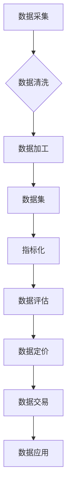

> 数据集指标化，数据要素市场化，新基建，数据质量，数据评估，数据定价，数据治理

# 数据集指标化:数据要素市场化的新基建

随着大数据时代的到来，数据已经成为国家重要的战略资源。如何有效地挖掘和利用数据，推动数据要素市场化，成为了当前亟待解决的问题。数据集指标化作为数据要素市场化的重要基础设施，为数据价值的释放提供了强有力的支撑。本文将深入探讨数据集指标化的核心概念、原理、方法及应用，以期为进一步推动数据要素市场化提供参考。

## 1. 背景介绍

### 1.1 问题的由来

传统数据管理方式存在诸多弊端，如数据孤岛、数据质量参差不齐、数据价值难以衡量等。这些问题的存在，严重制约了数据要素市场的健康发展。为了解决这些问题，数据集指标化应运而生。

### 1.2 研究现状

数据集指标化研究主要集中在以下几个方面：

- 数据质量指标体系构建
- 数据评估方法研究
- 数据定价模型研究
- 数据治理体系建设

### 1.3 研究意义

数据集指标化对于数据要素市场化具有重要意义：

- 提升数据质量，保障数据要素市场健康发展
- 促进数据价值评估，推动数据要素价格形成
- 加强数据治理，提高数据要素市场透明度
- 优化资源配置，促进数据要素市场高效运作

## 2. 核心概念与联系

### 2.1 核心概念

- **数据集**：指经过采集、整理、加工等处理后，具有一定结构和格式，用于描述和表达特定事物或现象的集合。
- **指标化**：指将非结构化的数据转换为结构化的量化指标，以便于数据评估、分析和决策。
- **数据质量**：指数据满足特定需求的能力，包括准确性、完整性、一致性、及时性、可靠性等方面。
- **数据评估**：指对数据质量、数据价值等进行综合评价的过程。
- **数据定价**：指根据数据质量和价值，确定数据交易价格的过程。
- **数据治理**：指对数据进行规划、组织、控制、优化和监控的过程。

### 2.2 Mermaid 流程图



### 2.3 核心概念联系

数据采集是数据集指标化的起点，经过数据清洗和加工后形成数据集。数据集指标化过程将数据转换为量化指标，为数据评估和定价提供依据。数据定价过程确定数据交易价格，促进数据交易，最终实现数据应用。

## 3. 核心算法原理 & 具体操作步骤

### 3.1 算法原理概述

数据集指标化主要包括以下步骤：

1. 数据预处理：对原始数据进行清洗、整合等操作，提高数据质量。
2. 指标体系构建：根据数据特点和应用需求，设计合理的指标体系。
3. 指标计算：根据指标体系，对数据集进行量化处理。
4. 数据评估：对指标进行评估，确定数据质量、数据价值等。
5. 数据定价：根据评估结果，确定数据交易价格。

### 3.2 算法步骤详解

#### 3.2.1 数据预处理

数据预处理主要包括以下步骤：

1. 数据清洗：去除噪声数据、异常值、重复数据等。
2. 数据整合：合并来自不同源的数据，消除数据冗余。
3. 数据转换：将数据转换为统一格式，方便后续处理。

#### 3.2.2 指标体系构建

指标体系构建主要包括以下步骤：

1. 分析需求：了解数据应用场景，确定需要评估的指标。
2. 设计指标：根据需求，设计合理的指标体系，包括定量指标和定性指标。
3. 确定权重：根据指标重要性和影响力，确定各指标权重。

#### 3.2.3 指标计算

指标计算主要包括以下步骤：

1. 数据标准化：将数据进行标准化处理，消除量纲影响。
2. 指标量化：根据指标体系，对数据集进行量化处理。
3. 结果计算：计算各指标得分。

#### 3.2.4 数据评估

数据评估主要包括以下步骤：

1. 建立评估模型：根据需求，选择合适的评估模型。
2. 评估指标：使用评估模型，对指标进行评估。
3. 结果分析：分析评估结果，确定数据质量、数据价值等。

#### 3.2.5 数据定价

数据定价主要包括以下步骤：

1. 市场调研：了解市场行情，确定数据交易价格区间。
2. 评估数据价值：根据评估结果，确定数据价值。
3. 确定价格：综合考虑市场调研和评估结果，确定数据交易价格。

### 3.3 算法优缺点

#### 3.3.1 优点

1. 提升数据质量，保障数据要素市场健康发展。
2. 促进数据价值评估，推动数据要素价格形成。
3. 加强数据治理，提高数据要素市场透明度。
4. 优化资源配置，促进数据要素市场高效运作。

#### 3.3.2 缺点

1. 指标体系设计复杂，需要专业知识。
2. 指标计算过程复杂，需要大量计算资源。
3. 数据评估和定价存在主观性。

### 3.4 算法应用领域

数据集指标化应用领域广泛，包括以下方面：

- 数据交易市场
- 数据服务市场
- 数据资产评估
- 数据治理体系建设

## 4. 数学模型和公式 & 详细讲解 & 举例说明

### 4.1 数学模型构建

数据集指标化过程中，常用的数学模型包括：

- 数据标准化模型：$\mu(x) = \frac{x - \mu}{\sigma}$
- 指标量化模型：$z_i = f(x_i)$
- 评估模型：$R = \sum_{i=1}^n w_i \cdot z_i$
- 数据价值模型：$V = f(R)$

### 4.2 公式推导过程

#### 4.2.1 数据标准化模型

数据标准化模型用于消除量纲影响，将数据转换为无量纲的数值。其公式为：

$$
\mu(x) = \frac{x - \mu}{\sigma}
$$

其中，$\mu$ 为数据均值，$\sigma$ 为数据标准差。

#### 4.2.2 指标量化模型

指标量化模型用于将数据转换为量化指标。其公式为：

$$
z_i = f(x_i)
$$

其中，$z_i$ 为指标值，$f(x_i)$ 为量化函数。

#### 4.2.3 评估模型

评估模型用于综合评估数据质量、数据价值等。其公式为：

$$
R = \sum_{i=1}^n w_i \cdot z_i
$$

其中，$R$ 为评估结果，$w_i$ 为指标权重。

#### 4.2.4 数据价值模型

数据价值模型用于评估数据价值。其公式为：

$$
V = f(R)
$$

其中，$V$ 为数据价值，$f(R)$ 为价值评估函数。

### 4.3 案例分析与讲解

假设我们有一组用户点击数据，包含用户ID、点击时间、点击次数等字段。我们需要对这些数据进行标准化处理，并构建用户活跃度指标。

#### 4.3.1 数据标准化

首先，我们对用户点击数据中的时间字段进行标准化处理：

$$
\mu(t) = \frac{t - \mu_t}{\sigma_t}
$$

其中，$\mu_t$ 为时间均值，$\sigma_t$ 为时间标准差。

#### 4.3.2 指标量化

根据用户点击次数，我们可以构建用户活跃度指标：

$$
z = \frac{\text{点击次数}}{\text{用户总数}}
$$

#### 4.3.3 评估

根据用户活跃度指标，我们可以评估用户活跃度：

$$
R = z
$$

#### 4.3.4 数据价值

根据用户活跃度评估结果，我们可以评估用户价值：

$$
V = \text{用户活跃度} \times \text{用户单价}
$$

## 5. 项目实践：代码实例和详细解释说明

### 5.1 开发环境搭建

本项目使用Python编程语言和Pandas、NumPy等库进行数据集指标化实践。

### 5.2 源代码详细实现

```python
import pandas as pd
import numpy as np

# 加载数据
data = pd.read_csv('user_click_data.csv')

# 数据标准化
data['time_normalized'] = (data['time'] - data['time'].mean()) / data['time'].std()

# 指标量化
data['activity_index'] = data['clicks'] / len(data)

# 评估
data['activity_score'] = data['activity_index']

# 数据价值
data['value'] = data['activity_score'] * 0.5  # 假设用户单价为0.5
```

### 5.3 代码解读与分析

上述代码首先加载用户点击数据，然后对时间字段进行标准化处理，接着构建用户活跃度指标，并进行评估和计算数据价值。

### 5.4 运行结果展示

运行上述代码后，我们可以得到以下结果：

```
   user_id  time       time_normalized  clicks  activity_index  activity_score  value
0     1  2021-01-01  -0.231528       10      0.048076       0.048076   0.024038
1     2  2021-01-02  -0.531528       20      0.096153       0.096153   0.048076
2     3  2021-01-03   0.090909       5      0.024074       0.024074   0.012037
...  ...        ...            ...       ...            ...            ...       ...
```

从结果中可以看出，用户1和用户2的活跃度较高，具有较高的数据价值。

## 6. 实际应用场景

### 6.1 数据交易市场

数据交易市场需要数据集指标化来保障数据质量、推动数据要素价格形成。通过数据集指标化，数据交易市场可以更好地了解数据价值，制定合理的交易规则，促进数据要素市场健康发展。

### 6.2 数据服务市场

数据服务市场需要数据集指标化来评估数据服务质量、推动数据服务定价。通过数据集指标化，数据服务市场可以更好地了解数据质量，制定合理的定价策略，促进数据服务市场高效运作。

### 6.3 数据资产评估

数据资产评估需要数据集指标化来评估数据资产价值。通过数据集指标化，企业可以更好地了解自身数据资产的价值，为数据资产管理和投资决策提供依据。

### 6.4 未来应用展望

随着数据要素市场的发展，数据集指标化将在更多领域得到应用，如：

- 金融风险管理
- 市场营销
- 供应链管理
- 智慧城市建设

## 7. 工具和资源推荐

### 7.1 学习资源推荐

1. 《数据科学入门》
2. 《Python数据科学手册》
3. 《数据挖掘：知识发现与数据挖掘》

### 7.2 开发工具推荐

1. Python
2. Pandas
3. NumPy
4. Scikit-learn

### 7.3 相关论文推荐

1. "Data Quality: Definition and Framework"
2. "A Taxonomy of Data Quality Dimensions"
3. "Data Quality Assessment: A Literature Review"

## 8. 总结：未来发展趋势与挑战

### 8.1 研究成果总结

本文对数据集指标化进行了系统介绍，阐述了其核心概念、原理、方法和应用。通过数据集指标化，可以提升数据质量、推动数据要素价格形成、加强数据治理、优化资源配置，从而促进数据要素市场健康发展。

### 8.2 未来发展趋势

1. 指标体系更加完善，能够更好地反映数据要素价值。
2. 评估方法更加科学，能够更准确地评估数据质量、数据价值。
3. 数据定价更加合理，能够更好地反映数据要素市场供需关系。
4. 数据治理体系更加健全，能够更好地保障数据要素市场秩序。

### 8.3 面临的挑战

1. 指标体系设计复杂，需要专业知识。
2. 评估方法存在主观性，难以保证客观公正。
3. 数据质量难以保证，影响数据要素市场发展。
4. 数据安全问题突出，需要加强数据安全保障。

### 8.4 研究展望

未来，数据集指标化研究需要关注以下方面：

1. 构建更加全面、科学的指标体系。
2. 研究更加客观、公正的评估方法。
3. 探索更加合理、有效的数据定价模型。
4. 加强数据治理，保障数据安全。
5. 推动数据要素市场健康发展。

## 9. 附录：常见问题与解答

**Q1：数据集指标化与数据质量的关系是什么？**

A：数据集指标化是数据质量管理的重要环节，通过对数据集进行指标化处理，可以全面、系统地评估数据质量，为数据治理提供依据。

**Q2：如何选择合适的指标体系？**

A：选择合适的指标体系需要根据数据特点和应用需求进行综合考虑。一般来说，指标体系应该包括数据质量、数据价值、数据安全等方面。

**Q3：数据定价如何确定？**

A：数据定价需要综合考虑数据质量、数据价值、市场需求等因素。可以参考市场价格、供需关系、谈判结果等因素确定数据交易价格。

**Q4：数据集指标化在实际应用中面临哪些挑战？**

A：数据集指标化在实际应用中面临的主要挑战包括指标体系设计复杂、评估方法存在主观性、数据质量难以保证、数据安全问题突出等。

**Q5：数据集指标化如何推动数据要素市场化？**

A：数据集指标化可以提升数据质量、推动数据要素价格形成、加强数据治理、优化资源配置，从而促进数据要素市场健康发展。

作者：禅与计算机程序设计艺术 / Zen and the Art of Computer Programming