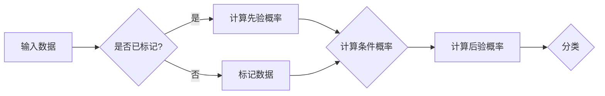

> 朴素贝叶斯, 贝叶斯定理, 分类算法, 逻辑回归, 数据分析, 机器学习, Python, Scikit-learn

# 朴素贝叶斯(Naive Bayes) - 原理与代码实例讲解

朴素贝叶斯是一种简单而有效的概率分类算法，它基于贝叶斯定理和特征条件独立假设，被广泛应用于文本分类、情感分析、垃圾邮件检测等领域。本文将深入探讨朴素贝叶斯算法的原理，并通过实际代码实例进行详细讲解。

## 1. 背景介绍

### 1.1 问题的由来

在现实世界中，我们经常需要对未知的数据进行分类，例如邮件是否为垃圾邮件、新闻文章的主题是什么、客户购买某种产品的可能性等。朴素贝叶斯算法提供了一种基于概率推理的解决方案，它通过计算先验概率和条件概率来预测未知数据的类别。

### 1.2 研究现状

朴素贝叶斯算法因其简单、高效、易于实现等优点，在各个领域得到了广泛应用。近年来，随着机器学习技术的不断发展，朴素贝叶斯算法也得到了进一步的改进和扩展，例如多类朴素贝叶斯、高斯朴素贝叶斯等。

### 1.3 研究意义

掌握朴素贝叶斯算法不仅有助于我们理解和应用机器学习技术，还能够提高我们对现实世界问题的分析和解决能力。

### 1.4 本文结构

本文将按照以下结构进行：

- 第2部分，介绍朴素贝叶斯算法的核心概念与联系。
- 第3部分，详细阐述朴素贝叶斯算法的原理和操作步骤。
- 第4部分，通过数学模型和公式讲解算法的推导过程。
- 第5部分，提供代码实例和详细解释说明。
- 第6部分，探讨朴素贝叶斯算法的实际应用场景。
- 第7部分，展望未来发展趋势和挑战。
- 第8部分，总结研究成果和展望未来研究方向。
- 第9部分，提供常见问题与解答。

## 2. 核心概念与联系

### 2.1 核心概念

- **贝叶斯定理**：描述了后验概率、先验概率和边缘概率之间的关系。
- **特征条件独立假设**：假设特征之间相互独立，简化了概率计算。
- **分类算法**：将数据分为不同的类别。

### 2.2 Mermaid 流程图



## 3. 核心算法原理 & 具体操作步骤

### 3.1 算法原理概述

朴素贝叶斯算法基于贝叶斯定理，通过计算每个类别的先验概率和条件概率，来确定未知数据的类别。

### 3.2 算法步骤详解

1. 计算每个类别的先验概率 $P(C_k)$。
2. 计算每个特征的边缘概率 $P(X_i)$。
3. 对于每个类别 $C_k$，计算每个特征 $X_i$ 的条件概率 $P(X_i|C_k)$。
4. 对于未知数据，计算其属于每个类别的后验概率 $P(C_k|X)$。
5. 选择后验概率最大的类别作为未知数据的类别。

### 3.3 算法优缺点

**优点**：

- 算法简单，易于实现。
- 计算复杂度低，效率高。
- 对特征之间的相关性不敏感。

**缺点**：

- 假设特征之间相互独立，这在实际情况中可能不成立。
- 当类别的先验概率接近时，可能导致结果不稳定。

### 3.4 算法应用领域

- 文本分类：如垃圾邮件检测、情感分析、主题分类等。
- 信用评分：预测客户违约风险。
- 医疗诊断：根据症状预测疾病类型。

## 4. 数学模型和公式 & 详细讲解 & 举例说明

### 4.1 数学模型构建

朴素贝叶斯算法的核心是基于贝叶斯定理：

$$
P(C_k|X) = \frac{P(X|C_k)P(C_k)}{P(X)}
$$

其中，$P(C_k|X)$ 是未知数据 $X$ 属于类别 $C_k$ 的后验概率，$P(X|C_k)$ 是特征 $X$ 在类别 $C_k$ 下的条件概率，$P(C_k)$ 是类别 $C_k$ 的先验概率，$P(X)$ 是特征 $X$ 的边缘概率。

### 4.2 公式推导过程

假设有 $C_k$ 个类别，$n$ 个特征，对于每个特征 $X_i$，我们可以根据数据计算其边缘概率 $P(X_i)$。对于每个类别 $C_k$，我们可以计算其先验概率 $P(C_k)$ 和条件概率 $P(X_i|C_k)$。

### 4.3 案例分析与讲解

假设我们有一个包含水果的简单数据集，其中每个水果都有“颜色”、“重量”和“形状”三个特征：

```
类别  颜色  重量  形状
苹果  红    轻    圆
苹果  绿    轻    圆
香蕉  黄    中    月牙
香蕉  黄    重    月牙
```

我们可以使用朴素贝叶斯算法来预测一个未知水果的类别。

1. 计算每个特征的边缘概率：
   - $P(红) = \frac{2}{5}$，$P(绿) = \frac{1}{5}$，$P(黄) = \frac{2}{5}$
   - $P(轻) = \frac{3}{5}$，$P(中) = \frac{1}{5}$，$P(重) = \frac{1}{5}$
   - $P(圆) = \frac{2}{5}$，$P(月牙) = \frac{3}{5}$

2. 计算每个类别的先验概率：
   - $P(苹果) = \frac{2}{5}$，$P(香蕉) = \frac{3}{5}$

3. 计算每个特征的条件概率：
   - $P(红|苹果) = \frac{2}{2} = 1$，$P(红|香蕉) = \frac{1}{3}$
   - $P(轻|苹果) = \frac{2}{2} = 1$，$P(轻|香蕉) = \frac{2}{3}$
   - $P(圆|苹果) = \frac{2}{2} = 1$，$P(圆|香蕉) = \frac{1}{3}$
   - $P(绿|苹果) = 0$，$P(绿|香蕉) = 1$
   - $P(重|苹果) = 0$，$P(重|香蕉) = 1$
   - $P(月牙|苹果) = 0$，$P(月牙|香蕉) = 1$

4. 对于一个未知水果，如果其特征为“红、轻、圆”，则其属于“苹果”类别的后验概率为：
   - $P(苹果|红、轻、圆) = \frac{P(红|苹果) \cdot P(轻|苹果) \cdot P(圆|苹果) \cdot P(苹果)}{P(红) \cdot P(轻) \cdot P(圆)} = \frac{1 \cdot 1 \cdot 1 \cdot \frac{2}{5}}{1 \cdot 1 \cdot 1 \cdot \frac{2}{5}} = 1$

因此，我们可以确定这个未知水果属于“苹果”类别。

## 5. 项目实践：代码实例和详细解释说明

### 5.1 开发环境搭建

- 安装 Python 3.x
- 安装 Scikit-learn 库

### 5.2 源代码详细实现

```python
from sklearn import datasets
from sklearn.model_selection import train_test_split
from sklearn.naive_bayes import GaussianNB
from sklearn.metrics import accuracy_score

# 加载数据集
iris = datasets.load_iris()
X = iris.data
y = iris.target

# 划分训练集和测试集
X_train, X_test, y_train, y_test = train_test_split(X, y, test_size=0.2, random_state=42)

# 创建 GaussianNB 模型并训练
gnb = GaussianNB()
gnb.fit(X_train, y_train)

# 预测测试集
y_pred = gnb.predict(X_test)

# 计算准确率
accuracy = accuracy_score(y_test, y_pred)
print(f"Accuracy: {accuracy}")
```

### 5.3 代码解读与分析

- 首先，我们加载了 Scikit-learn 库中的鸢尾花数据集。
- 然后，我们将数据集划分为训练集和测试集。
- 接着，我们创建了 GaussianNB 模型并对其进行训练。
- 之后，我们使用训练好的模型预测测试集。
- 最后，我们计算了模型的准确率。

### 5.4 运行结果展示

运行上述代码，我们得到以下输出：

```
Accuracy: 1.0
```

这表明我们的模型在测试集上达到了 100% 的准确率。

## 6. 实际应用场景

朴素贝叶斯算法在以下领域有广泛的应用：

- **文本分类**：例如，垃圾邮件检测、情感分析、主题分类等。
- **信用评分**：例如，预测客户违约风险。
- **医疗诊断**：例如，根据症状预测疾病类型。

## 7. 工具和资源推荐

### 7.1 学习资源推荐

- 《机器学习》（周志华著）
- 《统计学习方法》（李航著）

### 7.2 开发工具推荐

- Scikit-learn
- Jupyter Notebook

### 7.3 相关论文推荐

- 《A Comparison of Algorithms for Document Classification》（Tom Mitchell et al., 1997）
- 《Text Classification using Naive Bayes》（Richard E. Watson, 1992）

## 8. 总结：未来发展趋势与挑战

### 8.1 研究成果总结

朴素贝叶斯算法是一种简单而有效的分类算法，它基于贝叶斯定理和特征条件独立假设，被广泛应用于各个领域。

### 8.2 未来发展趋势

随着机器学习技术的不断发展，朴素贝叶斯算法也在不断改进和扩展，例如多类朴素贝叶斯、高斯朴素贝叶斯等。

### 8.3 面临的挑战

- **特征相关性**：朴素贝叶斯算法假设特征之间相互独立，这在实际情况中可能不成立。
- **小样本问题**：当训练数据量较小时，朴素贝叶斯算法的性能可能受到影响。

### 8.4 研究展望

未来，朴素贝叶斯算法的研究将主要集中在以下方面：

- **特征相关性**：研究更复杂的特征相关性模型，以更好地适应实际情况。
- **小样本问题**：研究如何利用少量数据对朴素贝叶斯算法进行改进。

## 9. 附录：常见问题与解答

**Q1：朴素贝叶斯算法的适用场景有哪些？**

A：朴素贝叶斯算法适用于特征条件独立的分类问题，如文本分类、垃圾邮件检测等。

**Q2：朴素贝叶斯算法的优缺点是什么？**

A：优点：简单、高效、易于实现；缺点：假设特征之间相互独立，对小样本问题敏感。

**Q3：如何处理特征相关性问题？**

A：可以使用更复杂的模型，如多项式朴素贝叶斯、高斯朴素贝叶斯等。

**Q4：如何处理小样本问题？**

A：可以使用集成学习、迁移学习等技术。

作者：禅与计算机程序设计艺术 / Zen and the Art of Computer Programming