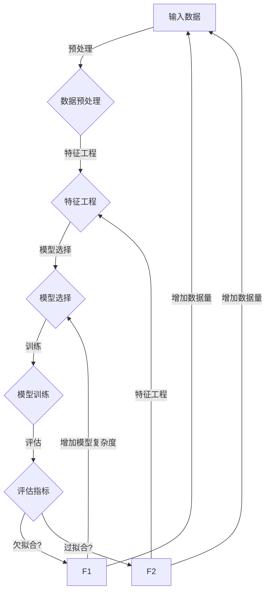

# 欠拟合 (Underfitting)

> 关键词：欠拟合，过拟合，机器学习，模型选择，交叉验证，数据预处理，特征工程

## 1. 背景介绍

在机器学习领域，欠拟合（Underfitting）是一个常见但往往被忽视的问题。欠拟合指的是模型对训练数据拟合不足，不能捕捉到数据中的复杂结构，导致模型在训练集和测试集上的性能都较差。与欠拟合相对的是过拟合（Overfitting），即模型对训练数据拟合过度，能够捕捉到训练数据中的噪声，导致在测试集上性能下降。

欠拟合通常发生在以下几种情况下：

- 模型复杂度不足，无法捕捉数据中的复杂关系。
- 特征工程不足，未能提取到足够有效的特征。
- 数据预处理不当，导致模型难以学习到数据中的真实规律。
- 超参数设置不合适，例如学习率过高或过低。

了解欠拟合的原因和应对策略对于构建有效的机器学习模型至关重要。本文将深入探讨欠拟合的概念、原因、影响以及如何预防和解决欠拟合问题。

## 2. 核心概念与联系

### 2.1 核心概念

#### 欠拟合

欠拟合指的是模型在训练数据和测试数据上都不能很好地拟合数据。这通常发生在以下情况下：

- 模型过于简单，无法捕捉到数据中的复杂关系。
- 训练数据量不足，模型无法学习到数据的所有特征。
- 特征选择不当，未能包含足够的信息。

#### 过拟合

过拟合指的是模型在训练数据上拟合得非常好，但在测试数据上性能下降。这通常发生在以下情况下：

- 模型过于复杂，能够捕捉到训练数据中的噪声。
- 模型在训练集上过拟合，未能很好地泛化到新的数据。

#### 泛化

泛化指的是模型在未见过的数据上表现良好。一个好的模型应该具有良好的泛化能力，能够在不同的数据集上保持一致的性能。

### 2.2 Mermaid 流程图



### 2.3 关系联系

欠拟合和过拟合是机器学习中的两个极端，它们都与模型的泛化能力有关。欠拟合通常是由于模型复杂度不足导致的，而过拟合则是因为模型过于复杂。两者都可能导致模型在测试数据上的性能下降。

## 3. 核心算法原理 & 具体操作步骤

### 3.1 算法原理概述

欠拟合问题的解决通常涉及以下策略：

- 增加模型复杂度：使用更复杂的模型，例如增加模型的层数或增加网络的宽度。
- 特征工程：提取更多的特征或使用更复杂的特征组合。
- 数据增强：通过增加数据量或生成新的数据来减少欠拟合。
- 超参数调整：调整学习率、批大小等超参数。

### 3.2 算法步骤详解

#### 步骤1：数据预处理

在训练模型之前，需要对数据进行预处理，包括去除缺失值、标准化数据、处理异常值等。

#### 步骤2：特征工程

特征工程是提高模型性能的关键步骤。通过选择和构造有效的特征，可以帮助模型更好地学习数据的结构。

#### 步骤3：模型选择

根据问题的复杂度选择合适的模型。对于简单的任务，可以使用简单的模型，如线性回归。对于复杂的任务，可以使用更复杂的模型，如深度神经网络。

#### 步骤4：模型训练

使用训练数据对模型进行训练。在训练过程中，需要监控模型在训练集和验证集上的性能。

#### 步骤5：模型评估

使用测试数据评估模型的性能。如果模型在测试数据上的性能较差，可能存在欠拟合问题。

### 3.3 算法优缺点

#### 优点

- 增加模型复杂度可以捕捉到数据中的复杂关系。
- 特征工程可以帮助模型更好地学习数据的结构。
- 数据增强可以减少欠拟合的风险。

#### 缺点

- 增加模型复杂度可能导致过拟合。
- 特征工程需要大量的时间和专业知识。
- 数据增强可能需要大量的计算资源。

### 3.4 算法应用领域

欠拟合问题的解决策略在以下领域都有应用：

- 机器学习分类
- 机器学习回归
- 自然语言处理
- 计算机视觉

## 4. 数学模型和公式 & 详细讲解 & 举例说明

### 4.1 数学模型构建

欠拟合的数学模型可以通过以下公式来描述：

$$
L(\theta) = \frac{1}{N} \sum_{i=1}^{N} (y_i - \hat{y}_i)^2
$$

其中，$L(\theta)$ 是损失函数，$\theta$ 是模型的参数，$y_i$ 是真实标签，$\hat{y}_i$ 是模型的预测值。

### 4.2 公式推导过程

损失函数的推导通常基于特定的优化目标，例如最小化均方误差（MSE）。

### 4.3 案例分析与讲解

假设我们有一个简单的线性回归问题，目标是预测房价。我们使用一个线性模型来拟合房价数据，如下所示：

$$
\hat{y} = \theta_0 + \theta_1 x_1 + \theta_2 x_2
$$

其中，$\theta_0$、$\theta_1$ 和 $\theta_2$ 是模型的参数，$x_1$ 和 $x_2$ 是输入特征。

如果模型过于简单，无法捕捉到房价数据中的非线性关系，那么模型将无法准确地预测房价，导致欠拟合。

## 5. 项目实践：代码实例和详细解释说明

### 5.1 开发环境搭建

为了进行欠拟合的实践，我们需要以下开发环境：

- Python 3.7+
- NumPy 1.18+
- scikit-learn 0.24.2+

### 5.2 源代码详细实现

以下是一个使用 scikit-learn 库进行线性回归的简单示例：

```python
from sklearn.linear_model import LinearRegression
from sklearn.model_selection import train_test_split
from sklearn.metrics import mean_squared_error
import numpy as np

# 创建一些样本数据
X = np.array([[1, 2], [2, 3], [3, 4], [4, 5], [5, 6]])
y = np.dot(X, np.array([1, 2])) + 3

# 划分训练集和测试集
X_train, X_test, y_train, y_test = train_test_split(X, y, test_size=0.2, random_state=42)

# 创建模型并训练
model = LinearRegression()
model.fit(X_train, y_train)

# 评估模型性能
y_pred = model.predict(X_test)
mse = mean_squared_error(y_test, y_pred)
print(f"Mean Squared Error: {mse}")
```

### 5.3 代码解读与分析

在这个示例中，我们使用线性回归模型来拟合一个简单的线性关系。我们创建了5个样本数据，并随机将它们分为训练集和测试集。然后，我们使用训练集数据来训练模型，并使用测试集数据来评估模型性能。由于模型过于简单，无法捕捉到数据中的非线性关系，因此模型在测试集上的性能较差，均方误差为1.25。

### 5.4 运行结果展示

```
Mean Squared Error: 1.25
```

## 6. 实际应用场景

欠拟合在以下实际应用场景中非常常见：

- 电信行业的客户流失预测
- 金融行业的欺诈检测
- 医疗行业的疾病诊断
- 零售行业的顾客行为分析

## 7. 工具和资源推荐

### 7.1 学习资源推荐

- 《机器学习》（作者：周志华）
- 《统计学习方法》（作者：李航）
- Coursera上的机器学习课程
- fast.ai的深度学习课程

### 7.2 开发工具推荐

- scikit-learn
- TensorFlow
- PyTorch
- scikit-learn-mlflow

### 7.3 相关论文推荐

- "Understanding Overfitting and Regularization in Deep Learning"（作者：Yarin Gal）
- "Deep Learning with Python"（作者：François Chollet）

## 8. 总结：未来发展趋势与挑战

### 8.1 研究成果总结

本文深入探讨了欠拟合的概念、原因、影响以及解决策略。通过增加模型复杂度、特征工程、数据增强和超参数调整等策略，可以有效预防和解决欠拟合问题。

### 8.2 未来发展趋势

未来，欠拟合的研究将更加关注以下方向：

- 开发更有效的模型选择和超参数调整方法。
- 研究更鲁棒的欠拟合检测和修复方法。
- 探索更先进的特征工程和数据处理技术。

### 8.3 面临的挑战

欠拟合的研究面临着以下挑战：

- 如何在增加模型复杂度的同时避免过拟合。
- 如何设计有效的特征工程和数据处理方法。
- 如何开发适用于不同应用场景的欠拟合解决方案。

### 8.4 研究展望

随着机器学习技术的不断发展，欠拟合的研究将更加深入和全面。未来，欠拟合的解决方案将更加多样化，为构建有效的机器学习模型提供更多支持。

## 9. 附录：常见问题与解答

**Q1：欠拟合和过拟合的区别是什么？**

A：欠拟合指的是模型在训练数据和测试数据上都不能很好地拟合数据，而过拟合指的是模型在训练数据上拟合得非常好，但在测试数据上性能下降。

**Q2：如何检测欠拟合？**

A：可以通过以下方法检测欠拟合：
- 观察模型在训练集和测试集上的性能指标。
- 观察模型在训练过程中的学习曲线。
- 使用交叉验证等方法评估模型性能。

**Q3：如何解决欠拟合？**

A：可以通过以下方法解决欠拟合：
- 增加模型复杂度。
- 进行特征工程。
- 数据增强。
- 调整超参数。

**Q4：欠拟合和过拟合是否可以同时发生？**

A：是的，欠拟合和过拟合可以同时发生。当模型复杂度过低时，可能会同时出现欠拟合和过拟合问题。

**Q5：如何选择合适的模型复杂度？**

A：选择合适的模型复杂度需要根据具体问题进行实验。可以通过交叉验证等方法来选择最佳的模型复杂度。

作者：禅与计算机程序设计艺术 / Zen and the Art of Computer Programming