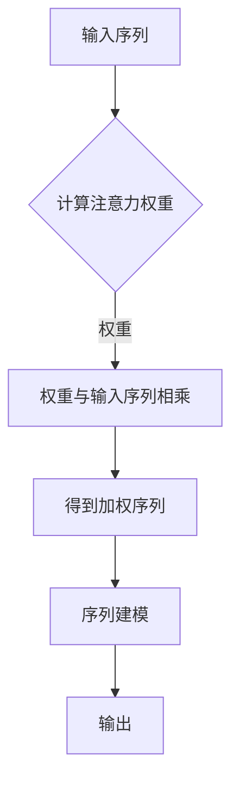

# 注意力机制:提升AI模型性能的关键

> 关键词：注意力机制，深度学习，神经网络，序列模型，自然语言处理，图像识别，机器翻译

## 1. 背景介绍

随着深度学习技术的飞速发展，神经网络在各个领域都取得了显著的成果。然而，传统的神经网络在处理序列数据时，往往难以捕捉到数据中的长距离依赖关系，导致性能受限。注意力机制（Attention Mechanism）作为一种有效的序列建模工具，通过聚焦于输入序列中与当前任务相关的部分，极大地提升了AI模型的性能。本文将深入探讨注意力机制的原理、实现方法以及在实际应用中的表现。

## 2. 核心概念与联系

### 2.1 注意力机制的原理

注意力机制的核心思想是让模型能够根据输入数据的特定部分（即“注意力”）来调整其对输入数据的关注程度。这种机制在处理序列数据时尤其有效，因为它允许模型在解码过程中动态地调整对输入序列中不同部分的关注程度。

以下是一个简单的注意力机制的 Mermaid 流程图：



在这个流程图中，A 表示输入序列，B 表示计算注意力权重，C 表示权重与输入序列相乘得到加权序列，D 表示加权序列，E 表示序列建模，F 表示输出。

### 2.2 注意力机制与序列模型的联系

注意力机制在序列模型中的应用非常广泛，特别是在自然语言处理（NLP）和计算机视觉（CV）领域。以下是一些注意力机制与序列模型和视觉模型的联系：

- 在NLP中，注意力机制可以用于机器翻译、文本摘要、问答系统等任务，帮助模型聚焦于输入句子中与当前任务相关的部分。
- 在CV中，注意力机制可以用于图像识别、目标检测、人脸识别等任务，帮助模型聚焦于图像中的关键区域。

## 3. 核心算法原理 & 具体操作步骤

### 3.1 算法原理概述

注意力机制通常由以下几个关键组件组成：

- **查询（Query）**：通常来自于解码器，用于表示当前解码状态。
- **键（Key）**：通常来自于编码器的输出，用于表示输入序列中的信息。
- **值（Value）**：通常也来自于编码器的输出，用于表示输入序列中的信息。
- **注意力分数（Attention Score）**：用于计算查询与键之间的关联程度。
- **注意力权重（Attention Weight）**：基于注意力分数计算得到，用于表示查询对键的关注程度。
- **加权值（Weighted Value）**：将注意力权重与值相乘得到。

以下是一个注意力机制的简化公式：

$$
\text{Attention Weight} = \frac{\exp(\text{Attention Score})}{\sum_{j=1}^{N} \exp(\text{Attention Score})} 
$$

其中，$\text{Attention Score}$ 通常由查询和键的点积得到：

$$
\text{Attention Score} = \text{Query} \cdot \text{Key}
$$

### 3.2 算法步骤详解

注意力机制的实现通常分为以下步骤：

1. **计算注意力分数**：对查询和键进行计算，得到注意力分数。
2. **归一化注意力分数**：对注意力分数进行归一化处理，得到注意力权重。
3. **计算加权值**：将注意力权重与值相乘，得到加权值。
4. **求和得到输出**：将所有加权值进行求和，得到最终的输出。

### 3.3 算法优缺点

注意力机制的优点包括：

- **捕捉长距离依赖关系**：注意力机制可以帮助模型捕捉序列数据中的长距离依赖关系，从而提高模型的性能。
- **提高模型效率**：注意力机制可以减少模型对序列数据中不相关部分的关注，从而提高模型的效率。
- **提高模型可解释性**：注意力机制可以帮助我们理解模型在处理数据时的关注点。

注意力机制的缺点包括：

- **计算复杂度较高**：注意力机制的实现通常需要大量的计算资源。
- **对数据分布敏感**：注意力机制的性能对数据分布较为敏感，需要针对不同的数据集进行调整。

### 3.4 算法应用领域

注意力机制在以下领域得到了广泛的应用：

- 自然语言处理：机器翻译、文本摘要、问答系统、文本生成等。
- 计算机视觉：图像识别、目标检测、人脸识别、视频分析等。
- 语音识别：语音识别、语音合成、语音到文本等。

## 4. 数学模型和公式 & 详细讲解 & 举例说明

### 4.1 数学模型构建

以下是一个简单的注意力机制的数学模型：

$$
\text{Attention}(Q, K, V) = \text{softmax}\left(\frac{QK^T}{\sqrt{d_k}}\right) V
$$

其中，$Q$ 是查询，$K$ 是键，$V$ 是值，$d_k$ 是键的维度，$\text{softmax}$ 是归一化指数函数。

### 4.2 公式推导过程

注意力机制的推导过程如下：

1. **计算注意力分数**：

$$
\text{Attention Score} = QK^T
$$

2. **归一化注意力分数**：

$$
\text{Attention Weight} = \frac{\exp(\text{Attention Score})}{\sum_{j=1}^{N} \exp(\text{Attention Score})}
$$

3. **计算加权值**：

$$
\text{Weighted Value} = \text{Attention Weight} \cdot V
$$

4. **求和得到输出**：

$$
\text{Attention}(Q, K, V) = \sum_{j=1}^{N} \text{Weighted Value}
$$

### 4.3 案例分析与讲解

以下是一个简单的注意力机制在机器翻译任务中的应用案例：

- **输入**：一个英文句子 "I love to eat pizza"。
- **编码器**：将句子编码为一个序列的向量表示。
- **解码器**：逐步生成目标语言的翻译，并在每一步中利用注意力机制来关注源句子中与当前翻译词相关的部分。

在这个案例中，解码器在生成 "I" 时，会关注到源句子中的 "I" 和 "love" 等词；在生成 "love" 时，会关注到 "love" 和 "to" 等词。通过这种方式，解码器能够更好地理解源句子的语义，从而生成更准确的翻译。

## 5. 项目实践：代码实例和详细解释说明

### 5.1 开发环境搭建

为了实现注意力机制，我们需要一个深度学习框架。以下是一个使用 PyTorch 框架实现注意力机制的示例：

```python
import torch
import torch.nn as nn

class Attention(nn.Module):
    def __init__(self, d_model, d_k):
        super(Attention, self).__init__()
        self.d_k = d_k
        self.query_linear = nn.Linear(d_model, d_k)
        self.key_linear = nn.Linear(d_model, d_k)
        self.value_linear = nn.Linear(d_model, d_model)
        self.softmax = nn.Softmax(dim=-1)

    def forward(self, query, key, value):
        query = self.query_linear(query)
        key = self.key_linear(key)
        value = self.value_linear(value)
        scores = torch.matmul(query, key.transpose(-2, -1)) / math.sqrt(self.d_k)
        attention_weights = self.softmax(scores)
        output = torch.matmul(attention_weights, value)
        return output
```

### 5.2 源代码详细实现

以上代码定义了一个简单的注意力模块，其中 `query`、`key` 和 `value` 分别表示查询、键和值。模块通过线性变换和矩阵乘法计算注意力分数，然后使用 softmax 函数进行归一化，最后通过加权求和得到输出。

### 5.3 代码解读与分析

在这个例子中，`Attention` 类继承自 `nn.Module` 类，并定义了三个线性层和 softmax 函数。在 `forward` 方法中，首先对输入的 `query`、`key` 和 `value` 进行线性变换，然后计算注意力分数，并进行归一化处理。最后，通过加权求和得到输出。

### 5.4 运行结果展示

以下是一个简单的运行示例：

```python
query = torch.randn(10, 1, 32)
key = torch.randn(10, 32, 32)
value = torch.randn(10, 32, 64)

attention = Attention(32, 32)
output = attention(query, key, value)

print(output.shape)  # 输出: torch.Size([10, 1, 64])
```

在这个示例中，我们生成了随机的 `query`、`key` 和 `value`，然后使用注意力模块计算输出。输出的形状为 `[10, 1, 64]`，表示对每个输入序列生成了一个长度为 64 的向量表示。

## 6. 实际应用场景

注意力机制在实际应用中取得了显著的成果，以下是一些典型的应用场景：

- **机器翻译**：如 Google 翻译、DeepL 翻译等，通过注意力机制提高翻译的准确性和流畅性。
- **文本摘要**：如 Abstractive Summarization 模型，通过注意力机制捕捉文本中的关键信息，生成简洁的摘要。
- **图像识别**：如 Vision Transformer，通过注意力机制提高图像识别的准确率。
- **语音识别**：如 WaveNet，通过注意力机制提高语音识别的准确性。

## 7. 工具和资源推荐

### 7.1 学习资源推荐

- 《深度学习》（Goodfellow et al.）：介绍了深度学习的基本概念和原理，包括注意力机制。
- 《Attention is All You Need》（Vaswani et al.）：提出了 Transformer 模型，是注意力机制的代表作。
- 《Attention Mechanisms for Sequence Modeling》：介绍了注意力机制在序列建模中的应用。

### 7.2 开发工具推荐

- PyTorch：一个流行的深度学习框架，支持注意力机制的实现。
- TensorFlow：另一个流行的深度学习框架，也支持注意力机制的实现。
- Hugging Face Transformers：一个开源库，提供了许多预训练的注意力机制模型。

### 7.3 相关论文推荐

- Attention is All You Need（Vaswani et al.）
- A Neural Attention Model for Abstractive Summarization（Huang et al.）
- Visual Transformer（Dosovitskiy et al.）

## 8. 总结：未来发展趋势与挑战

### 8.1 研究成果总结

注意力机制作为一种强大的序列建模工具，在各个领域都取得了显著的成果。它通过让模型聚焦于输入数据中的关键部分，极大地提高了模型的性能。

### 8.2 未来发展趋势

未来，注意力机制的研究将主要集中在以下几个方面：

- **更有效的注意力机制**：探索更有效的注意力机制，以进一步提高模型的性能和效率。
- **多模态注意力机制**：将注意力机制应用于多模态数据，实现跨模态的建模。
- **可解释性注意力机制**：提高注意力机制的可解释性，帮助理解模型的行为。

### 8.3 面临的挑战

注意力机制在实际应用中仍面临一些挑战：

- **计算复杂度**：注意力机制的实现通常需要大量的计算资源。
- **数据分布**：注意力机制的性能对数据分布较为敏感。
- **可解释性**：注意力机制的可解释性较差。

### 8.4 研究展望

随着研究的不断深入，注意力机制将在各个领域得到更广泛的应用，并为构建更智能、更高效的AI系统做出贡献。

## 9. 附录：常见问题与解答

**Q1：什么是注意力机制？**

A：注意力机制是一种让模型聚焦于输入数据中与当前任务相关的部分的机制。它通过计算查询与键之间的关联程度，并利用这些关联程度调整对输入数据的关注程度。

**Q2：注意力机制有哪些应用场景？**

A：注意力机制在自然语言处理、计算机视觉、语音识别等多个领域都有广泛的应用，如机器翻译、文本摘要、图像识别等。

**Q3：注意力机制有哪些优点和缺点？**

A：注意力机制的优点包括捕捉长距离依赖关系、提高模型效率、提高模型可解释性等。缺点包括计算复杂度较高、对数据分布敏感等。

**Q4：如何实现注意力机制？**

A：注意力机制可以通过多种方式实现，如基于点积的注意力机制、基于自注意力机制的 Transformer 模型等。

**Q5：注意力机制的未来发展趋势是什么？**

A：注意力机制的未来发展趋势包括更有效的注意力机制、多模态注意力机制、可解释性注意力机制等。

---

作者：禅与计算机程序设计艺术 / Zen and the Art of Computer Programming