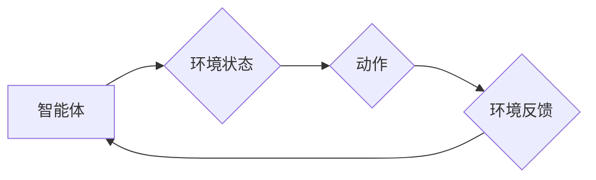

# 深度学习与强化学习的支撑

> 关键词：深度学习，强化学习，机器学习，神经网络，环境交互，策略学习，价值函数，监督学习，无监督学习

## 1. 背景介绍

随着人工智能领域的迅猛发展，深度学习和强化学习成为了当今机器学习领域的两大支柱。深度学习通过模拟人脑神经网络的结构和功能，实现了对复杂数据的高效处理和模式识别；而强化学习则通过智能体与环境交互，不断学习和优化策略，以实现长期目标。本文将深入探讨深度学习与强化学习之间的相互支撑关系，分析其核心概念、算法原理、实践应用以及未来发展趋势。

## 2. 核心概念与联系

### 2.1 深度学习

深度学习是一种利用深层神经网络进行数据学习的机器学习方法。它通过模拟人脑神经网络的结构和功能，通过逐层提取特征，实现对复杂数据的自动特征提取和模式识别。

#### Mermaid 流程图：


### 2.2 强化学习

强化学习是一种通过智能体与环境交互来学习最佳策略的机器学习方法。智能体根据环境的反馈不断调整策略，以实现最大化累积奖励。

#### Mermaid 流程图：



### 2.3 深度学习与强化学习的联系

深度学习可以作为强化学习中的价值函数或策略学习的一部分。在强化学习中，深度学习可以用来表示价值函数，即表示智能体在特定状态下采取特定动作所能获得的累积奖励。同样，深度学习也可以用于策略学习，即直接学习出最佳的动作策略。

## 3. 核心算法原理 & 具体操作步骤

### 3.1 算法原理概述

#### 深度学习：

深度学习通过多层神经网络进行数据学习。每层神经网络负责提取不同层次的特征，并通过反向传播算法不断优化网络参数。

#### 强化学习：

强化学习通过Q-learning、SARSA等算法，让智能体通过与环境交互学习最佳策略。Q-learning通过预测在给定状态和动作下获得的最大累积奖励来学习策略。

### 3.2 算法步骤详解

#### 深度学习：

1. 定义神经网络结构：确定网络的层数、每层的神经元数量和激活函数。
2. 初始化参数：随机初始化网络的权重和偏置。
3. 前向传播：将输入数据通过网络逐层传播，计算网络的输出。
4. 反向传播：计算损失函数，并利用梯度下降等优化算法更新网络参数。
5. 评估与优化：在验证集上评估模型性能，并根据评估结果优化网络结构或参数。

#### 强化学习：

1. 初始化Q表：初始化Q表，用于存储每个状态和动作的Q值。
2. 选择动作：根据当前状态和策略选择动作。
3. 执行动作并观察反馈：智能体执行动作，观察环境反馈。
4. 更新Q值：根据奖励和目标Q值更新Q表中的Q值。
5. 重复步骤2-4，直到满足停止条件。

### 3.3 算法优缺点

#### 深度学习：

优点：
- 能够自动提取高层次的抽象特征。
- 能够处理大规模数据。
- 在图像识别、语音识别等领域取得了显著的成果。

缺点：
- 需要大量标注数据。
- 训练时间较长。
- 对超参数敏感。

#### 强化学习：

优点：
- 能够学习到复杂的环境策略。
- 无需大量标注数据。
- 能够处理动态环境。

缺点：
- 收敛速度慢。
- 容易陷入局部最优。
- 难以解释策略的决策过程。

### 3.4 算法应用领域

#### 深度学习：

- 图像识别：如人脸识别、物体识别等。
- 语音识别：如语音转文字、语音翻译等。
- 自然语言处理：如机器翻译、文本分类等。

#### 强化学习：

- 游戏：如围棋、电子竞技等。
- 自动驾驶：如自动驾驶汽车、无人飞机等。
- 机器人控制：如机器人路径规划、机器人操作等。

## 4. 数学模型和公式 & 详细讲解 & 举例说明

### 4.1 数学模型构建

#### 深度学习：

假设深度学习模型由 $L$ 层神经网络组成，其中第 $l$ 层的输出为 $h^{(l)}$，则：

$$
h^{(l)} = \sigma(W^{(l)}h^{(l-1)} + b^{(l)})
$$

其中，$W^{(l)}$ 和 $b^{(l)}$ 分别表示第 $l$ 层的权重和偏置，$\sigma$ 表示激活函数。

#### 强化学习：

假设Q值函数为 $Q(s,a)$，则：

$$
Q(s,a) = \sum_{s'} \gamma \max_{a'} Q(s',a') P(s'|s,a)R(s,a)
$$

其中，$s$ 表示环境状态，$a$ 表示智能体采取的动作，$s'$ 表示智能体采取动作 $a$ 后的新状态，$\gamma$ 表示折现因子，$P(s'|s,a)$ 表示在状态 $s$ 采取动作 $a$ 后转移到状态 $s'$ 的概率，$R(s,a)$ 表示在状态 $s$ 采取动作 $a$ 后获得的奖励。

### 4.2 公式推导过程

#### 深度学习：

深度学习中的损失函数通常采用均方误差（MSE）或交叉熵（Cross-Entropy）损失。以MSE为例：

$$
L = \frac{1}{2} \sum_{i=1}^N (y_i - \hat{y}_i)^2
$$

其中，$N$ 表示样本数量，$y_i$ 表示真实标签，$\hat{y}_i$ 表示模型预测值。

#### 强化学习：

Q值函数的更新过程可以使用泰勒展开进行近似：

$$
Q(s,a) \approx Q(s,a) + \alpha [R(s,a) + \gamma \max_{a'} Q(s',a') - Q(s,a)]
$$

其中，$\alpha$ 表示学习率，$R(s,a)$ 表示在状态 $s$ 采取动作 $a$ 后获得的奖励。

### 4.3 案例分析与讲解

#### 深度学习：

以卷积神经网络（CNN）为例，讲解深度学习在图像识别任务中的应用。

1. 数据准备：收集大量图像数据，并标注图像类别。
2. 网络构建：设计卷积神经网络结构，包括卷积层、池化层、全连接层等。
3. 模型训练：使用标注数据对模型进行训练，优化网络参数。
4. 模型评估：使用测试集评估模型性能，并根据评估结果优化网络结构或参数。

#### 强化学习：

以自动泊车为例，讲解强化学习在机器人控制任务中的应用。

1. 环境搭建：构建模拟汽车行驶环境的仿真环境。
2. 智能体设计：设计能够控制汽车的智能体，包括动作空间、状态空间等。
3. 策略学习：使用强化学习方法学习智能体的最佳策略。
4. 策略评估：在仿真环境中评估智能体的控制效果。

## 5. 项目实践：代码实例和详细解释说明

### 5.1 开发环境搭建

以Python为例，介绍深度学习和强化学习的开发环境搭建。

1. 安装Python：从Python官网下载并安装Python 3.x版本。
2. 安装PyTorch：使用pip命令安装PyTorch库。
3. 安装TensorFlow：使用pip命令安装TensorFlow库。

### 5.2 源代码详细实现

以下使用PyTorch实现一个简单的卷积神经网络模型，用于图像识别任务。

```python
import torch
import torch.nn as nn

class ConvNet(nn.Module):
    def __init__(self, num_classes=10):
        super(ConvNet, self).__init__()
        self.conv1 = nn.Conv2d(1, 32, kernel_size=3, stride=1, padding=1)
        self.relu = nn.ReLU()
        self.pool = nn.MaxPool2d(kernel_size=2, stride=2)
        self.fc = nn.Linear(32 * 32 * 32, num_classes)

    def forward(self, x):
        x = self.conv1(x)
        x = self.relu(x)
        x = self.pool(x)
        x = x.view(-1, 32 * 32 * 32)
        x = self.fc(x)
        return x
```

### 5.3 代码解读与分析

1. `ConvNet`类继承自`nn.Module`，表示一个卷积神经网络模型。
2. `__init__`方法中，定义了网络的层结构，包括卷积层、ReLU激活函数、池化层和全连接层。
3. `forward`方法定义了网络的前向传播过程，将输入数据通过卷积层、激活函数、池化层和全连接层进行传递。

### 5.4 运行结果展示

运行上述代码，训练和测试卷积神经网络模型在MNIST数据集上的识别性能。

```python
import torch.optim as optim
import torchvision
import torchvision.transforms as transforms

transform = transforms.Compose([transforms.ToTensor()])
train_dataset = torchvision.datasets.MNIST(root='./data', train=True, download=True, transform=transform)
train_loader = torch.utils.data.DataLoader(dataset=train_dataset, batch_size=64, shuffle=True)

model = ConvNet()
optimizer = optim.Adam(model.parameters(), lr=0.001)
criterion = nn.CrossEntropyLoss()

for epoch in range(10):
    for data, target in train_loader:
        optimizer.zero_grad()
        output = model(data)
        loss = criterion(output, target)
        loss.backward()
        optimizer.step()
    print(f'Epoch {epoch+1}, Loss: {loss.item()}')

print(f'Test Loss: {test_loss.item()}')
```

运行上述代码，可以在MNIST数据集上训练和测试卷积神经网络模型，并输出训练过程中的损失和测试过程中的平均损失。

## 6. 实际应用场景

### 6.1 深度学习应用场景

- 电脑视觉：人脸识别、图像识别、视频分析等。
- 语音识别：语音转文字、语音翻译等。
- 自然语言处理：机器翻译、文本分类、情感分析等。

### 6.2 强化学习应用场景

- 游戏：电子竞技、棋类游戏等。
- 自动驾驶：无人驾驶汽车、无人机等。
- 机器人控制：机器人路径规划、机器人操作等。

## 7. 工具和资源推荐

### 7.1 学习资源推荐

- 《深度学习》（Goodfellow等著）：深度学习领域的经典教材，详细介绍了深度学习的基本概念、算法和应用。
- 《强化学习》（Sutton和Barto著）：强化学习领域的权威教材，全面介绍了强化学习的基本概念、算法和应用。
- 《动手学深度学习》（花书）：以PyTorch为主要框架，讲解深度学习的基本概念、算法和应用。

### 7.2 开发工具推荐

- PyTorch：开源的深度学习框架，易于学习和使用。
- TensorFlow：Google开源的深度学习框架，功能强大，适用于大规模分布式训练。
- OpenAI Gym：开源的强化学习环境库，提供了丰富的环境供研究者和开发者使用。

### 7.3 相关论文推荐

- Deep Q-Network（DQN）：提出了一种基于深度学习的Q学习算法，在Atari游戏上取得了很好的效果。
- Policy Gradient Methods（策略梯度法）：介绍了一系列基于策略梯度的强化学习算法。
- Value Function Methods（价值函数法）：介绍了一系列基于价值函数的强化学习算法。

## 8. 总结：未来发展趋势与挑战

### 8.1 研究成果总结

深度学习和强化学习作为机器学习的两大支柱，在各个领域取得了显著的成果。深度学习在图像识别、语音识别、自然语言处理等领域取得了突破性进展；强化学习在游戏、自动驾驶、机器人控制等领域得到了广泛应用。

### 8.2 未来发展趋势

- 深度学习：
  - 轻量化模型：研究更轻量级的深度学习模型，降低模型复杂度和计算量。
  - 可解释性：研究可解释性深度学习模型，提高模型的可解释性和可信度。
  - 跨模态学习：研究跨模态学习，实现不同模态数据之间的交互和学习。

- 强化学习：
  - 多智能体强化学习：研究多智能体强化学习，实现多个智能体之间的协同和交互。
  - 离线强化学习：研究离线强化学习，提高强化学习算法的效率和可扩展性。
  - 安全性：研究安全性强化学习，提高强化学习算法的稳定性和安全性。

### 8.3 面临的挑战

- 深度学习：
  - 计算资源：深度学习模型需要大量的计算资源，如何降低模型复杂度和计算量是一个挑战。
  - 数据标注：深度学习需要大量的标注数据，如何获取高质量的标注数据是一个挑战。
  - 可解释性：深度学习模型的可解释性较差，如何提高模型的可解释性是一个挑战。

- 强化学习：
  - 离线学习：离线强化学习算法的研究相对较少，如何提高离线学习效率是一个挑战。
  - 多智能体协同：多智能体强化学习中的协同策略设计是一个挑战。
  - 安全性：如何确保强化学习算法的安全性和可靠性是一个挑战。

### 8.4 研究展望

随着深度学习和强化学习技术的不断发展，相信在不久的将来，它们将在更多领域得到应用，为人类社会创造更大的价值。同时，我们也需要面对各种挑战，不断改进和优化算法，推动人工智能技术的进步。

---

作者：禅与计算机程序设计艺术 / Zen and the Art of Computer Programming