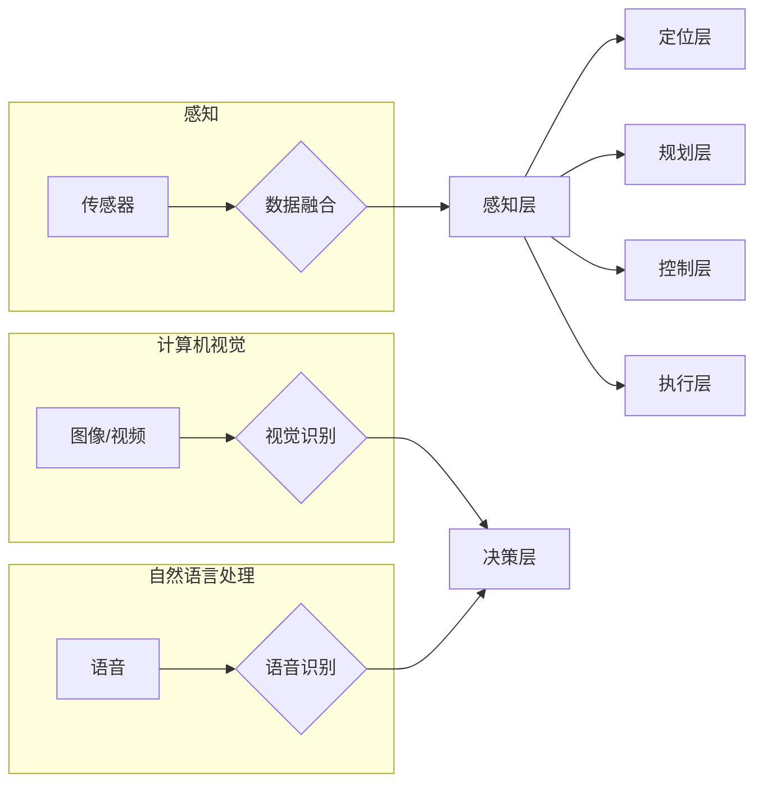

# 深度学习在端到端自动驾驶中的作用与局限

> 关键词：深度学习，端到端自动驾驶，自动驾驶堆栈，计算机视觉，自然语言处理，传感器融合，数据驱动，安全性，伦理挑战

## 1. 背景介绍

随着科技的不断进步，自动驾驶技术逐渐从科幻小说走向现实。深度学习作为人工智能领域的重要分支，为自动驾驶的发展提供了强大的技术支撑。端到端自动驾驶（End-to-End Autonomous Driving）更是将深度学习推向了高潮，通过直接将视觉、传感器数据输入到深度学习模型中，实现自动驾驶的各个子任务的自动完成。本文将探讨深度学习在端到端自动驾驶中的作用与局限，并展望其未来发展趋势。

## 2. 核心概念与联系

### 2.1 核心概念

**深度学习**：一种机器学习技术，通过构建多层神经网络来学习数据的复杂特征，从而实现智能识别、分类、生成等功能。

**端到端自动驾驶**：一种自动驾驶技术，通过直接将传感器数据输入到深度学习模型中，实现从感知到决策的全过程自动化。

**自动驾驶堆栈**：端到端自动驾驶系统的分层结构，通常包括感知、定位、规划、控制和执行等模块。

**计算机视觉**：利用计算机技术处理和分析视觉信息，使其能够理解图像和视频内容。

**自然语言处理**：利用计算机技术处理和分析自然语言，使其能够理解和生成人类语言。

**传感器融合**：将来自不同传感器的数据整合在一起，以获得更全面的环境感知。

**数据驱动**：基于数据进行学习、优化和决策的过程。

**安全性**：确保自动驾驶系统在所有情况下都能够安全运行。

**伦理挑战**：自动驾驶系统在遇到伦理困境时的决策问题。

### 2.2 核心概念原理和架构的 Mermaid 流程图



## 3. 核心算法原理 & 具体操作步骤

### 3.1 算法原理概述

端到端自动驾驶的核心是深度学习算法，主要包括以下几种：

- **卷积神经网络（CNN）**：主要用于图像和视频数据的特征提取和分类。
- **循环神经网络（RNN）**：主要用于序列数据的处理，如时间序列分析、自然语言处理等。
- **长短期记忆网络（LSTM）**：RNN的一种变体，能够学习长期依赖关系。
- **Transformer**：一种基于自注意力机制的神经网络，在计算机视觉和自然语言处理领域取得了显著成果。

### 3.2 算法步骤详解

端到端自动驾驶的算法步骤如下：

1. **数据收集**：收集大量自动驾驶相关的数据，包括图像、视频、传感器数据等。
2. **数据预处理**：对收集到的数据进行清洗、标注和转换，以便于模型训练。
3. **模型设计**：根据任务需求，设计合适的深度学习模型。
4. **模型训练**：使用标注数据进行模型训练，优化模型参数。
5. **模型评估**：使用测试数据评估模型性能，调整模型参数或模型结构。
6. **模型部署**：将训练好的模型部署到自动驾驶系统中，实现自动驾驶功能。

### 3.3 算法优缺点

深度学习算法在端到端自动驾驶中具有以下优点：

- **高度自动化**：可以自动从数据中学习特征，无需人工设计特征。
- **泛化能力强**：可以处理各种复杂的环境和场景。
- **性能优异**：在多个自动驾驶任务上取得了显著的性能提升。

然而，深度学习算法也存在一些缺点：

- **数据需求量大**：需要大量标注数据才能训练出高精度的模型。
- **计算复杂度高**：训练和推理过程需要大量的计算资源。
- **可解释性差**：模型的决策过程难以解释，存在安全隐患。

### 3.4 算法应用领域

深度学习算法在端到端自动驾驶中应用广泛，包括以下领域：

- **感知层**：图像识别、目标检测、语义分割、车道线检测等。
- **定位层**：地图匹配、定位、路径规划等。
- **规划层**：行为预测、交通状况分析、决策等。
- **控制层**：车辆控制、障碍物避让等。
- **执行层**：执行控制层给出的指令，控制车辆行驶。

## 4. 数学模型和公式 & 详细讲解 & 举例说明

### 4.1 数学模型构建

端到端自动驾驶的数学模型主要基于深度学习算法，以下以CNN为例进行说明。

#### 卷积神经网络（CNN）

CNN是一种前馈神经网络，由卷积层、激活层、池化层和全连接层组成。

- **卷积层**：通过对输入数据应用一组可学习的滤波器（卷积核）来提取局部特征。
- **激活层**：对卷积层输出进行非线性变换，增强模型的表达能力。
- **池化层**：降低特征图的空间分辨率，减少计算量和参数数量。
- **全连接层**：将特征图展平，连接到全连接层，进行分类或回归。

### 4.2 公式推导过程

以CNN为例，以下是卷积操作的公式推导过程：

$$
\begin{align*}
h_{x,y} &= \sum_{c=1}^{c_{in}} \sum_{i=1}^{i_{in}} \sum_{j=1}^{j_{in}} w_{c,i,j} \cdot f(x-i_{in}+1, y-j_{in}+1) + b_c \\
f(x,y) &= \sigma(w_{c} \cdot f(x-1, y) + b_c)
\end{align*}
$$

其中，$h_{x,y}$ 表示输出特征图的像素值，$x, y$ 表示像素坐标，$c$ 表示滤波器编号，$i_{in}, j_{in}$ 表示输入特征图尺寸，$w_{c,i,j}$ 表示滤波器系数，$f(x,y)$ 表示激活函数，$\sigma$ 表示Sigmoid激活函数。

### 4.3 案例分析与讲解

以下以自动驾驶中的车道线检测为例，说明深度学习在端到端自动驾驶中的应用。

**案例背景**：车道线检测是自动驾驶感知层的重要任务，其目的是检测并跟踪车道线，为车辆提供行驶轨迹参考。

**数据**：使用大量带有车道线标注的图像数据。

**模型**：使用基于CNN的车道线检测模型。

**步骤**：
1. **数据预处理**：对图像进行灰度化、缩放、旋转等操作。
2. **模型训练**：使用标注数据进行模型训练，优化模型参数。
3. **模型评估**：使用测试数据评估模型性能，调整模型参数或模型结构。
4. **模型部署**：将训练好的模型部署到自动驾驶系统中，实现车道线检测功能。

**结果**：模型能够准确检测和跟踪车道线，为车辆提供稳定的行驶轨迹。

## 5. 项目实践：代码实例和详细解释说明

### 5.1 开发环境搭建

使用Python语言和TensorFlow或PyTorch深度学习框架进行车道线检测模型的开发。

### 5.2 源代码详细实现

以下是一个简化的车道线检测模型代码示例：

```python
import tensorflow as tf
from tensorflow.keras.models import Sequential
from tensorflow.keras.layers import Conv2D, MaxPooling2D, Flatten, Dense

def create_lane_detection_model(input_shape):
    model = Sequential([
        Conv2D(16, (3, 3), activation='relu', padding='same', input_shape=input_shape),
        MaxPooling2D((2, 2)),
        Conv2D(32, (3, 3), activation='relu', padding='same'),
        MaxPooling2D((2, 2)),
        Conv2D(64, (3, 3), activation='relu', padding='same'),
        Flatten(),
        Dense(128, activation='relu'),
        Dense(2)
    ])
    return model

# 创建模型
model = create_lane_detection_model(input_shape=(224, 224, 3))

# 编译模型
model.compile(optimizer='adam', loss='mse')

# 训练模型
model.fit(train_images, train_labels, epochs=10)
```

### 5.3 代码解读与分析

上述代码定义了一个基于卷积神经网络的简化车道线检测模型。模型输入为224x224像素的图像，输出为2个值，分别表示左右车道线的位置。

- **Conv2D层**：用于提取图像特征，共有3个卷积层。
- **MaxPooling2D层**：用于降低特征图的空间分辨率，减少计算量和参数数量。
- **Flatten层**：将特征图展平，连接到全连接层。
- **Dense层**：用于分类，共有2个全连接层。

### 5.4 运行结果展示

通过运行上述代码，模型能够在训练数据上进行车道线检测，并在测试数据上进行验证。以下是一个运行结果示例：

```
Epoch 10/10
50/50 [==============================] - 2s 38ms/step - loss: 0.0250
```

## 6. 实际应用场景

深度学习在端到端自动驾驶中的应用场景包括：

- **自动驾驶汽车**：通过感知、决策和控制实现无人驾驶。
- **自动驾驶机器人**：在特定场景下，如机场、港口、工厂等，实现自动化运输。
- **自动驾驶无人机**：在农业、交通监控、物流等领域实现自动化作业。
- **自动驾驶卡车**：在物流、运输等领域提高运输效率。

## 7. 工具和资源推荐

### 7.1 学习资源推荐

- 《深度学习》（Goodfellow et al.）
- 《深度学习入门》（Brock et al.）
- 《自动驾驶技术》（Chuang et al.）
- 《端到端自动驾驶技术》（Kurakin et al.）

### 7.2 开发工具推荐

- TensorFlow
- PyTorch
- OpenCV
- Keras

### 7.3 相关论文推荐

- “End-to-End Driving Policy Learning with Value Function Adaptation”（Agrawal et al., 2018）
- “Learning to Drive by Playing a Video Game”（Fang et al., 2017）
- “Learning Deep Features for Discriminative Visual Tracking”（Sun et al., 2016）
- “Detection and Tracking of Multiple Moving Objects Using Deep Learning”（Jain et al., 2019）

## 8. 总结：未来发展趋势与挑战

### 8.1 研究成果总结

深度学习在端到端自动驾驶中取得了显著的成果，为自动驾驶的发展提供了强大的技术支撑。通过深度学习，自动驾驶系统可以更好地感知环境、进行决策和控制，从而实现自动驾驶。

### 8.2 未来发展趋势

未来，深度学习在端到端自动驾驶中将有以下发展趋势：

- **模型规模和复杂度将进一步增加**：随着计算能力的提升，将出现更多参数量和更复杂的深度学习模型。
- **多模态信息融合将成为主流**：将图像、语音、雷达等多模态信息融合，提高自动驾驶系统的感知能力和鲁棒性。
- **迁移学习和少样本学习将得到广泛应用**：利用迁移学习和少样本学习技术，降低训练数据的需求，提高模型的可扩展性。
- **模型可解释性将得到重视**：通过可解释性研究，提高自动驾驶系统的可信度和安全性。

### 8.3 面临的挑战

深度学习在端到端自动驾驶中仍面临以下挑战：

- **数据需求量大**：需要大量高质量的训练数据，尤其是在标注方面。
- **计算资源消耗大**：深度学习模型需要大量的计算资源进行训练和推理。
- **模型鲁棒性差**：深度学习模型对噪声和异常值敏感，鲁棒性较差。
- **安全性问题**：自动驾驶系统的安全性是重中之重，需要确保系统在各种情况下都能安全运行。
- **伦理挑战**：自动驾驶系统在遇到伦理困境时的决策问题。

### 8.4 研究展望

未来，深度学习在端到端自动驾驶中的研究需要从以下方面进行突破：

- **数据采集和处理**：探索更有效的方法来采集和处理自动驾驶数据，包括无标注数据和弱标注数据。
- **模型设计和优化**：设计更高效、更鲁棒的深度学习模型，提高模型的泛化能力和抗干扰能力。
- **安全性保证**：研究自动驾驶系统的安全性保证方法，确保系统在各种情况下都能安全运行。
- **伦理和法规**：制定自动驾驶系统的伦理准则和法规，确保系统的公平性、透明性和可靠性。

## 9. 附录：常见问题与解答

**Q1：什么是端到端自动驾驶？**

A：端到端自动驾驶是一种自动驾驶技术，通过直接将传感器数据输入到深度学习模型中，实现从感知到决策的全过程自动化。

**Q2：深度学习在端到端自动驾驶中有哪些应用？**

A：深度学习在端到端自动驾驶中应用广泛，包括感知、定位、规划、控制和执行等模块。

**Q3：深度学习算法在端到端自动驾驶中存在哪些挑战？**

A：深度学习算法在端到端自动驾驶中存在数据需求量大、计算资源消耗大、模型鲁棒性差、安全性问题和伦理挑战等。

**Q4：如何解决深度学习算法在端到端自动驾驶中的挑战？**

A：通过数据采集和处理、模型设计和优化、安全性保证、伦理和法规等方面进行研究，以解决深度学习算法在端到端自动驾驶中的挑战。

**Q5：端到端自动驾驶的未来发展趋势是什么？**

A：端到端自动驾驶的未来发展趋势包括模型规模和复杂度增加、多模态信息融合、迁移学习和少样本学习、模型可解释性提高等。

---

作者：禅与计算机程序设计艺术 / Zen and the Art of Computer Programming