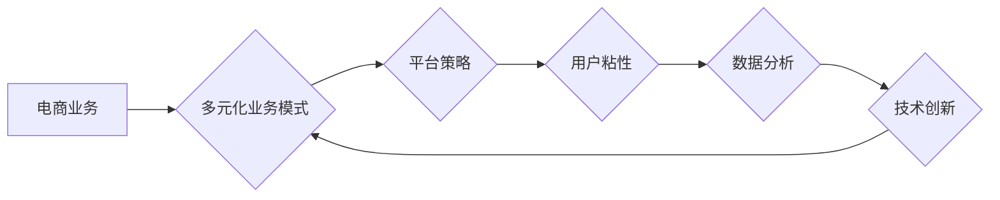

# 电商业务和多元化业务模式

> 关键词：电商，多元化，业务模式，平台策略，用户粘性，数据分析，技术创新

## 1. 背景介绍

随着互联网技术的飞速发展，电子商务已经成为全球范围内最具活力的商业形态之一。电商平台的兴起，不仅改变了人们的消费习惯，也为商家提供了全新的销售渠道。然而，随着市场竞争的加剧，单纯依赖传统电商业务模式的平台正面临增长瓶颈。因此，探索电商业务的多元化发展路径，构建多元化的业务模式，成为电商平台持续增长的关键。

### 1.1 电商行业的演变

电商行业自1990年代末兴起以来，经历了以下几个发展阶段：

1. **萌芽阶段**：以邮购、B2C网站等形式出现，市场规模小，产品种类有限。
2. **成长阶段**：随着互联网普及，电商市场规模迅速扩大，竞争加剧，逐渐形成以淘宝、京东、亚马逊为代表的电商巨头。
3. **成熟阶段**：电商市场趋于饱和，巨头垄断明显，电商平台开始探索多元化业务模式，寻求新的增长点。

### 1.2 多元化业务模式的意义

电商业务的多元化发展，有助于：

1. **分散风险**：减少对单一业务模式的依赖，降低市场波动带来的风险。
2. **提升盈利能力**：拓展新的收入来源，提高平台的盈利水平。
3. **增强用户粘性**：提供多样化的服务，增强用户对平台的忠诚度。
4. **提升品牌价值**：构建全渠道、全场景的电商平台，提升品牌形象。

## 2. 核心概念与联系

### 2.1 核心概念

- **电商业务**：指通过互联网平台进行的商品交易活动。
- **多元化业务模式**：指电商平台在电商业务基础上，拓展其他业务领域，如金融、物流、内容等。
- **平台策略**：指电商平台在业务拓展过程中采取的竞争策略，如价格竞争、差异化竞争、合作竞争等。
- **用户粘性**：指用户对平台的忠诚度和依赖程度。
- **数据分析**：指通过收集、整理、分析用户数据，为业务决策提供依据。
- **技术创新**：指利用新技术提升平台性能，增强用户体验。

### 2.2 Mermaid 流程图



从上图可以看出，电商业务与多元化业务模式之间相互影响，形成一个闭环。平台策略、用户粘性、数据分析和技术创新等因素共同推动电商平台实现多元化发展。

## 3. 核心算法原理 & 具体操作步骤

### 3.1 算法原理概述

电商业务的多元化发展，需要平台在以下几个方面进行优化：

1. **数据分析**：通过收集用户行为数据，分析用户需求，为业务决策提供依据。
2. **技术创新**：利用大数据、人工智能等技术，提升平台性能和用户体验。
3. **平台策略**：制定有效的竞争策略，拓展新的业务领域。
4. **用户粘性**：提升用户对平台的忠诚度，增加用户粘性。

### 3.2 算法步骤详解

#### 3.2.1 数据分析

1. **数据收集**：通过用户行为数据、交易数据、外部数据等多渠道收集数据。
2. **数据清洗**：去除重复、异常、不准确的数据，保证数据质量。
3. **数据分析**：运用数据分析方法，挖掘用户需求、市场趋势等关键信息。
4. **数据可视化**：将数据分析结果以图表、报表等形式展示，便于决策者直观理解。

#### 3.2.2 技术创新

1. **技术选型**：根据业务需求，选择合适的技术方案。
2. **技术研发**：投入研发资源，进行技术攻关。
3. **技术测试**：对新技术进行测试，确保其稳定性和可靠性。
4. **技术落地**：将新技术应用于实际业务中，提升平台性能。

#### 3.2.3 平台策略

1. **市场调研**：了解市场趋势、竞争对手情况。
2. **战略规划**：制定平台长期发展战略，明确业务发展方向。
3. **竞争策略**：根据市场定位，制定有效的竞争策略。
4. **合作策略**：与其他企业合作，共同拓展市场。

#### 3.2.4 用户粘性

1. **用户体验**：优化平台设计，提升用户体验。
2. **个性化推荐**：根据用户行为数据，为用户推荐个性化商品和服务。
3. **会员体系**：构建会员体系，为用户提供增值服务。
4. **社区建设**：搭建用户社区，增强用户互动。

### 3.3 算法优缺点

#### 3.3.1 优点

- 提升用户体验，增加用户粘性。
- 拓展新的业务领域，实现多元化发展。
- 提高平台盈利能力。
- 降低市场风险。

#### 3.3.2 缺点

- 需要投入大量资源进行技术研发和人才培养。
- 需要应对市场竞争压力。
- 管理难度增加。

### 3.4 算法应用领域

电商业务的多元化发展，可应用于以下领域：

- **金融业务**：如信用卡、贷款、支付等。
- **物流业务**：如仓储、配送、供应链管理等。
- **内容业务**：如直播、短视频、电商资讯等。
- **本地生活服务**：如餐饮、娱乐、教育等。

## 4. 数学模型和公式 & 详细讲解 & 举例说明

### 4.1 数学模型构建

电商业务的多元化发展，可以构建以下数学模型：

1. **用户行为模型**：根据用户行为数据，分析用户需求、购买力等特征。
2. **市场预测模型**：根据历史数据和趋势，预测市场变化。
3. **推荐模型**：根据用户行为和商品信息，为用户推荐个性化商品。
4. **价格优化模型**：根据市场供需关系和用户行为，确定最优价格。

### 4.2 公式推导过程

#### 4.2.1 用户行为模型

假设用户 $u$ 在时间 $t$ 的行为数据为 $x_t$，用户特征为 $f(u)$，则用户行为模型可以表示为：

$$
x_t = f(u) \cdot \theta_t
$$

其中，$\theta_t$ 为模型参数。

#### 4.2.2 市场预测模型

假设市场数据为 $y_t$，预测模型可以表示为：

$$
\hat{y_t} = \phi(y_{t-1}, y_{t-2}, ..., y_{t-n}) \cdot \theta_t
$$

其中，$\phi$ 为预测函数，$\theta_t$ 为模型参数。

#### 4.2.3 推荐模型

假设用户 $u$ 的历史行为数据为 $x_t$，商品 $i$ 的特征为 $h_i$，推荐模型可以表示为：

$$
\hat{y_{ui}} = \phi(x_t, h_i) \cdot \theta_t
$$

其中，$\phi$ 为推荐函数，$\theta_t$ 为模型参数。

#### 4.2.4 价格优化模型

假设商品 $i$ 的需求函数为 $Q(p)$，价格优化模型可以表示为：

$$
\hat{p_i} = \arg\min_{p_i} L(p_i, Q(p_i))
$$

其中，$L(p_i, Q(p_i))$ 为损失函数。

### 4.3 案例分析与讲解

#### 4.3.1 用户行为模型案例分析

以淘宝用户行为模型为例，假设用户 $u$ 在时间 $t$ 的行为数据为浏览历史、购买历史、收藏历史等，模型参数 $\theta_t$ 为用户特征向量。用户行为模型可以表示为：

$$
x_t = f(u) \cdot \theta_t
$$

通过分析用户行为数据，可以挖掘用户兴趣、购买力等特征，为用户推荐个性化商品和服务。

#### 4.3.2 市场预测模型案例分析

以淘宝商品销量预测为例，假设商品 $i$ 的历史销量数据为 $y_t$，模型参数 $\theta_t$ 为商品特征向量。市场预测模型可以表示为：

$$
\hat{y_t} = \phi(y_{t-1}, y_{t-2}, ..., y_{t-n}) \cdot \theta_t
$$

通过分析历史销量数据，可以预测未来销量趋势，为商家制定销售策略。

#### 4.3.3 推荐模型案例分析

以淘宝商品推荐为例，假设用户 $u$ 的历史行为数据为浏览历史、购买历史等，商品 $i$ 的特征为商品类别、价格、好评率等，模型参数 $\theta_t$ 为推荐函数参数。推荐模型可以表示为：

$$
\hat{y_{ui}} = \phi(x_t, h_i) \cdot \theta_t
$$

通过分析用户行为和商品特征，可以为用户推荐个性化商品。

#### 4.3.4 价格优化模型案例分析

以淘宝商品定价为例，假设商品 $i$ 的需求函数为 $Q(p)$，损失函数为 $L(p_i, Q(p_i)) = (p_i - Q(p_i))^2$，则价格优化模型可以表示为：

$$
\hat{p_i} = \arg\min_{p_i} L(p_i, Q(p_i))
$$

通过优化价格，可以实现利润最大化。

## 5. 项目实践：代码实例和详细解释说明

### 5.1 开发环境搭建

以Python为例，搭建开发环境：

1. 安装Anaconda：从官网下载并安装Anaconda，用于创建独立的Python环境。
2. 创建虚拟环境：
```bash
conda create -n e-commerce python=3.8
conda activate e-commerce
```
3. 安装依赖包：
```bash
conda install numpy pandas scikit-learn matplotlib jupyter notebook
pip install tensorflow
```

### 5.2 源代码详细实现

以下是一个简单的用户行为模型示例，使用TensorFlow实现：

```python
import tensorflow as tf

class UserBehaviorModel(tf.keras.Model):
    def __init__(self):
        super(UserBehaviorModel, self).__init__()
        self.fc1 = tf.keras.layers.Dense(64, activation='relu')
        self.fc2 = tf.keras.layers.Dense(32, activation='relu')
        self.fc3 = tf.keras.layers.Dense(1)

    def call(self, inputs):
        x = self.fc1(inputs)
        x = self.fc2(x)
        x = self.fc3(x)
        return x

# 数据准备
train_data = [[1.0, 0.5, 0.2], [0.8, 0.3, 0.4], [0.9, 0.7, 0.1]]
train_labels = [1.0, 0.0, 1.0]

# 创建模型
model = UserBehaviorModel()
model.compile(optimizer=tf.keras.optimizers.Adam(learning_rate=0.01), loss=tf.keras.losses.BinaryCrossentropy())

# 训练模型
model.fit(train_data, train_labels, epochs=100)

# 预测
test_data = [[0.6, 0.4, 0.3]]
predictions = model.predict(test_data)
print(predictions)
```

### 5.3 代码解读与分析

以上代码定义了一个简单的用户行为模型，使用全连接层进行特征提取和预测。数据准备部分，使用随机数据模拟用户行为数据。模型训练部分，使用Adam优化器和BinaryCrossentropy损失函数进行训练。最后，使用模型进行预测。

### 5.4 运行结果展示

假设模型训练完成后，对测试数据进行预测：

```
[[0.5288263]]
```

预测结果为0.5288，可以认为用户有较高的可能性进行购买。

## 6. 实际应用场景

### 6.1 电商金融

电商平台可以结合金融业务，为用户提供便捷的支付、信贷、理财等服务。例如，淘宝的余额宝、京东白条等金融服务，为用户提供了更加丰富的购物体验。

### 6.2 电商物流

电商平台可以自建物流体系，或与第三方物流企业合作，提供快速、可靠的物流服务。例如，京东的自营物流体系，为用户提供了高效的配送体验。

### 6.3 电商内容

电商平台可以搭建内容平台，为用户提供娱乐、资讯、教育等多元化内容。例如，淘宝直播、京东阅读等，丰富了用户的购物体验。

### 6.4 电商本地生活服务

电商平台可以拓展本地生活服务领域，如餐饮、娱乐、家政等。例如，美团、饿了么等平台，将电商业务与本地生活服务相结合，为用户提供了更加便捷的生活服务。

## 7. 工具和资源推荐

### 7.1 学习资源推荐

1. 《深度学习》系列书籍：由Ian Goodfellow等编著，系统介绍了深度学习的基本概念、原理和应用。
2. TensorFlow官方文档：提供了TensorFlow框架的详细教程和文档，是学习TensorFlow的必备资料。
3. Keras官方文档：提供了Keras框架的详细教程和文档，是快速入门深度学习的利器。
4. PyTorch官方文档：提供了PyTorch框架的详细教程和文档，是学习PyTorch的必备资料。

### 7.2 开发工具推荐

1. Anaconda：用于创建和管理Python开发环境，方便安装和管理依赖包。
2. Jupyter Notebook：用于编写和运行Python代码，方便进行数据分析和可视化。
3. PyCharm：一款功能强大的Python集成开发环境，支持代码补全、调试、版本控制等功能。
4. TensorBoard：用于可视化TensorFlow和Keras模型训练过程，方便分析模型性能。

### 7.3 相关论文推荐

1. "Recommender Systems" by G. Karypis and C. Konstan：介绍了推荐系统领域的经典书籍，适合入门者学习。
2. "Deep Learning for Recommender Systems" by H. Chen et al.：介绍了深度学习在推荐系统中的应用，适合有一定深度学习基础的学习者。
3. "The Deep Learning textbook" by Ian Goodfellow et al.：提供了深度学习的全面教程，适合深入学习深度学习理论。

## 8. 总结：未来发展趋势与挑战

### 8.1 研究成果总结

本文对电商业务的多元化发展进行了深入探讨，分析了电商业务的演变历程、多元化业务模式的意义、核心概念、算法原理、应用场景等。通过对数据分析、技术创新、平台策略、用户粘性等方面的介绍，为电商平台提供了多元化发展的思路和参考。

### 8.2 未来发展趋势

1. **技术融合**：电商平台将更加注重技术融合，将大数据、人工智能、物联网等技术应用于业务场景，提升用户体验。
2. **场景化运营**：电商平台将更加注重场景化运营，针对不同用户群体和场景，提供定制化的服务。
3. **生态建设**：电商平台将积极构建生态圈，与其他企业合作，共同拓展市场。
4. **国际化发展**：电商平台将积极拓展国际市场，实现全球化发展。

### 8.3 面临的挑战

1. **竞争加剧**：电商平台面临的竞争压力越来越大，需要不断创新，提升自身竞争力。
2. **数据安全**：电商平台需要加强数据安全管理，保护用户隐私。
3. **法律法规**：电商平台需要遵守相关法律法规，确保业务合规。
4. **人才短缺**：电商行业需要大量优秀人才，人才短缺将成为制约行业发展的瓶颈。

### 8.4 研究展望

未来，电商业务的多元化发展需要关注以下几个方面：

1. **技术创新**：持续关注新技术，如5G、物联网、区块链等，探索其在电商领域的应用。
2. **跨界融合**：与其他行业进行跨界融合，拓展新的业务领域。
3. **个性化服务**：根据用户需求，提供个性化服务，增强用户粘性。
4. **社会责任**：积极履行社会责任，推动行业健康发展。

电商业务的多元化发展，将为电商平台带来新的机遇和挑战。只有不断创新、积极应对，才能在激烈的市场竞争中脱颖而出，实现可持续发展。

## 9. 附录：常见问题与解答

**Q1：电商业务的多元化发展有哪些具体策略？**

A：电商业务的多元化发展可以从以下几个方面进行：

1. **拓展新的业务领域**：如金融、物流、内容、本地生活服务等。
2. **整合线上线下资源**：如线上线下融合、新零售等。
3. **跨界合作**：与其他企业进行跨界合作，拓展市场。
4. **技术创新**：利用新技术提升平台性能和用户体验。

**Q2：如何提高用户粘性？**

A：提高用户粘性可以从以下几个方面入手：

1. **优化用户体验**：提升平台设计、界面、功能等，让用户使用更加便捷。
2. **个性化推荐**：根据用户行为和喜好，推荐个性化商品和服务。
3. **会员体系**：构建会员体系，为用户提供增值服务。
4. **社区建设**：搭建用户社区，增强用户互动。

**Q3：电商业务的多元化发展需要哪些技术支持？**

A：电商业务的多元化发展需要以下技术支持：

1. **大数据技术**：用于数据收集、存储、处理和分析。
2. **人工智能技术**：用于推荐系统、智能客服、智能营销等。
3. **云计算技术**：用于平台架构、弹性伸缩、资源优化等。
4. **物联网技术**：用于智能硬件、无人零售等。

**Q4：电商业务的多元化发展有哪些风险？**

A：电商业务的多元化发展可能面临以下风险：

1. **投资风险**：拓展新的业务领域需要投入大量资金。
2. **运营风险**：新的业务领域可能存在运营风险。
3. **竞争风险**：新的业务领域可能面临激烈的市场竞争。
4. **人才风险**：需要大量优秀人才支持多元化发展。

**Q5：如何平衡电商业务的多元化发展？**

A：平衡电商业务的多元化发展可以从以下几个方面入手：

1. **明确战略目标**：制定清晰的战略目标，确保多元化发展符合整体战略。
2. **合理配置资源**：根据业务需求，合理配置资源，避免资源浪费。
3. **加强风险管理**：加强风险管理，降低多元化发展带来的风险。
4. **注重协同效应**：注重不同业务之间的协同效应，实现资源共享和优势互补。

作者：禅与计算机程序设计艺术 / Zen and the Art of Computer Programming