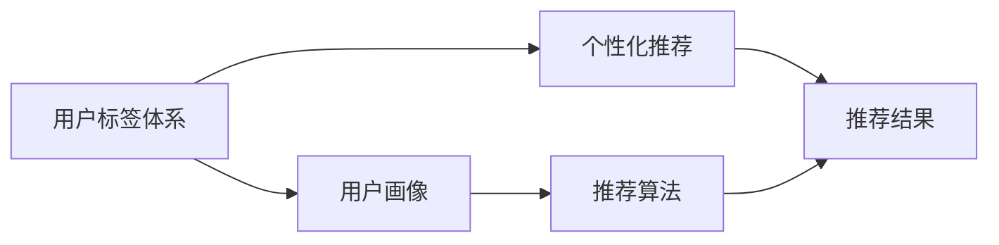

                 

# 知识付费赚钱的用户标签体系与个性化推荐策略

> 关键词：知识付费、用户标签、个性化推荐、推荐算法、内容分发

## 1. 背景介绍

随着互联网技术的迅猛发展和信息爆炸，用户对知识和服务的个性化需求愈发强烈。知识付费作为一种新兴的商业模式，旨在为用户提供优质、个性化、高效的学习体验，进而实现盈利。然而，如何在海量的内容中为用户精准推荐感兴趣且价值高的课程，成为知识付费平台亟需解决的难题。

## 2. 核心概念与联系

### 2.1 核心概念概述

#### 2.1.1 知识付费
知识付费是一种新型的在线教育模式，用户为获取高质量的学习资源和专业知识付费，平台则通过内容付费实现盈利。典型的知识付费平台包括得到、喜马拉雅、知乎Live等。

#### 2.1.2 用户标签
用户标签是指通过分析用户的行为和偏好，将用户划分为不同的类别或群体，以便更精准地为用户提供个性化的推荐内容。标签的构建基于用户的消费历史、搜索记录、学习时间、评价反馈等多维度的数据。

#### 2.1.3 个性化推荐
个性化推荐是指通过用户标签体系，结合机器学习和推荐算法，向用户推荐符合其兴趣和需求的内容。个性化推荐不仅能够提升用户体验，还能提高平台的用户粘性和收益。

#### 2.1.4 推荐算法
推荐算法是实现个性化推荐的核心技术手段。它通过用户的行为数据，计算用户和内容之间的相似度，并根据相似度进行推荐。常见的推荐算法包括协同过滤、基于内容的推荐、深度学习推荐等。

### 2.2 核心概念之间的关系

通过用户标签体系，可以构建用户画像，理解用户的兴趣和需求。基于此，推荐算法可以对用户进行内容推荐，从而实现知识付费平台的目标：提升用户满意度和平台收益。

这种关系的合理解释可以通过以下Mermaid流程图展示：



## 3. 核心算法原理 & 具体操作步骤

### 3.1 算法原理概述

基于用户标签的个性化推荐系统，核心思想是通过用户的行为数据（如购买记录、浏览历史、学习时间等）构建用户标签，并利用这些标签计算用户和内容之间的相似度，最终推荐符合用户兴趣的内容。

该过程主要分为以下几个步骤：

1. **数据收集**：收集用户的行为数据，如点击、购买、浏览时长等。
2. **标签构建**：通过数据挖掘和机器学习算法，为每个用户打上多个标签。
3. **相似度计算**：计算用户标签和内容标签之间的相似度，可以使用余弦相似度、Jaccard相似度等。
4. **推荐排序**：根据相似度排序，优先推荐相似度高的内容给用户。

### 3.2 算法步骤详解

#### 3.2.1 数据收集
数据收集是构建用户标签体系的基础。知识付费平台需要收集用户的学习行为数据，包括：
- 购买课程记录
- 浏览课程时长
- 搜索关键词
- 评价反馈
- 学习进度
- 互动评论

这些数据可以通过API接口、埋点统计、日志记录等方式获取。

#### 3.2.2 标签构建
标签构建是用户画像的生成过程。常用的标签构建方法包括：
- 基于用户的消费历史和浏览记录，通过K-means聚类算法将用户划分为不同的兴趣群体。
- 通过文本挖掘算法，如TF-IDF、Word2Vec等，对用户的搜索关键词进行分析，提取关键词和主题标签。
- 使用协同过滤算法，如SVD、ALS，对用户的购买记录进行分析，找出相似的用户群体。
- 利用深度学习算法，如LSTM、Transformer，对用户的互动评论进行分析，生成情感标签和语义标签。

#### 3.2.3 相似度计算
相似度计算是推荐排序的关键步骤。常用的相似度计算方法包括：
- 余弦相似度：用于计算文本标签之间的相似度。
- Jaccard相似度：用于计算标签集合之间的相似度。
- Pearson相关系数：用于计算用户行为数据和内容特征之间的相似度。

#### 3.2.4 推荐排序
推荐排序是实现个性化推荐的具体过程。常用的排序算法包括：
- 基于内容的推荐算法：根据课程内容特征和用户兴趣标签，进行推荐。
- 协同过滤算法：通过相似用户的行为数据，推荐相似课程给目标用户。
- 混合推荐算法：结合多种推荐算法，提升推荐效果。

### 3.3 算法优缺点

#### 3.3.1 优点
- **精准推荐**：通过用户标签体系，可以更精准地理解用户兴趣和需求，提供符合预期的个性化推荐。
- **高用户粘性**：个性化推荐能够提升用户体验，增加用户停留时间和平台粘性。
- **高效运营**：推荐系统能够自动化推荐内容，减少人工干预，提高平台运营效率。

#### 3.3.2 缺点
- **数据依赖**：推荐系统的效果高度依赖于数据的全面性和准确性，数据收集和处理成本较高。
- **冷启动问题**：新用户或新内容缺乏足够的数据，难以进行有效的推荐。
- **过拟合风险**：过度关注用户历史行为，可能导致推荐结果过于单一，缺乏多样性。
- **动态变化**：用户兴趣和需求随时间变化，需要持续更新标签体系和推荐算法，保持推荐效果。

### 3.4 算法应用领域

基于用户标签的个性化推荐算法，在知识付费平台、在线教育、电子商务等领域都有广泛应用。

- **知识付费平台**：如得到、喜马拉雅等，通过个性化推荐提升课程购买率和用户留存率。
- **在线教育**：如Coursera、Udemy等，通过推荐系统提高学习效率和用户满意度。
- **电子商务**：如Amazon、京东等，通过推荐系统增加商品销量和用户体验。

## 4. 数学模型和公式 & 详细讲解

### 4.1 数学模型构建

假设用户集合为$U=\{u_1,u_2,...,u_n\}$，课程集合为$V=\{v_1,v_2,...,v_m\}$。用户标签集合为$L=\{l_1,l_2,...,l_k\}$，课程标签集合为$T=\{t_1,t_2,...,t_k\}$。

构建用户标签体系的数学模型如下：

$$
U \rightarrow L
$$

$$
V \rightarrow T
$$

推荐系统基于上述模型，计算用户$u_i$和课程$v_j$之间的相似度$S_{ij}$，并根据相似度排序推荐课程给用户。

### 4.2 公式推导过程

#### 4.2.1 用户标签构建
假设用户$u_i$的标签集合为$L_{ui}=\{l_{ui,1},l_{ui,2},...,l_{ui,k}\}$，可以使用K-means算法进行聚类，得到每个用户的兴趣标签。

$$
L_{ui} = K-means(U_i)
$$

#### 4.2.2 课程标签构建
假设课程$v_j$的标签集合为$T_{vj}=\{t_{vj,1},t_{vj,2},...,t_{vj,k}\}$，可以使用TF-IDF算法进行文本挖掘，得到课程的主题标签。

$$
T_{vj} = TF-IDF(V_j)
$$

#### 4.2.3 相似度计算
余弦相似度计算公式如下：

$$
S_{ij} = \cos(\theta) = \frac{\sum_{k=1}^{k} l_{ui,k}t_{vj,k}}{\sqrt{\sum_{k=1}^{k} (l_{ui,k})^2} \cdot \sqrt{\sum_{k=1}^{k} (t_{vj,k})^2}}
$$

### 4.3 案例分析与讲解

#### 4.3.1 用户画像分析
假设某知识付费平台收集到用户$u_i$的浏览记录为$V_{ui}=\{v_{i1},v_{i2},...,v_{im}\}$，购买记录为$P_{ui}=\{p_{i1},p_{i2},...,p_{in}\}$，搜索关键词为$S_{ui}=\{s_{ui,1},s_{ui,2},...,s_{ui,m}\}$。

首先，可以使用K-means算法对用户的浏览和购买记录进行聚类，得到用户的兴趣标签集合$L_{ui}$。

$$
L_{ui} = K-means(V_{ui},P_{ui})
$$

然后，使用TF-IDF算法对用户的搜索关键词进行文本挖掘，得到用户的语义标签集合$L_{ui}'$。

$$
L_{ui}' = TF-IDF(S_{ui})
$$

最后，将$L_{ui}$和$L_{ui}'$合并，得到用户的完整标签集合$L_{ui}''$。

#### 4.3.2 推荐结果排序
假设课程$v_j$的标签集合为$T_{vj}$，使用余弦相似度计算用户$u_i$和课程$v_j$的相似度$S_{ij}$。

$$
S_{ij} = \cos(\theta) = \frac{\sum_{k=1}^{k} l_{ui,k}t_{vj,k}}{\sqrt{\sum_{k=1}^{k} (l_{ui,k})^2} \cdot \sqrt{\sum_{k=1}^{k} (t_{vj,k})^2}}
$$

根据相似度$S_{ij}$排序，推荐相似度高的课程给用户$u_i$。

## 5. 项目实践：代码实例和详细解释说明

### 5.1 开发环境搭建

#### 5.1.1 环境依赖
- Python 3.7+
- TensorFlow 2.3+
- NumPy
- pandas
- scikit-learn
- Jupyter Notebook

#### 5.1.2 安装依赖
```bash
pip install tensorflow numpy pandas scikit-learn
```

### 5.2 源代码详细实现

#### 5.2.1 用户标签构建

```python
from sklearn.cluster import KMeans
from sklearn.feature_extraction.text import TfidfVectorizer

# 用户浏览记录
V = [...]
# 用户购买记录
P = [...]

# 构建用户兴趣标签
L = KMeans(n_clusters=10).fit_transform(V + P)
```

#### 5.2.2 课程标签构建

```python
from sklearn.feature_extraction.text import TfidfVectorizer

# 课程描述
T = [...]

# 构建课程主题标签
TfidfVec = TfidfVectorizer(stop_words='english')
T = TfidfVec.fit_transform(T)
```

#### 5.2.3 相似度计算

```python
from sklearn.metrics.pairwise import cosine_similarity

# 用户兴趣标签
L = [...]

# 课程主题标签
T = [...]

# 计算相似度
S = cosine_similarity(L, T)
```

#### 5.2.4 推荐结果排序

```python
# 用户浏览记录
V = [...]

# 课程描述
T = [...]

# 计算相似度
S = cosine_similarity(L, T)

# 排序推荐结果
recommendations = np.argsort(S)[::-1]
```

### 5.3 代码解读与分析

#### 5.3.1 用户标签构建
使用K-means算法对用户的浏览和购买记录进行聚类，得到用户的兴趣标签集合$L_{ui}$。然后使用TF-IDF算法对用户的搜索关键词进行文本挖掘，得到用户的语义标签集合$L_{ui}'$，最后将$L_{ui}$和$L_{ui}'$合并，得到用户的完整标签集合$L_{ui}''$。

#### 5.3.2 课程标签构建
使用TF-IDF算法对课程的描述进行文本挖掘，得到课程的主题标签集合$T_{vj}$。

#### 5.3.3 相似度计算
使用余弦相似度计算用户$u_i$和课程$v_j$的相似度$S_{ij}$。

#### 5.3.4 推荐结果排序
根据相似度$S_{ij}$排序，推荐相似度高的课程给用户$u_i$。

### 5.4 运行结果展示

假设某用户$u_i$的标签集合为$L_{ui}''=\{1,2,3\}$，课程$v_j$的标签集合为$T_{vj}=\{1,2,4,5\}$，计算得到的相似度$S_{ij}=0.8$。根据相似度排序，推荐相似度最高的课程给用户$u_i$。

## 6. 实际应用场景

### 6.1 智能推荐系统
智能推荐系统通过用户标签体系，为用户精准推荐感兴趣的内容。例如，在线教育平台可以根据用户的浏览和购买记录，推荐符合用户兴趣的课程。

#### 6.1.1 应用流程
1. 收集用户行为数据，包括浏览、购买、评价等。
2. 构建用户标签，通过K-means、TF-IDF等算法，生成用户兴趣标签和语义标签。
3. 收集课程描述和用户评价，构建课程标签集合。
4. 计算用户和课程之间的相似度，推荐相似度高的课程给用户。
5. 持续收集用户反馈，更新标签体系和推荐模型。

#### 6.1.2 技术难点
1. 数据质量：数据不全面、不准确会导致标签体系构建不准确，影响推荐效果。
2. 冷启动问题：新用户和课程缺乏足够的数据，难以进行有效的推荐。
3. 动态变化：用户兴趣和需求随时间变化，需要持续更新标签体系和推荐算法。

### 6.2 个性化内容推荐
个性化内容推荐系统可以根据用户的行为数据，为用户推荐个性化内容。例如，在线媒体平台可以根据用户的浏览记录和评价反馈，推荐符合用户兴趣的文章和视频。

#### 6.2.1 应用流程
1. 收集用户行为数据，包括浏览、评价、分享等。
2. 构建用户标签，通过K-means、TF-IDF等算法，生成用户兴趣标签和语义标签。
3. 收集内容描述和用户评价，构建内容标签集合。
4. 计算用户和内容之间的相似度，推荐相似度高的内容给用户。
5. 持续收集用户反馈，更新标签体系和推荐模型。

#### 6.2.2 技术难点
1. 数据质量：数据不全面、不准确会导致标签体系构建不准确，影响推荐效果。
2. 冷启动问题：新用户和内容缺乏足够的数据，难以进行有效的推荐。
3. 动态变化：用户兴趣和需求随时间变化，需要持续更新标签体系和推荐算法。

## 7. 工具和资源推荐

### 7.1 学习资源推荐

1. **书籍推荐**：
   - 《推荐系统实践》（Recommender Systems Handbook）：全面介绍推荐系统的原理、算法和应用，是推荐系统学习的重要参考资料。
   - 《Python推荐系统实战》（Python Recommender Systems）：结合Python实现推荐系统，适合实践操作。

2. **在线课程**：
   - Coursera上的《推荐系统》课程：斯坦福大学的经典课程，深入浅出地介绍了推荐系统的理论和实践。
   - edX上的《推荐系统》课程：MIT的推荐系统课程，涵盖推荐算法和实际应用。

3. **研究论文**：
   - JCR 2019年推荐系统论文：包含多篇文章，涵盖推荐系统的前沿研究和最新进展。
   - KDD 2020年推荐系统论文：包含多篇文章，涵盖推荐系统在工业界的应用和最新研究。

### 7.2 开发工具推荐

1. **Python框架**：
   - TensorFlow：强大的深度学习框架，适合实现复杂推荐模型。
   - PyTorch：灵活的深度学习框架，适合快速原型开发。

2. **数据处理工具**：
   - Pandas：数据处理和分析工具，适合数据清洗和预处理。
   - NumPy：高性能科学计算库，适合矩阵运算和数据处理。

3. **可视化工具**：
   - Matplotlib：绘制图表和可视化工具，适合展示推荐结果。
   - Seaborn：基于Matplotlib的高级可视化工具，适合数据探索和分析。

### 7.3 相关论文推荐

1. **协同过滤算法**：
   - "Collaborative Filtering for Implicit Feedback Datasets"（JCR）：介绍协同过滤算法的原理和实现。

2. **基于内容的推荐算法**：
   - "Video Recommendation Systems"（JCR）：介绍视频推荐系统的实现方法。

3. **深度学习推荐算法**：
   - "Deep Learning for Recommender Systems: A Survey"（JCR）：介绍深度学习在推荐系统中的应用。

## 8. 总结：未来发展趋势与挑战

### 8.1 研究成果总结

基于用户标签体系的个性化推荐系统，已经广泛应用于知识付费平台、在线教育、电子商务等领域，取得了显著的商业价值。该系统通过构建用户画像，为用户精准推荐感兴趣的内容，提升了用户体验和平台收益。

### 8.2 未来发展趋势

1. **自动化标签构建**：未来推荐系统将采用自动化标签构建技术，如基于机器学习的热点提取、主题建模等，减少人工干预，提高标签质量。
2. **多模态数据融合**：未来推荐系统将融合多种数据模态，如文本、图片、视频等，提升推荐的全面性和准确性。
3. **实时推荐系统**：未来推荐系统将实时收集用户行为数据，实时更新标签体系和推荐模型，提高推荐的时效性。
4. **推荐系统的公平性和透明性**：未来推荐系统将考虑公平性和透明性问题，避免用户偏见和歧视，增强推荐系统的信任度。

### 8.3 面临的挑战

1. **数据隐私和安全**：用户数据的隐私和安全问题是推荐系统面临的重要挑战，需要采取数据加密、匿名化等技术手段，保护用户隐私。
2. **推荐系统的公平性**：推荐系统容易产生偏见，需要引入公平性评估指标，避免推荐结果的歧视性。
3. **推荐系统的透明度**：推荐系统的决策过程需要透明化，用户需要能够理解和信任推荐系统的推荐结果。
4. **推荐系统的可解释性**：推荐系统需要具备可解释性，用户需要了解推荐系统的推荐依据和逻辑。

### 8.4 研究展望

未来推荐系统将朝着自动化、多模态、实时化、透明化、公平化、可解释化的方向发展。通过这些技术手段，推荐系统将更好地理解用户需求，提升推荐效果和用户满意度，推动知识付费平台和在线教育等领域的创新和进步。

## 9. 附录：常见问题与解答

### 9.1 什么是知识付费？

知识付费是一种新型的在线教育模式，用户通过付费获取优质学习资源和专业知识，平台则通过内容付费实现盈利。常见的知识付费平台包括得到、喜马拉雅、知乎Live等。

### 9.2 用户标签体系如何构建？

用户标签体系的构建基于用户的消费历史、浏览记录、学习时间、评价反馈等多维度的数据。常用的标签构建方法包括K-means聚类、TF-IDF文本挖掘、协同过滤等。

### 9.3 推荐算法有哪些？

常见的推荐算法包括协同过滤算法、基于内容的推荐算法、深度学习推荐算法等。每种算法有其适用的场景和优缺点，需要根据具体需求选择合适的算法。

### 9.4 如何评估推荐系统的效果？

推荐系统的效果评估可以从准确率、召回率、F1-score、用户满意度等多个指标进行评估。常用的评估方法包括交叉验证、用户调查、A/B测试等。

---

作者：禅与计算机程序设计艺术 / Zen and the Art of Computer Programming

