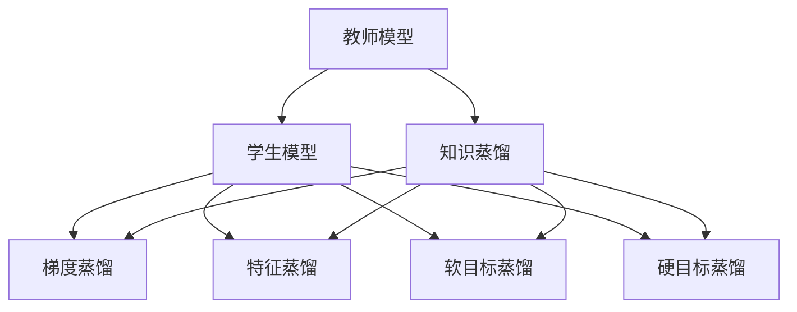
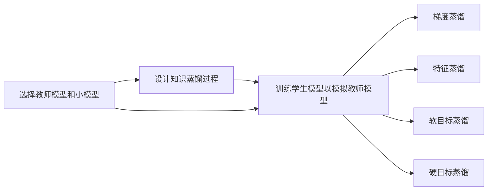
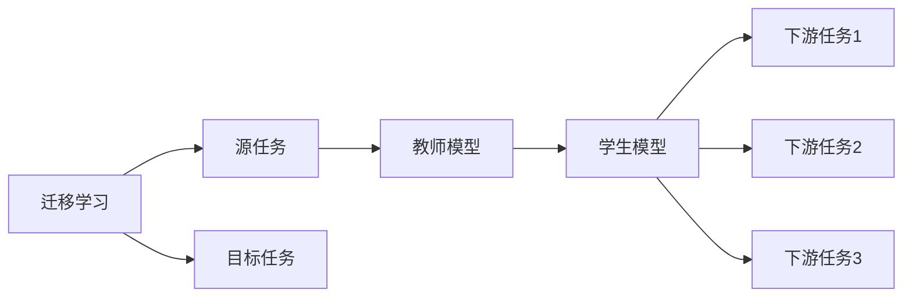
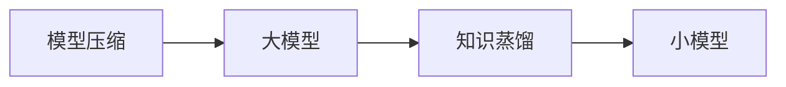
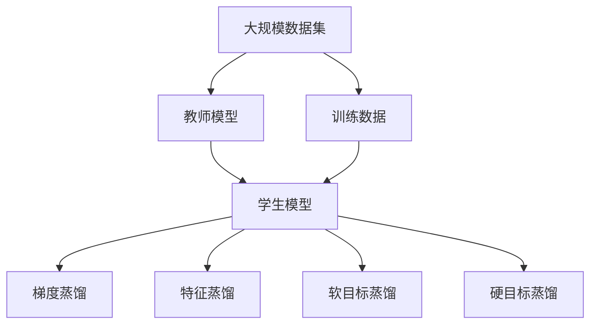

                 

# 知识蒸馏的工作原理及优势分析

## 1. 背景介绍

### 1.1 问题由来
知识蒸馏(Knowledge Distillation)是一种近年来在深度学习领域广受欢迎的技术，旨在将一个复杂的大模型（教师模型）的知识迁移到一个小模型（学生模型），从而提升学生模型的性能。这项技术最早由Bucila等人于2005年提出，并在机器视觉领域进行了初步应用。随后，知识蒸馏逐渐拓展到自然语言处理、语音识别等更多领域，并取得了显著成效。

知识蒸馏背后的核心理念是将大模型的广泛知识以某种形式转移到小模型，使小模型能够掌握与大模型相似的泛化能力。这一方法在模型压缩、推理速度、计算资源等方面具有诸多优势，因此在深度学习领域得到了广泛应用。

### 1.2 问题核心关键点
知识蒸馏的核心在于通过教师模型和小模型之间的知识传递，将大模型的知识以多种形式（如梯度、概率分布、激活函数等）转移到学生模型，从而提升后者的性能。其主要步骤包括：
- 选择教师模型和小模型
- 设计知识蒸馏过程
- 训练学生模型以模拟教师模型

通过这一过程，小模型在训练数据上表现优异，同时计算资源和存储资源消耗低，能够更好地适配于各种场景。

## 2. 核心概念与联系

### 2.1 核心概念概述
为了更好地理解知识蒸馏的原理和应用，本节将介绍几个关键概念：

- **教师模型(teacher model)**：通常是一个大规模的深度学习模型，拥有广泛的知识和强大的泛化能力。教师模型的目标是优化自身性能，可以是预训练模型或大规模训练后的模型。

- **学生模型(student model)**：相对于教师模型而言，学生模型是一个规模较小的深度学习模型，其目标是模拟教师模型的泛化能力和推理能力，通常是一个浅层模型或轻量化模型。

- **知识蒸馏(knowledge distillation)**：从教师模型向学生模型传递知识的过程，通常采用梯度匹配、概率分布匹配、特征匹配等方法，将教师模型的知识以某种形式转移到学生模型。

- **梯度蒸馏(gradient distillation)**：通过模拟教师模型的梯度信息，使学生模型能够在训练过程中更接近教师模型的输出分布。

- **特征蒸馏(feature distillation)**：通过匹配教师模型与学生模型的特征表示，将教师模型的知识以特征映射的形式传递给学生模型。

- **软目标蒸馏(soft target distillation)**：在训练过程中，将教师模型对样本的预测概率分布作为学生模型的目标分布，通过最小化交叉熵损失实现知识传递。

- **硬目标蒸馏(hard target distillation)**：将教师模型对样本的预测标签作为学生模型的目标标签，通过直接匹配标签的方式传递知识。

这些概念之间的逻辑关系可以通过以下Mermaid流程图来展示：



### 2.2 概念间的关系

这些核心概念之间存在着紧密的联系，形成了知识蒸馏技术的完整生态系统。下面通过几个Mermaid流程图来展示这些概念之间的关系。

#### 2.2.1 知识蒸馏的总体框架



这个流程图展示了知识蒸馏的总体框架。首先，选择教师模型和小模型；然后设计知识蒸馏过程；最后训练学生模型以模拟教师模型。在训练过程中，可以采用梯度蒸馏、特征蒸馏、软目标蒸馏、硬目标蒸馏等多种形式进行知识传递。

#### 2.2.2 知识蒸馏与迁移学习的联系



这个流程图展示了迁移学习与知识蒸馏的联系。迁移学习涉及源任务和目标任务，教师模型在源任务上学习，然后通过知识蒸馏过程，将知识转移到学生模型，用于目标任务上的下游任务。

#### 2.2.3 知识蒸馏与模型压缩的联系



这个流程图展示了知识蒸馏与模型压缩的联系。模型压缩旨在通过减小模型规模，提高推理速度和计算效率。知识蒸馏通过将大模型的知识转移到小模型，实现了模型压缩的目标。

### 2.3 核心概念的整体架构

最后，我们用一个综合的流程图来展示这些核心概念在大规模知识蒸馏过程中的整体架构：



这个综合流程图展示了从大规模数据集到知识蒸馏过程的完整过程。大规模数据集用于教师模型的预训练，然后通过知识蒸馏过程，将教师模型的知识传递给学生模型。学生模型在训练数据上学习，从而实现性能提升。

## 3. 核心算法原理 & 具体操作步骤
### 3.1 算法原理概述

知识蒸馏的本质是利用教师模型在大量数据上学习到的知识，通过某种形式的知识传递，将这些知识迁移到学生模型，从而提升学生模型的泛化能力和推理能力。知识蒸馏可以分为硬目标蒸馏和软目标蒸馏两种形式，其中软目标蒸馏最为常用。

#### 3.1.1 硬目标蒸馏

硬目标蒸馏是最简单直接的知识蒸馏形式，即将教师模型对样本的预测标签作为学生模型的目标标签，通过直接匹配标签的方式传递知识。

假设教师模型为 $M_{\text{teacher}}$，学生模型为 $M_{\text{student}}$，样本为 $(x,y)$。在硬目标蒸馏中，学生模型通过最小化交叉熵损失函数 $\mathcal{L}_{\text{hard}}$ 来模拟教师模型的输出：

$$
\mathcal{L}_{\text{hard}} = -\frac{1}{N} \sum_{i=1}^N \sum_{j=1}^C y_{ij} \log M_{\text{student}}(x_i,j)
$$

其中，$N$ 为样本数，$C$ 为类别数，$y_{ij}$ 为样本 $x_i$ 属于类别 $j$ 的标签，$M_{\text{student}}(x_i,j)$ 为学生模型对样本 $x_i$ 属于类别 $j$ 的预测概率。

#### 3.1.2 软目标蒸馏

软目标蒸馏是一种更为复杂的知识蒸馏形式，即将教师模型对样本的预测概率分布作为学生模型的目标分布，通过最小化交叉熵损失函数 $\mathcal{L}_{\text{soft}}$ 来传递知识：

$$
\mathcal{L}_{\text{soft}} = -\frac{1}{N} \sum_{i=1}^N \mathbb{E}_{p}[\log \frac{p}{M_{\text{student}}(x_i)}]
$$

其中，$p$ 为教师模型对样本 $x_i$ 的预测概率分布，$\mathbb{E}_{p}$ 表示对 $p$ 的期望，$M_{\text{student}}(x_i)$ 为学生模型对样本 $x_i$ 的预测概率分布。

软目标蒸馏能够更好地传递教师模型的泛化能力，但其计算复杂度较高，通常需要在训练过程中进行优化。

### 3.2 算法步骤详解

知识蒸馏的实现步骤如下：

1. **选择教师模型和小模型**：通常选择具有广泛知识的大模型作为教师模型，如BERT、GPT等。学生模型可以是任意规模的深度学习模型，如MobileNet、ResNet等。

2. **准备训练数据**：收集与教师模型和学生模型相关的训练数据集，确保数据集具有多样性和代表性。

3. **设计知识蒸馏过程**：根据具体任务，选择合适的蒸馏方式（如梯度蒸馏、特征蒸馏、软目标蒸馏等），设计蒸馏过程。

4. **训练教师模型**：在教师模型上训练数据集，使其达到较高水平。

5. **训练学生模型**：在学生模型上训练数据集，同时引入教师模型的知识传递过程。

6. **微调学生模型**：在学生模型上继续微调，优化其性能。

7. **评估和部署**：对蒸馏后的学生模型进行评估，确保其性能符合预期。

### 3.3 算法优缺点

知识蒸馏的主要优点包括：

- **模型压缩**：通过将教师模型的知识传递给学生模型，减小了模型规模，提高了推理速度和计算效率。
- **泛化能力提升**：通过教师模型的知识传递，学生模型能够更好地泛化到新数据上。
- **迁移学习**：知识蒸馏可以在不同任务间进行迁移，提升了模型的应用范围。

知识蒸馏的主要缺点包括：

- **训练复杂度增加**：知识蒸馏过程需要引入额外的训练目标和数据，增加了训练复杂度。
- **泛化能力下降**：在某些特定任务上，学生模型可能无法完全模拟教师模型的输出，导致泛化能力下降。
- **计算资源消耗**：知识蒸馏过程需要额外的计算资源和时间，尤其是软目标蒸馏。

### 3.4 算法应用领域

知识蒸馏在多个领域得到了广泛应用，包括但不限于：

- **模型压缩**：通过知识蒸馏减少模型规模，提高计算效率，适用于嵌入式设备、移动端应用等场景。
- **自然语言处理**：在NLP任务中，通过知识蒸馏提升语言模型和文本分类器的性能。
- **计算机视觉**：在图像识别、目标检测等任务中，通过知识蒸馏提升学生模型的泛化能力。
- **语音识别**：在语音识别任务中，通过知识蒸馏提升学生模型的推理能力。
- **机器人控制**：在机器人控制任务中，通过知识蒸馏提升学生模型的决策能力。

## 4. 数学模型和公式 & 详细讲解 & 举例说明

### 4.1 数学模型构建

知识蒸馏的核心数学模型包括教师模型、学生模型、知识蒸馏过程等。下面分别介绍这些模型的构建方式。

#### 4.1.1 教师模型

教师模型 $M_{\text{teacher}}$ 通常是一个大规模的深度学习模型，如BERT、GPT等。其目标是优化自身性能，可以是预训练模型或大规模训练后的模型。

#### 4.1.2 学生模型

学生模型 $M_{\text{student}}$ 是一个规模较小的深度学习模型，其目标是模拟教师模型的泛化能力和推理能力，通常是一个浅层模型或轻量化模型。

#### 4.1.3 知识蒸馏过程

知识蒸馏过程包括梯度蒸馏、特征蒸馏、软目标蒸馏和硬目标蒸馏等多种形式。下面以软目标蒸馏为例，介绍其数学模型的构建方式。

### 4.2 公式推导过程

#### 4.2.1 交叉熵损失函数

在硬目标蒸馏中，学生模型通过最小化交叉熵损失函数来模拟教师模型的输出。假设样本 $(x,y)$，教师模型对样本的预测概率为 $p_{\text{teacher}}$，学生模型对样本的预测概率为 $p_{\text{student}}$，则交叉熵损失函数为：

$$
\mathcal{L}_{\text{hard}} = -\frac{1}{N} \sum_{i=1}^N \sum_{j=1}^C y_{ij} \log M_{\text{student}}(x_i,j)
$$

其中，$N$ 为样本数，$C$ 为类别数，$y_{ij}$ 为样本 $x_i$ 属于类别 $j$ 的标签，$M_{\text{student}}(x_i,j)$ 为学生模型对样本 $x_i$ 属于类别 $j$ 的预测概率。

#### 4.2.2 KL散度

在软目标蒸馏中，学生模型通过最小化KL散度来模拟教师模型的输出。假设教师模型对样本的预测概率为 $p_{\text{teacher}}$，学生模型对样本的预测概率为 $p_{\text{student}}$，则KL散度为：

$$
\mathcal{L}_{\text{soft}} = -\frac{1}{N} \sum_{i=1}^N \mathbb{E}_{p}[\log \frac{p}{M_{\text{student}}(x_i)}]
$$

其中，$p$ 为教师模型对样本 $x_i$ 的预测概率分布，$\mathbb{E}_{p}$ 表示对 $p$ 的期望，$M_{\text{student}}(x_i)$ 为学生模型对样本 $x_i$ 的预测概率分布。

#### 4.2.3 梯度蒸馏

梯度蒸馏通过匹配教师模型和学生模型的梯度信息，将教师模型的知识传递给学生模型。假设教师模型的梯度为 $\mathcal{G}_{\text{teacher}}$，学生模型的梯度为 $\mathcal{G}_{\text{student}}$，则梯度蒸馏的目标为：

$$
\mathcal{L}_{\text{gradient}} = \| \mathcal{G}_{\text{teacher}} - \mathcal{G}_{\text{student}} \|_2^2
$$

其中，$\| \cdot \|_2$ 表示L2范数，用于度量两个梯度之间的差异。

### 4.3 案例分析与讲解

#### 4.3.1 实例1：语言模型蒸馏

假设我们有一个大型语言模型 $M_{\text{teacher}}$ 和一个小型语言模型 $M_{\text{student}}$，需要通过知识蒸馏提升学生模型的性能。

1. **准备数据**：收集与语言模型相关的训练数据集，确保数据集具有多样性和代表性。

2. **训练教师模型**：在教师模型上训练数据集，使其达到较高水平。

3. **设计蒸馏过程**：选择软目标蒸馏方式，将教师模型对样本的预测概率分布作为学生模型的目标分布。

4. **训练学生模型**：在学生模型上训练数据集，同时引入教师模型的知识传递过程。

5. **微调学生模型**：在学生模型上继续微调，优化其性能。

#### 4.3.2 实例2：图像识别蒸馏

假设我们有一个大型图像识别模型 $M_{\text{teacher}}$ 和一个小型图像识别模型 $M_{\text{student}}$，需要通过知识蒸馏提升学生模型的性能。

1. **准备数据**：收集与图像识别模型相关的训练数据集，确保数据集具有多样性和代表性。

2. **训练教师模型**：在教师模型上训练数据集，使其达到较高水平。

3. **设计蒸馏过程**：选择特征蒸馏方式，通过匹配教师模型和学生模型的特征表示，将教师模型的知识传递给学生模型。

4. **训练学生模型**：在学生模型上训练数据集，同时引入教师模型的知识传递过程。

5. **微调学生模型**：在学生模型上继续微调，优化其性能。

## 5. 项目实践：代码实例和详细解释说明

### 5.1 开发环境搭建

在进行知识蒸馏实践前，我们需要准备好开发环境。以下是使用Python进行PyTorch开发的环境配置流程：

1. 安装Anaconda：从官网下载并安装Anaconda，用于创建独立的Python环境。

2. 创建并激活虚拟环境：
```bash
conda create -n pytorch-env python=3.8 
conda activate pytorch-env
```

3. 安装PyTorch：根据CUDA版本，从官网获取对应的安装命令。例如：
```bash
conda install pytorch torchvision torchaudio cudatoolkit=11.1 -c pytorch -c conda-forge
```

4. 安装各类工具包：
```bash
pip install numpy pandas scikit-learn matplotlib tqdm jupyter notebook ipython
```

完成上述步骤后，即可在`pytorch-env`环境中开始知识蒸馏实践。

### 5.2 源代码详细实现

下面我们以知识蒸馏中的软目标蒸馏为例，给出使用PyTorch实现的知识蒸馏代码示例。

首先，定义教师模型和学生模型：

```python
import torch
import torch.nn as nn
import torch.optim as optim

# 定义教师模型
class TeacherModel(nn.Module):
    def __init__(self):
        super(TeacherModel, self).__init__()
        self.fc1 = nn.Linear(784, 128)
        self.fc2 = nn.Linear(128, 10)
    
    def forward(self, x):
        x = torch.relu(self.fc1(x))
        x = self.fc2(x)
        return x

# 定义学生模型
class StudentModel(nn.Module):
    def __init__(self):
        super(StudentModel, self).__init__()
        self.fc1 = nn.Linear(784, 128)
        self.fc2 = nn.Linear(128, 10)
    
    def forward(self, x):
        x = torch.relu(self.fc1(x))
        x = self.fc2(x)
        return x
```

然后，定义蒸馏目标和损失函数：

```python
# 定义教师模型
teacher_model = TeacherModel()
teacher_model.to(device)

# 定义学生模型
student_model = StudentModel()
student_model.to(device)

# 定义蒸馏目标
def distillation_loss(teacher_output, student_output):
    return nn.KLDivLoss()(student_output, teacher_output)

# 定义损失函数
criterion = nn.CrossEntropyLoss()
```

接下来，进行蒸馏过程的训练：

```python
# 定义优化器
teacher_optimizer = optim.SGD(teacher_model.parameters(), lr=0.001)
student_optimizer = optim.SGD(student_model.parameters(), lr=0.001)

# 定义训练函数
def train_epoch(teacher_model, student_model, data_loader):
    teacher_model.train()
    student_model.train()
    for batch_idx, (data, target) in enumerate(data_loader):
        data, target = data.to(device), target.to(device)
        teacher_output = teacher_model(data)
        student_output = student_model(data)
        # 计算蒸馏损失
        distillation_loss_value = distillation_loss(teacher_output, student_output)
        # 计算交叉熵损失
        loss = criterion(student_output, target)
        # 计算总损失
        total_loss = distillation_loss_value + loss
        # 反向传播和优化
        teacher_optimizer.zero_grad()
        student_optimizer.zero_grad()
        total_loss.backward()
        teacher_optimizer.step()
        student_optimizer.step()
```

最后，进行模型的评估和保存：

```python
# 训练函数
def train(teacher_model, student_model, train_loader, val_loader, epochs=10):
    best_val_loss = float('inf')
    for epoch in range(epochs):
        train_epoch(teacher_model, student_model, train_loader)
        val_loss = evaluate(teacher_model, student_model, val_loader)
        if val_loss < best_val_loss:
            best_val_loss = val_loss
            torch.save(student_model.state_dict(), 'student_model.pth')

# 评估函数
def evaluate(teacher_model, student_model, data_loader):
    teacher_model.eval()
    student_model.eval()
    total_loss = 0
    correct = 0
    with torch.no_grad():
        for data, target in data_loader:
            data, target = data.to(device), target.to(device)
            teacher_output = teacher_model(data)
            student_output = student_model(data)
            loss = criterion(student_output, target)
            total_loss += loss.item()
            _, predicted = student_output.max(1)
            correct += predicted.eq(target).sum().item()
    return total_loss / len(data_loader), correct / len(data_loader.dataset)
```

## 6. 实际应用场景

### 6.1 智能推荐系统

知识蒸馏在智能推荐系统中具有广泛应用。在推荐系统中，推荐模型需要根据用户的历史行为数据，预测用户对不同物品的兴趣程度，从而进行个性化推荐。然而，推荐模型往往需要庞大的训练数据和计算资源，无法实时响应大量用户请求。

通过知识蒸馏，可以将大规模的推荐模型压缩为轻量化模型，同时保留其预测能力。教师模型（如BERT）在处理大规模数据上具有优势，而学生模型（如MobileNet）则在推理速度和计算资源上具有优势。通过知识蒸馏，可以将教师模型的知识传递给学生模型，在保持高精度的情况下，提升推荐模型的推理速度和计算效率，从而更好地适配实时推荐场景。

### 6.2 医学诊断系统

在医学诊断领域，知识蒸馏可以用于提升医生的诊断能力。医生在实际工作中，需要通过观察患者的历史医疗记录、影像数据等，进行综合判断，得出诊断结果。然而，医生的经验有限，难以处理所有可能的病例。

通过知识蒸馏，可以将大规模的医学诊断模型压缩为轻量化模型，同时保留其诊断能力。教师模型（如ResNet）在处理医学影像数据上具有优势，而学生模型（如MobileNet）则在推理速度和计算资源上具有优势。通过知识蒸馏，可以将教师模型的知识传递给学生模型，提升医生的诊断能力，帮助医生快速、准确地进行诊断，提高医疗服务的效率和质量。

### 6.3 语音识别系统

在语音识别系统中，知识蒸馏可以用于提升系统的识别能力。语音识别系统需要将用户的语音信号转换为文本，通常需要庞大的训练数据和计算资源。然而，大规模的语音识别模型难以部署在移动端设备上，无法实时响应用户语音输入。

通过知识蒸馏，可以将大规模的语音识别模型压缩为轻量化模型，同时保留其识别能力。教师模型（如BERT）在处理语音信号上具有优势，而学生模型（如MobileNet）则在推理速度和计算资源上具有优势。通过知识蒸馏，可以将教师模型的知识传递给学生模型，在保持高精度的情况下，提升语音识别系统的推理速度和计算效率，从而更好地适配实时语音识别场景。

## 7. 工具和资源推荐

### 7.1 学习资源推荐

为了帮助开发者系统掌握知识蒸馏的理论基础和实践技巧，这里推荐一些优质的学习资源：

1. 《Deep Learning with PyTorch》书籍：由Ian Goodfellow等著，全面介绍了PyTorch深度学习框架，包括知识蒸馏等内容。

2. 《Knowledge Distillation: A Survey》论文：由Fang Wu等著，总结了知识蒸馏领域的研究进展和未来方向。

3. PyTorch官方文档：PyTorch官方文档，提供了丰富的代码示例和实践指南，包括知识蒸馏等内容。

4. TensorFlow官方文档：TensorFlow官方文档，提供了丰富的代码示例和实践指南，包括知识蒸馏等内容。

5. 《Hands-On Deep Learning with PyTorch》课程：由吴恩达等开设的深度学习课程，涵盖了知识蒸馏等前沿技术。

### 7.2 开发工具推荐

高效的开发离不开优秀的工具支持。以下是几款用于知识蒸馏开发的常用工具：

1. PyTorch：基于Python的开源深度学习框架，灵活动态的计算图，适合快速迭代研究。

2. TensorFlow：由Google主导开发的开源深度学习框架，生产部署方便，适合大规模工程应用。

3. Keras：高层次的深度学习框架，易于使用，适合初学者和研究者。

4. Weights & Biases：模型训练的实验跟踪工具，可以记录和可视化模型训练过程中的各项指标，方便对比和调优。

5. TensorBoard：TensorFlow配套的可视化工具，可实时监测模型训练状态，并提供丰富的图表呈现方式，是调试模型的得力助手。

6. Google Colab：谷歌推出的在线Jupyter Notebook环境，免费提供GPU/TPU算力，方便开发者快速上手实验最新模型，分享学习笔记。

### 7.3 相关论文推荐

知识蒸馏在深度学习领域得到了广泛研究。以下是几篇奠基性的相关论文，推荐阅读：

1. Distilling Knowledge from Neural Networks with Data-Free Bootstrapping：提出知识蒸馏的模型蒸馏方法，通过学习教师模型的特征表示，传递知识。

2. Knowledge Distillation in Deep Learning：总结了知识蒸馏在深度学习领域的研究进展和应用案例。

3. Visualizing and Understanding the Representation Learned by Deep Neural Networks：分析了深度学习模型的内部表示，为知识蒸馏提供了理论基础。

4. Neural Network Distillation：提出了知识蒸馏的神经网络蒸馏方法，通过匹配教师模型和学生模型的激活函数，传递知识。

5. PAD：A Deep Learning Framework for Robust Knowledge Distillation：提出知识蒸馏的深度学习框架，通过生成对抗网络等技术，提升蒸馏效果。

这些论文代表了知识蒸馏领域的研究方向，通过学习这些前沿成果，可以帮助研究者掌握知识蒸馏的精髓，并用于解决实际的深度学习问题。

除上述资源外，还有一些值得关注的前沿资源，帮助开发者紧跟知识蒸馏技术的最新进展，例如：

1. arXiv论文

