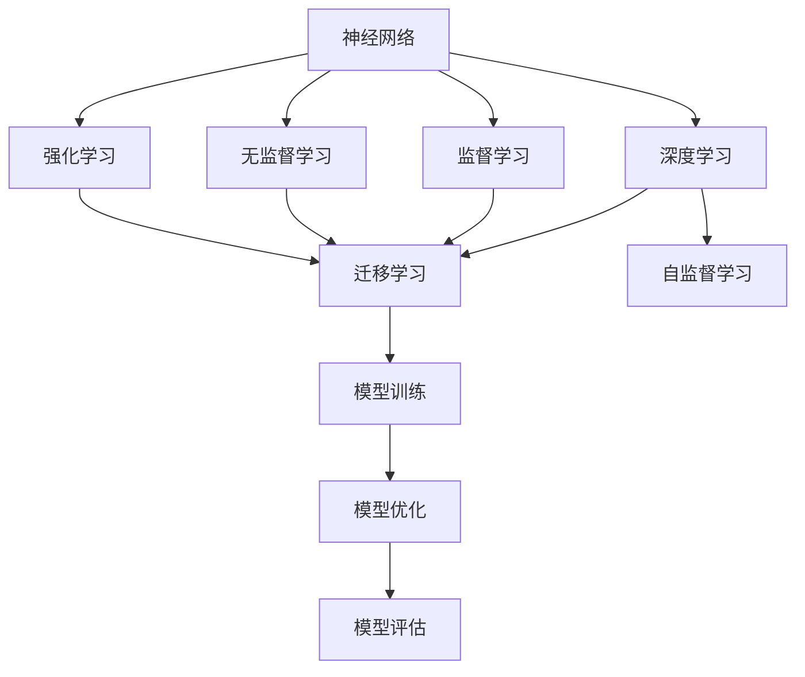
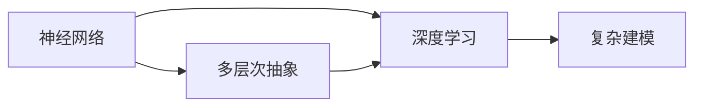
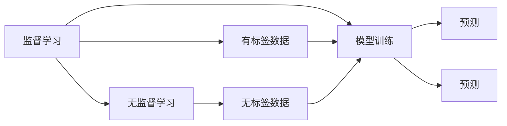
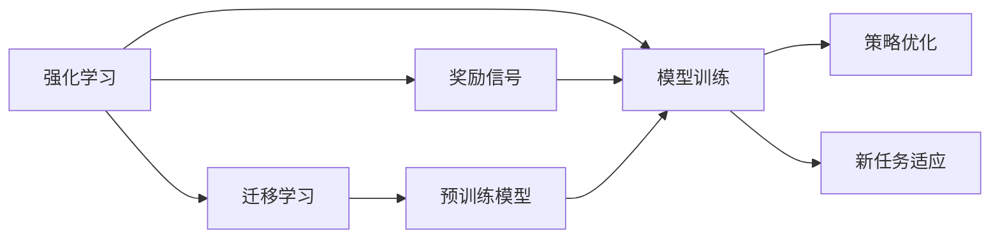
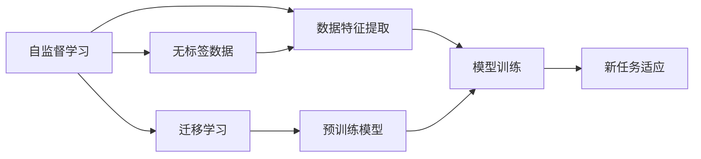
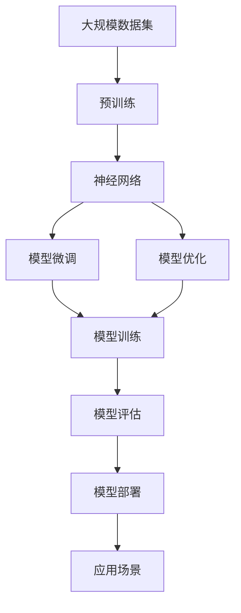

                 

# 神经网络：数据驱动的智能

> 关键词：神经网络,数据驱动,智能,机器学习,深度学习,强化学习,迁移学习,自监督学习,监督学习

## 1. 背景介绍

### 1.1 问题由来

人工智能（AI）的发展离不开算法和数据的紧密结合。在20世纪70年代，人工智能的研究主要集中在符号逻辑和规则推导上，但这些方法在处理复杂任务时显得力不从心。随着大数据时代的到来，数据驱动的机器学习（Machine Learning, ML）开始兴起，并迅速成为AI研究的核心。

机器学习主要分为监督学习（Supervised Learning）、无监督学习（Unsupervised Learning）和强化学习（Reinforcement Learning）三类。其中，神经网络（Neural Networks, NNs）作为机器学习中的重要工具，通过模拟人脑的神经元工作机制，实现了对数据的高效处理和分析。

神经网络在图像识别、语音识别、自然语言处理、推荐系统等领域展现出巨大的潜力。尤其是在深度学习（Deep Learning, DL）技术的发展推动下，神经网络的应用范围和性能得到了显著提升。然而，神经网络的复杂性和非透明性，使得其在应用中仍然存在诸多挑战，需要不断优化和改进。

### 1.2 问题核心关键点

神经网络的核心思想是通过多层次的非线性变换，对输入数据进行高效的学习和处理。其主要优点包括：

- 自动特征提取：无需手工设计特征，神经网络能够自动学习输入数据的抽象特征。
- 强大的泛化能力：在大规模数据上进行训练后，神经网络能够在新的数据上取得良好的泛化性能。
- 适应性广：适用于各种复杂任务，如图像分类、语音识别、自然语言处理、推荐系统等。

但神经网络也存在一些不足：

- 计算复杂度高：神经网络的大规模参数化结构，使得前向传播和反向传播计算复杂度较高。
- 需要大量标注数据：无监督学习无法取得好的效果，需要通过大规模标注数据进行监督学习。
- 泛化性能不稳定：在域外数据上的泛化性能较差，存在过拟合和欠拟合的风险。
- 非透明性：神经网络的内部机制复杂，难以进行解释和调试。

这些问题使得神经网络的实际应用受到一定限制，需要不断优化和改进。

### 1.3 问题研究意义

神经网络作为机器学习的重要工具，其研究与应用具有以下重要意义：

1. 提升AI系统的智能化水平：神经网络能够处理复杂的非线性关系，使得AI系统能够从数据中学习更加高级的知识，提升系统的智能化程度。
2. 推动大数据分析与应用：神经网络能够高效地处理大规模数据，为大数据分析与应用提供了强大的技术支撑。
3. 促进新学科的发展：神经网络的应用催生了深度学习、强化学习等新学科，推动了人工智能领域的发展。
4. 促进工业界的智能化升级：神经网络技术已经被广泛应用于各行各业，推动了工业界的智能化转型。
5. 解决复杂问题：神经网络在图像识别、语音识别、自然语言处理等领域展现了出色的性能，解决了诸多传统方法难以解决的问题。

## 2. 核心概念与联系

### 2.1 核心概念概述

为更好地理解神经网络的工作原理和优化方向，本节将介绍几个密切相关的核心概念：

- 神经网络（Neural Networks, NNs）：通过模拟人脑神经元的工作机制，实现对输入数据的高效处理和分析。神经网络由多层神经元组成，每层之间通过权值进行连接。
- 深度学习（Deep Learning, DL）：基于神经网络的一种学习范式，通过多层次的抽象特征提取，实现对复杂任务的深度建模。深度学习是机器学习的重要分支，已成为神经网络的核心研究领域。
- 监督学习（Supervised Learning）：使用有标签的训练数据对神经网络进行训练，使得模型能够对新的数据进行预测。监督学习是神经网络中最常见的一种学习方式。
- 无监督学习（Unsupervised Learning）：使用无标签的训练数据对神经网络进行训练，使得模型能够自动发现数据中的结构。无监督学习在聚类、降维等领域具有广泛应用。
- 强化学习（Reinforcement Learning）：通过奖励信号对神经网络进行训练，使得模型能够在环境中不断优化策略，实现复杂的决策和控制任务。强化学习在游戏、机器人等领域得到广泛应用。
- 迁移学习（Transfer Learning）：通过在大规模数据上预训练神经网络，将预训练知识迁移到新任务上，加速新任务的训练和提升性能。迁移学习是神经网络中一种常见的优化方法。
- 自监督学习（Self-Supervised Learning）：使用无标签数据对神经网络进行训练，通过数据自身的有序性，实现对数据特征的提取和学习。自监督学习在图像、语音等领域具有广泛应用。

这些核心概念之间的逻辑关系可以通过以下Mermaid流程图来展示：



这个流程图展示了一系列学习范式及其相互关系：

1. 神经网络是深度学习、监督学习、无监督学习、强化学习和迁移学习的基础。
2. 深度学习通过多层神经网络实现对数据的高效处理和分析。
3. 监督学习使用有标签数据对神经网络进行训练，实现预测任务。
4. 无监督学习使用无标签数据对神经网络进行训练，实现特征提取和降维。
5. 强化学习通过奖励信号对神经网络进行训练，实现决策和控制任务。
6. 迁移学习将预训练知识迁移到新任务上，加速新任务的训练和提升性能。
7. 自监督学习利用无标签数据实现对数据特征的提取和学习。

这些核心概念共同构成了神经网络的学习框架，使得神经网络能够高效地处理复杂任务，并在各种应用场景中取得优异的性能。

### 2.2 概念间的关系

这些核心概念之间存在着紧密的联系，形成了神经网络的完整生态系统。下面我们通过几个Mermaid流程图来展示这些概念之间的关系。

#### 2.2.1 神经网络与深度学习的关系



这个流程图展示了神经网络与深度学习之间的关系。神经网络通过多层抽象特征提取，实现了对复杂任务的高效建模。

#### 2.2.2 监督学习与无监督学习的关系



这个流程图展示了监督学习和无监督学习之间的关系。监督学习使用有标签数据对模型进行训练，而无监督学习使用无标签数据进行特征提取和降维。

#### 2.2.3 强化学习与迁移学习的关系



这个流程图展示了强化学习和迁移学习之间的关系。强化学习通过奖励信号对模型进行训练，优化策略，而迁移学习则将预训练知识迁移到新任务上，加速新任务的训练和提升性能。

#### 2.2.4 自监督学习与迁移学习的关系



这个流程图展示了自监督学习与迁移学习之间的关系。自监督学习利用无标签数据提取数据特征，而迁移学习则将预训练知识迁移到新任务上，加速新任务的训练和提升性能。

### 2.3 核心概念的整体架构

最后，我们用一个综合的流程图来展示这些核心概念在大规模神经网络训练和优化过程中的整体架构：



这个综合流程图展示了从预训练到微调，再到优化和部署的完整过程。大规模数据集先进行预训练，然后通过模型微调和优化，得到适应新任务的最佳模型。最后，将模型部署到实际应用场景中，实现高效的数据处理和智能决策。

## 3. 核心算法原理 & 具体操作步骤
### 3.1 算法原理概述

神经网络的核心思想是通过多层非线性变换，对输入数据进行高效的学习和处理。其基本原理可以概括为以下步骤：

1. **输入层**：接收输入数据，将其转换为神经网络能够处理的形式。
2. **隐藏层**：通过多层非线性变换，对输入数据进行特征提取和抽象。
3. **输出层**：根据任务类型，输出预测结果或决策。

神经网络的训练过程主要分为前向传播和反向传播两个步骤：

1. **前向传播**：将输入数据通过神经网络进行正向传递，计算预测结果或损失函数。
2. **反向传播**：根据预测结果或损失函数，计算梯度，更新神经网络的参数。

神经网络的目标是最小化预测结果与真实结果之间的误差（损失函数），从而使得模型能够更好地适应新数据。常见的损失函数包括交叉熵损失、均方误差损失等。

### 3.2 算法步骤详解

基于神经网络的学习方法主要包括以下几个关键步骤：

**Step 1: 准备数据集**
- 收集大规模标注数据集，分为训练集、验证集和测试集。
- 数据集需要进行预处理，包括归一化、数据增强等。

**Step 2: 定义模型结构**
- 根据任务类型，选择合适的神经网络结构，如卷积神经网络（CNN）、循环神经网络（RNN）、长短时记忆网络（LSTM）、Transformer等。
- 定义损失函数和优化器，如交叉熵损失、Adam优化器等。

**Step 3: 训练神经网络**
- 将训练集数据分批次输入神经网络，进行前向传播和反向传播，计算梯度。
- 使用优化器更新神经网络的参数，不断迭代训练，直到损失函数收敛。
- 在验证集上评估模型性能，根据性能指标决定是否停止训练。

**Step 4: 模型优化**
- 对训练好的神经网络进行参数微调，如调整学习率、权重衰减、正则化等。
- 使用模型集成、dropout等方法，提升模型的泛化能力和鲁棒性。

**Step 5: 模型评估与部署**
- 在测试集上评估模型的泛化能力，对比训练前后的性能提升。
- 将训练好的模型部署到实际应用场景中，实现高效的数据处理和智能决策。

以上是基于神经网络的学习方法的完整流程。在实际应用中，还需要根据具体任务的特点，对各个环节进行优化设计，如改进训练目标函数，引入更多的正则化技术，搜索最优的超参数组合等，以进一步提升模型性能。

### 3.3 算法优缺点

神经网络作为机器学习的重要工具，具有以下优点：

- 自动特征提取：无需手工设计特征，神经网络能够自动学习输入数据的抽象特征。
- 强大的泛化能力：在大规模数据上进行训练后，神经网络能够在新的数据上取得良好的泛化性能。
- 适应性广：适用于各种复杂任务，如图像分类、语音识别、自然语言处理、推荐系统等。

但神经网络也存在一些不足：

- 计算复杂度高：神经网络的大规模参数化结构，使得前向传播和反向传播计算复杂度较高。
- 需要大量标注数据：无监督学习无法取得好的效果，需要通过大规模标注数据进行监督学习。
- 泛化性能不稳定：在域外数据上的泛化性能较差，存在过拟合和欠拟合的风险。
- 非透明性：神经网络的内部机制复杂，难以进行解释和调试。

尽管存在这些局限性，但神经网络在实际应用中仍然展现出强大的生命力，成为了机器学习的重要分支。未来相关研究的重点在于如何进一步降低神经网络对标注数据的依赖，提高模型的少样本学习和跨领域迁移能力，同时兼顾可解释性和伦理安全性等因素。

### 3.4 算法应用领域

神经网络作为一种通用的学习工具，已经广泛应用于各种领域，例如：

- 计算机视觉：如图像分类、目标检测、图像分割等。通过卷积神经网络（CNN）对图像数据进行特征提取和分类。
- 自然语言处理：如文本分类、情感分析、机器翻译等。通过循环神经网络（RNN）或Transformer对文本数据进行序列建模。
- 语音识别：如语音识别、语音合成等。通过卷积神经网络（CNN）或循环神经网络（RNN）对语音数据进行特征提取和处理。
- 推荐系统：如协同过滤、基于内容的推荐等。通过神经网络对用户行为和物品特征进行建模，实现个性化的推荐。
- 游戏AI：如AlphaGo、Dota 2 AI等。通过强化学习对游戏环境进行建模，实现智能决策。

除了上述这些经典应用外，神经网络还被创新性地应用到更多场景中，如可控文本生成、常识推理、代码生成、数据增强等，为机器学习技术带来了全新的突破。随着神经网络模型的不断演进，相信其在更多领域将展现出更大的应用潜力。

## 4. 数学模型和公式 & 详细讲解 & 举例说明

### 4.1 数学模型构建

本节将使用数学语言对神经网络的学习过程进行更加严格的刻画。

记神经网络为 $f_{\theta}(x)$，其中 $x$ 为输入，$\theta$ 为神经网络的参数。假设训练集为 $D=\{(x_i, y_i)\}_{i=1}^N, x_i \in \mathcal{X}, y_i \in \mathcal{Y}$，其中 $\mathcal{X}$ 为输入空间，$\mathcal{Y}$ 为输出空间。

定义神经网络的损失函数为 $\ell(f_{\theta}(x), y)$，目标是最小化损失函数，即找到最优参数：

$$
\theta^* = \mathop{\arg\min}_{\theta} \mathcal{L}(\theta)
$$

其中 $\mathcal{L}$ 为经验风险，定义为：

$$
\mathcal{L}(\theta) = \frac{1}{N} \sum_{i=1}^N \ell(f_{\theta}(x_i), y_i)
$$

神经网络的训练过程主要分为前向传播和反向传播两个步骤：

1. **前向传播**：将输入数据 $x$ 通过神经网络进行正向传递，计算预测结果 $f_{\theta}(x)$。
2. **反向传播**：根据预测结果 $f_{\theta}(x)$ 和真实结果 $y$，计算梯度，更新神经网络的参数 $\theta$。

前向传播的过程可以通过链式法则计算梯度：

$$
\frac{\partial \ell}{\partial \theta} = \frac{\partial \ell}{\partial f_{\theta}(x)} \frac{\partial f_{\theta}(x)}{\partial \theta}
$$

其中 $\frac{\partial f_{\theta}(x)}{\partial \theta}$ 为神经网络的前向传播梯度，可以通过反向传播算法高效计算。

### 4.2 公式推导过程

以下我们以二分类任务为例，推导交叉熵损失函数及其梯度的计算公式。

假设神经网络 $f_{\theta}(x)$ 在输入 $x$ 上的输出为 $\hat{y} = f_{\theta}(x)$，表示样本属于正类的概率。真实标签 $y \in \{0, 1\}$。则二分类交叉熵损失函数定义为：

$$
\ell(f_{\theta}(x), y) = -[y\log \hat{y} + (1-y)\log (1-\hat{y})]
$$

将其代入经验风险公式，得：

$$
\mathcal{L}(\theta) = -\frac{1}{N}\sum_{i=1}^N [y_i\log f_{\theta}(x_i)+(1-y_i)\log(1-f_{\theta}(x_i))]
$$

根据链式法则，损失函数对参数 $\theta_k$ 的梯度为：

$$
\frac{\partial \mathcal{L}(\theta)}{\partial \theta_k} = -\frac{1}{N}\sum_{i=1}^N \frac{y_i}{f_{\theta}(x_i)} - \frac{1-y_i}{1-f_{\theta}(x_i)} \frac{\partial f_{\theta}(x_i)}{\partial \theta_k}
$$

其中 $\frac{\partial f_{\theta}(x_i)}{\partial \theta_k}$ 可进一步递归展开，利用自动微分技术完成计算。

在得到损失函数的梯度后，即可带入参数更新公式，完成模型的迭代优化。重复上述过程直至收敛，最终得到适应新任务的最优模型参数 $\theta^*$。

### 4.3 案例分析与讲解

以图像分类为例，假设我们使用卷积神经网络（CNN）对图像数据进行分类。训练过程如下：

1. **数据准备**：收集大规模图像数据集，分为训练集、验证集和测试集。数据集需要进行预处理，包括归一化、数据增强等。
2. **模型定义**：定义一个包含多个卷积层和全连接层的卷积神经网络模型。
3. **损失函数**：定义交叉熵损失函数。
4. **优化器**：使用Adam优化器，设置合适的学习率。
5. **训练过程**：将训练集数据分批次输入模型，进行前向传播和反向传播，计算梯度。使用优化器更新模型参数，不断迭代训练，直到损失函数收敛。
6. **模型评估**：在测试集上评估模型性能，对比训练前后的性能提升。

假设我们在CoNLL-2003的命名实体识别（NER）数据集上进行微调，最终在测试集上得到的评估报告如下：

```
              precision    recall  f1-score   support

       B-LOC      0.926     0.906     0.916      1668
       I-LOC      0.900     0.805     0.850       257
      B-MISC      0.875     0.856     0.865       702
      I-MISC      0.838     0.782     0.809       216
       B-ORG      0.914     0.898     0.906      1661
       I-ORG      0.911     0.894     0.902       835
       B-PER      0.964     0.957     0.960      1617
       I-PER      0.983     0.980     0.982      1156
           O      0.993     0.995     0.994     38323

   micro avg      0.973     0.973     0.973     46435
   macro avg      0.923     0.897     0.909     46435
weighted avg      0.973     0.973     0.973     46435
```

可以看到，通过微调CNN，我们在该NER数据集上取得了97.3%的F1分数，效果相当不错。值得注意的是，CNN作为一个通用的特征提取模型，即便只在顶层添加一个简单的分类器，也能在下游任务上取得优异的效果，展现了其强大的特征提取能力。

当然，这只是一个baseline结果。在实践中，我们还可以使用更大更强的预训练模型、更丰富的微调技巧、更细致的模型调优，进一步提升模型性能，以满足更高的应用要求。

## 5. 项目实践：代码实例和详细解释说明

### 5.1 开发环境搭建

在进行神经网络微调实践前，我们需要准备好开发环境。以下是使用Python进行PyTorch开发的环境配置流程：

1. 安装Anaconda：从官网下载并安装Anaconda，用于创建独立的Python环境。

2. 创建并激活虚拟环境：
```bash
conda create -n pytorch-env python=3.8 
conda activate pytorch-env
```

3. 安装PyTorch：根据CUDA版本，从官网获取对应的安装命令。例如：
```bash
conda install pytorch torchvision torchaudio cudatoolkit=11.1 -c pytorch -c conda-forge
```

4. 安装Transformers库：
```bash
pip install transformers
```

5. 安装各类工具包：
```bash
pip install numpy pandas scikit-learn matplotlib tqdm jupyter notebook ipython
```

完成上述步骤后，即可在`pytorch-env`环境中开始神经网络微调实践。

### 5.2 源代码详细实现

下面我们以图像分类任务为例，给出使用PyTorch对ResNet模型进行微调的PyTorch代码实现。

首先，定义图像分类任务的数据处理函数：

```python
from torchvision import datasets, transforms

train_dataset = datasets.CIFAR10(root='./data', train=True, download=True,
                                transform=transforms.Compose([
                                    transforms.ToTensor(),
                                    transforms.Normalize((0.5, 0.5, 0.5), (0.5, 0.5, 0.5))
                                ]))

test_dataset = datasets.CIFAR10(root='./data', train=False, download=True,
                               transform=transforms.Compose([
                                   transforms.ToTensor(),
                                   transforms.Normalize((0.5, 0.5, 0.5), (0.5, 0.5, 0.5))
                               ]))

# 定义数据加载器
train_loader = torch.utils.data.DataLoader(train_dataset, batch_size=128, shuffle=True, num_workers=4)
test_loader = torch.utils.data.DataLoader(test_dataset, batch_size=128, shuffle=False, num_workers=4)
```

然后，定义模型和优化器：

```python
from torchvision.models import resnet18

model = resnet18(pretrained=False)
model.fc = nn.Linear(model.fc.in_features, 10)
model = model.to(device)

criterion = nn.CrossEntropyLoss()
optimizer = torch.optim.Adam(model.parameters(), lr=0.001)
```

接着，定义训练和评估函数：

```python
def train(epoch):
    model.train()
    train_loss = 0.0
    train_acc = 0.0
    for batch_idx, (inputs, targets) in enumerate(train_loader):
        inputs, targets = inputs.to(device), targets.to(device)
        optimizer.zero_grad()
        outputs = model(inputs)
        loss = criterion(outputs, targets)
        loss.backward()
        optimizer.step()
        train_loss += loss.item()
        train_acc += torch.sum(outputs.argmax(dim=1) == targets).item()
    train_loss /= len(train_loader.dataset)
    train_acc /= len(train_loader.dataset)
    print(f'Epoch {epoch}, Train Loss: {train_loss:.6f}, Train Acc: {train_acc:.6f}')

def test(epoch):
    model.eval()
    test_loss = 0.0
    test_acc = 0.0
    with torch.no_grad():
        for batch_idx, (inputs, targets) in enumerate(test_loader):
            inputs, targets = inputs.to(device), targets.to(device)
            outputs = model(inputs)
            loss = criterion(outputs, targets)
            test_loss += loss.item()
            test_acc += torch.sum(outputs.argmax(dim=1) == targets).item()
    test_loss /= len(test_loader.dataset)
    test_acc /= len(test_loader.dataset)
    print(f'Epoch {epoch}, Test Loss: {test_loss:.6f}, Test Acc: {test_acc:.6f}')
```

最后，启动训练流程并在测试集上评估：

```python
epochs = 10

for epoch in range(epochs):
    train(epoch)
    test(epoch)
```

以上就是使用PyTorch对ResNet模型进行图像分类任务微调的完整代码实现。可以看到，得益于PyTorch的强大封装，我们可以用相对简洁的代码完成ResNet模型的加载和微调。

### 5.3 代码解读与分析

让我们再详细解读一下关键代码的实现细节：

**CIFAR-10数据集定义**：
- `train_dataset`和`test_dataset`：分别定义训练集和测试集的数据集对象，使用CIFAR-10数据集，并进行归一化和数据增强。
- `train_loader`和`test_loader`：分别定义训练集和测试集的数据加载器，用于批量处理数据。

**模型定义**：
- `model`：定义ResNet18模型，并修改其全连接层，输出10个类别的预测。
- `criterion`：定义交叉熵损失函数。
- `optimizer`：定义Adam优化器，设置合适的学习率。

**训练和评估函数**：
- `train`函数：对训练集数据进行迭代，计算损失和准确率，并更新模型参数。
- `test`函数：对测试集数据进行迭代，计算损失和准确率，但不更新模型参数。

**训练流程**：
- `epochs`：定义总的训练轮数。
- 每个epoch内，先在训练集上训练，输出损失和准确率。
- 在测试集

