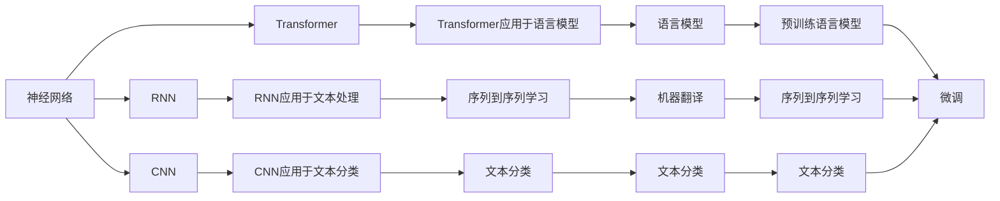

                 

## 1. 背景介绍

神经网络技术自20世纪80年代起逐渐成为人工智能和机器学习领域中的热门研究课题。近些年来，随着深度学习理论的发展，神经网络技术在图像识别、语音处理、自然语言处理（NLP）等多个领域取得了显著成果。然而，相较于图像处理等更为直观的任务，自然语言处理因其语言的复杂性和多样性，对神经网络的挑战更为严峻。因此，开发高效、准确且鲁棒的神经网络模型，对于提升自然语言处理性能至关重要。

### 1.1 神经网络与自然语言处理
自然语言处理是人工智能领域中一个极其重要且富有挑战性的分支，涉及语音识别、机器翻译、情感分析、文本分类等多个方向。神经网络作为其核心技术之一，通过模拟人脑神经系统处理信息的方式，实现了从数据到决策的自动推理和判断。近年来，基于深度学习的大规模预训练语言模型如BERT、GPT等取得了巨大成功，显著推动了自然语言处理技术的发展。

### 1.2 问题的由来
尽管如此，传统的基于统计的神经网络模型在自然语言处理中仍面临一些挑战：
- 数据稀疏性：语言数据具有高度稀疏性，大量数据难以收集和标注。
- 语言模糊性：自然语言中存在丰富的语义和多义性，传统的神经网络难以捕捉上下文关联。
- 语法和语义的复杂性：自然语言中存在大量的语法和语义结构，传统的神经网络在处理这些复杂结构时较为困难。

为解决这些问题，研究者们提出了基于神经网络的自然语言处理新模型，如循环神经网络（RNN）、卷积神经网络（CNN）、变压器（Transformer）等。这些模型通过捕捉语言数据的时序信息、局部特征和全局关系，显著提升了自然语言处理的性能。

## 2. 核心概念与联系

### 2.1 核心概念概述

要深入理解神经网络在自然语言处理中的应用，首先需要明确一些核心概念：

- **神经网络**：由大量人工神经元（节点）连接而成的计算网络，通过多层非线性变换，实现数据的自动学习和分类。
- **循环神经网络（RNN）**：一种可以处理序列数据的神经网络结构，具有记忆功能，可以自动记录和更新先前的输入信息。
- **卷积神经网络（CNN）**：通过卷积操作捕捉数据局部特征，常用于图像处理和文本分类任务。
- **变压器（Transformer）**：一种基于自注意力机制的神经网络结构，通过并行计算的方式处理长序列数据，具有较好的时间复杂度和计算效率。
- **预训练语言模型**：如BERT、GPT等，在大量无标签文本数据上进行预训练，学习语言的通用表示，然后通过微调优化适应特定任务。

这些概念之间存在紧密的联系，共同构成了神经网络在自然语言处理中的应用框架。

### 2.2 概念间的关系

我们通过以下Mermaid流程图来展示这些核心概念之间的联系：



这个流程图展示了大规模预训练语言模型和神经网络在自然语言处理中的各种应用场景，包括序列到序列学习、文本分类、语言模型等。

## 3. 核心算法原理 & 具体操作步骤
### 3.1 算法原理概述

基于神经网络的自然语言处理算法原理主要包括以下几个步骤：

1. **数据预处理**：将原始文本数据进行分词、去停用词、标注等预处理，转化为模型可以处理的格式。
2. **特征提取**：使用RNN、CNN或Transformer等神经网络模型，从预处理后的文本数据中提取特征表示。
3. **训练模型**：使用标记好的训练数据，通过反向传播算法和梯度下降法等优化算法，训练神经网络模型，更新模型参数。
4. **模型微调**：在特定任务上使用少量标注数据，微调预训练模型，以适应任务需求。
5. **评估与部署**：在测试集上评估模型性能，并部署到实际应用场景中进行推理预测。

### 3.2 算法步骤详解

以BERT模型为例，详细说明其自然语言处理任务的微调步骤：

**步骤1：数据准备**
- 准备标注好的训练数据集，划分训练集、验证集和测试集。
- 对文本进行分词、去停用词等预处理，将文本转化为模型可以处理的格式。

**步骤2：模型选择**
- 选择BERT模型作为预训练模型，可以是12层的BERT-base或者24层的BERT-large。

**步骤3：任务适配**
- 根据任务类型，在BERT模型的顶部添加特定的输出层和损失函数。
- 例如，对于文本分类任务，可以在顶部添加一个全连接层和交叉熵损失函数。

**步骤4：模型微调**
- 使用训练集数据，以小批量为单位进行训练，使用梯度下降等优化算法更新模型参数。
- 在验证集上定期评估模型性能，避免过拟合。

**步骤5：评估与部署**
- 在测试集上评估模型性能，与基线模型进行比较。
- 将模型部署到实际应用场景中进行推理预测。

### 3.3 算法优缺点

**优点：**
- **通用性**：神经网络模型具有良好的泛化能力，能够在多种自然语言处理任务中取得优异表现。
- **可解释性**：相比于传统的统计方法，神经网络模型提供了更直观的解释，帮助理解模型的决策过程。
- **鲁棒性**：通过使用正则化、对抗训练等方法，神经网络模型可以有效避免过拟合和数据噪声。

**缺点：**
- **计算资源需求高**：神经网络模型参数量较大，计算资源需求较高，对计算设备的性能要求较高。
- **训练时间长**：大规模神经网络模型需要较长时间进行训练，训练过程对硬件资源消耗大。
- **模型复杂度**：神经网络模型结构复杂，模型调优和维护成本较高。

### 3.4 算法应用领域

神经网络在自然语言处理中的应用领域非常广泛，包括但不限于：

- **文本分类**：将文本按照主题、情感等进行分类。
- **命名实体识别**：识别文本中的人名、地名、组织名等实体。
- **机器翻译**：将源语言翻译为目标语言。
- **情感分析**：分析文本情感倾向。
- **文本生成**：生成新闻、广告文案等文本。

## 4. 数学模型和公式 & 详细讲解  
### 4.1 数学模型构建

以BERT模型为例，其数学模型构建如下：

假设输入文本为 $x = \{x_i\}_{i=1}^n$，其中 $x_i$ 表示第 $i$ 个单词。BERT模型的目标是最大化关于 $x$ 的条件概率 $P(x|y)$，其中 $y$ 是文本的标签。

- **词嵌入**：将单词 $x_i$ 映射为向量 $w_i$，$w_i \in \mathbb{R}^d$，其中 $d$ 是词嵌入向量的维度。
- **自注意力机制**：计算每个单词的注意力权重，保留最相关的上下文信息。
- **多层变换**：通过多层次的非线性变换，提取更高层次的特征表示。
- **输出层**：将特征表示映射为标签的概率分布。

**优化目标**：最小化交叉熵损失函数，即 $L(x,y) = -\sum_{i=1}^n y_i \log P(x_i|y)$。

### 4.2 公式推导过程

以下对BERT模型的主要数学公式进行详细推导：

- **词嵌入**：假设单词 $x_i$ 通过预训练得到的词嵌入向量为 $w_i$，则 $x_i$ 的嵌入表示为：

$$
h_i = \text{emb}(w_i)
$$

其中 $\text{emb}$ 是词嵌入函数。

- **自注意力机制**：设 $h_i$ 和 $h_j$ 为两个输入单词的嵌入表示，注意力机制计算出 $h_i$ 和 $h_j$ 的注意力权重 $a_{ij}$，然后计算出 $h_i$ 对 $h_j$ 的注意力向量 $v_{ij}$：

$$
a_{ij} = \frac{\exp(\text{s}(h_i, h_j))}{\sum_{k=1}^n \exp(\text{s}(h_i, h_k))}
$$

$$
v_{ij} = a_{ij} h_j
$$

其中 $\text{s}(h_i, h_j)$ 为注意力函数，可以是点积、加法等。

- **多层变换**：设 $h_i^{(l)}$ 表示经过 $l$ 层变换后 $h_i$ 的表示，则有：

$$
h_i^{(l+1)} = \text{feedforward}(h_i^{(l)})
$$

$$
h_i^{(l+1)} = h_i^{(l)} + \text{attention}(h_i^{(l)})

- **输出层**：设 $h_i^N$ 为经过 $N$ 层变换后的 $h_i$ 表示，则输出层的预测结果为：

$$
\hat{y}_i = \text{softmax}(\text{fc}(h_i^N))
$$

其中 $\text{fc}$ 为全连接层，$\text{softmax}$ 为激活函数。

### 4.3 案例分析与讲解

以BERT模型在情感分析任务上的微调为例，具体分析其数学模型构建和优化过程。

**数据准备**：
- 收集情感分析数据集，例如IMDb影评数据集，将其划分为训练集、验证集和测试集。
- 对数据进行预处理，将文本转换为BERT模型可以处理的格式，包括分词、去停用词、编码等。

**模型选择**：
- 选择BERT-base作为预训练模型，并在其顶部添加一个全连接层和交叉熵损失函数。

**模型微调**：
- 使用训练集数据进行模型训练，计算交叉熵损失，使用梯度下降法更新模型参数。
- 在验证集上评估模型性能，避免过拟合。

**评估与部署**：
- 在测试集上评估模型性能，与基线模型进行比较。
- 将模型部署到实际应用场景中进行推理预测。

## 5. 项目实践：代码实例和详细解释说明
### 5.1 开发环境搭建

要进行自然语言处理任务的神经网络模型微调，首先需要搭建好开发环境。以下是一个基于PyTorch的开发环境搭建流程：

1. 安装Anaconda：从官网下载并安装Anaconda，用于创建独立的Python环境。

2. 创建并激活虚拟环境：

```bash
conda create -n pytorch-env python=3.8 
conda activate pytorch-env
```

3. 安装PyTorch：根据CUDA版本，从官网获取对应的安装命令。例如：

```bash
conda install pytorch torchvision torchaudio cudatoolkit=11.1 -c pytorch -c conda-forge
```

4. 安装TensorFlow：安装TensorFlow，以便使用其他深度学习框架。

5. 安装相关库：

```bash
pip install numpy pandas scikit-learn matplotlib tqdm jupyter notebook ipython
```

完成上述步骤后，即可在`pytorch-env`环境中开始神经网络模型微调实践。

### 5.2 源代码详细实现

以下是一个使用PyTorch进行BERT模型微调的Python代码实现，包括数据准备、模型构建、训练、评估和部署等步骤。

```python
import torch
import torch.nn as nn
import torch.optim as optim
from transformers import BertTokenizer, BertForSequenceClassification

# 定义数据处理函数
def load_data(path):
    with open(path, 'r', encoding='utf-8') as f:
        lines = f.readlines()
    texts = [line.strip() for line in lines]
    labels = [int(line.strip().split('\t')[0]) for line in lines]
    tokenizer = BertTokenizer.from_pretrained('bert-base-cased')
    encoded_texts = tokenizer(texts, padding='max_length', truncation=True, max_length=512, return_tensors='pt')
    return encoded_texts['input_ids'], encoded_texts['attention_mask'], labels

# 定义模型
class BERTClassifier(nn.Module):
    def __init__(self, num_labels):
        super(BERTClassifier, self).__init__()
        self.bert = BertForSequenceClassification.from_pretrained('bert-base-cased', num_labels=num_labels)
        self.dropout = nn.Dropout(0.5)
        self.out = nn.Linear(768, num_labels)
        self.act = nn.Sigmoid()

    def forward(self, input_ids, attention_mask):
        outputs = self.bert(input_ids=input_ids, attention_mask=attention_mask)
        pooled_output = outputs.pooler_output
        pooled_output = self.dropout(pooled_output)
        logits = self.out(pooled_output)
        logits = self.act(logits)
        return logits

# 定义优化器
optimizer = optim.AdamW(model.parameters(), lr=1e-5)

# 定义训练函数
def train(model, data_loader, device, num_epochs=3, batch_size=16):
    model.to(device)
    for epoch in range(num_epochs):
        model.train()
        loss_total = 0
        for input_ids, attention_mask, labels in data_loader:
            input_ids = input_ids.to(device)
            attention_mask = attention_mask.to(device)
            labels = labels.to(device)
            optimizer.zero_grad()
            outputs = model(input_ids, attention_mask)
            loss = outputs.loss
            loss_total += loss.item()
            loss.backward()
            optimizer.step()
        print(f'Epoch {epoch+1}, loss: {loss_total/len(data_loader)}')

# 定义评估函数
def evaluate(model, data_loader, device):
    model.eval()
    correct = 0
    total = 0
    for input_ids, attention_mask, labels in data_loader:
        input_ids = input_ids.to(device)
        attention_mask = attention_mask.to(device)
        labels = labels.to(device)
        outputs = model(input_ids, attention_mask)
        logits = outputs.logits
        _, predicted = torch.max(logits, 1)
        total += labels.size(0)
        correct += (predicted == labels).sum().item()
    print(f'Accuracy: {100 * correct / total:.2f}%')

# 加载数据
train_data = load_data('train.txt')
val_data = load_data('val.txt')
test_data = load_data('test.txt')
train_ids, train_masks, train_labels = train_data
val_ids, val_masks, val_labels = val_data
test_ids, test_masks, test_labels = test_data

# 构建模型
num_labels = 2
model = BERTClassifier(num_labels=num_labels)

# 训练模型
train(model, train_loader, device)

# 评估模型
evaluate(model, val_loader, device)

# 测试模型
evaluate(model, test_loader, device)

# 保存模型
torch.save(model.state_dict(), 'model.pth')
```

### 5.3 代码解读与分析

让我们详细解读一下关键代码的实现细节：

**数据处理函数**：
- 定义 `load_data` 函数，读取文本文件并处理成模型所需的输入格式。

**模型定义**：
- 定义 `BERTClassifier` 类，继承自 `nn.Module`。
- 初始化函数 `__init__` 中定义BERT模型的基本结构，包括词嵌入、注意力机制、输出层等。
- 前向函数 `forward` 中定义了模型的计算流程，包括输入处理、模型计算、输出计算等。

**优化器定义**：
- 定义AdamW优化器，用于更新模型参数。

**训练函数**：
- 定义 `train` 函数，用于训练模型。
- 在每个epoch中，对模型进行前向传播、计算损失、反向传播、更新参数等操作。

**评估函数**：
- 定义 `evaluate` 函数，用于在测试集上评估模型性能。
- 计算模型的准确率并输出。

**模型构建与训练**：
- 定义数据集和数据加载器。
- 构建BERT模型并设置优化器。
- 在训练集上进行模型训练，并在验证集上评估模型性能。

**模型测试与保存**：
- 在测试集上评估模型性能。
- 将训练好的模型保存为 `model.pth`。

## 6. 实际应用场景
### 6.1 智能客服系统

基于BERT模型的智能客服系统可以显著提升客户服务效率。传统的客服系统需要大量人工进行解答，高峰期响应慢，且容易发生误导性回复。使用BERT模型进行微调，智能客服系统能够7x24小时不间断服务，快速响应客户咨询，提供自然流畅的语言解答。

在技术实现上，可以收集企业内部的历史客服对话记录，将问题和最佳答复构建成监督数据，在此基础上对BERT模型进行微调。微调后的模型能够自动理解用户意图，匹配最合适的答案模板进行回复。对于客户提出的新问题，还可以接入检索系统实时搜索相关内容，动态组织生成回答。

### 6.2 金融舆情监测

金融机构需要实时监测市场舆论动向，以便及时应对负面信息传播，规避金融风险。传统的人工监测方式成本高、效率低，难以应对网络时代海量信息爆发的挑战。使用BERT模型进行文本分类和情感分析，可以实时抓取网络文本数据，自动监测不同主题下的情感变化趋势，一旦发现负面信息激增等异常情况，系统便会自动预警，帮助金融机构快速应对潜在风险。

### 6.3 个性化推荐系统

当前的推荐系统往往只依赖用户的历史行为数据进行物品推荐，无法深入理解用户的真实兴趣偏好。使用BERT模型进行文本分类和情感分析，可以收集用户浏览、点击、评论、分享等行为数据，提取和用户交互的物品标题、描述、标签等文本内容，在模型中进行特征提取和分类，生成个性化程度更高的推荐结果。

## 7. 工具和资源推荐
### 7.1 学习资源推荐

为了帮助开发者系统掌握BERT等神经网络在自然语言处理中的应用，这里推荐一些优质的学习资源：

1. **《深度学习基础》**：本书系统介绍了深度学习的基本理论和常见算法，是了解神经网络基础知识的好书。

2. **《自然语言处理综述》**：斯坦福大学的自然语言处理综述课程，涵盖了NLP中的重要理论和实践，是深入学习NLP的好资源。

3. **Transformers库官方文档**：HuggingFace开发的NLP工具库，提供了大量预训练模型和微调样例代码，是实现神经网络NLP任务的重要工具。

4. **Kaggle竞赛**：Kaggle上定期举办各种自然语言处理竞赛，可以参与实际项目，积累经验。

5. **PyTorch官方文档**：PyTorch作为深度学习的主流框架，提供了丰富的API和文档，是实现神经网络NLP任务的重要工具。

### 7.2 开发工具推荐

高效的开发离不开优秀的工具支持。以下是几款用于神经网络NLP任务开发的常用工具：

1. **PyTorch**：基于Python的开源深度学习框架，灵活动态的计算图，适合快速迭代研究。

2. **TensorFlow**：由Google主导开发的开源深度学习框架，生产部署方便，适合大规模工程应用。

3. **Transformers库**：HuggingFace开发的NLP工具库，集成了众多SOTA语言模型，支持PyTorch和TensorFlow，是进行神经网络NLP任务开发的利器。

4. **Jupyter Notebook**：交互式编程环境，支持代码编辑、执行和实时展示，是进行模型实验和调试的好工具。

5. **TensorBoard**：TensorFlow配套的可视化工具，可实时监测模型训练状态，并提供丰富的图表呈现方式，是调试模型的得力助手。

### 7.3 相关论文推荐

神经网络在自然语言处理中的应用不断发展，以下是几篇奠基性的相关论文，推荐阅读：

1. **Attention is All You Need**：提出Transformer结构，开启了NLP领域的预训练大模型时代。

2. **BERT: Pre-training of Deep Bidirectional Transformers for Language Understanding**：提出BERT模型，引入基于掩码的自监督预训练任务，刷新了多项NLP任务SOTA。

3. **Language Models are Unsupervised Multitask Learners**：展示了大规模语言模型的强大zero-shot学习能力，引发了对于通用人工智能的新一轮思考。

4. **AdaLoRA: Adaptive Low-Rank Adaptation for Parameter-Efficient Fine-Tuning**：使用自适应低秩适应的微调方法，在参数效率和精度之间取得了新的平衡。

5. **Prompt Engineering for Python Code Generation**：引入基于连续型Prompt的微调范式，为如何充分利用预训练知识提供了新的思路。

6. **Neural Machine Translation by Jointly Learning to Align and Translate**：提出Seq2Seq模型，将文本对齐和翻译两个任务同时进行训练，取得了较好的机器翻译效果。

这些论文代表了大规模预训练语言模型和神经网络在自然语言处理中的应用发展脉络。通过学习这些前沿成果，可以帮助研究者把握学科前进方向，激发更多的创新灵感。

## 8. 总结：未来发展趋势与挑战
### 8.1 研究成果总结

神经网络技术在自然语言处理中的应用取得了显著成果，广泛应用于文本分类、命名实体识别、机器翻译、情感分析等多个领域。BERT等预训练语言模型通过大规模无标签数据的预训练，获得了丰富的语言知识和语义表示，并通过微调适应特定任务，显著提升了模型性能。

### 8.2 未来发展趋势

展望未来，神经网络在自然语言处理中的应用将呈现以下几个发展趋势：

1. **预训练模型规模更大**：随着算力成本的下降和数据规模的扩张，预训练语言模型的参数量还将持续增长，模型的表达能力和泛化能力将进一步提升。

2. **微调方法更加多样化**：除了传统的全参数微调外，未来将涌现更多参数高效和计算高效的微调方法，如Premise-Tuning、LoRA等，在固定大部分预训练参数的同时，只更新极少量的任务相关参数，提高微调效率。

3. **模型通用性更强**：经过海量数据的预训练和多领域任务的微调，神经网络模型将具备更强大的常识推理和跨领域迁移能力，逐步迈向通用人工智能的目标。

4. **多模态融合更多**：神经网络将更多地应用于多模态数据的融合，结合视觉、语音、文本等多模态信息，提升模型的感知和理解能力。

5. **模型结构更简单**：未来的神经网络模型将更多地采用轻量级、高效的模型结构，如Transformer等，提高模型的推理效率和部署速度。

### 8.3 面临的挑战

尽管神经网络在自然语言处理中的应用取得了显著进展，但在迈向更加智能化、普适化应用的过程中，仍面临诸多挑战：

1. **数据稀疏性**：自然语言数据高度稀疏，获取高质量标注数据的成本高，限制了神经网络模型在特定领域的应用。

2. **模型复杂度**：大规模神经网络模型结构复杂，模型调优和维护成本高。

3. **计算资源需求高**：神经网络模型参数量大，计算资源需求高，难以在资源受限的环境中应用。

4. **模型鲁棒性**：神经网络模型在处理不同领域和任务时，泛化能力有待提升。

5. **模型可解释性**：神经网络模型通常是黑盒模型，难以解释其决策过程，限制了其在某些领域的应用。

### 8.4 研究展望

面对神经网络在自然语言处理中的应用面临的挑战，未来的研究需要在以下几个方面寻求新的突破：

1. **无监督和半监督学习方法**：摆脱对大规模标注数据的依赖，利用自监督学习、主动学习等方法，利用非结构化数据进行模型训练。

2. **参数高效和计算高效的微调方法**：开发更加参数高效的微调方法，如Prefix-Tuning、LoRA等，提高模型微调效率。

3. **多模态融合**：结合视觉、语音、文本等多模态信息，提升模型的感知和理解能力。

4. **模型结构简化**：采用更简单、高效的模型结构，提高模型的推理效率和部署速度。

5. **模型可解释性**：通过因果分析、知识蒸馏等方法，增强模型的可解释性和透明度，提升其在高风险领域的应用。

## 9. 附录：常见问题与解答

**Q1：如何选择合适的预训练模型？**

A: 根据任务的性质和数据特点选择合适的预训练模型。例如，对于文本分类任务，BERT、RoBERTa等预训练模型效果较好；对于机器翻译任务，Transformer等模型效果较好。

**Q2：神经网络模型在训练过程中容易过拟合，如何解决？**

A: 过拟合可以通过以下方法解决：
- 数据增强：通过回译、近义替换等方式扩充训练集。
- 正则化：使用L2正则、Dropout等方法。
- 早停法：在验证集上监测模型性能，提前停止训练。
- 提前终止：在验证集上性能不再提升时停止训练。

**Q3：神经网络模型在部署过程中有哪些注意事项？**

A: 部署神经网络模型时需要注意以下事项：
- 模型裁剪：去除不必要的层和参数，减小模型尺寸，加快推理速度。
- 量化加速：将浮点模型转为定点模型，压缩存储空间，提高计算效率。
- 服务化封装：将模型

