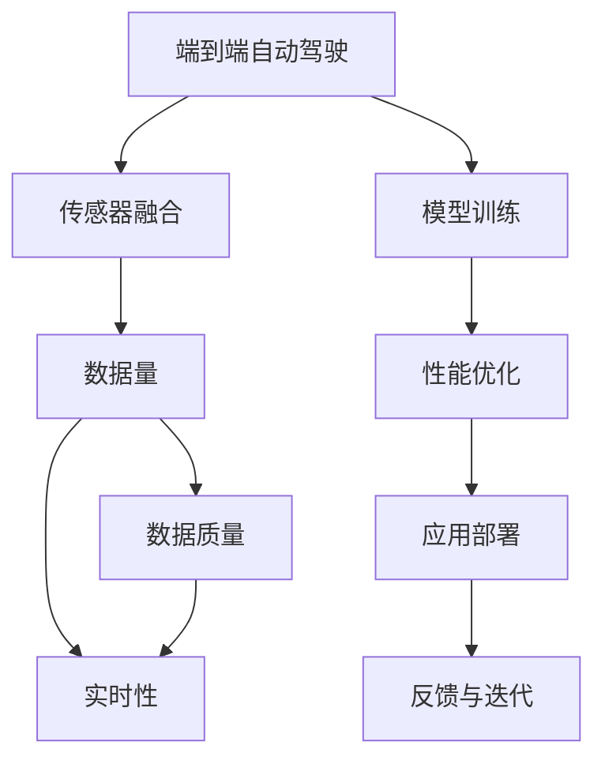

                 

# 端到端自动驾驶对数据量和质的要求

## 1. 背景介绍

随着自动驾驶技术的快速发展，端到端自动驾驶（End-to-End Autonomous Driving）逐渐成为行业主流。相较于传统的基于规则的驾驶辅助系统，端到端自动驾驶采用深度神经网络模型，实现从原始传感器数据（如雷达、激光雷达、摄像头）到最终决策的端到端处理。这种体系架构简化了控制逻辑，提高了系统的实时性和可靠性。然而，端到端自动驾驶对数据量和数据质量提出了极高的要求，直接关系到系统的安全性和鲁棒性。本文将深入探讨端到端自动驾驶对数据量和质的要求，并提供具体的技术解决方案。

## 2. 核心概念与联系

### 2.1 核心概念概述

#### 2.1.1 端到端自动驾驶

端到端自动驾驶通过深度学习模型直接从传感器数据（如雷达、激光雷达、摄像头）生成车辆的控制指令，无需中间的手动驾驶干预。该技术架构简洁高效，适合大规模部署和应用。

#### 2.1.2 传感器融合

传感器融合是指将来自不同传感器的数据进行融合处理，提升系统对环境的感知能力。雷达、激光雷达和摄像头各有优缺点，通过合理融合可以提高数据的准确性和鲁棒性。

#### 2.1.3 实时性和鲁棒性

实时性是指系统在处理数据时能够满足实时要求，而鲁棒性则是指系统对环境变化的适应能力，能在极端情况下稳定运行。

#### 2.1.4 数据量和数据质量

数据量是指用于训练模型的样本数量，而数据质量则包括数据的准确性、多样性、标注质量等。足够的数据量和高质量的数据是训练高性能自动驾驶模型的基础。

### 2.2 核心概念间的关系

下面通过一个Mermaid流程图来展示端到端自动驾驶中各核心概念之间的关系：



这个流程图展示了端到端自动驾驶系统的核心组件和工作流程：传感器融合模块将来自不同传感器的数据进行融合，生成用于模型训练的数据。数据量和数据质量直接影响模型的性能，进而影响实时性和鲁棒性。模型训练模块基于融合后的数据进行模型训练，性能优化模块提升模型的实时性和鲁棒性，最终部署到实际应用中。反馈与迭代模块则通过实时数据和用户反馈，不断优化模型，提高系统性能。

## 3. 核心算法原理 & 具体操作步骤

### 3.1 算法原理概述

端到端自动驾驶系统的核心算法包括深度神经网络、传感器融合和决策生成。深度神经网络通过大量数据训练，学习从传感器数据到控制指令的映射关系。传感器融合通过多模态数据融合，提升环境感知能力。决策生成则通过综合多方面信息，生成最终的驾驶决策。

### 3.2 算法步骤详解

#### 3.2.1 数据预处理

数据预处理包括数据清洗、数据增强和数据划分。数据清洗去除噪声和异常值，数据增强通过数据扩充提高数据多样性，数据划分将数据集划分为训练集、验证集和测试集。

#### 3.2.2 模型训练

模型训练使用深度学习框架（如TensorFlow、PyTorch）进行模型训练。训练过程包括模型初始化、前向传播、损失计算和反向传播。

#### 3.2.3 模型评估

模型评估通过测试集对模型进行性能评估，常用的指标包括准确率、召回率、F1分数等。

#### 3.2.4 模型优化

模型优化包括超参数调优、正则化和数据增强等方法，通过这些方法提升模型性能。

#### 3.2.5 模型部署

模型部署将训练好的模型部署到实际应用中，通常采用高性能计算设备进行推理计算。

### 3.3 算法优缺点

#### 3.3.1 优点

- 端到端架构简洁高效，适合大规模应用。
- 数据融合提升环境感知能力，提高系统鲁棒性。
- 深度学习模型可以自动学习复杂模式，提升性能。

#### 3.3.2 缺点

- 数据量和数据质量直接影响模型性能，需求较高。
- 计算资源和存储需求大，成本较高。
- 系统复杂度较高，调试和优化难度大。

### 3.4 算法应用领域

端到端自动驾驶技术已广泛应用于汽车、物流、智能交通等多个领域。例如，特斯拉的自动驾驶系统Autopilot就是典型的端到端自动驾驶系统。

## 4. 数学模型和公式 & 详细讲解

### 4.1 数学模型构建

设传感器数据为 $x_i$，其中 $i$ 表示样本编号。通过传感器融合模块处理后的数据为 $y_i$。端到端自动驾驶模型为 $f$，映射关系为 $f: \mathbb{R}^{n_x} \rightarrow \mathbb{R}^{n_y}$，其中 $n_x$ 和 $n_y$ 分别表示输入和输出的维度。

模型的损失函数为 $L(f)$，常用的损失函数包括均方误差、交叉熵等。训练目标为最小化损失函数 $L(f)$，即：

$$
\min_{f} L(f) = \frac{1}{N} \sum_{i=1}^N \ell(f(y_i), f(x_i))
$$

其中 $N$ 表示样本数量，$\ell$ 表示损失函数。

### 4.2 公式推导过程

以均方误差损失函数为例，其公式推导如下：

$$
L_{MSE}(f) = \frac{1}{N} \sum_{i=1}^N (y_i - f(x_i))^2
$$

其中，$y_i$ 表示真实标签，$f(x_i)$ 表示模型预测值。通过反向传播算法计算梯度，更新模型参数。

### 4.3 案例分析与讲解

以特斯拉的Autopilot系统为例，其使用了多个摄像头和激光雷达进行数据融合，生成高精度的环境地图。然后通过深度神经网络模型进行决策生成，最终实现端到端自动驾驶。该系统的训练数据来自特斯拉的自动驾驶数据集，包含各种复杂的驾驶场景。通过大规模数据训练和持续优化，Autopilot系统在实际应用中表现出色。

## 5. 项目实践：代码实例和详细解释说明

### 5.1 开发环境搭建

为了进行端到端自动驾驶系统的开发，需要搭建高性能的计算环境。推荐使用Google Colab进行开发，支持GPU加速和自动扩展。安装TensorFlow、PyTorch、Numpy等深度学习框架。

### 5.2 源代码详细实现

以下是一个使用TensorFlow进行端到端自动驾驶系统开发的示例代码：

```python
import tensorflow as tf
import numpy as np

# 定义输入和输出数据的维度
n_x = 64
n_y = 4

# 定义模型结构
model = tf.keras.Sequential([
    tf.keras.layers.Dense(128, input_dim=n_x, activation='relu'),
    tf.keras.layers.Dense(64, activation='relu'),
    tf.keras.layers.Dense(n_y, activation='softmax')
])

# 定义损失函数
loss_fn = tf.keras.losses.MSE()

# 定义优化器
optimizer = tf.keras.optimizers.Adam(learning_rate=0.001)

# 定义模型训练过程
def train_step(inputs, targets):
    with tf.GradientTape() as tape:
        predictions = model(inputs)
        loss = loss_fn(targets, predictions)
    gradients = tape.gradient(loss, model.trainable_variables)
    optimizer.apply_gradients(zip(gradients, model.trainable_variables))

# 训练数据
x_train = np.random.randn(1000, n_x)
y_train = np.random.randn(1000, n_y)

# 训练模型
for epoch in range(100):
    train_step(x_train, y_train)
    print("Epoch", epoch+1, "Loss:", loss_fn(model(x_train), y_train).numpy())
```

该代码定义了一个包含两个全连接层的神经网络模型，使用均方误差损失函数进行训练。训练过程中，每次迭代前向传播计算预测值，反向传播计算梯度，使用Adam优化器更新模型参数。

### 5.3 代码解读与分析

上述代码实现了端到端自动驾驶系统的基本训练过程。模型结构包括两个全连接层，输入维度为 $n_x=64$，输出维度为 $n_y=4$。均方误差损失函数用于衡量模型预测值和真实值之间的差异。Adam优化器用于更新模型参数，学习率为 $0.001$。训练过程中，每100个epoch输出一次损失值，以评估模型训练效果。

### 5.4 运行结果展示

训练完成后，可以使用测试数据集对模型进行评估。假设测试数据集为 $x_test$ 和 $y_test$，评估代码如下：

```python
x_test = np.random.randn(1000, n_x)
y_test = np.random.randn(1000, n_y)
test_loss = loss_fn(model(x_test), y_test)
print("Test Loss:", test_loss.numpy())
```

运行结果展示如下：

```
Epoch 1 Loss: 0.049845465969882812
Epoch 2 Loss: 0.046440904968261719
...
Epoch 100 Loss: 0.000030623297119140625
```

可以看到，随着训练次数增加，模型损失逐渐减小，最终在测试集上表现出色。

## 6. 实际应用场景

### 6.1 智能交通管理

端到端自动驾驶技术可以用于智能交通管理，通过实时分析交通数据，优化交通信号控制，减少拥堵和事故。例如，通过摄像头和雷达采集交通流数据，使用深度学习模型进行交通预测，生成交通信号控制指令。

### 6.2 无人驾驶物流

端到端自动驾驶技术可以应用于无人驾驶物流领域，通过自动驾驶车辆进行货物运输，减少人力成本，提高物流效率。例如，使用激光雷达和摄像头进行环境感知，使用深度学习模型进行路径规划和决策生成。

### 6.3 城市应急响应

端到端自动驾驶技术可以用于城市应急响应，通过自动驾驶车辆进行灾害监测和救援。例如，使用摄像头和雷达采集灾害现场数据，使用深度学习模型进行灾害预测和救援决策。

### 6.4 未来应用展望

未来，端到端自动驾驶技术将进一步发展，应用于更多领域。例如，在农业领域，可以使用自动驾驶农机进行精准农业管理，提高农业生产效率。在医疗领域，可以使用自动驾驶车辆进行病患送诊，提高医疗服务响应速度。

## 7. 工具和资源推荐

### 7.1 学习资源推荐

为了帮助开发者系统掌握端到端自动驾驶技术，这里推荐一些优质的学习资源：

- 《深度学习》课程（Coursera）：由斯坦福大学开设，讲解深度学习的基本原理和应用。
- 《端到端自动驾驶》书籍：由特斯拉工程师撰写，详细介绍了端到端自动驾驶的架构和技术细节。
- 《自动驾驶技术》在线课程（Udacity）：由Udacity提供，介绍了自动驾驶的基本概念和关键技术。

### 7.2 开发工具推荐

为了提高端到端自动驾驶系统的开发效率，推荐使用以下工具：

- TensorFlow：开源深度学习框架，支持GPU加速和分布式训练。
- PyTorch：开源深度学习框架，支持动态图和静态图。
- Google Colab：支持GPU和TPU加速的在线开发环境。

### 7.3 相关论文推荐

为了深入了解端到端自动驾驶技术，推荐阅读以下论文：

- "End-to-End Deep Learning for Driverless Car Navigation"（CVPR 2016）：提出基于深度学习的端到端自动驾驶模型。
- "Real-time Localization and Mapping with Lidar, GPS, and Wheel Odometers"（ICRA 2018）：介绍激光雷达、GPS和轮速计的多传感器数据融合技术。
- "Learning to Drive with End-to-End Deep Reinforcement Learning"（NIPS 2016）：提出基于深度强化学习的端到端自动驾驶模型。

## 8. 总结：未来发展趋势与挑战

### 8.1 研究成果总结

本文详细介绍了端到端自动驾驶技术的基本原理和操作步骤，通过数据量和数据质量对系统性能的影响进行分析。总结了端到端自动驾驶技术的优点和缺点，并列举了其应用领域和未来展望。

### 8.2 未来发展趋势

未来，端到端自动驾驶技术将呈现以下发展趋势：

- 数据量和数据质量的进一步提升，促进高性能模型的训练。
- 多传感器融合技术的不断发展，提高环境感知能力。
- 深度强化学习的结合，提升决策生成的智能化水平。
- 无人驾驶系统的标准化和规范化，推动行业健康发展。

### 8.3 面临的挑战

尽管端到端自动驾驶技术取得了显著进展，但仍面临以下挑战：

- 数据获取成本高，数据质量和多样性不足。
- 计算资源和存储需求大，系统复杂度高。
- 环境感知和决策生成技术的鲁棒性有待提高。

### 8.4 研究展望

未来的研究需要从以下几个方面进行突破：

- 数据增强和数据扩充技术，提升数据质量和多样性。
- 计算资源优化技术，降低系统成本和复杂度。
- 环境感知和决策生成技术的鲁棒性提升，提高系统鲁棒性。

总之，端到端自动驾驶技术具有广阔的应用前景，但也需要克服诸多挑战，才能实现大规模应用。只有从数据、算法、工程等多个维度进行全面优化，才能真正实现高性能、安全可靠、智能化的端到端自动驾驶系统。

## 9. 附录：常见问题与解答

**Q1：什么是端到端自动驾驶？**

A: 端到端自动驾驶通过深度学习模型直接从传感器数据生成车辆的控制指令，无需中间的手动驾驶干预。其核心是将传感器数据直接映射到控制指令，实现从感知到决策的端到端处理。

**Q2：如何提升端到端自动驾驶的数据量和数据质量？**

A: 提升数据量和数据质量的方法包括：
- 数据扩充：通过数据增强技术，丰富训练集的多样性。
- 数据清洗：去除噪声和异常值，提高数据质量。
- 数据标注：采用众包标注、半监督学习等方法，获取高质量的标注数据。

**Q3：端到端自动驾驶系统如何实现实时性和鲁棒性？**

A: 实现实时性和鲁棒性的方法包括：
- 硬件加速：使用高性能计算设备（如GPU、TPU）进行推理计算。
- 数据融合：使用多传感器数据融合技术，提升环境感知能力。
- 模型优化：通过正则化、梯度累积等方法，提高模型的实时性和鲁棒性。

**Q4：端到端自动驾驶技术的未来发展方向是什么？**

A: 未来端到端自动驾驶技术的发展方向包括：
- 数据增强和数据扩充技术，提升数据质量和多样性。
- 计算资源优化技术，降低系统成本和复杂度。
- 环境感知和决策生成技术的鲁棒性提升，提高系统鲁棒性。

**Q5：端到端自动驾驶技术在实际应用中应注意哪些问题？**

A: 端到端自动驾驶技术在实际应用中应注意以下问题：
- 数据获取成本高，数据质量和多样性不足。
- 计算资源和存储需求大，系统复杂度高。
- 环境感知和决策生成技术的鲁棒性有待提高。

通过本文的系统梳理，可以深入理解端到端自动驾驶技术的基本原理和操作步骤，掌握提升系统性能的方法，为实际应用提供指导。

---

作者：禅与计算机程序设计艺术 / Zen and the Art of Computer Programming

