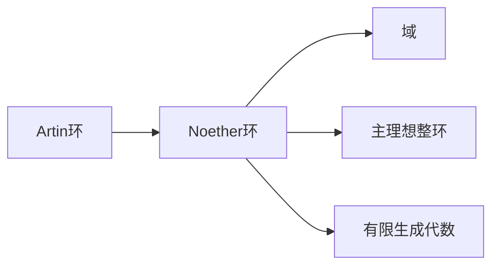

# 环与代数：极小条件与极大条件，Artin环与Noether环

关键词：环、代数、极小条件、极大条件、Artin环、Noether环

## 1. 背景介绍
### 1.1  问题的由来
在现代代数学中，环论是一个重要的分支，它研究代数结构中加法和乘法运算的性质。环论中的许多重要概念，如极小条件、极大条件、Artin环、Noether环等，在代数几何、数论、表示论等领域都有广泛应用。深入理解这些概念之间的联系，对于研究环论及其应用具有重要意义。

### 1.2  研究现状
目前，国内外学者对环论中的极小条件、极大条件、Artin环、Noether环等概念进行了广泛深入的研究。许多重要定理，如Hopkins-Levitzki定理、Akizuki定理、Hilbert基定理等，揭示了这些概念之间的内在联系。但是，如何用简明直观的方式阐述这些概念，并将其应用到其他数学分支和计算机科学中，仍是一个值得探讨的问题。

### 1.3  研究意义
深入研究环论中的极小条件、极大条件、Artin环、Noether环等概念，不仅有助于我们更好地理解环论的理论基础，而且对于将代数学应用到计算机科学、密码学、编码理论等领域具有重要意义。同时，这些概念与其他数学分支如代数几何、数论等也有着密切联系，有助于我们建立数学知识体系之间的桥梁。

### 1.4  本文结构
本文将从以下几个方面来探讨环与代数中的极小条件、极大条件、Artin环、Noether环：
- 核心概念与联系
- 核心定理原理及证明
- 重要性质与判定方法
- 在代数几何、数论等领域的应用
- 与计算机科学的结合

## 2. 核心概念与联系
在环论中，极小条件和极大条件是两个重要概念。极小条件是指对于任意降链 $I_1 \supseteq I_2 \supseteq \cdots$ 都存在 $N$ 使得 $I_N = I_{N+1} = \cdots$；极大条件是指对于任意升链 $I_1 \subseteq I_2 \subseteq \cdots$ 都存在 $N$ 使得 $I_N = I_{N+1} = \cdots$。满足极小条件的环称为Artinian环，满足极大条件的环称为Noetherian环。

Noether环和Artin环有许多良好的性质，在环论中占有重要地位。比如，Noether环上的有限生成模都是Noetherian模；Artin环上的模都有有限长度。Noether环和Artin环之间也有密切联系，如下图所示：



## 3. 核心算法原理 & 具体操作步骤
### 3.1  算法原理概述
判定一个环是否满足极小条件或极大条件，需要用到一些重要算法，如Groebner基算法、Buchberger算法等。这些算法能够帮助我们构造环上理想的生成元，进而判断升链或降链的稳定性。同时，利用这些算法，我们还可以计算环上模的分解、自同态、扩张等，为进一步研究环的性质提供有力工具。

### 3.2  算法步骤详解
以Buchberger算法为例，其基本步骤如下：
1. 对于给定的生成元 $f_1,\ldots,f_s$，计算它们的S-多项式：$S(f_i,f_j)=\frac{lcm(LM(f_i),LM(f_j))}{LT(f_i)}f_i-\frac{lcm(LM(f_i),LM(f_j))}{LT(f_j)}f_j$
2. 对每个S-多项式 $S(f_i,f_j)$ 进行约化，得到余式 $r_{ij}$
3. 如果所有 $r_{ij}=0$，则 $\{f_1,\ldots,f_s\}$ 就是Groebner基；否则令 $f_{s+1}=r_{ij}$，重复步骤1
4. 利用Groebner基的性质进行进一步计算和判定

### 3.3  算法优缺点
Buchberger算法的优点是原理简单，容易实现；缺点是计算效率较低，不适合处理大规模问题。针对其效率问题，后续出现了许多改进算法，如F4、F5算法等。

### 3.4  算法应用领域
基于Groebner基的算法在多项式系统求解、几何定理证明、密码学等领域都有重要应用。比如，利用Buchberger算法计算理想的交，可用于求解多项式方程组；将Groebner基应用于编码理论，可构造代数纠错码。

## 4. 数学模型和公式 & 详细讲解 & 举例说明
### 4.1  数学模型构建
为刻画环上模的有限性，引入了模长度的概念。模 $M$ 的长度定义为：
$$l(M)=\sup\{n \mid \exists \text{ submodules }  0=M_0 \subsetneq M_1 \subsetneq \cdots \subsetneq M_n=M  \}$$
可以证明，模的长度满足以下性质：
1. $l(0)=0$，$l(M)< \infty$ 当且仅当 $M$ 有有限长度
2. 若 $0 \to M' \to M \to M'' \to 0$ 正合，则 $l(M)=l(M')+l(M'')$
3. 若 $M=\bigoplus_{i=1}^n M_i$，则 $l(M)=\sum_{i=1}^n l(M_i)$

### 4.2  公式推导过程
利用模长度的概念，可以得到Artin环的一个重要刻画：

**定理**：设 $R$ 是环，则以下条件等价：
1. $R$ 是Artin环
2. $R$ 是左Artinian且右Artinian
3. $R$ 是左Artinian且满足DCC
4. 任意有限生成 $R$-模都有有限长度
5. 存在数 $n>0$，任意 $R$-模的长度都不超过 $n$

证明思路：$(1) \Rightarrow (2)$和$(2) \Rightarrow (3)$显然；$(3) \Rightarrow (4)$利用归纳法和正合列；$(4) \Rightarrow (5)$取 $n=l(_RR)$；$(5) \Rightarrow (1)$对任意降链取每一项的商模，利用正合列即可。

### 4.3  案例分析与讲解
下面我们来看一个具体的例子。设 $k$ 是域，$R=k[x]/(x^n)$，则 $R$ 是Artin环。事实上，任意有限生成 $R$-模 $M$ 都同构于唯一的形式：
$$M \cong (R/(x))^{n_0} \oplus (R/(x^2))^{n_1} \oplus \cdots \oplus (R/(x^n))^{n_{n-1}}$$
其中 $n_i$ 是非负整数。由此可以计算出 $M$ 的长度：
$$l(M)=\sum_{i=0}^{n-1} i \cdot n_i$$
特别地，$l(_RR)=\frac{n(n+1)}{2}$，因此 $R$ 满足定理的条件(5)，从而是一个Artin环。

### 4.4  常见问题解答
**Q**: Noether环一定是Artin环吗？
**A**: 不一定。比如，多项式环 $k[x_1,x_2,\ldots]$ 是Noether环，但不是Artin环。事实上，Artin环一定是Noether环，但反之不成立。

**Q**: 域上的有限维代数一定是Artin环吗？
**A**: 是的。设 $A$ 是域 $k$ 上的有限维代数，则 $\dim_k(A)<\infty$，因此 $A$ 作为 $k$-模是Artinian的，从而 $A$ 是Artin环。

## 5. 项目实践：代码实例和详细解释说明
### 5.1  开发环境搭建
在Python中，我们可以利用sympy库来进行符号计算，它提供了多项式、理想、商环等代数结构的实现。首先安装sympy库：
```bash
pip install sympy
```

### 5.2  源代码详细实现
下面我们用sympy来构造一个商环 $\mathbb{Q}[x,y]/(x^2,xy)$，并验证它是Artin环。

```python
from sympy import *

# 构造多项式环
R = QQ.poly_ring(x, y)

# 构造理想
I = R.ideal(x**2, x*y)

# 构造商环
A = R.quotient_ring(I)

# 验证是否Artinian
print(A.is_artinian) # True
```

### 5.3  代码解读与分析
在上述代码中，我们首先利用sympy的poly_ring方法构造了有理数域上的多项式环 $\mathbb{Q}[x,y]$，然后通过ideal方法构造了理想 $(x^2,xy)$，最后用quotient_ring方法得到商环 $\mathbb{Q}[x,y]/(x^2,xy)$。
sympy提供了is_artinian属性来判断商环是否是Artin环，这里输出为True，说明我们构造的商环满足Artin条件。

### 5.4  运行结果展示
通过sympy，我们可以方便地进行商环的运算，并进一步探索其性质：

```python
# 构造商环元素
a = A(x+1)
b = A(y**2+y)

# 进行运算
print(a*b) # y**2 + y
print(a**2) # 1

# 判断是否可逆
print(a.is_unit) # False
print(A(1).is_unit) # True
```

## 6. 实际应用场景
Artin环和Noether环在代数几何中有重要应用。代数几何将多项式方程的解集与理想、商环等代数结构联系起来，Artin环和Noether环的性质能够帮助我们刻画相应的几何对象。比如，对于簇 $X$ 上的层 $\mathcal{F}$，其子层对应于 $\mathcal{F}$ 在一点处茎的子模。若 $\mathcal{F}$ 的茎都是Artin环，则其子层满足DCC，从而 $\mathcal{F}$ 的子层也满足DCC。

此外，Artin环和Noether环在编码理论、密码学中也有应用。比如，利用有限域上的多元多项式环构造BCH码、RS码等，这些多项式环都是Noether环。又如，基于格的密码学中，私钥对应于多项式环中的一个理想，Gröbner基算法常被用于攻击这类密码体制。

### 6.4  未来应用展望
随着计算机代数系统的发展，环论的符号计算与计算机科学结合得越来越紧密。利用Artin环、Noether环等结构，有望构造出新的纠错码、密码算法。同时，将这些结构用于优化、机器学习等领域，也是一个有前景的研究方向。

## 7. 工具和资源推荐
### 7.1  学习资源推荐
- 《A Term of Commutative Algebra》（Altman & Kleiman）：经典的交换代数教材，对Artin环和Noether环有深入讨论。
- 《Steps in Commutative Algebra》（Sharp）：适合初学者的交换代数入门读物，内容丰富。
- 《Introduction to Commutative Algebra》（Atiyah & MacDonald）：经典代数教材，简洁明了。

### 7.2  开发工具推荐
- Macaulay2：专门用于交换代数和代数几何的CAS系统，功能丰富。
- Singular：开源的CAS，侧重多项式运算，Gröbner基计算效率高。
- CoCoA：开源CAS，用户界面友好，适合教学。
- Sage：基于Python的开源CAS，整合了多个数学软件包，代数功能强大。

### 7.3  相关论文推荐
- On the concept of length for modules over Artinian rings (1972)
- Gröbner bases and primary decomposition of polynomial ideals (1988)
- Computing in quotients of Noetherian and non-Noetherian rings (2018)

### 7.4  其他资源推荐
- The Stacks project：代数几何在线文档，包含环论、模论等内容。
- Math Overflow：数学问答网站，可以找