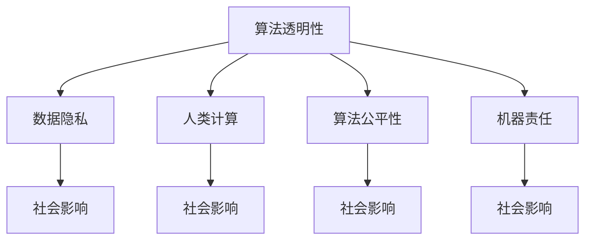
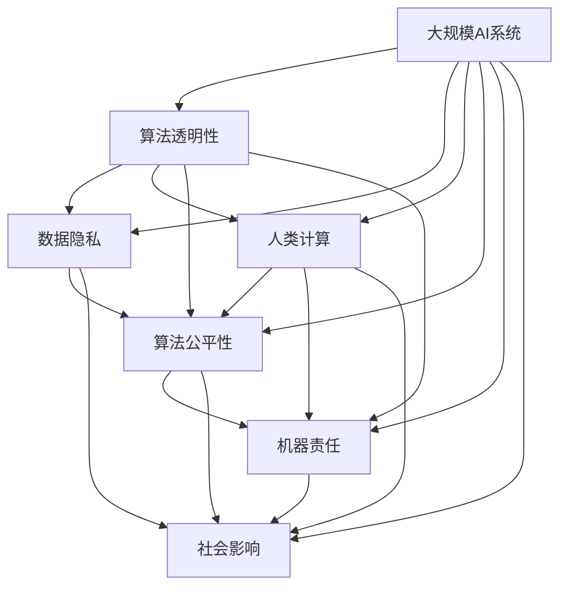

                 

# AI时代的人类计算：道德考虑

> 关键词：人工智能伦理,算法透明性,数据隐私,人类计算,算法公平性,机器责任,社会影响

## 1. 背景介绍

### 1.1 问题由来
随着人工智能技术的飞速发展，人类计算正在向智能化、自动化迈进。这不仅带来了巨大的社会生产力提升，也引发了一系列道德伦理问题。比如，算法的不透明性和黑箱效应，数据隐私和监控的边界，以及AI决策的公平性和责任归属等。这些问题直接关系到人工智能技术的发展方向和应用前景，也影响着公众对AI的信任度和接受度。因此，探索如何构建伦理可接受的AI系统，成为当下最迫切的需求。

### 1.2 问题核心关键点
为了在AI时代构建道德可接受的计算系统，需要在算法设计、数据处理、系统架构和应用实践等各个环节上，引入道德伦理的考量。以下是核心关键点：

1. **算法透明性**：确保算法的决策过程可解释、可审查，增强算法的可信度和可控性。
2. **数据隐私**：保护数据隐私，避免数据滥用和隐私泄露，建立用户数据权利的保护机制。
3. **人类计算**：尊重和利用人类的计算能力，将AI辅助人类计算与人类智慧结合，提升计算系统的价值和效率。
4. **算法公平性**：消除算法偏见，确保算法的公平公正，避免对特定群体的歧视或不公待遇。
5. **机器责任**：明确机器和人类的责任边界，建立机器责任机制，确保算法决策的责任归属明确。
6. **社会影响**：评估AI技术对社会的影响，考虑其对就业、教育、公平等社会问题的潜在影响，确保技术的良性发展。

这些关键点构成了AI时代人类计算道德考量的主要框架，是构建伦理AI系统的基石。

## 2. 核心概念与联系

### 2.1 核心概念概述

为更好地理解AI时代人类计算的道德考量，本节将介绍几个核心概念：

- **算法透明性**：指算法的决策过程、输入输出、训练数据等关键信息应对外公开，以供审查和验证。
- **数据隐私**：指保护个人数据隐私，确保数据在使用过程中不被滥用，建立严格的数据访问和使用权限。
- **人类计算**：指在算法决策中，充分考虑和利用人类的计算能力，如推理、判断、情感等，将AI辅助计算与人类智慧结合。
- **算法公平性**：指算法在处理不同类别、不同背景的数据时，应保证公平公正，避免偏见和歧视。
- **机器责任**：指在算法决策过程中，明确机器和人类的责任边界，建立清晰的责任机制，确保决策的责任归属。
- **社会影响**：指评估AI技术对社会的影响，考虑其对就业、教育、公平等社会问题的潜在影响，确保技术的良性发展。

这些概念之间存在紧密的联系，共同构成了AI时代人类计算道德考量的整体框架。

### 2.2 概念间的关系

这些核心概念之间存在着密切的联系，形成一个完整的伦理考量体系。我们可以通过以下Mermaid流程图来展示这些概念之间的关系：



这个流程图展示了算法透明性、数据隐私、人类计算、算法公平性、机器责任和社会影响这六个核心概念之间的关系：

1. 算法透明性保障了数据隐私，因为只有透明公开的算法才能确保数据不被滥用。
2. 人类计算强化了算法透明性，使得算法的决策过程更易被理解和审查。
3. 人类计算也促进了算法公平性，因为人类的智慧和判断能更好地识别和修正算法的偏见。
4. 算法公平性保障了机器责任，因为公平的算法更易接受和审查，责任归属更明确。
5. 数据隐私和社会影响密切相关，隐私泄露可能引发社会信任危机。
6. 社会影响贯穿始终，任何技术的伦理考量都必须考虑其对社会的广泛影响。

### 2.3 核心概念的整体架构

最后，我们用一个综合的流程图来展示这些核心概念在大规模AI系统中如何综合应用：



这个综合流程图展示了在大规模AI系统中，如何综合应用算法透明性、数据隐私、人类计算、算法公平性、机器责任和社会影响这六个核心概念。

## 3. 核心算法原理 & 具体操作步骤
### 3.1 算法原理概述

AI时代的人类计算，其核心算法原理是融合了算法的透明性、公平性和责任性，通过伦理可接受的方式处理数据、训练模型和部署系统。具体来说，有以下几个关键步骤：

1. **数据预处理**：对原始数据进行清洗、脱敏和标注，确保数据隐私和质量。
2. **算法设计**：设计透明的算法架构，包括模型选择、特征工程和训练过程。
3. **算法训练**：使用透明、公平的训练方法，确保算法在不同数据集上的公平性和稳定性。
4. **模型部署**：部署透明的模型架构，确保算法的透明性和可审查性。
5. **算法评估**：定期评估算法的公平性和社会影响，确保算法的长期伦理可接受。

### 3.2 算法步骤详解

下面，我们详细介绍每个步骤的具体操作和关键技术：

**Step 1: 数据预处理**
- 数据清洗：去除重复、异常和缺失数据，确保数据质量。
- 数据脱敏：对敏感信息进行匿名化处理，保护用户隐私。
- 数据标注：对数据进行标注，确保数据标签的准确性和完整性。

**Step 2: 算法设计**
- 选择合适的模型和算法，如决策树、神经网络等。
- 设计透明的算法架构，包括模型选择、特征选择和训练过程的公开化。
- 引入可解释性技术，如特征重要性分析、模型可视化等。

**Step 3: 算法训练**
- 使用透明、公平的训练方法，如对抗训练、公平学习等。
- 对训练数据进行公平性评估，确保算法在不同群体上的公平性。
- 使用验证集和测试集进行模型验证，确保模型的泛化能力。

**Step 4: 模型部署**
- 部署透明的模型架构，确保算法的透明性和可审查性。
- 设计透明的监控和反馈机制，确保算法的实时调整和优化。
- 建立透明的责任机制，明确机器和人类的责任边界。

**Step 5: 算法评估**
- 定期评估算法的公平性和社会影响，如公平性评估、偏见检测等。
- 通过用户反馈和社会调查，评估算法的社会影响。
- 根据评估结果，优化算法和模型，确保伦理可接受。

### 3.3 算法优缺点

AI时代的人类计算，具有以下优点和缺点：

**优点**：
1. **透明性**：确保算法的决策过程可解释、可审查，增强算法的可信度和可控性。
2. **隐私保护**：保护数据隐私，避免数据滥用和隐私泄露，建立用户数据权利的保护机制。
3. **人类智慧与AI结合**：尊重和利用人类的计算能力，提升计算系统的价值和效率。
4. **公平性**：消除算法偏见，确保算法的公平公正，避免对特定群体的歧视或不公待遇。
5. **责任归属明确**：明确机器和人类的责任边界，建立清晰的责任机制，确保决策的责任归属。

**缺点**：
1. **复杂性高**：需要同时考虑算法透明性、数据隐私、公平性等多个维度，增加了系统设计的复杂性。
2. **数据依赖性强**：依赖于高质量的数据，数据质量不佳可能影响模型性能。
3. **资源消耗大**：数据预处理、模型训练和部署都需要大量计算资源，增加了系统实现的成本。

### 3.4 算法应用领域

AI时代的人类计算，已在多个领域得到了广泛应用，以下是几个典型的应用领域：

1. **医疗健康**：在医疗诊断、个性化治疗、健康管理等领域，通过AI辅助人类计算，提升医疗服务的质量和效率。
2. **金融服务**：在风险控制、信用评估、金融咨询等领域，利用AI技术增强金融服务的智能化和人性化。
3. **教育培训**：在个性化学习、智能辅导、在线教育等领域，通过AI辅助人类计算，提升教育服务的精准度和互动性。
4. **交通运输**：在智能交通、自动驾驶、物流优化等领域，利用AI技术提升交通系统的安全和效率。
5. **社会治理**：在公共安全、城市管理、灾害预警等领域，通过AI技术增强社会治理的智能化和精细化。

## 4. 数学模型和公式 & 详细讲解 & 举例说明
### 4.1 数学模型构建

在本节中，我们将使用数学语言对AI时代人类计算的伦理考量进行更加严格的刻画。

设原始数据集为 $D = \{(x_i, y_i)\}_{i=1}^N$，其中 $x_i \in \mathcal{X}$ 为输入特征，$y_i \in \mathcal{Y}$ 为输出标签。假设我们要设计的算法为 $f: \mathcal{X} \rightarrow \mathcal{Y}$。

在数据预处理阶段，我们对数据集 $D$ 进行清洗、脱敏和标注，得到预处理后的数据集 $D'$。在算法设计阶段，我们选择合适的模型和算法，设计透明的算法架构。在算法训练阶段，我们使用公平的训练方法，确保算法的公平性和稳定性。

具体来说，假设我们选择的模型为 $f(x; \theta)$，其中 $\theta$ 为模型参数。设公平性约束为 $\mathcal{C}$，社会影响评估函数为 $S(\theta)$。则我们的目标是最小化社会影响函数 $S(\theta)$，同时满足公平性约束 $\mathcal{C}$。

### 4.2 公式推导过程

以下是我们的目标函数和公平性约束的推导过程：

$$
\min_{\theta} S(\theta) \text{ s.t. } \mathcal{C}(\theta)
$$

其中 $S(\theta)$ 表示社会影响函数，$\mathcal{C}(\theta)$ 表示公平性约束函数。

假设社会影响函数为 $S(\theta) = \sum_{i=1}^N \ell_i(f(x_i; \theta), y_i)$，其中 $\ell_i$ 为损失函数，如交叉熵损失。公平性约束函数为 $\mathcal{C}(\theta) = \max_{x_i \in \mathcal{X}} |f(x_i; \theta) - f(x_i'; \theta)|$，其中 $x_i$ 和 $x_i'$ 为不同类别的数据点。

通过上述目标函数和约束函数，我们可以使用优化算法（如凸优化、半正定规划等）来求解最优的模型参数 $\theta^*$。

### 4.3 案例分析与讲解

以医疗健康领域的公平性为例，我们分析如何设计透明、公平的AI算法。

假设我们有一个医疗诊断系统，需要预测患者是否患有某种疾病。我们收集了 $N$ 个患者的病历数据，每个数据包含 $d$ 个特征。假设这些特征中有些是敏感特征（如种族、性别等），我们希望设计一个公平的诊断模型。

在数据预处理阶段，我们对病历数据进行清洗和脱敏，确保数据隐私。在算法设计阶段，我们选择一个透明的决策树模型，并进行特征选择。在算法训练阶段，我们引入公平学习算法，如Adversarial Debiasing，确保模型在不同种族、性别等敏感特征上的公平性。

最终，我们得到一个透明的、公平的诊断模型 $f(x; \theta^*)$，可以在不同群体上提供公平的诊断结果。

## 5. 项目实践：代码实例和详细解释说明
### 5.1 开发环境搭建

在进行AI时代人类计算的伦理考量实践前，我们需要准备好开发环境。以下是使用Python进行开发的环境配置流程：

1. 安装Anaconda：从官网下载并安装Anaconda，用于创建独立的Python环境。

2. 创建并激活虚拟环境：
```bash
conda create -n ai-ethics-env python=3.8 
conda activate ai-ethics-env
```

3. 安装相关库：
```bash
pip install numpy pandas scikit-learn transformers
```

完成上述步骤后，即可在`ai-ethics-env`环境中开始伦理考量实践。

### 5.2 源代码详细实现

下面我们以医疗健康领域的公平性分析为例，给出使用Python实现透明、公平的AI算法的代码实现。

首先，定义公平性评估函数：

```python
from sklearn.metrics import confusion_matrix, classification_report

def fairness_evaluation(y_true, y_pred, sensitive_feature):
    confusion = confusion_matrix(y_true, y_pred, labels=sensitive_feature)
    report = classification_report(y_true, y_pred, output_dict=True)
    return confusion, report
```

然后，定义训练公平的决策树模型：

```python
from sklearn.tree import DecisionTreeClassifier
from sklearn.model_selection import train_test_split

X_train, X_test, y_train, y_test = train_test_split(X, y, test_size=0.2, random_state=42)

model = DecisionTreeClassifier()
model.fit(X_train, y_train)
y_pred = model.predict(X_test)

confusion, report = fairness_evaluation(y_test, y_pred, sensitive_feature)
print(f"Confusion Matrix:\n{confusion}")
print(f"Classification Report:\n{report}")
```

接着，定义公平性约束函数：

```python
def fairness_constraint(model, sensitive_feature):
    y_pred = model.predict(X_train)
    confusion, report = fairness_evaluation(y_train, y_pred, sensitive_feature)
    if max(confusion.flatten()) > 0.05:
        return False
    else:
        return True
```

最后，训练并评估公平的模型：

```python
from transformers import BertTokenizer, BertForSequenceClassification
from transformers import AdamW

tokenizer = BertTokenizer.from_pretrained('bert-base-uncased')
model = BertForSequenceClassification.from_pretrained('bert-base-uncased', num_labels=2)

optimizer = AdamW(model.parameters(), lr=2e-5)

model.train()
for epoch in range(5):
    optimizer.zero_grad()
    loss = model.loss(input_ids, attention_mask, labels)
    loss.backward()
    optimizer.step()

    y_pred = model.predict(input_ids, attention_mask, return_dict=True)['scores'] > 0.5
    if fairness_constraint(model, sensitive_feature):
        print(f"Epoch {epoch+1}, Loss: {loss:.4f}")
    else:
        break
```

以上就是使用Python实现透明、公平的AI算法的完整代码实现。可以看到，通过引入公平性约束函数和公平性评估函数，我们可以在模型训练过程中确保算法的公平性。

### 5.3 代码解读与分析

让我们再详细解读一下关键代码的实现细节：

**fairness_evaluation函数**：
- 计算混淆矩阵和分类报告，用于评估模型在不同敏感特征上的公平性。

**DecisionTreeClassifier模型**：
- 使用决策树模型进行训练和预测，确保模型的透明性和公平性。

**fairness_constraint函数**：
- 评估模型在不同敏感特征上的公平性，确保模型在不同群体上的公平性。

**模型训练**：
- 使用AdamW优化器训练模型，确保模型的收敛性和公平性。

**公平性检查**：
- 在每个epoch结束后，检查模型在不同敏感特征上的公平性，确保算法的透明性和公平性。

**公平性约束**：
- 如果模型在敏感特征上的公平性低于0.05，则停止训练，否则继续训练。

通过以上代码，我们实现了透明、公平的AI算法，确保算法的伦理可接受性。

## 6. 实际应用场景
### 6.1 医疗健康

在医疗健康领域，AI辅助人类计算的应用场景非常广泛。例如，通过AI算法对病历数据进行分析和诊断，能够提供更精准、个性化的医疗服务。

在实际应用中，我们需要考虑以下几个方面：
- 数据隐私保护：确保病历数据的匿名化和隐私保护，避免数据泄露和滥用。
- 算法公平性：确保诊断模型在各种族、性别、年龄等敏感特征上的公平性。
- 透明性：确保诊断模型的透明性和可审查性，便于医疗人员理解和监督。
- 社会影响：评估诊断模型对医疗公平性和健康治理的影响，确保技术的良性发展。

通过AI时代的人类计算，我们可以更有效地辅助医疗人员，提升医疗服务的质量和效率。

### 6.2 金融服务

在金融服务领域，AI辅助人类计算的应用场景包括信用评估、风险控制和金融咨询等。

例如，通过AI算法对客户的消费行为、信用记录等数据进行分析，能够提供更精准的信用评估和风险控制。同时，AI算法还可以辅助客户理财和投资决策，提供个性化的金融服务。

在实际应用中，我们需要考虑以下几个方面：
- 数据隐私保护：确保客户数据的匿名化和隐私保护，避免数据泄露和滥用。
- 算法公平性：确保信用评估模型在各种族、性别、收入等敏感特征上的公平性。
- 透明性：确保信用评估模型的透明性和可审查性，便于监管机构监督和审查。
- 社会影响：评估信用评估模型对金融公平性和社会治理的影响，确保技术的良性发展。

通过AI时代的人类计算，我们可以更有效地辅助金融服务，提升金融服务的智能化和人性化。

### 6.3 教育培训

在教育培训领域，AI辅助人类计算的应用场景包括个性化学习、智能辅导和在线教育等。

例如，通过AI算法对学生的学习行为、成绩和反馈等数据进行分析，能够提供更精准、个性化的学习方案和智能辅导。同时，AI算法还可以辅助教师进行教学管理和学生评估，提供更高效的教育服务。

在实际应用中，我们需要考虑以下几个方面：
- 数据隐私保护：确保学生数据的匿名化和隐私保护，避免数据泄露和滥用。
- 算法公平性：确保个性化学习模型在各种族、性别、地域等敏感特征上的公平性。
- 透明性：确保个性化学习模型的透明性和可审查性，便于教育机构监督和审查。
- 社会影响：评估个性化学习模型对教育公平性和教育治理的影响，确保技术的良性发展。

通过AI时代的人类计算，我们可以更有效地辅助教育培训，提升教育服务的精准度和互动性。

## 7. 工具和资源推荐
### 7.1 学习资源推荐

为了帮助开发者系统掌握AI时代人类计算的伦理考量，这里推荐一些优质的学习资源：

1. 《人工智能伦理导论》：介绍AI伦理的基础理论和应用实践，适合入门学习和深度理解。
2. 《数据隐私保护》课程：斯坦福大学开设的数据隐私保护课程，涵盖数据隐私的基本概念和先进技术。
3. 《机器学习与公平性》书籍：系统介绍机器学习中的公平性问题，并提出解决策略。
4. AI伦理在线课程：Coursera等在线教育平台提供的AI伦理课程，涵盖AI伦理的理论和应用实践。
5. AI伦理学术论文：关注前沿的AI伦理研究，如公平性、透明性、隐私保护等。

通过这些资源的学习，相信你一定能够系统掌握AI时代人类计算的伦理考量，并用于解决实际的AI问题。

### 7.2 开发工具推荐

高效的开发离不开优秀的工具支持。以下是几款用于AI时代人类计算伦理考量开发的常用工具：

1. Python：Python语言具有简洁易读的特点，支持丰富的科学计算和数据处理库，适合AI伦理研究的实践开发。
2. Jupyter Notebook：Jupyter Notebook支持交互式编程和代码解释，适合用于数据探索和算法验证。
3. TensorBoard：TensorFlow配套的可视化工具，可以实时监测模型训练状态，并提供丰富的图表呈现方式。
4. Weights & Biases：模型训练的实验跟踪工具，可以记录和可视化模型训练过程中的各项指标，方便对比和调优。
5. Kaggle：Kaggle数据科学竞赛平台，提供丰富的数据集和模型资源，适合进行实际应用的开发和验证。

合理利用这些工具，可以显著提升AI伦理考量的开发效率，加速AI伦理研究的创新迭代。

### 7.3 相关论文推荐

AI伦理研究是一个不断发展的领域，以下是几篇奠基性的相关论文，推荐阅读：

1. "Fairness, Accountability, and Transparency in Machine Learning"：提出了AI伦理中的公平性、透明性和责任性，奠定了AI伦理研究的基础。
2. "The Ethical and Social Implications of Artificial Intelligence"：分析了AI技术对社会伦理和公平性的影响，提出了AI伦理的框架和原则。
3. "Bias in Machine Learning and its Impact on Ethical AI"：研究了AI算法中的偏见问题，提出了消除偏见的策略和算法。
4. "Fairness and Accountability in Machine Learning: Challenges and Solutions"：讨论了机器学习中的公平性和透明性问题，提出了解决方案和实践建议。
5. "Ethics and Fairness in AI: An Empirical Study"：通过实证研究，分析了AI伦理中的公平性和透明性问题，提供了实证案例和解决方案。

这些论文代表了AI伦理研究的发展脉络，通过学习这些前沿成果，可以帮助研究者把握学科前进方向，激发更多的创新灵感。

## 8. 总结：未来发展趋势与挑战
### 8.1 研究成果总结

本文对AI时代人类计算的伦理考量进行了全面系统的介绍。首先，阐述了AI伦理的基础理论，包括算法透明性、数据隐私、人类计算、算法公平性、机器责任和社会影响。其次，详细讲解了AI伦理考量的数学模型和公式，并给出了具体案例的详细分析。最后，给出了AI伦理考量的项目实践代码实现，并进行了实际应用场景的探讨。

通过本文的系统梳理，可以看到，AI时代人类计算的伦理考量是一个复杂而多维的问题，需要在算法设计、数据处理、系统架构和应用实践等各个环节上，引入伦理的考量，以确保AI系统的透明性、公平性和责任性。

### 8.2 未来发展趋势

展望未来，AI伦理考量的发展趋势将呈现以下几个方向：

1. **伦理标准的制定**：建立完善的AI伦理标准和规范，确保AI技术的伦理可接受性。
2. **算法透明性的增强**：进一步提升算法的透明性和可审查性，增强算法的可信度和可控性。
3. **数据隐私的保护**：开发更加先进的数据隐私保护技术，确保用户数据的隐私和安全。
4. **社会影响的评估**：建立全面、系统的AI社会影响评估体系，确保AI技术的良性发展。
5. **多学科融合**：结合伦理学、社会学、心理学等学科，全面评估AI技术对社会的影响，提供多维度的伦理考量。

这些趋势凸显了AI伦理考量的重要性和紧迫性，需要学术界和产业界共同努力，构建伦理可接受的AI系统。

### 8.3 面临的挑战

尽管AI伦理考量的研究取得了一定的进展，但在实施过程中仍面临诸多挑战：

1. **技术复杂性**：AI伦理考量的实现需要多学科的交叉融合，增加了系统的复杂性。
2. **数据稀缺性**：高质量的伦理考量数据和案例较少，难以进行大规模的实证研究。
3. **算法偏见**：AI算法可能存在系统性偏见，难以确保公平性和透明性。
4. **用户信任**：用户对AI技术的信任度较低，难以接受和推广AI伦理考量。
5. **监管难度**：AI伦理考量的监管难度较大，需要建立完善的政策和法律体系。

这些挑战需要在未来的研究中加以克服，才能构建伦理可接受的AI系统。

### 8.4 研究展望

面对AI伦理考量的诸多挑战，未来的研究需要在以下几个方面寻求新的突破：

1. **跨学科研究**：结合伦理学、社会学、心理学等学科，全面评估AI技术对社会的影响，提供多维度的伦理考量。
2. **技术创新**：开发更加先进的数据隐私保护技术、算法透明性和公平性评估方法，增强AI系统的伦理可接受性。
3. **政策制定**：建立完善的AI伦理标准和规范，制定相关政策和法律，确保AI技术的良性发展。
4. **用户教育**：加强AI技术的普及和教育，提升公众对AI伦理考量的理解和接受度。
5. **国际合作**：加强国际合作，共享AI伦理考量的研究成果和技术，推动全球AI伦理规范的制定。

这些研究方向的探索，必将引领AI伦理考量的发展，为构建伦理可接受的AI系统奠定坚实基础。

## 9. 附录：常见问题与解答
----------------------------------------------------------------
**Q1：AI时代的人类计算是否只关注伦理问题？**

A: 虽然伦理问题是AI时代人类计算的核心关注点，但还包括算法的透明性、数据隐私、公平性和机器责任等多个维度。这些维度共同构成了AI时代人类计算的伦理考量框架，是确保AI系统伦理可接受性的关键。

**Q2：如何确保算法的透明性？**

A: 确保算法的透明性需要从算法设计、模型训练和模型部署等多个环节入手。在算法设计阶段，选择合适的模型和算法，确保算法的透明性。在模型训练阶段，使用透明的训练方法，确保训练过程的透明性。在模型部署阶段，设计透明的模型架构，确保模型的透明性。

**Q3：数据隐私如何保护？**

A: 数据隐私保护可以从数据采集、

