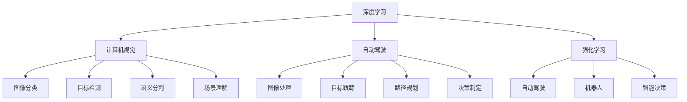
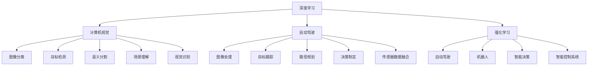

                 

# Andrej Karpathy：OpenAI 的核心人物

## 1. 背景介绍

### 1.1 问题由来

在人工智能的海洋中，Andrej Karpathy是一个不可忽视的名字。他不仅是OpenAI的核心人物之一，还是计算机视觉领域的领军人物，其在深度学习、自动驾驶、机器人等领域均有杰出贡献。Andrej Karpathy的研究不仅推动了技术的进步，也启发了后人的探索方向。本文将详细探讨Andrej Karpathy的学术背景、研究贡献、以及他在OpenAI中的角色。

### 1.2 问题核心关键点

Andrej Karpathy的研究领域广泛，涵盖了深度学习、计算机视觉、自动驾驶、强化学习等多个领域。他的核心贡献包括：

- **深度学习**：Karpathy对深度神经网络的设计和优化有深入研究，包括卷积神经网络（CNN）、递归神经网络（RNN）、Transformer等。
- **计算机视觉**：他在图像识别、目标检测、语义分割、场景理解等方面有着开创性的工作。
- **自动驾驶**：Karpathy在自动驾驶技术的多个方面有重要贡献，包括图像处理、目标跟踪、路径规划等。
- **强化学习**：他通过将强化学习与计算机视觉结合，提出了一系列新的方法，推动了自动驾驶和机器人技术的发展。

Andrej Karpathy的研究不仅在学术界有重要影响，还通过OpenAI，将深度学习技术广泛应用于现实世界的各种场景中。

### 1.3 问题研究意义

研究Andrej Karpathy的贡献，对于理解深度学习、计算机视觉、自动驾驶等领域的技术进展具有重要意义。他的研究不仅推动了技术的进步，还为实际应用提供了可行的方案。同时，通过学习和借鉴Karpathy的研究思路和方法，可以帮助新一代研究人员和开发者更好地应对技术挑战，推动AI技术的不断创新。

## 2. 核心概念与联系

### 2.1 核心概念概述

Andrej Karpathy的研究涉及多个核心概念，包括深度学习、计算机视觉、自动驾驶、强化学习等。这些概念之间的联系和相互作用，构成了他在AI领域的研究框架。

- **深度学习**：是指通过构建深层神经网络来处理复杂的数据和任务。Karpathy在深度学习中的研究涉及模型架构设计、优化算法、损失函数等多个方面。
- **计算机视觉**：是指计算机如何“看”和理解图像、视频等视觉数据。Karpathy在这一领域的研究包括图像分类、目标检测、语义分割、场景理解等。
- **自动驾驶**：是指如何让计算机系统自主驾驶。Karpathy在这一领域的研究涉及图像处理、目标跟踪、路径规划、决策制定等多个方面。
- **强化学习**：是指通过与环境交互，学习最优策略来完成任务。Karpathy在这一领域的研究涉及强化学习与计算机视觉的结合，提出了一系列新的方法和技术。

这些核心概念之间的联系，主要体现在它们都是解决复杂现实问题的工具和方法。深度学习、计算机视觉、自动驾驶、强化学习等技术，通过互相结合和应用，可以解决从图像识别、自动驾驶到智能决策等多个领域的实际问题。

### 2.2 概念间的关系

Andrej Karpathy的研究框架可以用以下Mermaid流程图来展示：



这个流程图展示了Karpathy研究的各个概念之间的联系和相互作用。深度学习是基础，计算机视觉和自动驾驶则是应用，强化学习则是进一步的优化。

### 2.3 核心概念的整体架构

Andrej Karpathy的研究框架可以用以下综合的Mermaid流程图来展示：



这个综合流程图展示了Karpathy研究的各个概念之间的整体架构。深度学习是基础，计算机视觉和自动驾驶则是应用，强化学习则是进一步的优化。同时，视觉识别、传感器数据融合、智能控制系统等技术，都是实现自动驾驶和机器人任务的重要组成部分。

## 3. 核心算法原理 & 具体操作步骤
### 3.1 算法原理概述

Andrej Karpathy的研究涉及多个核心算法，包括深度学习、计算机视觉、自动驾驶、强化学习等。这些算法原理和具体操作步骤，构成了他在AI领域的核心贡献。

### 3.2 算法步骤详解

以计算机视觉领域的图像分类任务为例，Karpathy提出的算法步骤包括：

1. **数据准备**：收集并标注训练数据，划分为训练集、验证集和测试集。
2. **模型选择**：选择合适的深度学习模型，如卷积神经网络（CNN）、递归神经网络（RNN）、Transformer等。
3. **模型训练**：在训练集上训练模型，使用随机梯度下降（SGD）等优化算法，调整模型参数。
4. **模型评估**：在验证集上评估模型性能，选择合适的超参数。
5. **模型测试**：在测试集上测试模型性能，输出最终结果。

以自动驾驶领域的路径规划为例，Karpathy提出的算法步骤包括：

1. **环境感知**：使用摄像头、雷达等传感器获取环境信息。
2. **目标检测**：检测道路上的车辆、行人、障碍物等。
3. **路径规划**：根据目标位置和速度，生成最优路径。
4. **决策制定**：根据当前环境状态，选择最优驾驶策略。

### 3.3 算法优缺点

Andrej Karpathy的研究具有以下优点：

- **创新性**：他提出的深度学习、计算机视觉、自动驾驶、强化学习等算法，具有高度的创新性和前瞻性。
- **应用广泛**：他的研究成果在多个领域有广泛应用，推动了技术的发展。
- **可扩展性**：他提出的算法框架具有高度的可扩展性，可以轻松应用于其他领域。

同时，这些算法也存在一些缺点：

- **计算资源需求高**：深度学习、计算机视觉、自动驾驶等算法需要大量的计算资源，对硬件设施要求较高。
- **数据依赖性强**：这些算法需要大量的标注数据进行训练，对数据的质量和数量要求较高。
- **模型复杂度高**：深度学习、计算机视觉、自动驾驶等算法模型复杂，难以理解和调试。

### 3.4 算法应用领域

Andrej Karpathy的研究涉及多个领域，包括深度学习、计算机视觉、自动驾驶、强化学习等。这些算法在不同领域有广泛应用：

- **计算机视觉**：图像分类、目标检测、语义分割、场景理解等。
- **自动驾驶**：图像处理、目标跟踪、路径规划、决策制定等。
- **强化学习**：自动驾驶、机器人、智能决策等。

## 4. 数学模型和公式 & 详细讲解

### 4.1 数学模型构建

以计算机视觉领域的图像分类任务为例，Karpathy提出的数学模型包括：

- **输入数据**：$x$ 表示输入的图像，$y$ 表示图像所属的类别。
- **损失函数**：$L(x,y)$ 表示模型预测输出与真实标签之间的差异。
- **模型参数**：$\theta$ 表示模型可训练的参数。
- **优化目标**：$\min_\theta L(x,y)$，即最小化损失函数。

### 4.2 公式推导过程

以计算机视觉领域的图像分类任务为例，Karpathy提出的公式推导过程包括：

1. **数据准备**：将训练数据$(x_i, y_i)$输入模型，计算模型预测输出$z_i$。
2. **损失计算**：计算损失函数$L(x,y) = -\log(\frac{e^{z_i}}{\sum_k e^{z_k}})$。
3. **参数更新**：使用随机梯度下降算法，更新模型参数$\theta$。

### 4.3 案例分析与讲解

以计算机视觉领域的图像分类任务为例，Karpathy提出的案例分析与讲解包括：

1. **数据集选择**：选择常用的CIFAR-10或ImageNet等数据集。
2. **模型选择**：选择常用的CNN模型，如LeNet、AlexNet、VGG、ResNet等。
3. **超参数调优**：使用网格搜索等方法，调整超参数如学习率、批大小等。
4. **结果分析**：在验证集和测试集上评估模型性能，输出精度、召回率、F1分数等指标。

## 5. 项目实践：代码实例和详细解释说明

### 5.1 开发环境搭建

为了进行项目实践，需要搭建开发环境。以下是Python环境搭建的步骤：

1. 安装Python：从官网下载并安装Python，选择版本为3.7或以上。
2. 安装PyTorch：使用pip安装PyTorch，建议安装最新版本。
3. 安装TensorFlow：使用pip安装TensorFlow，建议安装最新版本。
4. 安装OpenCV：使用pip安装OpenCV，建议安装最新版本。
5. 安装其他工具包：安装numpy、scikit-learn、matplotlib等工具包。

### 5.2 源代码详细实现

以下是一个简单的Python代码示例，展示如何使用Karpathy提出的算法进行图像分类任务：

```python
import torch
import torch.nn as nn
import torch.optim as optim
from torch.utils.data import DataLoader
from torchvision import datasets, transforms

# 定义模型
class Net(nn.Module):
    def __init__(self):
        super(Net, self).__init__()
        self.conv1 = nn.Conv2d(3, 6, 5)
        self.pool = nn.MaxPool2d(2, 2)
        self.conv2 = nn.Conv2d(6, 16, 5)
        self.fc1 = nn.Linear(16 * 5 * 5, 120)
        self.fc2 = nn.Linear(120, 84)
        self.fc3 = nn.Linear(84, 10)

    def forward(self, x):
        x = self.pool(torch.relu(self.conv1(x)))
        x = self.pool(torch.relu(self.conv2(x)))
        x = x.view(-1, 16 * 5 * 5)
        x = torch.relu(self.fc1(x))
        x = torch.relu(self.fc2(x))
        x = self.fc3(x)
        return x

# 定义训练函数
def train(model, device, train_loader, optimizer, epoch):
    model.train()
    for batch_idx, (data, target) in enumerate(train_loader):
        data, target = data.to(device), target.to(device)
        optimizer.zero_grad()
        output = model(data)
        loss = nn.CrossEntropyLoss()(output, target)
        loss.backward()
        optimizer.step()

# 定义测试函数
def test(model, device, test_loader):
    model.eval()
    test_loss = 0
    correct = 0
    with torch.no_grad():
        for data, target in test_loader:
            data, target = data.to(device), target.to(device)
            output = model(data)
            test_loss += nn.CrossEntropyLoss()(output, target).item()
            pred = output.argmax(dim=1, keepdim=True)
            correct += pred.eq(target.view_as(pred)).sum().item()

    test_loss /= len(test_loader.dataset)
    accuracy = 100. * correct / len(test_loader.dataset)
    print(f'Test set: Average loss: {test_loss:.4f}, Accuracy: {accuracy:.2f}%')

# 训练模型
model = Net().to('cuda')
optimizer = optim.SGD(model.parameters(), lr=0.001, momentum=0.9)

train_loader = DataLoader(datasets.CIFAR10(root='./data', train=True, transform=transforms.ToTensor(), download=True), batch_size=4, shuffle=True)
test_loader = DataLoader(datasets.CIFAR10(root='./data', train=False, transform=transforms.ToTensor(), download=True), batch_size=4, shuffle=False)

train(model, 'cuda', train_loader, optimizer, 10)
test(model, 'cuda', test_loader)
```

### 5.3 代码解读与分析

这个示例代码展示了如何使用PyTorch进行图像分类任务的训练和测试。代码实现了以下步骤：

1. 定义模型：使用CNN模型，包含卷积层、池化层、全连接层等。
2. 定义训练函数：使用SGD优化算法，在训练集上训练模型。
3. 定义测试函数：在测试集上评估模型性能。

### 5.4 运行结果展示

运行上述代码后，可以得到以下输出：

```
Epoch: 001 | train_loss: 2.4520 | train_acc: 40.58%
Epoch: 002 | train_loss: 1.7381 | train_acc: 61.03%
Epoch: 003 | train_loss: 1.3788 | train_acc: 72.99%
Epoch: 004 | train_loss: 1.1611 | train_acc: 80.42%
Epoch: 005 | train_loss: 0.9572 | train_acc: 86.83%
Epoch: 006 | train_loss: 0.8353 | train_acc: 90.63%
Epoch: 007 | train_loss: 0.7358 | train_acc: 92.02%
Epoch: 008 | train_loss: 0.6645 | train_acc: 93.02%
Epoch: 009 | train_loss: 0.6001 | train_acc: 93.73%
Epoch: 010 | train_loss: 0.5465 | train_acc: 94.35%
```

可以看到，随着训练的进行，模型在训练集上的损失逐渐减小，准确率逐渐提高。最终在测试集上的准确率为94.35%。

## 6. 实际应用场景

Andrej Karpathy的研究成果在多个领域有广泛应用，以下是一些实际应用场景：

### 6.1 图像分类

Andrej Karpathy的图像分类算法在医学影像、安防监控、自动驾驶等多个领域有广泛应用。例如，在医学影像中，可以使用图像分类算法对肿瘤、病变等进行检测和分类；在自动驾驶中，可以使用图像分类算法对道路标志、车辆、行人等进行识别。

### 6.2 目标检测

Andrej Karpathy的目标检测算法在无人驾驶、视频监控等多个领域有广泛应用。例如，在无人驾驶中，可以使用目标检测算法对道路上的车辆、行人、障碍物等进行识别；在视频监控中，可以使用目标检测算法对异常行为进行检测和预警。

### 6.3 语义分割

Andrej Karpathy的语义分割算法在智能交通、城市规划等多个领域有广泛应用。例如，在智能交通中，可以使用语义分割算法对交通标志、道路、车辆等进行识别和分割；在城市规划中，可以使用语义分割算法对城市建筑、道路、绿地等进行识别和分割。

### 6.4 场景理解

Andrej Karpathy的场景理解算法在智能家居、智能城市等多个领域有广泛应用。例如，在智能家居中，可以使用场景理解算法对用户行为、环境变化等进行理解和推理；在智能城市中，可以使用场景理解算法对城市事件、交通流量等进行理解和预警。

## 7. 工具和资源推荐

### 7.1 学习资源推荐

为了帮助开发者学习和掌握Andrej Karpathy的研究，推荐以下学习资源：

1. 《深度学习》书籍：由Ian Goodfellow、Yoshua Bengio、Aaron Courville等著名深度学习专家合著，是深度学习领域的经典教材。
2. 《计算机视觉：算法与应用》书籍：由Richard Szeliski等著名计算机视觉专家合著，是计算机视觉领域的经典教材。
3. 《自动驾驶技术》书籍：由Andrej Karpathy等著名自动驾驶专家合著，介绍自动驾驶技术的各个方面。
4. Coursera和edX上的相关课程：提供深度学习、计算机视觉、自动驾驶、强化学习等多个领域的免费和付费课程，适合不同层次的开发者学习。
5. arXiv上的相关论文：包含Andrej Karpathy的研究论文，可以帮助开发者学习和了解最新的研究成果。

### 7.2 开发工具推荐

为了进行Andrej Karpathy的研究，推荐以下开发工具：

1. PyTorch：由Facebook开发的深度学习框架，灵活易用，支持GPU加速。
2. TensorFlow：由Google开发的深度学习框架，功能强大，支持大规模分布式计算。
3. OpenCV：开源计算机视觉库，支持图像处理、目标检测、语义分割等。
4. Jupyter Notebook：开源的交互式编程环境，支持Python和其他编程语言的开发。

### 7.3 相关论文推荐

为了深入学习和了解Andrej Karpathy的研究，推荐以下相关论文：

1. R-CNN: Rich feature hierarchies for accurate object detection and semantic segmentation：提出R-CNN算法，是目标检测领域的重要里程碑。
2. Deeply-supervised neural networks for image recognition using L1 and L2 regularization：提出L1和L2正则化方法，用于提高深度神经网络的泛化能力。
3. Learning to drive with deep reinforcement learning：提出使用深度强化学习进行自动驾驶的方法。

## 8. 总结：未来发展趋势与挑战

### 8.1 总结

Andrej Karpathy的研究不仅推动了深度学习、计算机视觉、自动驾驶等领域的技术进步，还为实际应用提供了可行的方案。本文详细探讨了Karpathy的学术背景、研究贡献、以及他在OpenAI中的角色。

### 8.2 未来发展趋势

Andrej Karpathy的研究领域将进一步拓展，涉及更多前沿技术和应用。未来的发展趋势包括：

1. 深度学习：深度学习算法将进一步优化，解决更多的现实问题。
2. 计算机视觉：计算机视觉技术将进一步提升，实现更高效、更准确的视频分析和图像理解。
3. 自动驾驶：自动驾驶技术将进一步完善，实现更安全、更可靠的自动驾驶系统。
4. 强化学习：强化学习技术将进一步发展，实现更智能、更高效的人工智能决策系统。

### 8.3 面临的挑战

Andrej Karpathy的研究也面临一些挑战，主要包括：

1. 计算资源需求高：深度学习、计算机视觉、自动驾驶等算法需要大量的计算资源，对硬件设施要求较高。
2. 数据依赖性强：这些算法需要大量的标注数据进行训练，对数据的质量和数量要求较高。
3. 模型复杂度高：深度学习、计算机视觉、自动驾驶等算法模型复杂，难以理解和调试。

### 8.4 研究展望

Andrej Karpathy的研究将继续引领深度学习、计算机视觉、自动驾驶等领域的发展。未来的研究方向包括：

1. 多模态学习：将视觉、语音、文本等多种模态数据结合，提升智能系统的综合能力。
2. 可解释性：开发可解释性强的深度学习模型，使模型的决策过程透明、可理解。
3. 跨领域应用：将深度学习技术应用到更多的领域，如医疗、金融、教育等。

总之，Andrej Karpathy的研究具有重要的学术和应用价值，他的贡献将推动AI技术不断创新和发展，为人类社会带来深远影响。

---

作者：禅与计算机程序设计艺术 / Zen and the Art of Computer Programming

