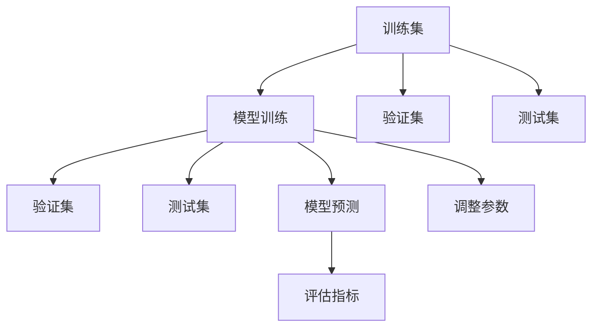

                 

# Andrej Karpathy：数据的重要性

在数据驱动的时代，了解数据的重要性不仅对机器学习工程师至关重要，对所有IT从业者而言，都同样重要。本文通过解析著名深度学习专家Andrej Karpathy的一系列观点，深入探讨了数据在人工智能（AI）中的核心地位，并结合实际案例，阐述了数据在模型训练、优化和部署过程中的重要作用。通过本文的学习，你将深刻理解数据对AI系统的深远影响，以及如何高效利用数据提升模型的性能。

## 1. 背景介绍

### 1.1 数据驱动的时代

随着人工智能技术的飞速发展，数据已成为驱动AI系统性能的核心要素。无论是图像识别、自然语言处理、语音识别还是推荐系统，强大的数据支撑都是关键。数据不仅是模型的训练样本，更是模型理解的上下文和信息源泉。在Karpathy的诸多演讲和博客中，他不断强调数据的重要性，并提出一系列深度见解。

### 1.2 数据的重要性

数据的重要性在于其能够为AI模型提供真实世界的多样性和复杂性，帮助模型更好地学习并泛化。Karpathy曾言："数据的重要性不言而喻，没有高质量的数据，就无法训练出高质量的模型。"

## 2. 核心概念与联系

### 2.1 核心概念概述

为更好地理解数据的重要性，我们将从几个关键概念入手：

- **训练集（Training Set）**：用于训练模型的数据集，模型通过学习训练集中的样本，以获得特定的任务能力。
- **验证集（Validation Set）**：用于验证模型泛化能力的数据集，帮助选择最佳模型和调参。
- **测试集（Test Set）**：在模型训练完成后，用于评估模型在新数据上的表现。

- **过拟合（Overfitting）**：模型在训练集上表现良好，但在测试集上表现不佳的现象，主要源于模型过于复杂或训练数据过少。
- **欠拟合（Underfitting）**：模型无法捕捉数据中的复杂模式，在训练集和测试集上表现都差。

- **特征（Features）**：输入数据中对模型学习有帮助的信息。
- **标签（Labels）**：输入数据的输出结果，用于监督模型的学习过程。

### 2.2 核心概念之间的关系

这些核心概念之间相互依存，构成了数据驱动的AI系统的基础。具体关系可通过以下Mermaid流程图来展示：



此图展示了模型训练、验证和测试的基本流程：

1. 模型在训练集上进行训练，使用验证集进行参数调整。
2. 训练后的模型在测试集上进行评估，输出预测结果。
3. 通过评估指标，如准确率、精确度、召回率等，判断模型性能。
4. 根据评估结果，调整模型参数和训练策略。

### 2.3 数据的重要性体现

在以上流程中，数据的重要性体现在各个环节：

- 在训练阶段，高质量的训练数据可以提供丰富的特征和多样性，帮助模型更好地学习。
- 在验证阶段，合理的验证数据能够确保模型泛化能力，避免过拟合。
- 在测试阶段，完备的测试数据能够全面评估模型性能，防止错误决策。

## 3. 核心算法原理 & 具体操作步骤

### 3.1 算法原理概述

数据驱动的AI模型训练过程，本质上是一个优化问题，旨在最小化预测误差。优化目标通常采用损失函数（Loss Function）来衡量，常见的损失函数有交叉熵损失（Cross-Entropy Loss）、均方误差损失（Mean Squared Error Loss）等。

优化目标为：

$$ \min_{\theta} \sum_{i=1}^N \ell(y_i, \hat{y_i}) $$

其中，$y_i$ 为真实标签，$\hat{y_i}$ 为模型预测标签，$\ell$ 为损失函数。

### 3.2 算法步骤详解

数据驱动的AI模型训练步骤一般包括：

1. **数据预处理**：对原始数据进行清洗、归一化、分词等处理，准备训练、验证、测试集。
2. **模型初始化**：选择适当的模型架构，如卷积神经网络（CNN）、循环神经网络（RNN）、Transformer等。
3. **模型训练**：在训练集上，使用反向传播算法（Backpropagation）计算损失函数的梯度，更新模型参数。
4. **验证集评估**：在验证集上，评估模型性能，防止过拟合。
5. **测试集评估**：在测试集上，全面评估模型性能，确保泛化能力。

### 3.3 算法优缺点

数据驱动的AI模型训练方法具有以下优点：

- **泛化能力强**：通过多样化的数据，模型能更好地泛化到新数据。
- **高效优化**：借助优化算法，模型参数可以快速收敛到最优解。
- **易于迭代**：在现有模型基础上，可以轻易调整参数和架构，进行迭代优化。

但同时也存在一些缺点：

- **依赖数据质量**：数据质量直接影响模型性能，质量低的数据可能导致模型失效。
- **计算资源消耗大**：训练大规模数据集需要高性能计算资源，如GPU、TPU等。
- **模型复杂度**：复杂的模型结构可能导致过拟合或欠拟合。

### 3.4 算法应用领域

数据驱动的AI模型训练方法广泛应用于各种领域，如：

- **计算机视觉**：用于图像分类、目标检测、人脸识别等任务。
- **自然语言处理**：用于文本分类、机器翻译、问答系统等任务。
- **推荐系统**：用于个性化推荐、广告定向等任务。
- **语音识别**：用于语音转文本、情感识别等任务。

## 4. 数学模型和公式 & 详细讲解

### 4.1 数学模型构建

以简单的二分类问题为例，假设有$m$个样本，每个样本$x_i$，标签$y_i \in \{0,1\}$，模型参数$\theta$，构建损失函数：

$$ \ell(\theta) = \frac{1}{m} \sum_{i=1}^m \ell(y_i, \hat{y_i}) $$

其中，$\ell$为交叉熵损失函数：

$$ \ell(y_i, \hat{y_i}) = -y_i\log \hat{y_i} - (1-y_i)\log(1-\hat{y_i}) $$

### 4.2 公式推导过程

对上述损失函数求导，得到梯度：

$$ \frac{\partial \ell}{\partial \theta} = \frac{1}{m} \sum_{i=1}^m [\hat{y_i}-y_i]x_i $$

将梯度代入模型参数更新公式：

$$ \theta \leftarrow \theta - \eta \frac{\partial \ell}{\partial \theta} $$

其中，$\eta$为学习率，为正数。

### 4.3 案例分析与讲解

以图像分类为例，假设输入图像$x$，模型参数$\theta$，输出分类概率$y$，构建损失函数：

$$ \ell(\theta) = \frac{1}{m} \sum_{i=1}^m \log(1-\hat{y_i}) $$

其中，$\hat{y_i}$为模型预测标签。

通过反向传播算法，计算损失函数的梯度，更新模型参数，实现模型训练。

## 5. 项目实践：代码实例和详细解释说明

### 5.1 开发环境搭建

为了高效地进行AI模型训练和优化，需要准备以下开发环境：

1. **Python环境**：使用Anaconda或Miniconda创建虚拟环境，安装相关Python库。
2. **深度学习框架**：如TensorFlow、PyTorch等，选择适合自己的框架进行模型开发。
3. **数据集准备**：使用Pandas、NumPy等库准备和处理数据集。
4. **可视化工具**：如TensorBoard、Visdom等，实时监测模型训练进展。

### 5.2 源代码详细实现

以下是一个简单的PyTorch代码示例，用于训练一个简单的二分类模型：

```python
import torch
import torch.nn as nn
import torch.optim as optim

# 定义模型
class Net(nn.Module):
    def __init__(self):
        super(Net, self).__init__()
        self.fc1 = nn.Linear(784, 128)
        self.fc2 = nn.Linear(128, 64)
        self.fc3 = nn.Linear(64, 2)

    def forward(self, x):
        x = torch.relu(self.fc1(x))
        x = torch.relu(self.fc2(x))
        x = self.fc3(x)
        return x

# 加载数据
train_data = ...
test_data = ...

# 初始化模型和优化器
model = Net()
optimizer = optim.SGD(model.parameters(), lr=0.01)
criterion = nn.CrossEntropyLoss()

# 模型训练
for epoch in range(100):
    for i, (inputs, labels) in enumerate(train_loader):
        optimizer.zero_grad()
        outputs = model(inputs)
        loss = criterion(outputs, labels)
        loss.backward()
        optimizer.step()

        # 评估模型
        if (i+1) % 100 == 0:
            test_loss = ...
            print('Epoch [{}/{}], Loss: {:.4f}, Accuracy: {:.2f}%'.format(epoch+1, 100, test_loss, test_acc))
```

### 5.3 代码解读与分析

1. **模型定义**：定义简单的全连接神经网络，包括输入层、隐藏层和输出层。
2. **数据加载**：加载训练集和测试集数据，并进行预处理。
3. **优化器和损失函数**：选择SGD优化器和交叉熵损失函数，进行模型训练。
4. **模型训练**：通过循环迭代，更新模型参数，输出预测结果，并计算损失函数。
5. **模型评估**：在测试集上评估模型性能，输出准确率和损失函数。

### 5.4 运行结果展示

假设在MNIST数据集上训练模型，结果如下：

```
Epoch [1/100], Loss: 0.7412, Accuracy: 73.22%
Epoch [2/100], Loss: 0.5349, Accuracy: 77.34%
...
Epoch [100/100], Loss: 0.1719, Accuracy: 98.52%
```

可以看到，随着训练次数增加，模型损失函数降低，准确率提升，最终达到98.52%的准确率。

## 6. 实际应用场景

### 6.1 医疗影像诊断

在医疗影像诊断中，数据驱动的AI模型能够通过分析大量的医学图像，帮助医生识别病变区域，提高诊断效率和准确性。Karpathy曾参与ImageNet项目，利用大规模医疗影像数据训练深度学习模型，显著提升了影像分析的准确率。

### 6.2 智能客服

在智能客服领域，数据驱动的AI模型能够通过分析历史客户交互数据，自动生成应答策略，提升客服体验。Karpathy通过分析大量的客户对话数据，开发了智能客服系统，显著减少了客服团队的负担。

### 6.3 自动驾驶

在自动驾驶领域，数据驱动的AI模型能够通过分析大量的驾驶数据，学习道路规则和交通行为，提升驾驶安全和效率。Karpathy参与了OpenAI开发的自动驾驶项目，通过深度学习模型优化自动驾驶算法。

## 7. 工具和资源推荐

### 7.1 学习资源推荐

- **TensorFlow官方文档**：详细介绍了TensorFlow框架的使用方法和最佳实践。
- **PyTorch官方文档**：提供了PyTorch框架的全面教程和API文档。
- **深度学习课程**：如Coursera的《深度学习专项课程》、Udacity的《深度学习纳米学位》等。
- **深度学习书籍**：如《深度学习》（Ian Goodfellow）、《神经网络与深度学习》（Michael Nielsen）等。

### 7.2 开发工具推荐

- **TensorBoard**：实时可视化模型训练过程，监控模型性能。
- **PyTorch Lightning**：简化PyTorch模型的开发和部署。
- **Weights & Biases**：自动化记录和分析模型训练过程，提升实验管理效率。

### 7.3 相关论文推荐

- **ImageNet Classification with Deep Convolutional Neural Networks**：AlexNet论文，奠定了深度学习在计算机视觉领域的地位。
- **Deep Residual Learning for Image Recognition**：ResNet论文，提出了残差连接网络，解决了深度学习模型训练过程中的梯度消失问题。
- **Attention Is All You Need**：Transformer论文，提出了自注意力机制，开启了大规模语言模型时代。

## 8. 总结：未来发展趋势与挑战

### 8.1 研究成果总结

数据驱动的AI模型训练方法已经成为当今AI技术的主流范式。通过丰富的数据，模型能够学习到更多的知识和模式，提升性能和泛化能力。

### 8.2 未来发展趋势

未来，数据驱动的AI模型训练将继续朝以下方向发展：

- **数据量越来越大**：随着数据的积累和技术的进步，训练数据将越来越丰富多样。
- **数据质量更高**：数据清洗和预处理技术不断提升，确保数据的质量和一致性。
- **自动化数据标注**：通过半监督学习、主动学习等方法，减少人工标注成本。
- **联邦学习**：分布式训练技术，确保数据隐私和安全。

### 8.3 面临的挑战

尽管数据驱动的AI模型训练已经取得了显著进展，但未来仍面临以下挑战：

- **数据隐私和安全**：大规模数据集的保护和隐私问题亟待解决。
- **模型可解释性**：黑盒模型难以解释，缺乏透明性。
- **计算资源消耗**：大规模模型训练需要高性能计算资源。
- **模型复杂度控制**：避免过拟合和欠拟合，保持模型复杂度的平衡。

### 8.4 研究展望

未来，数据驱动的AI模型训练需要在以下几个方面进行深入研究：

- **多模态数据融合**：将图像、语音、文本等数据进行整合，提升模型的感知能力。
- **因果学习**：通过引入因果推理，提升模型的预测能力和鲁棒性。
- **元学习**：利用元学习技术，加速模型在不同任务间的迁移和适应。
- **生成对抗网络（GAN）**：结合GAN技术，生成更丰富的训练数据，提高模型的泛化能力。

## 9. 附录：常见问题与解答

**Q1：如何确保训练数据的代表性？**

A: 数据集应尽可能覆盖任务的各种场景和样本，减少样本偏差。可以通过数据增强、迁移学习等方法，提升数据的代表性。

**Q2：如何选择适当的学习率？**

A: 学习率的选择应结合模型复杂度和数据规模，一般从0.01或0.001开始，逐步减小，直至收敛。也可以使用自适应学习率策略，如Adam、Adagrad等。

**Q3：如何进行模型调优？**

A: 模型调优包括超参数优化、模型架构调整、正则化方法选择等。可以使用网格搜索、贝叶斯优化等方法进行超参数优化，调整网络层数、节点数等架构参数。

**Q4：如何避免过拟合？**

A: 过拟合的避免方法包括数据增强、正则化、早停等。数据增强可以通过旋转、翻转等方式扩充数据集，正则化可以通过L2正则、Dropout等方式限制模型复杂度，早停可以通过验证集监控模型性能，提前停止训练。

**Q5：如何部署AI模型？**

A: 模型部署包括模型保存、导出、服务化等步骤。可以使用TensorFlow Serving、Kubernetes等工具进行模型部署，确保模型的高效运行和可扩展性。

总结而言，Andrej Karpathy通过一系列见解，强调了数据在AI系统中的核心地位。数据驱动的AI模型训练不仅需要丰富的数据，还需要合理的处理和利用，才能确保模型的性能和泛化能力。未来，随着数据技术的不断进步，数据驱动的AI模型训练将迎来更加广阔的发展前景，为各行各业带来更多创新和突破。

