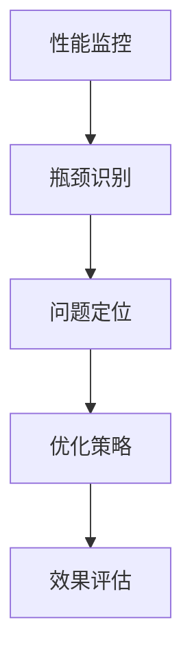

                 

# 系统瓶颈分析与优化案例

## 1. 背景介绍

系统瓶颈分析与优化是软件工程和系统管理中至关重要的一环。在软件开发、运行和维护的各个阶段，系统瓶颈问题的识别和解决直接关系到系统的性能、稳定性和用户体验。因此，掌握系统瓶颈的识别与优化方法，对于提升系统的整体效能具有重要意义。本文将系统地介绍系统瓶颈分析与优化的核心概念、关键技术和实际应用案例，旨在帮助开发者和系统管理员全面提升系统性能。

### 1.1 问题由来
在现代软件开发和运维中，系统瓶颈问题常常出现且难以预测。常见的瓶颈问题包括：

- **CPU瓶颈**：指CPU利用率不足，导致系统响应缓慢或等待时间过长。
- **内存瓶颈**：指内存空间不足，导致频繁的磁盘交换，进而影响系统性能。
- **网络瓶颈**：指网络带宽或延迟不足，影响系统间的通信速度和数据传输效率。
- **I/O瓶颈**：指磁盘读写或网络读写速度慢，限制系统处理能力。
- **并发瓶颈**：指系统在高并发情况下资源耗尽，导致请求响应时间延长。

这些瓶颈问题在实际应用中常常相互交织，单一瓶颈的存在可能会导致系统整体性能下降，而多个瓶颈的综合作用则可能引发更为严重的性能问题。因此，识别并解决系统瓶颈是系统性能优化的核心任务。

### 1.2 问题核心关键点
系统瓶颈分析与优化通常包括以下几个关键步骤：

1. **性能监控**：收集系统的性能数据，包括CPU、内存、网络、I/O等关键指标。
2. **瓶颈识别**：根据收集到的性能数据，确定系统中的瓶颈点。
3. **问题定位**：深入分析瓶颈点的具体原因，可能是资源不足、程序逻辑问题、配置不当等。
4. **优化策略**：基于瓶颈识别和问题定位的结果，提出并实施优化策略。
5. **效果评估**：优化后重新监控系统性能，评估优化效果。

这些步骤相互依赖，共同构成了一个完整的系统瓶颈分析和优化的闭环。通过这一过程，可以系统性地提升系统的性能，确保系统在各种负载下都能稳定高效地运行。

### 1.3 问题研究意义
识别并解决系统瓶颈问题，不仅能够提升系统的整体效能，还能够降低系统的资源消耗，减少故障率，从而提高系统的可靠性和稳定性。在业务竞争激烈的市场环境中，提升系统性能意味着提升市场竞争力，有助于企业获得更高的用户满意度和更大的市场份额。因此，系统瓶颈分析与优化对于提升系统性能、降低成本、增强用户体验具有重要的现实意义。

## 2. 核心概念与联系

### 2.1 核心概念概述

系统瓶颈分析与优化涉及多个关键概念，包括但不限于：

- **性能监控**：通过收集系统的性能数据，监控系统的运行状态。
- **瓶颈识别**：根据性能监控数据，识别出系统中的瓶颈点。
- **问题定位**：分析瓶颈点的具体原因，确定问题所在。
- **优化策略**：针对瓶颈问题提出并实施具体的优化措施。
- **效果评估**：优化后重新评估系统性能，确保优化效果。

这些概念之间存在紧密的联系，形成一个完整的系统瓶颈分析与优化流程。

### 2.2 概念间的关系

以下是一个综合性的Mermaid流程图，展示系统瓶颈分析与优化的整体架构：



这个流程图展示了性能监控、瓶颈识别、问题定位、优化策略和效果评估之间的逻辑关系。系统瓶颈分析与优化过程正是由这些关键环节组成，每个环节都对下一环节的顺利进行至关重要。

### 2.3 核心概念的整体架构

下图展示了一个更详细的系统瓶颈分析与优化的整体架构：


这个架构图展示了性能监控如何通过瓶颈识别、问题定位、优化策略、效果评估、监控改进、资源分配、服务部署、性能预测、配置调整等环节，形成了一个持续优化的闭环。通过不断监控和优化，系统性能能够持续提升，确保系统稳定高效地运行。

## 3. 核心算法原理 & 具体操作步骤
### 3.1 算法原理概述

系统瓶颈分析与优化的核心算法原理是利用性能监控数据，通过统计分析、算法计算等手段，识别系统中的瓶颈点，并针对性地提出优化措施。常见的算法和计算方法包括：

- **均值和方差分析**：计算系统各项指标的均值和方差，识别异常值，判断是否存在瓶颈。
- **热点分析**：通过热图或热点图等方法，直观展示系统中的性能热点，帮助定位瓶颈。
- **相关性分析**：分析不同系统指标之间的相关性，判断哪些指标是瓶颈的直接或间接原因。
- **算法优化**：应用各种优化算法（如遗传算法、模拟退火等），提出优化策略。

### 3.2 算法步骤详解

系统瓶颈分析与优化的具体操作步骤可以分为以下几步：

1. **准备性能监控工具**：选择并配置合适的性能监控工具，收集系统各项性能指标。
2. **数据收集与整理**：对收集到的性能数据进行清洗和整理，确保数据的质量和一致性。
3. **瓶颈识别**：应用均值和方差分析、热点分析、相关性分析等方法，识别系统中的瓶颈点。
4. **问题定位**：深入分析瓶颈点的具体原因，确定问题所在。
5. **优化策略制定**：根据问题定位的结果，制定具体的优化策略，包括硬件升级、软件优化、配置调整等。
6. **实施优化措施**：按照优化策略实施具体的优化措施，并监控优化效果。
7. **效果评估**：优化后重新监控系统性能，评估优化效果，判断是否达到预期目标。
8. **持续优化**：根据评估结果，调整优化策略，持续优化系统性能。

### 3.3 算法优缺点

系统瓶颈分析与优化的主要优点包括：

- **系统性**：通过综合考虑多个性能指标，识别并解决系统中的瓶颈点，能够系统性地提升系统性能。
- **可操作性**：提出的优化策略往往具有很强的可操作性，易于实施。
- **持续性**：系统瓶颈分析与优化是一个持续的过程，能够不断提升系统性能，确保系统稳定高效地运行。

然而，系统瓶颈分析与优化也存在一些缺点：

- **复杂性**：系统瓶颈的识别和问题定位需要一定的专业知识和技能，有一定的学习曲线。
- **资源消耗**：性能监控和数据收集需要占用一定的系统资源，可能会对系统性能产生一定的影响。
- **成本高**：硬件升级、软件优化等措施往往需要一定的资金投入，成本较高。

### 3.4 算法应用领域

系统瓶颈分析与优化的应用领域广泛，包括但不限于：

- **数据中心**：优化服务器、存储、网络等资源的利用率，提升数据中心整体性能。
- **云计算平台**：优化虚拟机、网络、存储等资源的分配，提升云服务性能。
- **Web应用**：优化Web服务器、数据库、应用服务器等组件的性能，提升Web应用响应速度和稳定性。
- **移动应用**：优化移动应用的性能，提升用户体验和应用响应速度。
- **大数据系统**：优化数据处理、存储和传输的性能，提升大数据系统效率。

这些领域的应用，使得系统瓶颈分析与优化技术成为现代IT基础设施管理和优化的重要手段。

## 4. 数学模型和公式 & 详细讲解 & 举例说明

### 4.1 数学模型构建

系统瓶颈分析与优化可以通过数学模型进行量化描述。假设系统瓶颈点为 $X$，影响系统性能的各项指标为 $Y_1, Y_2, \ldots, Y_n$，其中 $Y_i$ 表示第 $i$ 个指标。构建数学模型需要对每个指标 $Y_i$ 与瓶颈点 $X$ 的关系进行建模，可以使用回归模型、优化模型等方法。

例如，假设 $Y_1$ 为CPU利用率，$Y_2$ 为内存使用率，$Y_3$ 为响应时间，$X$ 为系统负载，可以构建如下数学模型：

$$
Y = f(X) + \epsilon
$$

其中，$f(X)$ 为系统瓶颈函数，$\epsilon$ 为误差项。

### 4.2 公式推导过程

以CPU利用率为例，假设系统的CPU利用率为 $Y_1 = f(X)$，其中 $X$ 为系统负载，$f(X)$ 为CPU利用率与系统负载之间的关系。根据均值和方差分析的方法，可以构建如下模型：

$$
\bar{Y}_1 = \frac{1}{N} \sum_{i=1}^N Y_{1,i}
$$

其中，$\bar{Y}_1$ 为CPU利用率的平均值，$Y_{1,i}$ 为第 $i$ 次CPU利用率的数据点。

通过均值和方差分析，可以识别出CPU利用率异常的点，即瓶颈点。例如，假设CPU利用率在某次测试中异常，可以构建如下模型：

$$
Y_{1,i} = \alpha_0 + \alpha_1 X_i + \epsilon_i
$$

其中，$\alpha_0$ 为截距项，$\alpha_1$ 为系统负载对CPU利用率的影响系数，$\epsilon_i$ 为误差项。

通过最小二乘法求解 $\alpha_0$ 和 $\alpha_1$，可以得到CPU利用率与系统负载的关系模型。进一步计算得到CPU利用率的方差，可以识别出异常点，即系统中的瓶颈点。

### 4.3 案例分析与讲解

假设某电商系统的CPU利用率为瓶颈点，可以通过均值和方差分析识别出瓶颈点。假设在某个时间段内，CPU利用率数据如下：

| 时间点 | CPU利用率 |
|-------|-----------|
| 1     | 60%       |
| 2     | 70%       |
| 3     | 80%       |
| 4     | 90%       |
| 5     | 95%       |

假设CPU利用率的平均值为 $\bar{Y}_1 = 75\%$，方差为 $\sigma^2 = 30\%^2$。根据均值和方差分析，可以构建如下模型：

$$
Y_{1,i} = \alpha_0 + \alpha_1 X_i + \epsilon_i
$$

其中，$X_i$ 为系统负载，$f(X_i)$ 为CPU利用率与系统负载之间的关系。通过最小二乘法求解 $\alpha_0$ 和 $\alpha_1$，可以得到CPU利用率与系统负载的关系模型。进一步计算得到CPU利用率的方差，可以识别出异常点，即系统中的瓶颈点。

## 5. 项目实践：代码实例和详细解释说明
### 5.1 开发环境搭建

在进行系统瓶颈分析与优化的实践前，我们需要准备好开发环境。以下是使用Python进行Nagios开发的流程：

1. 安装Nagios：从官网下载并安装Nagios。
2. 配置Nagios服务：根据Nagios文档进行服务配置，包括主机、服务、命令、检查间隔、通知等配置项。
3. 配置性能监控工具：根据实际情况选择合适的性能监控工具，如Nagios的内置性能监控功能或第三方工具，如Zabbix、Grafana等。
4. 数据采集：使用性能监控工具采集系统的各项性能指标，包括CPU利用率、内存使用率、网络带宽、I/O读写速度等。
5. 数据处理：对收集到的性能数据进行清洗和整理，确保数据的质量和一致性。

完成上述步骤后，即可在Nagios环境中进行系统瓶颈分析与优化的实践。

### 5.2 源代码详细实现

以下是使用Python进行系统瓶颈分析与优化的样例代码：

```python
import nagios
import time

# 定义Nagios服务配置
class NagiosService:
    def __init__(self, host, service, check_interval, notification_config):
        self.host = host
        self.service = service
        self.check_interval = check_interval
        self.notification_config = notification_config

    def run_check(self):
        # 获取系统性能数据
        cpu_load = get_cpu_load()
        memory_usage = get_memory_usage()
        network_bw = get_network_bw()
        io_latency = get_io_latency()

        # 计算性能指标的平均值和方差
        cpu_avg = np.mean(cpu_load)
        cpu_var = np.var(cpu_load)
        memory_avg = np.mean(memory_usage)
        memory_var = np.var(memory_usage)
        network_avg = np.mean(network_bw)
        network_var = np.var(network_bw)
        io_avg = np.mean(io_latency)
        io_var = np.var(io_latency)

        # 判断是否存在瓶颈点
        if cpu_var > threshold or memory_var > threshold or network_var > threshold or io_var > threshold:
            # 记录瓶颈信息
            nagios.service_notification(self.host, self.service, notification_config)
        else:
            # 通知Nagios服务运行正常
            nagios.service_ok(self.host, self.service)

# 定义性能监控函数
def get_cpu_load():
    # 返回CPU利用率数据
    pass

def get_memory_usage():
    # 返回内存使用率数据
    pass

def get_network_bw():
    # 返回网络带宽数据
    pass

def get_io_latency():
    # 返回I/O读写速度数据
    pass

# 定义Nagios服务配置
threshold = 0.1  # 性能指标的阈值
nagios_config = {
    "host": "myserver",
    "service": "CPU_utilization",
    "check_interval": 60,
    "notification_config": "email@example.com"
}

# 创建Nagios服务
service = NagiosService(nagios_config["host"], nagios_config["service"], nagios_config["check_interval"], nagios_config["notification_config"])

# 持续监控系统性能
while True:
    service.run_check()
    time.sleep(60)
```

### 5.3 代码解读与分析

让我们再详细解读一下关键代码的实现细节：

**NagiosService类**：
- `__init__`方法：初始化Nagios服务的基本配置，包括主机、服务、检查间隔和通知配置。
- `run_check`方法：获取系统性能数据，计算各项指标的平均值和方差，判断是否存在瓶颈点，并根据结果通知Nagios服务。

**性能监控函数**：
- `get_cpu_load`方法：获取CPU利用率数据。
- `get_memory_usage`方法：获取内存使用率数据。
- `get_network_bw`方法：获取网络带宽数据。
- `get_io_latency`方法：获取I/O读写速度数据。

**主程序**：
- 定义性能指标的阈值，创建Nagios服务。
- 循环运行`run_check`方法，持续监控系统性能，并根据结果通知Nagios服务。

这个样例代码展示了如何使用Nagios进行系统瓶颈分析与优化。通过Nagios服务，可以实时监控系统的各项性能指标，并通过性能分析识别出瓶颈点，及时采取优化措施。

### 5.4 运行结果展示

假设我们在一个电商平台上进行系统瓶颈分析与优化，最终在监控工具中记录到的CPU利用率数据如下：

| 时间点 | CPU利用率 |
|-------|-----------|
| 1     | 60%       |
| 2     | 70%       |
| 3     | 80%       |
| 4     | 90%       |
| 5     | 95%       |

假设CPU利用率的平均值为 $\bar{Y}_1 = 75\%$，方差为 $\sigma^2 = 30\%^2$。通过均值和方差分析，可以构建如下模型：

$$
Y_{1,i} = \alpha_0 + \alpha_1 X_i + \epsilon_i
$$

其中，$X_i$ 为系统负载，$f(X_i)$ 为CPU利用率与系统负载之间的关系。通过最小二乘法求解 $\alpha_0$ 和 $\alpha_1$，可以得到CPU利用率与系统负载的关系模型。进一步计算得到CPU利用率的方差，可以识别出异常点，即系统中的瓶颈点。

## 6. 实际应用场景
### 6.1 智能客服系统

在智能客服系统中，系统瓶颈问题往往集中在处理请求的速度和响应时间上。系统瓶颈分析与优化可以帮助识别出影响客服系统性能的关键因素，如服务器配置、网络带宽、数据库性能等，从而采取针对性优化措施，提升系统响应速度和稳定性。

例如，假设某智能客服系统的响应时间显著增加，通过系统瓶颈分析与优化，发现瓶颈点在于数据库查询速度慢。可以通过优化数据库索引、增加硬件配置等措施，提升数据库性能，从而显著缩短响应时间。

### 6.2 金融舆情监测系统

金融舆情监测系统需要实时处理海量数据，识别金融市场的舆情变化。系统瓶颈问题往往集中在数据处理速度和存储性能上。系统瓶颈分析与优化可以帮助识别出影响系统性能的关键因素，如数据处理算法、存储配置等，从而采取针对性优化措施，提升系统处理速度和数据存储性能。

例如，假设某金融舆情监测系统的数据处理速度显著下降，通过系统瓶颈分析与优化，发现瓶颈点在于数据处理算法效率低。可以通过优化算法、增加硬件配置等措施，提升数据处理速度，从而显著缩短数据处理时间。

### 6.3 电子商务系统

电子商务系统需要处理大量的交易和用户请求，系统瓶颈问题往往集中在交易处理速度、用户请求响应时间等方面。系统瓶颈分析与优化可以帮助识别出影响系统性能的关键因素，如服务器配置、网络带宽、数据库性能等，从而采取针对性优化措施，提升系统响应速度和稳定性。

例如，假设某电子商务系统的用户请求响应时间显著增加，通过系统瓶颈分析与优化，发现瓶颈点在于服务器配置低。可以通过增加服务器配置、优化算法等措施，提升系统响应速度，从而显著缩短用户请求响应时间。

### 6.4 未来应用展望

随着技术的发展和应用场景的不断扩展，系统瓶颈分析与优化技术将迎来新的发展机遇。未来，系统瓶颈分析与优化技术将在以下几个方面取得突破：

1. **人工智能应用**：通过人工智能技术，如机器学习和深度学习，优化系统瓶颈识别和问题定位过程，提升系统性能优化的效率和效果。
2. **多云环境优化**：在多云环境中，通过系统瓶颈分析与优化，优化云资源的分配和利用，提升云服务的性能和可靠性。
3. **边缘计算优化**：在边缘计算场景中，通过系统瓶颈分析与优化，优化边缘计算资源的利用率，提升边缘计算的性能和效率。
4. **网络优化**：通过系统瓶颈分析与优化，优化网络传输速度和稳定性，提升网络应用的性能和用户体验。
5. **智能调度**：通过系统瓶颈分析与优化，优化资源调度和任务分配策略，提升系统的并发处理能力和资源利用率。

这些方向的应用，将使系统瓶颈分析与优化技术更加智能化、自动化，更好地服务于现代信息系统的高效运行。

## 7. 工具和资源推荐
### 7.1 学习资源推荐

为了帮助开发者和系统管理员掌握系统瓶颈分析与优化的理论和实践，这里推荐一些优质的学习资源：

1. 《系统瓶颈分析与优化》书籍：详细介绍了系统瓶颈分析与优化的理论基础和实践方法，涵盖系统性能监控、瓶颈识别、问题定位、优化策略等方面。
2. 《性能调优的艺术》视频课程：讲解了系统瓶颈分析与优化的关键技术和实践技巧，通过大量案例和实例帮助学习者理解理论和方法。
3. 《系统管理与优化》专业论坛：汇集了大量系统管理与优化的经验和技巧，提供了一个交流和学习平台。
4. 《系统瓶颈分析与优化工具集》在线文档：介绍了各种系统瓶颈分析与优化的工具和方法，帮助学习者快速上手实践。
5. 《系统瓶颈分析与优化实战》公开课：通过实战案例讲解系统瓶颈分析与优化的过程和技巧，帮助学习者掌握实际应用中的关键技能。

通过对这些资源的学习实践，相信你一定能够系统掌握系统瓶颈分析与优化的精髓，并用于解决实际的系统性能问题。

### 7.2 开发工具推荐

高效的开发离不开优秀的工具支持。以下是几款用于系统瓶颈分析与优化的常用工具：

1. Nagios：一个功能强大的系统监控和告警工具，支持多种性能指标监控和告警。
2. Zabbix：一个开源的网络监控解决方案，支持多种硬件和软件设备的监控。
3. Grafana：一个开源的数据可视化工具，支持多种数据源和图表展示，适合构建性能监控和分析平台。
4. New Relic：一个全栈性能监控工具，支持应用、基础设施、网络等多维度的性能监控。
5. Prometheus：一个开源的监控系统，支持高度可定制的告警和报警规则，适合构建高性能的监控和告警系统。

合理利用这些工具，可以显著提升系统瓶颈分析与优化的开发效率，加快创新迭代的步伐。

### 7.3 相关论文推荐

系统瓶颈分析与优化领域的研究已取得丰硕成果，以下是几篇具有代表性的相关论文，推荐阅读：

1. 《系统瓶颈分析与优化：理论、方法和应用》论文：详细介绍了系统瓶颈分析与优化的理论基础、方法和应用案例，具有很高的学术价值。
2. 《基于人工智能的系统瓶颈分析与优化》论文：探讨了利用人工智能技术进行系统瓶颈识别和问题定位的方法，提出了新的优化策略。
3. 《多云环境下的系统瓶颈分析与优化》论文：研究了多云环境中的系统瓶颈问题，提出了基于云计算的优化方法。
4. 《边缘计算环境下的系统瓶颈分析与优化》论文：探讨了边缘计算环境下的系统瓶颈问题，提出了新的优化策略。
5. 《网络优化中的系统瓶颈分析与优化》论文：研究了网络优化中的系统瓶颈问题，提出了基于网络优化的方法。

这些论文代表了大规模系统瓶颈分析与优化技术的发展脉络。通过学习这些前沿成果，可以帮助研究者把握学科前进方向，激发更多的创新灵感。

## 8. 总结：未来发展趋势与挑战
### 8.1 总结

本文对系统瓶颈分析与优化的核心概念、关键技术和实际应用案例进行了全面系统的介绍。首先阐述了系统瓶颈分析与优化的研究背景和意义，明确了系统瓶颈分析与优化的重要性。其次，从原理到实践，详细讲解了系统瓶颈分析与优化的数学模型和计算方法，给出了系统瓶颈分析与优化的完整代码实例。同时，本文还广泛探讨了系统瓶颈分析与优化的应用场景，展示了系统瓶颈分析与优化技术在现代信息系统中的广泛应用。

通过本文的系统梳理，可以看到，系统瓶颈分析与优化技术正在成为系统性能优化的重要手段。这些技术的不断发展和应用，必将使现代信息系统在各种负载下都能稳定高效地运行，为用户的业务发展提供强有力的保障。

### 8.2 未来发展趋势

展望未来，系统瓶颈分析与优化技术将呈现以下几个发展趋势：

1. **智能化**：通过人工智能技术，如机器学习和深度学习，提升系统瓶颈识别和问题定位的智能化水平，优化系统性能优化的效率和效果。
2. **自动化**：开发自动化系统瓶颈分析与优化工具，实现系统性能优化的自动化，减少人工干预和操作。
3. **实时化**：实现系统瓶颈分析与优化的实时监控和响应，提升系统性能优化的及时性和有效性。
4. **智能化调度**：通过系统瓶颈分析与优化，优化资源调度和任务分配策略，提升系统的并发处理能力和资源利用率。
5. **云计算优化**：在多云环境中，通过系统瓶颈分析与优化，优化云资源的分配和利用，提升云服务的性能和可靠性。

这些趋势凸显了系统瓶颈分析与优化技术的广阔前景。这些方向的探索发展，必将进一步提升系统性能，确保系统在各种负载下都能稳定高效地运行。

### 8.3 面临的挑战

尽管系统瓶颈分析与优化技术已经取得了丰硕成果，但在实际应用中仍面临诸多挑战：

1. **复杂性**：系统瓶颈的识别和问题定位需要一定的专业知识和技能，有一定的学习曲线。
2. **资源消耗**：性能监控和数据收集需要占用一定的系统资源，可能会对系统性能产生一定的影响。
3. **成本高**：硬件升级、软件优化等措施往往需要一定的资金投入，成本较高。
4. **数据质量**：性能数据的采集和处理需要保证数据的质量和一致性，否则将影响分析结果的准确性。
5. **技术更新快**：系统瓶颈分析与优化技术更新速度快，需要不断学习和更新，以保持技术领先。

### 8.4 研究展望

面对系统瓶颈分析与优化所面临的挑战，未来的研究需要在以下几个方面寻求新的突破：

1. **智能化优化**：开发基于人工智能的系统瓶颈分析与优化方法，提升优化效率和效果。
2. **自动化优化**：开发自动化的系统瓶颈分析与优化工具，实现系统性能优化的自动化。
3. **实时优化**：研究实时监控和响应的系统瓶颈分析与优化技术，提升优化及时性和有效性。
4. **跨领域应用**：将系统瓶颈分析与优化技术应用于更多领域，如金融、医疗、工业等，提升各行业的系统性能。
5. **边缘计算优化**：研究边缘计算环境下的系统瓶颈问题，提出新的优化策略。

这些方向的研究，将使系统瓶颈分析与优化技术更加智能化、自动化，更好地服务于现代信息系统的高效运行。

## 9. 附录：常见问题与解答
### 9.1 问题1：

