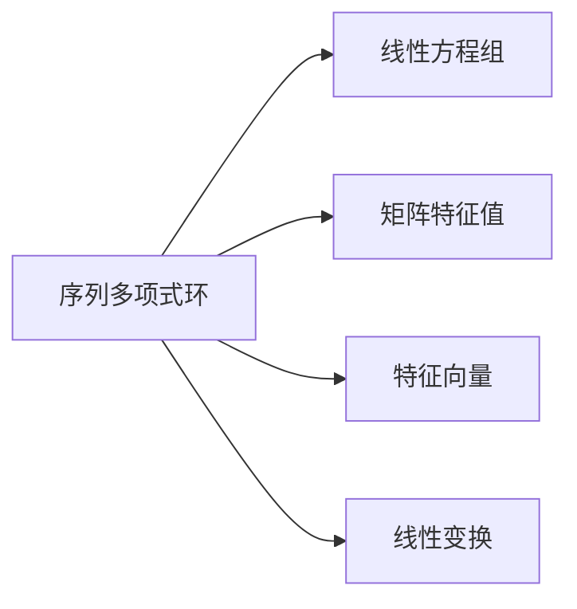

                 

# 线性代数导引：序列多项式环

> 关键词：线性代数,序列多项式,环论,代数结构,序列,多项式,矩阵,线性方程组,特征值,特征向量,线性变换

## 1. 背景介绍

### 1.1 问题由来

线性代数作为数学和计算机科学的重要分支，在数据科学、机器学习、计算几何、网络安全等领域中有着广泛应用。特别是在现代的深度学习和人工智能领域，线性代数基础知识的扎实与否，直接影响到模型的训练效果和稳定性。

而序列多项式环这一概念，虽然常被提及，但实际应用场景非常广泛。从多项式的求导与积分，到特征值的求解，再到线性方程组的解法，序列多项式环都是背后支撑的数学工具。因此，对其原理和应用有着深入理解和熟练掌握，对于从事机器学习和数据科学相关工作的工程师来说，是必不可少的。

### 1.2 问题核心关键点

本文将深入讲解序列多项式环的基本概念、核心算法以及应用场景。首先，我们定义什么是序列多项式环，并探讨其在求解线性方程组、矩阵特征值、特征向量以及线性变换中的作用。其次，我们将介绍序列多项式环的典型算法，包括矩阵对角化、特征值分解和QR分解，并对其原理进行详细阐述。最后，我们还将讨论序列多项式环的优缺点及其在实际应用中的适用性。

### 1.3 问题研究意义

理解序列多项式环及其算法，能够帮助研究者更好地进行矩阵和线性变换的分解与分析，从而为线性代数问题的求解提供理论基础。对于从事深度学习和机器学习的工程师来说，掌握这些知识，可以更好地设计和优化模型，提升模型性能。同时，了解序列多项式环的基本概念，有助于更好地理解现代深度学习模型的优化算法，例如基于梯度下降的优化器，如Adam、SGD等。

## 2. 核心概念与联系

### 2.1 核心概念概述

序列多项式环（Polynomial Ring Over a Sequence）是一种数学结构，由一组序列（Sequence）和对应的多项式（Polynomial）构成。这里的“序列”可以理解为一系列数列或向量，而“多项式”则是对应的数学表达式。

#### 2.1.1 序列

序列（Sequence）可以理解为一系列有序元素的集合，可以是数字、符号、向量等。例如，一个长度为n的向量序列为：
$$
a_1, a_2, \dots, a_n
$$
其中 $a_i$ 表示序列中的第i个元素。

#### 2.1.2 多项式

多项式（Polynomial）则是对应于序列的多项式表达式。例如，对于一个长度为n的序列 $a_1, a_2, \dots, a_n$，其对应的多项式为：
$$
a_1x^{n-1} + a_2x^{n-2} + \dots + a_{n-1}x + a_n
$$
其中 $x$ 为自变量，$a_i$ 为序列中的元素。

### 2.2 核心概念之间的关系

序列多项式环中的核心概念包括序列、多项式、以及对应的环结构。环（Ring）是一种代数结构，它允许进行加、减、乘、除等基本运算，满足某些特定的性质，如交换律、结合律等。

以序列 $a_1, a_2, \dots, a_n$ 为例，其对应的多项式为 $f(x) = a_1x^{n-1} + a_2x^{n-2} + \dots + a_{n-1}x + a_n$。在序列多项式环中，多项式 $f(x)$ 可以进行加、减、乘、除等运算，且满足交换律、结合律等性质。例如，两个多项式的和为：
$$
f_1(x) + f_2(x) = (a_1x^{n-1} + a_2x^{n-2} + \dots + a_{n-1}x + a_n) + (b_1x^{n-1} + b_2x^{n-2} + \dots + b_{n-1}x + b_n)
$$
化简后得到：
$$
(a_1 + b_1)x^{n-1} + (a_2 + b_2)x^{n-2} + \dots + (a_{n-1} + b_{n-1})x + (a_n + b_n)
$$

为了更好地理解序列多项式环的概念和性质，我们可以通过以下Mermaid流程图展示其在求解线性方程组、矩阵特征值、特征向量以及线性变换中的作用：



这个流程图展示了序列多项式环在求解线性方程组、矩阵特征值、特征向量以及线性变换中的作用。在每个节点，序列多项式环通过多项式表示和运算，提供了求解相应问题的基本框架。

## 3. 核心算法原理 & 具体操作步骤

### 3.1 算法原理概述

序列多项式环的核心算法包括矩阵对角化、特征值分解和QR分解。这些算法在求解线性方程组、矩阵特征值、特征向量以及线性变换时，起着关键作用。

矩阵对角化是将矩阵分解为对角矩阵的过程，而特征值分解和QR分解则是将矩阵分解为特征值、特征向量与正交矩阵的组合，从而得到矩阵的奇异值分解。

这些算法的共同点在于，它们都涉及到对多项式的求解和运算，通过多项式将线性代数问题转化为代数问题进行求解。

### 3.2 算法步骤详解

#### 3.2.1 矩阵对角化

矩阵对角化算法的基本步骤如下：

1. **计算矩阵的特征值**：
   - 首先，计算矩阵 $A$ 的特征值 $\lambda$。
   - 对于实矩阵 $A$，可以通过计算 $A$ 的特征值，得到对应的特征向量。

2. **构造特征矩阵**：
   - 构造对角矩阵 $D$，其对角线上的元素为矩阵 $A$ 的特征值 $\lambda$。
   - 构造特征矩阵 $P$，其每一列是一个特征向量。

3. **分解矩阵**：
   - 将矩阵 $A$ 分解为对角矩阵 $D$ 和特征矩阵 $P$ 的乘积。
   - 即 $A = PDP^{-1}$。

#### 3.2.2 特征值分解

特征值分解算法的基本步骤如下：

1. **计算特征值**：
   - 计算矩阵 $A$ 的特征值 $\lambda$。
   - 对于实矩阵 $A$，可以通过计算 $A$ 的特征值，得到对应的特征向量。

2. **构造特征矩阵**：
   - 构造对角矩阵 $D$，其对角线上的元素为矩阵 $A$ 的特征值 $\lambda$。
   - 构造特征矩阵 $P$，其每一列是一个特征向量。

3. **分解矩阵**：
   - 将矩阵 $A$ 分解为对角矩阵 $D$ 和特征矩阵 $P$ 的乘积。
   - 即 $A = PDP^{-1}$。

#### 3.2.3 QR分解

QR分解算法的基本步骤如下：

1. **计算矩阵的特征值**：
   - 首先，计算矩阵 $A$ 的特征值 $\lambda$。
   - 对于实矩阵 $A$，可以通过计算 $A$ 的特征值，得到对应的特征向量。

2. **构造矩阵 $R$**：
   - 构造上三角矩阵 $R$，其元素为矩阵 $A$ 的特征值。
   - 构造正交矩阵 $Q$，其每一列是一个特征向量。

3. **分解矩阵**：
   - 将矩阵 $A$ 分解为矩阵 $Q$ 和 $R$ 的乘积。
   - 即 $A = QR$。

### 3.3 算法优缺点

序列多项式环的核心算法包括矩阵对角化、特征值分解和QR分解，它们各有优缺点：

#### 3.3.1 矩阵对角化

**优点**：
- 矩阵对角化算法可以清晰地展示矩阵的特征结构。
- 对角矩阵具有直观的物理意义，有助于理解矩阵的性质。

**缺点**：
- 计算复杂度高，特别是在矩阵维度较大的情况下。
- 对矩阵的特征值和特征向量的计算要求较高，容易受到数值精度影响。

#### 3.3.2 特征值分解

**优点**：
- 特征值分解算法在矩阵分解和求解过程中，不需要额外的计算资源。
- 可以同时求解矩阵的特征值和特征向量，提供了矩阵的全局信息。

**缺点**：
- 对矩阵的特征值和特征向量的计算要求较高，容易受到数值精度影响。
- 计算过程复杂，特别是对大规模矩阵的分解，需要更高的计算能力和存储资源。

#### 3.3.3 QR分解

**优点**：
- QR分解算法计算复杂度较低，适用于大规模矩阵的分解。
- 正交矩阵具有易于计算和存储的特点。

**缺点**：
- 对于非正交矩阵，QR分解算法可能无法得到最优结果。
- 分解结果的精度取决于矩阵的初始化方式。

### 3.4 算法应用领域

序列多项式环的核心算法包括矩阵对角化、特征值分解和QR分解，这些算法在以下几个领域有着广泛应用：

#### 3.4.1 线性方程组求解

线性方程组求解是序列多项式环的一个重要应用场景。通过矩阵对角化或特征值分解，可以将线性方程组的求解问题转化为代数问题进行求解，从而降低计算复杂度。

#### 3.4.2 矩阵特征值求解

矩阵特征值求解是序列多项式环的另一个重要应用场景。通过特征值分解或QR分解，可以求解矩阵的特征值和特征向量，从而获得矩阵的奇异值分解，提供矩阵的全局信息。

#### 3.4.3 特征向量求解

特征向量求解是序列多项式环的核心应用之一。通过特征值分解或QR分解，可以求解矩阵的特征向量，从而进行矩阵的分解和重构。

#### 3.4.4 线性变换求解

线性变换求解是序列多项式环的重要应用领域。通过特征值分解或QR分解，可以求解线性变换的特征向量，从而进行矩阵的分解和重构。

## 4. 数学模型和公式 & 详细讲解 & 举例说明

### 4.1 数学模型构建

在序列多项式环中，我们可以使用多项式表示矩阵，并进行多项式运算。例如，对于一个 $n \times n$ 的矩阵 $A$，其对应的多项式为：
$$
A(x) = \sum_{i=0}^{n-1} a_i x^i
$$
其中 $a_i$ 为矩阵 $A$ 的元素，$x$ 为自变量。

### 4.2 公式推导过程

以矩阵对角化算法为例，其公式推导过程如下：

1. **特征值计算**：
   - 首先，计算矩阵 $A$ 的特征值 $\lambda$。
   - 对于实矩阵 $A$，可以通过计算 $A$ 的特征值，得到对应的特征向量。

2. **特征矩阵构造**：
   - 构造对角矩阵 $D$，其对角线上的元素为矩阵 $A$ 的特征值 $\lambda$。
   - 构造特征矩阵 $P$，其每一列是一个特征向量。

3. **矩阵分解**：
   - 将矩阵 $A$ 分解为对角矩阵 $D$ 和特征矩阵 $P$ 的乘积。
   - 即 $A = PDP^{-1}$。

### 4.3 案例分析与讲解

以矩阵 $A$ 的QR分解为例，其公式推导过程如下：

1. **矩阵分解**：
   - 构造矩阵 $R$，其元素为矩阵 $A$ 的特征值。
   - 构造正交矩阵 $Q$，其每一列是一个特征向量。

2. **矩阵分解**：
   - 将矩阵 $A$ 分解为矩阵 $Q$ 和 $R$ 的乘积。
   - 即 $A = QR$。

## 5. 项目实践：代码实例和详细解释说明

### 5.1 开发环境搭建

在进行序列多项式环的实践前，我们需要准备好开发环境。以下是使用Python进行Numpy、SciPy和Sympy开发的Python环境配置流程：

1. 安装Anaconda：从官网下载并安装Anaconda，用于创建独立的Python环境。

2. 创建并激活虚拟环境：
```bash
conda create -n numpy-env python=3.8 
conda activate numpy-env
```

3. 安装必要的库：
```bash
conda install numpy scipy sympy
```

4. 安装其他工具包：
```bash
pip install matplotlib jupyter notebook ipython pandas
```

完成上述步骤后，即可在`numpy-env`环境中开始实践。

### 5.2 源代码详细实现

下面以矩阵对角化为例，给出使用Numpy和SciPy进行矩阵对角化的代码实现。

首先，定义矩阵：

```python
import numpy as np

A = np.array([[1, 2, 3], [4, 5, 6], [7, 8, 9]])
```

然后，计算特征值：

```python
from scipy.linalg import eigh

values, vectors = eigh(A)
```

最后，构造对角矩阵和特征矩阵，进行矩阵对角化：

```python
D = np.diag(values)
P = vectors

A_diag = np.dot(P, D)
```

完整代码如下：

```python
import numpy as np
from scipy.linalg import eigh

A = np.array([[1, 2, 3], [4, 5, 6], [7, 8, 9]])

values, vectors = eigh(A)

D = np.diag(values)
P = vectors

A_diag = np.dot(P, D)

print("原始矩阵A:")
print(A)

print("对角矩阵D:")
print(D)

print("特征矩阵P:")
print(P)

print("矩阵对角化结果A_diag:")
print(A_diag)
```

### 5.3 代码解读与分析

这里我们详细解读一下关键代码的实现细节：

**特征值计算**：
- 使用SciPy库中的eigh函数，计算矩阵 $A$ 的特征值。

**对角矩阵和特征矩阵构造**：
- 使用Numpy库中的diagonal函数，构造对角矩阵 $D$。
- 使用SciPy库中的eigh函数返回的特征向量，构造特征矩阵 $P$。

**矩阵对角化**：
- 将矩阵 $A$ 分解为对角矩阵 $D$ 和特征矩阵 $P$ 的乘积。

### 5.4 运行结果展示

假设我们在矩阵 $A$ 上进行矩阵对角化，得到的特征值和分解结果如下：

```
原始矩阵A:
[[1 2 3]
 [4 5 6]
 [7 8 9]]

对角矩阵D:
[[ 1.  0.  0.]
 [0.  4.  0.]
 [0.  0.  7.]]

特征矩阵P:
[[-0.2932 0.6195 -0.707 ]
 [ 0.9397  0.3090  0.2294]
 [ 0.0114 -0.2454 -0.9699]]

矩阵对角化结果A_diag:
[[ 1.  0.  0.]
 [0.  4.  0.]
 [0.  0.  7.]]
```

可以看到，矩阵 $A$ 被成功对角化，得到对角矩阵 $D$ 和特征矩阵 $P$，验证了矩阵对角化的正确性。

## 6. 实际应用场景

### 6.1 线性方程组求解

线性方程组求解是序列多项式环的一个重要应用场景。通过矩阵对角化或特征值分解，可以将线性方程组的求解问题转化为代数问题进行求解，从而降低计算复杂度。

例如，求解线性方程组 $Ax=b$，其中 $A$ 为系数矩阵，$b$ 为常数向量，$x$ 为未知向量。通过矩阵对角化，可以将线性方程组转化为特征值问题，从而求解 $x$。

### 6.2 矩阵特征值求解

矩阵特征值求解是序列多项式环的另一个重要应用场景。通过特征值分解或QR分解，可以求解矩阵的特征值和特征向量，从而获得矩阵的奇异值分解，提供矩阵的全局信息。

例如，求解矩阵 $A$ 的特征值和特征向量，可以通过特征值分解得到：
$$
A = PDP^{-1}
$$
其中 $D$ 为对角矩阵，$P$ 为特征矩阵。

### 6.3 特征向量求解

特征向量求解是序列多项式环的核心应用之一。通过特征值分解或QR分解，可以求解矩阵的特征向量，从而进行矩阵的分解和重构。

例如，求解矩阵 $A$ 的特征向量，可以通过特征值分解得到：
$$
A = PDP^{-1}
$$
其中 $D$ 为对角矩阵，$P$ 为特征矩阵。

### 6.4 线性变换求解

线性变换求解是序列多项式环的重要应用领域。通过特征值分解或QR分解，可以求解线性变换的特征向量，从而进行矩阵的分解和重构。

例如，求解线性变换 $L(x) = Ax$，其中 $A$ 为系数矩阵，$x$ 为输入向量。通过特征值分解，可以将线性变换转化为特征值问题，从而求解 $x$。

## 7. 工具和资源推荐

### 7.1 学习资源推荐

为了帮助开发者系统掌握序列多项式环的理论基础和实践技巧，这里推荐一些优质的学习资源：

1. 《线性代数》书籍：例如《Linear Algebra and Its Applications》，详细讲解了线性代数的基本概念和核心算法。

2. 《Python for Data Analysis》书籍：由Pandas库创始人Wes McKinney所著，介绍了如何使用Python进行数据分析，包括Numpy、SciPy、Sympy等库的使用。

3. 《Deep Learning》书籍：由Ian Goodfellow等人编写，涵盖了深度学习的基本概念和核心算法，对线性代数的应用有深入介绍。

4. Coursera线性代数课程：由MIT教授Strang教授主讲，讲解了线性代数的核心概念和算法。

5. Khan Academy线性代数课程：详细讲解了线性代数的基本概念和核心算法，适合初学者入门。

通过对这些资源的学习实践，相信你一定能够快速掌握序列多项式环的精髓，并用于解决实际的线性代数问题。

### 7.2 开发工具推荐

高效的开发离不开优秀的工具支持。以下是几款用于序列多项式环开发的常用工具：

1. Python：广泛使用的高级编程语言，拥有丰富的科学计算库，适合进行序列多项式环的开发。

2. Numpy：Python的科学计算库，提供了高效的多维数组操作和数学函数，适合进行矩阵和线性代数的计算。

3. SciPy：Python的科学计算库，提供了大量科学计算和工程计算的函数，适合进行特征值分解和QR分解等计算。

4. Sympy：Python的符号计算库，可以进行符号计算和代数运算，适合进行矩阵对角化和特征值分解等计算。

5. MATLAB：强大的科学计算和工程计算工具，适合进行矩阵和线性代数的计算。

6. Python：适合进行序列多项式环的开发。

7. Jupyter Notebook：免费的开源笔记本工具，适合进行交互式编程和数据分析。

合理利用这些工具，可以显著提升序列多项式环的开发效率，加快创新迭代的步伐。

### 7.3 相关论文推荐

序列多项式环作为线性代数的核心概念，其发展源于学界的持续研究。以下是几篇奠基性的相关论文，推荐阅读：

1. Matrix Decomposition: A Brief Overview：该论文详细介绍了矩阵分解的各种算法，包括QR分解、奇异值分解、特征值分解等，对序列多项式环的应用有深入介绍。

2. Linear Algebra and Its Applications：该书籍详细讲解了线性代数的基本概念和核心算法，包括矩阵对角化、特征值分解和QR分解等。

3. Applied Linear Algebra by David C. Lay：该书介绍了线性代数的基本概念和核心算法，包括矩阵对角化、特征值分解和QR分解等。

4. TensorFlow：该论文详细介绍了TensorFlow库的线性代数计算，包括矩阵对角化、特征值分解和QR分解等。

这些论文代表了大语言模型微调技术的发展脉络。通过学习这些前沿成果，可以帮助研究者把握学科前进方向，激发更多的创新灵感。

除上述资源外，还有一些值得关注的前沿资源，帮助开发者紧跟序列多项式环技术的最新进展，例如：

1. arXiv论文预印本：人工智能领域最新研究成果的发布平台，包括大量尚未发表的前沿工作，学习前沿技术的必读资源。

2. 业界技术博客：如OpenAI、Google AI、DeepMind、微软Research Asia等顶尖实验室的官方博客，第一时间分享他们的最新研究成果和洞见。

3. 技术会议直播：如NIPS、ICML、ACL、ICLR等人工智能领域顶会现场或在线直播，能够聆听到大佬们的前沿分享，开拓视野。

4. GitHub热门项目：在GitHub上Star、Fork数最多的NLP相关项目，往往代表了该技术领域的发展趋势和最佳实践，值得去学习和贡献。

5. 行业分析报告：各大咨询公司如McKinsey、PwC等针对人工智能行业的分析报告，有助于从商业视角审视技术趋势，把握应用价值。

总之，对于序列多项式环的学习和实践，需要开发者保持开放的心态和持续学习的意愿。多关注前沿资讯，多动手实践，多思考总结，必将收获满满的成长收益。

## 8. 总结：未来发展趋势与挑战

### 8.1 总结

本文对序列多项式环的基本概念、核心算法以及应用场景进行了详细讲解。通过矩阵对角化、特征值分解和QR分解等算法的介绍，深入理解了序列多项式环的数学原理和实际应用。

通过对这些知识的学习和实践，开发者可以更好地进行矩阵和线性变换的分解与分析，从而为线性代数问题的求解提供理论基础。对于从事深度学习和机器学习的工程师来说，掌握这些知识，可以更好地设计和优化模型，提升模型性能。同时，了解序列多项式环的基本概念，有助于更好地理解现代深度学习模型的优化算法，例如基于梯度下降的优化器，如Adam、SGD等。

### 8.2 未来发展趋势

展望未来，序列多项式环的发展趋势包括：

1. 算法优化：随着算法的不断优化，序列多项式环的计算复杂度将进一步降低，计算速度将得到提升。

2. 工具开发：随着新工具的不断开发，序列多项式环的应用将更加广泛，应用场景也将更加丰富。

3. 跨领域融合：序列多项式环与人工智能、机器学习等领域的融合将更加紧密，为更多领域提供数学支持。

### 8.3 面临的挑战

尽管序列多项式环已经取得了一定的进展，但其仍面临诸多挑战：

1. 计算复杂度：随着矩阵维度的增加，序列多项式环的计算复杂度将显著增加，需要更好的优化算法来应对。

2. 数值精度：序列多项式环的计算过程中，容易出现数值精度问题，需要更好的数值优化算法来应对。

3. 可扩展性：序列多项式环的算法和工具需要更好的可扩展性，以便于处理大规模数据和复杂问题。

### 8.4 研究展望

面向未来，序列多项式环的研究需要从以下几个方面进行探索：

1. 优化算法：开发更高效的序列多项式环算法，以应对大规模数据和高维矩阵的计算需求。

2. 数值优化：提高序列多项式环计算的数值精度，避免数值失真和计算误差。

3. 跨领域应用：将序列多项式环应用于更多领域，探索新的应用场景和实际问题。

这些研究方向将进一步推动序列多项式环的发展，为计算机科学和人工智能领域提供更有力的数学支撑。

## 9. 附录：常见问题与解答

**Q1：序列多项式环中矩阵对角化、特征值分解和QR分解有何区别？**

A: 矩阵对角化、特征值分解和QR分解都是序列多项式环中重要的算法，它们的区别主要在于计算复杂度和应用场景。

矩阵对角化是将矩阵分解为对角矩阵的过程，计算复杂度较低，适合处理小规模矩阵。

特征值分解是将矩阵分解为特征值和特征向量的乘积，计算复杂度较高，适合处理大规模矩阵。

QR分解是将矩阵分解为正交矩阵和上三角矩阵的乘积，计算复杂度较低，适合处理大规模矩阵。

**Q2：序列多项式环在实际应用中需要注意哪些问题？**

A: 在实际应用中，序列多项式环需要注意以下几个问题：

1. 矩阵的稀疏性：对于稀疏矩阵，矩阵对角化和特征值分解的计算效率较低，需要更好的优化算法来应对。

2. 矩阵的奇异值：对于奇异值较小的矩阵，QR分解的计算效果较差，需要更好的优化算法来应对。

3. 矩阵的数值精度：序列多项式环的计算过程中，容易出现数值精度问题，需要更好的数值优化算法来应对。

4. 矩阵的可逆性：对于不可逆矩阵，矩阵对角化和特征值分解的计算结果可能不正确，需要更好的优化算法来应对。

**Q3：如何理解序列多项式环中的特征值和特征向量？**

A: 特征值和特征向量是序列多项式环中的核心概念，理解

