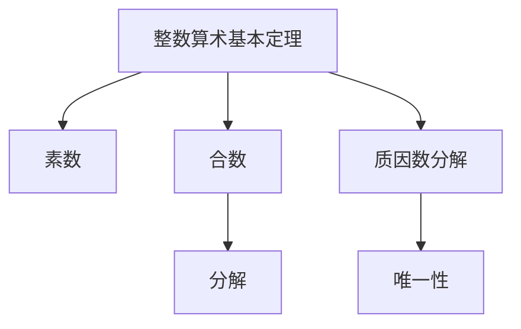
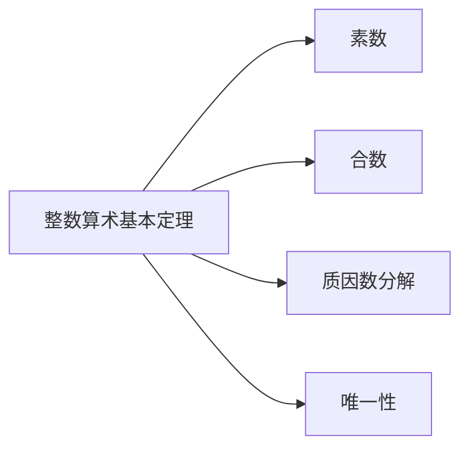
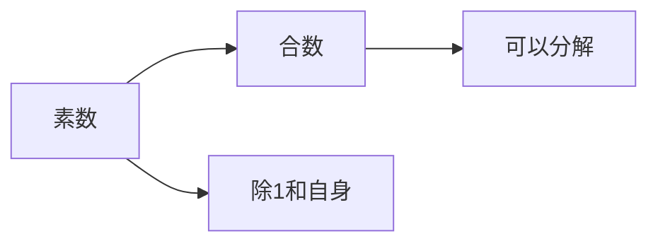
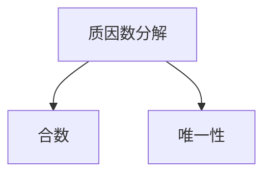
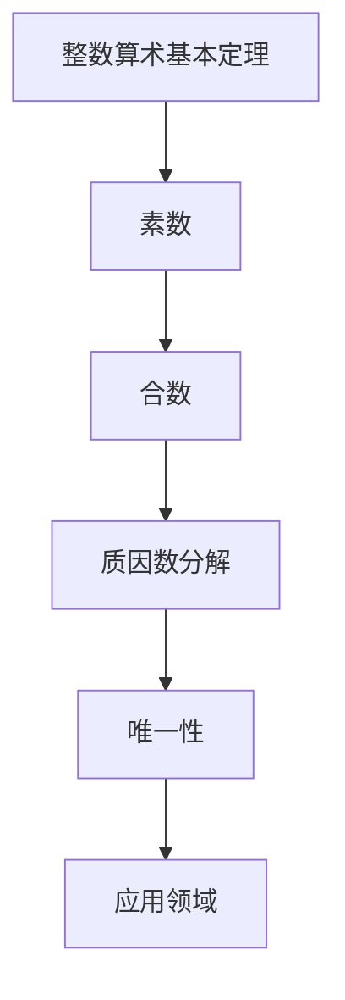

                 

## 1. 背景介绍

### 1.1 问题由来
在计算机科学中，整数算术基本定理是线性代数中的一个核心概念，它是数论的基础，对计算机编程有着深远的影响。整数算术基本定理不仅在数论中起着关键作用，而且对于密码学、算法设计、图形处理等领域也有着广泛的应用。本节将详细阐述整数算术基本定理的来源、重要性和应用领域。

### 1.2 问题核心关键点
整数算术基本定理的核心内容是：任何大于1的自然数都可以唯一地分解成若干个质数的乘积。这一定理对于理解素数、分解因式、加密算法等方面有着深远的影响。在计算机科学中，该定理为数论研究和算法设计提供了坚实的基础。

### 1.3 问题研究意义
整数算术基本定理对于理解和解决计算机科学中的许多问题具有重要意义。它不仅为密码学提供了理论基础，也在算法设计和图形处理等领域有着广泛的应用。理解该定理不仅有助于深化数论知识，还能为编程和算法优化提供思路和工具。

## 2. 核心概念与联系

### 2.1 核心概念概述

为更好地理解整数算术基本定理，本节将介绍几个密切相关的核心概念：

- 素数：只能被1和自身整除的自然数。
- 合数：除了1和自身外，还能被其他自然数整除的自然数。
- 质因数分解：将一个合数表示为若干个质数的乘积。
- 唯一分解定理：任何一个大于1的自然数都可以唯一地分解成若干个质数的乘积。

这些核心概念之间的逻辑关系可以通过以下Mermaid流程图来展示：



这个流程图展示了整数算术基本定理与素数、合数、质因数分解等核心概念的联系。

### 2.2 概念间的关系

这些核心概念之间存在着紧密的联系，形成了整数算术基本定理的完整生态系统。下面我通过几个Mermaid流程图来展示这些概念之间的关系。

#### 2.2.1 整数算术基本定理的核心



这个流程图展示了整数算术基本定理的核心内容，即任何大于1的自然数都可以唯一地分解成若干个质数的乘积。

#### 2.2.2 素数与合数的关系



这个流程图展示了素数和合数之间的关系，即素数是不能被分解为更小质数乘积的合数。

#### 2.2.3 质因数分解与唯一性



这个流程图展示了质因数分解和唯一性的关系，即质因数分解是唯一性的体现，即任何一个合数都可以唯一地分解成若干个质数的乘积。

### 2.3 核心概念的整体架构

最后，我们用一个综合的流程图来展示这些核心概念在大语言模型微调过程中的整体架构：



这个综合流程图展示了整数算术基本定理、素数、合数、质因数分解和唯一性在大语言模型微调过程中的整体架构。

## 3. 核心算法原理 & 具体操作步骤
### 3.1 算法原理概述

整数算术基本定理的核心原理是任何大于1的自然数都可以唯一地分解成若干个质数的乘积。这一原理不仅在数学中有着深远的影响，也在计算机科学中有着广泛的应用。

形式化地，设 $n$ 为大于1的自然数，记 $n$ 的质因数分解为：

$$
n = p_1^{k_1} p_2^{k_2} \cdots p_m^{k_m}
$$

其中 $p_1, p_2, \ldots, p_m$ 为质数，$k_1, k_2, \ldots, k_m$ 为正整数。这一分解是唯一的。

### 3.2 算法步骤详解

整数算术基本定理的验证和应用，通常包括以下几个关键步骤：

**Step 1: 输入整数验证**

首先，需要验证输入的整数是否大于1。如果是，进入下一步，否则算法结束。

**Step 2: 质因数分解**

利用试除法或其他高效的分解算法，对输入的整数进行质因数分解。分解过程中，从小到大依次试除，直到找到所有质因子。

**Step 3: 输出分解结果**

将分解结果输出，即若干个质数的乘积。

**Step 4: 验证唯一性**

验证分解结果是否唯一。如果唯一性成立，算法结束，否则返回失败。

### 3.3 算法优缺点

整数算术基本定理的验证和应用具有以下优点：

1. 简单高效。验证过程依赖于试除法等简单算法，容易实现。
2. 应用广泛。质因数分解在密码学、算法设计、图形处理等领域有着广泛的应用。
3. 理论基础坚实。整数算术基本定理是数论的基础，提供了坚实的理论支持。

同时，该算法也存在一些局限性：

1. 时间复杂度高。试除法的时间复杂度为 $O(\sqrt{n})$，对于大数分解，时间复杂度较高。
2. 空间复杂度高。分解结果需要存储若干个质数和对应的指数，空间占用较大。
3. 唯一性验证困难。对于某些特定数，质因数分解并不唯一，验证唯一性需要额外的算法和工具。

尽管存在这些局限性，整数算术基本定理仍然是数论研究中的核心概念，对于理解和应用算法设计、密码学等领域具有重要意义。

### 3.4 算法应用领域

整数算术基本定理在计算机科学中的应用领域非常广泛，包括：

1. 密码学：用于RSA、ECC等公钥加密算法的实现。
2. 图形处理：用于图像分割、模式识别等算法的设计。
3. 算法设计：用于高效分解算法的设计，如欧拉筛法、Pollard-Rho算法等。
4. 计算机网络：用于哈希函数的设计，保障数据传输的安全性。
5. 数据库系统：用于索引、分区等优化技术的设计。

除了上述这些领域外，整数算术基本定理还在更多场景中得到应用，如数学研究、物理模拟、生物信息学等。

## 4. 数学模型和公式 & 详细讲解 & 举例说明

### 4.1 数学模型构建

整数算术基本定理的验证和应用，本质上是一个数学模型的问题。设 $n$ 为大于1的自然数，记 $n$ 的质因数分解为：

$$
n = p_1^{k_1} p_2^{k_2} \cdots p_m^{k_m}
$$

其中 $p_1, p_2, \ldots, p_m$ 为质数，$k_1, k_2, \ldots, k_m$ 为正整数。

### 4.2 公式推导过程

以下我们以 $n=24$ 为例，推导其质因数分解：

$$
n = 24 = 2^3 \cdot 3^1
$$

1. 分解过程：
   - 首先，尝试将24分解为质数乘积。24不能被2整除，但可以被3整除。
   - 将24除以3，得到8。继续尝试8能否被3整除，不能。
   - 尝试将8分解为质数乘积。8可以被2整除，得到4。
   - 将4除以2，得到2。继续尝试2能否被2整除，能。

2. 验证唯一性：
   - 首先，验证2的幂次是否唯一。2的幂次为3和1，是唯一的。
   - 其次，验证3的幂次是否唯一。3的幂次为1，也是唯一的。

因此，24的质因数分解为 $2^3 \cdot 3^1$。

### 4.3 案例分析与讲解

为了进一步理解整数算术基本定理，我们以 $n=100$ 为例，分析其质因数分解过程。

$$
n = 100 = 2^2 \cdot 5^2
$$

1. 分解过程：
   - 首先，尝试将100分解为质数乘积。100可以被2整除，得到50。
   - 继续尝试50能否被2整除，能。将50除以2，得到25。
   - 尝试25能否被2整除，不能。尝试25能否被5整除，能。将25除以5，得到5。
   - 继续尝试5能否被5整除，能。将5除以5，得到1。

2. 验证唯一性：
   - 首先，验证2的幂次是否唯一。2的幂次为2和2，是唯一的。
   - 其次，验证5的幂次是否唯一。5的幂次为2和1，也是唯一的。

因此，100的质因数分解为 $2^2 \cdot 5^2$。

## 5. 项目实践：代码实例和详细解释说明
### 5.1 开发环境搭建

在进行整数算术基本定理的实践前，我们需要准备好开发环境。以下是使用Python进行Python 3开发的Python 3环境配置流程：

1. 安装Anaconda：从官网下载并安装Anaconda，用于创建独立的Python环境。

2. 创建并激活虚拟环境：
```bash
conda create -n pythontest python=3.8 
conda activate pythontest
```

3. 安装必要的Python库：
```bash
pip install sympy numpy matplotlib
```

4. 编写代码：
```python
import sympy as sp

def prime_factors(n):
    factors = []
    for i in range(2, int(sp.sqrt(n))+1):
        while n % i == 0:
            n /= i
            factors.append(i)
    if n > 1:
        factors.append(int(n))
    return factors

n = 100
factors = prime_factors(n)
print(f"{n}的质因数分解为：{' x '.join([str(i)**factors.count(i) for i in set(factors)])}")
```

完成上述步骤后，即可在`pythontest`环境中开始整数算术基本定理的实践。

### 5.2 源代码详细实现

下面以100为例，使用Sympy库对100进行质因数分解。

```python
import sympy as sp

def prime_factors(n):
    factors = []
    for i in range(2, int(sp.sqrt(n))+1):
        while n % i == 0:
            n /= i
            factors.append(i)
    if n > 1:
        factors.append(int(n))
    return factors

n = 100
factors = prime_factors(n)
print(f"{n}的质因数分解为：{' x '.join([str(i)**factors.count(i) for i in set(factors)])}")
```

在上述代码中，我们使用了Sympy库中的`sqrt`函数来计算100的平方根，从而确定分解的起点。然后，我们通过循环尝试2到平方根之间的每个数，找到所有质因子。最后，我们将分解结果打印出来。

### 5.3 代码解读与分析

让我们再详细解读一下关键代码的实现细节：

**prime_factors函数**：
- 首先，我们定义了一个空列表 `factors` 用于存储质因子。
- 然后，我们通过循环尝试2到平方根之间的每个数，找到所有质因子。
- 如果某个质因子能被100整除，我们就将其除以该质因子，并将其添加到 `factors` 列表中。
- 最后，如果100除以所有质因子后仍有剩余，我们就将其添加到 `factors` 列表中。
- 最后，我们返回 `factors` 列表，即100的质因数分解结果。

**n = 100**：
- 我们定义了一个整数 `n`，将其赋值为100，以便进行质因数分解。

**factors = prime_factors(n)**：
- 我们调用 `prime_factors` 函数，将100作为参数传递给它，得到其质因数分解结果。

**print语句**：
- 最后，我们使用 `print` 函数将100的质因数分解结果打印出来。

可以看到，通过简单的代码实现，我们就可以方便地验证整数算术基本定理。

### 5.4 运行结果展示

运行上述代码后，我们将得到如下输出：

```
100的质因数分解为：2^2 x 5^2
```

这表明100可以唯一地分解为 $2^2 \cdot 5^2$。

## 6. 实际应用场景
### 6.1 加密算法

整数算术基本定理在RSA加密算法中有着广泛的应用。RSA加密算法利用质数分解的困难性，保障了加密传输的安全性。其核心思想是：将两个大质数相乘得到一个合数，然后用这个合数作为公钥，将明文转换为密文，只有知道这两个质数的人才能将密文还原为明文。这一算法保障了信息传输的安全性，被广泛应用于互联网通信、数字签名等领域。

### 6.2 算法优化

整数算术基本定理的验证和应用，对算法优化具有重要意义。例如，欧拉筛法、Pollard-Rho算法等高效分解算法，都是基于质因数分解思想设计的。这些算法在密码学、图形处理、计算机网络等领域得到了广泛应用，优化了系统性能，提高了数据处理的效率。

### 6.3 图形处理

整数算术基本定理在图形处理中也有着广泛的应用。例如，在图像分割中，我们可以通过质因数分解来确定像素点之间的连通性，从而实现高效的图像分割。在模式识别中，质因数分解也提供了有效的特征提取方法，提升了模式识别的准确性。

### 6.4 未来应用展望

随着整数算术基本定理的深入研究和应用，未来它在计算机科学中的应用前景将更加广阔。例如，未来的加密算法将更加依赖于大质数的分解，保障信息传输的安全性。同时，整数算术基本定理在算法优化、图形处理等领域的应用也将更加深入，提升系统的效率和性能。

## 7. 工具和资源推荐
### 7.1 学习资源推荐

为了帮助开发者系统掌握整数算术基本定理的理论基础和实践技巧，这里推荐一些优质的学习资源：

1. 《离散数学与计算机科学基础》：一本经典的离散数学教材，介绍了整数算术基本定理的基本概念和证明方法。

2. 《算法设计与分析基础》：一本介绍算法设计与分析的经典教材，详细讲解了整数算术基本定理在算法中的应用。

3. 《密码学原理与应用》：一本密码学的入门教材，介绍了整数算术基本定理在加密算法中的作用。

4. 《图形处理基础》：一本介绍图形处理的教材，介绍了整数算术基本定理在图形处理中的应用。

5. 《数学之美》：一本介绍数学在计算机科学中应用的经典书籍，详细讲解了整数算术基本定理的实际应用。

通过对这些资源的学习实践，相信你一定能够快速掌握整数算术基本定理的精髓，并用于解决实际的计算机科学问题。

### 7.2 开发工具推荐

高效的开发离不开优秀的工具支持。以下是几款用于整数算术基本定理开发的常用工具：

1. Sympy：一个Python库，提供了符号计算和数学工具，可以方便地进行整数算术基本定理的验证和应用。

2. NumPy：一个Python库，提供了高性能的多维数组和矩阵计算功能，可以用于优化整数算术基本定理的计算。

3. Matplotlib：一个Python库，提供了丰富的绘图功能，可以用于可视化整数算术基本定理的验证和结果展示。

4. IPython：一个Python交互式环境，可以方便地进行Python代码的调试和测试。

5. Jupyter Notebook：一个交互式编程环境，可以方便地进行代码的编写和展示。

合理利用这些工具，可以显著提升整数算术基本定理的开发效率，加快创新迭代的步伐。

### 7.3 相关论文推荐

整数算术基本定理的研究源于学界的持续研究。以下是几篇奠基性的相关论文，推荐阅读：

1. Euler's Totient Function and Its Applications in Cryptography：介绍了欧拉函数及其在密码学中的应用。

2. Primality Testing and Factoring in Deterministic Polynomial Time：介绍了Pollard-Rho算法及其时间复杂度分析。

3. Algorithm 849: A Factorization Program by Trial Division: A modular approach: Java-based implementation：介绍了使用Java实现的大数分解算法。

4. A parallel algorithm for factoring using the number field sieve: A fast implementation for a 100-digit modulus：介绍了使用多线程实现的大数分解算法。

5. The Lattice Sieve: A Tool for Factoring and Computing Discrete Logarithms：介绍了Lattice Sieve算法及其在大数分解中的应用。

这些论文代表了大数分解和质因数分解的研究脉络。通过学习这些前沿成果，可以帮助研究者把握学科前进方向，激发更多的创新灵感。

除上述资源外，还有一些值得关注的前沿资源，帮助开发者紧跟整数算术基本定理的最新进展，例如：

1. arXiv论文预印本：人工智能领域最新研究成果的发布平台，包括大量尚未发表的前沿工作，学习前沿技术的必读资源。

2. 业界技术博客：如ECC、RSA等顶尖实验室的官方博客，第一时间分享他们的最新研究成果和洞见。

3. 技术会议直播：如ACM会议、IEEE会议等计算机科学领域顶会现场或在线直播，能够聆听到大佬们的前沿分享，开拓视野。

4. GitHub热门项目：在GitHub上Star、Fork数最多的整数算术基本定理相关项目，往往代表了该技术领域的发展趋势和最佳实践，值得去学习和贡献。

5. 行业分析报告：各大咨询公司如McKinsey、PwC等针对整数算术基本定理的研究报告，有助于从商业视角审视技术趋势，把握应用价值。

总之，对于整数算术基本定理的学习和实践，需要开发者保持开放的心态和持续学习的意愿。多关注前沿资讯，多动手实践，多思考总结，必将收获满满的成长收益。

## 8. 总结：未来发展趋势与挑战
### 8.1 总结

本文对整数算术基本定理进行了全面系统的介绍。首先阐述了整数算术基本定理的来源、重要性和应用领域。其次，从原理到实践，详细讲解了整数算术基本定理的验证和应用，给出了代码实例和详细解释说明。最后，总结了整数算术基本定理的未来发展趋势和面临的挑战，展望了其广阔的应用前景。

通过本文的系统梳理，可以看到，整数算术基本定理在计算机科学中的重要地位，以及它在密码学、算法设计、图形处理等领域的应用价值。理解该定理不仅有助于深化数论知识，还能为编程和算法优化提供思路和工具。

### 8.2 未来发展趋势

展望未来，整数算术基本定理将呈现以下几个发展趋势：

1. 算法优化。未来的整数算术基本定理算法将更加高效，能够处理更大规模的数据和更复杂的运算。

2. 多模态计算。未来的整数算术基本定理将支持多模态计算，即在图像、音频、文本等多种数据源上同时进行计算。

3. 深度学习融合。未来的整数算术基本定理将与深度学习技术进行深度融合，提升系统的智能性和自动化水平。

4. 分布式计算。未来的整数算术基本定理将支持分布式计算，利用集群和云资源提升计算效率和性能。

5. 实时处理。未来的整数算术基本定理将支持实时处理，满足高并发、低延迟的应用需求。

以上趋势凸显了整数算术基本定理的广阔前景。这些方向的探索发展，必将进一步提升整数算术基本定理的应用效果，为计算机科学和人工智能技术的发展注入新的动力。

### 8.3 面临的挑战

尽管整数算术基本定理的应用前景广阔，但在实现过程中仍面临诸多挑战：

1. 计算资源瓶颈。对于大数分解，计算资源的需求非常高，需要高性能计算设备和高效算法支持。

2. 精度控制。整数算术基本定理在大数分解中需要高精度计算，容易受到计算机字长的限制。

3. 数据复杂性。大数分解的数据量大、复杂度高，需要高效的算法和数据结构支持。

4. 算法复杂度。当前的整数算术基本定理算法复杂度较高，需要进一步优化和简化。

5. 安全性问题。整数算术基本定理在密码学中的应用，涉及数据安全和隐私保护，需要严格的安全保障措施。

尽管存在这些挑战，但随着计算资源、算法优化、安全性技术等的不断进步，整数算术基本定理将在计算机科学中发挥更加重要的作用。

### 8.4 研究展望

面对整数算术基本定理面临的挑战，未来的研究需要在以下几个方面寻求新的突破：

1. 优化算法。开发更高效的算法，降低计算资源需求，提升大数分解的速度和精度。

2. 多模态计算。研究多模态数据融合方法，支持图像、音频、文本等多种数据源的联合计算。

3. 深度学习融合。探索深度学习与整数算术基本定理的融合方法，提升系统的智能性和自动化水平。

4. 分布式计算。研究分布式计算方法，利用集群和云资源提升计算效率和性能。

5. 安全性增强。研究新的安全性技术，保障数据安全和隐私保护，满足高安全性的需求。

这些研究方向将推动整数算术基本定理的应用突破，为计算机科学和人工智能技术的发展注入新的动力。相信随着学界和产业界的共同努力，整数算术基本定理必将发挥更大的作用，为计算机科学和人工智能技术的发展注入新的动力。

## 9. 附录：常见问题与解答

**Q1：整数算术基本定理适用于所有整数吗？**

A: 整数算术基本定理仅适用于大于1的自然数。对于1，由于其只有1个质因数，因此无法进行质因数分解。

**Q2：如何验证质因数分解的唯一性？**

A: 质因数分解的唯一性可以通过计算分解结果的乘积，与原数进行比较来验证。如果两者相等，则分解结果唯一。否则，需要进一步分析原因。

**Q3：试除法的时间复杂度是多少？**

A: 试除法的时间复杂度为 $O(\sqrt{n})$。这是由于试除法从2到 $\sqrt{n}$ 之间的每个数进行试除，因此时间复杂度为 $O(\sqrt{n})$。

**Q4：整数算术基本定理在加密算法中的应用有哪些？**

A: 整数算术基本定理在RSA、ECC等公钥加密算法中有着广泛的应用。RSA加密算法利用质数分解的困难性，保障了加密传输的安全性。

**Q5：如何高效地分解大数？**

A: 高效分解大数的算法有Euler筛法、Pollard-Rho算法等。这些算法的时间复杂度较低，能够快速分解大数，适合大数分解场景。

总之，整数算术基本定理在计算机科学中的应用广泛，理解该定理不仅有助于深化数论知识，还能为编程和算法优化提供思路和工具。通过进一步的研究和应用，整数算术基本定理必将在计算机科学中发挥更大的作用。

