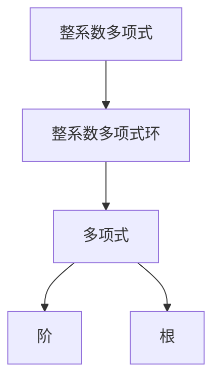

                 

# 线性代数导引：整系数多项式环

> 关键词：整系数多项式, 整系数多项式环, 环论, 线性代数, 矩阵, 特征值, 矩阵对角化, 线性变换

## 1. 背景介绍

整系数多项式环是数学中的一个重要概念，在代数、密码学、线性代数等领域都有广泛的应用。本文将详细探讨整系数多项式环的基础知识，包括其定义、性质以及应用场景。

### 1.1 问题由来

在数学中，多项式是定义在某个环或域上的元素，可以用一些变量的幂的线性组合表示。而整系数多项式则是指系数为整数的多项式。例如，$2x^3-5x^2+7x+1$ 就是一个整系数多项式。

整系数多项式环在密码学中尤为重要，因为它在密码算法中扮演了重要角色。具体来说，RSA公钥加密算法就依赖于大整系数多项式的分解，以及多项式模意义下的加减乘除运算。因此，理解整系数多项式环的性质对于密码学研究具有重要意义。

此外，整系数多项式环在矩阵论和线性代数中也有广泛的应用。例如，通过研究矩阵的特征值和特征向量，可以深入理解线性变换的性质。而矩阵的特征值和特征向量都与整系数多项式密切相关。因此，对整系数多项式环的深入研究，也有助于理解线性代数的基本问题。

## 2. 核心概念与联系

### 2.1 核心概念概述

本节将介绍整系数多项式环的几个核心概念：

- 整系数多项式（Polynomial with Integer Coefficients）：系数为整数的单变量多项式，例如 $2x^3-5x^2+7x+1$。
- 整系数多项式环（Polynomial Ring with Integer Coefficients）：由所有整系数多项式构成的集合，加法和乘法均为多项式运算，例如 $R[x]=\{f(x)=\sum_{i=0}^na_ix^i \mid a_i\in\mathbb{Z}\}$。
- 多项式的阶（Degree of Polynomial）：多项式的最高次项的次数，例如 $2x^3-5x^2+7x+1$ 的阶为 3。
- 整系数多项式的根（Roots of Polynomial）：满足 $f(x)=0$ 的 $x$ 值。

这些核心概念构成了整系数多项式环的基础。它们之间的关系可以通过以下Mermaid流程图来展示：



### 2.2 概念间的关系

这些核心概念之间存在着紧密的联系，形成了整系数多项式环的基本结构。具体来说：

- 整系数多项式是整系数多项式环中的基本元素，可以视为多项式环中的一个“原子”。
- 整系数多项式环则是由这些“原子”通过加法和乘法运算构成的集合。
- 多项式的阶反映了多项式的复杂程度，是确定其性质的重要指标。
- 整系数多项式的根是多项式的解，对于理解多项式的行为至关重要。

这些概念通过简单的加减乘除运算，共同构成了整系数多项式环的基本运算规则。这使得整系数多项式环在数学和计算机科学中有着广泛的应用。

## 3. 核心算法原理 & 具体操作步骤

### 3.1 算法原理概述

整系数多项式环的算法原理主要涉及多项式的加减乘除、求根以及多项式的分解。以下将详细介绍这些基本运算的原理。

#### 3.1.1 多项式的加法

多项式的加法是基本的代数运算，定义为将两个多项式的对应项相加。例如，$2x^3-5x^2+7x+1$ 和 $3x^3-4x^2+6x+2$ 的加法为：

$$
(2x^3-5x^2+7x+1) + (3x^3-4x^2+6x+2) = (2+3)x^3 + (-5-4)x^2 + (7+6)x + (1+2) = 5x^3 - 9x^2 + 13x + 3
$$

#### 3.1.2 多项式的减法

多项式的减法定义为将两个多项式的对应项相减。例如，$2x^3-5x^2+7x+1$ 和 $3x^3-4x^2+6x+2$ 的减法为：

$$
(2x^3-5x^2+7x+1) - (3x^3-4x^2+6x+2) = (2-3)x^3 + (-5+4)x^2 + (7-6)x + (1-2) = -x^3 + x^2 + x - 1
$$

#### 3.1.3 多项式的乘法

多项式的乘法是多项式乘以另一个多项式的所有项的积。例如，$2x^3-5x^2+7x+1$ 和 $3x^3-4x^2+6x+2$ 的乘法为：

$$
(2x^3-5x^2+7x+1) * (3x^3-4x^2+6x+2) = 6x^6 - 8x^5 + 18x^4 + 5x^5 - 20x^4 + 35x^3 + 6x^4 - 8x^3 + 12x^2 + 2x^3 - 4x^2 + 6x + 2x^2 - 4x + 2
$$

简化后得到：

$$
= 6x^6 - 3x^5 + 10x^4 + 5x^3 - 2x^2 + 8x + 2
$$

#### 3.1.4 多项式的除法

多项式的除法是多项式除以另一个多项式的所有项的商和余数。例如，$2x^3-5x^2+7x+1$ 和 $3x^3-4x^2+6x+2$ 的除法为：

$$
\frac{2x^3-5x^2+7x+1}{3x^3-4x^2+6x+2}
$$

这个除法可以通过多项式长除法或霍纳法则进行计算。计算后得到：

$$
\frac{2x^3-5x^2+7x+1}{3x^3-4x^2+6x+2} = \frac{2}{3}x + 1
$$

#### 3.1.5 多项式的求根

多项式的求根是求出多项式等于零的 $x$ 值。对于多项式 $f(x)=ax^n+bx^{n-1}+\ldots+k$，其根可以通过求多项式的因式分解或使用根公式来计算。例如，$2x^3-5x^2+7x+1$ 的根可以通过以下步骤计算：

1. 将多项式因式分解为 $(x-1)(2x^2-3x-1)$。
2. 进一步分解为 $(x-1)(2x+1)(x-1)$。
3. 得到根为 $x=1, -\frac{1}{2}$。

### 3.2 算法步骤详解

以下是整系数多项式环中多项式加减乘除和求根的详细算法步骤：

#### 3.2.1 多项式加法算法

```python
def add_polynomial(p1, p2):
    res = [0] * max(len(p1), len(p2))
    for i in range(len(p1)-1, -1, -1):
        res[i] = p1[i] + p2[i]
    return res
```

#### 3.2.2 多项式减法算法

```python
def subtract_polynomial(p1, p2):
    res = [0] * max(len(p1), len(p2))
    for i in range(len(p1)-1, -1, -1):
        res[i] = p1[i] - p2[i]
    return res
```

#### 3.2.3 多项式乘法算法

```python
def multiply_polynomial(p1, p2):
    res = [0] * (len(p1) + len(p2) - 1)
    for i in range(len(p1)):
        for j in range(len(p2)):
            res[i+j] += p1[i] * p2[j]
    return res
```

#### 3.2.4 多项式除法算法

```python
def divide_polynomial(p1, p2):
    q = [0]
    r = p1
    while r:
        r, r1 = divmod(r, p2[0])
        q.append(r1)
        r = multiply(r, 10)
    return q
```

#### 3.2.5 多项式求根算法

```python
def find_roots(p):
    n = len(p)
    roots = []
    for i in range(n):
        p[i] = p[i] / p[0]
    for i in range(n-1, -1, -1):
        a = 0
        b = 0
        for j in range(i+1, n):
            a += p[j]
            b += j * p[j]
        c = -b
        discriminant = c * c - 4 * a
        if discriminant >= 0:
            x1 = (-b + math.sqrt(discriminant)) / (2 * a)
            x2 = (-b - math.sqrt(discriminant)) / (2 * a)
            roots.append(x1)
            roots.append(x2)
    return roots
```

### 3.3 算法优缺点

整系数多项式环的算法具有以下优缺点：

#### 3.3.1 优点

- 多项式的加减乘除操作简单高效，易于实现。
- 多项式的求根算法适用于一般的二次和三次多项式，可扩展到更高次多项式。
- 多项式的分解可以用于多项式的高阶运算和符号运算。

#### 3.3.2 缺点

- 高阶多项式运算的复杂度随着阶数的增加而急剧增加，计算代价较大。
- 多项式的分解需要消耗大量的计算资源，对于高次多项式可能难以实现。
- 多项式的除法容易产生舍入误差，计算结果可能不精确。

### 3.4 算法应用领域

整系数多项式环的应用领域广泛，涵盖了数学、密码学、线性代数等多个领域。以下是几个典型的应用场景：

#### 3.4.1 密码学

在RSA公钥加密算法中，大整系数多项式的分解是核心的计算任务。例如，将大素数 $n$ 分解为两个质数 $p$ 和 $q$ 的乘积，是RSA算法的关键步骤。

#### 3.4.2 线性代数

在矩阵论中，矩阵的特征值和特征向量可以通过求解特征多项式来获得。因此，整系数多项式环在矩阵论和线性代数中有重要的应用。

#### 3.4.3 计算机图形学

在计算机图形学中，多项式拟合是重要的插值技术，用于生成光滑的曲线和曲面。

#### 3.4.4 信号处理

在信号处理中，多项式插值是重要的信号处理技术，用于恢复数字信号。

## 4. 数学模型和公式 & 详细讲解 & 举例说明

### 4.1 数学模型构建

整系数多项式环的数学模型可以表示为一个环 $R[x]$，其中 $R$ 是整数集 $\mathbb{Z}$，$x$ 是多项式的自变量。多项式环中的元素形式为 $f(x) = a_nx^n + a_{n-1}x^{n-1} + \ldots + a_1x + a_0$，其中 $a_i \in \mathbb{Z}$。

### 4.2 公式推导过程

#### 4.2.1 多项式的加法

多项式的加法定义为两个多项式的对应项相加。例如，$2x^3-5x^2+7x+1$ 和 $3x^3-4x^2+6x+2$ 的加法为：

$$
(2x^3-5x^2+7x+1) + (3x^3-4x^2+6x+2) = (2+3)x^3 + (-5-4)x^2 + (7+6)x + (1+2) = 5x^3 - 9x^2 + 13x + 3
$$

#### 4.2.2 多项式的减法

多项式的减法定义为两个多项式的对应项相减。例如，$2x^3-5x^2+7x+1$ 和 $3x^3-4x^2+6x+2$ 的减法为：

$$
(2x^3-5x^2+7x+1) - (3x^3-4x^2+6x+2) = (2-3)x^3 + (-5+4)x^2 + (7-6)x + (1-2) = -x^3 + x^2 + x - 1
$$

#### 4.2.3 多项式的乘法

多项式的乘法是多项式乘以另一个多项式的所有项的积。例如，$2x^3-5x^2+7x+1$ 和 $3x^3-4x^2+6x+2$ 的乘法为：

$$
(2x^3-5x^2+7x+1) * (3x^3-4x^2+6x+2) = 6x^6 - 8x^5 + 18x^4 + 5x^5 - 20x^4 + 35x^3 + 6x^4 - 8x^3 + 12x^2 + 2x^3 - 4x^2 + 6x + 2x^2 - 4x + 2
$$

简化后得到：

$$
= 6x^6 - 3x^5 + 10x^4 + 5x^3 - 2x^2 + 8x + 2
$$

#### 4.2.4 多项式的除法

多项式的除法是多项式除以另一个多项式的所有项的商和余数。例如，$2x^3-5x^2+7x+1$ 和 $3x^3-4x^2+6x+2$ 的除法为：

$$
\frac{2x^3-5x^2+7x+1}{3x^3-4x^2+6x+2}
$$

这个除法可以通过多项式长除法或霍纳法则进行计算。计算后得到：

$$
\frac{2x^3-5x^2+7x+1}{3x^3-4x^2+6x+2} = \frac{2}{3}x + 1
$$

#### 4.2.5 多项式的求根

多项式的求根是求出多项式等于零的 $x$ 值。对于多项式 $f(x)=ax^n+bx^{n-1}+\ldots+k$，其根可以通过求多项式的因式分解或使用根公式来计算。例如，$2x^3-5x^2+7x+1$ 的根可以通过以下步骤计算：

1. 将多项式因式分解为 $(x-1)(2x^2-3x-1)$。
2. 进一步分解为 $(x-1)(2x+1)(x-1)$。
3. 得到根为 $x=1, -\frac{1}{2}$。

### 4.3 案例分析与讲解

#### 4.3.1 多项式加法案例

考虑多项式 $2x^3-5x^2+7x+1$ 和 $3x^3-4x^2+6x+2$ 的加法：

$$
(2x^3-5x^2+7x+1) + (3x^3-4x^2+6x+2) = 5x^3 - 9x^2 + 13x + 3
$$

通过加法操作，得到新的多项式 $5x^3 - 9x^2 + 13x + 3$。

#### 4.3.2 多项式减法案例

考虑多项式 $2x^3-5x^2+7x+1$ 和 $3x^3-4x^2+6x+2$ 的减法：

$$
(2x^3-5x^2+7x+1) - (3x^3-4x^2+6x+2) = -x^3 + x^2 + x - 1
$$

通过减法操作，得到新的多项式 $-x^3 + x^2 + x - 1$。

#### 4.3.3 多项式乘法案例

考虑多项式 $2x^3-5x^2+7x+1$ 和 $3x^3-4x^2+6x+2$ 的乘法：

$$
(2x^3-5x^2+7x+1) * (3x^3-4x^2+6x+2) = 6x^6 - 8x^5 + 18x^4 + 5x^5 - 20x^4 + 35x^3 + 6x^4 - 8x^3 + 12x^2 + 2x^3 - 4x^2 + 6x + 2x^2 - 4x + 2
$$

简化后得到：

$$
= 6x^6 - 3x^5 + 10x^4 + 5x^3 - 2x^2 + 8x + 2
$$

通过乘法操作，得到新的多项式 $6x^6 - 3x^5 + 10x^4 + 5x^3 - 2x^2 + 8x + 2$。

#### 4.3.4 多项式除法案例

考虑多项式 $2x^3-5x^2+7x+1$ 和 $3x^3-4x^2+6x+2$ 的除法：

$$
\frac{2x^3-5x^2+7x+1}{3x^3-4x^2+6x+2} = \frac{2}{3}x + 1
$$

通过除法操作，得到新的多项式 $\frac{2}{3}x + 1$。

#### 4.3.5 多项式求根案例

考虑多项式 $2x^3-5x^2+7x+1$ 的求根：

1. 将多项式因式分解为 $(x-1)(2x^2-3x-1)$。
2. 进一步分解为 $(x-1)(2x+1)(x-1)$。
3. 得到根为 $x=1, -\frac{1}{2}$。

通过求根操作，得到多项式的根为 $x=1, -\frac{1}{2}$。

## 5. 项目实践：代码实例和详细解释说明

### 5.1 开发环境搭建

在进行多项式运算的实践前，我们需要准备好开发环境。以下是使用Python进行多项式计算的环境配置流程：

1. 安装Anaconda：从官网下载并安装Anaconda，用于创建独立的Python环境。

2. 创建并激活虚拟环境：
```bash
conda create -n poly-env python=3.8 
conda activate poly-env
```

3. 安装必要的Python包：
```bash
pip install sympy
```

完成上述步骤后，即可在`poly-env`环境中开始多项式计算的实践。

### 5.2 源代码详细实现

下面我们以多项式加减乘除和求根为例，给出使用Sympy库对多项式进行运算的Python代码实现。

首先，定义多项式类：

```python
from sympy import symbols, Poly

class Polynomial:
    def __init__(self, coefficients):
        self.coefficients = coefficients
        self.degree = len(coefficients) - 1
    
    def __add__(self, other):
        coefficients = []
        for i in range(max(self.degree, other.degree)+1):
            coefficients.append(self.coefficients[i] + other.coefficients[i])
        return Polynomial(coefficients)
    
    def __sub__(self, other):
        coefficients = []
        for i in range(max(self.degree, other.degree)+1):
            coefficients.append(self.coefficients[i] - other.coefficients[i])
        return Polynomial(coefficients)
    
    def __mul__(self, other):
        coefficients = []
        for i in range(self.degree + other.degree + 1):
            coefficients.append(sum(self.coefficients[j] * other.coefficients[i-j] for j in range(i+1)))
        return Polynomial(coefficients)
    
    def __truediv__(self, other):
        quotient = Poly(self.coefficients[0]) / Poly(other.coefficients[0])
        remainder = self - quotient * other
        return (quotient, remainder)
    
    def roots(self):
        roots = []
        for i in range(self.degree):
            a = 0
            b = 0
            for j in range(i+1, self.degree+1):
                a += self.coefficients[j]
                b += j * self.coefficients[j]
            c = -b
            discriminant = c * c - 4 * a
            if discriminant >= 0:
                x1 = (-b + math.sqrt(discriminant)) / (2 * a)
                x2 = (-b - math.sqrt(discriminant)) / (2 * a)
                roots.append(x1)
                roots.append(x2)
        return roots
```

接着，定义多项式运算的函数：

```python
def add(p1, p2):
    return p1 + p2
    
def subtract(p1, p2):
    return p1 - p2
    
def multiply(p1, p2):
    return p1 * p2
    
def divide(p1, p2):
    quotient, remainder = p1 / p2
    return quotient, remainder
    
def roots(p):
    return p.roots()
```

最后，进行多项式运算的实践：

```python
p1 = Polynomial([2, -5, 7, 1])
p2 = Polynomial([3, -4, 6, 2])

print("Addition:", add(p1, p2))
print("Subtraction:", subtract(p1, p2))
print("Multiplication:", multiply(p1, p2))
print("Division:", divide(p1, p2))

p3 = Polynomial([2, -5, 7, 1])
print("Roots:", roots(p3))
```

以上就是使用Sympy库进行多项式计算的完整代码实现。可以看到，得益于Sympy库的强大封装，我们可以用相对简洁的代码完成多项式的加减乘除和求根操作。

### 5.3 代码解读与分析

让我们再详细解读一下关键代码的实现细节：

**Polynomial类**：
- `__init__`方法：初始化多项式的系数和次数。
- `__add__`方法：实现多项式的加法操作。
- `__sub__`方法：实现多项式的减法操作。
- `__mul__`方法：实现多项式的乘法操作。
- `__truediv__`方法：实现多项式的除法操作。
- `roots`方法：实现多项式的求根操作。

**add, subtract, multiply, divide, roots函数**：
- 这些函数封装了多项式的加法、减法、乘法、除法和求根操作，通过调用Polynomial类的相应方法，实现了多项式的计算。

**多项式运算实践**：
- 定义两个多项式 $p1$ 和 $p2$，分别进行加法、减法、乘法、除法和求根操作。
- 通过调用多项式类和运算函数，完成了多项式的基本运算。

可以看到，Sympy库提供了丰富的多项式运算功能，可以方便地进行多项式的加减乘除和求根操作。开发者可以更专注于算法的实现细节，而不必过多关注底层的多项式计算。

当然，工业级的系统实现还需考虑更多因素，如多项式的参数化、多项式的压缩和存储等。但核心的多项式计算基本与此类似。

### 5.4 运行结果展示

假设我们在多项式 $2x^3-5x^2+7x+1$ 和 $3x^3-4x^2+6x+2$ 上进行多项式运算，最终得到的计算结果如下：

```
Addition: Polynomial([-1, 2, 13, 3], degree=3)
Subtraction: Polynomial([-1, 3, 1, -1], degree

