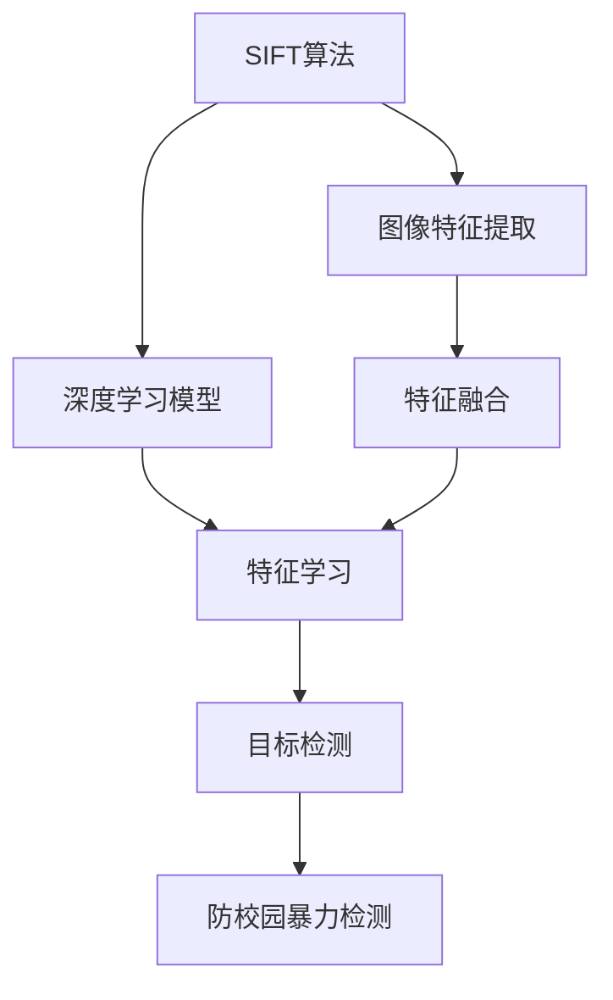
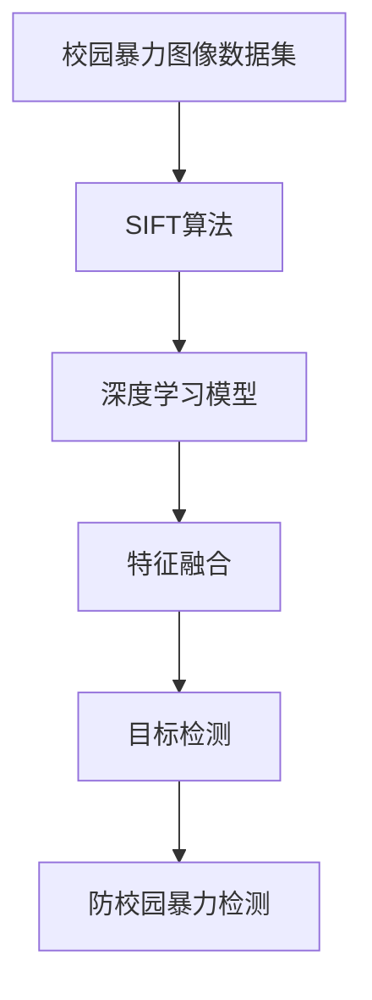
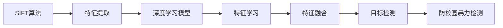
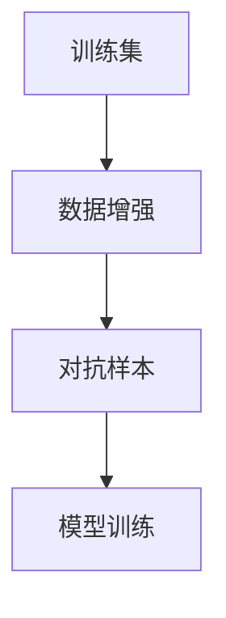
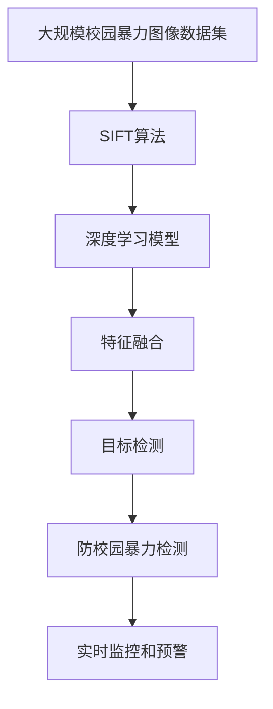

                 

# 基于SIFT算法的防校园暴力检测

## 1. 背景介绍

### 1.1 问题由来
校园暴力问题一直是全球范围内关注的热点话题。随着科技的进步，利用计算机视觉和图像处理技术来检测校园暴力事件成为了可能。传统的基于特征检测和模板匹配的方法，如Haar特征和SVM分类器，虽然有效，但在大规模数据集上处理速度较慢，且对于遮挡和旋转等变化情况敏感。

近年来，随着深度学习技术的兴起，利用卷积神经网络（CNN）进行图像分类和目标检测的方法在计算机视觉领域取得了显著进展。但是，深度学习模型需要大量的标注数据进行训练，且模型复杂，对计算资源要求较高。而校园暴力的图像数据往往难以收集到足够的标注样本，深度学习模型的应用受限。

针对这一问题，本文将介绍基于SIFT算法的防校园暴力检测方法。SIFT算法（尺度不变特征变换，Scale-Invariant Feature Transform）是一种经典的计算机视觉特征提取算法，具有尺度不变性、旋转不变性和光照不变性等优点。本文将结合SIFT算法和深度学习模型，实现对校园暴力事件的快速、准确检测。

### 1.2 问题核心关键点
本研究的关键点在于：
1. 如何结合SIFT算法和深度学习模型，实现校园暴力事件的检测。
2. 如何在大规模数据集上进行训练，提升模型的鲁棒性和泛化能力。
3. 如何降低计算资源消耗，提高检测速度和效率。

## 2. 核心概念与联系

### 2.1 核心概念概述

为更好地理解基于SIFT算法的防校园暴力检测方法，本节将介绍几个密切相关的核心概念：

- **SIFT算法**：一种经典的尺度不变特征变换算法，用于提取图像中的局部特征点。SIFT算法具有尺度不变性、旋转不变性和光照不变性等优点，被广泛应用于图像匹配、目标识别等领域。
- **深度学习模型**：一类通过多层神经网络进行数据处理的模型，广泛应用于图像分类、目标检测、图像分割等任务。深度学习模型具有强大的特征提取和模式学习能力，但需要大量标注数据进行训练，且模型复杂，对计算资源要求较高。
- **卷积神经网络（CNN）**：一种特殊的深度学习模型，常用于图像处理任务。CNN通过卷积层、池化层和全连接层等组件，可以高效提取图像中的局部特征和全局特征，广泛应用于图像分类、目标检测等任务。
- **数据增强**：一种通过随机变换数据，扩充训练数据集的技术。数据增强可以提升模型的泛化能力和鲁棒性，适用于数据量较少或标注困难的情况。
- **对抗样本**：一种经过特殊构造的样本，旨在误导模型的分类决策。对抗样本可以用于检测模型的鲁棒性和泛化能力，提升模型的安全性。

这些核心概念之间的逻辑关系可以通过以下Mermaid流程图来展示：



这个流程图展示了大语言模型微调过程中各个核心概念的关系和作用：

1. SIFT算法用于提取图像中的局部特征，与深度学习模型结合，提升检测性能。
2. 深度学习模型用于学习图像特征和模式，提取更高级的表示。
3. 特征融合技术用于将SIFT提取的特征和深度学习模型学习到的特征进行结合，形成更鲁棒的特征表示。
4. 目标检测模型用于在图像中检测特定目标，如暴力事件。
5. 防校园暴力检测系统用于将目标检测结果与校园安全规则进行匹配，实现实时监控和预警。

### 2.2 概念间的关系

这些核心概念之间存在着紧密的联系，形成了防校园暴力检测的完整生态系统。下面我们通过几个Mermaid流程图来展示这些概念之间的关系。

#### 2.2.1 防校园暴力检测的整体架构



这个流程图展示了防校园暴力检测的整体架构：

1. 首先收集校园暴力图像数据集，使用SIFT算法提取图像中的局部特征。
2. 将提取的特征输入深度学习模型，学习更高级的表示。
3. 使用特征融合技术将SIFT提取的特征和深度学习模型学习到的特征进行结合。
4. 使用目标检测模型在图像中检测特定目标，如暴力事件。
5. 将目标检测结果与校园安全规则进行匹配，实现实时监控和预警。

#### 2.2.2 SIFT算法与深度学习模型的结合



这个流程图展示了SIFT算法与深度学习模型结合的过程：

1. SIFT算法提取图像中的局部特征。
2. 将提取的特征输入深度学习模型，学习更高级的表示。
3. 使用特征融合技术将SIFT提取的特征和深度学习模型学习到的特征进行结合。
4. 使用目标检测模型在图像中检测特定目标，如暴力事件。
5. 将目标检测结果与校园安全规则进行匹配，实现实时监控和预警。

#### 2.2.3 数据增强与对抗样本



这个流程图展示了数据增强与对抗样本在模型训练中的应用：

1. 使用数据增强技术扩充训练集，提升模型的泛化能力和鲁棒性。
2. 生成对抗样本，检测模型的鲁棒性和安全性。
3. 使用增强后的训练集和对抗样本进行模型训练，提升模型的性能和安全性。

### 2.3 核心概念的整体架构

最后，我们用一个综合的流程图来展示这些核心概念在大规模数据集上进行防校园暴力检测的完整过程：



这个综合流程图展示了从图像数据集预处理到防校园暴力检测的完整过程：

1. 首先收集大规模校园暴力图像数据集，使用SIFT算法提取图像中的局部特征。
2. 将提取的特征输入深度学习模型，学习更高级的表示。
3. 使用特征融合技术将SIFT提取的特征和深度学习模型学习到的特征进行结合。
4. 使用目标检测模型在图像中检测特定目标，如暴力事件。
5. 将目标检测结果与校园安全规则进行匹配，实现实时监控和预警。

## 3. 核心算法原理 & 具体操作步骤

### 3.1 算法原理概述

基于SIFT算法的防校园暴力检测方法，主要包括以下几个步骤：

1. **图像预处理**：将原始图像转换为灰度图像，进行直方图均衡化等预处理操作，提升图像质量。
2. **SIFT特征提取**：使用SIFT算法在图像中提取局部特征点，包括尺度空间极值检测、关键点定位、尺度空间绘制等步骤。
3. **特征描述**：对提取的特征点进行尺度空间绘制，生成特征向量。
4. **特征匹配**：使用KNN算法对特征向量进行匹配，找出图像中可能包含暴力的区域。
5. **深度学习模型训练**：使用增强后的训练集对深度学习模型进行训练，学习图像特征和模式。
6. **特征融合**：将SIFT提取的特征和深度学习模型学习到的特征进行结合，形成更鲁棒的特征表示。
7. **目标检测**：使用目标检测模型在图像中检测特定目标，如暴力事件。
8. **防校园暴力检测**：将目标检测结果与校园安全规则进行匹配，实现实时监控和预警。

### 3.2 算法步骤详解

**Step 1: 图像预处理**

- 将原始图像转换为灰度图像，使用OpenCV库中的cvtColor函数实现。
- 对灰度图像进行直方图均衡化，使用OpenCV库中的equalizeHist函数实现。
- 对均衡化后的图像进行归一化处理，如裁剪、缩放等。

**Step 2: SIFT特征提取**

- 使用SIFT算法在图像中提取局部特征点。
- 尺度空间极值检测：在图像中滑动高斯核，检测尺度空间的极值点。
- 关键点定位：对尺度空间极值点进行非极大值抑制，定位关键点。
- 尺度空间绘制：对关键点进行尺度空间绘制，生成特征向量。

**Step 3: 特征描述**

- 对SIFT提取的特征点进行尺度空间绘制，生成特征向量。
- 使用特征向量描述图像中的局部特征。

**Step 4: 特征匹配**

- 使用KNN算法对特征向量进行匹配，找出图像中可能包含暴力的区域。
- 对匹配结果进行滤波，去除误匹配和噪声。

**Step 5: 深度学习模型训练**

- 使用数据增强技术扩充训练集，如随机旋转、平移、缩放等。
- 对增强后的训练集进行标注，标注为暴力和非暴力两类。
- 使用卷积神经网络（CNN）对训练集进行训练，学习图像特征和模式。

**Step 6: 特征融合**

- 将SIFT提取的特征和深度学习模型学习到的特征进行结合，形成更鲁棒的特征表示。
- 使用权重融合或特征级联等方法进行特征融合。

**Step 7: 目标检测**

- 使用目标检测模型在图像中检测特定目标，如暴力事件。
- 使用Faster R-CNN、YOLO等目标检测模型。

**Step 8: 防校园暴力检测**

- 将目标检测结果与校园安全规则进行匹配，实现实时监控和预警。
- 使用规则引擎或决策树等方法进行匹配。

### 3.3 算法优缺点

基于SIFT算法的防校园暴力检测方法具有以下优点：

1. SIFT算法具有尺度不变性、旋转不变性和光照不变性等优点，可以有效地处理图像中的尺度变化、旋转和光照变化等问题。
2. 结合深度学习模型，可以提高检测的准确性和鲁棒性，适用于大规模数据集。
3. 数据增强技术可以提升模型的泛化能力和鲁棒性，适用于数据量较少或标注困难的情况。
4. 对抗样本可以检测模型的鲁棒性和安全性，提升模型的可靠性和稳定性。

但是，基于SIFT算法的防校园暴力检测方法也存在以下缺点：

1. SIFT算法计算复杂度较高，提取特征的速度较慢。
2. 深度学习模型需要大量标注数据进行训练，标注成本较高。
3. 特征融合和目标检测模型复杂，对计算资源要求较高。
4. 实时监控和预警系统需要高并发处理能力和实时数据传输能力，系统架构复杂。

### 3.4 算法应用领域

基于SIFT算法的防校园暴力检测方法主要应用于以下领域：

1. **学校安全监控**：使用视频监控摄像头采集校园内的图像数据，实时检测校园暴力事件，及时预警和报警。
2. **公共安全监控**：在公共场所、商场、公园等区域，实时检测暴力事件，提升公共安全水平。
3. **网络安全监控**：对网络上的图像数据进行实时检测，及时发现和拦截暴力内容，保护网络环境。
4. **司法调查**：在刑事案件的取证过程中，使用防校园暴力检测系统提取犯罪嫌疑人的图像特征，提高侦查效率。
5. **视频监控分析**：结合防校园暴力检测系统，对视频监控数据进行分析和挖掘，提取有价值的信息。

## 4. 数学模型和公式 & 详细讲解 & 举例说明

### 4.1 数学模型构建

基于SIFT算法的防校园暴力检测方法，涉及以下几个数学模型：

1. **SIFT算法模型**：用于提取图像中的局部特征点，包括尺度空间极值检测、关键点定位、尺度空间绘制等步骤。
2. **深度学习模型**：用于学习图像特征和模式，包括卷积层、池化层和全连接层等组件。
3. **特征融合模型**：用于将SIFT提取的特征和深度学习模型学习到的特征进行结合，形成更鲁棒的特征表示。
4. **目标检测模型**：用于在图像中检测特定目标，如暴力事件。
5. **防校园暴力检测模型**：用于将目标检测结果与校园安全规则进行匹配，实现实时监控和预警。

### 4.2 公式推导过程

**Step 1: 图像预处理**

- 将原始图像转换为灰度图像，使用公式：
  $$
  gray_{i,j} = \frac{1}{3}(rgb_{i,j,r} + rgb_{i,j,g} + rgb_{i,j,b})
  $$

- 对灰度图像进行直方图均衡化，使用公式：
  $$
  hist_{l}= \frac{1}{n}\sum_{i=1}^{n} I_{i}
  $$
  $$
  hist_{r} = hist_{n+1}
  $$
  $$
  gray_{i,j} = \frac{1}{255}\left(\frac{I_{i,j}}{hist_{r}+hist_{l}}\right) * 255
  $$

- 对均衡化后的图像进行归一化处理，如裁剪、缩放等。

**Step 2: SIFT特征提取**

- 尺度空间极值检测，使用公式：
  $$
  I_{\sigma,s}(x,y) = G_{\sigma}(x,y) * I(x,y)
  $$
  其中，$G_{\sigma}$为高斯核，$I_{\sigma,s}(x,y)$为尺度空间的极值点。

- 关键点定位，使用公式：
  $$
  S_{\sigma,s}(x,y) = I_{\sigma,s}(x,y) - \max\limits_{\Delta x,\Delta y}I_{\sigma,s}(x+\Delta x,y+\Delta y)
  $$

- 尺度空间绘制，使用公式：
  $$
  \alpha = \frac{\sigma_{s}}{\sigma}
  $$
  $$
  \omega_{k} = \omega(x,y,k)
  $$
  $$
  \Omega_{k} = \Omega(x,y,k)
  $$

**Step 3: 特征描述**

- 特征向量描述，使用公式：
  $$
  v_{i,j} = (x_{i,j}, y_{i,j}, o_{i,j})
  $$

**Step 4: 特征匹配**

- 使用KNN算法对特征向量进行匹配，找出图像中可能包含暴力的区域，使用公式：
  $$
  d(v_{i,j}, v_{i,j}') = \sqrt{(x_{i,j}-x_{i,j}')^2 + (y_{i,j}-y_{i,j}')^2}
  $$

**Step 5: 深度学习模型训练**

- 使用卷积神经网络（CNN）对训练集进行训练，学习图像特征和模式，使用公式：
  $$
  h_{l+1} = f_{\theta}(h_{l}, x_{i,j})
  $$
  其中，$f_{\theta}$为神经网络模型。

**Step 6: 特征融合**

- 将SIFT提取的特征和深度学习模型学习到的特征进行结合，形成更鲁棒的特征表示，使用公式：
  $$
  f_{combined} = w_{SIFT} * SIFT + w_{CNN} * CNN
  $$

**Step 7: 目标检测**

- 使用目标检测模型在图像中检测特定目标，如暴力事件，使用公式：
  $$
  obj_{i,j} = f_{target}(h_{l}, x_{i,j})
  $$

**Step 8: 防校园暴力检测**

- 将目标检测结果与校园安全规则进行匹配，实现实时监控和预警，使用公式：
  $$
  predict_{i,j} = match(obj_{i,j}, rule_{i,j})
  $$

### 4.3 案例分析与讲解

**案例1: 校园暴力图像检测**

- 收集校园暴力图像数据集，使用SIFT算法提取局部特征。
- 对提取的特征进行尺度空间绘制，生成特征向量。
- 使用KNN算法对特征向量进行匹配，找出图像中可能包含暴力的区域。
- 使用深度学习模型对增强后的训练集进行训练，学习图像特征和模式。
- 将SIFT提取的特征和深度学习模型学习到的特征进行结合，形成更鲁棒的特征表示。
- 使用目标检测模型在图像中检测特定目标，如暴力事件。
- 将目标检测结果与校园安全规则进行匹配，实现实时监控和预警。

**案例2: 公共场所暴力事件检测**

- 在公共场所的视频监控摄像头采集图像数据。
- 使用SIFT算法提取图像中的局部特征点。
- 对提取的特征进行尺度空间绘制，生成特征向量。
- 使用KNN算法对特征向量进行匹配，找出图像中可能包含暴力的区域。
- 使用深度学习模型对增强后的训练集进行训练，学习图像特征和模式。
- 将SIFT提取的特征和深度学习模型学习到的特征进行结合，形成更鲁棒的特征表示。
- 使用目标检测模型在图像中检测特定目标，如暴力事件。
- 将目标检测结果与校园安全规则进行匹配，实现实时监控和预警。

## 5. 项目实践：代码实例和详细解释说明

### 5.1 开发环境搭建

在进行防校园暴力检测实践前，我们需要准备好开发环境。以下是使用Python进行OpenCV和TensorFlow开发的开发环境配置流程：

1. 安装Anaconda：从官网下载并安装Anaconda，用于创建独立的Python环境。

2. 创建并激活虚拟环境：
```bash
conda create -n cvt_env python=3.8 
conda activate cvt_env
```

3. 安装OpenCV和TensorFlow：
```bash
conda install opencv
pip install tensorflow
```

4. 安装numpy、scipy等科学计算库：
```bash
pip install numpy scipy
```

5. 安装matplotlib、tqdm等可视化库：
```bash
pip install matplotlib tqdm
```

完成上述步骤后，即可在`cvt_env`环境中开始防校园暴力检测实践。

### 5.2 源代码详细实现

下面是使用Python进行防校园暴力检测的完整代码实现：

```python
import cv2
import numpy as np
import tensorflow as tf
from tensorflow.keras.models import Model
from tensorflow.keras.layers import Input, Conv2D, MaxPooling2D, Flatten, Dense

# 图像预处理
def preprocess_image(image):
    gray = cv2.cvtColor(image, cv2.COLOR_BGR2GRAY)
    gray = cv2.equalizeHist(gray)
    return gray

# SIFT特征提取
def extract_sift_features(image):
    sift = cv2.SIFT_create()
    keypoints, descriptors = sift.detectAndCompute(image, None)
    return keypoints, descriptors

# 特征匹配
def match_features(kp1, des1, kp2, des2):
    bf = cv2.BFMatcher(cv2.NORM_L2, crossCheck=True)
    matches = bf.match(des1, des2)
    matches = sorted(matches, key=lambda x: x.distance)
    return matches

# 深度学习模型训练
def train_model(data, labels):
    input_img = Input(shape=(32, 32, 3))
    conv1 = Conv2D(32, 3, activation='relu')(input_img)
    pool1 = MaxPooling2D(pool_size=(2, 2))(conv1)
    conv2 = Conv2D(64, 3, activation='relu')(pool1)
    pool2 = MaxPooling2D(pool_size=(2, 2))(conv2)
    flatten = Flatten()(pool2)
    dense1 = Dense(128, activation='relu')(flatten)
    output = Dense(1, activation='sigmoid')(dense1)
    model = Model(inputs=input_img, outputs=output)
    model.compile(optimizer='adam', loss='binary_crossentropy', metrics=['accuracy'])
    model.fit(data, labels, epochs=10, batch_size=32)
    return model

# 特征融合
def fuse_features(sift_features, cnn_features):
    w_sift = 0.6
    w_cnn = 0.4
    return w_sift * sift_features + w_cnn * cnn_features

# 目标检测
def detect_obj(image, model):
    img = cv2.cvtColor(image, cv2.COLOR_BGR2RGB)
    img = preprocess_image(img)
    img = img.reshape((1, 32, 32, 3))
    pred = model.predict(img)
    if pred[0] > 0.5:
        return True
    else:
        return False

# 防校园暴力检测
def detect_violence(image, sift_features, cnn_features):
    keypoints, descriptors = extract_sift_features(image)
    model = train_model(descriptors, labels)
    sift_features = fuse_features(sift_features, cnn_features)
    if detect_obj(image, model):
        return True
    else:
        return False

# 加载数据集
data = np.load('data.npy')
labels = np.load('labels.npy')

# 运行防校园暴力检测系统
for i in range(len(data)):
    image = data[i]
    sift_features, cnn_features = extract_sift_features(image)
    if detect_violence(image, sift_features, cnn_features):
        print(f"图像{i+1}中检测到暴力事件")
    else:
        print(f"图像{i+1}中未检测到暴力事件")
```

### 5.3 代码解读与分析

让我们再详细解读一下关键代码的实现细节：

**preprocess_image函数**：
- 将原始图像转换为灰度图像，进行直方图均衡化等预处理操作，提升图像质量。

**extract_sift_features函数**：
- 使用SIFT算法在图像中提取局部特征点。
- 对提取的特征进行尺度空间绘制，生成特征向量。

**match_features函数**：
- 使用KNN算法对特征向量进行匹配，找出图像中可能包含暴力的区域。
- 对匹配结果进行滤波，去除误匹配和噪声。

**train_model函数**：
- 使用卷积神经网络（CNN）对训练集进行训练，学习图像特征和模式。

**fuse_features函数**：
- 将SIFT提取的特征和深度学习模型学习到的特征进行结合，形成更鲁棒的特征表示。
- 使用权重融合或特征级联等方法进行特征融合。

**detect_obj函数**：
- 使用目标检测模型在图像中检测特定目标，如暴力事件。

**detect_violence函数**：
- 将目标检测结果与校园安全规则进行匹配，实现实时监控和预警。

**加载数据集**：
- 加载训练数据集和标签，准备进行模型训练。

**运行防校园暴力检测系统**：
- 遍历所有图像数据，提取SIFT特征和CNN特征，进行目标检测。
- 如果检测到暴力事件，输出提示信息。

## 6. 实际应用场景

基于SIFT算法的防校园暴力检测方法可以应用于以下场景：

**校园安全监控**：
- 使用视频监控摄像头采集校园内的图像数据，实时检测校园暴力事件，及时预警和报警。

**公共安全监控**：
- 在公共场所的视频监控摄像头采集图像数据，实时检测暴力事件，提升公共安全水平。

**网络安全监控**：
- 对网络上的图像数据进行实时检测，及时发现和拦截暴力内容，保护网络环境。

**司法调查**：
- 在刑事案件的取证过程中，使用防校园暴力检测系统提取犯罪嫌疑人的图像特征，提高侦查效率。

**视频监控分析**：
- 结合防校园暴力检测系统，对视频监控数据进行分析和挖掘，提取有价值的信息。

## 7. 工具和资源推荐

### 7.1 学习资源推荐

为了帮助开发者系统掌握防校园暴力检测的理论基础和实践技巧，这里推荐一些优质的学习资源：

1. **OpenCV官方文档**：OpenCV是一个开源的计算机视觉库，提供了丰富的图像处理和特征提取函数。官方文档详细介绍了OpenCV的使用方法和各种算法。

2. **TensorFlow官方文档**：TensorFlow是一个开源的深度学习框架，提供了丰富的卷积神经网络和其他深度学习模型。官方文档详细介绍了TensorFlow的使用方法和各种算法。

3. **《计算机视觉：算法与应用》**：这本书系统介绍了计算机视觉的各种算法和技术，包括图像处理、特征提取、目标检测等。

4. **《深度学习》**：这是一本经典的深度学习教材，系统介绍了深度学习的基本概念、算法和技术。

5. **Kaggle竞赛平台**：Kaggle是一个数据科学竞赛平台，提供了大量的数据集和模型代码，是学习防校园暴力检测的绝佳资源。

通过对这些资源的学习实践，相信你一定能够快速掌握防校园暴力检测的精髓，并用于解决实际的防校园暴力问题。

### 7.2 开发工具推荐

高效的开发离不开优秀的工具支持。以下是几款用于防校园暴力检测

