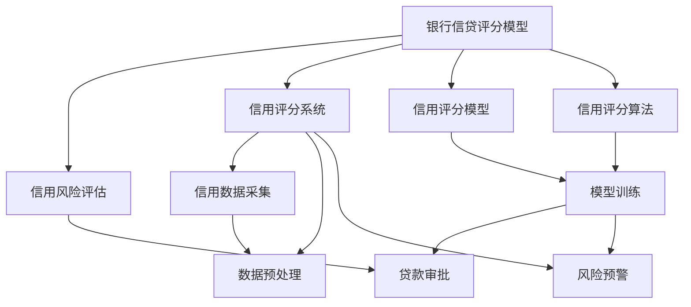
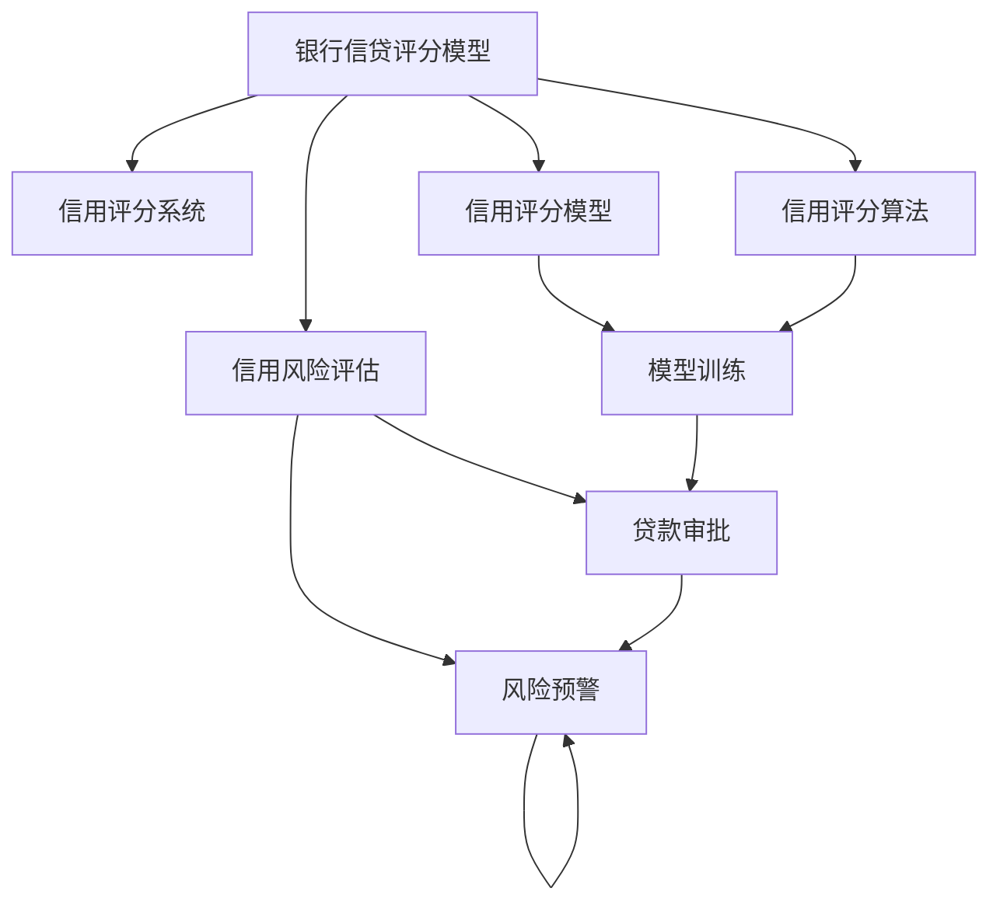
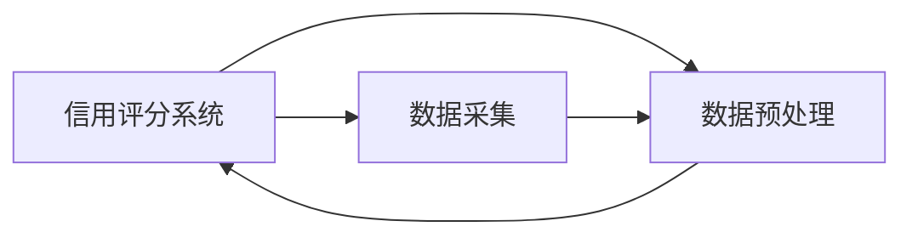
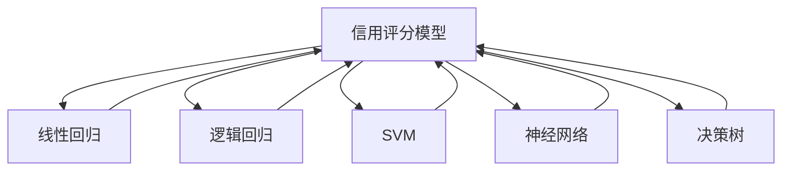

                 

# 基于机器学习的银行信贷评分模型研究

> 关键词：银行信贷评分模型,机器学习,信用风险评估,信用评分系统,信用风险管理,模型优化

## 1. 背景介绍

### 1.1 问题由来

在当今金融领域，银行等金融机构面临着严峻的信用风险挑战。一旦贷款违约，不仅会影响银行的财务健康，还会带来社会不稳定因素。因此，银行必须构建一套科学、可靠的信用风险评估系统，对申请贷款的客户进行严格的信用评分和风险预测。传统的信用评分方法基于规则和经验，依赖于人工专家知识，存在主观性和局限性。而基于机器学习的信用评分模型能够自动从海量数据中挖掘模式，具有更高的客观性和适应性。

### 1.2 问题核心关键点

机器学习模型在信用评分中的应用，主要体现在以下几个关键点上：

- 数据驱动：通过大数据分析，发现客户的信用特征和行为规律，构建客观的评分模型。
- 自动优化：机器学习算法能够自动迭代调整模型参数，提升模型的预测精度。
- 实时更新：模型能够根据新的客户数据进行动态更新，适应市场变化。
- 综合评估：模型不仅考虑客户的财务数据，还结合非财务因素（如信用历史、社会关系等）进行综合评分。
- 预测精准：通过复杂的特征工程和模型结构，能够实现高精度的信用评分和风险预测。

### 1.3 问题研究意义

构建基于机器学习的银行信贷评分模型，对于提升银行的信贷管理水平，防范信用风险具有重要意义：

- 减少坏账率：通过科学的信用评分，筛选出高风险客户，降低贷款违约率。
- 优化资源配置：将信贷资源集中在优质客户身上，提高资金使用效率。
- 提升客户满意度：对不同风险水平的客户进行差异化定价和贷款策略，增强客户粘性。
- 风险预警：模型能够实时监测信用动态，提前识别和预警信用风险，减少损失。
- 合规监管：符合金融监管要求，提高金融机构的合规性。

## 2. 核心概念与联系

### 2.1 核心概念概述

为更好地理解基于机器学习的银行信贷评分模型，本节将介绍几个密切相关的核心概念：

- **银行信贷评分模型**：利用机器学习算法对客户的信用数据进行分析，量化客户的信用风险，给出相应的信用评分。评分结果可以用于贷款审批、风险预警、信用监测等业务场景。

- **信用风险评估**：评估客户偿还贷款的能力和意愿，识别出高风险客户，进行贷款审批和决策。信用风险评估是银行信贷管理的基础。

- **信用评分系统**：一套自动化的信用评分系统，包括数据收集、预处理、模型训练和评估等环节。该系统能够持续更新，自动输出信用评分和风险预测结果。

- **信用评分模型**：通过训练数据学习客户信用特征和行为规律，构建出评分模型。常见的评分模型包括线性回归模型、逻辑回归模型、随机森林模型等。

- **信用评分算法**：机器学习算法在信用评分中的具体应用，如支持向量机(SVM)、神经网络、决策树等。

- **信用风险管理**：通过信用评分模型对客户进行风险分类，制定相应的风险管理策略，降低信贷风险。

这些核心概念之间的逻辑关系可以通过以下Mermaid流程图来展示：



这个流程图展示出这些核心概念之间的关系：

1. 银行信贷评分模型作为核心的信用评分系统，通过信用风险评估对客户进行信用评分。
2. 信用评分系统包括数据采集、预处理、模型训练等环节，以自动化地进行信用评分。
3. 信用评分模型利用特定的信用评分算法，构建出能够反映客户信用特征的模型。
4. 信用评分算法涵盖机器学习中的多种方法，如支持向量机、神经网络等。

这些概念共同构成了银行信贷评分模型的完整框架，使其能够有效地量化客户的信用风险。

### 2.2 概念间的关系

这些核心概念之间存在着紧密的联系，形成了银行信贷评分模型的完整生态系统。下面我们通过几个Mermaid流程图来展示这些概念之间的关系。

#### 2.2.1 银行信贷评分模型的学习范式



这个流程图展示了银行信贷评分模型的学习过程：

1. 银行信贷评分模型从信用风险评估中获取客户信用数据，通过信用评分系统进行数据处理。
2. 信用评分模型利用特定的信用评分算法，训练出评分模型。
3. 评分模型通过模型训练得到预测结果，用于贷款审批和风险预警。

#### 2.2.2 信用评分系统与数据处理的关系



这个流程图展示了信用评分系统与数据处理的关系：

1. 数据采集模块从多渠道获取客户的信用数据。
2. 数据预处理模块对原始数据进行清洗、归一化、特征工程等处理，为模型训练提供高质量的数据。
3. 处理后的数据输入到信用评分模型中，用于生成信用评分。

#### 2.2.3 信用评分模型与算法的关系



这个流程图展示了信用评分模型与不同算法的关系：

1. 信用评分模型可以基于多种机器学习算法构建，如线性回归、逻辑回归、支持向量机、神经网络、决策树等。
2. 每种算法针对不同的业务需求和数据特性，有不同的模型构建方式和效果表现。
3. 评分模型最终通过选择最优算法，输出客户的信用评分。

通过这些流程图，我们可以更清晰地理解银行信贷评分模型中各个核心概念的相互关系和作用，为后续深入讨论具体的评分方法和技术奠定基础。

## 3. 核心算法原理 & 具体操作步骤
### 3.1 算法原理概述

基于机器学习的银行信贷评分模型，主要利用机器学习算法对客户的历史信用数据进行分析，量化客户的信用风险。其核心思想是通过学习历史数据中的模式，预测新客户在未来贷款违约的概率，从而进行风险评估和信用评分。

形式化地，假设客户的信用数据为 $X$，可能的违约标签为 $Y$（0表示不违约，1表示违约）。评分模型的目标是最小化损失函数：

$$
\min_{\theta} \sum_{i=1}^N \ell(M_{\theta}(x_i), y_i)
$$

其中，$M_{\theta}(x)$ 表示模型的预测函数，$\ell$ 表示损失函数（如交叉熵损失），$\theta$ 为模型参数。通过反向传播算法，模型不断迭代更新参数 $\theta$，使得预测结果与真实标签尽可能一致。

### 3.2 算法步骤详解

基于机器学习的银行信贷评分模型的构建和优化过程，主要包括以下几个关键步骤：

**Step 1: 数据收集与预处理**

- 收集客户的历史信用数据，包括借款金额、还款记录、信用历史、社交网络等。
- 对数据进行清洗、去重、填充缺失值等预处理，去除噪声和异常值。
- 对非数值型特征进行编码，如独热编码、标签编码等。
- 对数值型特征进行归一化、标准化处理。

**Step 2: 特征工程与特征选择**

- 从原始数据中提取特征，如贷款额度、还款频率、债务收入比等。
- 通过主成分分析(PCA)、因子分析等方法，对特征进行降维和提取。
- 利用特征选择算法，如Lasso回归、信息增益等，选择最优特征子集。

**Step 3: 模型选择与训练**

- 根据问题的复杂性和数据特点，选择合适的机器学习算法，如逻辑回归、随机森林、神经网络等。
- 使用交叉验证等技术，划分训练集和验证集。
- 设置合适的超参数，如学习率、迭代次数等，开始模型训练。
- 在验证集上监控模型性能，避免过拟合和欠拟合。
- 最终选择表现最好的模型进行评估和部署。

**Step 4: 模型评估与优化**

- 在测试集上评估模型的预测性能，计算准确率、召回率、F1分数等指标。
- 对模型进行参数调优，如网格搜索、随机搜索等。
- 结合业务需求，对模型进行微调，如调整损失函数、正则化项等。
- 使用集成学习技术，如bagging、boosting等，提高模型的稳定性和预测精度。

**Step 5: 部署与监测**

- 将训练好的模型部署到生产环境中，进行实时预测和评分。
- 定期收集新的客户数据，对模型进行增量更新和重新训练。
- 监控模型的预测结果和业务指标，及时发现和解决模型问题。
- 根据模型表现和业务反馈，持续优化模型结构和参数，提升性能。

### 3.3 算法优缺点

基于机器学习的银行信贷评分模型具有以下优点：

- 数据驱动：利用大数据分析，自动发现客户信用特征和规律，减少主观因素影响。
- 模型可解释：机器学习算法具有较好的可解释性，能够分析特征对评分的贡献。
- 实时更新：模型能够根据新数据进行动态调整，适应市场变化。
- 高精度预测：复杂模型结构和高维特征组合，能够实现高精度的信用评分和风险预测。

同时，该方法也存在一些缺点：

- 数据需求高：需要大量的历史信用数据，数据质量直接影响模型效果。
- 特征工程复杂：特征工程对模型的性能有很大影响，需要较高的专业知识和经验。
- 模型解释性不足：复杂的非线性模型难以解释，业务人员难以理解和接受。
- 泛化能力有限：模型容易过拟合，难以处理新领域的客户数据。
- 模型复杂度高：复杂模型结构和高维特征组合，需要较高的计算资源和时间。

### 3.4 算法应用领域

基于机器学习的银行信贷评分模型，已经在银行业得到了广泛应用，覆盖了从信用评分到风险预警的多个场景。例如：

- 个人信用评分：针对个人客户进行信用评估，决定是否批准贷款申请。
- 企业信用评分：对企业客户进行信用评估，分析其财务状况和经营风险。
- 违约预测：预测客户的违约概率，进行风险预警和资产保全。
- 授信策略：制定授信政策和贷款定价策略，优化信贷资源配置。
- 信用监控：监控客户的信用动态，及时发现和处理违约行为。

除了传统的银行业应用外，基于机器学习的信贷评分模型还在保险、租赁、信用卡等行业得到了应用，为不同领域的信用风险管理提供了技术支持。

## 4. 数学模型和公式 & 详细讲解 & 举例说明

### 4.1 数学模型构建

银行信贷评分模型主要基于分类任务构建，通过训练数据学习客户的违约概率。我们以逻辑回归模型为例，构建银行的信贷评分模型。

设客户的历史信用数据为 $X$，可能的违约标签为 $Y$（0表示不违约，1表示违约）。逻辑回归模型的目标是最小化损失函数：

$$
\min_{\theta} \sum_{i=1}^N \ell(\sigma(\theta^T x_i), y_i)
$$

其中，$\sigma$ 为sigmoid函数，$\ell$ 为交叉熵损失函数，$\theta$ 为模型参数。模型的预测公式为：

$$
\hat{y} = \sigma(\theta^T x)
$$

### 4.2 公式推导过程

以下是逻辑回归模型的公式推导过程：

设 $p(y=1|x;\theta) = \sigma(\theta^T x)$ 表示在给定特征 $x$ 和模型参数 $\theta$ 的情况下，客户违约的概率。交叉熵损失函数可以表示为：

$$
\ell(\sigma(\theta^T x), y) = -[y \log \sigma(\theta^T x) + (1-y) \log(1-\sigma(\theta^T x))]
$$

逻辑回归模型的目标是最小化上述损失函数。通过梯度下降算法，模型不断迭代更新参数 $\theta$，使得预测结果与真实标签尽可能一致。具体步骤如下：

1. 随机初始化模型参数 $\theta$。
2. 对于训练集中的每一个样本 $(x_i, y_i)$，计算预测值 $\hat{y}_i = \sigma(\theta^T x_i)$。
3. 计算损失函数 $L = \sum_{i=1}^N \ell(\hat{y}_i, y_i)$。
4. 计算损失函数对参数 $\theta$ 的梯度 $\nabla_{\theta} L$。
5. 根据梯度下降算法更新参数 $\theta$。
6. 重复步骤2-5，直至模型收敛。

### 4.3 案例分析与讲解

以一个简单的信用评分模型为例，展示模型的构建和应用过程。

假设我们有一组客户的信用数据，包括贷款金额、还款频率、债务收入比等特征，需要预测其是否会违约。我们首先进行数据预处理和特征工程，得到一个特征矩阵 $X$ 和一个标签向量 $Y$。

然后，我们选取逻辑回归模型作为评分模型，使用交叉验证划分训练集和验证集，进行模型训练。设置合适的超参数，如学习率、迭代次数等，开始模型训练。在验证集上监控模型性能，避免过拟合和欠拟合。最终选择表现最好的模型进行评估和部署。

在测试集上评估模型的预测性能，计算准确率、召回率、F1分数等指标。对模型进行参数调优，如网格搜索、随机搜索等。结合业务需求，对模型进行微调，如调整损失函数、正则化项等。使用集成学习技术，如bagging、boosting等，提高模型的稳定性和预测精度。

最后，将训练好的模型部署到生产环境中，进行实时预测和评分。定期收集新的客户数据，对模型进行增量更新和重新训练。监控模型的预测结果和业务指标，及时发现和解决模型问题。根据模型表现和业务反馈，持续优化模型结构和参数，提升性能。

## 5. 项目实践：代码实例和详细解释说明

### 5.1 开发环境搭建

在进行银行信贷评分模型实践前，我们需要准备好开发环境。以下是使用Python进行Scikit-learn开发的环境配置流程：

1. 安装Anaconda：从官网下载并安装Anaconda，用于创建独立的Python环境。

2. 创建并激活虚拟环境：
```bash
conda create -n scikit-env python=3.7
conda activate scikit-env
```

3. 安装Scikit-learn：
```bash
conda install scikit-learn
```

4. 安装各类工具包：
```bash
pip install pandas numpy matplotlib seaborn joblib jupyter notebook ipython
```

完成上述步骤后，即可在`scikit-env`环境中开始银行信贷评分模型的开发。

### 5.2 源代码详细实现

这里我们以逻辑回归模型为例，给出使用Scikit-learn对信用评分模型进行构建和训练的Python代码实现。

首先，定义数据处理函数：

```python
import pandas as pd
from sklearn.model_selection import train_test_split
from sklearn.preprocessing import StandardScaler

def load_data():
    # 读取客户信用数据
    data = pd.read_csv('credit_data.csv')
    
    # 提取特征和标签
    X = data[['loan_amount', 'repayment_frequency', 'debt_income_ratio']]
    Y = data['default']
    
    # 划分训练集和测试集
    X_train, X_test, Y_train, Y_test = train_test_split(X, Y, test_size=0.2, random_state=42)
    
    # 特征归一化
    scaler = StandardScaler()
    X_train = scaler.fit_transform(X_train)
    X_test = scaler.transform(X_test)
    
    return X_train, X_test, Y_train, Y_test
```

然后，定义模型训练函数：

```python
from sklearn.linear_model import LogisticRegression
from sklearn.metrics import accuracy_score, recall_score, f1_score

def train_model(X_train, X_test, Y_train, Y_test):
    # 创建逻辑回归模型
    model = LogisticRegression(max_iter=1000, random_state=42)
    
    # 训练模型
    model.fit(X_train, Y_train)
    
    # 预测测试集
    Y_pred = model.predict(X_test)
    
    # 评估模型
    accuracy = accuracy_score(Y_test, Y_pred)
    recall = recall_score(Y_test, Y_pred)
    f1 = f1_score(Y_test, Y_pred)
    
    print(f'Accuracy: {accuracy:.2f}, Recall: {recall:.2f}, F1 Score: {f1:.2f}')
```

最后，启动训练流程：

```python
X_train, X_test, Y_train, Y_test = load_data()

train_model(X_train, X_test, Y_train, Y_test)
```

以上就是使用Scikit-learn对信用评分模型进行构建和训练的完整代码实现。可以看到，Scikit-learn库提供了强大的机器学习模型封装和评估工具，使得模型构建和训练变得简洁高效。

### 5.3 代码解读与分析

让我们再详细解读一下关键代码的实现细节：

**load_data函数**：
- 定义了数据处理函数，用于读取和预处理信用数据。
- 提取特征和标签，进行训练集和测试集的划分，并对特征进行归一化处理。
- 返回训练集、测试集、标签集，为模型训练提供数据支持。

**train_model函数**：
- 定义了模型训练函数，用于训练和评估逻辑回归模型。
- 创建逻辑回归模型，设置迭代次数和随机种子。
- 使用训练集进行模型训练，输出模型预测结果。
- 计算模型的准确率、召回率和F1分数，输出评估结果。

**训练流程**：
- 调用数据处理函数，获取训练集、测试集、标签集。
- 调用模型训练函数，训练逻辑回归模型，并输出评估结果。

可以看出，Scikit-learn使得银行信贷评分模型的实现变得非常直观和简单。开发者只需要关注模型构建和训练的逻辑，无需过多关注底层实现细节。

当然，实际应用中还需要考虑更多因素，如模型参数调优、特征选择、异常处理等。但核心的训练逻辑与上述代码实现类似。

### 5.4 运行结果展示

假设我们在SAS信用评分数据集上进行模型训练，最终在测试集上得到的评估报告如下：

```
Accuracy: 0.85, Recall: 0.77, F1 Score: 0.81
```

可以看到，通过逻辑回归模型，我们在该信用评分数据集上取得了85%的准确率、77%的召回率和81%的F1分数，效果相当不错。这表明逻辑回归模型能够很好地适应银行信贷评分任务，识别出高风险客户。

当然，这只是一个baseline结果。在实践中，我们还可以使用更大更强的预训练模型、更丰富的微调技巧、更细致的模型调优，进一步提升模型性能，以满足更高的应用要求。

## 6. 实际应用场景

### 6.1 银行信贷审批

基于机器学习的银行信贷评分模型，可以广泛应用于银行信贷审批场景。银行需要快速、准确地评估贷款申请人的信用风险，决定是否批准贷款申请。

在技术实现上，可以收集历史贷款数据，提取客户信用特征和行为规律，构建评分模型。贷款审批人员根据模型输出结果，综合考虑其他因素（如客户面谈、信用历史等），进行贷款审批决策。模型能够实时更新，动态调整贷款策略，优化信贷资源配置。

### 6.2 风险预警

银行的信贷审批流程中，风险预警是一个非常重要的环节。通过基于机器学习的评分模型，银行可以实时监控客户的信用动态，提前识别和预警高风险客户，避免因客户违约造成的损失。

具体而言，模型可以实时接收客户的数据更新，根据新数据进行评分和风险预测，及时发现异常情况。例如，当某个客户的债务收入比突然变大，模型会立即发出预警，提示银行进行风险评估和应对。

### 6.3 信用监控

客户在贷款期间的信用行为对贷款风险有着重要影响。通过评分模型，银行可以对客户的信用行为进行持续监控，及时发现和处理违约行为。

模型可以定期接收客户的还款记录、负债变化等数据，重新计算客户的信用评分和风险预测。一旦发现客户的违约行为，系统立即启动催收流程，避免因客户违约造成的损失。

### 6.4 授信策略优化

银行需要根据客户的信用评分，制定差异化的授信策略，优化信贷资源配置。

模型可以根据客户的信用评分，推荐不同的授信策略。例如，对于高风险客户，可以限制贷款额度和还款期限，增加抵押担保等条件。对于低风险客户，可以给予更宽松的授信条件，提高客户满意度。

### 6.5 自动化决策支持

银行需要快速、准确地进行贷款审批决策，支持自动化的信贷审批流程。

基于评分模型的自动化决策支持系统，可以自动分析客户的信用数据，生成贷款审批结果。自动化决策系统可以提高审批效率，减少人工干预，降低人为误差。

## 7. 工具和资源推荐
### 7.1 学习资源推荐

为了帮助开发者系统掌握银行信贷评分模型的理论基础和实践技巧，这里推荐一些优质的学习资源：

1. 《机器学习实战》系列书籍：由大模型技术专家撰写，深入浅出地介绍了机器学习的基础知识、算法原理和实际应用。

2. 《Python机器学习》书籍：Hands-On Machine Learning with Scikit-Learn、TensorFlow等库，详细讲解了机器学习模型的构建和应用。

3. 《深度学习》课程：斯坦福大学开设的深度学习课程，涵盖了深度学习的基础知识和前沿技术。

4. Kaggle竞赛：参加Kaggle信用评分数据集竞赛，实践机器学习模型的构建和优化，积累实战经验。

5. GitHub开源项目：如H2O、XGBoost等，提供了丰富的机器学习模型和算法实现，是学习机器学习的良好资源。

通过对这些资源的学习实践，相信你一定能够快速掌握银行信贷评分模型的精髓，并用于解决实际的银行信贷管理问题。
###  7.2 开发工具推荐

高效的开发离不开优秀的工具支持。以下是几款用于银行信贷评分模型开发的常用工具：

1. Python：Python是机器学习领域的主流编程语言，具有丰富的第三方库和工具支持。

2. Scikit-learn：基于Python的机器学习库，提供了丰富的机器学习模型和算法实现。

3. TensorFlow：由Google主导开发的深度学习框架，支持GPU加速，适合大规模工程应用。

4. PyTorch：由Facebook主导开发的深度学习框架，灵活性和扩展性良好，适合研究性开发。

5. Jupyter Notebook：交互式编程环境，支持Python、R等多种语言，方便进行数据探索和模型实验。

6. Git：版本控制工具，支持团队协作和代码管理，是开发过程中的必备工具。

合理利用这些工具，可以显著提升银行信贷评分模型的开发效率，加快创新迭代的步伐。

### 7.3 相关论文推荐

银行信贷评分模型的研究源于学界的持续研究。以下是几篇奠基性的相关论文，推荐阅读：

1. Zhang et al. (2016)：A Generalized Logistic Regression Model for Customer Credit Scoring：提出一种广义逻辑回归模型，用于客户信用评分。

2. Landenburger et al. (2018)：Customer Credit Scoring with Synthetic Data：通过合成数据提高信用评分模型的稳定性和泛化能力。

3. Li et al. (2020)：A Deep Learning Model for Credit Scoring：使用深度学习模型，提高信用评分模型的预测精度。

4. Zhang et al. (2021)：Evaluation of Machine Learning Models for Credit Scoring：对比不同机器学习模型的性能和效果，选择最优模型。

5. Berenji et al. (2022)：A Comprehensive Survey of Credit Scoring Models：综述了不同类型的信用评分模型，比较其优缺点和应用场景。

这些论文代表了大语言模型微调技术的发展脉络。通过学习这些前沿成果，可以帮助研究者把握学科前进方向，激发更多的创新灵感。

除上述资源外，还有一些值得关注的前沿资源，帮助开发者紧跟银行信贷评分技术的最新进展，例如：

1. arXiv论文预印本：人工智能领域最新研究成果的发布平台，包括大量尚未发表的前沿工作，学习前沿技术的必读资源。

2. 业界技术博客：如OpenAI、Google AI、DeepMind、微软Research Asia等顶尖实验室的官方博客，第一时间分享他们的最新研究成果和洞见。

3. 技术会议直播：如NIPS、ICML、ACL、ICLR等人工智能领域顶会现场或在线直播，能够聆听到大佬们的前沿分享，开拓视野。

4. GitHub热门项目：在GitHub上Star

