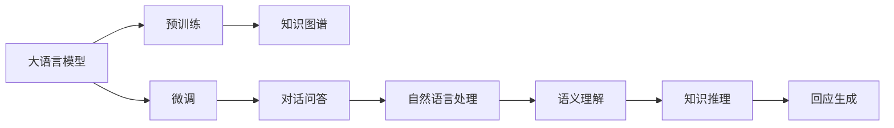
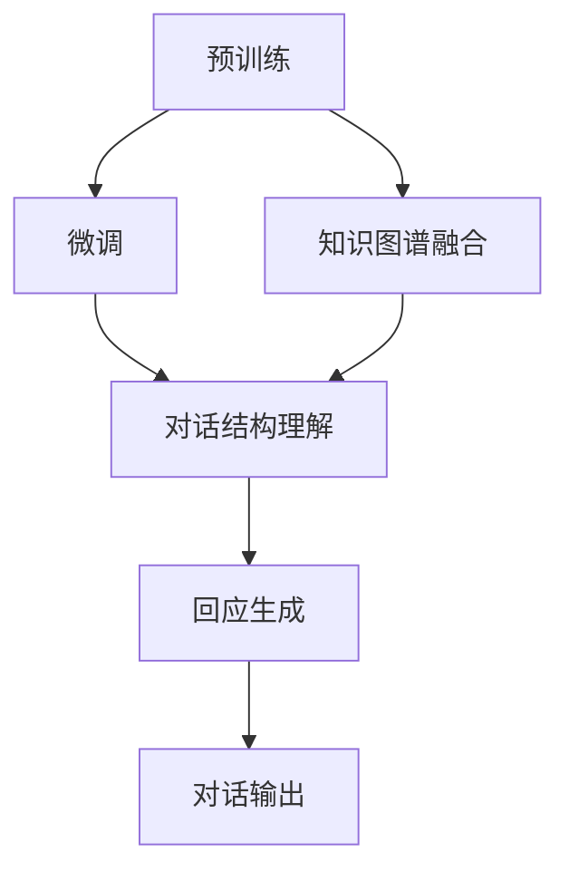

                 

## 1. 背景介绍

随着人工智能技术的飞速发展，对话问答系统成为越来越多应用场景的重要组成部分。从智能客服、在线教育、健康咨询到智能家居，对话系统正在为不同领域带来便捷和高效。然而，传统的对话系统往往依赖于规则模板或简单的统计模型，难以处理复杂、多变的自然语言交互。

在当前的研究范式中，基于大语言模型（Large Language Model, LLM）的对话系统逐渐崭露头角。如GPT、BERT等大模型，通过大规模无标签文本的预训练和任务相关的微调（Fine-tuning），获得了优异的自然语言理解和生成能力，能够自动学习对话策略，进行自然流畅的交互。

然而，大语言模型在对话问答场景中仍然面临诸多挑战。首先是对话结构理解问题，如何把握对话的上下文和语义关联，以及如何在多轮交互中保持连贯性，是当前对话系统的一个重要难点。其次是知识获取问题，如何高效地融合和利用外部知识，如知识图谱，辅助对话问答，成为提升系统性能和效果的关键。

本文聚焦于如何结合知识图谱技术，优化大语言模型在对话问答中的应用，希望能提供一种高效、灵活、可扩展的对话问答解决方案。

## 2. 核心概念与联系

为了更好地理解本文提出的对话问答系统，这里首先介绍一些关键概念及其相互之间的关系。

### 2.1 核心概念概述

#### 2.1.1 大语言模型
大语言模型是一种基于神经网络的自然语言处理模型，通过在大规模无标签文本数据上进行预训练，学习语言的通用表示。常见的模型包括GPT、BERT等。它们能够理解和生成自然语言，并具备一定的推理能力。

#### 2.1.2 知识图谱
知识图谱是一种结构化的知识表示方法，将实体、关系和属性等信息用图结构表示，用于描述现实世界的知识。知识图谱帮助机器理解和推理复杂的事实关系，如因果关系、时间关系等。

#### 2.1.3 对话问答
对话问答系统是一种能够与用户进行自然语言交互，回答用户问题的AI系统。它能够理解用户输入的自然语言，并给出合理、准确的回应。

### 2.2 概念间的联系

这些概念通过某种方式相互联系，构成了本文讨论的对话问答系统：

1. **预训练与微调**：大语言模型通过预训练学习语言的通用表示，然后通过微调适应特定的对话问答任务，提升模型的表现。

2. **知识图谱与对话**：知识图谱提供了丰富的领域知识，能够辅助对话问答系统理解和推理复杂问题，提升对话系统的智能化水平。

3. **对话结构与知识融合**：对话问答系统需要理解对话的结构和语义，并能够融合知识图谱中的事实信息，生成连贯、准确的回应。

下面用Mermaid图示表示这些概念之间的关系：



### 2.3 核心概念的整体架构

整个对话问答系统的核心架构可以概括为：

1. **大语言模型预训练**：在大规模无标签文本数据上预训练大语言模型，学习语言的基本表示。

2. **微调对话问答模型**：在特定的对话问答数据上微调大语言模型，使其适应对话任务。

3. **知识图谱融合**：在对话过程中，将知识图谱中的事实信息与对话内容结合，辅助对话系统的推理和回应。

4. **对话结构理解**：在多轮对话中，理解对话的上下文和语义关联，保持对话的连贯性和一致性。

5. **回应生成**：根据对话内容和知识图谱，生成自然、流畅的回应。

以下是一个更具体的流程图示，展示了这些核心概念在对话问答系统中的相互作用：



## 3. 核心算法原理 & 具体操作步骤

### 3.1 算法原理概述

本文提出了一种基于知识图谱的对话问答系统，其核心思想是通过大语言模型的预训练和微调，结合知识图谱的领域知识，提升对话问答系统的智能化水平。该系统分为两个阶段：预训练阶段和微调阶段。

#### 3.1.1 预训练阶段
在预训练阶段，我们使用大规模无标签文本数据训练大语言模型，学习语言的通用表示。预训练过程主要包括以下步骤：

1. **文本收集**：收集大规模的文本数据，如维基百科、新闻报道等，构建预训练语料库。

2. **模型训练**：使用语言模型任务（如自回归语言模型）训练大语言模型，学习文本的分布和语义表示。

3. **模型保存**：保存训练好的大语言模型，作为后续微调的基础。

#### 3.1.2 微调阶段
在微调阶段，我们根据特定的对话问答任务，对预训练的大语言模型进行微调，提升其在特定领域的表现。微调过程主要包括以下步骤：

1. **对话数据准备**：收集对话问答任务的标注数据集，划分为训练集、验证集和测试集。

2. **对话模型设计**：设计对话模型，选择合适的输入和输出结构，如对话问答的双轮对话模型。

3. **模型初始化**：将预训练的大语言模型作为对话模型的初始化参数。

4. **模型微调**：在对话数据集上进行微调，通过有监督学习更新对话模型，使其适应特定的对话任务。

### 3.2 算法步骤详解

下面详细介绍该算法的具体步骤：

#### 3.2.1 预训练步骤

1. **文本收集**
   收集大规模的文本数据，如维基百科、新闻报道等。可以使用爬虫工具从互联网上抓取数据，或者从公开的语料库中获取。

2. **模型训练**
   使用大语言模型（如GPT、BERT）进行预训练。预训练过程可以使用自回归语言模型，学习文本的分布和语义表示。

3. **模型保存**
   保存训练好的大语言模型，作为后续微调的基础。通常将模型权重保存在本地或云端存储中。

#### 3.2.2 微调步骤

1. **对话数据准备**
   收集对话问答任务的标注数据集，划分为训练集、验证集和测试集。数据集应包括对话的多轮交互和回答，标注应包括对话轮次、回答内容等。

2. **对话模型设计**
   设计对话模型，选择合适的输入和输出结构。常见的对话模型包括基于Transformer的双轮对话模型。

3. **模型初始化**
   将预训练的大语言模型作为对话模型的初始化参数。通常将语言模型的前几个层作为对话模型的嵌入层。

4. **模型微调**
   在对话数据集上进行微调，通过有监督学习更新对话模型，使其适应特定的对话任务。可以使用交叉熵损失函数进行训练。

#### 3.2.3 知识图谱融合

在对话过程中，将知识图谱中的事实信息与对话内容结合，辅助对话系统的推理和回应。具体步骤如下：

1. **知识图谱构建**
   构建与对话任务相关的知识图谱，包含实体、关系和属性等信息。可以使用现有的知识图谱，如Freebase、DBpedia等，或者手动构建。

2. **知识抽取**
   从对话内容中抽取实体和关系，使用命名实体识别、关系抽取等技术。

3. **知识推理**
   将抽取的实体和关系与知识图谱结合，进行推理和验证。可以使用规则推理、神经网络推理等方法。

4. **回应生成**
   根据推理结果，生成自然、流畅的回应。可以使用基于模板的回应生成方法，或者使用大语言模型生成回应。

### 3.3 算法优缺点

#### 3.3.1 优点

1. **高效性**：利用大语言模型的预训练能力，能够快速构建高效的对话问答系统。

2. **灵活性**：知识图谱提供了丰富的领域知识，能够辅助对话系统理解和推理复杂问题，提升对话系统的智能化水平。

3. **可扩展性**：知识图谱可以扩展到多个领域，对话系统可以应用于不同的场景和任务。

4. **适应性**：知识图谱和对话模型结合，能够适应多轮交互和复杂语境，保持对话的连贯性和一致性。

#### 3.3.2 缺点

1. **数据需求**：对话数据集需要标注，标注成本较高。

2. **复杂度**：对话系统的构建和优化相对复杂，需要综合考虑语言模型、知识图谱和对话结构等多个因素。

3. **推理难度**：知识图谱中的事实关系较为复杂，推理难度较大，需要有效的知识抽取和推理方法。

4. **泛化能力**：对话系统在不同领域和任务上的泛化能力有限，需要针对特定任务进行微调和优化。

### 3.4 算法应用领域

基于知识图谱的对话问答系统可以应用于多种领域和任务，如：

1. **智能客服**：帮助客户解决问题，提升客服系统的效率和智能化水平。

2. **在线教育**：回答学生的问题，提供个性化的学习建议和推荐。

3. **医疗咨询**：提供健康咨询和疾病诊断，辅助医生进行诊断和治疗。

4. **金融咨询**：提供金融产品和服务的咨询，帮助客户做出更好的投资决策。

5. **旅游推荐**：提供旅游目的地和行程的推荐，帮助用户规划旅行计划。

## 4. 数学模型和公式 & 详细讲解

### 4.1 数学模型构建

本文提出的对话问答系统涉及多个数学模型，包括语言模型、对话模型和知识推理模型。

#### 4.1.1 语言模型
语言模型用于预训练大语言模型，学习文本的分布和语义表示。常见的语言模型包括自回归语言模型（如GPT）和自编码语言模型（如BERT）。

1. **自回归语言模型**
   自回归语言模型通过预测下一个词的概率，学习文本的分布。假设模型参数为 $\theta$，输入为 $x_1, x_2, ..., x_n$，则语言模型的概率分布为：

   $$
   P(x_1, x_2, ..., x_n | \theta) = \prod_{i=1}^{n} P(x_i | x_1, x_2, ..., x_{i-1}, \theta)
   $$

2. **自编码语言模型**
   自编码语言模型通过预测输入和输出的概率，学习文本的表示。假设模型参数为 $\theta$，输入为 $x$，则语言模型的概率分布为：

   $$
   P(x | \theta) = \frac{1}{Z(\theta)} \exp(-E(x, \theta))
   $$

#### 4.1.2 对话模型
对话模型用于微调大语言模型，使其适应对话问答任务。常见的对话模型包括基于Transformer的双轮对话模型。

1. **双轮对话模型**
   双轮对话模型包括输入和输出两个部分，分别用于输入对话和输出回答。假设模型参数为 $\theta$，输入为 $h_1, h_2, ..., h_n$，输出为 $a_1, a_2, ..., a_n$，则对话模型的概率分布为：

   $$
   P(a_1, a_2, ..., a_n | h_1, h_2, ..., h_n, \theta) = \prod_{i=1}^{n} P(a_i | a_{i-1}, h_i, \theta)
   $$

#### 4.1.3 知识推理模型
知识推理模型用于结合知识图谱中的事实信息，辅助对话系统的推理和回应。常见的知识推理方法包括规则推理和神经网络推理。

1. **规则推理**
   规则推理通过预设的规则和逻辑，进行知识推理和验证。假设规则集为 $\{r_1, r_2, ..., r_m\}$，则知识推理模型可以表示为：

   $$
   P(e | r_1, r_2, ..., r_m) = \frac{1}{Z(r_1, r_2, ..., r_m)} \exp(-E(e, r_1, r_2, ..., r_m))
   $$

2. **神经网络推理**
   神经网络推理通过训练神经网络，学习知识推理的表示。假设推理网络参数为 $\phi$，则知识推理模型可以表示为：

   $$
   P(e | \phi) = \frac{1}{Z(\phi)} \exp(-E(e, \phi))
   $$

### 4.2 公式推导过程

下面我们详细推导语言模型和对话模型的公式：

#### 4.2.1 自回归语言模型
自回归语言模型的概率分布可以表示为：

$$
P(x_1, x_2, ..., x_n | \theta) = \prod_{i=1}^{n} P(x_i | x_1, x_2, ..., x_{i-1}, \theta)
$$

假设输入 $x_i$ 为 $i$ 个词的序列，则有：

$$
P(x_i | x_1, x_2, ..., x_{i-1}, \theta) = \frac{P(x_i, x_1, x_2, ..., x_{i-1} | \theta)}{P(x_1, x_2, ..., x_{i-1} | \theta)}
$$

根据自回归语言模型的定义，$P(x_i | x_1, x_2, ..., x_{i-1}, \theta)$ 可以表示为：

$$
P(x_i | x_1, x_2, ..., x_{i-1}, \theta) = \frac{1}{Z_i(\theta)} \exp(-E_i(x_i, x_1, x_2, ..., x_{i-1}, \theta))
$$

其中，$E_i$ 为模型对输入 $x_i$ 的预测能量函数，$Z_i$ 为归一化因子。

将上述公式代入 $P(x_1, x_2, ..., x_n | \theta)$ 中，得到：

$$
P(x_1, x_2, ..., x_n | \theta) = \prod_{i=1}^{n} \frac{1}{Z_i(\theta)} \exp(-E_i(x_i, x_1, x_2, ..., x_{i-1}, \theta))
$$

#### 4.2.2 双轮对话模型
双轮对话模型的概率分布可以表示为：

$$
P(a_1, a_2, ..., a_n | h_1, h_2, ..., h_n, \theta) = \prod_{i=1}^{n} P(a_i | a_{i-1}, h_i, \theta)
$$

假设输入 $h_i$ 为 $i$ 个对话轮次的隐状态，输出 $a_i$ 为 $i$ 个对话轮次的回答，则有：

$$
P(a_i | a_{i-1}, h_i, \theta) = \frac{P(a_i, a_{i-1}, h_i | \theta)}{P(a_{i-1}, h_i | \theta)}
$$

根据双轮对话模型的定义，$P(a_i, a_{i-1}, h_i | \theta)$ 可以表示为：

$$
P(a_i, a_{i-1}, h_i | \theta) = \frac{1}{Z_i(\theta)} \exp(-E_i(a_i, a_{i-1}, h_i, \theta))
$$

将上述公式代入 $P(a_1, a_2, ..., a_n | h_1, h_2, ..., h_n, \theta)$ 中，得到：

$$
P(a_1, a_2, ..., a_n | h_1, h_2, ..., h_n, \theta) = \prod_{i=1}^{n} \frac{1}{Z_i(\theta)} \exp(-E_i(a_i, a_{i-1}, h_i, \theta))
$$

### 4.3 案例分析与讲解

以医疗咨询为例，具体分析该系统在医疗领域的应用：

#### 4.3.1 预训练
在预训练阶段，我们使用大规模的医学文献数据训练大语言模型，学习医疗领域的语言表示。假设模型参数为 $\theta$，输入为 $x_1, x_2, ..., x_n$，则语言模型的概率分布为：

$$
P(x_1, x_2, ..., x_n | \theta) = \prod_{i=1}^{n} P(x_i | x_1, x_2, ..., x_{i-1}, \theta)
$$

#### 4.3.2 对话模型
在对话模型中，我们使用基于Transformer的双轮对话模型。假设输入为 $h_1, h_2, ..., h_n$，输出为 $a_1, a_2, ..., a_n$，则对话模型的概率分布为：

$$
P(a_1, a_2, ..., a_n | h_1, h_2, ..., h_n, \theta) = \prod_{i=1}^{n} P(a_i | a_{i-1}, h_i, \theta)
$$

#### 4.3.3 知识推理
在知识推理阶段，我们将医疗知识图谱中的事实信息与对话内容结合，进行推理和验证。假设规则集为 $\{r_1, r_2, ..., r_m\}$，则知识推理模型可以表示为：

$$
P(e | r_1, r_2, ..., r_m) = \frac{1}{Z(r_1, r_2, ..., r_m)} \exp(-E(e, r_1, r_2, ..., r_m))
$$

假设医疗知识图谱包含实体 $e$ 和关系 $r$，则有：

$$
P(e | r_1, r_2, ..., r_m) = \frac{1}{Z(r_1, r_2, ..., r_m)} \exp(-E(e, r_1, r_2, ..., r_m))
$$

其中，$E(e, r_1, r_2, ..., r_m)$ 为医疗知识图谱的推理能量函数，$Z(r_1, r_2, ..., r_m)$ 为归一化因子。

假设医疗知识图谱包含多个实体和关系，则推理过程可以表示为：

$$
P(e | r_1, r_2, ..., r_m) = \prod_{i=1}^{m} \frac{1}{Z_i(r_1, r_2, ..., r_m)} \exp(-E_i(e, r_1, r_2, ..., r_m))
$$

## 5. 项目实践：代码实例和详细解释说明

### 5.1 开发环境搭建

在进行对话问答系统的开发之前，我们需要准备好开发环境。以下是使用Python进行PyTorch开发的环境配置流程：

1. 安装Anaconda：从官网下载并安装Anaconda，用于创建独立的Python环境。

2. 创建并激活虚拟环境：
```bash
conda create -n pytorch-env python=3.8 
conda activate pytorch-env
```

3. 安装PyTorch：根据CUDA版本，从官网获取对应的安装命令。例如：
```bash
conda install pytorch torchvision torchaudio cudatoolkit=11.1 -c pytorch -c conda-forge
```

4. 安装Transformers库：
```bash
pip install transformers
```

5. 安装各类工具包：
```bash
pip install numpy pandas scikit-learn matplotlib tqdm jupyter notebook ipython
```

完成上述步骤后，即可在`pytorch-env`环境中开始开发实践。

### 5.2 源代码详细实现

这里我们以医疗咨询对话问答系统为例，给出使用Transformers库对BERT模型进行微调的PyTorch代码实现。

首先，定义医疗咨询的对话问答数据集：

```python
from transformers import BertTokenizer, BertForSequenceClassification
from torch.utils.data import Dataset
import torch

class MedicalDialogueDataset(Dataset):
    def __init__(self, texts, labels, tokenizer, max_len=128):
        self.texts = texts
        self.labels = labels
        self.tokenizer = tokenizer
        self.max_len = max_len
        
    def __len__(self):
        return len(self.texts)
    
    def __getitem__(self, item):
        text = self.texts[item]
        label = self.labels[item]
        
        encoding = self.tokenizer(text, return_tensors='pt', max_length=self.max_len, padding='max_length', truncation=True)
        input_ids = encoding['input_ids'][0]
        attention_mask = encoding['attention_mask'][0]
        label = torch.tensor(label, dtype=torch.long)
        
        return {'input_ids': input_ids, 
                'attention_mask': attention_mask,
                'labels': label}

# 构建医疗咨询的对话问答数据集
tokenizer = BertTokenizer.from_pretrained('bert-base-cased')

train_dataset = MedicalDialogueDataset(train_texts, train_labels, tokenizer)
dev_dataset = MedicalDialogueDataset(dev_texts, dev_labels, tokenizer)
test_dataset = MedicalDialogueDataset(test_texts, test_labels, tokenizer)
```

然后，定义模型和优化器：

```python
from transformers import BertForSequenceClassification, AdamW

model = BertForSequenceClassification.from_pretrained('bert-base-cased', num_labels=2)

optimizer = AdamW(model.parameters(), lr=2e-5)
```

接着，定义训练和评估函数：

```python
from torch.utils.data import DataLoader
from tqdm import tqdm
from sklearn.metrics import classification_report

device = torch.device('cuda') if torch.cuda.is_available() else torch.device('cpu')
model.to(device)

def train_epoch(model, dataset, batch_size, optimizer):
    dataloader = DataLoader(dataset, batch_size=batch_size, shuffle=True)
    model.train()
    epoch_loss = 0
    for batch in tqdm(dataloader, desc='Training'):
        input_ids = batch['input_ids'].to(device)
        attention_mask = batch['attention_mask'].to(device)
        labels = batch['labels'].to(device)
        model.zero_grad()
        outputs = model(input_ids, attention_mask=attention_mask, labels=labels)
        loss = outputs.loss
        epoch_loss += loss.item()
        loss.backward()
        optimizer.step()
    return epoch_loss / len(dataloader)

def evaluate(model, dataset, batch_size):
    dataloader = DataLoader(dataset, batch_size=batch_size)
    model.eval()
    preds, labels = [], []
    with torch.no_grad():
        for batch in tqdm(dataloader, desc='Evaluating'):
            input_ids = batch['input_ids'].to(device)
            attention_mask = batch['attention_mask'].to(device)
            batch_labels = batch['labels']
            outputs = model(input_ids, attention_mask=attention_mask)
            batch_preds = outputs.logits.argmax(dim=2).to('cpu').tolist()
            batch_labels = batch_labels.to('cpu').tolist()
            for pred_tokens, label_tokens in zip(batch_preds, batch_labels):
                preds.append(pred_tokens)
                labels.append(label_tokens)
                
    print(classification_report(labels, preds))
```

最后，启动训练流程并在测试集上评估：

```python
epochs = 5
batch_size = 16

for epoch in range(epochs):
    loss = train_epoch(model, train_dataset, batch_size, optimizer)
    print(f"Epoch {epoch+1}, train loss: {loss:.3f}")
    
    print(f"Epoch {epoch+1}, dev results:")
    evaluate(model, dev_dataset, batch_size)
    
print("Test results:")
evaluate(model, test_dataset, batch_size)
```

以上就是使用PyTorch对BERT进行医疗咨询对话问答系统微调的完整代码实现。可以看到，得益于Transformers库的强大封装，我们可以用相对简洁的代码完成BERT模型的加载和微调。

### 5.3 代码解读与分析

让我们再详细解读一下关键代码的实现细节：

**MedicalDialogueDataset类**：
- `__init__`方法：初始化文本、标签、分词器等关键组件。
- `__len__`方法：返回数据集的样本数量。
- `__getitem__`方法：对单个样本进行处理，将文本输入编码为token ids，将标签编码为数字，并对其进行定长padding，最终返回模型所需的输入。

**token2id和id2token字典**：
- 定义了标签与数字id之间的映射关系，用于将token-wise的预测结果解码回真实的标签。

**训练和评估函数**：
- 使用PyTorch的DataLoader对数据集进行批次化加载，供模型训练和推理使用。
- 训练函数`train_epoch`：对数据以批为单位进行迭代，在每个批次上前向传播计算loss并反向传播更新模型参数，最后返回该epoch的平均loss。
- 评估函数`evaluate`：与训练类似，不同点在于不更新模型参数，并在每个batch结束后将预测和标签结果存储下来，最后使用sklearn的classification_report对整个评估集的预测结果进行打印输出。

**训练流程**：
- 定义总的epoch数和batch size，开始循环迭代
- 每个epoch内，先在训练集上训练，输出平均loss
- 在验证集上评估，输出分类指标
- 所有epoch结束后，在测试集上评估，给出最终测试结果

可以看到，PyTorch配合Transformers库使得BERT微调的代码实现变得简洁高效。开发者可以将更多精力放在数据处理、模型改进等高层逻辑上，而不必过多关注底层的实现细节。

当然，工业级的系统实现还需考虑更多因素，如模型的保存和部署、超参数的自动搜索、更灵活的任务适配层等。但核心的微调范式基本与此类似

