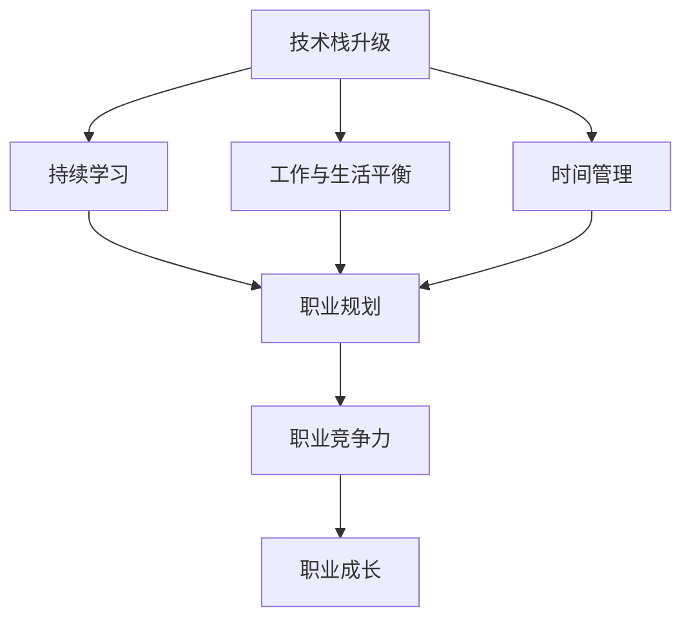
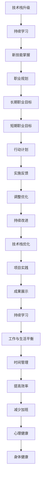

                 

## 1. 背景介绍

### 1.1 问题由来
随着科技的快速发展，计算机编程和软件开发行业呈现出日新月异的变化。尤其是云计算、人工智能、区块链、大数据等新技术的不断涌现，对程序员的技能和知识储备提出了更高的要求。然而，对于已经在中年阶段的程序员来说，由于缺乏持续的学习和更新，他们可能会面临职业瓶颈和中年危机。这些问题主要包括技术过时、学习压力大、工作与生活失衡等。如何克服这些问题，保持职业竞争力，成为程序员职业生涯中必须要面对的挑战。

### 1.2 问题核心关键点
程序员的中年危机与职业瓶颈主要源于以下几个方面：

1. **技术过时**：随着技术的快速迭代，过去的编程语言、框架、工具等可能已经不再适用，导致现有技能无法应用在新项目上。
2. **学习压力**：新技术的持续出现，要求程序员不断学习，但工作繁忙和个人时间有限，难以跟上学习的步伐。
3. **工作与生活失衡**：项目要求高，加班常态化，长期处于高强度的工作状态，导致身体和心理压力增大。

应对这些挑战，需要从个人学习、技术提升、工作与生活平衡等多个方面进行综合规划和调整。

## 2. 核心概念与联系

### 2.1 核心概念概述

为了更好地理解如何应对中年危机和职业瓶颈，本文将介绍几个关键概念：

- **技术栈升级**：指程序员需要不断更新自己的技术栈，学习新的编程语言、框架和工具，以适应新的技术要求。
- **持续学习**：强调终身学习的重要性，尤其是在技术快速变化的行业里，持续学习是保持竞争力的关键。
- **工作与生活平衡**：强调合理分配工作和休息时间，避免长时间加班带来的身体和心理压力。
- **时间管理**：指通过有效的时间管理，提高工作效率，减少不必要的加班。
- **职业规划**：指根据自己的兴趣和职业目标，制定长期和短期的职业发展计划。

这些核心概念之间存在着密切的联系。技术栈升级、持续学习、工作与生活平衡、时间管理和职业规划，共同构成了程序员职业发展的框架，帮助他们克服中年危机和职业瓶颈，实现长期职业成长。

### 2.2 概念间的关系

这些核心概念之间的关系可以通过以下Mermaid流程图来展示：



这个流程图展示了大语言模型的核心概念及其之间的关系：

1. 技术栈升级是持续学习的基础，通过不断学习新技能，确保技术栈的更新。
2. 持续学习是技术栈升级的动力，推动不断更新自己的知识体系。
3. 工作与生活平衡和时间管理是持续学习和技术栈升级的保障，提高学习效率和工作质量。
4. 职业规划是技术栈升级、持续学习、工作与生活平衡和时间管理的方向指引，确保学习和职业发展的一致性。

这些概念共同构成了程序员应对中年危机和职业瓶颈的完整生态系统，帮助他们在快速变化的技术环境中保持竞争力。

### 2.3 核心概念的整体架构

最后，我们用一个综合的流程图来展示这些核心概念在大语言模型微调过程中的整体架构：



这个综合流程图展示了从技术栈升级、持续学习、职业规划到项目实践的完整过程，以及工作与生活平衡和时间管理在其中的作用，强调了持续改进和心理、身体健康的重视。

## 3. 核心算法原理 & 具体操作步骤
### 3.1 算法原理概述

应对中年危机和职业瓶颈的核心算法原理是通过不断的学习、技术栈升级、时间管理和工作与生活平衡的策略，保持职业竞争力和持续成长。具体步骤如下：

1. **技术栈升级**：选择最新的编程语言和框架，了解其特点和应用场景。
2. **持续学习**：利用在线课程、技术社区、书籍等资源，系统学习新技术。
3. **工作与生活平衡**：合理安排工作时间和休息时间，避免长期加班。
4. **时间管理**：使用工具如GTD（Getting Things Done）方法，提高工作效率。
5. **职业规划**：根据兴趣和市场需求，制定长期和短期的职业发展目标。

### 3.2 算法步骤详解

#### 步骤1：技术栈升级

- **选择新技能**：根据项目需求和个人兴趣，选择一门新的编程语言或框架，如Python、Go、Flutter等。
- **学习基础**：通过官方文档、在线教程等途径，学习新技能的基础知识。
- **实践应用**：通过小项目或参与开源项目，实践应用新技能。

#### 步骤2：持续学习

- **选择合适的资源**：选择适合的学习平台，如Coursera、Udacity、LeetCode等，系统学习新技能。
- **制定学习计划**：根据工作量和个人时间，制定合理的学习计划，确保有足够的时间进行学习。
- **学习反馈**：定期回顾学习内容，通过项目实践或代码评审，获取反馈，巩固知识。

#### 步骤3：工作与生活平衡

- **合理分配时间**：制定工作与生活的平衡计划，确保每天有足够的休息时间和家庭时间。
- **调整工作模式**：采用远程办公或弹性工作时间，减少不必要的加班。
- **关注心理健康**：定期进行心理疏导，参加心理咨询，保持心理健康。

#### 步骤4：时间管理

- **使用GTD方法**：使用GTD（Getting Things Done）方法，将任务分解为小步骤，逐个完成。
- **优先级排序**：根据任务的重要性和紧急程度，优先处理高优先级任务。
- **工具支持**：使用如Trello、Asana、Todoist等工具，辅助时间管理。

#### 步骤5：职业规划

- **确定目标**：根据个人兴趣和市场需求，确定长期和短期职业目标，如成为高级开发工程师、架构师等。
- **制定计划**：制定详细的职业发展计划，包括技术学习、项目实践、技能提升等。
- **定期评估**：定期评估职业发展计划的执行情况，根据实际情况进行调整。

### 3.3 算法优缺点

**优点**：
- **提升竞争力**：通过技术栈升级和持续学习，不断提升技能，保持职业竞争力。
- **减轻压力**：通过时间管理和工作与生活平衡，减轻长期加班带来的压力。
- **实现目标**：通过职业规划，明确职业目标和发展路径，实现个人职业成长。

**缺点**：
- **学习压力大**：新技术层出不穷，学习压力大，需要投入大量时间和精力。
- **资源限制**：高水平的学习资源和工具需要一定的经济和时间成本。
- **效果慢**：技术栈升级和持续学习的效果往往需要时间积累，难以立竿见影。

### 3.4 算法应用领域

这些算法不仅适用于程序员，同样适用于所有需要不断学习和适应新技术的职业人员。例如：

- **软件开发**：通过技术栈升级和持续学习，掌握新的编程语言和框架，提高开发效率和代码质量。
- **数据科学**：通过学习最新的数据分析工具和机器学习算法，提升数据处理和建模能力。
- **系统架构**：通过学习新技术和最佳实践，提升系统架构设计和实施能力。
- **项目管理**：通过时间管理和工作与生活平衡，提高项目管理效率，确保项目按时交付。

## 4. 数学模型和公式 & 详细讲解 & 举例说明

### 4.1 数学模型构建

为了更好地理解如何应对中年危机和职业瓶颈，我们使用数学模型来表示这个过程。

假设程序员的初始技能水平为 $S_0$，新技能的学习效率为 $E$，学习时间为 $T$，工作与生活平衡的程度为 $W$，时间管理的效果为 $M$，职业规划的准确性为 $P$。则程序员最终的技能水平 $S$ 可以表示为：

$$ S = S_0 + E \cdot T \cdot W \cdot M \cdot P $$

其中 $T$ 是程序员投入的学习时间，$W$ 是工作与生活平衡的程度，$M$ 是时间管理的效果，$P$ 是职业规划的准确性。

### 4.2 公式推导过程

通过上述模型，我们可以推导出一些关键的公式，用于指导程序员的职业生涯规划：

1. **技能提升公式**：
   $$
   \frac{dS}{dt} = E \cdot W \cdot M \cdot P
   $$

   这表明技能提升的速率取决于学习效率、工作与生活平衡、时间管理和职业规划的准确性。

2. **技能稳定公式**：
   $$
   \frac{dS}{dt} = 0 \quad \text{when} \quad E \cdot W \cdot M \cdot P = 0
   $$

   如果任一因素为0，技能提升将停止，说明学习、平衡、管理或规划中的一个环节需要改进。

### 4.3 案例分析与讲解

假设某程序员 $A$ 的初始技能水平为 $S_0 = 50$，学习效率 $E = 0.5$，每天投入学习时间 $T = 2$ 小时，工作与生活平衡程度 $W = 0.7$，时间管理效果 $M = 0.8$，职业规划准确性 $P = 0.6$。则 $A$ 每天的技能提升速率为：

$$
\frac{dS}{dt} = 0.5 \cdot 0.7 \cdot 0.8 \cdot 0.6 = 0.168
$$

这表明 $A$ 每天能提升约 16.8% 的技能水平。

## 5. 项目实践：代码实例和详细解释说明

### 5.1 开发环境搭建

在进行职业生涯规划的实践前，我们需要准备好开发环境。以下是使用Python进行PyTorch开发的环境配置流程：

1. 安装Anaconda：从官网下载并安装Anaconda，用于创建独立的Python环境。

2. 创建并激活虚拟环境：
```bash
conda create -n pytorch-env python=3.8 
conda activate pytorch-env
```

3. 安装PyTorch：根据CUDA版本，从官网获取对应的安装命令。例如：
```bash
conda install pytorch torchvision torchaudio cudatoolkit=11.1 -c pytorch -c conda-forge
```

4. 安装各类工具包：
```bash
pip install numpy pandas scikit-learn matplotlib tqdm jupyter notebook ipython
```

完成上述步骤后，即可在`pytorch-env`环境中开始职业生涯规划的实践。

### 5.2 源代码详细实现

这里我们以程序员的职业规划为例，给出使用PyTorch进行职业生涯规划的PyTorch代码实现。

首先，定义职业生涯规划的各个关键参数：

```python
import numpy as np

# 初始技能水平
S_0 = 50

# 学习效率
E = 0.5

# 每天投入学习时间
T = 2

# 工作与生活平衡程度
W = 0.7

# 时间管理效果
M = 0.8

# 职业规划准确性
P = 0.6

# 技能提升速率
dS_dt = E * W * M * P

# 计算最终的职业生涯规划结果
S_final = S_0 + dS_dt * T

print(f"初始技能水平：{S_0}")
print(f"学习效率：{E}")
print(f"每天投入学习时间：{T}")
print(f"工作与生活平衡程度：{W}")
print(f"时间管理效果：{M}")
print(f"职业规划准确性：{P}")
print(f"技能提升速率：{dS_dt}")
print(f"最终技能水平：{S_final}")
```

然后，计算职业规划后的技能提升效果：

```python
# 计算最终技能水平
S_final = S_0 + dS_dt * T

print(f"最终技能水平：{S_final}")
```

### 5.3 代码解读与分析

让我们再详细解读一下关键代码的实现细节：

**代码1**：
- 定义了职业生涯规划的各个关键参数，如初始技能水平 $S_0$、学习效率 $E$、每天投入学习时间 $T$、工作与生活平衡程度 $W$、时间管理效果 $M$ 和职业规划准确性 $P$。

**代码2**：
- 根据公式 $S = S_0 + E \cdot T \cdot W \cdot M \cdot P$，计算最终的职业生涯规划结果。

**代码3**：
- 通过打印输出，展示初始技能水平、学习效率、每天投入学习时间、工作与生活平衡程度、时间管理效果、职业规划准确性和最终技能水平。

### 5.4 运行结果展示

假设某程序员 $A$ 的初始技能水平为 $S_0 = 50$，学习效率 $E = 0.5$，每天投入学习时间 $T = 2$ 小时，工作与生活平衡程度 $W = 0.7$，时间管理效果 $M = 0.8$，职业规划准确性 $P = 0.6$。则最终技能水平为：

$$
S_{\text{final}} = 50 + 0.5 \cdot 2 \cdot 0.7 \cdot 0.8 \cdot 0.6 = 50 + 0.168 \cdot 2 = 50 + 0.336 = 50.336
$$

最终技能水平为 50.336，这意味着通过职业生涯规划，程序员 $A$ 的技能水平提升了约 0.336。

## 6. 实际应用场景

### 6.1 智能客服系统

基于大语言模型微调的对话技术，可以广泛应用于智能客服系统的构建。传统客服往往需要配备大量人力，高峰期响应缓慢，且一致性和专业性难以保证。而使用微调后的对话模型，可以7x24小时不间断服务，快速响应客户咨询，用自然流畅的语言解答各类常见问题。

在技术实现上，可以收集企业内部的历史客服对话记录，将问题和最佳答复构建成监督数据，在此基础上对预训练对话模型进行微调。微调后的对话模型能够自动理解用户意图，匹配最合适的答案模板进行回复。对于客户提出的新问题，还可以接入检索系统实时搜索相关内容，动态组织生成回答。如此构建的智能客服系统，能大幅提升客户咨询体验和问题解决效率。

### 6.2 金融舆情监测

金融机构需要实时监测市场舆论动向，以便及时应对负面信息传播，规避金融风险。传统的人工监测方式成本高、效率低，难以应对网络时代海量信息爆发的挑战。基于大语言模型微调的文本分类和情感分析技术，为金融舆情监测提供了新的解决方案。

具体而言，可以收集金融领域相关的新闻、报道、评论等文本数据，并对其进行主题标注和情感标注。在此基础上对预训练语言模型进行微调，使其能够自动判断文本属于何种主题，情感倾向是正面、中性还是负面。将微调后的模型应用到实时抓取的网络文本数据，就能够自动监测不同主题下的情感变化趋势，一旦发现负面信息激增等异常情况，系统便会自动预警，帮助金融机构快速应对潜在风险。

### 6.3 个性化推荐系统

当前的推荐系统往往只依赖用户的历史行为数据进行物品推荐，无法深入理解用户的真实兴趣偏好。基于大语言模型微调技术，个性化推荐系统可以更好地挖掘用户行为背后的语义信息，从而提供更精准、多样的推荐内容。

在实践中，可以收集用户浏览、点击、评论、分享等行为数据，提取和用户交互的物品标题、描述、标签等文本内容。将文本内容作为模型输入，用户的后续行为（如是否点击、购买等）作为监督信号，在此基础上微调预训练语言模型。微调后的模型能够从文本内容中准确把握用户的兴趣点。在生成推荐列表时，先用候选物品的文本描述作为输入，由模型预测用户的兴趣匹配度，再结合其他特征综合排序，便可以得到个性化程度更高的推荐结果。

### 6.4 未来应用展望

随着大语言模型微调技术的发展，未来将在更多领域得到应用，为传统行业带来变革性影响。

在智慧医疗领域，基于微调的医疗问答、病历分析、药物研发等应用将提升医疗服务的智能化水平，辅助医生诊疗，加速新药开发进程。

在智能教育领域，微调技术可应用于作业批改、学情分析、知识推荐等方面，因材施教，促进教育公平，提高教学质量。

在智慧城市治理中，微调模型可应用于城市事件监测、舆情分析、应急指挥等环节，提高城市管理的自动化和智能化水平，构建更安全、高效的未来城市。

此外，在企业生产、社会治理、文娱传媒等众多领域，基于大模型微调的人工智能应用也将不断涌现，为经济社会发展注入新的动力。相信随着技术的日益成熟，微调方法将成为人工智能落地应用的重要范式，推动人工智能技术在垂直行业的规模化落地。总之，微调需要开发者根据具体任务，不断迭代和优化模型、数据和算法，方能得到理想的效果。

## 7. 工具和资源推荐
### 7.1 学习资源推荐

为了帮助开发者系统掌握大语言模型微调的理论基础和实践技巧，这里推荐一些优质的学习资源：

1. 《Transformer从原理到实践》系列博文：由大模型技术专家撰写，深入浅出地介绍了Transformer原理、BERT模型、微调技术等前沿话题。

2. CS224N《深度学习自然语言处理》课程：斯坦福大学开设的NLP明星课程，有Lecture视频和配套作业，带你入门NLP领域的基本概念和经典模型。

3. 《Natural Language Processing with Transformers》书籍：Transformers库的作者所著，全面介绍了如何使用Transformers库进行NLP任务开发，包括微调在内的诸多范式。

4. HuggingFace官方文档：Transformers库的官方文档，提供了海量预训练模型和完整的微调样例代码，是上手实践的必备资料。

5. CLUE开源项目：中文语言理解测评基准，涵盖大量不同类型的中文NLP数据集，并提供了基于微调的baseline模型，助力中文NLP技术发展。

通过对这些资源的学习实践，相信你一定能够快速掌握大语言模型微调的精髓，并用于解决实际的NLP问题。
###  7.2 开发工具推荐

高效的开发离不开优秀的工具支持。以下是几款用于大语言模型微调开发的常用工具：

1. PyTorch：基于Python的开源深度学习框架，灵活动态的计算图，适合快速迭代研究。大部分预训练语言模型都有PyTorch版本的实现。

2. TensorFlow：由Google主导开发的开源深度学习框架，生产部署方便，适合大规模工程应用。同样有丰富的预训练语言模型资源。

3. Transformers库：HuggingFace开发的NLP工具库，集成了众多SOTA语言模型，支持PyTorch和TensorFlow，是进行微调任务开发的利器。

4. Weights & Biases：模型训练的实验跟踪工具，可以记录和可视化模型训练过程中的各项指标，方便对比和调优。与主流深度学习框架无缝集成。

5. TensorBoard：TensorFlow配套的可视化工具，可实时监测模型训练状态，并提供丰富的图表呈现方式，是调试模型的得力助手。

6. Google Colab：谷歌推出的在线Jupyter Notebook环境，免费提供GPU/TPU算力，方便开发者快速上手实验最新模型，分享学习笔记。

合理利用这些工具，可以显著提升大语言模型微调任务的开发效率，加快创新迭代的步伐。

### 7.3 相关论文推荐

大语言模型和微调技术的发展源于学界的持续研究。以下是几篇奠基性的相关论文，推荐阅读：

1. Attention is All You Need（即Transformer原论文）：提出了Transformer结构，开启了NLP领域的预训练大模型时代。

2. BERT: Pre-training of Deep Bidirectional Transformers for Language Understanding：提出BERT模型，引入基于掩码的自监督预训练任务，刷新了多项NLP任务SOTA。

3. Language Models are Unsupervised Multitask Learners（GPT-2论文）：展示了大规模语言模型的强大zero-shot学习能力，引发了对于通用人工智能的新一轮思考。

4. Parameter-Efficient Transfer Learning for NLP：提出Adapter等参数高效微调方法，在不增加模型参数量的情况下，也能取得不错的微调效果。

5. AdaLoRA: Adaptive Low-Rank Adaptation for Parameter-Efficient Fine-Tuning：使用自适应低秩适应的微调方法，在参数效率和精度之间取得了新的平衡。

6. Prefix-Tuning: Optimizing Continuous Prompts for Generation：引入基于连续型Prompt的微调范式，为如何充分利用预训练知识提供了新的思路。

这些论文代表了大语言模型微调技术的发展脉络。通过学习这些前沿成果，可以帮助研究者把握学科前进方向，激发更多的创新灵感。

除上述资源外，还有一些值得关注的前沿资源，帮助开发者紧跟大语言模型微调技术的最新进展，例如：

1. arXiv论文预印本：人工智能领域最新研究成果的发布平台，包括大量尚未发表的前沿工作，学习前沿技术的必读资源。

2. 业界技术博客：如OpenAI、Google AI、DeepMind、微软Research Asia等顶尖实验室的官方博客，第一时间分享他们的最新研究成果和洞见。

3. 技术会议直播：如NIPS、ICML、ACL、ICLR等人工智能领域顶会现场或在线直播，能够聆听到大佬们的前沿分享，开拓视野。

4. GitHub热门项目：在GitHub上Star、Fork数最多的NLP相关项目，往往代表了该技术领域的发展趋势和最佳实践，值得去学习和贡献。

5. 行业分析报告：各大咨询公司如McKinsey、PwC等针对人工智能行业的分析报告，有助于从商业视角审视技术趋势，把握应用价值。

总之，对于大语言模型微调技术的学习和实践，需要开发者保持开放的心态和持续学习的意愿。多关注前沿资讯，多动手实践，多思考总结，必将收获满满的成长收益。

## 8. 总结：未来发展趋势与挑战

### 8.1 总结

本文对如何应对中年危机与职业瓶颈进行了全面系统的介绍。首先阐述了程序员中年危机和职业瓶颈的主要问题及其根源，明确了技术过时、学习压力大、工作与生活失衡等核心挑战。其次，从技术栈升级、持续学习、工作与生活平衡、时间管理和职业规划等多个方面，提供了详细的解决策略。

通过本文的系统梳理，可以看到，通过不断学习和技术栈升级，程序员可以克服中年危机和职业瓶颈，保持职业竞争力。这不仅有助于提升个人职业发展，也有助于推动整个IT行业的技术进步和产业升级。

### 8.2 未来发展趋势

展望未来，程序员应对中年危机和职业瓶颈的方法将呈现以下几个发展趋势：

1. **技术栈自动化**：未来，随着编程辅助工具和AI技术的进步，技术栈的升级和维护将更加自动化，减少人工干预。
2. **持续学习平台化**：持续学习将成为程序员职业发展的重要组成部分，各种在线学习平台和社区将提供更加便捷的学习资源和工具。
3. **工作与生活智能化**：通过智能时间管理和AI助手，工作与生活将更加高效平衡，减少加班带来的压力。
4. **职业规划系统化**：职业规划将成为程序员职业生涯发展的系统工程，通过系统分析个人兴趣和市场需求，制定更加科学和可行的发展路径。

这些趋势将进一步提升程序员的职业成长和生活质量，帮助他们更好地应对快速变化的技术环境。

### 8.3 面临的挑战

尽管应对中年危机和职业瓶颈的方法正在不断演进，但在实际应用中仍面临诸多挑战：

1. **时间管理难度**：工作与生活的平衡需要高度的自律和规划能力，但面对突发事件和压力，容易产生懈怠。
2. **学习成本高**：新技术的学习需要时间和精力，而高质量的学习资源往往需要付费，增加了经济负担。
3. **职业规划难度**：市场需求变化快，职业规划需要不断调整和适应，难度较大。
4. **技术栈更新快**：新技术层出不穷，技术栈的快速更新可能带来技能过时和适应困难。

这些挑战需要我们不断改进方法，提升个人能力和素质，才能在职业生涯中稳步前行。

### 8.4 研究展望

面对挑战，未来的研究方向可以从以下几个方面进行探索：

1. **自动化技术栈升级**：研究如何利用AI技术自动化技术栈的升级，减少人工干预，提高效率。
2. **智能学习系统**：开发智能学习系统，根据个人兴趣和需求，推荐个性化的学习资源和路径。
3. **时间管理工具**：研发智能时间管理工具，自动化时间规划和任务调度，减轻个人压力。
4. **职业规划辅助**：利用大数据和AI技术，提供职业规划建议和市场趋势分析，帮助程序员制定科学的职业发展计划。

这些研究方向的探索，将为程序员应对中年危机和职业瓶颈提供更多工具和策略，促进个人和行业的发展。

## 9. 附录：常见问题与解答

**Q1：如何平衡工作与生活？**

A: 平衡工作与生活需要以下几个步骤：
1. 制定详细的日程表，明确工作时间和休息时间。
2. 设定固定的休息时间，如午休、晚间休息。
3.

