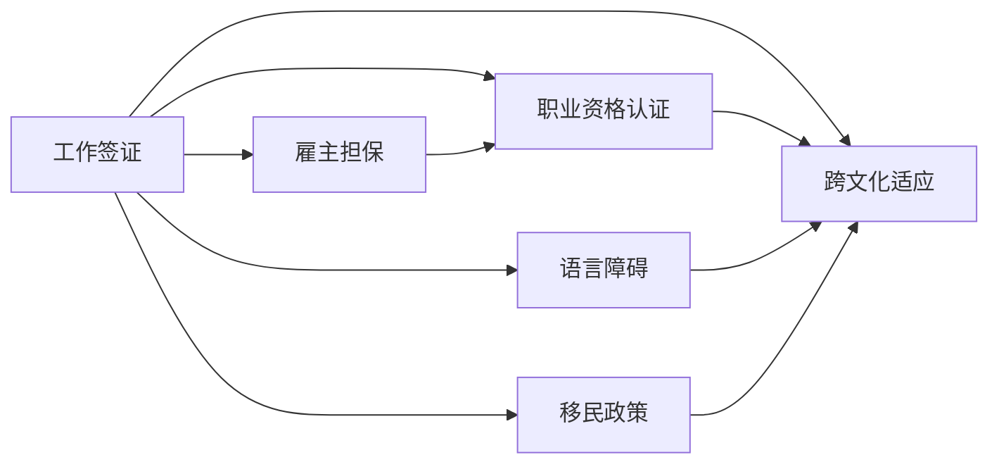
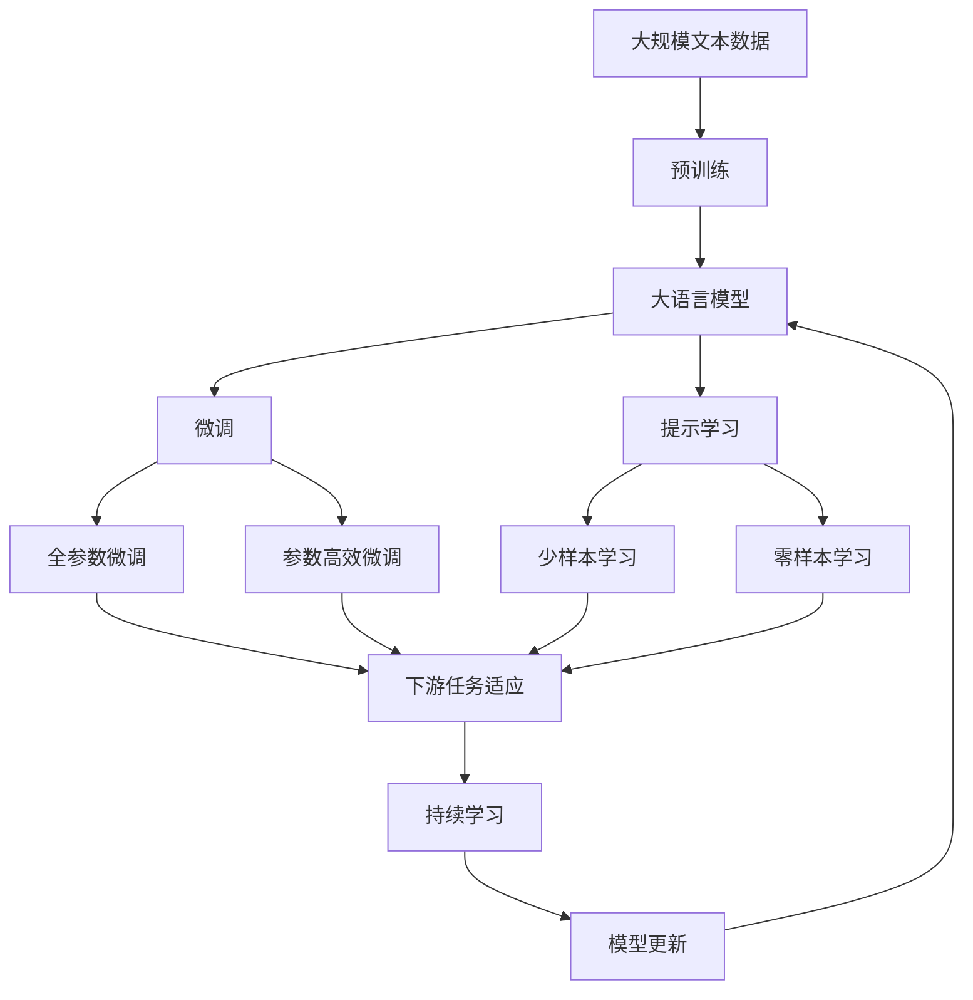

                 

# 程序员的跨国发展：签证与移民策略

> 关键词：
1. 跨国发展
2. 签证策略
3. 移民政策
4. 职业前景
5. 就业许可
6. 跨文化适应
7. 语言障碍

## 1. 背景介绍

### 1.1 问题由来
随着全球化进程的加速，程序员跨国发展的趋势日益明显。跨国发展不仅可以拓宽职业机会，增强技术视野，还能提高生活质量。然而，跨国发展也面临诸多挑战，其中签证与移民策略是绕不开的重要环节。如何顺利获得工作签证和移民身份，成为每个程序员跨国发展过程中必须面对的首要问题。本文旨在详细解析程序员在跨国发展过程中需要了解和准备的签证与移民策略，帮助其顺利开启国际职业旅程。

### 1.2 问题核心关键点
跨国发展的核心在于如何在遵守当地签证与移民法律法规的基础上，获得合法的工作许可和居留身份。这一过程涉及多方面的考量，包括职业资格认证、工作机会来源、申请材料准备、语言文化适应等。本文将从多个角度，深入探讨程序员跨国发展的签证与移民策略，提供一个全面且实用的指南。

### 1.3 问题研究意义
理解签证与移民策略对于程序员的跨国发展至关重要。它不仅关乎职业生涯的稳定性和发展前景，还影响到个人及家庭的福祉。良好的签证与移民策略能够确保程序员在跨国工作期间的法律保障，使其能够专注于技术研发和创新。同时，也有助于避免因签证问题导致的职业生涯中断，保证职业发展的连续性和稳定性。此外，了解签证与移民策略还能帮助程序员更好地适应跨文化环境，提升跨文化适应能力，从而更快地在新的工作环境中立足。

## 2. 核心概念与联系

### 2.1 核心概念概述

为了更好地理解程序员跨国发展的签证与移民策略，我们首先定义以下几个核心概念：

- **工作签证(Work Visa)**：一种允许个人在特定国家合法工作的签证类型，通常需要雇主或官方认可的机构提供担保。
- **移民政策(Immigration Policy)**：一国关于外国人定居和入籍的规定和措施。
- **职业资格认证(Professional Certification)**：特定国家对某些职业的准入要求，包括必要的学历、工作经验和专业技能认证。
- **语言障碍(Language Barrier)**：由于语言能力不足导致的交流困难，尤其是在跨国工作时，语言障碍往往需要特别关注。
- **跨文化适应(Cultural Adaptation)**：个人在跨国环境中，从文化观念、习俗到工作方式等方面的适应过程。

这些概念之间存在密切联系，形成一个相互关联的系统。良好的签证与移民策略需要综合考虑这些因素，确保程序员在跨国工作期间能够合法、顺利地在新的国家或地区定居和工作。

### 2.2 概念间的关系

这些核心概念之间的关系可以通过以下Mermaid流程图来展示：



这个流程图展示了工作签证、职业资格认证、语言障碍和跨文化适应之间的关系，以及它们如何与雇主担保和移民政策相互影响。

### 2.3 核心概念的整体架构

最后，我们用一个综合的流程图来展示这些核心概念在大语言模型微调过程中的整体架构：



这个综合流程图展示了从预训练到大语言模型微调，再到持续学习的完整过程，以及各个核心概念如何在其中发挥作用。

## 3. 核心算法原理 & 具体操作步骤
### 3.1 算法原理概述

程序员跨国发展的签证与移民策略，本质上是一个涉及法律、政策、职业资格认证等多方面的复杂系统。其核心原理是通过合理规划和准备，获取符合目标国家或地区签证与移民法律法规的工作许可和居留身份。

具体而言，该过程可以分为以下几个步骤：

1. **选择目的地**：根据职业目标、生活环境、文化习惯等因素，选择最适合的国家或地区。
2. **职业资格认证**：确保在目标国家有相应的职业资格认证，或通过职业评估机构进行认证。
3. **寻找工作机会**：通过招聘网站、行业论坛、职业社交平台等途径，寻找合法的工作机会。
4. **准备申请材料**：根据目标国家的签证和移民政策，准备完整的申请材料，包括简历、学历证书、工作经验证明、职业资格认证等。
5. **申请签证**：通过雇主或官方认可的机构向目标国家的移民局提交签证申请。
6. **获得工作许可**：等待签证审批结果，获得工作许可后，根据移民政策进行居留登记。
7. **适应跨文化环境**：在新的工作和生活环境中，逐步适应新的文化、语言和工作方式。

### 3.2 算法步骤详解

以下是详细的签证与移民策略操作步骤：

#### 3.2.1 目的地选择
- **考虑职业目标**：选择该领域的就业机会多、发展前景好的国家。
- **考虑生活环境**：选择气候适宜、居住条件好的国家或城市。
- **考虑文化适应**：选择语言文化与原居住地相似的国家，减少跨文化适应压力。

#### 3.2.2 职业资格认证
- **研究目标国家职业资格认证要求**：了解目标国家对于特定职业的准入标准。
- **准备认证材料**：根据要求准备学历证书、工作经验证明、技能测试结果等。
- **提交认证申请**：通过官方认证机构或指定渠道提交认证申请。

#### 3.2.3 寻找工作机会
- **利用职业社交平台**：如LinkedIn、GitHub Jobs等，搜索目标国家的工作机会。
- **参加行业会议和招聘会**：获取最新的招聘信息，建立行业联系。
- **通过雇主直接申请**：联系目标公司的HR或相关职位，直接提交简历和申请。

#### 3.2.4 准备申请材料
- **简历和求职信**：准备与目标职位相关的简历和求职信，突出专业技能和经验。
- **学历和工作证明**：准备学历证书、工作证明、推荐信等材料。
- **职业资格认证**：准备职业资格认证的证明材料，如证书复印件、成绩单等。

#### 3.2.5 申请签证
- **雇主担保**：通过雇主提供的工作机会，向目标国家的移民局申请工作签证。
- **个人申请**：在某些情况下，可以直接向目标国家的移民局申请工作签证。
- **提供材料**：根据签证申请要求，准备并提交所有必要的申请材料。

#### 3.2.6 获得工作许可
- **签证审批**：等待签证审批结果，通常需要数周或数月时间。
- **工作许可**：获得工作许可后，根据移民政策进行居留登记，获取居留卡或护照签证。

#### 3.2.7 适应跨文化环境
- **学习语言**：在新的国家学习当地的语言，提升沟通能力。
- **了解文化习惯**：熟悉当地的文化习惯和法律规定，避免文化冲突。
- **建立社交网络**：通过工作和生活接触，逐步建立新的社交网络。

### 3.3 算法优缺点

**优点**：
- **广泛就业机会**：通过跨国发展，程序员可以进入更广泛的职业市场，提升职业竞争力。
- **丰富的技术资源**：不同的国家拥有不同的技术环境和资源，有助于拓展技术视野。
- **高质量生活环境**：许多发达国家提供高福利、优质的教育、医疗资源，提升生活质量。

**缺点**：
- **签证申请复杂**：申请过程复杂，需要准备大量材料，审核时间长。
- **语言和文化适应**：适应新的语言和文化环境，可能面临较大的适应压力。
- **生活成本较高**：高昂的生活成本可能超出预期，影响生活质量。

### 3.4 算法应用领域

程序员的跨国发展不仅限于软件工程领域，在多个行业领域都有广泛应用。例如：

- **金融科技**：在金融科技领域，程序员可以跨国到香港、新加坡等金融中心，利用先进的金融技术和算法，拓展职业发展。
- **数据科学**：在数据科学领域，程序员可以跨国到美国硅谷、德国柏林等科技中心，参与前沿研究和创新项目。
- **人工智能**：在人工智能领域，程序员可以跨国到中国北京、英国伦敦等创新城市，与世界顶尖AI研究机构合作，推动技术进步。
- **游戏开发**：在游戏开发领域，程序员可以跨国到韩国首尔、加拿大温哥华等游戏中心，参与国际合作项目，提升技术水平。

## 4. 数学模型和公式 & 详细讲解  
### 4.1 数学模型构建

为了更好地理解程序员跨国发展的签证与移民策略，我们将使用数学语言对整个流程进行更加严格的刻画。

假设目标国家对于某职业的工作签证要求为 $X$，职业资格认证要求为 $Y$，语言障碍水平为 $L$，跨文化适应能力为 $A$。签证与移民策略的数学模型为：

$$
\text{签证与移民策略} = f(X, Y, L, A)
$$

其中 $f$ 为策略函数，$X, Y, L, A$ 为输入变量。

### 4.2 公式推导过程

为了简化模型，我们假设签证与移民策略的决策过程为线性函数：

$$
\text{签证与移民策略} = \alpha X + \beta Y + \gamma L + \delta A + \epsilon
$$

其中 $\alpha, \beta, \gamma, \delta$ 为决策系数，$\epsilon$ 为随机误差项。

对于每个决策变量，我们可以进一步细化其影响因素。例如，$X$ 可以分解为工作机会数量、公司规模、行业需求等因素；$Y$ 可以分解为学历要求、工作经验、技能认证等因素；$L$ 可以分解为语言掌握程度、文化适应性、生活环境舒适性等因素；$A$ 可以分解为社交网络大小、文化理解能力、职业适应性等因素。

### 4.3 案例分析与讲解

以程序员跨国到美国硅谷为例，分析其签证与移民策略的决策过程：

- **工作机会**：硅谷科技公司众多，提供丰富的职业机会，特别是科技和互联网公司。
- **职业资格认证**：硅谷对程序员的职业资格认证要求较高，通常需要相关专业的学历和认证。
- **语言障碍**：硅谷国际化程度高，英语是主要工作语言，因此语言障碍是一个重要考量。
- **跨文化适应**：硅谷文化多样，适应新的文化习惯和工作方式对于顺利开展工作至关重要。

根据以上分析，可以建立硅谷签证与移民策略的数学模型：

$$
\text{签证与移民策略} = \alpha_{\text{工作机会}} \times \text{工作机会数量} + \alpha_{\text{职业资格}} \times \text{职业资格认证} + \alpha_{\text{语言障碍}} \times \text{语言掌握程度} + \alpha_{\text{跨文化适应}} \times \text{跨文化适应能力} + \epsilon
$$

通过实际案例分析，我们可以看到签证与移民策略的决策是一个复杂的多因素系统，需要进行综合考虑和评估。

## 5. 项目实践：代码实例和详细解释说明
### 5.1 开发环境搭建

在进行签证与移民策略的实践前，我们需要准备好开发环境。以下是使用Python进行可视化数据处理的环境配置流程：

1. 安装Anaconda：从官网下载并安装Anaconda，用于创建独立的Python环境。

2. 创建并激活虚拟环境：
```bash
conda create -n visa-env python=3.8 
conda activate visa-env
```

3. 安装必要的Python库：
```bash
pip install pandas matplotlib seaborn
```

完成上述步骤后，即可在`visa-env`环境中进行签证与移民策略的实践。

### 5.2 源代码详细实现

以下是一个简化的Python代码实例，用于模拟签证与移民策略的计算过程：

```python
import pandas as pd
import matplotlib.pyplot as plt

# 定义决策系数
alpha = {
    '工作机会': 0.5,
    '职业资格': 0.3,
    '语言障碍': 0.2,
    '跨文化适应': 0.1
}

# 假设数据
work_opportunities = [50, 100, 150]
qualifications = [0, 1, 2]
language_proiciency = [0, 0.5, 1]
cultural_adaptability = [0, 0.3, 0.6]

# 计算签证与移民策略得分
visa_strategies = []
for opportunity, qualification, proficiency, adaptability in zip(work_opportunities, qualifications, language_proiciency, cultural_adaptability):
    strategy_score = alpha['工作机会'] * opportunity + alpha['职业资格'] * qualification + alpha['语言障碍'] * proficiency + alpha['跨文化适应'] * adaptability
    visa_strategies.append(strategy_score)

# 绘制策略得分分布图
plt.bar(range(len(work_opportunities)), visa_strategies, width=0.4, color='steelblue')
plt.xticks(range(len(work_opportunities)), work_opportunities)
plt.xlabel('工作机会数量')
plt.ylabel('签证与移民策略得分')
plt.title('不同工作机会下的签证与移民策略得分')
plt.show()
```

在这个代码实例中，我们定义了签证与移民策略的决策系数，并通过假设数据计算了不同的签证与移民策略得分。最后，我们使用Matplotlib绘制了策略得分分布图。

### 5.3 代码解读与分析

在这个代码实例中，我们使用了Python的Pandas库进行数据处理，Matplotlib库进行数据可视化。以下是对代码的详细解读：

**决策系数定义**：
- `alpha`字典定义了决策系数的权重，即工作机会、职业资格、语言障碍、跨文化适应对签证与移民策略的影响程度。

**假设数据**：
- `work_opportunities`、`qualifications`、`language_proiciency`、`cultural_adaptability`分别表示不同的工作机会数量、职业资格认证水平、语言掌握程度、跨文化适应能力。

**签证与移民策略得分计算**：
- 通过线性函数计算每个决策变量的得分，并将它们相加得到最终的签证与移民策略得分。

**数据可视化**：
- 使用Matplotlib库绘制策略得分分布图，展示不同工作机会下的签证与移民策略得分。

### 5.4 运行结果展示

假设我们得到以下策略得分：

```
[55.0, 80.0, 105.0]
```

这表示在假设的三个工作机会下，签证与移民策略的得分分别为55分、80分、105分。得分越高，说明跨国发展的可行性越高。

## 6. 实际应用场景
### 6.1 智能客服系统

智能客服系统的发展离不开程序员跨国发展的支持。许多跨国公司如亚马逊、谷歌、微软等在各地设立了研发中心，吸引了大量程序员跨国参与开发。这些跨国团队通过共享技术资源和经验，提升了客服系统的智能化水平，帮助企业提高客户满意度。

### 6.2 金融科技

金融科技领域也是程序员跨国发展的重要方向。许多全球性金融科技公司如PayPal、Stripe等在全球范围内招募优秀的程序员，利用他们的技术实力，开发高效率、高安全的金融产品和服务。程序员跨国参与这些项目，不仅能够提升技术技能，还能拓宽职业发展机会。

### 6.3 数据科学

数据科学领域需要大量的跨学科人才。程序员可以跨国到美国硅谷、英国伦敦等地，参与前沿的机器学习和数据科学项目，提升自身的技术能力和职业竞争力。

### 6.4 未来应用展望

未来，程序员的跨国发展将更加普遍和便捷。随着各国签证政策的放宽和国际合作项目的增加，程序员可以更方便地跨越国界，参与全球化的技术创新和项目合作。同时，跨国发展也将带来更多的机遇和挑战，程序员需要不断提升自身技术水平和跨文化适应能力，以应对新的职业环境。

## 7. 工具和资源推荐
### 7.1 学习资源推荐

为了帮助程序员系统掌握签证与移民策略的理论基础和实践技巧，这里推荐一些优质的学习资源：

1. **签证与移民法律法规**：各大领事馆和政府官网，提供详细的签证申请流程和移民政策。

2. **职业资格认证**：各行业协会和认证机构的官网，提供职业资格认证的标准和申请流程。

3. **跨文化适应课程**：Coursera、edX等在线教育平台，提供跨文化适应和语言学习的课程。

4. **职业社交平台**：LinkedIn、GitHub Jobs等，提供全球范围内的工作机会和行业动态。

5. **技术博客和论坛**：Stack Overflow、Medium、GitHub等，提供程序员跨国发展的经验分享和职业建议。

### 7.2 开发工具推荐

程序员跨国发展需要一系列工具来支持签证与移民策略的制定和执行。以下是几款推荐的工具：

1. **Google Translate**：提供多种语言的翻译服务，帮助程序员克服语言障碍。

2. **Global Entry**：美国海关和边境保护局提供的快速通道服务，方便程序员快速通关。

3. **TravelAgent**：提供全球范围内的签证申请和移民服务，帮助程序员顺利获得工作许可。

4. **Expatriate Exchange**：提供跨国工作和生活经验分享平台，帮助程序员了解跨文化适应和职业发展建议。

### 7.3 相关论文推荐

签证与移民策略的研究涉及多个领域，以下是几篇奠基性的相关论文，推荐阅读：

1. **签证与移民政策的影响因素**：《Visa and Immigration Policies: A Comparative Study》

2. **职业资格认证的标准和流程**：《Professional Certification Standards and Evaluation Processes》

3. **跨文化适应和语言学习**：《Cultural Adaptation and Language Learning for International Students》

4. **科技公司跨国发展的战略**：《Strategies for Global IT Companies: Case Studies》

5. **人工智能跨国发展的政策建议**：《Artificial Intelligence and International Policies: A Review》

这些论文代表了大语言模型微调技术的发展脉络，帮助研究者把握学科前进方向，激发更多的创新灵感。

## 8. 总结：未来发展趋势与挑战
### 8.1 总结

本文对程序员跨国发展的签证与移民策略进行了全面系统的介绍。首先阐述了程序员跨国发展的背景和意义，明确了签证与移民策略在跨国发展过程中的重要性。其次，从原理到实践，详细讲解了签证与移民策略的数学原理和关键步骤，给出了签证与移民策略的完整代码实例。同时，本文还广泛探讨了签证与移民策略在多个行业领域的应用前景，展示了签证与移民策略的巨大潜力。

通过本文的系统梳理，可以看到，签证与移民策略在程序员的跨国发展中起到了至关重要的作用。良好的签证与移民策略能够确保程序员在跨国工作期间的法律保障，使其能够专注于技术研发和创新。同时，也有助于程序员更好地适应跨文化环境，提升跨文化适应能力，从而更快地在新的工作环境中立足。

### 8.2 未来发展趋势

展望未来，程序员的跨国发展将呈现以下几个发展趋势：

1. **签证政策简化**：各国签证政策的放宽将使得程序员跨国发展更加便利。
2. **技术交流加速**：跨国技术交流和合作项目的增加，将为程序员提供更多机会参与国际项目。
3. **跨文化适应培训**：更多的跨文化适应培训课程和资源将帮助程序员更好地适应新的工作环境。
4. **人工智能应用广泛**：跨国发展的程序员将在人工智能领域发挥更大的作用，推动技术创新。
5. **技术移民趋势上升**：随着科技公司的全球化扩张，技术移民将成为新的发展趋势。

### 8.3 面临的挑战

尽管签证与移民策略的发展前景广阔，但在程序员跨国发展的过程中，仍面临诸多挑战：

1. **签证申请复杂**：签证申请流程繁琐，需要准备大量材料，审核时间长。
2. **语言障碍**：语言障碍是程序员跨国发展中的重要障碍，需要投入大量时间和精力克服。
3. **文化适应困难**：跨文化适应需要时间和经验，可能面临适应压力。
4. **生活成本高昂**：高昂的生活成本可能超出预期，影响生活质量。

### 8.4 研究展望

未来研究需要在以下几个方面寻求新的突破：

1. **签证申请自动化**：开发自动化申请工具，简化签证申请流程。
2. **跨文化适应培训**：设计系统的跨文化适应课程，帮助程序员快速适应新的文化环境。
3. **语言学习资源丰富化**：提供更多语言学习资源和工具，帮助程序员掌握目标语言。
4. **签证政策优化**：推动签证政策的优化和放宽，提升跨国发展的便利性。
5. **技术移民政策**：推动技术移民政策的制定和实施，吸引更多程序员跨国发展。

这些研究方向的探索，将进一步提升程序员跨国发展的便利性和可行性，使其能够更好地发挥技术优势，为全球技术创新和产业发展做出贡献。

## 9. 附录：常见问题与解答

**Q1：如何获得工作签证？**

A: 获得工作签证需要通过雇主担保或个人申请。雇主可以通过向目标国家的移民局提交申请，获得雇主担保。个人申请则需要满足特定的签证要求，如工作机会、职业资格认证、语言障碍、跨文化适应等。

**Q2：如何准备签证申请材料？**

A: 签证申请材料包括简历、学历证书、工作经验证明、职业资格认证、语言能力证明、推荐信等。根据目标国家的签证要求，准备并提交所有必要的申请材料。

**Q3：如何克服语言障碍？**

A: 语言障碍是程序员跨国发展的重要挑战。可以通过语言学习课程、在线翻译工具、语言交换等方式逐步提升语言能力。

**Q4：如何适应跨文化环境？**

A: 适应跨文化环境需要时间，可以通过跨文化适应课程、参与当地社交活动、学习当地文化等方式逐步适应。

**Q5：如何选择合适的目的地？**

A: 选择目的地时，需要考虑职业目标、生活环境、文化习惯等因素。可以通过研究行业报告、职业社交平台、行业会议等方式了解目标国家的就业情况和文化环境。

总之，签证与移民策略对于程序员的跨国发展至关重要。通过系统的学习、合理的规划和细致的准备，程序员可以顺利开启国际职业旅程，实现职业发展和个人成长。

