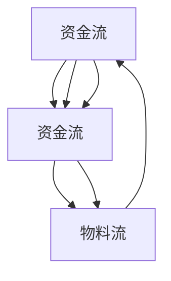

                 

# 系统思考：全面分析问题的关键

## 1. 背景介绍

### 1.1 问题由来
在信息爆炸的当今时代，随着技术的不断发展，复杂系统的分析和决策变得愈加重要。无论是软件开发、项目管理，还是金融风险控制、医疗诊断，系统思考（System Thinking）方法成为了一种至关重要的思维工具。系统思考强调从整体的角度出发，识别系统中的关键因素和交互关系，以实现对系统的深入理解。

### 1.2 问题核心关键点
系统思考方法的核心在于其系统观和整体性，通过以下几个关键点全面分析问题：
- **反馈环**：理解系统中正反馈和负反馈机制，识别系统动态变化的驱动力。
- **因果链**：分析系统中的因果关系，识别问题根本原因。
- **层次结构**：从系统的高层结构到低层细节，分层次进行问题分析。
- **核心要素**：识别系统的核心要素和关键变量，集中精力优化。
- **时序性**：考虑问题的时序性，理解系统在时间维度上的演变过程。

系统思考方法之所以重要，是因为其可以帮助我们系统全面地分析问题，避免片面性和狭隘性。它不仅适用于技术问题，也适用于组织管理、政策制定等领域的系统分析。

## 2. 核心概念与联系

### 2.1 核心概念概述

在系统思考中，有几个核心概念尤为关键：

- **反馈环（Feedback Loop）**：系统中的变量相互作用，形成一个或多个循环结构，影响系统的稳定性和动态变化。
- **因果链（Causal Chain）**：系统中的变量之间通过一系列因果关系相互影响，识别因果链有助于理解问题的根本原因。
- **层次结构（Hierarchical Structure）**：系统可以分解为多个层次，每个层次包含不同的变量和子系统，理解系统的层次结构有助于从局部到整体的分析。
- **核心要素（Core Elements）**：系统中的关键变量和子系统，关注这些要素可以帮助集中精力解决问题。
- **时序性（Temporality）**：系统状态随时间变化，考虑问题的时序性有助于理解其演变过程。

通过这些概念，系统思考提供了一种从整体视角全面分析问题的框架，能够揭示系统内部的复杂关系和动态行为。

### 2.2 概念间的关系

这些核心概念之间存在紧密的联系，形成了一个系统思考的生态系统。以下通过一个简单的系统示例来说明这些概念之间的关系。

假设我们有一个简单的供应链系统，包含供应商、工厂和客户三个子系统，三个子系统通过物料流和资金流相互作用。



在这个系统中，物料流和资金流是系统中的核心要素。供应商和工厂之间、工厂和客户之间通过物料流相互作用，供应商和工厂之间、工厂和客户之间通过资金流相互作用。这种相互作用形成了一个正反馈环和多个因果链，共同决定了系统的动态行为。

## 3. 核心算法原理 & 具体操作步骤
### 3.1 算法原理概述

系统思考的核心算法原理是构建系统的动态模型，通过分析系统的反馈环和因果链，揭示系统中的复杂关系和动态行为。系统思考的目标是理解系统的本质特征，预测系统变化趋势，并为系统优化提供依据。

系统思考的具体操作可以分为以下几个步骤：

1. **数据收集**：收集系统的相关数据和信息，包括系统结构、变量值、因果关系等。
2. **系统建模**：使用模型构建技术，如因果图、系统动力学模型等，将系统抽象为数学模型。
3. **因果链分析**：通过模型分析，识别系统中的因果链，理解问题根本原因。
4. **反馈环分析**：识别系统中的反馈环，理解系统动态变化的驱动力。
5. **层次结构分析**：从系统的高层结构到低层细节，分层次进行问题分析。
6. **核心要素识别**：识别系统的关键变量和子系统，集中精力优化。
7. **时序性分析**：考虑问题的时序性，理解系统在时间维度上的演变过程。

通过这些步骤，系统思考能够全面、深入地分析系统问题，提供系统的优化方案。

### 3.2 算法步骤详解

以下以供应链系统为例，详细介绍系统思考的具体操作步骤：

**Step 1: 数据收集**
- 收集供应链系统的相关数据，包括物料供应、生产、销售、资金流等。

**Step 2: 系统建模**
- 使用系统动力学模型，建立供应链系统的数学模型。
- 定义变量和方程，描述物料流和资金流的动态行为。

**Step 3: 因果链分析**
- 分析物料流和资金流之间的因果关系，识别影响系统动态变化的关键因素。
- 例如，如果物料供应不足，会导致生产延迟，进而影响销售。

**Step 4: 反馈环分析**
- 识别物料流和资金流之间的反馈环，理解系统动态变化的驱动力。
- 例如，如果客户需求突然增加，会导致工厂生产加快，从而进一步影响供应商的物料供应。

**Step 5: 层次结构分析**
- 将供应链系统分解为供应商、工厂和客户三个层次。
- 分析各层次的动态行为和交互关系。

**Step 6: 核心要素识别**
- 识别供应链系统的核心要素，如物料供应量、生产效率、客户需求等。
- 集中精力优化这些核心要素。

**Step 7: 时序性分析**
- 分析供应链系统的时序性，理解系统在时间维度上的演变过程。
- 例如，季节性因素对供应链系统的影响。

通过以上步骤，可以全面、深入地分析供应链系统的问题，找到优化系统的关键点。

### 3.3 算法优缺点

系统思考方法具有以下几个优点：
- **全面性**：能够从整体视角分析问题，识别系统中的复杂关系和动态行为。
- **深入性**：通过因果链和反馈环分析，理解问题的根本原因。
- **系统性**：通过层次结构和时序性分析，提供系统的优化方案。

同时，系统思考方法也存在一些局限性：
- **复杂性**：系统思考方法较为复杂，需要一定的数学和建模基础。
- **数据需求**：需要大量的数据和信息来支撑系统建模和分析。
- **计算资源**：系统动态模型需要较大的计算资源，可能存在计算瓶颈。

尽管存在这些局限性，但系统思考方法在处理复杂系统问题时仍然具有重要的价值。

### 3.4 算法应用领域

系统思考方法广泛应用于多个领域，以下是一些典型的应用场景：

- **软件工程**：在软件开发生命周期中，系统思考帮助识别系统中的关键组件和交互关系，优化软件设计和实现。
- **项目管理**：在项目管理中，系统思考帮助识别项目中的关键变量和风险，优化项目计划和资源分配。
- **金融风险控制**：在金融风险管理中，系统思考帮助识别风险因素和反馈环，优化风险控制策略。
- **医疗诊断**：在医疗诊断中，系统思考帮助理解疾病的复杂动态行为，优化诊断方案。
- **城市规划**：在城市规划中，系统思考帮助理解城市系统的复杂关系和动态行为，优化城市规划和管理。

## 4. 数学模型和公式 & 详细讲解
### 4.1 数学模型构建

假设我们有一个简单的供应链系统，包含供应商、工厂和客户三个子系统，三个子系统通过物料流和资金流相互作用。

- **物料流**：定义物料供应和生产速率的方程。
- **资金流**：定义资金流入和流出的方程。

**物料流模型**：
$$
S_t = S_{t-1} + I_t - O_t
$$
$$
I_t = S_t \times P_t \times e^{-r_t}
$$
$$
O_t = P_t \times e^{-r_t}
$$

其中，$S_t$ 为物料供应量，$I_t$ 为物料流入量，$O_t$ 为物料流出量，$P_t$ 为生产速率，$r_t$ 为生产效率。

**资金流模型**：
$$
R_t = R_{t-1} + I_t - O_t
$$
$$
I_t = S_t \times P_t \times c_t
$$
$$
O_t = P_t \times c_t
$$

其中，$R_t$ 为资金流入量，$I_t$ 为资金流入量，$O_t$ 为资金流出量，$c_t$ 为物料单位成本。

### 4.2 公式推导过程

以物料流模型为例，推导其动态行为：

$$
S_t = S_{t-1} + I_t - O_t
$$
$$
I_t = S_t \times P_t \times e^{-r_t}
$$
$$
O_t = P_t \times e^{-r_t}
$$

代入$I_t$和$O_t$的表达式，得：
$$
S_t = S_{t-1} + S_t \times P_t \times e^{-r_t} - P_t \times e^{-r_t}
$$
$$
S_t = S_{t-1} \times (1 + P_t \times e^{-r_t}) - P_t \times e^{-r_t}
$$

通过这种数学模型，可以预测物料供应量的动态行为。类似地，可以建立资金流模型的数学模型，分析资金流动的动态行为。

### 4.3 案例分析与讲解

假设在某个月份，客户需求突然增加，工厂的生产量无法满足，导致供应商的物料供应也受到影响。

通过系统动力学模型，可以分析这一事件对系统动态行为的影响：
- 客户需求增加，导致工厂生产量增加，进而导致物料需求增加。
- 物料需求增加，导致供应商物料供应不足，进而影响生产效率。
- 生产效率降低，导致生产量减少，进一步影响物料供应和客户需求。

通过因果链和反馈环分析，可以理解问题的根本原因，优化供应链系统的运行。

## 5. 项目实践：代码实例和详细解释说明
### 5.1 开发环境搭建

在系统思考的实践中，开发环境搭建非常重要。以下是使用Python进行Sympy系统建模的开发环境配置流程：

1. 安装Anaconda：从官网下载并安装Anaconda，用于创建独立的Python环境。

2. 创建并激活虚拟环境：
```bash
conda create -n system_thinking_env python=3.8 
conda activate system_thinking_env
```

3. 安装Sympy：
```bash
conda install sympy
```

4. 安装其他相关工具包：
```bash
pip install numpy pandas scikit-learn matplotlib 
```

完成上述步骤后，即可在`system_thinking_env`环境中开始系统建模实践。

### 5.2 源代码详细实现

这里我们以供应链系统为例，使用Sympy建立系统动力学模型，并进行因果链和反馈环分析。

首先，定义供应链系统中的变量和方程：

```python
from sympy import symbols, Eq, solve, Rational

# 定义变量
S, I, O, P, r, R, I_t, O_t, P_t, r_t = symbols('S I O P r R I_t O_t P_t r_t')

# 物料流方程
equation1 = Eq(S, S + I - O)

# 物料流入方程
equation2 = Eq(I, S * P * exp(-r))

# 物料流出方程
equation3 = Eq(O, P * exp(-r))

# 资金流方程
equation4 = Eq(R, R + I - O)

# 物料单位成本方程
equation5 = Eq(I, S * P * c_t)

# 资金流出方程
equation6 = Eq(O, P * c_t)
```

然后，使用Sympy进行求解和分析：

```python
# 解方程组
solutions = solve((equation1, equation2, equation3, equation4, equation5, equation6), (S, I, O, P, r, R, I_t, O_t, P_t, r_t))

# 输出解
print(solutions)
```

最后，进行因果链和反馈环分析：

```python
# 定义因果链
causal_chain = [
    {'x': S, 'y': I, 'link': '物料供应增加导致物料流入增加'},
    {'x': I, 'y': O, 'link': '物料流入增加导致物料流出增加'},
    {'x': O, 'y': S, 'link': '物料流出增加导致物料供应减少'},
    {'x': P, 'y': I, 'link': '生产增加导致物料流入增加'},
    {'x': P, 'y': O, 'link': '生产增加导致物料流出增加'}
]

# 输出因果链
print(causal_chain)
```

### 5.3 代码解读与分析

让我们再详细解读一下关键代码的实现细节：

**定义变量和方程**：
- 使用Sympy库定义系统中的各个变量和方程，包括物料流和资金流。

**求解方程组**：
- 使用Sympy的solve函数求解方程组，得到各变量的解。

**因果链分析**：
- 定义因果链，包括变量之间的因果关系和影响方式。

通过这些代码，可以系统地建立供应链系统的数学模型，并进行因果链和反馈环分析。

### 5.4 运行结果展示

假设在某个月份，客户需求突然增加，工厂的生产量无法满足，导致供应商的物料供应也受到影响。通过系统动力学模型，可以分析这一事件对系统动态行为的影响：

- 客户需求增加，导致工厂生产量增加，进而导致物料需求增加。
- 物料需求增加，导致供应商物料供应不足，进而影响生产效率。
- 生产效率降低，导致生产量减少，进一步影响物料供应和客户需求。

通过因果链和反馈环分析，可以理解问题的根本原因，优化供应链系统的运行。

## 6. 实际应用场景
### 6.1 智能制造

系统思考在智能制造中的应用非常广泛。通过系统思考方法，可以帮助制造企业全面理解生产系统的复杂关系和动态行为，优化生产流程和资源配置。

在智能制造中，系统思考方法可以用于：
- **生产调度**：优化生产计划和调度，提高生产效率。
- **设备维护**：优化设备维护策略，减少停机时间。
- **质量控制**：优化质量控制流程，提高产品质量。
- **供应链管理**：优化供应链系统，提高物料流和资金流的效率。

系统思考方法能够帮助制造企业从整体视角分析生产系统，识别关键因素和优化点，提升生产系统的整体绩效。

### 6.2 金融风险控制

金融风险控制是系统思考方法的另一个典型应用场景。金融系统复杂多变，系统思考方法可以帮助金融机构全面理解系统的动态行为和风险因素，优化风险控制策略。

在系统思考中，金融风险控制主要关注以下几个方面：
- **市场风险**：通过系统思考方法，识别市场因素对金融系统的影响，优化风险控制策略。
- **信用风险**：通过系统思考方法，识别信用因素对金融系统的影响，优化信贷审批和风险管理。
- **操作风险**：通过系统思考方法，识别操作因素对金融系统的影响，优化内部控制和流程管理。

系统思考方法能够帮助金融机构从整体视角分析金融系统的复杂关系和动态行为，提升风险控制能力。

### 6.3 医疗健康

在系统思考中，医疗健康领域的应用也非常重要。系统思考方法可以帮助医疗机构全面理解患者的疾病演变过程，优化医疗流程和资源配置。

在系统思考中，医疗健康主要关注以下几个方面：
- **疾病预防**：通过系统思考方法，识别疾病因素对患者的影响，优化预防措施。
- **治疗方案**：通过系统思考方法，识别治疗因素对患者的影响，优化治疗方案。
- **健康管理**：通过系统思考方法，识别健康因素对患者的影响，优化健康管理。

系统思考方法能够帮助医疗机构从整体视角分析患者的疾病演变过程，提升医疗效果和资源配置效率。

### 6.4 未来应用展望

在系统思考的未来应用中，以下几个方向值得关注：

- **大数据与系统思考的结合**：随着大数据技术的发展，系统思考方法可以与大数据技术结合，进行更全面、深入的系统分析和优化。
- **人工智能与系统思考的结合**：系统思考方法可以与人工智能技术结合，进行更智能化的系统分析和优化。
- **多学科交叉融合**：系统思考方法可以与其他学科（如心理学、社会学等）交叉融合，进行更系统的综合分析。

系统思考方法的应用前景广阔，未来将与其他技术深度结合，进一步提升系统分析和优化的能力。

## 7. 工具和资源推荐
### 7.1 学习资源推荐

为了帮助开发者系统掌握系统思考的理论基础和实践技巧，这里推荐一些优质的学习资源：

1. **《系统思考：系统分析与管理》**：一本经典系统思考教材，涵盖系统思考的基本概念和方法，是系统思考学习的入门必备。

2. **系统思考在线课程**：如MIT的《系统思考与模型构建》课程，提供系统思考的理论基础和实践技巧。

3. **系统思考工作坊**：参加系统思考的工作坊和研讨活动，与专家交流，提升系统思考的实践能力。

4. **系统思考书籍**：如《系统思考：实践指南》，提供系统思考方法的实际案例和实践指南。

5. **系统思考博客和社区**：如MIT的System Dynamics Group博客，分享最新的系统思考研究成果和实践经验。

通过对这些资源的学习实践，相信你一定能够系统全面地掌握系统思考方法，并将其应用于实际问题解决。

### 7.2 开发工具推荐

高效的开发离不开优秀的工具支持。以下是几款用于系统思考开发的常用工具：

1. **Vensim**：一款著名的系统动力学建模软件，支持创建复杂的系统动力学模型，进行动态仿真和分析。

2. **AnyLogic**：一款多领域建模软件，支持创建复杂的系统动力学模型，进行仿真和分析。

3. **Python系统建模**：使用Python和Sympy库，可以进行系统建模和动态分析。

4. **R语言系统建模**：使用R语言和相关包，可以进行系统建模和动态分析。

5. **JMP系统建模**：使用SAS的JMP软件，可以进行系统建模和动态分析。

合理利用这些工具，可以显著提升系统思考任务的开发效率，加快创新迭代的步伐。

### 7.3 相关论文推荐

系统思考方法的研究源于学界的持续研究。以下是几篇奠基性的相关论文，推荐阅读：

1. **《系统思考：一种基于动态系统的建模方法》**：介绍系统思考的基本概念和方法，为系统思考的研究奠定基础。

2. **《系统动力学模型：理论与实践》**：介绍系统动力学模型的基本原理和应用，为系统建模提供理论支持。

3. **《多变量系统分析与控制》**：介绍多变量系统的建模和控制方法，为系统思考提供技术支持。

4. **《系统思考：基于案例的研究》**：通过实际案例，展示系统思考方法的实践应用。

5. **《复杂系统的建模与分析》**：介绍复杂系统的建模方法和分析技术，为系统思考提供技术支持。

这些论文代表了大系统思考的发展脉络，通过学习这些前沿成果，可以帮助研究者把握学科前进方向，激发更多的创新灵感。

除上述资源外，还有一些值得关注的前沿资源，帮助开发者紧跟系统思考技术的最新进展，例如：

1. **arXiv论文预印本**：人工智能领域最新研究成果的发布平台，包括大量尚未发表的前沿工作，学习前沿技术的必读资源。

2. **业界技术博客**：如System Dynamics Group的官方博客，第一时间分享他们的最新研究成果和洞见。

3. **技术会议直播**：如ICSE、IEEE TENSOFT Conference等系统建模和分析领域顶会现场或在线直播，能够聆听到大佬们的前沿分享，开拓视野。

4. **GitHub热门项目**：在系统建模和分析相关领域，在GitHub上Star、Fork数最多的项目，往往代表了该技术领域的发展趋势和最佳实践，值得去学习和贡献。

5. **行业分析报告**：各大咨询公司如McKinsey、PwC等针对系统建模和分析行业的分析报告，有助于从商业视角审视技术趋势，把握应用价值。

总之，对于系统思考方法的学习和实践，需要开发者保持开放的心态和持续学习的意愿。多关注前沿资讯，多动手实践，多思考总结，必将收获满满的成长收益。

## 8. 总结：未来发展趋势与挑战

### 8.1 总结

本文对系统思考方法进行了全面系统的介绍。首先阐述了系统思考方法的研究背景和意义，明确了系统思考在分析复杂系统问题中的独特价值。其次，从原理到实践，详细讲解了系统思考的数学原理和关键步骤，给出了系统建模任务开发的完整代码实例。同时，本文还广泛探讨了系统思考方法在智能制造、金融风险控制、医疗健康等多个行业领域的应用前景，展示了系统思考方法的巨大潜力。最后，本文精选了系统思考技术的各类学习资源，力求为读者提供全方位的技术指引。

通过本文的系统梳理，可以看到，系统思考方法正在成为复杂系统分析和决策的重要工具，极大地拓展了系统分析的边界，为解决系统问题提供了新的视角和方法。未来，伴随系统思考方法的持续演进，复杂系统分析和决策技术必将在各个领域得到广泛应用，为社会各行业带来深刻的变革。

### 8.2 未来发展趋势

展望未来，系统思考方法将呈现以下几个发展趋势：

- **多学科交叉融合**：系统思考方法将与其他学科（如心理学、社会学、经济学等）进行更深入的交叉融合，提升系统分析的全面性和深入性。
- **智能化与自动化**：系统思考方法将与人工智能、大数据等技术深度结合，进行更智能化的系统分析和优化。
- **可视化与交互性**：系统思考方法将与可视化技术结合，提供更直观、交互性更强的系统分析工具。
- **动态性与实时性**：系统思考方法将更注重动态分析和实时决策，提升系统的适应性和灵活性。
- **应用场景的扩展**：系统思考方法将在更多领域得到应用，如城市规划、环境保护、供应链管理等，为各行各业带来深远的变革。

以上趋势凸显了系统思考方法的广阔前景，这些方向的探索发展，必将进一步提升系统分析和决策技术的应用范围和效果。

### 8.3 面临的挑战

尽管系统思考方法已经取得了瞩目成就，但在迈向更加智能化、普适化应用的过程中，它仍面临诸多挑战：

- **复杂性**：系统思考方法较为复杂，需要一定的数学和建模基础。
- **数据需求**：需要大量的数据和信息来支撑系统建模和分析。
- **计算资源**：系统动态模型需要较大的计算资源，可能存在计算瓶颈。
- **系统结构复杂**：系统的结构复杂，难以全面理解和建模。
- **多目标优化**：系统的优化目标可能存在多个，难以平衡和协调。

尽管存在这些挑战，但系统思考方法在处理复杂系统问题时仍然具有重要的价值。

### 8.4 未来突破

面对系统思考方法所面临的种种挑战，未来的研究需要在以下几个方面寻求新的突破：

- **多目标优化方法**：开发更加高效的多目标优化算法，平衡系统中的多个优化目标。
- **分布式系统建模**：开发分布式系统建模技术，降低大系统建模的计算复杂度。
- **实时系统分析**：开发实时系统分析技术，提高系统分析的实时性和动态适应性。
- **可视化工具**：开发更加直观、交互性更强的系统分析工具，提升用户使用体验。
- **多学科知识融合**：开发将系统思考与多学科知识（如心理学、社会学、经济学等）深度融合的技术，提升系统分析的全面性和深入性。

这些研究方向的探索，必将引领系统思考方法走向更高的台阶，为构建安全、可靠、可解释、可控的智能系统铺平道路。面向未来，系统思考方法还需要与其他人工智能技术进行更深入的融合，如知识表示、因果推理、强化学习等，多路径协同发力，共同推动复杂系统分析和决策系统的进步。只有勇于创新、敢于突破，才能不断拓展系统思考的边界，让复杂系统分析技术更好地造福社会。

## 9. 附录：常见问题与解答

**Q1：系统思考和系统分析有什么区别？**

A: 系统思考强调从整体视角理解系统，识别系统中的复杂关系和动态行为。系统分析则侧重于对系统的具体结构和功能进行分析，包括定性分析和定量分析。

**Q2：如何选择合适的系统建模方法？**

A: 选择合适的系统建模方法需要考虑系统的复杂性和分析目标。对于简单系统，可以选择定性分析方法；对于复杂系统，可以选择系统动力学模型等定量分析方法。

**Q3：系统思考需要哪些技能？**

A: 系统思考需要具备以下技能：
- 系统分析能力：理解系统结构、变量和因果关系。
- 数学建模能力：建立系统的数学模型，进行定量分析。
- 可视化能力：使用工具（如Vensim、AnyLogic等）进行系统仿真和分析。
- 决策能力：识别系统的关键因素，制定优化策略。

这些技能需要通过系统的学习和实践不断提升。

**Q4：系统思考和人工智能的结合有哪些方向？**

A: 系统思考和人工智能的结合方向包括：
- 人工智能辅助系统建模：使用机器学习和深度学习技术辅助系统建模。
- 系统思考指导人工智能优化：使用系统思考方法指导人工智能优化。
- 多模态系统分析：结合系统思考和人工智能技术，进行多模态系统分析和优化。

这些方向将推动系统分析和决策技术的进一步发展。

**Q5：系统思考的应用场景有哪些？**

A: 系统思考的应用场景包括：
- 软件开发：优化软件设计和实现。
- 项目管理：优化项目计划和资源配置。
- 金融风险控制：优化风险控制策略。
- 医疗健康：优化医疗流程和资源配置。
- 智能制造：

