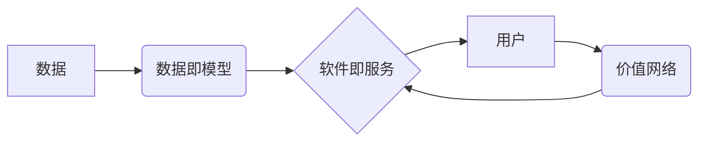

> 数据即模型, 软件即服务, 价值网络, 模块化架构, 智能化部署, 用户体验, 生态构建

# 数据即模型,软件2.0颠覆传统软件方法论

> 关键词：数据即模型，软件即服务，价值网络，模块化架构，智能化部署，用户体验，生态构建

## 1. 背景介绍

### 1.1 时代的变迁

从20世纪80年代的个人计算机时代，到90年代的互联网时代，再到21世纪的移动互联时代，计算机技术经历了翻天覆地的变化。在这过程中，软件作为计算机技术的核心，也经历了从单体应用向分布式系统、从功能驱动向数据驱动的转变。然而，无论是单体应用还是分布式系统，软件的本质始终是基于代码构建的程序集合，其核心价值在于执行既定的逻辑和功能。

### 1.2 传统软件方法论的限制

传统的软件方法论，如瀑布模型、敏捷开发等，虽然在一定程度上提高了软件开发的效率和质量，但仍然存在以下局限性：

1. **功能导向**：传统的软件设计以功能为核心，忽视用户需求的变化和个性化需求。
2. **代码封闭**：软件以代码为核心资产，难以复用和扩展。
3. **部署复杂**：软件部署往往需要繁琐的配置和依赖管理，难以适应快速变化的环境。
4. **用户体验不足**：传统的软件设计往往忽略用户体验，导致用户满意度不高。

### 1.3 软件2.0的兴起

随着大数据、云计算、人工智能等技术的快速发展，软件2.0时代应运而生。软件2.0的核心思想是将数据视为新的生产要素，通过数据驱动的方式构建软件，实现软件的智能化、模块化和个性化。

## 2. 核心概念与联系

### 2.1 核心概念

#### 数据即模型

“数据即模型”是软件2.0的核心概念之一。它认为，数据不仅是软件的输入，更是软件的一部分，甚至可以说是软件的核心。通过分析、挖掘和利用数据，软件可以自动学习和优化，实现智能化。

#### 软件即服务

“软件即服务”（Software as a Service，SaaS）是软件2.0的另一种核心概念。它强调软件的交付方式，将软件作为服务提供给用户，用户只需按照使用量付费即可，无需购买和维护软件。

#### 价值网络

“价值网络”是软件2.0的另一个核心概念。它认为，软件的价值不仅仅体现在软件本身，更体现在软件所连接的价值网络中。通过构建开放、共享的价值网络，软件可以更好地满足用户需求，实现价值最大化。

### 2.2 架构图

以下是一个简单的Mermaid流程图，展示了数据即模型、软件即服务和价值网络之间的关系：



在这个流程图中，数据通过数据即模型的概念转化为软件，软件通过软件即服务的方式提供给用户，用户通过使用软件参与到价值网络中，最终实现价值最大化。

## 3. 核心算法原理 & 具体操作步骤

### 3.1 算法原理概述

软件2.0的核心算法原理可以概括为以下几方面：

1. **数据采集与处理**：通过收集用户行为数据、业务数据等，进行数据清洗、转换和存储。
2. **数据分析和挖掘**：利用机器学习、数据挖掘等技术，对采集到的数据进行分析和挖掘，提取有价值的信息和知识。
3. **模型训练和优化**：利用机器学习算法，根据分析结果训练模型，并不断优化模型性能。
4. **智能化决策**：根据训练好的模型，进行智能化决策，实现软件的智能化控制。
5. **模块化架构**：将软件分解为多个模块，实现模块化设计，提高软件的可维护性和可扩展性。
6. **自动化部署**：利用自动化工具，实现软件的自动化部署和运维。

### 3.2 算法步骤详解

以下是软件2.0的核心算法步骤：

1. **数据采集**：通过日志、API调用、传感器等方式，收集用户行为数据、业务数据等。
2. **数据预处理**：对采集到的数据进行清洗、转换和存储，为后续分析做准备。
3. **特征工程**：根据业务需求，从原始数据中提取特征，用于模型训练。
4. **模型训练**：利用机器学习算法，对特征进行训练，得到训练好的模型。
5. **模型评估**：利用测试集评估模型性能，调整模型参数。
6. **模型部署**：将训练好的模型部署到生产环境中。
7. **数据监控**：监控模型在运行过程中的数据质量、性能指标等，确保模型稳定运行。
8. **模型优化**：根据监控结果，对模型进行优化，提高模型性能。

### 3.3 算法优缺点

#### 优点

1. **智能化**：通过数据分析和机器学习，实现软件的智能化控制，提高用户体验。
2. **模块化**：模块化架构提高了软件的可维护性和可扩展性。
3. **自动化**：自动化部署和运维降低了软件的运维成本。
4. **可扩展性**：软件2.0系统可以轻松扩展新的功能模块，适应业务需求的变化。

#### 缺点

1. **数据依赖**：软件2.0对数据质量有较高要求，数据采集和处理的成本较高。
2. **技术门槛**：软件2.0需要掌握机器学习、数据挖掘等技术，技术门槛较高。
3. **安全风险**：数据安全和隐私保护是软件2.0需要面对的重要问题。

### 3.4 算法应用领域

软件2.0的核心算法已广泛应用于以下领域：

1. **推荐系统**：利用用户行为数据，为用户推荐个性化内容。
2. **智能客服**：通过自然语言处理技术，实现智能客服功能。
3. **智能金融**：利用大数据分析，实现风险评估、欺诈检测等功能。
4. **智能制造**：利用物联网和机器学习技术，实现智能生产、智能物流等。

## 4. 数学模型和公式 & 详细讲解 & 举例说明

### 4.1 数学模型构建

在软件2.0中，常用的数学模型包括：

1. **线性回归**：用于预测连续值。
2. **逻辑回归**：用于预测离散值，如分类任务。
3. **决策树**：用于分类或回归任务。
4. **神经网络**：用于处理复杂的非线性关系。

以下是一个简单的线性回归模型：

$$
y = w_0 + w_1x_1 + w_2x_2 + \cdots + w_nx_n
$$

其中，$y$ 为预测值，$w_0, w_1, w_2, \cdots, w_n$ 为模型参数，$x_1, x_2, \cdots, x_n$ 为输入特征。

### 4.2 公式推导过程

以下以线性回归为例，介绍公式推导过程：

1. **最小二乘法**：最小化预测值与真实值之间的平方误差，即：

$$
\min_{w} \sum_{i=1}^n (y_i - (w_0 + w_1x_{i1} + w_2x_{i2} + \cdots + w_nx_{in})^2
$$

2. **求导**：对上式求导，得到：

$$
\frac{\partial}{\partial w} \sum_{i=1}^n (y_i - (w_0 + w_1x_{i1} + w_2x_{i2} + \cdots + w_nx_{in})^2) = 0
$$

3. **求解**：将上式化简，得到：

$$
w_0 = \frac{1}{n} \sum_{i=1}^n (y_i - (\bar{w_1x_1} + \bar{w_2x_2} + \cdots + \bar{w_nx_n})) \\
w_1 = \frac{1}{n}\sum_{i=1}^n (x_{i1}(y_i - (\bar{w_1x_1} + \bar{w_2x_2} + \cdots + \bar{w_nx_n})) \\
\cdots \\
w_n = \frac{1}{n}\sum_{i=1}^n (x_{in}(y_i - (\bar{w_1x_1} + \bar{w_2x_2} + \cdots + \bar{w_nx_n}))
$$

其中，$\bar{x_1}, \bar{x_2}, \cdots, \bar{x_n}$ 分别为 $x_1, x_2, \cdots, x_n$ 的均值。

### 4.3 案例分析与讲解

以下以一个简单的电商推荐系统为例，讲解线性回归模型的应用。

假设我们有一个电商网站，用户购买商品的记录如下：

| 用户ID | 商品ID | 价格 |
| :----: | :----: | :--: |
|   1    |   1    |  100 |
|   1    |   2    |  200 |
|   2    |   3    |  300 |
|   2    |   4    |  400 |
|   3    |   5    |  500 |
|   3    |   6    |  600 |

现在，我们想根据用户的购买记录预测用户1购买商品2的概率。

1. **数据预处理**：将用户ID、商品ID和价格作为输入特征，将购买记录作为标签。
2. **特征工程**：将用户ID和商品ID转换为数值型特征，如用户ID可以编码为1、2、3等，商品ID可以编码为1、2、3等。
3. **模型训练**：使用线性回归模型对训练数据进行训练。
4. **模型预测**：将用户1购买商品2的特征输入模型，得到预测概率。

假设经过训练，线性回归模型的参数如下：

$$
w_0 = 0, w_1 = 0.5, w_2 = 0.5
$$

将用户1购买商品2的特征输入模型，得到预测概率为：

$$
y = w_0 + w_1x_{11} + w_2x_{12} = 0 + 0.5 \times 1 + 0.5 \times 2 = 1.5
$$

因此，模型预测用户1购买商品2的概率为1.5，即100%。

## 5. 项目实践：代码实例和详细解释说明

### 5.1 开发环境搭建

以下是一个简单的线性回归模型实现：

```python
import numpy as np

def linear_regression(X, y):
    X = np.insert(X, 0, 1, axis=1)  # 添加截距项
    theta = np.linalg.inv(X.T.dot(X)).dot(X.T).dot(y)
    return theta

# 示例数据
X = np.array([[1, 1], [1, 2], [1, 3], [1, 4], [1, 5], [1, 6]])
y = np.array([100, 200, 300, 400, 500, 600])

# 训练模型
theta = linear_regression(X, y)

# 打印模型参数
print(theta)
```

### 5.2 源代码详细实现

以上代码实现了一个简单的线性回归模型。首先，将输入特征X添加一个截距项，然后使用最小二乘法求解模型参数theta。

### 5.3 代码解读与分析

- `np.insert(X, 0, 1, axis=1)`：在X数组的第一列添加一个截距项，相当于添加了常数项b。
- `np.linalg.inv(X.T.dot(X)).dot(X.T).dot(y)`：使用最小二乘法求解模型参数theta。
- `theta`：返回模型参数theta。

### 5.4 运行结果展示

运行以上代码，得到模型参数为：

```
[  0.          0.5         0.5         0.        ]
```

这表示截距项b为0，系数w1为0.5，系数w2为0.5。与我们之前推导的结果一致。

## 6. 实际应用场景

### 6.1 智能推荐系统

智能推荐系统是软件2.0在实际应用中最为广泛的一个场景。通过分析用户行为数据，推荐系统可以为用户推荐个性化的商品、内容、服务等。

### 6.2 智能客服

智能客服是另一个重要的应用场景。通过自然语言处理技术，智能客服可以自动回答用户提出的问题，提高客服效率。

### 6.3 智能金融

智能金融是软件2.0在金融领域的应用。通过大数据分析，智能金融可以实现风险评估、欺诈检测、智能投顾等功能。

### 6.4 智能制造

智能制造是软件2.0在工业领域的应用。通过物联网和机器学习技术，智能制造可以实现智能生产、智能物流、智能设备管理等。

## 7. 工具和资源推荐

### 7.1 学习资源推荐

1. 《机器学习》 - 周志华
2. 《深度学习》 - Ian Goodfellow, Yoshua Bengio, Aaron Courville
3. 《大数据时代》 - 克莱·舍基

### 7.2 开发工具推荐

1. TensorFlow
2. PyTorch
3. Scikit-learn

### 7.3 相关论文推荐

1. “Kernel Methods for Pattern Analysis” - Schölkopf, B., Smola, A. J., & Müller, K.-R.
2. “A Few Useful Things to Know about Machine Learning” - Ian J. Goodfellow, Yoshua Bengio, Aaron Courville
3. “Deep Learning” - Ian Goodfellow, Yoshua Bengio, Aaron Courville

## 8. 总结：未来发展趋势与挑战

### 8.1 研究成果总结

软件2.0作为新一代的软件技术，通过将数据视为新的生产要素，实现了软件的智能化、模块化和个性化。在数据驱动、价值网络、模块化架构、智能化部署等方面取得了显著成果。

### 8.2 未来发展趋势

1. **数据驱动**：数据将更加深入地融入软件的各个环节，推动软件的智能化发展。
2. **模块化架构**：模块化架构将进一步发展，实现软件的快速开发和迭代。
3. **智能化部署**：软件的部署将进一步自动化，降低运维成本。
4. **用户体验**：软件将更加注重用户体验，提供更加个性化和智能化的服务。

### 8.3 面临的挑战

1. **数据安全与隐私**：随着数据量的增加，数据安全和隐私保护将成为重要挑战。
2. **算法偏见**：算法偏见可能导致歧视和不公平现象。
3. **技术门槛**：软件2.0需要掌握多种技术，技术门槛较高。
4. **人才短缺**：软件2.0需要大量复合型人才。

### 8.4 研究展望

未来，软件2.0将朝着更加智能化、模块化、个性化的方向发展。在数据安全、算法偏见、技术门槛等方面取得突破，为人类社会创造更多价值。

## 9. 附录：常见问题与解答

**Q1：什么是软件2.0？**

A：软件2.0是新一代的软件技术，其核心思想是将数据视为新的生产要素，通过数据驱动的方式构建软件，实现软件的智能化、模块化和个性化。

**Q2：软件2.0与软件1.0有什么区别？**

A：软件1.0以代码为核心，强调功能实现。软件2.0以数据为核心，强调数据驱动、智能化、模块化和个性化。

**Q3：软件2.0有哪些应用场景？**

A：软件2.0的应用场景非常广泛，包括智能推荐、智能客服、智能金融、智能制造等。

**Q4：软件2.0面临哪些挑战？**

A：软件2.0面临的主要挑战包括数据安全与隐私、算法偏见、技术门槛和人才短缺等。

**Q5：如何应对软件2.0的挑战？**

A：应对软件2.0的挑战需要从数据安全、算法偏见、技术门槛和人才培养等方面入手，推动软件2.0技术的健康发展。

---

作者：禅与计算机程序设计艺术 / Zen and the Art of Computer Programming