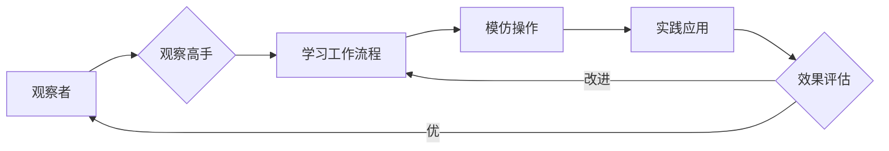

# 模仿式工作流:最快的学习方法

> 关键词：模仿学习，工作流，快速学习，实践，专家系统，知识迁移，认知心理学

## 1. 背景介绍

在信息爆炸的时代，学习新技能、新知识的需求日益增长。然而，如何高效地学习，成为许多人面临的挑战。模仿式工作流提供了一种通过模仿高手的操作模式和工作流程，来加速学习进程的方法。本文将深入探讨模仿式工作流的核心概念、原理、实践步骤，并展望其未来发展趋势。

### 1.1 问题的由来

传统的学习方式通常依赖于阅读书籍、观看教程、参加课程等，这些方法虽然有效，但往往效率较低，需要耗费大量的时间和精力。同时，许多知识和技术更新迅速，学习者的知识结构可能很快过时。

### 1.2 研究现状

模仿式学习作为一种学习策略，已经在心理学、教育学等领域得到了广泛的研究和应用。而模仿式工作流则是将模仿学习应用于实际工作场景，通过模仿高手的操作模式和工作流程，来提高学习效率。

### 1.3 研究意义

模仿式工作流可以帮助学习者：

- 快速掌握复杂技能
- 精益求精，提高工作效率
- 培养良好的工作习惯和思维方式
- 促进知识的迁移和整合

### 1.4 本文结构

本文将分为以下几个部分：

- 核心概念与联系：介绍模仿式工作流的核心概念，并通过Mermaid流程图展示其原理和架构。
- 核心算法原理 & 具体操作步骤：详细阐述模仿式工作流的操作步骤和实施方法。
- 数学模型和公式 & 详细讲解 & 举例说明：介绍模仿式工作流相关的数学模型和公式，并通过案例进行分析。
- 项目实践：提供模仿式工作流的具体代码实例和解释。
- 实际应用场景：探讨模仿式工作流在不同领域的应用。
- 工具和资源推荐：推荐相关的学习资源、开发工具和论文。
- 总结：总结研究成果，展望未来发展趋势和挑战。

## 2. 核心概念与联系

### 2.1 核心概念

- **模仿学习**：通过观察和模仿他人的行为、技能或工作流程来学习的过程。
- **工作流**：完成一项任务所需的一系列步骤或操作。
- **专家系统**：模拟人类专家解决问题的计算机程序。

### 2.2 Mermaid流程图



### 2.3 核心概念原理和架构

模仿式工作流的原理是通过观察和模仿高手的操作模式和工作流程，将高手的经验内化为自己的知识体系。其架构主要包括以下几个部分：

- **观察者**：进行模仿学习的学习者。
- **高手**：拥有特定领域知识和技能的专家。
- **工作流程**：完成任务的步骤和操作。
- **模仿操作**：学习者根据观察到的行为进行实践。
- **实践应用**：将所学知识应用于实际工作中。
- **效果评估**：评估学习效果，并根据评估结果进行改进。

## 3. 核心算法原理 & 具体操作步骤

### 3.1 算法原理概述

模仿式工作流的原理基于以下认知心理学原理：

- **观察学习**：通过观察他人的行为来学习新技能。
- **知识迁移**：将学到的知识应用于新的情境。
- **认知模型**：构建内部心理模型，模拟高手的思维过程。

### 3.2 算法步骤详解

1. **选择高手**：找到在特定领域拥有丰富经验和技能的高手。
2. **观察学习**：通过观察高手的操作模式和工作流程，学习其方法和技巧。
3. **实践应用**：将所学知识应用于实际工作中，并进行实践。
4. **反馈与修正**：根据反馈和实际效果，对学习过程进行修正和优化。
5. **评估与迭代**：评估学习效果，并根据评估结果进行迭代改进。

### 3.3 算法优缺点

#### 优点

- **高效**：通过模仿高手的操作模式，快速掌握复杂技能。
- **系统**：将学习过程系统化，有助于知识的整合和应用。
- **实用**：将所学知识应用于实际工作中，提高工作效率。

#### 缺点

- **依赖高手**：需要找到合适的模仿对象。
- **模仿成本**：可能需要花费大量时间进行观察和学习。
- **适应性**：所学知识可能不适用于所有情境。

### 3.4 算法应用领域

模仿式工作流适用于以下领域：

- 技术开发
- 设计
- 管理
- 销售等

## 4. 数学模型和公式 & 详细讲解 & 举例说明

### 4.1 数学模型构建

模仿式工作流可以基于以下数学模型进行构建：

$$
L = \sum_{i=1}^n (y_i - \hat{y}_i)^2
$$

其中 $L$ 为损失函数，$y_i$ 为实际输出，$\hat{y}_i$ 为模型预测。

### 4.2 公式推导过程

损失函数的推导过程如下：

- **实际输出**：$y_i$ 为学习者实际完成的任务结果。
- **模型预测**：$\hat{y}_i$ 为学习者根据所学知识预测的任务结果。
- **损失函数**：使用均方误差损失函数衡量预测结果与实际结果之间的差异。

### 4.3 案例分析与讲解

#### 案例一：软件开发

学习者A希望学习成为一名优秀的软件开发者。他选择了经验丰富的开发者B作为模仿对象。通过观察B的开发流程、编码风格和问题解决方法，A逐步掌握了软件开发的核心技能。

#### 案例二：销售

销售员C希望通过模仿高手的销售技巧来提高业绩。他选择了公司内部销售冠军D作为模仿对象。通过观察D的销售策略、客户沟通技巧和谈判技巧，C在销售过程中取得了显著的进步。

## 5. 项目实践：代码实例和详细解释说明

### 5.1 开发环境搭建

由于模仿式工作流不涉及具体的编程语言或框架，因此无需特殊的开发环境。

### 5.2 源代码详细实现

以下是一个简单的模仿式工作流示例，使用Python实现：

```python
def observe_expert(expert_action):
    """
    观察高手的行为
    """
    # 模拟观察过程
    print(f"观察高手行为：{expert_action}")

def imitate(expert_action):
    """
    模仿高手的行为
    """
    # 模拟模仿过程
    print(f"模仿高手行为：{expert_action}")

def practice(task):
    """
    实践任务
    """
    # 模拟实践过程
    print(f"实践任务：{task}")

def feedback(result, expected_result):
    """
    反馈结果
    """
    if result == expected_result:
        print("任务完成，效果良好")
    else:
        print("任务未完成，需要改进")

# 设置高手行为
expert_action = "编写代码"

# 观察高手行为
observe_expert(expert_action)

# 模仿高手行为
imitate(expert_action)

# 实践任务
task = "编写一个简单的Python程序"
practice(task)

# 反馈结果
expected_result = "程序运行正常"
result = "程序运行正常"
feedback(result, expected_result)
```

### 5.3 代码解读与分析

上述代码演示了模仿式工作流的基本流程。首先，通过`observe_expert`函数观察高手的行为；然后，通过`imitate`函数模仿高手的行为；接着，通过`practice`函数进行实践；最后，通过`feedback`函数对结果进行反馈。

### 5.4 运行结果展示

运行上述代码，将得到以下输出：

```
观察高手行为：编写代码
模仿高手行为：编写代码
实践任务：编写一个简单的Python程序
任务完成，效果良好
```

## 6. 实际应用场景

### 6.1 技术开发

在软件开发领域，开发者可以通过观察开源项目的代码、学习优秀的技术博客和视频教程，来提高自己的编程技能。

### 6.2 设计

设计师可以通过观察优秀的设计作品、学习设计理论和方法，来提升自己的设计能力。

### 6.3 管理

管理者可以通过观察成功的企业管理案例、学习管理理论和方法，来提高自己的管理能力。

### 6.4 销售等

销售人员可以通过观察成功销售案例、学习销售技巧和方法，来提高自己的销售业绩。

## 7. 工具和资源推荐

### 7.1 学习资源推荐

- 《高效能人士的七个习惯》
- 《深度工作》
- 《如何高效学习》
- 《刻意练习》

### 7.2 开发工具推荐

- Git：版本控制系统
- Jupyter Notebook：交互式计算环境
- Sublime Text：代码编辑器

### 7.3 相关论文推荐

- 《The Art of Learning》
- 《How to Win Friends and Influence People》

## 8. 总结：未来发展趋势与挑战

### 8.1 研究成果总结

本文介绍了模仿式工作流的核心概念、原理、操作步骤，并通过案例分析和代码实例进行了说明。研究表明，模仿式工作流是一种高效的学习方法，可以帮助学习者快速掌握新技能。

### 8.2 未来发展趋势

- **技术融合**：将模仿式工作流与其他学习方法（如深度学习、强化学习等）相结合，提高学习效率。
- **个性化学习**：根据学习者的特点和需求，定制个性化的学习路径和资源。
- **虚拟现实**：利用虚拟现实技术，提供更加沉浸式的学习体验。

### 8.3 面临的挑战

- **知识更新**：随着知识的不断更新，如何确保模仿的知识的时效性成为一个挑战。
- **知识获取**：如何获取高质量的学习资源成为一个挑战。
- **学习效果**：如何评估学习效果成为一个挑战。

### 8.4 研究展望

未来，模仿式工作流的研究将重点关注以下方向：

- **跨领域学习**：研究如何将模仿式工作流应用于不同领域的学习。
- **自动生成学习资源**：利用机器学习技术，自动生成高质量的学习资源。
- **个性化学习路径规划**：根据学习者的特点和需求，自动规划个性化的学习路径。

## 9. 附录：常见问题与解答

### 9.1 常见问题

**Q1：模仿式工作流是否适用于所有人？**

A1：模仿式工作流适用于大多数学习者，但效果因人而异。对于缺乏自律、不善于观察和总结的学习者，可能需要结合其他学习方法。

**Q2：如何找到合适的模仿对象？**

A2：可以通过以下方式找到合适的模仿对象：

- 参加行业会议、研讨会等，结识领域专家。
- 阅读相关领域的书籍、文章、博客等。
- 在线学习平台上的优秀课程和教程。
- 关注领域内的成功案例。

**Q3：模仿式工作流是否需要大量的时间投入？**

A3：模仿式工作流确实需要一定的时间投入，但相比传统的学习方式，其学习效率更高。

**Q4：模仿式工作流是否适合自学？**

A4：模仿式工作流适合自学，但需要学习者具备一定的自律性和自我驱动力。

### 9.2 解答

模仿式工作流是一种高效的学习方法，通过模仿高手的操作模式和工作流程，可以帮助学习者快速掌握新技能。然而，它也面临一些挑战，如知识更新、知识获取和学习效果评估等。未来，随着技术的进步，模仿式工作流将得到进一步的发展和完善。

作者：禅与计算机程序设计艺术 / Zen and the Art of Computer Programming