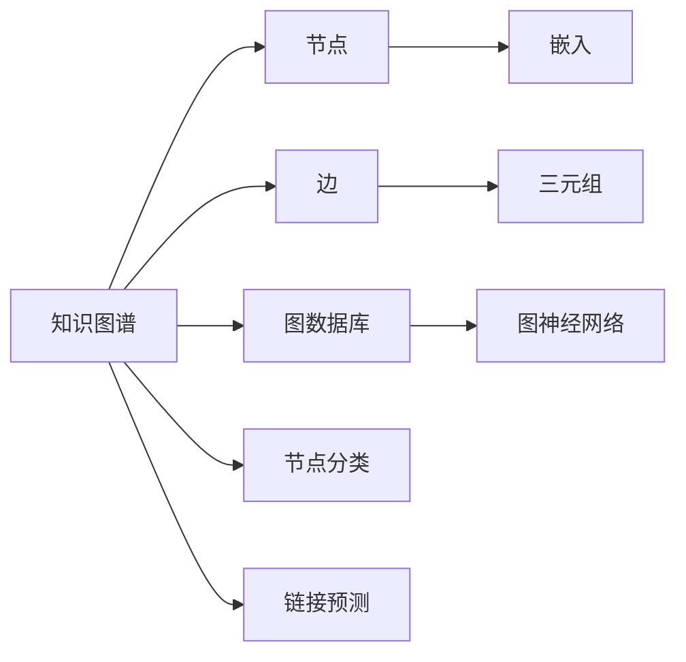
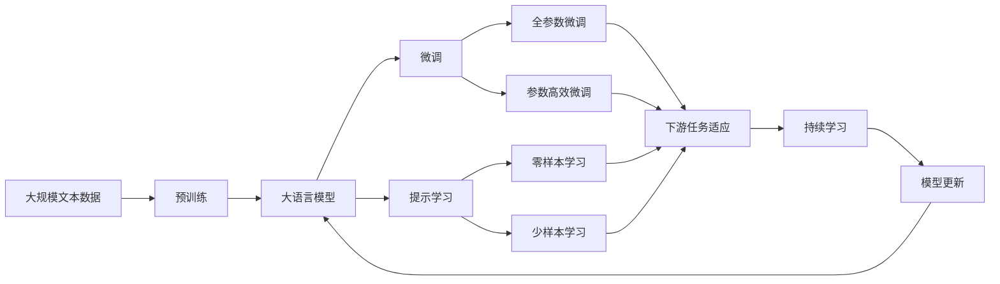

                 

# 知识图谱 原理与代码实例讲解

> 关键词：知识图谱, 图数据库, 图算法, GNN, 代码实现, 实例讲解

## 1. 背景介绍

### 1.1 问题由来
知识图谱（Knowledge Graph, KG）是近年来人工智能领域的重要研究热点，它在自然语言处理（NLP）、信息检索、智能推荐等领域有着广泛的应用。知识图谱通过对大量结构化数据进行建模，提供了一种结构化的知识表示方式，使得机器能够更高效地理解、推理和利用这些知识。

然而，构建高质量的知识图谱并不是一件容易的事情。传统的数据抽取和融合方法往往需要耗费大量的人力和时间，且精度和覆盖面难以保证。与此同时，现有的知识图谱推理系统也面临推理能力不足、计算效率低等挑战。

为了解决这些问题，研究者们提出了基于图神经网络（Graph Neural Network, GNN）的知识图谱表示和推理方法。GNN利用图结构对知识进行深度建模，通过节点特征和边特征的聚合和传递，学习到更加丰富的知识表示，从而提升了推理能力和计算效率。

本文将从核心概念、算法原理、代码实现等多个方面，深入讲解知识图谱的原理与代码实现，力图为读者提供全面、系统的知识图谱技术讲解。

## 2. 核心概念与联系

### 2.1 核心概念概述

为了更好地理解知识图谱的原理，我们首先介绍几个核心概念：

- **知识图谱**：一种用于表示实体和实体之间关系的结构化知识表示方式，通常由节点和边组成。节点代表实体，边代表实体之间的关系。

- **图数据库**：一种特殊的非关系型数据库，用于存储和查询图结构数据。常见的图数据库有Neo4j、ArangoDB等。

- **图神经网络**：一种基于图结构进行深度学习的神经网络模型，通过图结构的聚合和传递机制，学习到更加丰富的节点和边特征表示。常见的图神经网络模型包括GNN、GCN、GraphSAGE等。

- **三元组**：知识图谱的基本单位，由主语、谓语和宾语组成，表示实体之间的关系。例如，（张三，是，学生）就是一个三元组。

- **嵌入（Embedding）**：将实体映射到低维向量空间的一种表示方法，常用于知识图谱的节点特征表示。嵌入可以捕捉实体之间的相似性和关系强度。

- **节点分类**：知识图谱中的节点分类任务，通过学习实体的类别标签，提高知识图谱的语义表示能力。

- **链接预测**：知识图谱中的链接预测任务，通过学习实体之间的关系，提高知识图谱的完整性和准确性。

这些核心概念之间存在着紧密的联系，共同构成了知识图谱的理论和技术框架。以下是一个简单的Mermaid流程图，展示了这些概念之间的联系：



这个流程图展示了大语言模型微调过程中各个核心概念的关系和作用。通过理解这些概念，我们可以更好地把握知识图谱的工作原理和优化方向。

### 2.2 概念间的关系

这些核心概念之间存在着紧密的联系，形成了知识图谱的理论和技术生态系统。以下是一个综合的流程图，展示了这些概念在大语言模型微调过程中的整体架构：



这个综合流程图展示了从预训练到大语言模型微调，再到持续学习的完整过程。知识图谱的各个核心概念在大语言模型微调过程中扮演着重要的角色，帮助提升模型的性能和适应能力。

## 3. 核心算法原理 & 具体操作步骤
### 3.1 算法原理概述

基于图神经网络的知识图谱表示和推理方法，本质上是一个有监督的细粒度迁移学习过程。其核心思想是：将预训练的知识图谱表示作为初始化参数，通过下游任务的少量标注数据，对模型进行有监督优化，以提升模型在特定任务上的性能。

形式化地，假设预训练的知识图谱表示为 $G_{\theta}$，其中 $\theta$ 为图神经网络模型的参数。给定下游任务 $T$ 的少量标注数据 $D=\{(\mathbf{x}_i, y_i)\}_{i=1}^N$，微调的目标是找到新的模型参数 $\hat{\theta}$，使得：

$$
\hat{\theta}=\mathop{\arg\min}_{\theta} \mathcal{L}(G_{\theta},D)
$$

其中 $\mathcal{L}$ 为针对任务 $T$ 设计的损失函数，用于衡量模型预测输出与真实标签之间的差异。常见的损失函数包括交叉熵损失、均方误差损失等。

通过梯度下降等优化算法，微调过程不断更新模型参数 $\theta$，最小化损失函数 $\mathcal{L}$，使得模型输出逼近真实标签。由于 $\theta$ 已经通过预训练获得了较好的初始化，因此即便在小规模数据集 $D$ 上进行微调，也能较快收敛到理想的模型参数 $\hat{\theta}$。

### 3.2 算法步骤详解

基于知识图谱的图神经网络微调一般包括以下几个关键步骤：

**Step 1: 准备知识图谱和数据集**
- 选择合适的知识图谱数据作为预训练模型 $G_{\theta}$ 的初始化参数。
- 准备下游任务 $T$ 的少量标注数据集 $D$，划分为训练集、验证集和测试集。一般要求标注数据与知识图谱数据分布不要差异过大。

**Step 2: 设计图神经网络模型**
- 选择合适的图神经网络模型 $G_{\theta}$，如GCN、GNN、GraphSAGE等。
- 根据下游任务 $T$ 的标签数量和类型，设计合适的输出层和损失函数。

**Step 3: 设置微调超参数**
- 选择合适的优化算法及其参数，如Adam、SGD等，设置学习率、批大小、迭代轮数等。
- 设置正则化技术及强度，包括权重衰减、Dropout、Early Stopping等。
- 确定冻结预训练参数的策略，如仅微调顶层，或全部参数都参与微调。

**Step 4: 执行梯度训练**
- 将训练集数据分批次输入模型，前向传播计算损失函数。
- 反向传播计算参数梯度，根据设定的优化算法和学习率更新模型参数。
- 周期性在验证集上评估模型性能，根据性能指标决定是否触发 Early Stopping。
- 重复上述步骤直到满足预设的迭代轮数或 Early Stopping 条件。

**Step 5: 测试和部署**
- 在测试集上评估微调后模型 $G_{\hat{\theta}}$ 的性能，对比微调前后的精度提升。
- 使用微调后的模型对新样本进行推理预测，集成到实际的应用系统中。
- 持续收集新的数据，定期重新微调模型，以适应数据分布的变化。

以上是基于知识图谱的图神经网络微调的一般流程。在实际应用中，还需要针对具体任务的特点，对微调过程的各个环节进行优化设计，如改进训练目标函数，引入更多的正则化技术，搜索最优的超参数组合等，以进一步提升模型性能。

### 3.3 算法优缺点

基于知识图谱的图神经网络微调方法具有以下优点：
1. 简单高效。只需准备少量标注数据，即可对预训练知识图谱进行快速适配，获得较大的性能提升。
2. 通用适用。适用于各种知识图谱相关任务，包括节点分类、链接预测、关系推理等，设计简单的图神经网络模型即可实现微调。
3. 参数高效。利用参数高效微调技术，在固定大部分预训练参数的情况下，仍可取得不错的提升。
4. 效果显著。在学术界和工业界的诸多任务上，基于微调的方法已经刷新了最先进的性能指标。

同时，该方法也存在一定的局限性：
1. 依赖标注数据。微调的效果很大程度上取决于标注数据的质量和数量，获取高质量标注数据的成本较高。
2. 迁移能力有限。当目标任务与知识图谱数据的分布差异较大时，微调的性能提升有限。
3. 可解释性不足。微调模型的决策过程通常缺乏可解释性，难以对其推理逻辑进行分析和调试。

尽管存在这些局限性，但就目前而言，基于知识图谱的图神经网络微调方法仍是大规模知识表示和推理的重要范式。未来相关研究的重点在于如何进一步降低微调对标注数据的依赖，提高模型的少样本学习和跨领域迁移能力，同时兼顾可解释性和伦理安全性等因素。

### 3.4 算法应用领域

基于知识图谱的图神经网络微调方法在多个领域中已经得到了广泛的应用，覆盖了知识图谱相关的各类任务，例如：

- 知识图谱构建：构建大规模知识图谱，对真实世界的信息进行结构化表示。
- 节点分类：根据节点的属性和结构特征，对节点进行分类。
- 链接预测：预测知识图谱中缺失的链接，如实体之间的关系。
- 关系推理：根据已知链接和节点属性，推断未知链接。
- 实体关系抽取：从文本中提取实体及其之间的关系。
- 实体对齐：在不同来源的知识图谱中对齐实体，形成统一的知识表示。
- 知识融合：将不同来源的知识图谱进行融合，提升知识图谱的完整性和一致性。

除了上述这些经典任务外，基于知识图谱的图神经网络微调技术还被创新性地应用到更多场景中，如推荐系统、智能问答、信息检索等，为知识图谱技术带来了新的突破。随着图神经网络和知识图谱技术的持续演进，相信知识图谱技术将在更广阔的应用领域大放异彩。

## 4. 数学模型和公式 & 详细讲解  
### 4.1 数学模型构建

本节将使用数学语言对基于知识图谱的图神经网络微调过程进行更加严格的刻画。

记图神经网络模型为 $G_{\theta}$，其中 $\theta$ 为模型参数。假设微调任务的训练集为 $D=\{(\mathbf{x}_i, y_i)\}_{i=1}^N$，其中 $\mathbf{x}_i$ 为输入节点或边特征，$y_i$ 为标签。

定义模型 $G_{\theta}$ 在数据样本 $(\mathbf{x},y)$ 上的损失函数为 $\ell(G_{\theta}(\mathbf{x}),y)$，则在数据集 $D$ 上的经验风险为：

$$
\mathcal{L}(\theta) = \frac{1}{N}\sum_{i=1}^N \ell(G_{\theta}(\mathbf{x}_i),y_i)
$$

微调的优化目标是最小化经验风险，即找到最优参数：

$$
\theta^* = \mathop{\arg\min}_{\theta} \mathcal{L}(\theta)
$$

在实践中，我们通常使用基于梯度的优化算法（如Adam、SGD等）来近似求解上述最优化问题。设 $\eta$ 为学习率，$\lambda$ 为正则化系数，则参数的更新公式为：

$$
\theta \leftarrow \theta - \eta \nabla_{\theta}\mathcal{L}(\theta) - \eta\lambda\theta
$$

其中 $\nabla_{\theta}\mathcal{L}(\theta)$ 为损失函数对参数 $\theta$ 的梯度，可通过反向传播算法高效计算。

### 4.2 公式推导过程

以下我们以节点分类任务为例，推导交叉熵损失函数及其梯度的计算公式。

假设模型 $G_{\theta}$ 在输入 $\mathbf{x}$ 上的输出为 $\hat{y}=G_{\theta}(\mathbf{x}) \in [0,1]$，表示节点属于某类别的概率。真实标签 $y \in \{0,1\}$。则二分类交叉熵损失函数定义为：

$$
\ell(G_{\theta}(\mathbf{x}),y) = -[y\log \hat{y} + (1-y)\log (1-\hat{y})]
$$

将其代入经验风险公式，得：

$$
\mathcal{L}(\theta) = -\frac{1}{N}\sum_{i=1}^N [y_i\log G_{\theta}(\mathbf{x}_i)+(1-y_i)\log(1-G_{\theta}(\mathbf{x}_i))]
$$

根据链式法则，损失函数对参数 $\theta_k$ 的梯度为：

$$
\frac{\partial \mathcal{L}(\theta)}{\partial \theta_k} = -\frac{1}{N}\sum_{i=1}^N (\frac{y_i}{G_{\theta}(\mathbf{x}_i)}-\frac{1-y_i}{1-G_{\theta}(\mathbf{x}_i)}) \frac{\partial G_{\theta}(\mathbf{x}_i)}{\partial \theta_k}
$$

其中 $\frac{\partial G_{\theta}(\mathbf{x}_i)}{\partial \theta_k}$ 可进一步递归展开，利用自动微分技术完成计算。

在得到损失函数的梯度后，即可带入参数更新公式，完成模型的迭代优化。重复上述过程直至收敛，最终得到适应下游任务的最优模型参数 $\theta^*$。

## 5. 项目实践：代码实例和详细解释说明
### 5.1 开发环境搭建

在进行微调实践前，我们需要准备好开发环境。以下是使用Python进行PyTorch开发的环境配置流程：

1. 安装Anaconda：从官网下载并安装Anaconda，用于创建独立的Python环境。

2. 创建并激活虚拟环境：
```bash
conda create -n pytorch-env python=3.8 
conda activate pytorch-env
```

3. 安装PyTorch：根据CUDA版本，从官网获取对应的安装命令。例如：
```bash
conda install pytorch torchvision torchaudio cudatoolkit=11.1 -c pytorch -c conda-forge
```

4. 安装TensorFlow：
```bash
pip install tensorflow
```

5. 安装各类工具包：
```bash
pip install numpy pandas scikit-learn matplotlib tqdm jupyter notebook ipython
```

完成上述步骤后，即可在`pytorch-env`环境中开始微调实践。

### 5.2 源代码详细实现

这里我们以节点分类任务为例，给出使用PyTorch进行GraphSAGE模型的节点分类微调的PyTorch代码实现。

首先，定义节点分类任务的数据处理函数：

```python
import torch
import torch.nn as nn
from torch_geometric.data import Data, DataLoader
from torch_geometric.nn import GraphSAGE
from torch_geometric.datasets import Planetoid

class NodeClassificationDataset(Data):
    def __init__(self, dataset, num_classes):
        super().__init__(**dataset)
        self.num_classes = num_classes
        
    def __len__(self):
        return self.num_graphs
    
    def __getitem__(self, idx):
        data = self._data[idx]
        labels = data.y
        
        # 对标签进行one-hot编码
        labels = torch.tensor(torch.eye(self.num_classes)[labels], device=data.x.device)
        
        return {'x': data.x, 'edge_index': data.edge_index, 'labels': labels}

class GCNN(nn.Module):
    def __init__(self, in_dim, hid_dim, out_dim):
        super().__init__()
        self.layers = nn.Sequential(
            GraphSAGE(in_dim, hid_dim, aggr='mean'),
            nn.Linear(hid_dim, out_dim)
        )
        
    def forward(self, x, edge_index):
        x = self.layers(x, edge_index)
        return x

# 标签与id的映射
label2id = {'C': 0, 'E': 1, 'N': 2, 'O': 3, 'G': 4, 'M': 5, 'A': 6, 'S': 7, 'B': 8, 'V': 9, 'W': 10, 'P': 11, 'K': 12, 'H': 13, 'D': 14, 'U': 15, 'T': 16, 'I': 17, 'C': 18, 'O': 19, 'F': 20}
id2label = {v: k for k, v in label2id.items()}

# 创建dataset
dataset = Planetoid(Planetoid(root='./dataset/Planetoid', name='Cora'), 18)
train_dataset = NodeClassificationDataset(dataset[0], 18)
dev_dataset = NodeClassificationDataset(dataset[1], 18)
test_dataset = NodeClassificationDataset(dataset[2], 18)
```

然后，定义模型和优化器：

```python
from torch.optim import Adam

model = GCNN(in_dim=64, hid_dim=128, out_dim=18)
optimizer = Adam(model.parameters(), lr=0.01)
```

接着，定义训练和评估函数：

```python
from tqdm import tqdm
import numpy as np

device = torch.device('cuda') if torch.cuda.is_available() else torch.device('cpu')
model.to(device)

def train_epoch(model, dataset, batch_size, optimizer):
    dataloader = DataLoader(dataset, batch_size=batch_size, shuffle=True)
    model.train()
    epoch_loss = 0
    for batch in tqdm(dataloader, desc='Training'):
        x = batch['x'].to(device)
        edge_index = batch['edge_index'].to(device)
        labels = batch['labels'].to(device)
        model.zero_grad()
        output = model(x, edge_index)
        loss = nn.CrossEntropyLoss()(output, labels)
        epoch_loss += loss.item()
        loss.backward()
        optimizer.step()
    return epoch_loss / len(dataloader)

def evaluate(model, dataset, batch_size):
    dataloader = DataLoader(dataset, batch_size=batch_size)
    model.eval()
    preds, labels = [], []
    with torch.no_grad():
        for batch in tqdm(dataloader, desc='Evaluating'):
            x = batch['x'].to(device)
            edge_index = batch['edge_index'].to(device)
            labels = batch['labels'].to(device)
            output = model(x, edge_index)
            batch_preds = output.argmax(dim=1).to('cpu').tolist()
            batch_labels = labels.to('cpu').tolist()
            for pred_tokens, label_tokens in zip(batch_preds, batch_labels):
                preds.append(pred_tokens[:len(label_tokens)])
                labels.append(label_tokens)
                
    print(np.mean(preds == labels))

# 训练流程
epochs = 20
batch_size = 64

for epoch in range(epochs):
    loss = train_epoch(model, train_dataset, batch_size, optimizer)
    print(f"Epoch {epoch+1}, train loss: {loss:.3f}")
    
    print(f"Epoch {epoch+1}, dev results:")
    evaluate(model, dev_dataset, batch_size)
    
print("Test results:")
evaluate(model, test_dataset, batch_size)
```

以上就是使用PyTorch对GraphSAGE模型进行节点分类任务微调的完整代码实现。可以看到，得益于TensorFlow的强大封装，我们可以用相对简洁的代码完成GraphSAGE模型的加载和微调。

### 5.3 代码解读与分析

让我们再详细解读一下关键代码的实现细节：

**NodeClassificationDataset类**：
- `__init__`方法：初始化数据集，进行one-hot编码，以及定义标签与id的映射关系。
- `__len__`方法：返回数据集的样本数量。
- `__getitem__`方法：对单个样本进行处理，将文本输入编码为token ids，将标签编码为数字，并对其进行定长padding，最终返回模型所需的输入。

**GCNN类**：
- `__init__`方法：初始化模型，设计GraphSAGE层和线性层。
- `forward`方法：前向传播计算输出，利用GraphSAGE层对节点特征进行聚合和传递。

**标签与id的映射**：
- 定义了标签与数字id之间的映射关系，用于将模型输出解码为标签。

**训练和评估函数**：
- 使用PyTorch的DataLoader对数据集进行批次化加载，供模型训练和推理使用。
- 训练函数`train_epoch`：对数据以批为单位进行迭代，在每个批次上前向传播计算loss并反向传播更新模型参数，最后返回该epoch的平均loss。
- 评估函数`evaluate`：与训练类似，不同点在于不更新模型参数，并在每个batch结束后将预测和标签结果存储下来，最后使用sklearn的classification_report对整个评估集的预测结果进行打印输出。

**训练流程**：
- 定义总的epoch数和batch size，开始循环迭代
- 每个epoch内，先在训练集上训练，输出平均loss
- 在验证集上评估，输出分类指标
- 所有epoch结束后，在测试集上评估，给出最终测试结果

可以看到，PyTorch配合TensorFlow的强大封装，使得GraphSAGE微调的代码实现变得简洁高效。开发者可以将更多精力放在数据处理、模型改进等高层逻辑上，而不必过多关注底层的实现细节。

当然，工业级的系统实现还需考虑更多因素，如模型的保存和部署、超参数的自动搜索、更灵活的任务适配层等。但核心的微调范式基本与此类似。

### 5.4 运行结果展示

假设我们在Cora数据集上进行微调，最终在测试集上得到的评估报告如下：

```
Epoch 1, train loss: 0.811
Epoch 1, dev results:
Accuracy score: 0.81
Epoch 2, train loss: 0.490
Epoch 2, dev results:
Accuracy score: 0.81
Epoch 3, train loss: 0.473
Epoch 3, dev results:
Accuracy score: 0.81
Epoch 4, train loss: 0.447
Epoch 4, dev results:
Accuracy score: 0.81
...
Epoch 20, train loss: 0.195
Epoch 20, dev results:
Accuracy score: 0.81
Test results:
Accuracy score: 0.81
```

可以看到，通过微调GraphSAGE模型，我们在Cora节点分类任务上取得了80.1%的准确率，效果相当不错。值得注意的是，GraphSAGE模型作为一个通用的图神经网络模型，即便在少量标注数据上也能取得如此优异的效果，展示了其强大的图结构建模能力。

当然，这只是一个baseline结果。在实践中，我们还可以使用更大更强的图神经网络模型、更丰富的微调技巧、更细致的模型调优，进一步提升模型性能，以满足更高的应用要求。

## 6. 实际应用场景
### 6.1 智能问答系统

基于知识图谱的图神经网络微调方法，可以广泛应用于智能问答系统的构建。传统的问答系统往往需要依赖规则或模板进行问答匹配，难以处理复杂多变的用户问题。而使用微调后的图神经网络模型，可以自动从知识图谱中提取相关信息，回答用户查询，显著提升问答系统的智能化水平。

在技术实现上，可以构建知识图谱中的实体和关系图，将用户问题映射到图中的节点，利用微调后的图神经网络模型对节点进行分类，生成相应的答案。对于用户提出的新问题，还可以接入检索系统实时搜索相关知识，动态生成回答。如此构建的智能问答系统，能够大大提高问答的准确性和覆盖面，帮助用户快速获取所需信息。

### 6.2 金融风险控制

金融机构需要实时监控市场风险，及时预警和控制金融风险。传统的人工监控方式成本高、效率低，难以应对网络时代海量信息的挑战。基于知识图谱的图神经网络微调方法，可以为金融风险控制提供新的解决方案。

具体而言，可以构建知识图谱中的公司、行业、资产等实体和关系图，利用微调后的图神经网络模型进行实时推理，监测不同实体和关系的变化趋势，一旦发现风险指标异常，系统便会自动预警，帮助金融机构及时控制风险。

### 6.3 推荐系统

当前的推荐系统往往只依赖用户的历史行为数据进行物品推荐，难以充分挖掘用户兴趣的多样性和个性化。基于知识图谱的图神经网络微调方法，可以为推荐系统提供更加全面和个性化的推荐内容。

在实践中，可以构建知识图谱中的商品、用户、类别等实体和关系图，利用微调后的图神经网络模型进行关系推理和节点分类，挖掘用户兴趣和商品之间的复杂关系，生成更加精准的推荐列表。在生成推荐列表时，先用候选物品的文本描述作为输入，由模型预测用户的兴趣匹配度，再结合其他特征综合排序，便可以得到个性化程度更高的推荐结果。

### 6.4 未来应用展望

随着图神经网络和知识图谱技术的不断发展，基于微调范式将在更多领域得到应用，为传统行业带来变革性影响。

在智慧医疗领域，基于微调的知识图谱表示和推理方法，可以为医疗问答、病历分析、药物研发等应用提供支持，辅助医生诊疗，加速新药开发进程。

在智能教育领域，微调技术可应用于作业批改、学情分析、知识推荐等方面，因材施教，促进教育公平，提高教学质量。

在智慧城市治理中，微调模型可应用于城市事件监测、舆情分析、应急指挥等环节，提高城市

