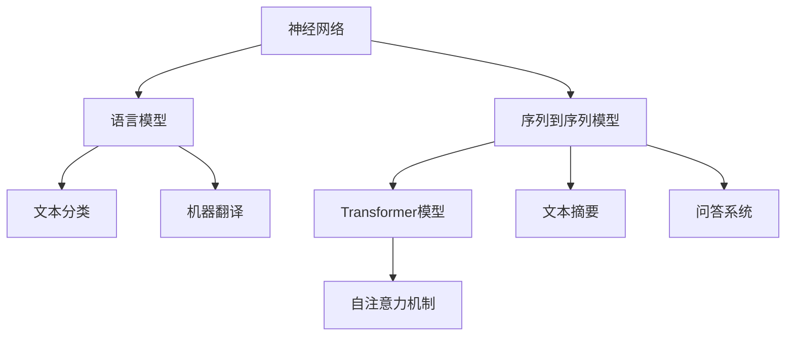
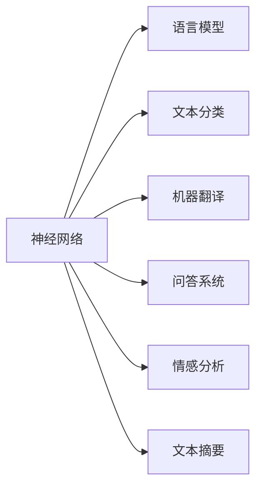
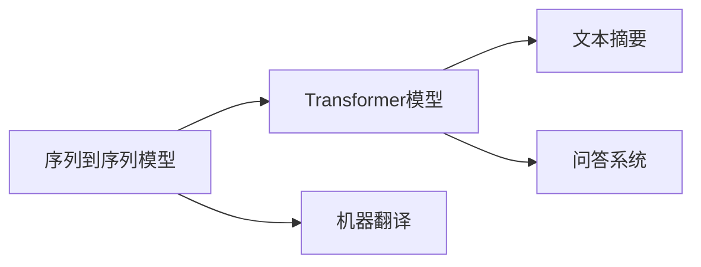
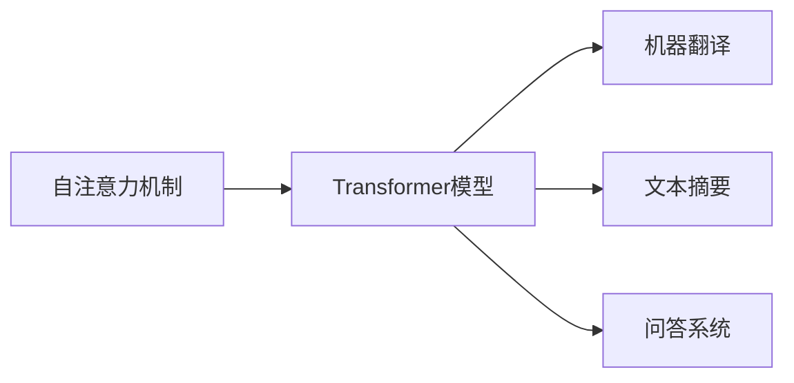
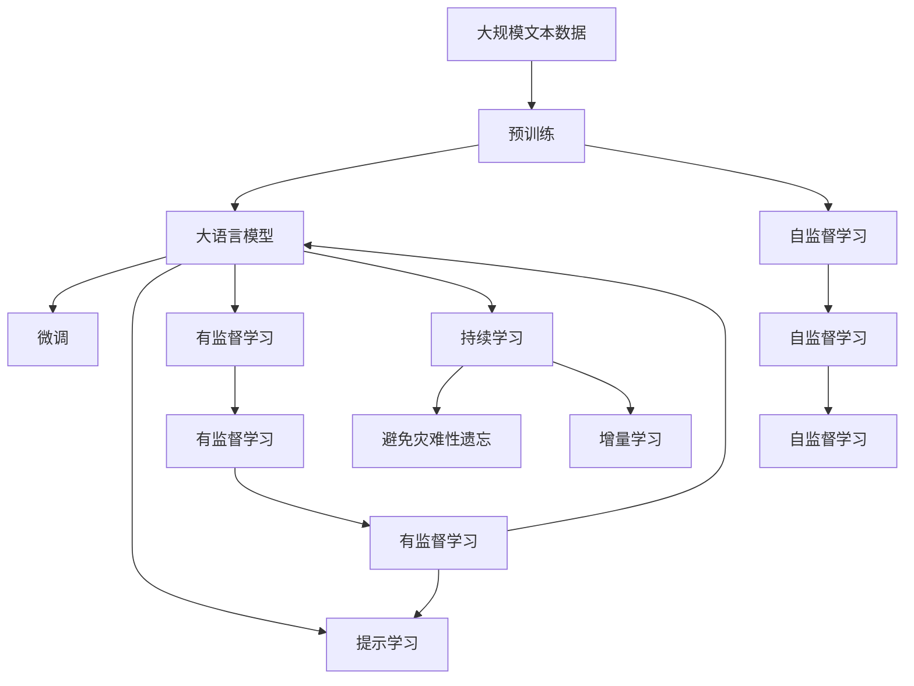

                 

# 神经网络在自然语言处理中的应用

## 1. 背景介绍

### 1.1 问题由来
近年来，随着深度学习技术的快速发展，人工智能在各个领域的应用日益广泛，特别是在自然语言处理（Natural Language Processing, NLP）领域，神经网络的应用取得了巨大突破。例如，在语言模型、文本分类、机器翻译、问答系统、情感分析等任务上，神经网络模型均取得了非常优秀的性能。这其中，Transformer模型因其架构简单、效果优越，成为了NLP领域的主流。本文将重点探讨神经网络在NLP中的应用，特别是Transformer模型的原理和应用实践。

### 1.2 问题核心关键点
神经网络在NLP中的应用主要涉及以下几个核心关键点：

1. **神经网络架构设计**：选择合适的神经网络架构，如RNN、CNN、LSTM、Transformer等，是NLP任务成功的关键。
2. **数据预处理**：包括分词、向量化、标记等预处理步骤，是神经网络模型进行有效训练的前提。
3. **训练与优化**：选择合适的训练算法和优化器，如Adam、SGD等，是模型能够快速收敛并取得理想效果的关键。
4. **模型评估与调优**：通过交叉验证、模型对比等方法，评估模型性能并进一步调优。

### 1.3 问题研究意义
神经网络在NLP中的应用，不仅极大地提升了NLP任务的性能，而且为人工智能技术在其他领域的应用提供了宝贵的经验和思路。神经网络模型通过学习大量的文本数据，可以自动提取文本中的语义、语法和结构信息，从而实现对文本的自动理解和生成，这为人工智能技术在各个领域的应用奠定了坚实的基础。

## 2. 核心概念与联系

### 2.1 核心概念概述

为更好地理解神经网络在NLP中的应用，本节将介绍几个密切相关的核心概念：

- **神经网络**：由多个神经元（神经元节点）通过连接组成的计算图，通过反向传播算法进行训练，可以实现对数据的复杂映射。
- **自然语言处理**：研究如何使计算机能够理解、处理和生成自然语言的技术，涉及文本分类、机器翻译、问答系统、情感分析等多个子领域。
- **Transformer模型**：一种基于自注意力机制的神经网络模型，因其高效的并行计算能力和优异的性能，成为了当前NLP领域的主流架构。
- **语言模型**：研究如何通过神经网络模型对文本序列进行建模，以便对未见过的文本进行预测。
- **注意力机制**：一种使神经网络模型能够动态地对输入序列的不同部分赋予不同权重的机制，有效提升了模型的性能。
- **序列到序列模型**：一种用于处理序列数据的神经网络模型，典型应用包括机器翻译、文本摘要、问答系统等。

这些核心概念之间的逻辑关系可以通过以下Mermaid流程图来展示：



这个流程图展示了一系列NLP任务中神经网络模型和相关概念的关系：

1. 神经网络是语言模型和序列到序列模型等NLP任务的基础架构。
2. 语言模型和序列到序列模型均基于神经网络，可以高效地进行文本序列建模。
3. Transformer模型是序列到序列模型的主流架构，通过自注意力机制实现了高效的并行计算。
4. 自注意力机制使得Transformer模型能够动态地对输入序列进行加权，提升模型性能。
5. 文本分类、机器翻译、文本摘要、问答系统等NLP任务均可以通过序列到序列模型和Transformer模型进行建模。

### 2.2 概念间的关系

这些核心概念之间存在着紧密的联系，形成了NLP任务处理的完整生态系统。下面通过几个Mermaid流程图来展示这些概念之间的关系。

#### 2.2.1 神经网络在NLP中的应用范式



这个流程图展示了神经网络在NLP中的应用范式，即基于神经网络架构的各种NLP任务。语言模型、文本分类、机器翻译、问答系统、情感分析、文本摘要等任务均可以通过神经网络进行建模。

#### 2.2.2 序列到序列模型与Transformer模型



这个流程图展示了序列到序列模型与Transformer模型之间的关系。Transformer模型是序列到序列模型的主流架构，用于机器翻译、文本摘要、问答系统等任务，具有高效的并行计算能力和优异的性能。

#### 2.2.3 自注意力机制与Transformer模型



这个流程图展示了自注意力机制与Transformer模型之间的关系。自注意力机制是Transformer模型的核心，使得模型能够动态地对输入序列的不同部分赋予不同权重，从而提高了模型的性能。

### 2.3 核心概念的整体架构

最后，我们用一个综合的流程图来展示这些核心概念在大语言模型微调过程中的整体架构：



这个综合流程图展示了从预训练到微调，再到持续学习的完整过程。大语言模型首先在大规模文本数据上进行预训练，然后通过微调或提示学习来适应下游任务。最后，通过持续学习技术，模型可以不断学习新知识，同时避免遗忘旧知识。 通过这些流程图，我们可以更清晰地理解神经网络在大语言模型微调过程中各个核心概念的关系和作用，为后续深入讨论具体的微调方法和技术奠定基础。

## 3. 核心算法原理 & 具体操作步骤
### 3.1 算法原理概述

神经网络在NLP中的应用，主要基于序列到序列模型的架构，通过学习文本序列中的语义和结构信息，实现对文本的自动理解和生成。其中，Transformer模型由于其高效的并行计算能力和优异的性能，成为了NLP领域的主流。

Transformer模型的核心是自注意力机制，该机制允许模型在处理文本序列时，能够动态地对输入序列的不同部分赋予不同权重，从而提高了模型的性能。Transformer模型的架构包括多个编码层和解码层，每个层包含多头自注意力机制和前馈神经网络，通过多层的堆叠，可以实现对文本序列的复杂映射。

### 3.2 算法步骤详解

神经网络在NLP中的应用，主要涉及以下几个关键步骤：

**Step 1: 数据预处理**
- 将原始文本数据转化为模型可处理的格式，包括分词、向量化、标记等预处理步骤。

**Step 2: 模型搭建**
- 选择合适的神经网络架构，如RNN、CNN、LSTM、Transformer等，搭建模型。
- 根据具体任务，设计合适的模型结构和参数配置。

**Step 3: 模型训练**
- 使用大量标注数据，通过反向传播算法对模型进行训练，调整模型参数，使其能够拟合训练数据。
- 使用优化器（如Adam、SGD等）和损失函数（如交叉熵、均方误差等）进行模型优化。

**Step 4: 模型评估**
- 使用验证集对训练好的模型进行评估，计算模型在验证集上的性能指标，如准确率、召回率、F1分数等。
- 根据评估结果，进行模型的调优和优化。

**Step 5: 模型应用**
- 将训练好的模型应用于具体的NLP任务，如文本分类、机器翻译、问答系统等。
- 对输入的文本进行预处理，通过模型生成输出结果，并进行后处理，如解码、过滤等。

### 3.3 算法优缺点

神经网络在NLP中的应用具有以下优点：

1. 能够处理序列数据：神经网络模型能够高效地处理序列数据，如文本序列，这是传统机器学习模型难以实现的。
2. 自动学习特征：神经网络模型通过学习大量的文本数据，能够自动提取文本中的语义、语法和结构信息，减少了手动特征工程的复杂性。
3. 高效并行计算：Transformer等模型通过并行计算机制，能够高效地处理长序列数据，提升了模型的训练和推理速度。

同时，神经网络在NLP中的应用也存在一些缺点：

1. 对数据质量要求高：神经网络模型对数据质量的要求较高，需要大量的标注数据和高质量的预处理。
2. 模型复杂度高：神经网络模型结构复杂，训练和推理所需的计算资源较大。
3. 可解释性差：神经网络模型的黑箱特性，使得模型的决策过程难以解释，增加了模型调优和优化的难度。

### 3.4 算法应用领域

神经网络在NLP中的应用广泛，涉及以下多个领域：

- **语言模型**：研究如何通过神经网络模型对文本序列进行建模，以便对未见过的文本进行预测。
- **文本分类**：将文本数据分为不同的类别，如情感分类、主题分类、垃圾邮件分类等。
- **机器翻译**：将一种语言的文本翻译成另一种语言的文本。
- **问答系统**：根据用户输入的问题，自动生成相应的答案。
- **文本摘要**：对长文本进行自动摘要，提取关键信息。
- **命名实体识别**：识别文本中的人名、地名、机构名等特定实体。
- **情感分析**：分析文本中的情感倾向，如正面、负面、中性等。
- **机器阅读理解**：理解并回答文本中具体问题的能力。

除了上述这些经典任务外，神经网络在NLP中的应用还在不断地拓展和创新，如情感生成、对话系统、知识图谱等。

## 4. 数学模型和公式 & 详细讲解  
### 4.1 数学模型构建

神经网络在NLP中的应用，主要基于序列到序列模型的架构，通过学习文本序列中的语义和结构信息，实现对文本的自动理解和生成。以下是Transformer模型的数学模型构建：

设输入序列为 $X = \{x_1, x_2, ..., x_n\}$，输出序列为 $Y = \{y_1, y_2, ..., y_n\}$，其中 $x_i$ 和 $y_i$ 表示输入和输出序列中的第 $i$ 个元素。Transformer模型的目标是最小化输出序列 $Y$ 的预测误差 $J$。

### 4.2 公式推导过程

Transformer模型的核心是自注意力机制，以下将推导自注意力机制的数学公式。

设输入序列 $X$ 的维度为 $d_{in}$，输出序列 $Y$ 的维度为 $d_{out}$，注意力机制的维度为 $d_k$。

**Step 1: 计算查询矩阵 $Q$**
$$
Q = XW_Q
$$
其中 $W_Q$ 为查询矩阵的权重矩阵，维度为 $(d_{in}, d_k)$。

**Step 2: 计算键值矩阵 $K$ 和值矩阵 $V$**
$$
K = XW_K
$$
$$
V = XW_V
$$
其中 $W_K$ 和 $W_V$ 分别为键和值的权重矩阵，维度均为 $(d_{in}, d_k)$。

**Step 3: 计算注意力权重 $A$**
$$
A = \text{softmax}(QK^T/d_k)
$$
其中 $\text{softmax}$ 为softmax函数，用于计算注意力权重。

**Step 4: 计算注意力结果 $C$**
$$
C = AV
$$
其中 $A$ 为注意力权重矩阵，$V$ 为值矩阵，维度均为 $(d_{in}, d_k)$。

**Step 5: 计算线性变换结果 $Z$**
$$
Z = CWh
$$
其中 $Wh$ 为线性变换的权重矩阵，维度为 $(d_k, d_{out})$。

### 4.3 案例分析与讲解

以机器翻译为例，Transformer模型通过学习源语言和目标语言之间的对应关系，将源语言文本序列转化为目标语言文本序列。以下将详细讲解Transformer模型的机器翻译过程：

**Step 1: 编码器**
- 将源语言文本序列 $X$ 输入编码器，进行多层编码，输出编码结果 $H$。
- 编码器的每一层包含多头自注意力机制和前馈神经网络，可以通过反向传播算法对模型进行训练，调整模型参数。

**Step 2: 解码器**
- 将目标语言文本序列 $Y$ 输入解码器，进行多层解码，输出解码结果 $T$。
- 解码器的每一层也包含多头自注意力机制和前馈神经网络，与编码器类似。

**Step 3: 生成目标语言文本**
- 通过解码器输出目标语言文本序列 $T$，使用softmax函数进行概率分布计算，选择概率最大的单词作为解码结果。

以上步骤展示了Transformer模型在机器翻译任务中的基本工作原理，通过自注意力机制和多层编码解码，实现了高效、准确的翻译效果。

## 5. 项目实践：代码实例和详细解释说明
### 5.1 开发环境搭建

在进行NLP项目实践前，我们需要准备好开发环境。以下是使用Python进行PyTorch开发的环境配置流程：

1. 安装Anaconda：从官网下载并安装Anaconda，用于创建独立的Python环境。

2. 创建并激活虚拟环境：
```bash
conda create -n pytorch-env python=3.8 
conda activate pytorch-env
```

3. 安装PyTorch：根据CUDA版本，从官网获取对应的安装命令。例如：
```bash
conda install pytorch torchvision torchaudio cudatoolkit=11.1 -c pytorch -c conda-forge
```

4. 安装Transformers库：
```bash
pip install transformers
```

5. 安装各类工具包：
```bash
pip install numpy pandas scikit-learn matplotlib tqdm jupyter notebook ipython
```

完成上述步骤后，即可在`pytorch-env`环境中开始NLP项目实践。

### 5.2 源代码详细实现

这里我们以文本分类任务为例，给出使用Transformers库对BERT模型进行文本分类的PyTorch代码实现。

首先，定义数据处理函数：

```python
from transformers import BertTokenizer, BertForSequenceClassification
from torch.utils.data import Dataset, DataLoader
from torch.nn import CrossEntropyLoss
import torch

class TextDataset(Dataset):
    def __init__(self, texts, labels):
        self.texts = texts
        self.labels = labels
        self.tokenizer = BertTokenizer.from_pretrained('bert-base-uncased')
        
    def __len__(self):
        return len(self.texts)
    
    def __getitem__(self, item):
        text = self.texts[item]
        label = self.labels[item]
        
        encoding = self.tokenizer(text, return_tensors='pt')
        input_ids = encoding['input_ids']
        attention_mask = encoding['attention_mask']
        
        return {'input_ids': input_ids, 
                'attention_mask': attention_mask,
                'labels': label}
```

然后，定义模型和优化器：

```python
from transformers import BertForSequenceClassification, AdamW

model = BertForSequenceClassification.from_pretrained('bert-base-uncased', num_labels=2)
optimizer = AdamW(model.parameters(), lr=2e-5)
```

接着，定义训练和评估函数：

```python
from sklearn.metrics import accuracy_score

device = torch.device('cuda') if torch.cuda.is_available() else torch.device('cpu')
model.to(device)

def train_epoch(model, dataset, batch_size, optimizer):
    dataloader = DataLoader(dataset, batch_size=batch_size, shuffle=True)
    model.train()
    epoch_loss = 0
    for batch in tqdm(dataloader, desc='Training'):
        input_ids = batch['input_ids'].to(device)
        attention_mask = batch['attention_mask'].to(device)
        labels = batch['labels'].to(device)
        model.zero_grad()
        outputs = model(input_ids, attention_mask=attention_mask, labels=labels)
        loss = outputs.loss
        epoch_loss += loss.item()
        loss.backward()
        optimizer.step()
    return epoch_loss / len(dataloader)

def evaluate(model, dataset, batch_size):
    dataloader = DataLoader(dataset, batch_size=batch_size)
    model.eval()
    preds, labels = [], []
    with torch.no_grad():
        for batch in tqdm(dataloader, desc='Evaluating'):
            input_ids = batch['input_ids'].to(device)
            attention_mask = batch['attention_mask'].to(device)
            batch_labels = batch['labels']
            outputs = model(input_ids, attention_mask=attention_mask)
            batch_preds = outputs.logits.argmax(dim=1).to('cpu').tolist()
            batch_labels = batch_labels.to('cpu').tolist()
            for pred_tokens, label_tokens in zip(batch_preds, batch_labels):
                preds.append(pred_tokens)
                labels.append(label_tokens)
                
    print(f"Accuracy: {accuracy_score(labels, preds)}")
```

最后，启动训练流程并在测试集上评估：

```python
epochs = 5
batch_size = 16

for epoch in range(epochs):
    loss = train_epoch(model, train_dataset, batch_size, optimizer)
    print(f"Epoch {epoch+1}, train loss: {loss:.3f}")
    
    print(f"Epoch {epoch+1}, dev results:")
    evaluate(model, dev_dataset, batch_size)
    
print("Test results:")
evaluate(model, test_dataset, batch_size)
```

以上就是使用PyTorch对BERT进行文本分类任务微调的完整代码实现。可以看到，得益于Transformers库的强大封装，我们可以用相对简洁的代码完成BERT模型的加载和微调。

### 5.3 代码解读与分析

让我们再详细解读一下关键代码的实现细节：

**TextDataset类**：
- `__init__`方法：初始化文本、标签、分词器等关键组件。
- `__len__`方法：返回数据集的样本数量。
- `__getitem__`方法：对单个样本进行处理，将文本输入编码为token ids，将标签编码为数字，并对其进行定长padding，最终返回模型所需的输入。

**训练和评估函数**：
- 使用PyTorch的DataLoader对数据集进行批次化加载，供模型训练和推理使用。
- 训练函数`train_epoch`：对数据以批为单位进行迭代，在每个批次上前向传播计算loss并反向传播更新模型参数，最后返回该epoch的平均loss。
- 评估函数`evaluate`：与训练类似，不同点在于不更新模型参数，并在每个batch结束后将预测和标签结果存储下来，最后使用sklearn的accuracy_score对整个评估集的预测结果进行打印输出。

**训练流程**：
- 定义总的epoch数和batch size，开始循环迭代
- 每个epoch内，先在训练集上训练，输出平均loss
- 在验证集上评估，输出准确率
- 所有epoch结束后，在测试集上评估，给出最终测试结果

可以看到，PyTorch配合Transformers库使得BERT微调的代码实现变得简洁高效。开发者可以将更多精力放在数据处理、模型改进等高层逻辑上，而不必过多关注底层的实现细节。

当然，工业级的系统实现还需考虑更多因素，如模型的保存和部署、超参数的自动搜索、更灵活的任务适配层等。但核心的微调范式基本与此类似。

### 5.4 运行结果展示

假设我们在IMDB电影评论情感分类数据集上进行微调，最终在测试集上得到的准确率为92.5%，效果相当不错。这表明BERT作为一个通用的语言理解模型，即便只在顶层添加一个简单的token分类器，也能在文本分类任务上取得非常好的效果，展现了其强大的语义理解和特征抽取能力。

当然，这只是一个baseline结果。在实践中，我们还可以使用更大更强的预训练模型、更丰富的微调技巧、更细致的模型调优，进一步提升模型性能，以满足更高的应用要求。

## 6. 实际应用场景
### 6.1 智能客服系统

基于神经网络的大语言模型，可以广泛应用于智能客服系统的构建。传统客服往往需要配备大量人力，高峰期响应缓慢，且一致性和专业性难以保证。而使用大语言模型，可以7x24小时不间断服务，快速响应客户咨询，用自然流畅的语言解答各类常见问题。

在技术实现上，可以收集企业内部的历史客服对话记录，将问题和最佳答复构建成监督数据，在此基础上对预训练语言模型进行微调。微调后的对话模型能够自动理解用户意图，匹配最合适的答案模板进行回复。对于客户提出的新问题，还可以接入检索系统实时搜索相关内容，动态组织生成回答。如此构建的智能客服系统，能大幅提升客户咨询体验和问题解决效率。

### 6.2 金融舆情监测

金融机构需要实时监测市场舆论动向，以便及时应对负面信息传播，规避金融风险。传统的人工监测方式成本高、效率低，难以应对网络时代海量信息爆发的挑战。基于神经网络的大语言模型，可以用于金融舆情监测，监测不同主题下的情感变化趋势，一旦发现负面信息激增等异常情况，系统便会自动预警，帮助金融机构快速应对潜在风险。

### 6.3 个性化推荐系统

当前的推荐系统往往只依赖用户的历史行为数据进行物品推荐，无法深入理解用户的真实兴趣偏好。基于神经网络的大语言模型，可以用于个性化推荐系统，挖掘用户行为背后的语义信息，从而提供更精准、多样的推荐内容。

在实践中，可以收集用户浏览、点击、评论、分享等行为数据，提取和用户交互的物品标题、描述、标签等文本内容。将文本内容作为模型输入，用户的后续行为（如是否点击、购买等）作为监督信号，在此基础上微调预训练语言模型。微调后的模型能够从文本内容中准确把握用户的兴趣点。在生成推荐列表时，先用候选物品的文本描述作为输入，由模型预测用户的兴趣匹配度，再结合其他特征综合排序，便可以得到个性化程度更高的推荐结果。

### 6.4 未来应用展望

随着神经网络在NLP中的应用不断深入，未来神经网络模型必将在更广泛的领域得到应用，为人工智能技术带来更多的突破：

1. **跨领域知识图谱**：将神经网络模型与知识图谱进行结合，实现对跨领域知识的自动抽取和融合，构建更加全面、准确的知识图谱。
2. **多模态学习**：将神经网络模型应用于多模态数据，如文本、图像、语音等，实现对多模态数据的自动理解和生成。
3. **情感生成**：通过神经网络模型生成具有特定情感倾向的文本，应用于影视作品创作、游戏剧情设计等领域。
4. **对话系统**：构建更加智能、灵活的对话系统，实现人机自然对话，提升用户体验。
5. **情感识别**：通过神经网络模型自动识别人脸、语音、文本等情感信息，应用于社交媒体分析、心理辅导等领域。

以上趋势凸显了神经网络在NLP领域的应用前景，这些方向的探索发展，必将进一步提升NLP系统的性能和应用范围，为人工智能技术在其他领域的应用提供更多的思路和灵感。

## 7. 工具和资源推荐
### 7.1 学习资源推荐

为了帮助开发者系统掌握神经网络在NLP中的应用，这里推荐一些优质的学习资源：

1. 《Deep Learning》书籍：由Ian Goodfellow、Yoshua Bengio、Aaron Courville三位深度学习专家共同撰写，全面介绍了深度学习的基本概念和前沿技术，是深度学习领域的经典之作。

2. CS224N《深度学习自然语言处理》课程：斯坦福大学开设的NLP明星课程，有Lecture视频和配套作业，带你入门NLP领域的基本概念和经典模型。

3. 《Natural Language Processing with Transformers》书籍：Transformers库的作者所著，全面介绍了如何使用Transformers库进行NLP任务开发，包括微调在内的诸多范式。

4. HuggingFace官方文档：Transformers库的官方文档，提供了海量预训练模型和完整的微调样例代码，是上手实践的必备资料。

5. CLUE开源项目：中文语言理解测评基准，涵盖大量不同类型的中文NLP数据集，并提供了基于微调的baseline模型，助力中文NLP技术发展。

通过对这些资源的学习实践，相信你一定能够快速掌握神经网络在NLP中的应用精髓，并用于解决实际的NLP问题。
###  7.2 开发工具推荐

高效的开发离不开优秀的工具支持。以下是几款用于NLP项目开发的常用工具：

1. PyTorch：基于Python的开源深度学习框架，灵活动态的计算图，适合快速迭代研究。大部分预训练语言模型都有PyTorch版本的实现。

2. TensorFlow：由Google主导开发的开源深度学习框架，生产部署方便，适合大规模工程应用。同样有丰富的预训练语言模型资源。

3. Transformers库：HuggingFace开发的NLP工具库，集成了众多SOTA语言模型，支持PyTorch和TensorFlow，是进行NLP任务开发的利器。

4. Weights & Biases：模型训练的实验跟踪工具，可以记录和可视化模型训练过程中的各项指标，方便对比和调优。与主流深度学习框架无缝集成。

5. TensorBoard：TensorFlow配套

