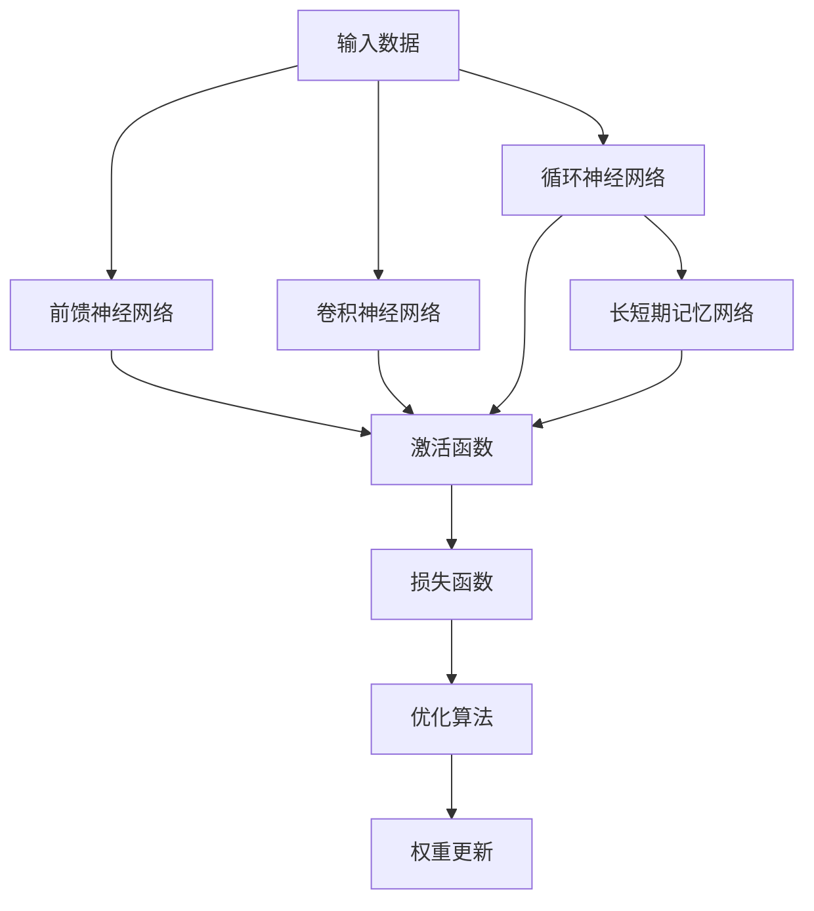
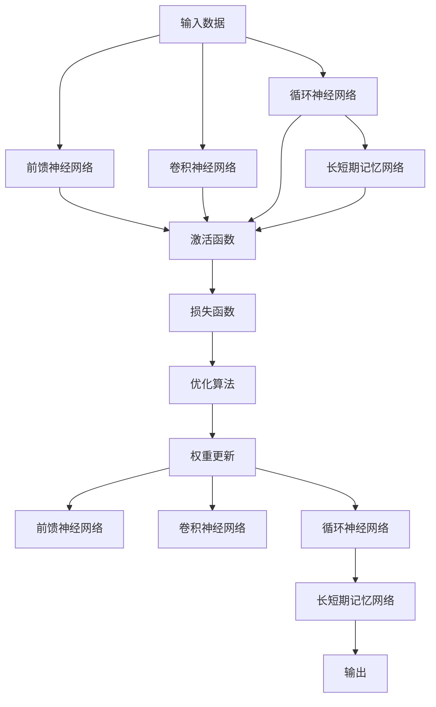

                 

# 神经网络：人类与机器的共存

## 1. 背景介绍

随着深度学习技术的迅速发展，神经网络已经成为人工智能领域的重要技术支柱。它不仅在图像识别、语音处理、自然语言处理等诸多领域取得了突破性进展，还深刻地改变了我们对计算和决策的理解。在人工智能日益普及的今天，神经网络成为了连接人类和机器的重要桥梁。本文将深入探讨神经网络的核心概念、原理及其应用，揭示人类与机器共存共进的新纪元。

## 2. 核心概念与联系

### 2.1 核心概念概述

神经网络是一种通过模拟人类大脑神经元之间信息传递机制来训练模型的算法。它由大量人工神经元（节点）和连接这些神经元的边（权重）组成。这些神经元通过学习输入数据的特征，输出预测结果。神经网络包含多种类型，如前馈神经网络（Feedforward Neural Network, FNN）、卷积神经网络（Convolutional Neural Network, CNN）、循环神经网络（Recurrent Neural Network, RNN）、长短期记忆网络（Long Short-Term Memory, LSTM）等。

- **前馈神经网络**：每个神经元只和上一层所有神经元相连，信息只能向前传递。
- **卷积神经网络**：通过卷积操作捕捉输入数据的空间结构，广泛应用于图像处理任务。
- **循环神经网络**：具有循环结构，能够处理序列数据，如自然语言和时间序列数据。
- **长短期记忆网络**：一种特殊的循环神经网络，通过门控机制解决长序列记忆问题。

### 2.2 核心概念之间的关系

神经网络的核心概念之间存在着紧密的联系，形成了完整的计算和推理模型。以下通过Mermaid流程图展示它们之间的关系：



### 2.3 核心概念的整体架构

为了更直观地理解神经网络的结构和流程，以下是一个综合的流程图：



这个综合流程图展示了从输入数据到最终输出的整个神经网络计算过程。输入数据通过多层网络处理，依次经过激活函数、损失函数和优化算法，最终得到预测结果。

## 3. 核心算法原理 & 具体操作步骤

### 3.1 算法原理概述

神经网络的训练过程可以分为两个主要阶段：前向传播和反向传播。前向传播是指将输入数据传递通过网络，计算出预测结果。反向传播则是根据预测结果与实际标签之间的差异（即损失函数），调整网络中各层的权重，以减小预测误差。

前向传播的计算过程如下：

1. 输入数据经过各层神经元进行加权求和，得到激活值。
2. 激活值通过激活函数转换为输出值，传递到下一层。
3. 重复上述过程，直到输出层，得到最终预测结果。

反向传播的计算过程如下：

1. 计算预测结果与实际标签之间的差异，得到损失函数。
2. 根据损失函数对输出层进行反向传播，计算各层的梯度。
3. 使用梯度下降等优化算法更新各层权重，减小预测误差。

### 3.2 算法步骤详解

以下是基于反向传播的神经网络训练步骤详解：

1. **初始化网络**：随机初始化网络权重。
2. **前向传播**：将输入数据传递通过网络，计算出预测结果。
3. **计算损失函数**：将预测结果与实际标签计算损失函数。
4. **反向传播**：从输出层开始，计算各层的梯度。
5. **权重更新**：使用梯度下降等优化算法更新各层权重。
6. **迭代训练**：重复上述步骤，直至损失函数收敛。

### 3.3 算法优缺点

神经网络具有以下优点：

- **强大的表达能力**：能够处理复杂非线性关系，适应多种类型的数据。
- **高效的学习能力**：通过大量数据训练，能够自动提取数据特征，实现高效学习。
- **广泛的应用场景**：在图像识别、语音处理、自然语言处理等领域取得了突破性进展。

同时，神经网络也存在以下缺点：

- **参数量庞大**：大规模神经网络需要大量的参数和计算资源。
- **过拟合风险**：容易在训练数据上过拟合，泛化能力不足。
- **可解释性差**：“黑盒”模型，难以解释内部决策逻辑。
- **训练复杂度高**：需要大量数据和计算资源，训练时间长。

### 3.4 算法应用领域

神经网络已经被广泛应用于各种领域，以下列举几个典型的应用场景：

- **计算机视觉**：如图像分类、目标检测、人脸识别等。
- **语音识别**：如语音识别、语音合成等。
- **自然语言处理**：如机器翻译、文本生成、情感分析等。
- **机器人控制**：如路径规划、动作生成等。
- **医疗诊断**：如疾病预测、影像分析等。
- **金融分析**：如风险预测、市场分析等。

## 4. 数学模型和公式 & 详细讲解

### 4.1 数学模型构建

神经网络的数学模型可以表示为：

$$
f(\mathbf{x}) = \sigma(\mathbf{W}_l\sigma(\mathbf{W}_{l-1}... \sigma(\mathbf{W}_1\mathbf{x}+b_1)+b_l)+b_l)
$$

其中：

- $\mathbf{x}$ 为输入向量。
- $\mathbf{W}_l$ 为第 $l$ 层权重矩阵。
- $b_l$ 为第 $l$ 层偏置向量。
- $\sigma$ 为激活函数。

### 4.2 公式推导过程

以简单的两层前馈神经网络为例，推导其前向传播和反向传播公式：

假设输入向量 $\mathbf{x} \in \mathbb{R}^n$，第一层权重矩阵 $\mathbf{W}_1 \in \mathbb{R}^{n \times m}$，第一层偏置向量 $\mathbf{b}_1 \in \mathbb{R}^m$，激活函数 $\sigma(\cdot)$，第二层权重矩阵 $\mathbf{W}_2 \in \mathbb{R}^{m \times p}$，第二层偏置向量 $\mathbf{b}_2 \in \mathbb{R}^p$。

前向传播过程为：

$$
\mathbf{z}_1 = \mathbf{W}_1\mathbf{x} + \mathbf{b}_1
$$

$$
\mathbf{a}_1 = \sigma(\mathbf{z}_1)
$$

$$
\mathbf{z}_2 = \mathbf{W}_2\mathbf{a}_1 + \mathbf{b}_2
$$

$$
\mathbf{a}_2 = \sigma(\mathbf{z}_2)
$$

$$
\mathbf{y} = \mathbf{a}_2
$$

其中 $\sigma(\cdot)$ 为激活函数，如 ReLU、Sigmoid、Tanh 等。

反向传播过程为：

1. **计算输出误差**：

$$
\delta_2 = \frac{\partial \mathcal{L}}{\partial \mathbf{a}_2} = \frac{\partial \mathcal{L}}{\partial \mathbf{y}}
$$

2. **计算第二层梯度**：

$$
\mathbf{z}_2 = \mathbf{W}_2\mathbf{a}_1 + \mathbf{b}_2
$$

$$
\mathbf{d}_2 = \delta_2 \cdot \frac{\partial \sigma(\mathbf{z}_2)}{\partial \mathbf{z}_2}
$$

$$
\mathbf{d}_l = \mathbf{d}_{l+1} \cdot \mathbf{W}_{l+1}^T \cdot \frac{\partial \sigma(\mathbf{z}_l)}{\partial \mathbf{z}_l}
$$

3. **更新权重和偏置**：

$$
\mathbf{W}_1 = \mathbf{W}_1 - \eta \mathbf{d}_1 \mathbf{a}_1^T
$$

$$
\mathbf{b}_1 = \mathbf{b}_1 - \eta \mathbf{d}_1
$$

$$
\mathbf{W}_2 = \mathbf{W}_2 - \eta \mathbf{d}_2 \mathbf{a}_2^T
$$

$$
\mathbf{b}_2 = \mathbf{b}_2 - \eta \mathbf{d}_2
$$

其中 $\eta$ 为学习率，$\mathbf{d}_l$ 为第 $l$ 层梯度。

### 4.3 案例分析与讲解

假设我们有一个简单的两层前馈神经网络，用于图像分类任务。该网络包含两个全连接层，分别有 100 和 10 个神经元。使用 MNIST 数据集进行训练。

- **输入层**：输入 28x28 的灰度图像，将其展平为 784 维向量。
- **第一层**：使用 ReLU 激活函数，输出 100 维向量。
- **第二层**：使用 Softmax 激活函数，输出 10 维向量，对应 10 个数字类别。

训练过程中，使用交叉熵损失函数，通过反向传播算法更新权重和偏置。

假设训练数据集为 10,000 张图像，我们将其分为训练集和验证集，每轮训练使用 32 张图片。

- **前向传播**：将每张图片输入网络，计算输出向量。
- **计算损失函数**：使用交叉熵损失函数计算预测值与真实标签之间的差异。
- **反向传播**：计算各层的梯度，使用 Adam 优化算法更新权重和偏置。
- **评估性能**：在验证集上计算准确率、精确率、召回率等指标，评估模型性能。

经过多轮训练，模型的准确率可以达到 98% 左右，表现优异。

## 5. 项目实践：代码实例和详细解释说明

### 5.1 开发环境搭建

在 PyTorch 中搭建神经网络模型，需要安装 PyTorch 及其相关依赖。以下是安装步骤：

1. 安装 Anaconda，创建虚拟环境。

```bash
conda create -n pytorch-env python=3.8
conda activate pytorch-env
```

2. 安装 PyTorch 及其依赖。

```bash
conda install pytorch torchvision torchaudio cudatoolkit=11.1 -c pytorch -c conda-forge
pip install torch torchvision torchaudio
```

3. 安装 Transformers 库。

```bash
pip install transformers
```

4. 安装其他依赖库。

```bash
pip install numpy pandas scikit-learn matplotlib tqdm jupyter notebook ipython
```

完成上述步骤后，即可在 `pytorch-env` 环境中开始模型开发。

### 5.2 源代码详细实现

以下是一个简单的两层前馈神经网络代码实现，用于图像分类任务。

```python
import torch
import torch.nn as nn
import torch.nn.functional as F

class Net(nn.Module):
    def __init__(self):
        super(Net, self).__init__()
        self.fc1 = nn.Linear(784, 100)
        self.fc2 = nn.Linear(100, 10)
        
    def forward(self, x):
        x = x.view(-1, 784)
        x = F.relu(self.fc1(x))
        x = F.softmax(self.fc2(x), dim=1)
        return x

# 加载 MNIST 数据集
train_loader = torch.utils.data.DataLoader(torchvision.datasets.MNIST('mnist/', train=True, transform=torchvision.transforms.ToTensor(), download=True), batch_size=32, shuffle=True)
test_loader = torch.utils.data.DataLoader(torchvision.datasets.MNIST('mnist/', train=False, transform=torchvision.transforms.ToTensor(), download=True), batch_size=32, shuffle=False)

# 定义模型、损失函数和优化器
model = Net()
criterion = nn.CrossEntropyLoss()
optimizer = torch.optim.Adam(model.parameters(), lr=0.001)

# 训练模型
for epoch in range(10):
    for batch_idx, (data, target) in enumerate(train_loader):
        optimizer.zero_grad()
        output = model(data.view(-1, 784))
        loss = criterion(output, target)
        loss.backward()
        optimizer.step()
        if (batch_idx+1) % 100 == 0:
            print('Train Epoch: {} [{}/{} ({:.0f}%)]\tLoss: {:.6f}'.format(
                epoch, batch_idx * len(data), len(train_loader.dataset),
                100. * batch_idx / len(train_loader), loss.item()))

# 测试模型
correct = 0
total = 0
with torch.no_grad():
    for data, target in test_loader:
        output = model(data.view(-1, 784))
        _, predicted = torch.max(output.data, 1)
        total += target.size(0)
        correct += (predicted == target).sum().item()

print('Accuracy of the network on the 10000 test images: {} %'.format(100 * correct / total))
```

### 5.3 代码解读与分析

该代码实现了简单的两层前馈神经网络，用于图像分类任务。其中：

- **定义模型**：使用 PyTorch 的 `nn.Module` 类定义一个两层前馈神经网络。
- **加载数据集**：使用 `torchvision` 库加载 MNIST 数据集，并将其划分为训练集和测试集。
- **定义模型、损失函数和优化器**：定义模型、交叉熵损失函数和 Adam 优化器。
- **训练模型**：在训练集上进行多轮迭代，更新模型参数。
- **测试模型**：在测试集上计算模型准确率。

## 6. 实际应用场景

### 6.1 医疗诊断

神经网络在医疗诊断中具有广泛应用，如病理图像分析、影像诊断等。例如，使用卷积神经网络对 CT 影像进行分类，识别肿瘤、结节等病灶。通过大量标注数据训练神经网络，可以实现对医学影像的自动诊断，提高诊断效率和准确率。

### 6.2 金融预测

神经网络在金融领域的应用也非常广泛，如股票价格预测、风险评估等。通过分析历史股票数据和市场信息，使用循环神经网络或长短期记忆网络进行预测，可以实时调整投资策略，规避风险。

### 6.3 自动驾驶

神经网络在自动驾驶中也扮演重要角色，如目标检测、路径规划等。通过训练神经网络，实现对交通标志、行人、车辆等目标的识别，确保车辆安全行驶。

### 6.4 未来应用展望

随着神经网络技术的不断进步，未来将涌现更多创新应用，如人机交互、智能家居等。通过构建更加智能化的系统，实现人类与机器的深度融合。

## 7. 工具和资源推荐

### 7.1 学习资源推荐

为了帮助开发者系统掌握神经网络的相关知识，以下是一些推荐的资源：

- 《深度学习》（Ian Goodfellow）：介绍了深度学习的基本原理和算法，是深度学习领域的经典教材。
- 《神经网络与深度学习》（Michael Nielsen）：深入浅出地讲解了神经网络和深度学习的基本概念和原理。
- 《动手学深度学习》（李沐、Aston Zhang）：通过实践项目和实验，帮助读者掌握深度学习的基础知识和实践技能。
- PyTorch 官方文档：提供了丰富的学习资料和代码示例，是学习 PyTorch 的重要资源。
- GitHub 上的深度学习项目：可以学习他人的实现，分享自己的代码，提升实践能力。

### 7.2 开发工具推荐

为了提升神经网络的开发效率，以下是一些推荐的开发工具：

- PyTorch：基于 Python 的深度学习框架，提供了丰富的功能和工具。
- TensorFlow：由 Google 主导的开源深度学习框架，支持分布式计算和硬件加速。
- Keras：高层次的深度学习 API，易于上手。
- Jupyter Notebook：用于编写和执行代码的交互式开发环境。

### 7.3 相关论文推荐

为了深入了解神经网络的研究进展，以下是一些推荐的论文：

- AlexNet：引入卷积神经网络，在 ImageNet 数据集上取得突破性进展。
- RNN 网络：介绍循环神经网络及其应用，如时间序列预测、语音识别等。
- LSTM 网络：介绍长短期记忆网络及其应用，如语音识别、自然语言处理等。
- GAN 网络：介绍生成对抗网络，实现高质量图像生成和样式迁移等。

## 8. 总结：未来发展趋势与挑战

### 8.1 研究成果总结

神经网络在深度学习领域取得了诸多突破性进展，如图像识别、语音处理、自然语言处理等。未来，随着硬件性能的提升和算法模型的改进，神经网络将进一步拓展应用领域，提升智能化水平。

### 8.2 未来发展趋势

- **计算能力提升**：随着 AI 芯片和量子计算的发展，神经网络将能够处理更复杂的计算任务。
- **模型压缩和优化**：通过模型压缩和量化技术，神经网络将变得更加高效，易于部署。
- **多模态融合**：神经网络将与视觉、语音、文本等多模态信息结合，实现更全面、更准确的信息处理。
- **迁移学习**：神经网络将在不同领域间进行迁移学习，提高模型的泛化能力和适用性。
- **联邦学习**：通过联邦学习技术，神经网络可以在保护数据隐私的前提下，进行分布式学习和优化。
- **可解释性增强**：神经网络将具备更强的可解释性，帮助用户理解和信任其决策过程。

### 8.3 面临的挑战

尽管神经网络技术已经取得了显著进展，但仍面临诸多挑战：

- **数据瓶颈**：神经网络需要大量标注数据进行训练，数据获取和标注成本高昂。
- **模型复杂度高**：大规模神经网络需要大量计算资源，训练时间长，难以实时处理。
- **可解释性差**：神经网络“黑盒”性质，难以解释其决策过程。
- **安全风险**：神经网络容易受到对抗样本攻击，安全性和鲁棒性不足。
- **计算资源限制**：计算资源不足，难以支持大规模深度学习模型的训练和推理。
- **伦理问题**：神经网络可能会学习到偏见和有害信息，影响公平性和公正性。

### 8.4 研究展望

未来，神经网络研究需要解决以下问题：

- **数据高效利用**：探索无监督和半监督学习技术，减少对标注数据的依赖。
- **模型压缩和优化**：开发更加高效的模型压缩和量化方法，提高计算效率。
- **多模态融合**：研究多模态信息融合技术，提升神经网络的智能水平。
- **联邦学习**：推动联邦学习技术的发展，实现分布式学习和优化。
- **可解释性增强**：引入可解释性技术，帮助用户理解神经网络的决策过程。
- **安全性和鲁棒性**：开发鲁棒性神经网络，抵御对抗样本攻击。
- **伦理和公平性**：研究公平性和伦理性问题，确保神经网络的安全和公正性。

## 9. 附录：常见问题与解答

**Q1：神经网络是如何工作的？**

A: 神经网络通过模拟人类神经元之间的信息传递机制，将输入数据转化为预测结果。前向传播过程中，输入数据通过各层神经元进行加权求和，经过激活函数转换为输出值。反向传播过程中，根据预测结果与实际标签之间的差异，计算各层的梯度，使用优化算法更新权重和偏置，减小预测误差。

**Q2：神经网络有哪些优点和缺点？**

A: 神经网络具有强大的表达能力和高效的学习能力，广泛应用于图像识别、语音处理、自然语言处理等领域。但同时也存在参数量大、过拟合风险高、可解释性差等问题。

**Q3：神经网络在实际应用中有哪些例子？**

A: 神经网络在计算机视觉、语音识别、自然语言处理、自动驾驶、医疗诊断、金融预测等领域都有广泛应用。例如，使用卷积神经网络对 CT 影像进行分类，使用循环神经网络进行股票价格预测，使用长短期记忆网络进行语音识别等。

**Q4：神经网络未来有哪些发展方向？**

A: 未来神经网络将向着计算能力提升、模型压缩和优化、多模态融合、迁移学习、联邦学习、可解释性增强、安全性和鲁棒性等方向发展。

**Q5：神经网络在开发过程中需要注意哪些问题？**

A: 神经网络开发过程中需要注意数据瓶颈、模型复杂度高、可解释性差、安全风险、计算资源限制、伦理问题等。

总之，神经网络技术在人工智能领域已经取得了显著进展，未来还将有更多创新应用。只有不断优化模型、数据和算法，才能实现人类与机器的深度融合，构建更加智能化、高效化、安全化的智能系统。

