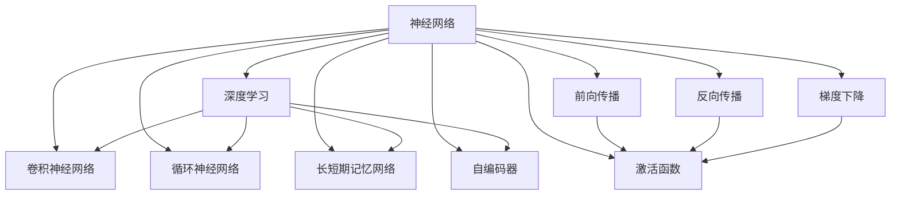
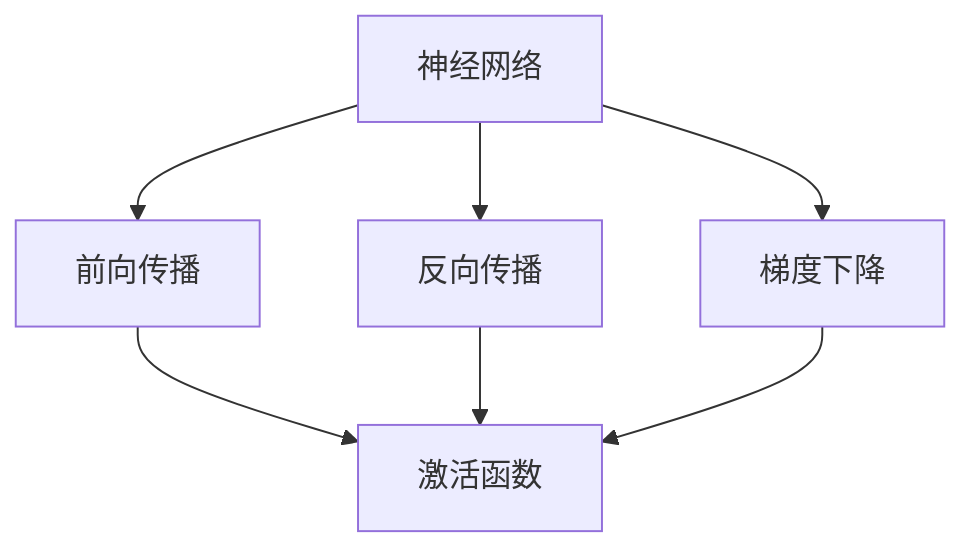
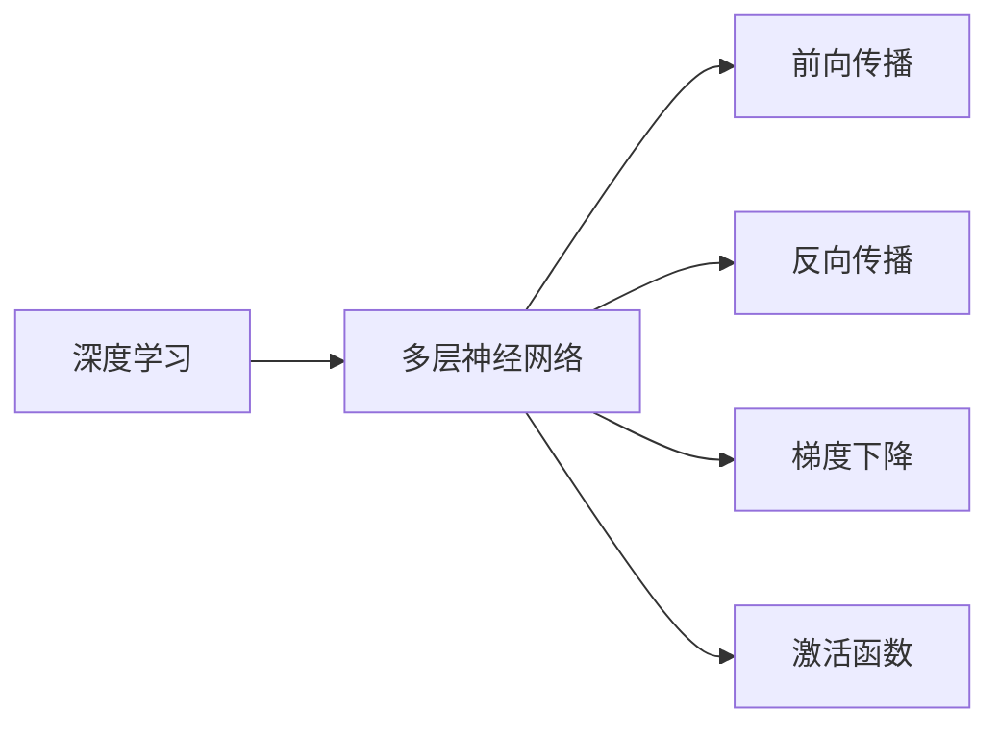
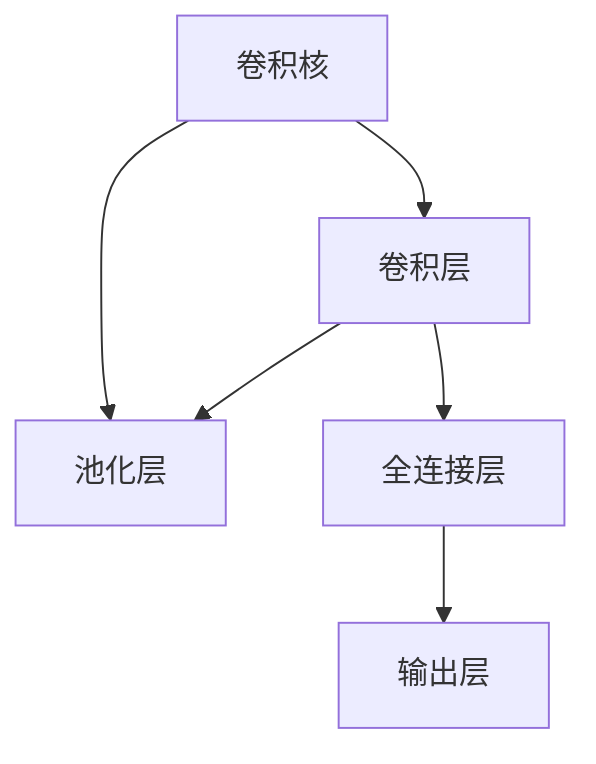
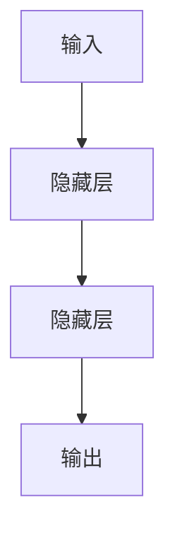
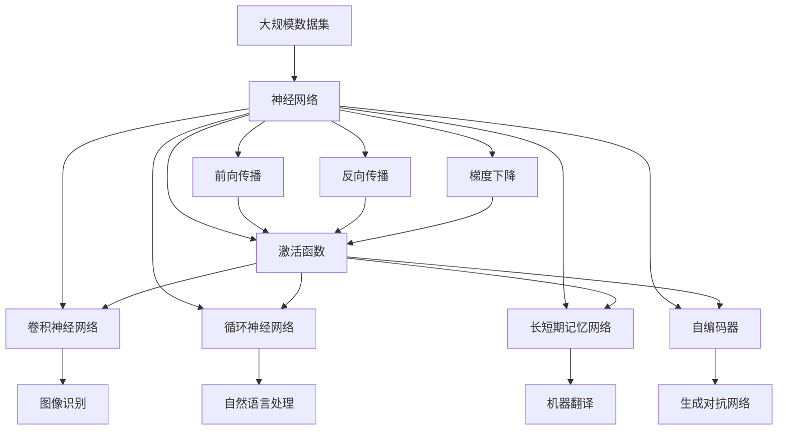

                 

# 神经网络：机器学习的新范式

> 关键词：神经网络,机器学习,深度学习,前向传播,反向传播,梯度下降,激活函数,卷积神经网络,CNN,循环神经网络,RNN,长短期记忆网络,LSTM,自编码器,VAE,无监督学习

## 1. 背景介绍

### 1.1 问题由来

随着数据科学和大数据技术的发展，机器学习已经成为了推动技术进步和社会变革的重要工具。在过去数十年里，机器学习经历了多个重要的发展阶段，从传统的统计学习到深度学习的兴起，再到现在的神经网络范式，每一步都带来了革命性的变革。

神经网络作为深度学习的核心组成部分，其核心思想是通过模拟人脑神经元之间的连接和激活机制，构建复杂的网络结构，以实现对大规模数据的高效处理和智能决策。这种以数据驱动、自适应性强的学习方式，使得神经网络在图像识别、自然语言处理、语音识别、推荐系统等诸多领域都取得了突破性的进展。

### 1.2 问题核心关键点

神经网络之所以能够取得如此显著的效果，关键在于其独特的架构和训练方式：

- **前向传播与反向传播**：神经网络通过前向传播将输入数据转化为输出结果，然后通过反向传播计算损失函数的梯度，用于更新网络参数。这种端到端的训练方式，能够直接优化目标任务，提升模型性能。
- **梯度下降**：神经网络使用梯度下降算法更新参数，以最小化损失函数。这种优化算法基于一阶导数，能够快速收敛至局部最优解，适应大规模数据集。
- **激活函数**：神经网络使用激活函数对网络输出进行非线性变换，增强模型的表达能力。常用的激活函数包括Sigmoid、ReLU、Tanh等。
- **卷积神经网络(CNN)**：对于图像等具有网格结构的数据，CNN通过卷积操作提取局部特征，然后再通过全连接层进行分类。CNN在图像识别领域表现尤为出色。
- **循环神经网络(RNN)**：对于序列数据，如文本、音频等，RNN通过循环机制处理序列信息，能够捕捉时间依赖关系。RNN在自然语言处理、语音识别等领域有广泛应用。
- **长短期记忆网络(LSTM)**：为了解决传统RNN在处理长序列时的梯度消失问题，LSTM引入了门控机制，能够更好地保持长期依赖关系。LSTM在机器翻译、情感分析等任务上有优势。
- **自编码器**：自编码器是一种无监督学习的方法，通过将输入数据压缩成低维编码，再解码还原，能够学习数据的内在表示。VAE是自编码器的一种变体，能够生成新的数据样本。
- **无监督学习**：神经网络也可以通过无监督学习方式进行预训练，如自编码器、生成对抗网络(GAN)等，为后续的有监督学习任务提供更好的初始化参数。

这些关键技术构成了神经网络的基本框架，使其能够适应不同的数据结构和任务需求。

### 1.3 问题研究意义

神经网络范式对于机器学习领域的影响深远。首先，神经网络提升了模型的表达能力和泛化性能，使得机器学习能够处理更加复杂、结构化程度较低的数据。其次，神经网络的自适应性、端到端优化特性，使得模型训练过程更加高效、易于优化。最后，神经网络提供了强大的表示学习能力，为各种应用场景中的特征提取、分类、生成、推理等任务提供了可靠的技术支持。

研究神经网络，对于推动机器学习技术的发展，提升机器学习模型的应用效果，加速机器学习技术的产业化进程，具有重要意义：

1. **降低开发成本**：神经网络提供了高度自动化的学习方式，减少了对特征工程和人工干预的需求，降低了数据预处理和模型调参的难度。
2. **提升模型性能**：神经网络的非线性特征提取和复杂建模能力，使其能够学习到更加准确的表示，显著提升模型在各种任务上的表现。
3. **加速开发进度**：神经网络的端到端优化特性，使得模型训练和优化过程更加高效，能够快速迭代并推出新产品和服务。
4. **带来技术创新**：神经网络的多样化结构和复杂的学习方式，催生了许多新的研究方向，如深度强化学习、神经网络可视化等。
5. **赋能产业升级**：神经网络的高效特征提取和智能决策能力，为各行各业带来了新的技术和方法，促进了传统行业的数字化转型升级。

## 2. 核心概念与联系

### 2.1 核心概念概述

为了更好地理解神经网络的原理和架构，本节将介绍几个核心概念：

- **神经网络(Neural Network)**：由大量人工神经元（节点）组成的网络结构，通过前向传播和反向传播实现对数据的处理和优化。神经网络是深度学习的核心组成部分。
- **深度学习(Deep Learning)**：基于多层神经网络的学习方式，能够自动提取数据的高层特征，实现对复杂任务的建模和预测。深度学习是目前机器学习领域的热点研究方向。
- **前向传播(Forward Propagation)**：神经网络通过逐层处理输入数据，生成输出结果的过程。每个神经元将前一层的输出作为输入，通过激活函数进行非线性变换。
- **反向传播(Backward Propagation)**：基于前向传播的结果，通过反向传播算法计算损失函数的梯度，用于更新模型参数。反向传播是神经网络训练的核心步骤。
- **梯度下降(Gradient Descent)**：神经网络使用梯度下降算法更新参数，以最小化损失函数。梯度下降算法能够快速收敛至局部最优解，适应大规模数据集。
- **激活函数(Activation Function)**：神经网络使用激活函数对网络输出进行非线性变换，增强模型的表达能力。常用的激活函数包括Sigmoid、ReLU、Tanh等。
- **卷积神经网络(CNN)**：针对图像等具有网格结构的数据，CNN通过卷积操作提取局部特征，然后再通过全连接层进行分类。CNN在图像识别领域表现尤为出色。
- **循环神经网络(RNN)**：针对序列数据，如文本、音频等，RNN通过循环机制处理序列信息，能够捕捉时间依赖关系。RNN在自然语言处理、语音识别等领域有广泛应用。
- **长短期记忆网络(LSTM)**：为了解决传统RNN在处理长序列时的梯度消失问题，LSTM引入了门控机制，能够更好地保持长期依赖关系。LSTM在机器翻译、情感分析等任务上有优势。
- **自编码器(Autocoder)**：一种无监督学习方法，通过将输入数据压缩成低维编码，再解码还原，能够学习数据的内在表示。VAE是自编码器的一种变体，能够生成新的数据样本。

这些核心概念之间的逻辑关系可以通过以下Mermaid流程图来展示：



这个流程图展示了大语言模型微调过程中各个核心概念的关系和作用：

1. 神经网络通过深度学习的方式进行建模和预测。
2. 前向传播和反向传播是神经网络训练的核心步骤。
3. 梯度下降算法用于更新模型参数，优化损失函数。
4. 激活函数增强了神经网络的非线性表达能力。
5. 卷积神经网络、循环神经网络和长短期记忆网络分别适用于不同的数据结构。
6. 自编码器通过无监督学习提取数据的内在表示。

这些概念共同构成了神经网络的完整框架，使得神经网络能够在各种应用场景下发挥强大的学习和预测能力。

### 2.2 概念间的关系

这些核心概念之间存在着紧密的联系，形成了神经网络的完整生态系统。下面通过几个Mermaid流程图来展示这些概念之间的关系：

#### 2.2.1 神经网络的学习范式



这个流程图展示了神经网络的学习过程：通过前向传播处理输入数据，生成输出结果，然后使用反向传播计算损失函数的梯度，通过梯度下降更新模型参数。

#### 2.2.2 深度学习与神经网络的关系



这个流程图展示了深度学习与神经网络的关系：深度学习通过多层神经网络进行建模，每个神经元的前向传播和反向传播构成了一层网络。

#### 2.2.3 卷积神经网络的结构



这个流程图展示了卷积神经网络的结构：卷积层通过卷积核提取局部特征，池化层进行特征压缩，全连接层进行分类，输出层生成最终结果。

#### 2.2.4 循环神经网络的结构



这个流程图展示了循环神经网络的结构：循环神经网络通过隐藏层处理序列信息，每个时间步的输出作为下一个时间步的输入，形成循环机制。

### 2.3 核心概念的整体架构

最后，我们用一个综合的流程图来展示这些核心概念在大规模机器学习任务中的整体架构：



这个综合流程图展示了神经网络在大规模机器学习任务中的应用：

1. 大规模数据集输入到神经网络中。
2. 神经网络通过前向传播处理输入数据，生成输出结果。
3. 通过反向传播计算损失函数的梯度，使用梯度下降更新模型参数。
4. 激活函数增强了神经网络的非线性表达能力。
5. 卷积神经网络、循环神经网络和长短期记忆网络分别适用于不同的数据结构。
6. 自编码器通过无监督学习提取数据的内在表示。
7. 最终输出用于图像识别、自然语言处理、机器翻译、生成对抗网络等任务。

通过这些流程图，我们可以更清晰地理解神经网络的各个核心概念之间的关系和作用，为后续深入讨论具体的学习方法和技术奠定基础。

## 3. 核心算法原理 & 具体操作步骤
### 3.1 算法原理概述

神经网络的核心算法原理主要包括以下几个方面：

- **前向传播算法**：将输入数据传递到神经网络中，通过逐层处理生成输出结果。每个神经元将前一层的输出作为输入，通过激活函数进行非线性变换。

- **反向传播算法**：基于前向传播的结果，通过反向传播计算损失函数的梯度，用于更新模型参数。反向传播算法使用链式法则，递归计算每个神经元的梯度。

- **梯度下降算法**：神经网络使用梯度下降算法更新参数，以最小化损失函数。梯度下降算法通过迭代更新参数，逐渐逼近最优解。

- **激活函数**：神经网络使用激活函数对网络输出进行非线性变换，增强模型的表达能力。常用的激活函数包括Sigmoid、ReLU、Tanh等。

- **卷积神经网络**：针对图像等具有网格结构的数据，CNN通过卷积操作提取局部特征，然后再通过全连接层进行分类。

- **循环神经网络**：针对序列数据，如文本、音频等，RNN通过循环机制处理序列信息，能够捕捉时间依赖关系。

- **长短期记忆网络**：为了解决传统RNN在处理长序列时的梯度消失问题，LSTM引入了门控机制，能够更好地保持长期依赖关系。

- **自编码器**：一种无监督学习方法，通过将输入数据压缩成低维编码，再解码还原，能够学习数据的内在表示。VAE是自编码器的一种变体，能够生成新的数据样本。

### 3.2 算法步骤详解

神经网络的训练过程主要包括以下几个关键步骤：

**Step 1: 准备训练数据**

- 收集标注数据集，每个样本包含输入数据和对应的标签。
- 将输入数据进行预处理，如归一化、标准化、分词等。
- 将标签进行编码，转化为模型可以接受的格式。

**Step 2: 搭建神经网络模型**

- 选择合适的神经网络结构，如卷积神经网络、循环神经网络、长短期记忆网络等。
- 定义神经网络的层次结构，包括输入层、隐藏层、输出层等。
- 确定每个神经元的具体参数，如权重、偏置等。

**Step 3: 定义损失函数**

- 根据具体任务，选择合适的损失函数，如交叉熵损失、均方误差损失等。
- 将模型预测结果与真实标签进行比较，计算损失值。

**Step 4: 训练模型**

- 使用梯度下降算法更新模型参数，最小化损失函数。
- 设置迭代次数、学习率等超参数，控制模型训练过程。
- 在每个迭代周期结束后，评估模型性能，防止过拟合。

**Step 5: 测试模型**

- 使用测试集对模型进行评估，计算各种性能指标。
- 将模型应用于实际任务，验证模型的泛化能力。

以上是神经网络训练的一般流程。在实际应用中，还需要根据具体任务进行优化，如改进损失函数、调整超参数、引入正则化技术等，以进一步提升模型性能。

### 3.3 算法优缺点

神经网络具有以下优点：

- **强大的表达能力**：神经网络能够学习复杂的数据表示，适用于各种类型的数据。
- **端到端优化**：神经网络通过前向传播和反向传播直接优化目标任务，减少了中间步骤。
- **自动特征提取**：神经网络能够自动提取数据的高层特征，减少了特征工程的复杂度。
- **泛化能力**：神经网络通过大量数据训练，具备较好的泛化性能，能够适应新的数据。

同时，神经网络也存在一些缺点：

- **训练时间长**：神经网络的参数数量庞大，训练过程耗时较长。
- **过拟合风险**：神经网络容易出现过拟合现象，尤其是数据量较小的情况下。
- **解释性不足**：神经网络通常被视为"黑盒"模型，难以解释其内部工作机制和决策逻辑。
- **计算资源要求高**：神经网络对计算资源和存储空间有较高要求，需要使用高性能设备。

尽管存在这些局限性，但神经网络在机器学习领域依然占据主导地位，其高效的学习和表达能力使得其在图像识别、自然语言处理、语音识别、推荐系统等领域取得了突破性的进展。

### 3.4 算法应用领域

神经网络已经被广泛应用于各种机器学习任务，涵盖计算机视觉、自然语言处理、语音识别、推荐系统等多个领域。以下是一些典型的应用场景：

- **计算机视觉**：神经网络通过卷积神经网络(CNN)提取图像特征，实现图像分类、目标检测、图像分割等任务。

- **自然语言处理**：神经网络通过循环神经网络(RNN)、长短期记忆网络(LSTM)等处理文本信息，实现文本分类、情感分析、机器翻译、语音识别等任务。

- **推荐系统**：神经网络通过自编码器等方法提取用户行为特征，实现个性化推荐。

- **医疗诊断**：神经网络通过卷积神经网络(CNN)和长短期记忆网络(LSTM)处理医疗影像和电子病历，实现疾病诊断和治疗方案推荐。

- **金融预测**：神经网络通过循环神经网络(RNN)和长短期记忆网络(LSTM)处理金融数据，实现股票预测、风险评估等任务。

除了上述这些领域，神经网络还在自动驾驶、智能制造、智慧城市等领域有广泛应用，推动了各行各业的智能化转型。

## 4. 数学模型和公式 & 详细讲解 & 举例说明
### 4.1 数学模型构建

神经网络的数学模型主要由以下几个部分构成：

- **输入层**：接收原始输入数据。
- **隐藏层**：对输入数据进行特征提取和处理。
- **输出层**：生成最终的预测结果。

神经网络的前向传播和反向传播算法可以表示为：

$$
\begin{align*}
\text{前向传播} & : \hat{y} = h_W \left( \text{Ax} + b \right) \\
\text{反向传播} & : \nabla_{\theta} \mathcal{L} = \frac{\partial \mathcal{L}}{\partial \hat{y}} \frac{\partial \hat{y}}{\partial h_W} \frac{\partial h_W}{\partial \theta}
\end{align*}
$$

其中，$h_W$表示隐藏层的输出，$\theta$表示神经网络的参数，$\mathcal{L}$表示损失函数，$\frac{\partial \mathcal{L}}{\partial \hat{y}}$表示损失函数对输出的梯度，$\frac{\partial \hat{y}}{\partial h_W}$和$\frac{\partial h_W}{\partial \theta}$分别表示输出对隐藏层和隐藏层对参数的梯度。

### 4.2 公式推导过程

以二分类问题为例，推导神经网络的前向传播和反向传播公式。

**前向传播公式**：

$$
\begin{align*}
\hat{y} &= \sigma(\text{Ax} + b) \\
&= \sigma \left( \sum_{i=1}^{n} w_i x_i + b \right) \\
&= \sigma \left( \sum_{i=1}^{n} w_i x_i \right) + b
\end{align*}
$$

其中，$x$表示输入向量，$w$表示权重矩阵，$b$表示偏置向量，$\sigma$表示激活函数。

**反向传播公式**：

$$
\begin{align*}
\frac{\partial \mathcal{L}}{\partial \theta} &= \frac{\partial \mathcal{L}}{\partial \hat{y}} \frac{\partial \hat{y}}{\partial h_W} \frac{\partial h_W}{\partial \theta} \\
&= \frac{\partial \mathcal{L}}{\partial \hat{y}} \frac{\partial \sigma(\text{Ax} + b)}{\partial \text{Ax} + b} \frac{\partial \text{Ax} + b}{\partial \theta} \\
&= \frac{\partial \mathcal{L}}{\partial \hat{y}} \frac{\partial \sigma}{\partial h_W} \frac{\partial \text{Ax} + b}{\partial \theta}
\end{align*}
$$

其中，$\frac{\partial \sigma}{\partial h_W}$表示激活函数的导数，$\frac{\partial \text{Ax} + b}{\partial \theta}$表示输出对参数的导数。

### 4.3 案例分析与讲解

以手写数字识别为例，展示神经网络的前向传播和反向传播过程。

**前向传播**：

输入一个手写数字图片，经过卷积层、池化层、全连接层等处理，生成最终的输出结果。

**反向传播**：

将输出结果与真实标签进行比较，计算损失函数，使用梯度下降算法更新卷积核、全连接层的权重和偏置，最小化损失函数。

在实际应用中，神经网络通过调整隐藏层和输出层的节点数、激活函数、学习率等参数，优化损失函数，提高识别准确率。

## 5. 项目实践：代码实例和详细解释说明
### 5.1 开发环境搭建

在进行神经网络开发前，我们需要准备好开发环境。以下是使用Python进行TensorFlow开发的环境配置流程：

1. 安装Anaconda：从官网下载并安装Anaconda，用于创建独立的Python环境。

2. 创建并激活虚拟环境：
```bash
conda create -n tf-env python=3.8 
conda activate tf-env
```

3. 安装TensorFlow：从官网获取对应的安装命令。例如：
```bash
conda install tensorflow
```

4. 安装各类工具包：
```bash
pip install numpy pandas scikit-learn matplotlib tqdm jupyter notebook ipython
```

完成上述步骤后，即可在`tf-env`环境中开始神经网络开发实践。

### 5.2 源代码详细实现

下面我们以手写数字识别任务为例，给出使用TensorFlow对神经网络进行训练的Python代码实现。

首先，定义数据处理函数：

```python
import tensorflow as tf
from tensorflow.keras.datasets import mnist
from tensorflow.keras.utils import to_categorical

(x_train, y_train), (x_test, y_test) = mnist.load_data()
x_train = x_train / 255.0
x_test = x_test / 255.0
y_train = to_categorical(y_train, num_classes=10)
y_test = to_categorical(y_test, num_classes=10)
```

然后，定义神经网络模型：

```python
model = tf.keras.Sequential([
    tf.keras.layers.Conv2D(32, (3, 3), activation='relu', input_shape=(28, 28, 1)),
    tf.keras.layers.MaxPooling2D((2, 2)),
    tf.keras.layers.Flatten(),
    tf.keras.layers.Dense(10, activation='softmax')
])
```

接着，定义损失函数和优化器：

```python
model.compile(optimizer='adam',
              loss='categorical_crossentropy',
              metrics=['accuracy'])
```

最后，启动训练流程：

```python
model.fit(x_train, y_train, epochs=10, batch_size=64, validation_data=(x_test, y_test))
```

以上代码实现了使用TensorFlow对手写数字识别任务进行神经网络训练的全过程。

### 5.3 代码解读与分析

让我们再详细解读一下关键代码的实现细节：

**数据处理函数**：
- `mnist.load_data()`：加载手写数字识别数据集，返回训练集和测试集。
- `x_train = x_train / 255.0`：将图像像素值归一化到[0,1]区间。
- `y_train = to_categorical(y_train, num_classes=10)`：将标签进行one-hot编码。

**神经网络模型**：
- `Sequential`：定义一个顺序模型。
- `Conv2D`：定义卷积层，提取图像局部特征。
- `MaxPooling2D`：定义池化层，进行特征压缩。
- `Flatten`：将多维张量展平成一维向量。
- `Dense`：定义全连接层，输出分类结果。

**训练函数**：
- `model.compile()`：配置模型的优化器、损失函数和评估指标。
- `model.fit()`：训练模型，使用Adam优化器进行梯度下降。
- `validation_data`：指定验证集，用于监控模型训练过程中的性能变化。

**运行结果展示**：
- 在训练结束后，使用`model.evaluate()`方法评估模型性能。

通过上述代码实现，可以清晰地看到使用TensorFlow搭建神经网络模型、配置优化器、训练模型和评估性能的全过程。TensorFlow提供了强大的计算图和自动微分功能，大大简化了神经网络的开发和训练流程。

## 6. 实际应用场景
### 6.1 计算机视觉

神经网络在计算机视觉领域的应用非常广泛，特别是在图像分类、目标检测、图像分割等方面取得了突破性的进展。例如，卷积神经网络(CNN)通过卷积层和池化层提取图像特征，然后通过全连接层进行分类，实现了对图像的快速识别。

在实际应用中，神经网络可以用于自动驾驶、安防监控、医疗影像分析等领域。例如，自动驾驶系统可以通过神经网络对路标、交通灯、行人等进行实时检测和识别，确保行驶安全。安防监控系统可以使用神经网络对视频流进行实时分析和处理，及时发现异常情况。医疗影像系统可以使用神经网络对X光片、CT扫描等影像数据进行自动诊断，提高诊疗效率。

### 6.2 自然语言处理

神经网络在自然语言处理领域也得到了广泛应用，特别是在文本分类、情感分析、机器翻译、语音识别等方面。例如，循环神经网络(RNN)和长短期记忆网络(LSTM)通过循环机制处理文本信息，能够捕捉时间依赖关系，实现对文本的智能处理。

在实际应用中，神经网络可以用于智能客服、智能写作、机器翻译等领域。例如，智能客服系统可以使用神经网络对用户提问进行自动回答，提高服务效率。智能写作系统可以使用神经网络对用户输入进行自动生成和修改，提升创作质量。机器翻译系统可以使用神经网络将文本从一种语言翻译成另一种语言，实现跨语言交流。

### 6.3 金融预测

神经网络在金融预测领域也有重要应用，特别是在股票预测、风险评估等方面。例如，循环神经网络(RNN)和长短期记忆网络(LSTM)可以处理金融时间序列

