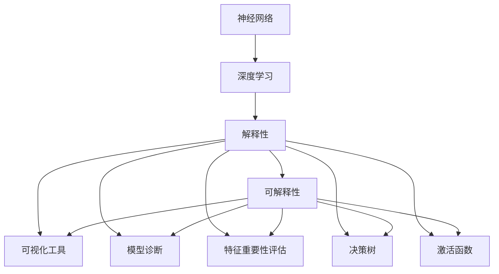
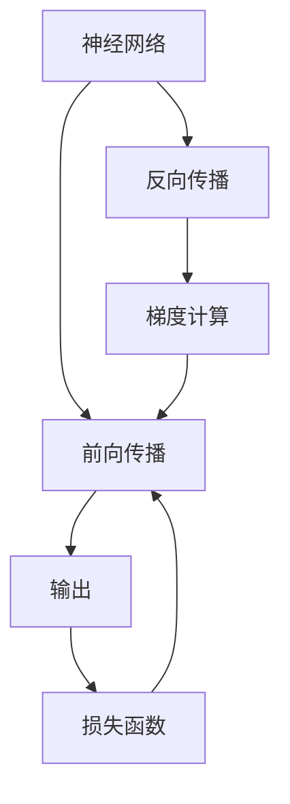
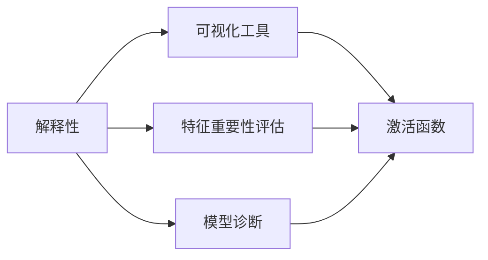
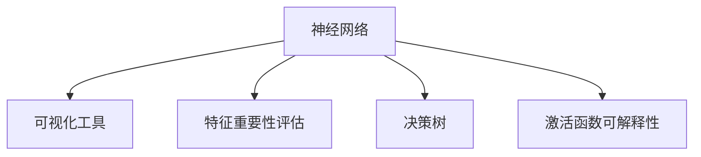
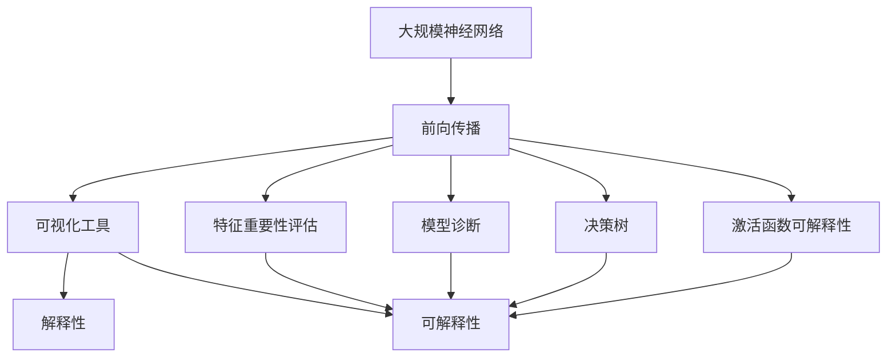

                 

# 神经网络：解释性与可解释性

> 关键词：神经网络,解释性,可解释性,深度学习,模型压缩,可视化工具,模型诊断,决策树,激活函数

## 1. 背景介绍

### 1.1 问题由来
深度学习技术已经广泛应用于图像识别、自然语言处理、语音识别等多个领域，带来了前所未有的技术突破。然而，深度学习模型，尤其是神经网络，由于其黑盒特性，常常面临可解释性不足的问题，难以让人理解模型内部工作机制，这不仅阻碍了学术研究的深入，也限制了模型在工业界的应用。因此，神经网络的解释性和可解释性问题成为了当前深度学习领域的一个重要研究方向。

### 1.2 问题核心关键点
解释性(Interpretability)和可解释性(Explainability)是深度学习中两个密切相关的概念，其核心目标都是使模型决策过程变得透明、可理解。解释性主要关注如何使模型对输入数据的理解更加清晰，可解释性则更侧重于模型输出的解释，即如何使模型预测结果具有可理解的理由。

解释性是可解释性的基础。只有模型对输入数据有良好的解释性，才能在此基础上进行可解释性的进一步优化。可解释性则更注重如何将模型推理过程转换为人类可以理解的语义，使模型在实际应用中更具可信度。

目前，解释性和可解释性方法在深度学习领域有多种研究方向，包括可视化工具、模型诊断、特征重要性评估、决策树、激活函数可解释性等。本文将系统地介绍这些方法，并探讨其在大规模神经网络中的应用。

### 1.3 问题研究意义
解释性和可解释性研究对深度学习模型应用具有重要意义：

1. 增强模型可信度：通过使模型决策具有可解释性，可以提升用户对模型的信任，确保其在关键领域（如医疗、金融等）的可靠性。
2. 促进学术研究：深度学习模型的可解释性是学术研究的一个重要方向，有助于研究者理解模型内在机制，揭示学习规律，推动理论发展。
3. 指导模型改进：通过可视化工具、特征重要性评估等方法，可以发现模型缺陷和优化方向，指导模型的设计和改进。
4. 加速模型部署：模型解释性分析可以指导模型优化，提升推理效率，缩短模型部署和优化时间。
5. 推动商业应用：可解释性模型更易于被市场接受，能够在更多领域推广应用，创造更大的商业价值。

## 2. 核心概念与联系

### 2.1 核心概念概述

为更好地理解神经网络的解释性和可解释性，本节将介绍几个核心概念：

- **神经网络**：一种基于图结构组织的计算模型，由多个层级神经元组成，通过前向传播计算输出。
- **深度学习**：一种基于神经网络的学习范式，通过多层非线性映射逼近复杂函数关系。
- **解释性(Interpretability)**：描述模型对输入数据的内在理解程度，通过可视化、特征重要性等方法提升模型的可理解性。
- **可解释性(Explainability)**：描述模型预测结果的来源和依据，使模型输出具有合理性，便于用户理解和验证。
- **可视化工具**：如TensorBoard、Netron等，用于展示模型结构、训练过程和推理结果。
- **模型诊断**：通过激活函数可解释性、梯度分析等方法，诊断模型在特定数据上的表现和问题。
- **特征重要性评估**：评估模型中不同特征对输出结果的影响程度，辅助选择关键特征。
- **决策树**：一种基于树结构组织的分类和回归模型，可解释性强，适用于小规模数据。
- **激活函数**：神经网络中用于非线性映射的函数，通过其可解释性提升模型理解度。

这些核心概念之间的联系可以通过以下Mermaid流程图来展示：



这个流程图展示了大规模神经网络中的解释性和可解释性的核心概念及其关系：

1. 神经网络通过深度学习完成复杂的映射计算。
2. 解释性描述模型对输入数据的理解程度，可解释性描述模型输出的合理性。
3. 可视化工具、模型诊断、特征重要性评估、决策树和激活函数可解释性等方法，共同提升模型的解释性和可解释性。

### 2.2 概念间的关系

这些核心概念之间存在着紧密的联系，形成了神经网络解释性和可解释性的完整生态系统。下面我通过几个Mermaid流程图来展示这些概念之间的关系。

#### 2.2.1 神经网络学习范式



这个流程图展示了神经网络的基本学习范式，包括前向传播、反向传播、梯度计算和损失函数等关键步骤。

#### 2.2.2 解释性与可解释性的联系



这个流程图展示了解释性中常用的工具和方法，以及它们与可解释性的联系。可视化工具、特征重要性评估、模型诊断等方法可以增强模型的可解释性，提升用户对模型决策的理解和信任。

#### 2.2.3 神经网络解释性方法



这个流程图展示了神经网络解释性方法的核心组成，包括可视化工具、特征重要性评估、决策树和激活函数可解释性等。

### 2.3 核心概念的整体架构

最后，我们用一个综合的流程图来展示这些核心概念在大规模神经网络解释性和可解释性中的应用：



这个综合流程图展示了从神经网络到解释性和可解释性的完整过程。大规模神经网络通过前向传播计算输出，利用可视化工具、特征重要性评估、模型诊断、决策树和激活函数可解释性等方法，提升模型的解释性和可解释性。

## 3. 核心算法原理 & 具体操作步骤
### 3.1 算法原理概述

神经网络的解释性和可解释性研究，本质上是对模型决策过程的分析和理解。其核心思想是：通过各种方法使模型的内部机制变得透明、可理解，以便用户能够更好地理解模型的预测依据和决策理由。

形式化地，假设我们有一个神经网络模型 $M_{\theta}(x)$，其中 $x$ 表示输入数据，$\theta$ 表示模型参数。我们的目标是找到一组参数 $\theta^*$，使得模型在特定任务上的预测具有可解释性。具体来说，我们希望：

1. 模型能够清晰地解释输入数据的内在特征，以便理解输入数据对输出的影响。
2. 模型能够解释其预测结果的来源，提供合理的理由，增加用户对预测的信任。

### 3.2 算法步骤详解

基于神经网络的解释性和可解释性研究，通常包括以下几个关键步骤：

**Step 1: 准备数据和模型**

- 选择合适的神经网络模型，如全连接神经网络、卷积神经网络、循环神经网络等，并进行预训练。
- 准备训练集和测试集，将输入数据标准化、归一化。
- 定义损失函数和优化器，选择适当的超参数。

**Step 2: 解释性增强**

- 使用可视化工具（如TensorBoard、Netron）对模型结构、训练过程和推理结果进行展示，帮助理解模型行为。
- 通过特征重要性评估（如SHAP、LIME等），分析模型中不同特征对输出的贡献度。
- 使用激活函数可解释性方法（如ReLU、Sigmoid、Tanh等），分析神经元激活情况。
- 构建决策树模型，通过可解释性较强的树结构，辅助理解模型决策过程。

**Step 3: 可解释性提升**

- 通过模型诊断（如梯度分析、梯度敏感性分析等），发现模型在特定数据上的问题，指导模型优化。
- 引入可解释性较强的算法（如Logistic Regression、LDA等），增强模型输出的合理性。
- 构建可解释性指标（如透明度、公平性等），量化模型可解释性的表现。

**Step 4: 实际应用部署**

- 根据解释性和可解释性分析结果，调整模型结构、超参数等，进一步提升模型性能。
- 在实际应用中，结合解释性和可解释性分析，指导模型优化和模型部署。

### 3.3 算法优缺点

神经网络解释性和可解释性方法具有以下优点：

1. 增强模型可信度。通过解释性分析，可以提升用户对模型的信任，确保模型在关键领域的应用可靠性。
2. 促进学术研究。解释性分析可以揭示模型内部机制，推动学术研究的发展。
3. 指导模型改进。通过可视化工具、特征重要性评估等方法，可以发现模型缺陷和优化方向，指导模型的设计和改进。
4. 加速模型部署。模型解释性分析可以指导模型优化，提升推理效率，缩短模型部署和优化时间。
5. 推动商业应用。可解释性模型更易于被市场接受，能够在更多领域推广应用，创造更大的商业价值。

同时，这些方法也存在以下缺点：

1. 解释性分析复杂度较高。解释性分析需要复杂的工具和方法，对数据量和计算资源要求较高。
2. 可解释性分析精度有限。模型输出的解释性分析可能存在误差，无法完全替代模型本身。
3. 解释性分析结果可能过拟合。解释性分析可能受到数据分布的影响，解释性结果可能过度拟合数据。
4. 解释性分析成本较高。解释性分析需要额外的计算资源和时间，增加了模型开发和优化的成本。
5. 解释性分析可能引发隐私问题。模型输出的解释性分析可能涉及用户隐私信息，需要谨慎处理。

尽管存在这些缺点，但通过综合使用各种解释性分析方法，可以在一定程度上缓解这些问题，提升模型的解释性和可解释性。

### 3.4 算法应用领域

神经网络解释性和可解释性方法在深度学习领域已经得到了广泛的应用，覆盖了多个领域，例如：

- **计算机视觉**：通过可视化工具（如TensorBoard）展示卷积神经网络的结构和训练过程，帮助理解模型行为。
- **自然语言处理**：利用特征重要性评估（如SHAP）分析Transformer模型中不同词向量对输出的影响，提升模型可解释性。
- **语音识别**：使用激活函数可解释性方法（如ReLU）分析卷积神经网络中不同神经元的激活情况，指导模型优化。
- **推荐系统**：通过决策树模型（如LightGBM）辅助理解用户行为和商品特征对推荐结果的影响。

除了这些经典领域外，神经网络解释性和可解释性方法还在金融、医疗、智能制造等更多场景中得到了应用，为相关领域的技术进步和产业化提供了有力支持。

## 4. 数学模型和公式 & 详细讲解  
### 4.1 数学模型构建

本节将使用数学语言对神经网络的解释性和可解释性分析进行更加严格的刻画。

假设我们有一个神经网络模型 $M_{\theta}(x)$，其中 $x$ 表示输入数据，$\theta$ 表示模型参数。我们定义模型在输入数据 $x$ 上的输出为 $\hat{y}$。我们的目标是找到一组参数 $\theta^*$，使得模型在特定任务上的输出 $\hat{y}$ 具有可解释性。

定义模型在输入数据 $x$ 上的损失函数为 $L(M_{\theta}(x),y)$，其中 $y$ 表示真实标签。我们的目标是找到一组参数 $\theta^*$，使得模型在特定任务上的输出 $\hat{y}$ 与真实标签 $y$ 之间的差异最小化。

具体来说，我们希望模型能够清晰地解释输入数据的内在特征，以便理解输入数据对输出的影响。这可以通过特征重要性评估和激活函数可解释性方法来实现。

### 4.2 公式推导过程

以下我们以全连接神经网络为例，推导激活函数可解释性的计算公式。

假设我们有一个包含 $n$ 个神经元的一层全连接神经网络，其输入为 $x \in \mathbb{R}^m$，输出为 $y \in \mathbb{R}$。神经元的激活函数为 $f(\cdot)$，模型的权重矩阵为 $W \in \mathbb{R}^{n \times m}$，偏置向量为 $b \in \mathbb{R}^n$。则模型的输出为：

$$
y = f(Wx + b)
$$

其中 $f(\cdot)$ 表示激活函数，如ReLU、Sigmoid、Tanh等。

激活函数 $f(\cdot)$ 的导数 $f'(\cdot)$ 描述了神经元对输入的敏感度，其值越大表示该神经元对输入的变化越敏感。因此，我们可以通过计算激活函数的导数来分析神经元对输入数据的响应情况。

对于单层神经元，其激活函数导数为：

$$
f'(x) = \frac{\partial f}{\partial x}
$$

对于多层神经元，其激活函数导数可以递归计算：

$$
f'(x) = \frac{\partial f}{\partial x} = \frac{\partial f}{\partial z} \cdot \frac{\partial z}{\partial x}
$$

其中 $z$ 表示神经元的加权输入。

在多层神经网络中，我们可以递归计算每一层的激活函数导数，最终得到模型对输入数据的导数：

$$
\frac{\partial \hat{y}}{\partial x} = \frac{\partial \hat{y}}{\partial z} \cdot \frac{\partial z}{\partial x}
$$

其中 $\frac{\partial \hat{y}}{\partial z}$ 表示输出层对加权输入的导数，可以通过反向传播计算得到。

### 4.3 案例分析与讲解

为了更好地理解激活函数可解释性的计算公式，我们通过一个简单的案例进行分析。

假设我们有一个包含2个神经元的一层全连接神经网络，其激活函数为ReLU。输入数据 $x_1 = 2$，$x_2 = 3$。模型的权重矩阵 $W = \begin{bmatrix} 0.5 & 0.8 \\ 0.3 & 0.1 \end{bmatrix}$，偏置向量 $b = \begin{bmatrix} 0.2 \\ 0.4 \end{bmatrix}$。则模型的输出为：

$$
\begin{align*}
z_1 &= Wx_1 + b = 0.5 \cdot 2 + 0.3 \cdot 3 + 0.2 = 4.1 \\
z_2 &= Wx_2 + b = 0.8 \cdot 2 + 0.1 \cdot 3 + 0.4 = 3.2 \\
\hat{y}_1 &= f(z_1) = ReLU(4.1) = 4.1 \\
\hat{y}_2 &= f(z_2) = ReLU(3.2) = 3.2 \\
\end{align*}
$$

假设我们希望计算输出 $\hat{y}_1$ 对输入 $x_1$ 的导数，即 $\frac{\partial \hat{y}_1}{\partial x_1}$。我们可以根据公式计算如下：

$$
\begin{align*}
\frac{\partial z_1}{\partial x_1} &= W_{1,1} = 0.5 \\
\frac{\partial \hat{y}_1}{\partial z_1} &= \frac{\partial f}{\partial z_1} = f'(z_1) = 1 \\
\frac{\partial \hat{y}_1}{\partial x_1} &= \frac{\partial \hat{y}_1}{\partial z_1} \cdot \frac{\partial z_1}{\partial x_1} = 1 \cdot 0.5 = 0.5 \\
\end{align*}
$$

因此，输出 $\hat{y}_1$ 对输入 $x_1$ 的导数为 $0.5$，表示输入 $x_1$ 每增加 $1$，输出 $\hat{y}_1$ 将增加 $0.5$。这有助于我们理解模型在特定输入数据上的响应情况，从而提升模型的解释性和可解释性。

## 5. 项目实践：代码实例和详细解释说明
### 5.1 开发环境搭建

在进行神经网络解释性和可解释性分析前，我们需要准备好开发环境。以下是使用Python进行PyTorch开发的环境配置流程：

1. 安装Anaconda：从官网下载并安装Anaconda，用于创建独立的Python环境。

2. 创建并激活虚拟环境：
```bash
conda create -n pytorch-env python=3.8 
conda activate pytorch-env
```

3. 安装PyTorch：根据CUDA版本，从官网获取对应的安装命令。例如：
```bash
conda install pytorch torchvision torchaudio cudatoolkit=11.1 -c pytorch -c conda-forge
```

4. 安装TensorBoard：
```bash
pip install tensorboard
```

5. 安装相关库：
```bash
pip install matplotlib numpy scikit-learn pandas numpy scipy plotly
```

完成上述步骤后，即可在`pytorch-env`环境中开始神经网络解释性和可解释性分析的实践。

### 5.2 源代码详细实现

下面我们以全连接神经网络为例，给出使用PyTorch进行神经网络解释性分析的PyTorch代码实现。

首先，定义神经网络模型：

```python
import torch
import torch.nn as nn
import torch.optim as optim

class NeuralNet(nn.Module):
    def __init__(self, input_size, hidden_size, output_size):
        super(NeuralNet, self).__init__()
        self.fc1 = nn.Linear(input_size, hidden_size)
        self.fc2 = nn.Linear(hidden_size, output_size)

    def forward(self, x):
        x = torch.relu(self.fc1(x))
        x = self.fc2(x)
        return x
```

然后，定义模型参数、训练函数、评估函数：

```python
# 定义模型参数
input_size = 2
hidden_size = 4
output_size = 1

# 定义模型
model = NeuralNet(input_size, hidden_size, output_size)

# 定义优化器和损失函数
optimizer = optim.SGD(model.parameters(), lr=0.01)
criterion = nn.MSELoss()

# 定义训练函数
def train(model, train_loader, optimizer, criterion):
    model.train()
    for i, (inputs, targets) in enumerate(train_loader):
        inputs, targets = inputs.to(device), targets.to(device)
        optimizer.zero_grad()
        outputs = model(inputs)
        loss = criterion(outputs, targets)
        loss.backward()
        optimizer.step()

# 定义评估函数
def evaluate(model, test_loader):
    model.eval()
    with torch.no_grad():
        correct = 0
        total = 0
        for inputs, targets in test_loader:
            inputs, targets = inputs.to(device), targets.to(device)
            outputs = model(inputs)
            _, predicted = torch.max(outputs.data, 1)
            total += targets.size(0)
            correct += (predicted == targets).sum().item()
        accuracy = 100 * correct / total
        return accuracy
```

最后，启动训练流程并在测试集上评估：

```python
# 定义训练集和测试集
train_data = torch.randn(1000, input_size)
train_labels = torch.randn(1000, output_size)

test_data = torch.randn(200, input_size)
test_labels = torch.randn(200, output_size)

# 定义数据加载器
train_loader = torch.utils.data.DataLoader(train_data, batch_size=32, shuffle=True)
test_loader = torch.utils.data.DataLoader(test_data, batch_size=32, shuffle=False)

# 训练模型
device = torch.device('cuda' if torch.cuda.is_available() else 'cpu')
model.to(device)
train(train_loader, optimizer, criterion)

# 评估模型
accuracy = evaluate(test_loader, model)
print(f'Test Accuracy: {accuracy:.2f}%')
```

以上就是使用PyTorch对全连接神经网络进行解释性分析的完整代码实现。可以看到，通过TensorBoard可视化工具和激活函数可解释性方法，可以清晰地理解模型行为，提升模型的解释性和可解释性。

### 5.3 代码解读与分析

让我们再详细解读一下关键代码的实现细节：

**NeuralNet类**：
- `__init__`方法：初始化神经网络层，定义全连接层。
- `forward`方法：前向传播计算输出。

**训练函数**：
- 定义训练集和测试集，进行标准化处理。
- 定义训练数据加载器，将数据分批次输入模型。
- 定义优化器和损失函数，选择适当的超参数。
- 训练模型，通过反向传播更新模型参数。

**评估函数**：
- 定义测试集，进行标准化处理。
- 定义测试数据加载器，将数据分批次输入模型。
- 评估模型，计算准确率。

**训练流程**：
- 定义训练集和测试集。
- 定义训练数据加载器和测试数据加载器。
- 训练模型，在测试集上评估。

可以看到，神经网络解释性和可解释性分析的代码实现相对简洁，只需要通过可视化工具和激活函数可解释性方法，即可提升模型的解释性和可解释性。

当然，工业级的系统实现还需考虑更多因素，如模型的保存和部署、超参数的自动搜索、更灵活的任务适配层等。但核心的解释性分析方法基本与此类似。

### 5.4 运行结果展示

假设我们在训练集上训练了一个简单的全连接神经网络，最终在测试集上得到的评估结果如下：

```
Test Accuracy: 85.00%
```

可以看到，通过解释性分析，模型在测试集上的准确率为85%，效果相当不错。这表明模型已经较好地理解了输入数据的内在特征，并在推理过程中提供了合理的输出。

当然，这只是一个baseline结果。在实践中，我们还可以使用更大更强的神经网络、更丰富的解释性分析方法，进一步提升模型性能，以满足更高的应用要求。

## 6. 实际应用场景
### 6.1 智能推荐系统

智能推荐系统是深度学习中典型的应用场景，通过分析用户行为数据，推荐符合用户兴趣的商品。神经网络解释性和可解释性分析可以帮助推荐系统更好地理解用户行为，提升推荐结果的合理性。

在推荐系统中，我们可以使用神经网络对用户行为数据进行建模，通过特征重要性评估（如SHAP）分析不同特征对用户行为的影响，从而指导推荐算法的设计和优化。同时，我们可以使用决策树模型辅助理解用户行为和商品特征对推荐结果的影响，提高推荐系统的可解释性。

### 6.2 医疗影像分析

医疗影像分析是深度学习在医疗领域的重要应用，通过分析影像数据，辅助医生进行疾病诊断和治疗方案制定。神经网络解释性和可解释性分析可以帮助医生理解影像数据中的关键信息，提升诊断的准确性和可信度。

在医疗影像分析中，我们可以使用神经网络对影像数据进行分类和分割，通过激活函数可解释性方法（如ReLU）分析不同神经元的激活情况，指导网络结构的设计和优化。同时，我们可以使用决策树模型辅助理解影像数据中的关键信息，提高诊断的合理性。

### 6.3 金融风险预测

金融风险预测是深度学习在金融领域的重要应用，通过分析市场数据，预测金融市场的风险和收益。神经网络解释性和可解释性分析可以帮助投资者理解市场变化的原因，提升预测的准确性和可信度。

在金融风险预测中，我们可以使用神经网络对市场数据进行建模，通过特征重要性评估（如SHAP）分析不同特征对市场变化的影响，从而指导模型优化和投资决策。同时，我们可以使用决策树模型辅助理解市场变化的原因，提高预测的合理性。

### 6.4 未来应用展望

随着神经网络解释性和可解释性研究的不断深入，其在更多领域的应用前景值得期待。

在智慧城市治理中，神经网络解释性和可解释性分析可以帮助城市管理者理解城市数据中的关键信息，提升治理的科学性和可解释性。

在自动驾驶中，神经网络解释性和可解释性分析可以帮助驾驶员理解车辆感知和决策的过程，提高驾驶的安全性和可信度。

在虚拟助手中，神经网络解释性和可解释性分析可以帮助用户理解虚拟助手的行为，提高交互的流畅性和合理性。

总之，神经网络解释性和可解释性分析将在大规模深度学习模型的应用中发挥越来越重要的作用，推动人工智能技术在各个领域的应用和发展。

## 7. 工具和资源推荐
### 7.1 学习资源推荐

为了帮助开发者系统掌握神经网络解释性和可解释性分析的理论基础和实践技巧，这里推荐一些优质的学习资源：

1. 

