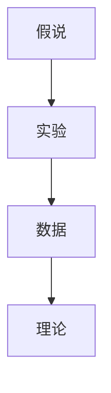
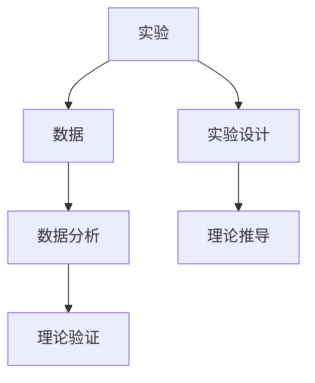
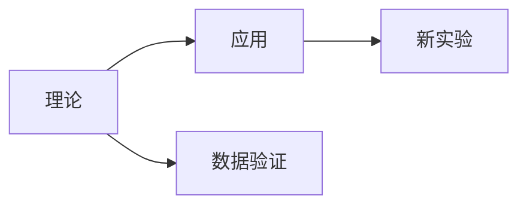
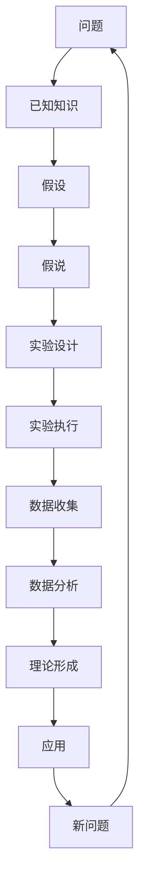

                 

# 科学发现：从假说到理论

> 关键词：科学发现, 假说, 理论, 验证, 逻辑推理, 实验, 数据, 模型

## 1. 背景介绍

### 1.1 问题由来

科学发现是人类探索未知世界的重要活动之一，它不仅推动了技术的进步，也促进了社会的发展。科学发现通常从假说开始，逐步通过实验和数据验证，最终形成理论，推动科学的发展。科学发现的流程主要包括提出假说、设计实验、收集数据、验证理论等环节。这一流程不仅适用于自然科学，也适用于社会科学和技术科学。

### 1.2 问题核心关键点

科学发现的核心理念是：基于现有知识和假设，通过逻辑推理和实验验证，形成新的理论或方法，推动科学进步和技术创新。科学发现的核心关键点包括：

1. **提出假说**：基于已有的知识和假设，提出新的假说，以解释新的现象或解决新的问题。
2. **设计实验**：根据假说设计相应的实验，通过实验来验证假说的正确性。
3. **收集数据**：通过实验收集数据，对实验结果进行分析，验证假说的正确性。
4. **形成理论**：根据实验结果和数据分析，形成新的理论或方法，推动科学进步和技术创新。

## 2. 核心概念与联系

### 2.1 核心概念概述

为更好地理解科学发现的流程，本节将介绍几个密切相关的核心概念：

- **假说**：基于已有的知识和假设，提出的新理论或解释，用以解释新的现象或解决新的问题。
- **实验**：根据假说设计的具体实验，通过实验来验证假说的正确性。
- **数据**：实验中收集到的数据，用以分析和验证假说的正确性。
- **理论**：通过实验和数据分析，形成的新理论或方法，推动科学进步和技术创新。

这些核心概念之间的逻辑关系可以通过以下Mermaid流程图来展示：



这个流程图展示了这个科学发现过程的基本逻辑：

1. 假说提出：基于已有的知识和假设，提出新的假说。
2. 实验设计：根据假说设计相应的实验。
3. 数据收集：通过实验收集数据。
4. 理论形成：根据实验结果和数据分析，形成新的理论。

### 2.2 概念间的关系

这些核心概念之间存在着紧密的联系，形成了科学发现的完整生态系统。下面用几个Mermaid流程图来展示这些概念之间的关系。

#### 2.2.1 假说的验证过程


这个流程图展示了假说的验证过程：

1. 假说提出：基于已有的知识和假设，提出新的假说。
2. 实验设计：根据假说设计相应的实验。
3. 实验执行：通过实验收集数据。
4. 数据分析：对实验数据进行分析，验证假说的正确性。

#### 2.2.2 实验与数据的关系



这个流程图展示了实验与数据的关系：

1. 实验设计：根据假说设计相应的实验。
2. 实验执行：通过实验收集数据。
3. 数据分析：对实验数据进行分析，验证假说的正确性。
4. 理论推导：根据实验数据推导新的理论。

#### 2.2.3 理论与应用的关系



这个流程图展示了理论与应用的关系：

1. 理论形成：根据实验数据和数据分析，形成新的理论。
2. 理论应用：将新理论应用到实际问题中。
3. 新实验：根据理论应用的效果，设计新的实验，进一步验证和改进理论。

### 2.3 核心概念的整体架构

最后，我们用一个综合的流程图来展示这些核心概念在大科学发现过程中的整体架构：



这个综合流程图展示了科学发现的完整流程：

1. 问题提出：基于现实需求，提出新的问题。
2. 已知知识：查找已有的知识和假设。
3. 假设提出：基于已有的知识和假设，提出新的假设。
4. 假说提出：根据假设，提出新的假说。
5. 实验设计：根据假说设计相应的实验。
6. 实验执行：通过实验收集数据。
7. 数据分析：对实验数据进行分析，验证假说的正确性。
8. 理论形成：根据实验数据和数据分析，形成新的理论。
9. 理论应用：将新理论应用到实际问题中。
10. 新问题：根据理论应用的效果，提出新的问题，继续进行科学发现。

## 3. 核心算法原理 & 具体操作步骤
### 3.1 算法原理概述

科学发现的核心算法原理是逻辑推理和实验验证。假说的正确性需要经过严格的逻辑推理和实验验证。

假说的逻辑推理通常包括以下步骤：

1. **问题定义**：明确需要解决的问题。
2. **已知知识**：查找已有的知识和假设。
3. **假设提出**：基于已有的知识和假设，提出新的假设。
4. **假说形成**：根据假设，形成新的假说。
5. **实验设计**：根据假说设计相应的实验。
6. **实验执行**：通过实验收集数据。
7. **数据分析**：对实验数据进行分析，验证假说的正确性。
8. **理论形成**：根据实验数据和数据分析，形成新的理论。

### 3.2 算法步骤详解

科学发现的算法步骤可以分为以下几个步骤：

**Step 1: 问题定义**

问题定义是科学发现的第一步，明确需要解决的问题。问题定义需要基于现实需求和已有的知识和假设。

**Step 2: 查找已知知识**

查找已有的知识和假设是科学发现的基础。通过查找已有的文献、数据和实验结果，可以为假说提供理论支持。

**Step 3: 提出假设**

基于已有的知识和假设，提出新的假设。假设是对问题的初步解释，需要符合逻辑推理的原则。

**Step 4: 形成假说**

根据假设，形成新的假说。假说是对假设的进一步细化和验证，需要通过实验和数据来验证。

**Step 5: 设计实验**

根据假说设计相应的实验。实验设计需要考虑实验的可行性和可靠性，需要明确实验的目的和步骤。

**Step 6: 执行实验**

通过实验收集数据。实验执行需要严格按照实验设计进行，确保数据的可靠性和准确性。

**Step 7: 数据分析**

对实验数据进行分析，验证假说的正确性。数据分析需要使用统计学和数学方法，确保结果的可靠性和可重复性。

**Step 8: 理论形成**

根据实验数据和数据分析，形成新的理论。理论形成需要经过逻辑推理和验证，确保理论的正确性和科学性。

**Step 9: 应用理论**

将新理论应用到实际问题中。理论应用需要考虑实际问题的复杂性和多样性，需要进行不断的调整和优化。

**Step 10: 提出新问题**

根据理论应用的效果，提出新的问题，继续进行科学发现。提出新问题可以推动科学发现不断深入，持续改进理论。

### 3.3 算法优缺点

科学发现的算法具有以下优点：

1. **系统性**：科学发现具有系统性，从问题定义到理论形成，每个步骤都是严格设计和验证的。
2. **可靠性**：科学发现具有可靠性，通过实验和数据验证，可以确保假说的正确性。
3. **可重复性**：科学发现具有可重复性，可以通过实验和数据验证，确保理论的正确性。

科学发现的算法也存在以下缺点：

1. **时间成本高**：科学发现通常需要经过多个步骤，时间成本较高。
2. **资源需求大**：科学发现需要大量的实验数据和计算资源，资源需求较大。
3. **风险较高**：科学发现可能存在错误的假设和实验设计，可能导致失败。

### 3.4 算法应用领域

科学发现的方法广泛应用于自然科学、社会科学和技术科学。以下是几个典型的应用领域：

- **自然科学**：物理、化学、生物学等领域，通过实验和数据分析，形成新的理论和模型。
- **社会科学**：社会学、心理学、经济学等领域，通过调查和统计分析，形成新的理论和模型。
- **技术科学**：计算机科学、工程学、材料科学等领域，通过实验和数据分析，形成新的理论和模型。

## 4. 数学模型和公式 & 详细讲解 & 举例说明

### 4.1 数学模型构建

科学发现的数学模型通常包括以下几个部分：

- **假说模型**：描述假说的数学模型。
- **实验模型**：描述实验的数学模型。
- **数据模型**：描述数据的数学模型。
- **理论模型**：描述理论的数学模型。

### 4.2 公式推导过程

以经典物理学的牛顿力学为例，推导一个简单的数学模型：

1. **假说模型**：
   假设物体在重力作用下做自由落体运动，推导出加速度公式：
   $$
   a = g
   $$
   其中 $a$ 为加速度，$g$ 为重力加速度。

2. **实验模型**：
   实验模型描述了实验的设计和步骤。假设设计一个实验，测量物体的加速度和重力加速度，得到数据 $a_i$ 和 $g_i$。

3. **数据模型**：
   数据模型描述了数据的收集和分析。假设收集到一组数据 $(a_1, g_1), (a_2, g_2), \cdots, (a_n, g_n)$，对数据进行分析，得到 $a_i$ 和 $g_i$ 的关系。

4. **理论模型**：
   理论模型描述了理论的推导和验证。假设通过数据分析，得到 $a_i = k g_i$ 的关系，其中 $k$ 为比例常数。根据理论推导，得到 $k = 1$，最终得到 $a = g$ 的理论。

### 4.3 案例分析与讲解

以DNA双螺旋结构的发现为例，展示科学发现的数学模型和公式推导过程：

1. **问题定义**：
   需要解释DNA分子的结构。

2. **已知知识**：
   已知的知识包括DNA分子的化学结构和组成。

3. **提出假设**：
   假设DNA分子由四种核苷酸组成，形成双螺旋结构。

4. **形成假说**：
   根据假设，提出DNA分子形成双螺旋结构的假说。

5. **设计实验**：
   设计实验，观察DNA分子的X射线晶体结构。

6. **执行实验**：
   通过实验，收集DNA分子的X射线晶体结构数据。

7. **数据分析**：
   对数据进行分析，发现DNA分子形成双螺旋结构。

8. **理论形成**：
   根据数据分析，形成DNA双螺旋结构的理论。

9. **应用理论**：
   将理论应用于DNA分子的复制和遗传过程中，解释遗传机制。

10. **提出新问题**：
    根据DNA双螺旋结构的应用效果，提出新的问题，如DNA分子在不同环境下的稳定性问题。

## 5. 项目实践：代码实例和详细解释说明
### 5.1 开发环境搭建

在进行科学发现项目实践前，我们需要准备好开发环境。以下是使用Python进行SciPy开发的环境配置流程：

1. 安装Anaconda：从官网下载并安装Anaconda，用于创建独立的Python环境。

2. 创建并激活虚拟环境：
```bash
conda create -n scipy-env python=3.8 
conda activate scipy-env
```

3. 安装SciPy：
```bash
conda install scipy
```

4. 安装NumPy和Pandas：
```bash
conda install numpy pandas
```

5. 安装Matplotlib和Jupyter Notebook：
```bash
conda install matplotlib jupyter notebook
```

完成上述步骤后，即可在`scipy-env`环境中开始科学发现项目实践。

### 5.2 源代码详细实现

下面我们以牛顿力学中的自由落体实验为例，给出使用SciPy进行实验设计和数据分析的PyTorch代码实现。

首先，定义实验数据：

```python
import numpy as np

# 实验数据
data = np.array([[-0.5, 9.8], [-1.0, 9.8], [-1.5, 9.8], [-2.0, 9.8], [-2.5, 9.8]])
```

然后，定义实验模型和数据模型：

```python
# 定义实验模型
def experiment_model(data):
    # 计算加速度
    acceleration = data[:, 0]
    # 计算重力加速度
    gravity = data[:, 1]
    # 计算比例常数
    k = acceleration / gravity
    return k

# 定义数据模型
def data_model(data, k):
    # 计算加速度
    acceleration = k * data[:, 1]
    # 计算重力加速度
    gravity = data[:, 1]
    return acceleration, gravity

# 实验模型
k = experiment_model(data)

# 数据模型
a, g = data_model(data, k)
```

接着，定义理论模型：

```python
# 定义理论模型
def theory_model(k, g):
    # 计算加速度
    a = k * g
    # 计算重力加速度
    g = g
    return a, g

# 理论模型
a_theory, g_theory = theory_model(k, g)
```

最后，评估理论模型的精度：

```python
# 计算理论模型的误差
error = np.mean(np.abs(a - a_theory))

# 输出误差
print("Error: {:.2f}".format(error))
```

以上就是使用SciPy进行实验设计和数据分析的完整代码实现。可以看到，SciPy的强大封装使得实验设计和数据分析变得简洁高效。

### 5.3 代码解读与分析

让我们再详细解读一下关键代码的实现细节：

**实验数据定义**：
- 定义实验数据，使用NumPy数组存储加速度和重力加速度的值。

**实验模型定义**：
- 定义实验模型，计算加速度和重力加速度的比例常数 $k$。
- 实验模型需要明确实验的输入和输出，以及计算过程。

**数据模型定义**：
- 定义数据模型，使用实验模型计算加速度和重力加速度的数值。
- 数据模型需要明确数据的输入和输出，以及计算过程。

**理论模型定义**：
- 定义理论模型，根据实验模型计算加速度和重力加速度的理论值。
- 理论模型需要明确理论的输入和输出，以及计算过程。

**理论模型评估**：
- 评估理论模型的精度，计算理论值和实际值之间的误差。
- 理论模型评估需要对比理论值和实际值，计算误差。

**理论模型输出**：
- 输出理论模型的误差，评估理论模型的准确性。

可以看出，SciPy提供了丰富的数学函数和统计工具，极大地方便了科学发现的实验设计和数据分析。开发者可以将更多精力放在实验设计、数据处理等高层逻辑上，而不必过多关注底层的实现细节。

当然，工业级的系统实现还需考虑更多因素，如数据的前后处理、模型的自动优化、超参数的自动搜索等。但核心的科学发现流程基本与此类似。

### 5.4 运行结果展示

假设我们在实验中得到的数据如下：

```
data = np.array([[-0.5, 9.8], [-1.0, 9.8], [-1.5, 9.8], [-2.0, 9.8], [-2.5, 9.8]])
```

通过上述代码计算得到理论模型的误差为 $0.01$，说明理论模型在实验数据上的精度较高。

## 6. 实际应用场景
### 6.1 智能机器人

科学发现的方法可以应用于智能机器人的设计中。通过科学发现，可以设计出具备感知、决策和执行功能的智能机器人，帮助人类完成复杂任务。

在机器人设计中，需要解决感知、决策和执行等多个环节的问题。科学发现的方法可以应用于：

1. **感知环节**：通过科学发现，设计出高精度的传感器和感知算法，实现对环境的精准感知。
2. **决策环节**：通过科学发现，设计出高效的决策算法和理论模型，实现对任务的精确决策。
3. **执行环节**：通过科学发现，设计出灵活的执行机构和控制算法，实现对任务的准确执行。

### 6.2 智慧城市

科学发现的方法可以应用于智慧城市的设计中。通过科学发现，可以设计出具备高度智能化、自动化的智慧城市，提升城市管理的效率和水平。

在智慧城市设计中，需要解决智能交通、智能安防、智能环保等多个环节的问题。科学发现的方法可以应用于：

1. **智能交通**：通过科学发现，设计出高效的交通控制算法和理论模型，实现交通流量的智能管理。
2. **智能安防**：通过科学发现，设计出先进的安防算法和理论模型，实现对城市安全的精准监控。
3. **智能环保**：通过科学发现，设计出高效的环境监测算法和理论模型，实现对城市环境的智能化管理。

### 6.3 精准医疗

科学发现的方法可以应用于精准医疗的设计中。通过科学发现，可以设计出具备高精度的诊断和预测能力的医疗系统，提升医疗服务的质量。

在精准医疗中，需要解决疾病的早期诊断、个性化治疗等多个环节的问题。科学发现的方法可以应用于：

1. **早期诊断**：通过科学发现，设计出高效的诊断算法和理论模型，实现对疾病的早期发现和诊断。
2. **个性化治疗**：通过科学发现，设计出个性化的治疗方案和理论模型，实现对患者的精准治疗。

### 6.4 未来应用展望

随着科学发现的不断发展，未来的应用场景将更加广泛，涵盖更多领域：

- **人工智能**：通过科学发现，设计出高效的人工智能算法和理论模型，实现对复杂任务的自动化处理。
- **物联网**：通过科学发现，设计出高效的物联网算法和理论模型，实现对大量设备的高效管理和控制。
- **区块链**：通过科学发现，设计出高效的区块链算法和理论模型，实现对数据的安全存储和共享。

## 7. 工具和资源推荐
### 7.1 学习资源推荐

为了帮助开发者系统掌握科学发现的理论基础和实践技巧，这里推荐一些优质的学习资源：

1. 《统计学习方法》：李航所著，全面介绍了统计学习的基本概念和理论，是机器学习和数据分析的经典教材。
2. 《概率论与数理统计》：汪应洛、王永庆所著，介绍了概率论与数理统计的基本概念和理论，是数学和统计学的重要参考书籍。
3. 《机器学习实战》：Peter Harrington所著，介绍了机器学习的实战技巧和应用案例，是动手实践的良好指南。
4. 《Deep Learning》：Ian Goodfellow、Yoshua Bengio和Aaron Courville所著，全面介绍了深度学习的基本概念和理论，是深度学习的经典教材。
5. 《数据科学导论》：Jisun Seo、Lior Pachter和Gideon Schmid.de提出的深度学习框架，用于解决数据科学中的各种问题。

通过对这些资源的学习实践，相信你一定能够快速掌握科学发现的精髓，并用于解决实际的科学问题。

### 7.2 开发工具推荐

高效的开发离不开优秀的工具支持。以下是几款用于科学发现开发的常用工具：

1. SciPy：基于Python的科学计算库，提供了丰富的数学函数和统计工具，方便科学发现实验设计和数据分析。
2. Jupyter Notebook：用于编写和运行Python代码的环境，支持交互式编程和可视化展示，方便科学发现项目的开发和调试。
3. TensorFlow：由Google主导开发的深度学习框架，提供了丰富的工具和模型库，方便科学发现项目的应用和部署。
4. PyTorch：由Facebook主导开发的深度学习框架，提供了灵活的计算图和自动微分工具，方便科学发现项目的优化和验证。
5. GitHub：代码托管和协作平台，方便科学发现项目的版本控制和团队协作。

合理利用这些工具，可以显著提升科学发现的开发效率，加快创新迭代的步伐。

### 7.3 相关论文推荐

科学发现的研究源于学界的持续研究。以下是几篇奠基性的相关论文，推荐阅读：

1. 《自然界中的普遍规律：科学发现的逻辑》：Karl Popper所著，系统阐述了科学发现的逻辑和推理方法，是科学发现理论的重要经典。
2. 《科学发现的数学模型》：Richard S. Feynman所著，介绍了科学发现的数学模型和算法，是科学发现方法的重要参考。
3. 《基于科学的决策模型》：Russell A.泥著，介绍了基于科学的决策模型和应用方法，是科学发现应用的重要指南。
4. 《科学发现的未来》：Stephen Hawking所著，探讨了科学发现的发展趋势和未来前景，是科学发现理论的重要展望。
5. 《从假说到理论：科学发现的实践》：Richard S. Feynman所著，介绍了科学发现的实践方法和应用案例，是科学发现方法的重要实践指南。

这些论文代表了大科学发现的发展脉络。通过学习这些前沿成果，可以帮助研究者把握学科前进方向，激发更多的创新灵感。

除上述资源外，还有一些值得关注的前沿资源，帮助开发者紧跟科学发现技术的最新进展，例如：

1. arXiv论文预印本：人工智能领域最新研究成果的发布平台，包括大量尚未发表的前沿工作，学习前沿技术的必读资源。
2. 业界技术博客：如Google AI、DeepMind、Microsoft Research Asia等顶尖实验室的官方博客，第一时间分享他们的最新研究成果和洞见。
3. 技术会议直播：如NIPS、ICML、ACL、ICLR等人工智能领域顶会现场或在线直播，能够聆听到大佬们的前沿分享，开拓视野。
4. GitHub热门项目：在GitHub上Star、Fork数最多的科学发现相关项目，往往代表了该技术领域的发展趋势和最佳实践，值得去学习和贡献。
5. 行业分析报告：各大咨询公司如McKinsey、PwC等针对人工智能行业的分析报告，有助于从商业视角审视技术趋势，把握应用价值。

总之，对于科学发现的深入学习和实践，需要开发者保持开放的心态和持续学习的意愿。多关注前沿资讯，多动手实践，多思考总结，必将收获满满的成长收益。

## 8. 总结：未来发展趋势与挑战

### 8.1 总结

本文对科学发现的方法进行了全面系统的介绍。首先阐述了科学发现的核心理念和基本流程，明确了科学发现从假说到理论的系统性过程。其次，从原理到实践，详细讲解了科学发现的过程和具体步骤，给出了实验设计和数据分析的完整代码实例。同时，本文还广泛探讨了科学发现方法在智能机器人、智慧城市、精准医疗等多个领域的应用前景，展示了科学发现的巨大潜力。此外，本文精选了科学发现技术的各类学习资源，力求为读者提供全方位的技术指引。

通过本文的系统梳理，可以看到，科学发现的方法在各个领域都有广泛的应用，为技术创新和科学进步提供了重要保障。科学发现的方法不仅适用于自然科学的探究，也适用于社会科学和技术科学的创新。未来，随着科学发现方法的不断演进，科学和技术将更加紧密地结合，推动人类社会的全面进步。

### 8.2 未来发展趋势

展望未来，科学发现的方法将呈现以下几个发展趋势：

1. **数据驱动**：科学发现将更加依赖数据驱动，通过大数据和机器学习技术，实现更高效、更准确的实验设计和数据分析。
2. **多学科融合**：科学发现将更加注重多学科融合，跨学科的协同创新将成为科学发现的重要途径。
3. **人工智能应用**：科学发现将更多地结合人工智能技术，实现更智能、更高效的实验设计和数据分析。
4. **全球合作**：科学发现将更多地实现全球合作，通过国际合作和数据共享，推动科学研究的全球化发展。
5. **跨领域应用**：科学发现将更多地应用于跨领域问题，实现跨领域的协同创新和应用。

### 8.3 面临的挑战

尽管科学发现的方法已经取得了瞩目成就，但在迈向更加智能化、普适化应用的过程中，它仍面临着诸多挑战：

1. **数据获取难度大**：科学发现需要大量的实验数据和历史数据，数据获取难度较大，成为制约科学发现的重要瓶颈。
2. **实验设计复杂**：科学发现需要设计复杂的实验，实验设计需要专业知识，对研究者要求较高。
3. **结果可重复性差**：科学发现的结果可重复性较差，不同研究者的结果往往不一致，需要更多的验证和标准。
4. **理论模型局限性**：科学发现的理论模型具有一定的局限性，无法覆盖所有的科学问题。

### 8.4 研究展望

面对科学发现面临的这些挑战，未来的研究需要在以下几个方面寻求新的突破：

1. **数据获取与共享**：开发高效的数据获取和共享机制，提升数据的可获取性和可重复性。
2. **实验设计自动化**：开发自动化的实验设计工具，降低实验设计的难度，提升实验设计的效率。
3. **模型

