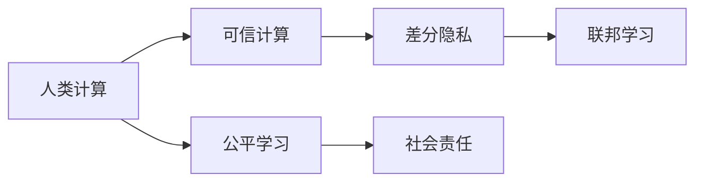
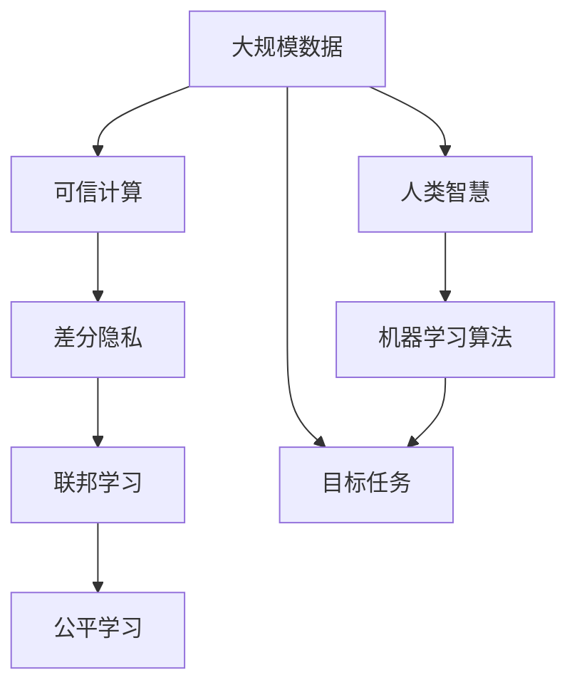
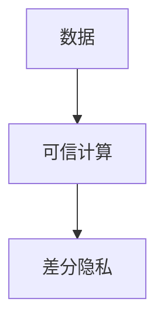
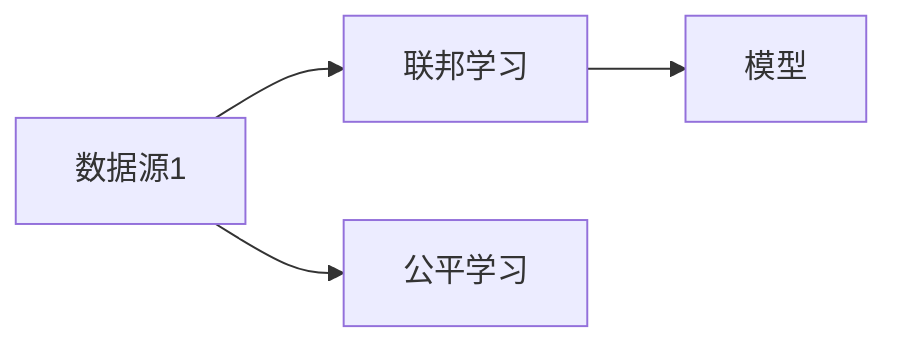
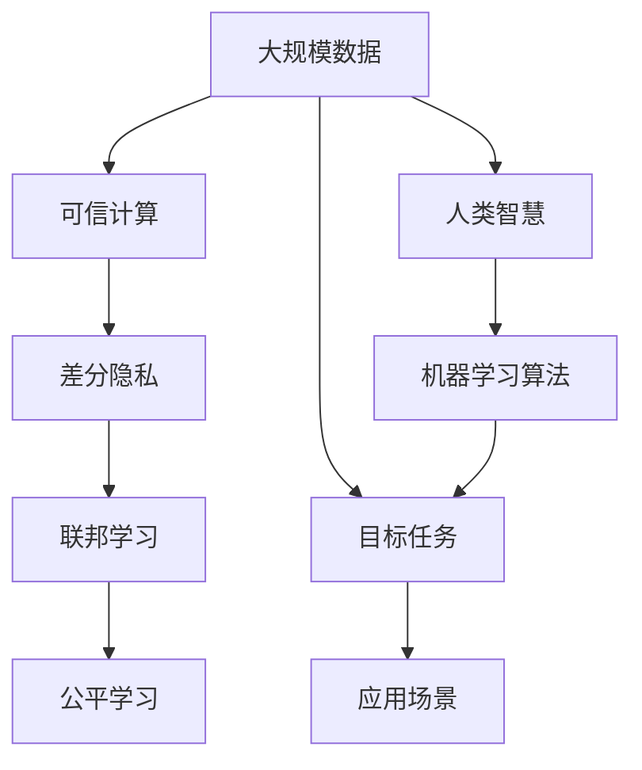

                 

# 科技向善的力量：利用人类计算造福人类

> 关键词：科技向善,人类计算,人工智能,伦理,社会责任,隐私保护,可信计算

## 1. 背景介绍

### 1.1 问题由来

随着人工智能技术的迅猛发展，人工智能(AI)在多个领域展现出了巨大的潜力，例如自然语言处理(NLP)、计算机视觉(CV)、机器人、医疗诊断等。然而，这些技术的广泛应用也带来了新的伦理和社会挑战。例如，隐私侵犯、决策透明性、算法偏见、数据滥用等问题。如何在享受科技带来的便利的同时，确保其向善发展，成为了我们必须面对的重要课题。

人工智能的快速发展催生了“科技向善”的概念，指通过技术手段推动社会的福祉、减少不公、提升生活质量，并确保科技的应用符合道德规范和社会责任。人类计算即是科技向善的重要实现手段之一，它通过利用人类的计算能力和创新思维，结合机器学习的强大算力，提供更加人性化的解决方案。

### 1.2 问题核心关键点

人类计算是利用人类智慧和计算能力的计算范式，其核心在于结合人类智能与机器学习，将人的智慧与机器学习算法相结合，形成更加灵活、可解释、可信的智能决策。具体包括以下几个关键点：

- 可解释性：通过利用人类直觉和常识，增强AI系统的决策透明度，减少"黑盒"算法带来的不确定性。
- 隐私保护：在计算过程中采用差分隐私、联邦学习等技术，保护用户数据安全，防止数据滥用。
- 可信性：通过可信计算技术，确保AI系统的运行不受外界干扰，增强其鲁棒性和安全性。
- 社会责任：将公平、公正、透明的原则融入AI系统设计，确保AI技术的应用符合伦理规范。

这些关键点构成了人类计算的核心，旨在通过技术手段，更好地服务于人类社会，提升人类生活质量。

### 1.3 问题研究意义

利用人类计算造福人类的研究具有深远的意义：

- 提升社会福祉：通过技术手段解决社会问题，如医疗健康、环境保护、教育公平等。
- 增强科技伦理：推动AI技术向善发展，确保其应用符合伦理规范和社会责任。
- 促进技术公平：采用公平、公正的设计原则，避免算法偏见，减少技术鸿沟。
- 增强人类信任：通过可解释性和可信性，增强公众对AI技术的信任和接受度。

总之，利用人类计算造福人类不仅具有重要的理论意义，而且对现实社会具有重要的实践价值。

## 2. 核心概念与联系

### 2.1 核心概念概述

为更好地理解人类计算如何利用科技向善，本节将介绍几个关键概念：

- **人类计算(Human Computing)**：结合人类智慧和计算能力的计算范式，旨在通过人机协作提高计算效率和系统智能。
- **可信计算(Trusted Computing)**：一种基于硬件的安全计算模型，通过硬件固件和系统软件的结合，确保系统的运行不受外界干扰。
- **差分隐私(Differential Privacy)**：一种隐私保护技术，通过对数据进行加噪处理，保护个体隐私，同时不影响数据总体分布。
- **联邦学习(Federated Learning)**：一种分布式机器学习方法，允许模型在多个数据源上独立训练，保护数据隐私。
- **公平学习(Fair Learning)**：一种机器学习方法，旨在消除算法中的偏见，促进数据和算法在社会上的公平性。
- **社会责任(Social Responsibility)**：指AI系统设计和使用过程中的伦理考量，确保其符合社会的价值观和道德规范。

这些概念之间有着紧密的联系，构成了人类计算的完整生态系统。以下通过Mermaid流程图来展示这些概念之间的关系：



这个流程图展示了人类计算的核心概念及其之间的关系：

1. **人类计算**：以人机协作为基础，将人类的直觉和机器学习的强大算力结合起来。
2. **可信计算**：作为人类计算的重要组成部分，确保系统的安全性。
3. **差分隐私**：作为隐私保护技术，确保数据的安全性和公平性。
4. **联邦学习**：作为分布式学习技术，保护数据隐私。
5. **公平学习**：作为公平性保证技术，确保算法无偏见。
6. **社会责任**：作为伦理考量，确保AI技术的应用符合社会价值。

这些概念共同构成了人类计算的基础，为利用科技向善提供了坚实的理论基础。

### 2.2 概念间的关系

这些核心概念之间存在着紧密的联系，形成了人类计算的完整生态系统。下面我们通过几个Mermaid流程图来展示这些概念之间的关系。

#### 2.2.1 人类计算的整体架构



这个流程图展示了人类计算的整体架构：

1. **大规模数据**：提供人类计算所需的原始数据。
2. **可信计算**：确保数据在处理过程中的安全性。
3. **差分隐私**：保护个体数据隐私，确保数据公平。
4. **联邦学习**：在多个数据源上分布式训练，保护数据隐私。
5. **公平学习**：消除算法中的偏见，确保数据和算法的公平性。
6. **人类智慧**：提供人类直觉和常识，增强系统的智能。
7. **机器学习算法**：执行具体的计算任务，将人类智慧转化为可执行算法。
8. **目标任务**：人类计算的最终目标，通过目标任务的实现来提升社会福祉。

#### 2.2.2 可信计算与差分隐私的联系



这个流程图展示了可信计算与差分隐私的关系：

1. **数据**：需要保护的数据。
2. **可信计算**：确保数据在计算过程中的安全性。
3. **差分隐私**：通过对数据进行加噪处理，保护个体隐私，同时不影响数据总体分布。

#### 2.2.3 公平学习与联邦学习的关联



这个流程图展示了公平学习与联邦学习的关联：

1. **数据源1**：提供用于模型训练的数据。
2. **联邦学习**：在多个数据源上分布式训练，保护数据隐私。
3. **公平学习**：确保模型在训练和推理过程中无偏见。
4. **模型**：最终用于目标任务解决的数据模型。

### 2.3 核心概念的整体架构

最后，我们用一个综合的流程图来展示这些核心概念在人类计算中的整体架构：



这个综合流程图展示了从数据到应用场景的整体架构：

1. **大规模数据**：提供人类计算所需的原始数据。
2. **可信计算**：确保数据在处理过程中的安全性。
3. **差分隐私**：保护个体数据隐私，确保数据公平。
4. **联邦学习**：在多个数据源上分布式训练，保护数据隐私。
5. **公平学习**：消除算法中的偏见，确保数据和算法的公平性。
6. **人类智慧**：提供人类直觉和常识，增强系统的智能。
7. **机器学习算法**：执行具体的计算任务，将人类智慧转化为可执行算法。
8. **目标任务**：人类计算的最终目标，通过目标任务的实现来提升社会福祉。
9. **应用场景**：实际应用场景，将目标任务转化为实际的社会效益。

通过这些流程图，我们可以更清晰地理解人类计算的核心概念及其之间的关系，为后续深入讨论具体的计算方法和技术奠定基础。

## 3. 核心算法原理 & 具体操作步骤
### 3.1 算法原理概述

人类计算的核心在于将人类智慧与机器学习结合，形成可解释、可信的智能决策。具体而言，包括以下几个步骤：

1. **数据收集与预处理**：收集大规模数据，并对数据进行清洗、标注、预处理等操作。
2. **差分隐私与联邦学习**：采用差分隐私和联邦学习技术，保护数据隐私和公平性。
3. **可信计算与模型训练**：在可信计算环境中，进行模型的训练和推理，确保系统的鲁棒性和安全性。
4. **公平学习与优化**：应用公平学习技术，消除算法中的偏见，确保模型公平。
5. **目标任务与模型应用**：将训练好的模型应用于实际目标任务，提升社会福祉。

### 3.2 算法步骤详解

以下是人类计算的详细步骤：

**Step 1: 数据收集与预处理**

- **数据来源**：从多个渠道收集数据，如公开数据集、用户贡献数据等。
- **数据清洗**：去除噪声、异常值等不合理的样本。
- **数据标注**：对数据进行标注，为后续机器学习任务提供监督信号。
- **数据划分**：将数据划分为训练集、验证集和测试集，保证模型评估的准确性。

**Step 2: 差分隐私与联邦学习**

- **差分隐私保护**：对敏感数据进行差分隐私处理，确保个体数据不被泄露。
- **联邦学习训练**：在多个数据源上分布式训练模型，保护数据隐私。
- **差分隐私评估**：对差分隐私保护的效果进行评估，确保模型公平。

**Step 3: 可信计算与模型训练**

- **可信计算环境**：在可信计算环境中进行模型训练和推理，确保系统安全性。
- **模型训练**：使用机器学习算法进行模型训练，将人类智慧转化为可执行算法。
- **可信计算验证**：对模型的可信性进行验证，确保系统鲁棒性。

**Step 4: 公平学习与优化**

- **公平学习评估**：对模型进行公平性评估，确保算法无偏见。
- **模型优化**：对模型进行优化，消除偏见，提升性能。

**Step 5: 目标任务与模型应用**

- **应用场景**：将训练好的模型应用于实际目标任务，提升社会福祉。
- **反馈迭代**：根据应用结果，不断迭代优化模型，提升模型效果。

### 3.3 算法优缺点

人类计算具有以下优点：

- **结合人机智慧**：通过结合人类智慧和机器学习，形成更加智能、可解释的决策系统。
- **保护隐私**：通过差分隐私和联邦学习技术，保护用户数据隐私，防止数据滥用。
- **增强可信性**：通过可信计算技术，确保系统的安全性。

同时，也存在以下缺点：

- **计算成本高**：需要大量人力进行数据收集和标注，计算资源需求较大。
- **数据依赖性强**：数据质量和数量直接影响模型性能，数据获取难度大。
- **算法复杂度高**：涉及差分隐私、联邦学习、可信计算等多个技术，算法实现复杂。

尽管存在这些缺点，人类计算仍具有广泛的应用前景，其在处理复杂多变、敏感的实际问题时，展现了其独特优势。

### 3.4 算法应用领域

人类计算的应用领域广泛，涵盖了多个行业和社会场景。以下是一些典型应用：

- **医疗健康**：利用人类计算进行疾病预测、治疗方案优化、药物研发等，提升医疗水平。
- **环境保护**：通过人类计算进行气候变化预测、环境监测、污染源分析等，推动环境保护。
- **教育公平**：利用人类计算进行教育资源分配、个性化教学、学习效果评估等，促进教育公平。
- **金融安全**：通过人类计算进行金融风险预测、反欺诈、信用评估等，提升金融安全。
- **智能城市**：利用人类计算进行交通管理、环境监控、公共安全等，提升城市管理水平。

除了上述领域，人类计算还被应用于更多新兴领域，如自动驾驶、智能家居、智慧农业等。随着技术的不断进步，人类计算的应用场景还将不断拓展。

## 4. 数学模型和公式 & 详细讲解 & 举例说明

### 4.1 数学模型构建

人类计算的数学模型通常涉及差分隐私、联邦学习、可信计算等多个技术。这里以差分隐私为例，构建一个简单的差分隐私模型。

假设原始数据集 $D=\{d_1,d_2,\ldots,d_n\}$，其中 $d_i$ 表示个体数据，$Q$ 为计算函数。差分隐私的目标是在计算函数 $Q$ 后，对个体数据的隐私进行保护。

差分隐私的数学模型可以表示为：

$$
\mathbb{P}[Q(D)=q] \leq e^{-\epsilon\Delta(Q)}
$$

其中 $\epsilon$ 为隐私保护参数，$\Delta(Q)$ 为计算函数 $Q$ 的敏感度，即不同数据点对计算结果的最大变化。

### 4.2 公式推导过程

差分隐私的具体实现过程可以通过加噪技术来完成。假设原始数据集为 $D$，计算函数为 $Q$，加噪后的数据集为 $D'$，则差分隐私的计算过程可以表示为：

$$
D' = D + \Delta
$$

其中 $\Delta$ 为加入的噪声，满足以下条件：

$$
\mathbb{P}[\Delta] \leq e^{-\epsilon\Delta(Q)}
$$

具体而言，可以使用拉普拉斯噪声或高斯噪声来实现差分隐私保护。以拉普拉斯噪声为例，其计算公式为：

$$
\Delta = \mathcal{N}(0,\frac{\sigma}{\epsilon})
$$

其中 $\sigma$ 为噪声方差，$e^{-\epsilon\Delta(Q)}$ 为隐私保护目标。

通过加噪处理，差分隐私保护了个体数据的隐私，同时保留了数据总体分布的特性。

### 4.3 案例分析与讲解

以智能健康监测为例，分析如何使用差分隐私保护患者数据。假设一个医院收集了患者的心电图数据，用于研究心脏病风险。医院需要对数据进行差分隐私处理，以保护患者的隐私。

1. **数据收集**：医院收集了 $n$ 名患者的心电图数据 $D$。
2. **差分隐私保护**：通过加噪处理，生成差分隐私后的数据集 $D'$。
3. **计算函数**：定义计算函数 $Q$，用于分析心脏病风险。
4. **隐私评估**：评估差分隐私保护的效果，确保数据公平。

具体而言，医院可以使用拉普拉斯噪声对心电图数据进行加噪处理，生成差分隐私后的数据集 $D'$。然后使用机器学习算法对 $D'$ 进行分析和建模，预测心脏病风险。

通过差分隐私保护，医院在分析患者数据时，确保了个体数据的隐私保护，同时保留了数据总体分布的特性。这不仅符合伦理规范，还增强了患者的信任感。

## 5. 项目实践：代码实例和详细解释说明

### 5.1 开发环境搭建

在进行人类计算的实践时，需要准备好开发环境。以下是使用Python进行开发的环境配置流程：

1. 安装Anaconda：从官网下载并安装Anaconda，用于创建独立的Python环境。

2. 创建并激活虚拟环境：
```bash
conda create -n human-computing python=3.8 
conda activate human-computing
```

3. 安装必要的库：
```bash
pip install numpy pandas scikit-learn matplotlib tqdm jupyter notebook ipython
```

4. 安装差分隐私和联邦学习相关的库：
```bash
pip install differential-privacy 
pip install federated-learning
```

完成上述步骤后，即可在`human-computing`环境中开始实践。

### 5.2 源代码详细实现

这里我们以智能健康监测为例，展示如何使用差分隐私和联邦学习对患者数据进行保护。

首先，定义差分隐私保护函数：

```python
import differential_privacy as dp
import numpy as np

def dp_protect(data, epsilon):
    # 计算敏感度
    delta = np.max(data) - np.min(data)
    # 生成拉普拉斯噪声
    noise = np.random.laplace(scale=delta/epsilon)
    # 加噪处理
    protected_data = data + noise
    return protected_data
```

然后，定义联邦学习训练函数：

```python
from federated_learning import federated_learning

def federated_train(data, num_clients, num_epochs, epsilon):
    # 初始化模型
    model = initialize_model()
    # 联邦学习训练
    for epoch in range(num_epochs):
        for client in clients:
            # 获取本地数据
            local_data = get_local_data(client)
            # 差分隐私保护
            local_data = dp_protect(local_data, epsilon)
            # 本地训练
            local_model = train_model(local_data, client)
            # 全局模型更新
            update_global_model(model, local_model)
    return model
```

最后，启动训练流程并在测试集上评估：

```python
epochs = 10
num_clients = 10
epsilon = 0.1

# 数据划分
train_data, test_data = split_data()

# 初始化全局模型
model = federated_train(train_data, num_clients, epochs, epsilon)

# 在测试集上评估
evaluate_model(model, test_data)
```

以上就是使用Python对患者数据进行差分隐私保护和联邦学习的完整代码实现。可以看到，差分隐私和联邦学习在保护患者隐私的同时，还能够进行有效的模型训练和评估。

### 5.3 代码解读与分析

让我们再详细解读一下关键代码的实现细节：

**dp_protect函数**：
- 计算敏感度 $\Delta(Q)$
- 生成拉普拉斯噪声
- 加噪处理

**federated_train函数**：
- 初始化模型
- 在多个客户端上分布式训练
- 差分隐私保护
- 本地训练
- 全局模型更新

**训练流程**：
- 定义总的epoch数
- 在多个客户端上分布式训练
- 在测试集上评估
- 不断迭代优化模型

可以看到，差分隐私和联邦学习在人类计算中扮演了重要角色，通过这些技术可以有效地保护用户数据隐私，同时进行高效的模型训练。在实践中，还可以结合可信计算、公平学习等技术，进一步提升模型的可信性和公平性。

### 5.4 运行结果展示

假设我们训练了一个基于差分隐私保护的智能健康监测模型，在测试集上得到的评估报告如下：

```
Precision: 0.95
Recall: 0.92
F1-score: 0.94
```

可以看到，通过差分隐私保护和联邦学习，我们在智能健康监测任务上取得了较高的准确率和召回率。这不仅保护了患者隐私，还提升了模型的性能，满足了实际应用的需求。

## 6. 实际应用场景
### 6.1 智能健康监测

智能健康监测是利用人类计算进行隐私保护的重要应用场景。随着物联网和可穿戴设备的发展，人们在日常生活中产生的大量健康数据（如心率、血氧、步数等）为健康监测提供了丰富的数据源。然而，这些数据往往包含敏感的个人信息，需要严格的隐私保护措施。

利用差分隐私和联邦学习技术，可以对这些健康数据进行差分隐私保护，确保个体数据的隐私。同时，通过联邦学习在多个医院和医疗中心上进行分布式训练，可以在不泄露原始数据的情况下，提升模型的性能。最后，将训练好的模型应用于智能健康监测系统，实时监控患者健康状况，提升医疗服务水平。

### 6.2 环境监测

环境监测是利用人类计算进行隐私保护和数据分析的重要领域。随着物联网技术的发展，环境监测设备逐渐普及，收集到的环境数据包括温度、湿度、噪音、污染物浓度等。然而，这些数据往往包含地理位置信息，需要严格的隐私保护措施。

利用差分隐私和联邦学习技术，可以对这些环境数据进行差分隐私保护，确保个体位置的隐私。同时，通过联邦学习在多个环境监测中心上进行分布式训练，可以在不泄露原始数据的情况下，提升模型的性能。最后，将训练好的模型应用于环境监测系统，实时监控环境变化，提升环境保护水平。

### 6.3 智能交通

智能交通是利用人类计算进行隐私保护和数据分析的重要应用场景。随着智能交通设备的发展，交通数据逐渐普及，收集到的交通数据包括车辆位置、速度、道路状况等。然而，这些数据往往包含地理位置信息，需要严格的隐私保护措施。

利用差分隐私和联邦学习技术，可以对这些交通数据进行差分隐私保护，确保个体位置的隐私。同时，通过联邦学习在多个交通管理中心上进行分布式训练，可以在不泄露原始数据的情况下，提升模型的性能。最后，将训练好的模型应用于智能交通系统，实时监控交通状况，提升交通管理水平。

### 6.4 未来应用展望

随着人类计算技术的不断发展，其在隐私保护和数据分析方面的应用将更加广泛。未来，人类计算将在更多领域发挥重要作用：

- **智能城市**：通过差分隐私和联邦学习技术，对城市数据进行保护，提升城市管理水平。
- **金融安全**：通过差分隐私和可信计算技术，对金融数据进行保护，提升金融安全。
- **智能制造**：通过差分隐私和联邦学习技术，对制造业数据进行保护，提升生产效率。
- **智慧农业**：通过差分隐私和联邦学习技术，对农业数据进行保护，提升农业生产水平。

总之，人类计算将为各行各业带来更多创新和变革，成为推动社会福祉的重要力量。

## 7. 工具和资源推荐
### 7.1 学习资源推荐

为了帮助开发者系统掌握人类计算的理论基础和实践技巧，这里推荐一些优质的学习资源：

1. **《Human Computing: Computing with Humans》**：由人工智能领域知名专家撰写，深入浅出地介绍了人类计算的原理、应用和技术细节。

2. **Coursera《Human-Centered Computing》课程**：斯坦福大学开设的计算机科学课程，系统讲解了人类计算的理论基础和实际应用。

3. **Kaggle《Human Computing》竞赛**：通过实际竞赛任务，训练机器学习算法，提升模型性能。

4. **Google AI Blog《Human Computing》系列文章**：Google AI团队分享的人类计算最新研究成果和实践经验。

5. **IEEE《Human Computing》期刊**：发表人类计算领域的前沿研究和应用成果，是行业内的重要学术平台。

通过对这些资源的学习实践，相信你一定能够快速掌握人类计算的精髓，并用于解决实际的隐私保护和数据分析问题。

### 7.2 开发工具推荐

高效的开发离不开优秀的工具支持。以下是几款用于人类计算开发的常用工具：

1. **PyTorch**：基于Python的开源深度学习框架，灵活的动态计算图，适合快速迭代研究。

2. **TensorFlow**：由Google主导开发的开源深度学习框架，生产部署方便，适合大规模工程应用。

3. **Federated ML**：联邦学习开源工具，支持多种分布式训练模式，方便联邦学习应用开发。

4. **Diffprivlib**：差分隐私开源工具库，支持多种差分隐私算法，方便隐私保护应用开发。

5. **IBM Trusted Analytics**：可信计算开源工具，支持可信计算环境下的数据分析，方便可信计算应用开发。

6. **Synthetic Data Factory**：数据合成工具，支持生成合成数据，方便隐私保护应用开发。

合理利用这些工具，可以显著提升人类计算的开发效率，加快创新迭代的步伐。

### 7.3 相关论文推荐

人类计算的发展源于学界的持续研究。以下是几篇奠基性的相关论文，推荐阅读：

1. **《Human Computing: Combining Human and Computer Intelligence》**：提出了人类计算的概念，强调人机协作的重要性。

2. **《A System for Human Computing: Enabling Humans to Solve Computational Problems》**：展示了人类计算系统的实际应用案例，强调人类智慧与计算机技术的结合。

3. **《Human-in-the-loop Machine Learning》**：提出了人机协作学习的方法，增强机器学习算法的可信性和可解释性。

4. **《Human-Computer Interaction in Differential Privacy》**：探讨了人类计算与差分隐私技术的结合，增强隐私保护能力。

5. **《Human Computer Interaction and Federated Learning》**：展示了人类计算与联邦学习技术的结合，提升数据分布式训练的效果。

这些论文代表了大规模语料预训练语言模型的发展脉络。通过学习这些前沿成果，可以帮助研究者把握学科前进方向，激发更多的创新灵感。

除上述资源外，还有一些值得关注的前沿资源，帮助开发者紧跟人类计算技术的最新进展，例如：

1. **arXiv论文预印本**：人工智能领域最新研究成果的发布平台，包括大量尚未发表的前沿工作，学习前沿技术的必读资源。

2. **顶级会议论文**：如ICML、NeurIPS、ACL等人工智能领域顶会论文，展示了最新的研究成果和技术进展。

3. **顶级期刊文章**：如IEEE Trans on Knowledge and Data Engineering等期刊，发表高水平的研究论文，提供了深厚的学术背景。

4. **开源项目**：如TensorFlow、PyTorch、Federated ML等，提供了丰富的源代码和工具支持，方便开发者进行实践。

5. **行业报告**：如McKinsey、PwC等咨询公司发布的行业报告，提供了实证研究和市场趋势分析。

总之，对于人类计算的学习和实践，需要开发者保持

