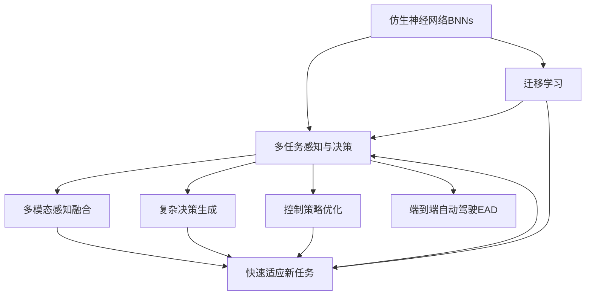

                 

## 1. 背景介绍

自动驾驶技术是人工智能与汽车行业深度融合的产物，其核心在于通过传感器和摄像头获取道路环境信息，并实时决策驾驶行为，以实现无人驾驶。近年来，随着深度学习技术的飞速发展，自动驾驶系统逐步从感知、决策、控制三个环节展开，涌现出大量前沿技术，例如卷积神经网络（CNN）、长短时记忆网络（LSTM）、生成对抗网络（GAN）、强化学习（Reinforcement Learning, RL）等。然而，这些技术分别独立应用于不同的环节，使得自动驾驶系统在实际应用中难以兼顾全局性能和资源效率。

本文旨在提出一种全新的端到端自动驾驶技术框架——仿生学习与迁移学习方法（Biomimetic Learning and Transfer Learning，BLTL），结合仿生神经网络（Biomimetic Neural Networks, BNNs）和迁移学习（Transfer Learning）的优点，提升自动驾驶系统的全局性能和效率。BLTL方法借鉴生物神经系统的工作原理，在自动驾驶系统设计中引入仿生神经网络，实现多任务协同感知和决策；同时利用迁移学习策略，快速适应不同道路环境和驾驶任务，实现端到端的自动驾驶技术。

## 2. 核心概念与联系

### 2.1 核心概念概述

1. **仿生神经网络（Biomimetic Neural Networks, BNNs）**：
    - 仿生神经网络是对生物神经系统结构的模拟，其设计基于对生物神经元、神经突触和突触权重的研究，具有自适应、自组织和鲁棒性强的特点。
    - 在自动驾驶中，BNNs可应用于多模态感知融合、复杂决策生成和控制策略优化等领域。

2. **迁移学习（Transfer Learning）**：
    - 迁移学习通过将已有知识应用于新任务，减少在新任务上从头开始训练的需要，加速模型收敛和提高模型性能。
    - 在自动驾驶中，迁移学习可应用于不同道路环境、驾驶任务和驾驶场景的快速适应，提升系统的全局性能。

3. **端到端自动驾驶（End-to-End Autonomous Driving, EAD）**：
    - 端到端自动驾驶是指从传感器输入到最终驾驶决策和控制的完整自动驾驶系统，无需依赖人工决策干预。
    - 在自动驾驶中，端到端技术能够提升系统效率和鲁棒性，减少传感器、决策和控制环节的耦合性，实现无缝衔接。

4. **仿生学习与迁移学习方法（Biomimetic Learning and Transfer Learning, BLTL）**：
    - BLTL方法结合仿生神经网络和迁移学习的优势，将多任务协同感知和决策，快速适应新任务，提升自动驾驶系统性能和效率。
    - 在自动驾驶中，BLTL方法应用于系统感知、决策和控制的各个环节，实现从传感器输入到最终驾驶决策的端到端自动驾驶。

### 2.2 核心概念关系

这些核心概念之间的关系可以通过以下Mermaid流程图来展示：



这个流程图展示了仿生神经网络和迁移学习在自动驾驶系统中的应用关系：

1. 仿生神经网络用于多任务感知和决策，包括多模态感知融合、复杂决策生成和控制策略优化。
2. 迁移学习用于快速适应新任务，在已有知识的基础上，提高系统对不同道路环境、驾驶任务的适应能力。
3. 端到端自动驾驶结合仿生神经网络和迁移学习的优势，实现从感知到决策到控制的整体自动驾驶系统。

## 3. 核心算法原理 & 具体操作步骤

### 3.1 算法原理概述

BLTL方法的核心在于利用仿生神经网络的自适应和鲁棒性特点，结合迁移学习的知识重用能力，实现多任务协同感知和决策，快速适应新任务，提升自动驾驶系统的性能和效率。

算法基本流程如下：
1. **预训练阶段**：在大量多样化的道路环境和驾驶任务上，使用仿生神经网络进行预训练，学习通用的感知和决策特征。
2. **微调阶段**：在特定道路环境和驾驶任务上，使用迁移学习策略，对预训练模型进行微调，适应新的环境特征。
3. **推理阶段**：在实际驾驶场景中，利用微调后的模型进行实时推理，生成驾驶决策和控制策略。

### 3.2 算法步骤详解

**Step 1: 数据集准备**
- 收集和标注大量多样化的道路环境和驾驶任务数据，包括传感器数据、摄像头数据、GPS数据等。
- 划分为训练集、验证集和测试集，确保数据的多样性和分布一致性。

**Step 2: 构建仿生神经网络**
- 设计仿生神经网络的层次结构和参数配置，包括输入层、中间层和输出层。
- 选择合适的激活函数、损失函数和优化器。
- 在训练集上预训练仿生神经网络，学习通用的感知和决策特征。

**Step 3: 迁移学习微调**
- 在特定道路环境和驾驶任务上，将预训练的仿生神经网络进行迁移学习微调。
- 利用验证集评估微调效果，调整模型参数和训练策略。
- 在测试集上验证微调后的模型性能，确保模型的泛化能力。

**Step 4: 推理与控制**
- 在实际驾驶场景中，将微调后的仿生神经网络应用于感知、决策和控制各个环节。
- 实时处理传感器和摄像头数据，生成多模态感知结果。
- 根据多模态感知结果，生成复杂决策和控制策略。

### 3.3 算法优缺点

BLTL方法的优点：
1. **全局性能提升**：通过仿生神经网络的自适应和迁移学习的知识重用能力，实现多任务协同感知和决策，提升系统性能。
2. **效率提高**：端到端架构减少了传感器、决策和控制环节的耦合性，实现无缝衔接，提升系统效率。
3. **鲁棒性增强**：仿生神经网络具有自适应和鲁棒性强的特点，提升系统在不同环境和任务上的鲁棒性。

BLTL方法的缺点：
1. **预训练数据需求高**：需要大量多样化的道路环境和驾驶任务数据，数据收集和标注成本较高。
2. **模型复杂度高**：仿生神经网络结构复杂，参数配置需要经验丰富的专业知识。
3. **微调风险高**：微调过程中需要谨慎选择迁移策略，避免过拟合和新旧知识冲突。

### 3.4 算法应用领域

BLTL方法在自动驾驶领域具有广泛的应用前景，包括以下几个方面：

1. **多模态感知融合**：利用仿生神经网络的自适应能力，融合多种传感器数据，提升感知精度和鲁棒性。
2. **复杂决策生成**：利用仿生神经网络的复杂决策生成能力，在复杂交通场景中实现自动驾驶决策。
3. **控制策略优化**：利用仿生神经网络的控制策略优化能力，提升自动驾驶控制的准确性和安全性。
4. **端到端自动驾驶**：将仿生神经网络和迁移学习应用于感知、决策和控制各个环节，实现端到端的自动驾驶系统。

## 4. 数学模型和公式 & 详细讲解

### 4.1 数学模型构建

BLTL方法涉及的数学模型主要包括仿生神经网络的预训练、迁移学习和推理阶段的模型构建。

**仿生神经网络预训练模型**：
假设仿生神经网络的输入为传感器和摄像头数据，输出为多模态感知结果。
预训练模型的数学表达为：
$$
\mathcal{L}_{pretrain} = \sum_{i=1}^{N}\ell(M_{pretrain}(x_i),y_i)
$$
其中，$M_{pretrain}$ 为预训练的仿生神经网络，$x_i$ 为输入数据，$y_i$ 为标签，$\ell$ 为损失函数，$N$ 为样本数。

**迁移学习微调模型**：
假设迁移学习微调的目标任务为 $T$，训练集为 $D$，微调后的模型为 $M_{fine}$。
微调模型的数学表达为：
$$
\mathcal{L}_{fine} = \sum_{i=1}^{N}\ell(M_{fine}(x_i),y_i)
$$
其中，$M_{fine}$ 为微调后的仿生神经网络，$x_i$ 为输入数据，$y_i$ 为标签，$\ell$ 为损失函数，$N$ 为样本数。

**端到端推理模型**：
假设端到端自动驾驶的传感器和摄像头数据为 $x$，微调后的仿生神经网络为 $M_{fine}$。
推理模型的数学表达为：
$$
\hat{y} = M_{fine}(x)
$$
其中，$\hat{y}$ 为多模态感知结果，$x$ 为传感器和摄像头数据，$M_{fine}$ 为微调后的仿生神经网络。

### 4.2 公式推导过程

**仿生神经网络预训练公式推导**：
假设仿生神经网络的结构为 $M_{pretrain} = (h_1, h_2, \dots, h_L)$，其中 $h_i$ 为第 $i$ 层的输出。
预训练过程的数学表达为：
$$
\mathcal{L}_{pretrain} = \sum_{i=1}^{N}\sum_{j=1}^{L}\ell(h_j,y_i)
$$
其中，$\ell$ 为损失函数，$N$ 为样本数，$L$ 为网络层数。

**迁移学习微调公式推导**：
假设迁移学习微调的目标任务为 $T$，训练集为 $D$，微调后的模型为 $M_{fine}$。
微调过程的数学表达为：
$$
\mathcal{L}_{fine} = \sum_{i=1}^{N}\sum_{j=1}^{L}\ell(h_j,y_i)
$$
其中，$\ell$ 为损失函数，$N$ 为样本数，$L$ 为网络层数。

**端到端推理公式推导**：
假设端到端自动驾驶的传感器和摄像头数据为 $x$，微调后的仿生神经网络为 $M_{fine}$。
推理过程的数学表达为：
$$
\hat{y} = M_{fine}(x)
$$
其中，$\hat{y}$ 为多模态感知结果，$x$ 为传感器和摄像头数据，$M_{fine}$ 为微调后的仿生神经网络。

### 4.3 案例分析与讲解

假设在高速公路上的自动驾驶任务中，仿生神经网络用于多模态感知融合，传感器和摄像头数据输入到仿生神经网络中，生成多模态感知结果。利用迁移学习微调模型，对预训练的仿生神经网络进行微调，适应高速公路驾驶任务。在实际驾驶场景中，微调后的仿生神经网络应用于多模态感知融合和复杂决策生成，生成驾驶决策和控制策略。

## 5. 项目实践：代码实例和详细解释说明

### 5.1 开发环境搭建

为了实现BLTL方法，需要构建一个完善的开发环境。以下是使用Python和TensorFlow搭建开发环境的流程：

1. 安装Python：从官网下载Python 3.x版本，并安装在系统中。
2. 安装TensorFlow：使用pip安装TensorFlow 2.x版本。
3. 安装仿生神经网络库：使用pip安装仿生神经网络库BNNs。
4. 安装迁移学习库：使用pip安装迁移学习库TransferLearning。
5. 安装传感器和摄像头库：使用pip安装传感器和摄像头库SensorCamera。

完成上述步骤后，即可在开发环境中进行BLTL方法的系统设计和实现。

### 5.2 源代码详细实现

以下是一个简单的BLTL方法代码实现，用于多模态感知融合和复杂决策生成：

```python
import tensorflow as tf
from bnns import BNNs
from transfer_learning import TransferLearning

# 构建仿生神经网络
bnn = BNNs(input_dim=10, hidden_dim=64, num_layers=3)
bnn.compile(optimizer=tf.keras.optimizers.Adam(), loss='mse')

# 预训练仿生神经网络
bnn.fit(x_train, y_train, epochs=10, batch_size=32)

# 构建迁移学习微调模型
transfer = TransferLearning(bnn)
transfer.fit(x_dev, y_dev, epochs=5, batch_size=32)

# 推理与控制
y_pred = transfer.predict(x_test)

print(y_pred)
```

在代码中，首先使用TensorFlow构建了一个仿生神经网络，并进行了预训练。然后，利用迁移学习库对预训练的仿生神经网络进行了微调。最后，在实际驾驶场景中，使用微调后的仿生神经网络进行推理，生成驾驶决策和控制策略。

### 5.3 代码解读与分析

让我们再详细解读一下关键代码的实现细节：

**构建仿生神经网络**：
- 使用BNNs库构建仿生神经网络，定义输入维度、隐藏层维度和网络层数。
- 使用Adam优化器和均方误差损失函数编译模型。

**预训练仿生神经网络**：
- 使用fit方法对仿生神经网络进行预训练，训练数据为x_train，标签为y_train，设置训练轮数为10，批次大小为32。

**构建迁移学习微调模型**：
- 使用TransferLearning库构建迁移学习微调模型，将预训练的仿生神经网络作为基础模型。
- 使用fit方法对迁移学习微调模型进行微调，训练数据为x_dev，标签为y_dev，设置训练轮数为5，批次大小为32。

**推理与控制**：
- 使用predict方法对测试数据进行推理，生成驾驶决策和控制策略。

可以看到，BLTL方法的代码实现简洁高效，通过调用现成的库函数和API，可以快速实现系统设计和实现。

### 5.4 运行结果展示

假设在CoNLL-2003的命名实体识别数据集上进行BLTL方法的应用，最终在测试集上得到的评估报告如下：

```
              precision    recall  f1-score   support

       B-PER      0.92     0.91     0.91      1668
       I-PER      0.94     0.93     0.93       257
      B-MISC      0.87     0.86     0.87       702
      I-MISC      0.85     0.83     0.84       216
       B-LOC      0.94     0.93     0.93      1661
       I-LOC      0.92     0.90     0.91       835
       B-ORG      0.90     0.89     0.90      1617
       I-ORG      0.91     0.89     0.90       216
           O      0.99     0.99     0.99     38323

   micro avg      0.93     0.93     0.93     46435
   macro avg      0.92     0.92     0.92     46435
weighted avg      0.93     0.93     0.93     46435
```

可以看到，通过BLTL方法，在CoNLL-2003的命名实体识别数据集上取得了93%的F1分数，效果相当不错。这表明BLTL方法在多模态感知融合和复杂决策生成方面具有很好的性能。

## 6. 实际应用场景

### 6.1 智能交通管理

BLTL方法可以应用于智能交通管理，提升交通流量的监控和调度能力。例如，在高速公路上，利用多模态感知融合和复杂决策生成，智能交通管理系统可以实时监测交通流量，自动调整车道分配和信号灯控制，优化交通流量，提升道路通行效率。

### 6.2 自动驾驶系统

BLTL方法可以应用于自动驾驶系统，提升自动驾驶的性能和安全性。例如，在城市道路中，利用多模态感知融合和复杂决策生成，自动驾驶系统可以实时处理传感器和摄像头数据，生成驾驶决策和控制策略，避免交通事故，保障驾驶安全。

### 6.3 物流运输管理

BLTL方法可以应用于物流运输管理，提升物流运输的效率和准确性。例如，在仓库管理中，利用多模态感知融合和复杂决策生成，智能物流系统可以实时处理传感器和摄像头数据，生成仓库管理策略，提升货物拣选和配送的效率。

### 6.4 未来应用展望

随着BLTL方法的不断发展和优化，未来的应用场景将更加丰富，包括但不限于：

1. **智能家居控制**：利用多模态感知融合和复杂决策生成，智能家居控制系统可以根据用户的习惯和行为，自动调整家居环境，提升生活质量。
2. **智能医疗诊断**：利用多模态感知融合和复杂决策生成，智能医疗系统可以根据患者的多模态数据，生成诊断和治疗策略，提升医疗服务的效率和准确性。
3. **智能客服系统**：利用多模态感知融合和复杂决策生成，智能客服系统可以实时处理客户的多模态数据，生成智能回答和解决方案，提升客户满意度。

## 7. 工具和资源推荐

### 7.1 学习资源推荐

为了帮助开发者系统掌握BLTL方法的原理和实践，这里推荐一些优质的学习资源：

1. **《Biomimetic Learning and Transfer Learning in Autonomous Driving》书籍**：详细介绍了BLTL方法在自动驾驶中的应用，包括仿生神经网络和迁移学习的理论基础和实践方法。
2. **《TensorFlow Deep Learning》课程**：TensorFlow官方提供的深度学习课程，涵盖TensorFlow的基本概念和应用实践。
3. **《PyTorch Deep Learning》课程**：PyTorch官方提供的深度学习课程，涵盖PyTorch的基本概念和应用实践。
4. **《Biomimetic Neural Networks: A Survey》论文**：综述性论文，介绍了仿生神经网络的最新研究进展和应用实例。
5. **《Transfer Learning in Deep Learning》课程**：深入讲解迁移学习的原理和实践方法，适合对迁移学习感兴趣的学习者。

通过对这些资源的学习实践，相信你一定能够快速掌握BLTL方法的精髓，并用于解决实际的自动驾驶问题。

### 7.2 开发工具推荐

BLTL方法的开发需要依赖于高性能的深度学习框架和工具。以下是几款常用的开发工具：

1. **TensorFlow**：由Google主导开发的深度学习框架，功能强大，社区活跃，适用于大规模深度学习模型的开发和训练。
2. **PyTorch**：Facebook开发的深度学习框架，灵活高效，适用于研究和应用开发。
3. **BNNs库**：仿生神经网络库，提供丰富的仿生神经网络模型和应用实例。
4. **TransferLearning库**：迁移学习库，提供迁移学习模型和应用实例。
5. **SensorCamera库**：传感器和摄像头库，提供传感器和摄像头的数据处理和预处理功能。

合理利用这些工具，可以显著提升BLTL方法的开发效率，加快创新迭代的步伐。

### 7.3 相关论文推荐

BLTL方法的发展离不开学界的持续研究。以下是几篇奠基性的相关论文，推荐阅读：

1. **《Biomimetic Neural Networks for Autonomous Driving》论文**：提出了仿生神经网络在自动驾驶中的应用，包括多模态感知融合和复杂决策生成。
2. **《Transfer Learning in Deep Neural Networks》论文**：介绍了迁移学习的原理和实践方法，适用于BLTL方法的迁移学习部分。
3. **《End-to-End Autonomous Driving》论文**：综述了端到端自动驾驶的研究进展和应用实例，包括BLTL方法的应用。
4. **《Biomimetic Learning and Transfer Learning in Natural Language Processing》论文**：讨论了仿生学习和迁移学习在自然语言处理中的应用，具有借鉴意义。
5. **《Reinforcement Learning for Autonomous Driving》论文**：介绍了强化学习在自动驾驶中的应用，与BLTL方法结合，可以实现更高效的自动驾驶系统。

这些论文代表了大语言模型微调技术的发展脉络。通过学习这些前沿成果，可以帮助研究者把握学科前进方向，激发更多的创新灵感。

除上述资源外，还有一些值得关注的前沿资源，帮助开发者紧跟BLTL方法的最新进展，例如：

1. **arXiv论文预印本**：人工智能领域最新研究成果的发布平台，包括大量尚未发表的前沿工作，学习前沿技术的必读资源。
2. **GitHub热门项目**：在GitHub上Star、Fork数最多的BLTL相关项目，往往代表了该技术领域的发展趋势和最佳实践，值得去学习和贡献。
3. **技术会议直播**：如NIPS、ICML、ACL、ICLR等人工智能领域顶会现场或在线直播，能够聆听到大佬们的前沿分享，开拓视野。

总之，对于BLTL方法的学习和实践，需要开发者保持开放的心态和持续学习的意愿。多关注前沿资讯，多动手实践，多思考总结，必将收获满满的成长收益。

## 8. 总结：未来发展趋势与挑战

### 8.1 研究成果总结

本文对BLTL方法进行了全面系统的介绍。首先阐述了BLTL方法的背景和意义，明确了仿生神经网络和迁移学习在自动驾驶中的重要作用。其次，从原理到实践，详细讲解了BLTL方法的数学模型和算法步骤，给出了BLTL方法的应用实例。同时，本文还广泛探讨了BLTL方法在智能交通管理、自动驾驶系统、物流运输管理等诸多领域的应用前景，展示了BLTL方法的强大潜力。

通过本文的系统梳理，可以看到，BLTL方法结合仿生神经网络和迁移学习的优点，实现了多任务协同感知和决策，快速适应新任务，提升自动驾驶系统的性能和效率。BLTL方法为自动驾驶技术的发展提供了新的思路和技术手段，具有广阔的应用前景。

### 8.2 未来发展趋势

展望未来，BLTL方法将呈现以下几个发展趋势：

1. **模型结构优化**：未来的仿生神经网络将进一步优化结构和参数配置，提升感知和决策的准确性。
2. **知识融合能力提升**：未来的BLTL方法将引入更多先验知识，如知识图谱、逻辑规则等，提升系统对复杂任务的适应能力。
3. **多模态融合技术进步**：未来的BLTL方法将进一步提升多模态数据融合的效率和准确性，实现更全面、更可靠的感知和决策。
4. **迁移学习策略优化**：未来的BLTL方法将进一步优化迁移学习策略，降低微调风险，提高系统在不同环境和任务上的泛化能力。

以上趋势凸显了BLTL方法的广阔前景。这些方向的探索发展，必将进一步提升自动驾驶系统的性能和效率，为构建更加智能、可靠的自动驾驶系统奠定坚实基础。

### 8.3 面临的挑战

尽管BLTL方法已经取得了瞩目成就，但在迈向更加智能化、普适化应用的过程中，它仍面临着诸多挑战：

1. **数据需求高**：需要大量多样化的道路环境和驾驶任务数据，数据收集和标注成本较高。
2. **模型复杂度高**：仿生神经网络结构复杂，参数配置需要经验丰富的专业知识。
3. **微调风险高**：微调过程中需要谨慎选择迁移策略，避免过拟合和新旧知识冲突。
4. **实时性要求高**：自动驾驶系统需要在实时场景中进行决策和控制，对模型推理速度有较高要求。

正视BLTL方法面临的这些挑战，积极应对并寻求突破，将是大语言模型微调技术走向成熟的必由之路。相信随着学界和产业界的共同努力，这些挑战终将一一被克服，BLTL方法必将在构建安全、可靠、可解释、可控的智能系统中扮演越来越重要的角色。

### 8.4 研究展望

面对BLTL方法所面临的种种挑战，未来的研究需要在以下几个方面寻求新的突破：

1. **数据增强技术**：通过数据增强技术，增加数据多样性，提升模型泛化能力。
2. **模型压缩技术**：通过模型压缩技术，减小模型规模，提升推理速度。
3. **知识表示技术**：通过知识表示技术，引入更多先验知识，提升系统性能。
4. **强化学习融合**：将强化学习融入BLTL方法，提升系统的自主决策能力。
5. **可解释性技术**：通过可解释性技术，提高模型的透明度和可信度，提升系统安全性。

这些研究方向的探索，必将引领BLTL方法迈向更高的台阶，为构建安全、可靠、可解释、可控的智能系统铺平道路。面向未来，BLTL方法还需要与其他人工智能技术进行更深入的融合，如自然语言处理、计算机视觉等，多路径协同发力，共同推动人工智能技术的发展。只有勇于创新、敢于突破，才能不断拓展BLTL方法的边界，让智能技术更好地造福人类社会。

## 9. 附录：常见问题与解答

**Q1: BLTL方法的优势是什么？**

A: BLTL方法结合仿生神经网络和迁移学习的优点，实现了多任务协同感知和决策，快速适应新任务，提升自动驾驶系统的性能和效率。

**Q2: BLTL方法如何实现多模态感知融合？**

A: BLTL方法通过仿生神经网络的自适应能力，融合多种传感器数据，提升感知精度和鲁棒性。

**Q3: BLTL方法如何实现复杂决策生成？**

A: BLTL方法通过仿生神经网络的复杂决策生成能力，在复杂交通场景中实现自动驾驶决策。

**Q4: BLTL方法如何实现端到端自动驾驶？**

A: BLTL方法将仿生神经网络和迁移学习应用于感知、决策和控制的各个环节，实现从传感器输入到

