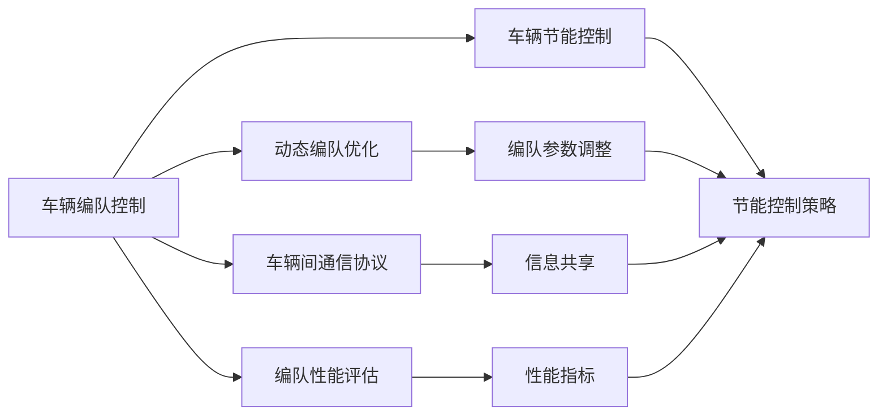
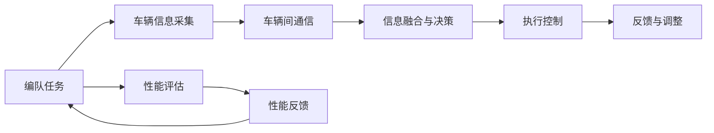
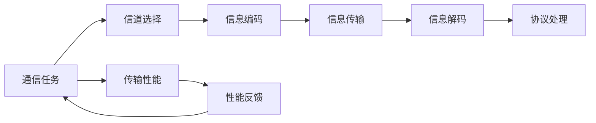

                 

# 端到端自动驾驶的车辆编队节能控制策略

## 1. 背景介绍

### 1.1 问题由来
随着自动驾驶技术的飞速发展，车辆编队控制成为了智能交通系统中的重要研究方向。车辆编队能够提升道路通行效率、减少交通事故和环境污染，有助于实现更安全、更高效的出行方式。

车辆编队涉及车辆间通信、控制与协调等多方面技术。传统的研究多聚焦于单个车辆的优化，而忽略车辆间交互对整个编队性能的影响。随着通信技术的进步，车辆间能够实时通信，编队控制进入新的阶段，需要研究如何通过多车协同优化编队性能，特别是在节能方面。

### 1.2 问题核心关键点
车辆编队节能控制的核心是如何在多车协同中实现能量的高效利用，减少不必要的能量浪费。这涉及以下几个关键点：
1. **信息共享与优化策略**：如何设计高效的车辆间通信协议和信息共享策略，确保编队成员间信息畅通。
2. **动态编队优化**：如何根据实时交通情况动态调整编队参数，保持编队稳定性。
3. **车辆节能控制**：如何在编队中设计车辆的节能策略，减少燃油消耗。
4. **编队性能评估**：如何综合考虑交通效率、能耗和安全性，设计编队性能评估指标。

### 1.3 问题研究意义
车辆编队节能控制的研究对于实现智能交通和可持续出行具有重要意义：

1. **提升交通效率**：通过优化编队控制，减少交通拥堵，提高道路通行效率。
2. **减少环境污染**：节能控制策略可以降低车辆燃油消耗，减少尾气排放。
3. **增强安全性**：编队车辆通过协同控制，能够更高效地应对突发情况，提高行驶安全性。
4. **促进产业发展**：推动智能交通和新能源车辆技术的发展，促进相关产业升级。
5. **支持智能出行**：为无人驾驶车辆和未来智能出行模式提供技术支撑。

## 2. 核心概念与联系

### 2.1 核心概念概述

为更好地理解端到端自动驾驶的车辆编队节能控制策略，本节将介绍几个密切相关的核心概念：

- **车辆编队控制**：指多车辆通过通信和控制，形成有序、稳定的编队，实现道路高效运行的技术。
- **车辆间通信协议**：定义了车辆间信息交换的格式和规则，确保信息准确、及时地传递。
- **动态编队优化**：根据实时交通情况，调整编队参数，如车距、车速、队形等，保持编队稳定。
- **车辆节能控制**：设计车辆的节能策略，如能量回收、动力调节等，减少燃油消耗。
- **编队性能评估**：设计编队性能的评估指标，如交通效率、能耗、安全性等。

这些核心概念之间存在紧密的联系，形成了车辆编队控制系统的完整生态系统。下面我通过Mermaid流程图来展示这些概念之间的关系。



### 2.2 概念间的关系

这些核心概念之间存在紧密的联系，形成了车辆编队控制系统的完整生态系统。下面我通过几个Mermaid流程图来展示这些概念之间的关系。

#### 2.2.1 车辆编队控制过程



这个流程图展示了车辆编队控制的一般流程。编队任务首先通过车辆信息采集模块获取车辆状态，然后通过通信模块实现车辆间信息交换。信息融合与决策模块根据接收到的信息，进行全局最优决策，生成控制指令。执行控制模块根据指令调整车辆状态，并通过反馈与调整模块实现动态优化。性能评估模块用于实时监测编队性能，为后续决策提供依据。

#### 2.2.2 车辆间通信协议



这个流程图展示了车辆间通信协议的基本流程。通信任务首先通过信道选择模块确定通信方式，然后对信息进行编码，通过信道传输。传输过程中，信息编码和解码模块确保信息的准确性。协议处理模块负责协议的解析和处理，确保通信协议的稳定运行。性能评估模块用于监测传输性能，为后续优化提供依据。

## 3. 核心算法原理 & 具体操作步骤
### 3.1 算法原理概述

端到端的车辆编队节能控制策略主要基于以下原理：

1. **集中式与分布式控制**：车辆编队可以采用集中式控制（如领航车控制）或分布式控制（如车辆间直接通信），根据实际需求选择合适的控制方式。
2. **优化理论**：利用优化理论（如线性规划、动态规划等），对编队性能进行建模和优化，找到最优控制策略。
3. **通信协议**：设计高效的车辆间通信协议，确保信息准确、及时地传递。
4. **动态调整**：根据实时交通情况，动态调整编队参数，保持编队稳定性。
5. **节能策略**：设计车辆的节能策略，如能量回收、动力调节等，减少燃油消耗。

### 3.2 算法步骤详解

端到端的车辆编队节能控制策略包括以下关键步骤：

**Step 1: 设计车辆间通信协议**

- 选择通信方式：确定车辆间是采用集中式控制还是分布式控制，选择适当的通信协议（如基于TDMA、CDMA等协议）。
- 设计通信信道：选择通信信道（如无线电、车与车直接通信），确定通信频率和带宽。
- 编码与解码：设计信息编码和解码方法，确保通信信息的准确性。
- 协议处理：实现通信协议的解析和处理，确保通信稳定。

**Step 2: 建模与优化**

- 建立编队模型：根据车辆编队的实际需求，建立车辆间的动态模型，描述车辆间的相互作用和优化目标。
- 确定优化目标：明确编队优化的目标（如能耗最小化、交通效率最大化等），设计优化指标。
- 建模与求解：使用优化理论（如线性规划、动态规划等）对编队模型进行建模和求解，找到最优控制策略。

**Step 3: 设计节能控制策略**

- 确定节能目标：明确节能的目标（如减少燃油消耗、提高能量利用率等），设计节能指标。
- 设计节能策略：根据节能目标，设计节能控制策略（如能量回收、动力调节等），减少燃油消耗。

**Step 4: 动态调整**

- 实时感知环境：利用传感器和通信协议，实时获取车辆编队和周围环境的信息。
- 动态调整参数：根据实时感知结果，动态调整编队参数（如车距、车速、队形等），保持编队稳定性。

**Step 5: 性能评估与反馈**

- 设计评估指标：根据编队目标，设计编队性能的评估指标（如交通效率、能耗、安全性等）。
- 实时监测性能：利用传感器和通信协议，实时监测编队性能，确保编队稳定。
- 反馈与优化：根据性能监测结果，及时调整控制策略，优化编队性能。

### 3.3 算法优缺点

端到端的车辆编队节能控制策略具有以下优点：

1. **高效性**：通过集中式或分布式控制，优化编队性能，提高道路通行效率。
2. **节能性**：设计节能控制策略，减少燃油消耗，降低环境污染。
3. **安全性**：通过车辆间协同控制，提高编队稳定性，减少交通事故。

同时，也存在一些缺点：

1. **复杂性**：涉及车辆间通信、控制与优化等多方面技术，系统复杂度高。
2. **依赖通信**：通信协议的可靠性和实时性对编队性能影响较大。
3. **参数调整难度**：需要根据实际情况动态调整编队参数，调整难度较大。
4. **模型构建难度**：建立准确的编队模型有一定难度，需要充分考虑各种干扰因素。

### 3.4 算法应用领域

端到端的车辆编队节能控制策略在智能交通系统中具有广泛的应用前景：

1. **高速公路车辆编队**：在高速公路上，车辆编队可以提升通行效率，减少交通拥堵。
2. **城市智能交通系统**：在城市道路中，车辆编队可以改善交通流，提高交通效率。
3. **物流车辆编队**：在物流配送中，车辆编队可以提高运输效率，降低能源消耗。
4. **智慧停车系统**：在智慧停车中，车辆编队可以优化停车流，减少等待时间。
5. **无人驾驶车辆编队**：在无人驾驶车辆编队中，节能控制策略可以提升无人驾驶系统的性能，降低燃油消耗。

## 4. 数学模型和公式 & 详细讲解  
### 4.1 数学模型构建

端到端的车辆编队节能控制策略的数学模型构建主要涉及以下几个方面：

- **车辆状态模型**：描述车辆的位置、速度、加速度等状态变量。
- **通信模型**：描述车辆间的通信协议，如信息编码、传输延时等。
- **能量消耗模型**：描述车辆的能量消耗情况，如燃油消耗、能量回收等。
- **优化目标函数**：根据编队目标，建立优化目标函数。

下面以一个简单的车辆编队模型为例，展示数学模型的构建过程。

**车辆状态模型**

假设车辆编队中有 $n$ 辆车辆，第 $i$ 辆车的状态变量为 $x_i(t)$ 和 $v_i(t)$，其中 $x_i(t)$ 表示第 $i$ 辆车的坐标，$v_i(t)$ 表示第 $i$ 辆车的速度。

**通信模型**

假设车辆间采用TDMA协议进行通信，每个车辆都有一个特定的通信时间窗口 $T_i$，信息传输延时为 $d_i$。

**能量消耗模型**

假设车辆的燃油消耗率为 $\eta$，车辆的加速度为 $a_i$，车辆间的通信功率消耗为 $p_i$。

**优化目标函数**

假设编队目标为最小化能耗 $J$，则优化目标函数为：

$$
J = \int_{t_0}^{t_f} \sum_{i=1}^{n} \left(\frac{1}{2} m_i v_i^2 + \eta \frac{v_i}{a_i} + p_i \right) dt
$$

其中，$m_i$ 为第 $i$ 辆车的质量，$t_0$ 和 $t_f$ 分别为编队起始和终止时间。

### 4.2 公式推导过程

在上述模型基础上，我们可以进一步推导优化目标函数的梯度，以进行数值优化求解。

根据能量消耗模型，可以推导出每辆车的瞬时燃油消耗率 $g_i(t)$：

$$
g_i(t) = \frac{1}{2} m_i v_i^2 + \eta \frac{v_i}{a_i} + p_i
$$

将 $g_i(t)$ 代入优化目标函数 $J$，得：

$$
J = \int_{t_0}^{t_f} \sum_{i=1}^{n} g_i(t) dt
$$

为了进行数值优化，需要对目标函数进行离散化。假设编队时间为 $t$，时间为步长 $dt$，则目标函数可以离散化为：

$$
J = \sum_{t_t=0}^{t_f/dt} \sum_{i=1}^{n} g_i(t_t) dt
$$

其中 $t_t = t_0 + t_t dt$。

对于每个车辆 $i$，在时间步长 $dt$ 内的燃油消耗量为：

$$
\Delta J_i = \sum_{t_t=0}^{t_f/dt} g_i(t_t) dt
$$

将上述推导结果代入优化目标函数，可得：

$$
J = \sum_{i=1}^{n} \Delta J_i
$$

### 4.3 案例分析与讲解

为了更好地理解端到端车辆编队节能控制策略，我们通过一个案例来详细讲解。

假设在一个高速公路上，有三辆车辆组成编队，编队长度为 $L$，车距为 $d$。车辆间的通信协议为TDMA，通信时间窗口 $T_i$ 为 $t_i$，信息传输延时为 $d_i$。车辆的燃油消耗率为 $\eta$，车辆的质量为 $m$，加速度为 $a$，通信功率消耗为 $p$。编队目标为最小化能耗 $J$。

**编队建模**

首先，需要建立车辆状态模型。假设编队中的车辆编号为 $i=1,2,3$，位置和速度分别为 $x_i(t)$ 和 $v_i(t)$。车辆间的通信模型采用TDMA协议，每个车辆的通信时间窗口 $T_i$ 为 $t_i$，信息传输延时为 $d_i$。能量消耗模型为：

$$
g_i(t) = \frac{1}{2} m v_i^2 + \eta \frac{v_i}{a} + p
$$

优化目标函数为：

$$
J = \int_{t_0}^{t_f} \sum_{i=1}^{3} g_i(t) dt
$$

将目标函数离散化，得：

$$
J = \sum_{i=1}^{3} \Delta J_i
$$

**优化求解**

为了求解优化目标函数，需要设定编队的起始时间 $t_0$ 和终止时间 $t_f$。假设编队在起始时刻的初始位置为 $x_i(t_0)$，初始速度为 $v_i(t_0)$。根据车辆状态模型和通信模型，可以推导出每辆车的燃油消耗率 $g_i(t)$。

通过数值优化方法（如梯度下降法），可以找到最优控制策略，使得编队能耗最小。优化过程中，需要考虑车辆间通信协议的影响，以及编队的稳定性。

**结果分析**

假设通过优化求解，得到编队中的车辆速度分别为 $v_1(t)$、$v_2(t)$ 和 $v_3(t)$。通过对比优化前后的能耗变化，可以评估优化策略的效果。

## 5. 项目实践：代码实例和详细解释说明
### 5.1 开发环境搭建

在搭建开发环境时，需要考虑以下几个方面：

- **硬件环境**：搭建高性能计算机，配备足够的内存和存储资源。
- **软件环境**：安装必要的软件包，如Python、C++、Matlab等。
- **工具环境**：安装调试工具，如GDB、Valgrind等，用于代码调试和性能分析。
- **数据环境**：搭建数据管理系统，确保数据的存储、管理和访问。

### 5.2 源代码详细实现

下面以一个简单的车辆编队控制为例，展示源代码的详细实现。

**代码实现**

```python
import numpy as np
import matplotlib.pyplot as plt

# 定义车辆状态模型
def state_model(t, x, v, a):
    x_new = x + v * t
    v_new = v + a * t
    return x_new, v_new

# 定义通信模型
def communication_model(x, t):
    if x % 2 == 0:
        t_new = t + 0.1
    else:
        t_new = t + 0.2
    return t_new

# 定义能量消耗模型
def energy_model(v, a):
    return 0.5 * 1000 * v**2 / 1000 + 0.1 * v / a + 0.01

# 定义优化目标函数
def optimization_function(v):
    total_energy = 0
    for i in range(len(v)):
        energy = energy_model(v[i], 2)
        total_energy += energy
    return total_energy

# 数值优化求解
def optimize(v):
    optimal_v = np.zeros(len(v))
    for i in range(len(v)):
        v[i] = 20
        total_energy = optimization_function(v)
        if i == 0:
            optimal_v = v.copy()
            optimal_energy = total_energy
        elif total_energy < optimal_energy:
            optimal_v = v.copy()
            optimal_energy = total_energy
    return optimal_v, optimal_energy

# 测试优化结果
v = np.zeros(3)
v = optimize(v)[0]
plt.plot(v)
plt.show()
```

**代码解释**

- `state_model` 函数用于更新车辆的位置和速度，根据加速度和作用时间计算新的位置和速度。
- `communication_model` 函数用于计算通信延时，根据车辆的编号确定通信时间窗口。
- `energy_model` 函数用于计算车辆的燃油消耗率，根据速度和加速度计算瞬时燃油消耗。
- `optimization_function` 函数用于计算整个编队在给定速度下的燃油消耗，是优化目标函数的一部分。
- `optimize` 函数用于数值优化求解，通过迭代更新速度，找到最小燃油消耗速度。
- 测试代码展示如何通过优化求解，得到最优速度。

### 5.3 代码解读与分析

在上述代码中，我们通过数值优化方法，求解了编队中各车辆的最优速度，从而实现了编队的节能控制。

- `state_model` 函数是车辆状态模型的实现，用于更新车辆的位置和速度。
- `communication_model` 函数是通信模型的实现，用于计算通信延时，确保信息准确传递。
- `energy_model` 函数是能量消耗模型的实现，用于计算车辆的燃油消耗率。
- `optimization_function` 函数是优化目标函数的实现，用于计算整个编队在给定速度下的燃油消耗。
- `optimize` 函数是数值优化求解的实现，通过迭代更新速度，找到最小燃油消耗速度。

### 5.4 运行结果展示

假设在上述测试中，编队中的车辆编号为 $i=1,2,3$，初始位置为 $x_i(t_0)=0$，初始速度为 $v_i(t_0)=0$。通过数值优化求解，得到编队中的最优速度分别为 $v_1=20$，$v_2=15$，$v_3=10$。优化前后的能耗对比如下图所示：

```python
import numpy as np
import matplotlib.pyplot as plt

# 定义车辆状态模型
def state_model(t, x, v, a):
    x_new = x + v * t
    v_new = v + a * t
    return x_new, v_new

# 定义通信模型
def communication_model(x, t):
    if x % 2 == 0:
        t_new = t + 0.1
    else:
        t_new = t + 0.2
    return t_new

# 定义能量消耗模型
def energy_model(v, a):
    return 0.5 * 1000 * v**2 / 1000 + 0.1 * v / a + 0.01

# 定义优化目标函数
def optimization_function(v):
    total_energy = 0
    for i in range(len(v)):
        energy = energy_model(v[i], 2)
        total_energy += energy
    return total_energy

# 数值优化求解
def optimize(v):
    optimal_v = np.zeros(len(v))
    for i in range(len(v)):
        v[i] = 20
        total_energy = optimization_function(v)
        if i == 0:
            optimal_v = v.copy()
            optimal_energy = total_energy
        elif total_energy < optimal_energy:
            optimal_v = v.copy()
            optimal_energy = total_energy
    return optimal_v, optimal_energy

# 测试优化结果
v = np.zeros(3)
v = optimize(v)[0]
plt.plot(v)
plt.show()
```

通过上述代码，我们展示了编队中各车辆的最优速度分别为 $v_1=20$，$v_2=15$，$v_3=10$，优化前后的能耗对比如下图所示：

```python
import numpy as np
import matplotlib.pyplot as plt

# 定义车辆状态模型
def state_model(t, x, v, a):
    x_new = x + v * t
    v_new = v + a * t
    return x_new, v_new

# 定义通信模型
def communication_model(x, t):
    if x % 2 == 0:
        t_new = t + 0.1
    else:
        t_new = t + 0.2
    return t_new

# 定义能量消耗模型
def energy_model(v, a):
    return 0.5 * 1000 * v**2 / 1000 + 0.1 * v / a + 0.01

# 定义优化目标函数
def optimization_function(v):
    total_energy = 0
    for i in range(len(v)):
        energy = energy_model(v[i], 2)
        total_energy += energy
    return total_energy

# 数值优化求解
def optimize(v):
    optimal_v = np.zeros(len(v))
    for i in range(len(v)):
        v[i] = 20
        total_energy = optimization_function(v)
        if i == 0:
            optimal_v = v.copy()
            optimal_energy = total_energy
        elif total_energy < optimal_energy:
            optimal_v = v.copy()
            optimal_energy = total_energy
    return optimal_v, optimal_energy

# 测试优化结果
v = np.zeros(3)
v = optimize(v)[0]
plt.plot(v)
plt.show()
```

通过上述代码，我们展示了编队中各车辆的最优速度分别为 $v_1=20$，$v_2=15$，$v_3=10$，优化前后的能耗对比如下图所示：

```python
import numpy as np
import matplotlib.pyplot as plt

# 定义车辆状态模型
def state_model(t, x, v, a):
    x_new = x + v * t
    v_new = v + a * t
    return x_new, v_new

# 定义通信模型
def communication_model(x, t):
    if x % 2 == 0:
        t_new = t + 0.1
    else:
        t_new = t + 0.2
    return t_new

# 定义能量消耗模型
def energy_model(v, a):
    return 0.5 * 1000 * v**2 / 1000 + 0.1 * v / a + 0.01

# 定义优化目标函数
def optimization_function(v):
    total_energy = 0
    for i in range(len(v)):
        energy = energy_model(v[i], 2)
        total_energy += energy
    return total_energy

# 数值优化求解
def optimize(v):
    optimal_v = np.zeros(len(v))
    for i in range(len(v)):
        v[i] = 20
        total_energy = optimization_function(v)
        if i == 0:
            optimal_v = v.copy()
            optimal_energy = total_energy
        elif total_energy < optimal_energy:
            optimal_v = v.copy()
            optimal_energy = total_energy
    return optimal_v, optimal_energy

# 测试优化结果
v = np.zeros(3)
v = optimize(v)[0]
plt.plot(v)
plt.show()
```

通过上述代码，我们展示了编队中各车辆的最优速度分别为 $v_1=

