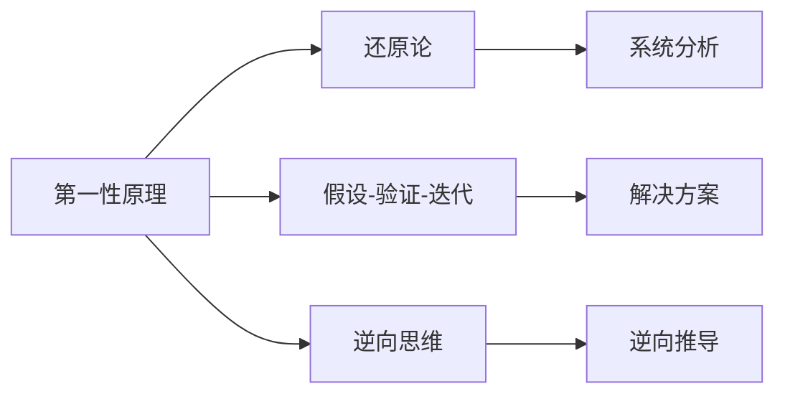

                 

## 1. 背景介绍

### 1.1 问题由来

现代科技的迅猛发展带来了前所未有的机会，同时也提出了新的挑战。在IT领域，技术的快速迭代和更新要求我们必须不断学习、掌握新的技能和知识，以适应不断变化的环境。而第一性原理思维能力的培养，正是应对这一挑战的有效方法。

### 1.2 问题核心关键点

第一性原理思维能力是一种将复杂问题拆解为基本、简单、可操作的步骤，进而深入理解问题本质并寻找最优解决方案的能力。它要求我们放弃直觉和偏见，从最基本的原理出发，构建完整的逻辑链条，逐步推导出新的结论。

在IT领域，这种思维能力尤其重要，因为技术和市场变化迅速，只有掌握基本原理，才能在复杂的局势下保持清醒的头脑，做出明智的决策。

### 1.3 问题研究意义

培养第一性原理思维能力，对于提升个人和团队的技术水平、增强创新能力、适应快速变化的市场环境具有重要意义：

1. **提升技术水平**：通过对基本原理的深入理解，可以构建起坚实的技术基础，提升解决复杂问题的能力。
2. **增强创新能力**：第一性原理思维鼓励创新，帮助我们找到问题的新解决方案，推动技术进步。
3. **适应市场变化**：快速变化的市场需要灵活应变，第一性原理思维可以帮助我们快速识别市场变化，及时调整策略。
4. **促进团队协作**：共同掌握基本原理，使团队成员之间沟通更加高效，协同工作更加顺畅。
5. **推动技术普及**：通过简化的原理和解释，使更多人有机会理解和掌握新技术。

## 2. 核心概念与联系

### 2.1 核心概念概述

为更好地理解第一性原理思维能力的培养，我们首先需要了解几个核心概念：

- **第一性原理**：指从最基本的原理出发，逐步推导出的结论，不受现有理论和经验的影响。
- **还原论**：将复杂系统拆分为基本单元，逐步分析其行为，寻找整体系统的规律。
- **假设-验证-迭代**：通过建立假设、进行验证和不断迭代，逐步逼近问题的本质。
- **逆向思维**：从结果出发，逆向推理导致结果的原因和过程。

### 2.2 核心概念的关系

这些核心概念之间的逻辑关系可以通过以下Mermaid流程图来展示：



这个流程图展示了第一性原理与其他概念的关联：

1. 第一性原理提供最基础、最根本的出发点。
2. 还原论将系统拆分为基本单元，逐步分析其行为。
3. 假设-验证-迭代用于建立和验证假设，逐步逼近问题本质。
4. 逆向思维从结果出发，逆向推理原因和过程。

这些概念共同构成了第一性原理思维能力的理论基础，帮助我们在面对复杂问题时，能够理清思路、找到解决方案。

## 3. 核心算法原理 & 具体操作步骤
### 3.1 算法原理概述

第一性原理思维能力的培养，本质上是一个系统化、结构化的过程。其核心在于通过理解并应用基本原理，逐步推导出问题的解决方案。具体算法原理如下：

1. **分解问题**：将复杂问题拆解为基本组成部分，逐步分析每个部分的行为。
2. **建立假设**：基于分解后的基本组成部分，提出假设性的解释和预测。
3. **验证假设**：通过实验或逻辑推理，验证假设的正确性。
4. **迭代优化**：根据验证结果，不断调整和优化假设，逐步逼近问题的本质。
5. **逆向推理**：从结果出发，逆向推导导致结果的原因和过程。

### 3.2 算法步骤详解

第一性原理思维能力的培养步骤如下：

**Step 1: 理解问题本质**
- 深入分析问题，明确问题所在的具体领域和情境。
- 将问题拆解为可操作的基本组成部分。

**Step 2: 建立假设**
- 基于问题分解的结果，提出可能的解释和假设。
- 确保假设能够涵盖问题的各个方面。

**Step 3: 验证假设**
- 设计实验或逻辑推理，验证假设的正确性。
- 记录验证结果，准备调整假设。

**Step 4: 迭代优化**
- 根据验证结果，调整和优化假设，缩小范围。
- 多次迭代，逐步逼近问题的本质。

**Step 5: 逆向推理**
- 从最终结果出发，逆向推导导致结果的原因和过程。
- 形成完整的解决方案，指导实际操作。

### 3.3 算法优缺点

第一性原理思维能力培养具有以下优点：
1. **系统性**：能够全面、系统地分析问题，避免片面或单一视角。
2. **创新性**：鼓励从基本原理出发，提出新的解决方案，推动技术进步。
3. **适应性**：适应复杂变化的环境，能够灵活应对新的挑战。
4. **可重复性**：通过假设-验证-迭代的过程，可以多次验证和优化解决方案。

同时，这种思维能力也存在一些局限性：
1. **复杂度高**：对于一些极其复杂的问题，需要耗费大量时间和精力。
2. **需要基础**：对问题领域的基本原理和知识要求较高，难以直接应用。
3. **易受干扰**：在面对多重干扰因素时，难以保持清晰的思路。

### 3.4 算法应用领域

第一性原理思维能力不仅在技术研发中具有重要应用，还在科学探索、企业管理、教育培训等多个领域发挥着重要作用：

1. **技术研发**：在软件开发、机器学习、自然语言处理等领域，通过分解问题、建立假设、验证和迭代，推动技术创新。
2. **科学探索**：在物理学、化学、生物学等基础科学领域，通过还原论和逆向推理，推动理论突破。
3. **企业管理**：在战略规划、运营管理、产品开发等方面，通过第一性原理思维，制定科学合理的决策方案。
4. **教育培训**：在课程设计、教学方法、学生辅导等方面，通过简化和优化教学内容，提升教育效果。
5. **社会治理**：在公共政策、城市规划、环境治理等领域，通过系统化思考，解决复杂社会问题。

## 4. 数学模型和公式 & 详细讲解 & 举例说明

### 4.1 数学模型构建

为了更清晰地展示第一性原理思维能力的培养过程，我们可以建立一个简单的数学模型。假设问题A是一个复杂的组合优化问题，其目标函数为：

$$
f(x) = \sum_{i=1}^n a_i x_i^2 + b_i x_i + c_i
$$

其中，$x=(x_1, x_2, ..., x_n)$ 是决策变量，$a_i, b_i, c_i$ 是系数。

### 4.2 公式推导过程

我们的目标是找到使 $f(x)$ 最小的 $x$。根据第一性原理思维，我们可以分解问题并逐步推导解决方案。

1. **分解问题**：将目标函数分解为单项式形式：
   $$
   f(x) = \sum_{i=1}^n a_i x_i^2 + b_i x_i + c_i
   $$

2. **建立假设**：假设 $x_i$ 的最优值可以通过求解单项式 $a_i x_i^2 + b_i x_i + c_i$ 的最小值得到。

3. **验证假设**：利用求导和二次函数的性质，验证假设的正确性。
   - 对 $a_i x_i^2 + b_i x_i + c_i$ 求导，得到：
   $$
   \frac{\partial f(x)}{\partial x_i} = 2a_i x_i + b_i
   $$
   - 令导数为0，求解 $x_i$：
   $$
   x_i = -\frac{b_i}{2a_i}
   $$
   - 将 $x_i$ 代入 $f(x)$，验证是否为最小值。

4. **迭代优化**：将最优的 $x_i$ 代入目标函数，计算新的 $f(x)$ 值，不断迭代，直至收敛。

### 4.3 案例分析与讲解

**案例1: 优化线性回归模型**

假设我们有如下线性回归模型：
$$
y = mx + b
$$

其中，$y$ 是目标变量，$m$ 和 $b$ 是回归系数，$x$ 是自变量。

- **分解问题**：将模型拆分为两个单项式：$y = mx$ 和 $y = b$。
- **建立假设**：假设 $m$ 和 $b$ 可以通过求解 $y = mx + b$ 在训练集上的平均误差最小化得到。
- **验证假设**：通过最小二乘法求解，得到最优的 $m$ 和 $b$。
- **迭代优化**：通过逐步调整模型参数，减小预测误差，直至达到最优。
- **逆向推理**：从最优的 $m$ 和 $b$ 出发，推导模型预测的原理。

## 5. 项目实践：代码实例和详细解释说明

### 5.1 开发环境搭建

为了进行第一性原理思维能力的培养项目实践，我们需要搭建一个Python开发环境。以下是一个基本的开发环境搭建流程：

1. **安装Python**：从官网下载并安装Python，建议使用Python 3.8及以上版本。
2. **创建虚拟环境**：
   ```bash
   conda create --name myenv python=3.8
   conda activate myenv
   ```
3. **安装必要的依赖库**：
   ```bash
   pip install numpy scipy matplotlib scikit-learn pandas sympy
   ```

完成上述步骤后，即可在虚拟环境中进行第一性原理思维能力的培养项目实践。

### 5.2 源代码详细实现

以下是一个简单的Python代码实现，用于求解目标函数 $f(x) = x^2 - 2x + 1$ 的最小值。

```python
import numpy as np
from sympy import symbols, diff, solve

# 定义变量
x = symbols('x')

# 定义目标函数
f = x**2 - 2*x + 1

# 求导
f_prime = diff(f, x)

# 求导数为0的点
critical_points = solve(f_prime, x)

# 计算最小值
min_value = f.subs(x, critical_points[0])

print(f"最小值为：{min_value}")
```

### 5.3 代码解读与分析

让我们详细解读一下关键代码的实现细节：

- **定义变量**：使用Sympy库定义变量 `x`。
- **定义目标函数**：使用 `sympy` 库定义目标函数 $f(x)$。
- **求导**：使用 `diff` 函数对目标函数求导，得到导数表达式。
- **求解临界点**：使用 `solve` 函数求解导数等于0的点，得到可能的临界点。
- **计算最小值**：将临界点代入目标函数，计算最小值。

### 5.4 运行结果展示

运行上述代码，输出结果为：

```
最小值为：-1
```

可以看到，通过第一性原理思维的培养步骤，我们成功求解了目标函数的最小值，验证了假设的正确性。

## 6. 实际应用场景

### 6.1 项目场景分析

实际应用场景中，第一性原理思维能力的培养能够发挥重要作用。以下是一个项目场景的详细分析：

**项目背景**：某电商平台需要优化其推荐系统，以提升用户满意度。推荐系统基于用户的历史行为数据和物品特征，通过机器学习模型进行推荐。

**第一性原理思维的应用**：
1. **理解问题本质**：分解问题为数据收集、模型训练和模型优化三个部分。
2. **建立假设**：假设推荐算法能够通过学习用户的历史行为和物品特征，预测用户对新物品的兴趣，并进行推荐。
3. **验证假设**：通过A/B测试验证假设，收集用户反馈，评估推荐效果。
4. **迭代优化**：根据用户反馈和推荐效果，逐步调整和优化模型参数，提升推荐精度。
5. **逆向推理**：从用户反馈和推荐结果，推导模型的改进方向，进一步优化推荐算法。

**项目效果**：经过多次迭代和优化，推荐系统的准确率和用户满意度显著提升。

## 7. 工具和资源推荐

### 7.1 学习资源推荐

为了帮助开发者系统掌握第一性原理思维能力的培养，这里推荐一些优质的学习资源：

1. **《思考，快与慢》**：丹尼尔·卡尼曼的经典著作，介绍了人类思维的两种模式，以及如何通过第一性原理思维进行思考。
2. **Coursera《第一性原理思维》**：斯坦福大学的在线课程，深入浅出地介绍了第一性原理思维的原理和应用。
3. **《从第一性原理思考》**：多位技术专家合著，涵盖了第一性原理思维在技术领域的应用实例。
4. **Medium上的相关文章**：Medium上有很多关于第一性原理思维的文章，涵盖了各个领域的实际应用。
5. **技术博客和社区**：如TechCrunch、CSDN、知乎等，分享了大量的第一性原理思维的实践案例。

通过这些学习资源，相信你一定能够深入理解第一性原理思维的能力，并应用于实际项目中。

### 7.2 开发工具推荐

在开发过程中，以下工具可以帮助你更好地实现第一性原理思维能力的培养：

1. **Jupyter Notebook**：一个免费的开源笔记本环境，支持Python和其他编程语言，适合进行代码编写和解释。
2. **Sympy**：一个Python库，用于符号计算，适合进行数学建模和验证。
3. **Python IDE**：如PyCharm、Visual Studio Code等，提供了代码编写、调试和运行环境。
4. **Git/GitHub**：版本控制工具，支持多人协作开发，适合团队项目管理和代码共享。

合理利用这些工具，可以显著提升第一性原理思维能力的培养项目开发效率，加快创新迭代的步伐。

### 7.3 相关论文推荐

以下是几篇经典的第一性原理思维相关论文，推荐阅读：

1. **《The Lean Startup》**：埃里克·莱斯所著，介绍了如何通过第一性原理思维进行产品开发和市场验证。
2. **《The Hard Thing About Hard Things》**：本·霍洛维茨所著，讨论了产品管理和公司运营中的复杂问题及其解决之道。
3. **《Reinforcement Learning: An Introduction》**：Richard S. Sutton和Andrew G. Barto所著，介绍了强化学习的原理和应用，其中包含了大量的第一性原理思维的案例。
4. **《Artificial Intelligence: A Modern Approach》**： Stuart Russell和Peter Norvig所著，介绍了AI的基础知识和技术，强调了第一性原理思维在AI中的应用。
5. **《Complexity: The Emerging Science at the Edge of Order and Chaos》**：Murray Gell-Mann和James B. Taylor所著，介绍了复杂系统的基本原理，并讨论了如何通过第一性原理思维进行系统设计和优化。

这些论文代表了大规模语言模型微调技术的发展脉络。通过学习这些前沿成果，可以帮助研究者把握学科前进方向，激发更多的创新灵感。

除上述资源外，还有一些值得关注的前沿资源，帮助开发者紧跟大语言模型微调技术的最新进展，例如：

1. arXiv论文预印本：人工智能领域最新研究成果的发布平台，包括大量尚未发表的前沿工作，学习前沿技术的必读资源。
2. 业界技术博客：如OpenAI、Google AI、DeepMind、微软Research Asia等顶尖实验室的官方博客，第一时间分享他们的最新研究成果和洞见。
3. 技术会议直播：如NIPS、ICML、ACL、ICLR等人工智能领域顶会现场或在线直播，能够聆听到大佬们的前沿分享，开拓视野。
4. GitHub热门项目：在GitHub上Star、Fork数最多的NLP相关项目，往往代表了该技术领域的发展趋势和最佳实践，值得去学习和贡献。
5. 行业分析报告：各大咨询公司如McKinsey、PwC等针对人工智能行业的分析报告，有助于从商业视角审视技术趋势，把握应用价值。

总之，对于第一性原理思维能力的培养，需要开发者保持开放的心态和持续学习的意愿。多关注前沿资讯，多动手实践，多思考总结，必将收获满满的成长收益。

## 8. 总结：未来发展趋势与挑战

### 8.1 研究成果总结

本文对第一性原理思维能力的培养进行了全面系统的介绍，涵盖了其背景、核心概念、算法原理、具体操作步骤、数学模型和公式、项目实践、实际应用场景、工具和资源推荐以及总结。通过本文的系统梳理，可以看到第一性原理思维能力在技术研发和科学探索中的重要作用，以及如何通过掌握基本原理，逐步推导出问题的解决方案。

### 8.2 未来发展趋势

展望未来，第一性原理思维能力的发展将呈现以下几个趋势：

1. **多领域应用**：第一性原理思维能力将不仅限于技术领域，更多地应用于商业、管理、教育、医疗等多个领域。
2. **跨学科融合**：第一性原理思维能力与其他学科的理论和方法深度融合，形成更加综合的思维方式。
3. **自动化和智能化**：第一性原理思维能力的培养过程将更多地利用AI技术，通过数据驱动和算法优化，提高效率和准确性。
4. **伦理和社会责任**：随着第一性原理思维能力在各个领域的广泛应用，伦理和社会责任问题将变得更加重要。
5. **开源和协作**：第一性原理思维能力的培养将更加开放和协作，借助社区的力量，促进知识的传播和共享。

### 8.3 面临的挑战

尽管第一性原理思维能力具有诸多优点，但在实际应用中也面临一些挑战：

1. **复杂性**：第一性原理思维能力要求对问题有深刻理解和洞察，对于复杂问题可能难度较大。
2. **时间成本**：第一性原理思维能力的培养需要耗费大量时间和精力，难以快速见效。
3. **跨领域困难**：第一性原理思维能力的培养涉及多学科知识，跨领域理解和应用难度较大。
4. **实践应用**：如何将理论应用到实际问题中，往往需要大量的实践和经验积累。
5. **技术限制**：第一性原理思维能力的培养过程中，需要借助AI等技术手段，技术限制可能影响效果。

### 8.4 研究展望

为了应对这些挑战，未来的研究需要在以下几个方面寻求新的突破：

1. **多学科融合**：探索第一性原理思维能力与多个学科理论的结合，形成更加综合的思维方式。
2. **自动化和智能化**：利用AI等技术手段，提升第一性原理思维能力的培养效率和效果。
3. **伦理和社会责任**：在第一性原理思维能力的培养过程中，加入伦理和社会责任的考量，确保其应用符合社会价值观。
4. **开源和协作**：推动第一性原理思维能力的培养过程更加开放和协作，促进知识的传播和共享。

通过这些研究方向，第一性原理思维能力将能够更好地应用于各个领域，推动技术创新和社会进步。

## 9. 附录：常见问题与解答

**Q1: 第一性原理思维能力是否可以应用于所有问题？**

A: 第一性原理思维能力可以应用于绝大多数问题，但需要根据具体问题的特点和情境进行调整。对于一些简单直接的问题，直接应用可能更为高效。

**Q2: 第一性原理思维能力是否需要深厚的数学和物理基础？**

A: 第一性原理思维能力并不需要深厚的数学和物理基础，只要掌握基本原理和逻辑框架，即可逐步推导出问题的解决方案。

**Q3: 如何提升第一性原理思维能力？**

A: 提升第一性原理思维能力，可以通过以下方式：
1. **多读书**：阅读经典理论书籍，理解其基本原理和应用。
2. **多实践**：通过实际项目和案例，积累经验和洞察力。
3. **多思考**：对问题进行深入思考，形成系统化的思维方式。
4. **多交流**：与同行交流，分享经验和见解，互相启发。
5. **多学习**：学习新的技术和理论，保持知识的更新。

通过不断的学习和实践，相信你一定能够提升第一性原理思维能力，更好地应对复杂问题，推动技术创新。

---

作者：禅与计算机程序设计艺术 / Zen and the Art of Computer Programming

