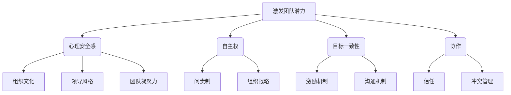

# 管理艺术：激发团队潜力

## 1. 背景介绍

### 1.1 问题的由来

在当今瞬息万变的商业环境中，组织面临着前所未有的挑战。全球化、技术革新和不断变化的客户需求使得企业必须保持灵活性和适应性。然而,许多组织仍然依赖着传统的管理模式,这种模式往往会阻碍创新、限制员工潜能的发挥,并降低组织的整体效率。

因此,如何有效管理和激发团队潜力,成为当前企业家和管理者亟需解决的关键问题。传统的命令控制型管理方式已经无法满足现代组织的需求,而新兴的管理理念和实践则为团队潜能的释放提供了新的契机。

### 1.2 研究现状

近年来,学术界和实践界对于如何激发团队潜力展开了广泛的研究和探索。一些著名的管理理论和框架应运而生,如精益管理(Lean Management)、敏捷管理(Agile Management)、设计思维(Design Thinking)等,它们为管理者提供了全新的视角和工具。

同时,一些先进的组织也在实践中探索出了激发团队潜力的有效方法,如谷歌的"20%时间"(20% Time)、zappos的"全力去伪"(Teal Organization)等,这些实践为其他组织树立了可资借鉴的范例。

### 1.3 研究意义

激发团队潜力不仅关乎组织的生存和发展,更是实现个人价值和自我实现的重要途径。通过有效的管理实践,员工可以充分发挥自身的创造力、主动性和责任心,从而获得更大的工作满足感和成就感。同时,组织也能凭借团队的创新活力和高效协作,在激烈的市场竞争中占据优势。

因此,研究如何激发团队潜力,对于企业家、管理者、员工乃至整个社会,都具有重要的理论意义和实践价值。

### 1.4 本文结构

本文将从管理艺术的角度出发,系统地探讨如何激发团队潜力。全文共分为八个部分:

1. 背景介绍
2. 核心概念与联系
3. 核心算法原理与具体操作步骤
4. 数学模型和公式详细讲解与举例说明
5. 项目实践:代码实例和详细解释说明
6. 实际应用场景
7. 工具和资源推荐
8. 总结:未来发展趋势与挑战

## 2. 核心概念与联系

激发团队潜力是一个涉及多个层面的系统性挑战,需要从组织文化、领导力、激励机制、协作方式等多个维度着手。下面将介绍几个核心概念及其内在联系:

1. **心理安全感(Psychological Safety)**
   - 定义:一种员工可以在团队中自在地提出问题、分享想法、承认错误而不用担心受到惩罚或被贬低的信任氛围。
   - 重要性:心理安全感是激发创新和协作的前提,它能够消除员工的恐惧心理,促进思维的开放性和包容性。
   - 与其他概念的联系:心理安全感与组织文化、领导风格、团队凝聚力等密切相关。

2. **自主权(Autonomy)**
   - 定义:员工在工作中拥有自主决策权,可以自行决定如何完成任务,并对结果负责。
   - 重要性:自主权能够激发员工的主人翁意识,提高工作投入度和创造力。
   - 与其他概念的联系:自主权需要与问责制(Accountability)相结合,并受制于组织的总体战略目标。

3. **目标一致性(Goal Alignment)**
   - 定义:团队成员对组织目标和个人目标的认同程度,以及这两类目标之间的一致性。
   - 重要性:目标一致性能够确保团队成员朝着同一方向努力,促进资源的高效利用。
   - 与其他概念的联系:目标一致性与激励机制、沟通机制等密切相关。

4. **协作(Collaboration)**
   - 定义:团队成员之间的互助合作,通过分工协作完成共同的目标。
   - 重要性:协作是实现团队绩效的关键,它能够发挥团队的整体合力,产生1+1>2的效果。
   - 与其他概念的联系:协作与沟通、信任、冲突管理等密切相关。

这些核心概念相互影响、相互作用,共同构建了激发团队潜力的理论框架。管理者需要全面把控这些要素,才能真正释放团队的创造活力。

## 3. 核心算法原理与具体操作步骤

### 3.1 算法原理概述

激发团队潜力的核心算法原理可以概括为"EPIC"模型,它包括四个关键步骤:

1. **Empowerment(赋能)**:赋予员工足够的自主权,让他们参与决策,并为完成工作提供必要的资源和支持。

2. **Psychological Safety(心理安全)**:营造一种开放、包容、互信的组织氛围,消除员工的恐惧心理,鼓励他们大胆提出想法和质疑。

3. **Incentive Alignment(激励一致)**:将组织目标与个人目标相结合,设计出有效的激励机制,确保员工的行为与组织目标保持一致。

4. **Collaboration(协作)**:促进跨部门、跨团队的协作,打破信息孤岛,实现资源的高效整合和利用。

这四个步骤环环相扣,相互影响,需要有机结合,才能真正释放团队的创造潜能。

### 3.2 算法步骤详解

1. **Empowerment(赋能)**
   - 明确授权:管理者需要明确界定员工的决策权限,避免权责不清导致的混乱。
   - 提供资源:为员工提供完成工作所需的资源,包括时间、金钱、设备等。
   - 培训支持:对员工进行必要的培训,提升其胜任工作的能力。
   - 信任监督:给予员工足够的信任,但也要有适度的监督,防止滥用职权。

2. **Psychological Safety(心理安全)**
   - 领导示范:管理者要以身作则,营造包容、友善的氛围,鼓励不同声音。
   - 反馈机制:建立畅通的反馈渠道,让员工可以安全地提出疑虑和建议。
   - 错误容忍:对员工的失误持开放和宽容的态度,将其视为学习的机会。
   - 多元融合:尊重不同的文化背景和观点,促进多元化和包容性。

3. **Incentive Alignment(激励一致)**
   - 目标分解:将组织目标分解为可衡量的个人或团队目标。
   - 激励措施:根据目标完成情况,设计合理的奖惩机制,如薪酬、晋升等。
   - 持续沟通:与员工保持良好的双向沟通,及时调整目标和激励政策。
   - 公平公正:确保激励措施的公平性和透明度,避免引起不满。

4. **Collaboration(协作)**
   - 信息共享:建立高效的信息共享机制,打破部门和团队之间的壁垒。
   - 跨界合作:鼓励不同部门、不同团队之间的合作,实现资源整合。
   - 冲突管理:妥善处理由于观点分歧而产生的冲突,促进相互理解。
   - 协作工具:采用先进的协作工具,如在线协作平台、即时通讯工具等。

### 3.3 算法优缺点

**优点**:

- 全面性:该算法从多个维度入手,能够系统地激发团队潜力。
- 实用性:算法步骤清晰,操作性强,易于在实践中执行。
- 灵活性:可根据具体情况对步骤进行调整,具有一定的适应性。
- 持续性:强调持续改进,可以随着环境变化而不断优化。

**缺点**:

- 复杂性:涉及多个要素,实施过程相对复杂,需要付出大量的努力。
- 时间成本:从建立信任到形成新文化需要一个较长的过程。
- 阻力存在:改变现状往往会遇到组织内部的惯性和阻力。
- 依赖领导:算法的成功在很大程度上依赖于领导者的意识和决心。

### 3.4 算法应用领域

激发团队潜力的"EPIC"算法可以应用于各种类型的组织,包括:

- 科技公司:需要不断创新以保持竞争力。
- 制造业:要求高效协作以提高生产效率。
- 服务业:员工的主动性和创造力直接影响服务质量。
- 政府机构:提高公众服务水平和决策效率。
- 非营利组织:有限的资源需要高度协作来完成使命。

该算法不仅适用于整个组织层面,也可以应用于团队或部门层面,帮助解决特定的管理问题。总之,只要存在人员协作的场景,都可以考虑采用这一算法。

## 4. 数学模型和公式详细讲解与举例说明

### 4.1 数学模型构建

为了量化分析团队潜力的发挥程度,我们可以构建一个数学模型。假设一个团队有n个成员,我们定义以下变量:

- $x_i$: 第i个成员的潜力发挥程度,取值范围[0,1]
- $w_i$: 第i个成员的权重,反映其在团队中的重要性
- $y$: 整个团队的潜力发挥程度

我们可以将团队潜力发挥程度$y$建模为成员潜力发挥程度的加权平均:

$$y = \sum_{i=1}^{n}w_i x_i$$

其中$\sum_{i=1}^{n}w_i=1$

这个模型的基本思想是:团队的整体潜力来自于每个成员潜力的叠加,但不同成员对团队的贡献程度不同,因此需要给予不同的权重。

### 4.2 公式推导过程

我们将"EPIC"算法中的四个步骤对应为四个影响因子,分别为:

- $e$:赋能程度
- $p$:心理安全感
- $a$:激励一致性
- $c$:协作程度

则每个成员的潜力发挥程度$x_i$可以表示为:

$$x_i = f(e_i,p_i,a_i,c_i)$$

其中$f$是一个综合函数,反映了四个影响因子对潜力发挥程度的综合作用。

为了简化模型,我们假设$f$是一个线性函数:

$$x_i = \alpha e_i + \beta p_i + \gamma a_i + \delta c_i$$

将其代入团队潜力发挥程度的公式,我们得到:

$$y = \sum_{i=1}^{n}w_i(\alpha e_i + \beta p_i + \gamma a_i + \delta c_i)$$

对于给定的团队,可以通过评估和调整$e_i,p_i,a_i,c_i$的值来最大化$y$,即提高整个团队的潜力发挥程度。

### 4.3 案例分析与讲解

假设一个5人小团队,成员的权重分别为$w_1=0.3,w_2=0.25,w_3=0.2,w_4=0.15,w_5=0.1$,他们当前的影响因子值如下:

| 成员 | $e_i$ | $p_i$ | $a_i$ | $c_i$ |
|------|-------|-------|-------|-------|
| 1    | 0.7   | 0.6   | 0.8   | 0.5   |
| 2    | 0.6   | 0.7   | 0.6   | 0.7   |
| 3    | 0.5   | 0.5   | 0.7   | 0.6   |
| 4    | 0.8