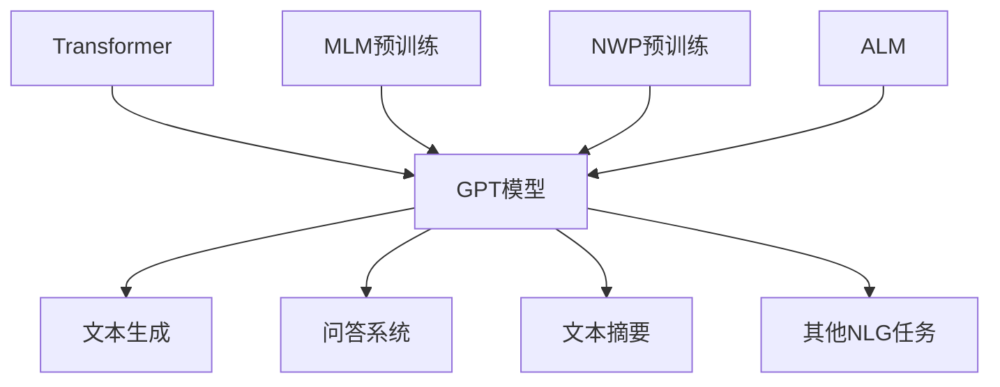

# 芳林新叶催陈叶：训练出你的简版生成式GPT

## 1. 背景介绍

### 1.1 问题的由来

在过去的几年里,自然语言处理(NLP)领域取得了令人瞩目的进展。其中,生成式预训练转换器(Generative Pre-trained Transformer,GPT)模型因其强大的文本生成能力而备受关注。GPT模型通过在大规模语料库上进行预训练,学习到了丰富的语言知识,可以生成看似人类水平的连贯、流畅的文本。

然而,训练一个大型的GPT模型需要耗费大量的计算资源,对于个人开发者或中小型企业来说,成本往往是一个巨大的障碍。因此,如何在有限的资源条件下训练出一个"简版"的生成式GPT模型,成为了一个具有挑战性的问题。

### 1.2 研究现状

目前,已有一些研究人员和开发者尝试通过各种技术手段来简化GPT模型的训练过程。例如,一些研究使用模型压缩、知识蒸馏等技术来缩小模型的规模,减少计算和存储开销。另一些研究则关注于优化训练策略,如采用更高效的优化器、调整超参数等,以提高训练效率。

然而,这些方法大多还停留在理论探索或实验室阶段,距离真正的工程实践还有一定差距。因此,如何将这些技术有机结合,并将其应用于实际的模型训练过程,是一个亟待解决的问题。

### 1.3 研究意义

训练一个简版的生成式GPT模型不仅能够满足个人开发者和中小型企业的需求,还可以为大型模型的训练提供有益的参考。通过研究简化模型训练的技术路线,我们可以更好地理解模型训练的本质,找到提高效率的关键点,从而为未来的模型优化提供新的思路。

此外,简版GPT模型也可以作为一个很好的教学资源,帮助学生和初学者更好地理解生成式模型的原理和训练过程。通过亲自动手训练一个简单的模型,学习者可以加深对模型内部机制的理解,为将来学习更复杂的模型打下坚实的基础。

### 1.4 本文结构

本文将详细介绍如何训练一个简版的生成式GPT模型。我们将从模型的基本原理出发,逐步探讨各个环节的实现细节,包括数据预处理、模型架构设计、训练策略优化等。同时,我们也会分享一些实用的技巧和工具,帮助读者更高效地完成模型训练。

在正文部分,我们将按照以下结构展开讨论:

1. 背景介绍
2. 核心概念与联系
3. 核心算法原理与具体操作步骤
4. 数学模型和公式详细讲解与举例说明
5. 项目实践:代码实例和详细解释说明
6. 实际应用场景
7. 工具和资源推荐
8. 总结:未来发展趋势与挑战
9. 附录:常见问题与解答

通过本文,我们希望读者能够全面掌握训练简版GPT模型的方法,并激发大家对这一领域的进一步探索和创新。

## 2. 核心概念与联系

在深入探讨GPT模型的训练细节之前,我们有必要先了解一些核心概念,为后续的讨论打下基础。

GPT模型属于自然语言生成(Natural Language Generation,NLG)任务的一种,其目标是根据给定的文本上下文,生成连贯、流畅的新文本。与此相对的是自然语言理解(Natural Language Understanding,NLU)任务,旨在让机器理解人类语言的含义。

GPT模型的核心是基于Transformer的序列到序列(Seq2Seq)架构。Transformer是一种全新的基于注意力机制(Attention Mechanism)的神经网络模型,可以有效地捕捉序列数据中的长程依赖关系。相比传统的循环神经网络(RNN)和长短期记忆网络(LSTM),Transformer具有更好的并行性能,在处理长序列时也更加高效。

在Transformer的基础上,GPT模型引入了掩码语言模型(Masked Language Model,MLM)的预训练策略。MLM通过在输入序列中随机掩蔽部分单词,并让模型预测被掩蔽的单词,从而学习到丰富的语言知识。预训练后的GPT模型可以进一步微调,应用于各种下游任务,如文本生成、问答系统、文本摘要等。

除了MLM,GPT模型还采用了下一个单词预测(Next Word Prediction,NWP)的辅助目标。NWP要求模型根据前面的文本,预测下一个最可能出现的单词。通过同时优化MLM和NWP两个目标,GPT模型可以更好地捕捉语言的双向上下文信息,提高生成质量。

另一个与GPT模型密切相关的概念是自回归语言模型(Autoregressive Language Model,ALM)。ALM是一种基于概率的语言模型,它通过计算给定前缀下一个单词的条件概率,从而生成新的文本序列。GPT模型实际上就是一种特殊的ALM,它利用Transformer的编码器-解码器架构,在编码器端学习语言的上下文表示,在解码器端生成新的单词序列。

总的来说,GPT模型融合了Transformer、MLM、NWP和ALM等多种技术,构建了一个强大的文本生成框架。通过预训练和微调,GPT模型可以在各种NLG任务上发挥出色的表现。



## 3. 核心算法原理与具体操作步骤

### 3.1 算法原理概述

GPT模型的核心算法原理可以概括为以下几个关键步骤:

1. **数据预处理**: 将原始文本数据转换为模型可以接受的格式,包括分词、词典构建、填充等操作。

2. **模型架构构建**: 根据Transformer的编码器-解码器架构,搭建GPT模型的网络结构,包括embedding层、多头注意力层、前馈神经网络层等。

3. **MLM预训练**: 在大规模语料库上进行掩码语言模型(MLM)预训练,让模型学习到丰富的语言知识。

4. **NWP预训练**: 结合下一个单词预测(NWP)的辅助目标,进一步优化模型的语言生成能力。

5. **微调阶段**: 根据具体的下游任务,对预训练模型进行微调,使其适应特定的应用场景。

6. **生成阶段**: 利用微调后的模型,基于给定的文本上下文,生成新的连贯、流畅的文本序列。

在实际操作中,这些步骤往往需要反复迭代,并根据具体情况进行调整和优化。接下来,我们将详细介绍每个步骤的具体实现细节。

### 3.2 算法步骤详解

#### 3.2.1 数据预处理

数据预处理是模型训练的基础,直接影响着模型的性能和效果。对于GPT模型,我们需要对原始文本数据进行以下处理:

1. **分词(Tokenization)**: 将连续的文本序列分割成一个个单词或子词。常用的分词工具包括NLTK、spaCy、SentencePiece等。

2. **词典构建(Vocabulary Building)**: 基于分词结果,构建模型的词典(Vocabulary),将每个唯一的单词或子词映射为一个整数ID。

3. **填充(Padding)**: 由于模型需要输入固定长度的序列,因此需要对过短的序列进行填充,使其达到预设的最大长度。

4. **掩码(Masking)**: 为了进行MLM预训练,需要在输入序列中随机掩蔽一部分单词或子词。

以上步骤可以使用诸如TensorFlow、PyTorch等深度学习框架提供的工具函数来实现。下面是一个使用PyTorch进行数据预处理的示例代码:

```python
from transformers import BertTokenizer

# 1. 分词
tokenizer = BertTokenizer.from_pretrained('bert-base-uncased')
text = "This is a sample text for tokenization."
tokens = tokenizer.tokenize(text)
print(tokens)  # ['This', 'is', 'a', 'sample', 'text', 'for', 'token', '##ization', '.']

# 2. 词典构建
vocab = tokenizer.vocab
print(vocab['This'])  # 1188

# 3. 填充
encoded = tokenizer.encode_plus(
    text,
    max_length=16,
    pad_to_max_length=True,
    return_tensors='pt'
)
padded_input_ids = encoded['input_ids']
print(padded_input_ids)  # tensor([[ 101, 1188,  ..., 102,    0,    0]])

# 4. 掩码
masked_input_ids = padded_input_ids.clone()
masked_input_ids[0, 4] = 103  # 将第5个单词掩蔽为 [MASK] 标记
print(masked_input_ids)  # tensor([[ 101, 1188, ..., 103,    0,    0]])
```

#### 3.2.2 模型架构构建

GPT模型的核心架构是基于Transformer的编码器-解码器结构,包括以下主要组件:

1. **Embedding层**: 将输入的单词或子词ID映射为对应的embedding向量表示。

2. **位置编码(Positional Encoding)**: 为每个位置添加位置信息,帮助模型捕捉序列的顺序关系。

3. **多头注意力层(Multi-Head Attention)**: 计算序列中每个单词与其他单词的注意力权重,捕捉长程依赖关系。

4. **前馈神经网络层(Feed-Forward Neural Network)**: 对注意力层的输出进行非线性变换,提取更高级的特征表示。

5. **规范化层(Normalization Layer)**: 使用层规范化(Layer Normalization)或批规范化(Batch Normalization)stabilize训练过程。

6. **残差连接(Residual Connection)**: 将输入直接与层输出相加,缓解梯度消失问题。

以上组件按照一定顺序堆叠,构成了GPT模型的基本编码器-解码器架构。在预训练和微调阶段,我们可以根据具体需求调整层数、注意力头数等超参数,以获得最佳性能。

下面是一个使用PyTorch构建GPT模型的简化示例代码:

```python
import torch.nn as nn

class GPTModel(nn.Module):
    def __init__(self, vocab_size, embedding_dim, num_layers, num_heads, dropout=0.1):
        super(GPTModel, self).__init__()
        self.embedding = nn.Embedding(vocab_size, embedding_dim)
        self.pos_encoding = PositionalEncoding(embedding_dim)
        encoder_layer = nn.TransformerEncoderLayer(embedding_dim, num_heads, dim_feedforward, dropout)
        self.encoder = nn.TransformerEncoder(encoder_layer, num_layers)
        decoder_layer = nn.TransformerDecoderLayer(embedding_dim, num_heads, dim_feedforward, dropout)
        self.decoder = nn.TransformerDecoder(decoder_layer, num_layers)

    def forward(self, input_ids, target_ids):
        input_embedding = self.embedding(input_ids) + self.pos_encoding(input_ids)
        target_embedding = self.embedding(target_ids) + self.pos_encoding(target_ids)
        encoded = self.encoder(input_embedding)
        decoded = self.decoder(target_embedding, encoded)
        return decoded
```

#### 3.2.3 MLM预训练

MLM预训练是GPT模型训练的关键步骤之一。在这个阶段,我们需要在大规模语料库上训练模型,让它学习到丰富的语言知识。

具体来说,MLM预训练的目标是最大化被掩蔽单词的预测概率。我们可以定义如下损失函数:

$$\mathcal{L}_\text{MLM} = -\sum_{i=1}^{n} \log P(x_i^\text{masked} | x_1, \ldots, x_{i-1}, x_{i+1}, \ldots, x_n)$$

其中,$ \{x_1, \ldots, x_n\} $表示输入序列,$ x_i^\text{masked} $表示被掩蔽的单词。我们希望最小化这个损失函数,使模型能够根据上下文准确预测被掩蔽的单词。

在实际操作中,我们可以采用随机掩蔽策略,在每个