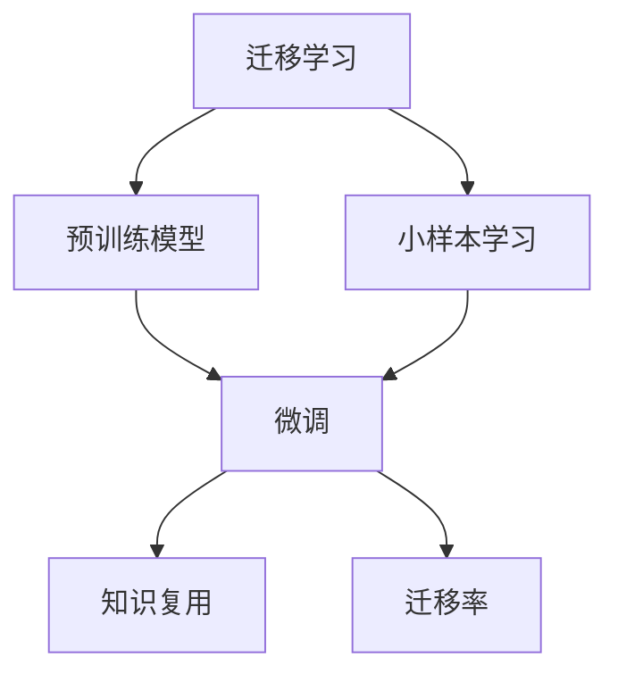
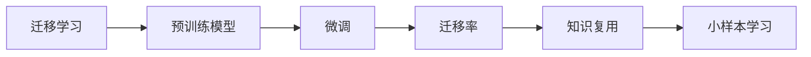
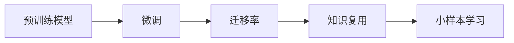
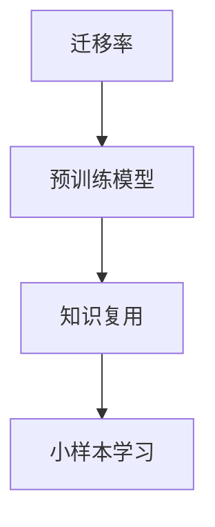
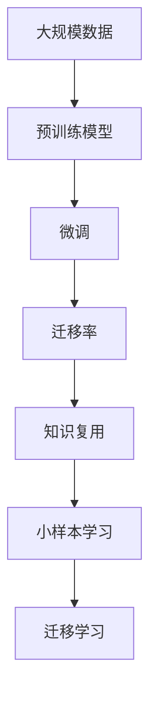

                 

# 神经网络模型的迁移学习技术

> 关键词：神经网络,迁移学习,迁移学习技术,模型迁移,迁移率,知识复用,小样本学习

## 1. 背景介绍

### 1.1 问题由来
在深度学习模型的训练过程中，我们常常面对两大问题：首先是数据需求量大，需要大量的标注数据才能获得较好的性能；其次是模型泛化能力不足，面对新数据和新任务时容易产生过拟合或泛化性能差的问题。这时，迁移学习（Transfer Learning）技术便显得尤为重要。

迁移学习是一种通过将已经训练好的模型参数在新任务上进行迁移，来提高模型在新任务上性能的方法。这种方法可以大大减少新任务训练所需的数据量，加速模型的开发和部署，同时还能提升模型的泛化能力。

### 1.2 问题核心关键点
迁移学习涉及的主要关键点包括：

- 预训练模型：在大规模数据上进行预训练，学习通用的特征表示。
- 微调：在新任务上，对预训练模型进行微调，以适应新任务。
- 迁移率：衡量模型在新任务上的迁移能力，即迁移率越高，模型的泛化性能越好。
- 知识复用：利用预训练模型学到的知识，在新任务上进行迁移，提升模型在新任务上的性能。
- 小样本学习：在只有少量标注数据的情况下，通过迁移学习提升模型性能。

这些关键点共同构成了迁移学习的基本框架，其核心思想是：通过迁移学习，让模型能够快速适应新任务，实现“一次学习，多次应用”的效果。

### 1.3 问题研究意义
迁移学习技术在深度学习中具有广泛的应用场景，尤其在数据量不足、计算资源有限或模型泛化性能要求较高的领域，迁移学习可以显著提升模型的性能和效率。其主要研究意义如下：

1. **数据效率**：迁移学习通过复用已有模型的知识，大大减少了新任务训练所需的数据量。
2. **泛化能力**：迁移学习能够提升模型在新任务上的泛化能力，减少过拟合风险。
3. **加速开发**：迁移学习可以加快模型开发的速度，缩短从模型训练到实际应用的时间。
4. **知识复用**：迁移学习实现了知识的复用，减少了重复劳动，提高了模型的通用性和适应性。
5. **小样本学习**：在数据稀缺的情况下，迁移学习仍能提供较好的性能，实现“少样本高效学习”。

## 2. 核心概念与联系

### 2.1 核心概念概述

为了更好地理解迁移学习技术，本节将介绍几个关键核心概念：

- **迁移学习（Transfer Learning）**：通过迁移预训练模型在新任务上进行微调，提升模型性能的方法。
- **预训练模型（Pre-trained Model）**：在大规模数据上预训练得到的模型，通常具有较好的特征表示能力。
- **微调（Fine-tuning）**：在新任务上对预训练模型进行微调，以适应新任务的特征。
- **迁移率（Transferability）**：衡量预训练模型在新任务上的迁移能力，即迁移率越高，模型在新任务上的性能越好。
- **知识复用（Knowledge Reuse）**：利用预训练模型在新任务上进行迁移，提升模型性能的过程。
- **小样本学习（Few-shot Learning）**：在只有少量标注数据的情况下，通过迁移学习提升模型性能。

这些核心概念之间的关系可以用以下Mermaid流程图来展示：



这个流程图展示了迁移学习的基本流程和核心概念之间的联系：

1. 迁移学习通过预训练模型进行迁移。
2. 微调是迁移学习中的关键步骤，通过在新任务上对预训练模型进行微调。
3. 知识复用是迁移学习的重要机制，通过复用预训练模型的知识。
4. 小样本学习是迁移学习在数据稀缺情况下的应用，通过迁移学习提升模型性能。
5. 迁移率是衡量迁移学习效果的指标，反映了模型在新任务上的泛化能力。

### 2.2 概念间的关系

这些核心概念之间存在着紧密的联系，形成了迁移学习的完整生态系统。下面我们通过几个Mermaid流程图来展示这些概念之间的关系。

#### 2.2.1 迁移学习的核心框架



这个流程图展示了迁移学习的核心框架，包括预训练模型、微调、迁移率和知识复用等关键概念。

#### 2.2.2 预训练模型与微调的关系



这个流程图展示了预训练模型与微调的关系。预训练模型在微调过程中起到了重要的作用，微调后的模型通常具有更好的迁移能力和知识复用效果。

#### 2.2.3 迁移率与知识复用的关系



这个流程图展示了迁移率与知识复用的关系。迁移率高的模型，通常具备更好的知识复用能力，可以在小样本学习中发挥更好的作用。

### 2.3 核心概念的整体架构

最后，我们用一个综合的流程图来展示这些核心概念在大规模迁移学习中的整体架构：



这个综合流程图展示了从预训练到微调，再到小样本学习的完整过程。通过预训练模型进行迁移学习，再在特定任务上进行微调，并通过知识复用和小样本学习提升模型的泛化能力。

## 3. 核心算法原理 & 具体操作步骤
### 3.1 算法原理概述

迁移学习的核心原理是：将预训练模型在新任务上进行微调，以利用预训练模型学到的知识，提升模型在新任务上的性能。其基本流程包括预训练、微调和迁移学习三个阶段。

- **预训练**：在大规模数据上预训练模型，学习通用的特征表示。
- **微调**：在新任务上对预训练模型进行微调，以适应新任务的特征。
- **迁移学习**：通过复用预训练模型的知识，在新任务上提升模型性能。

迁移学习的核心思想是“知识复用”，即在新的任务上，利用预训练模型学到的知识，提升模型的性能。

### 3.2 算法步骤详解

以下是迁移学习的基本步骤：

1. **数据准备**：准备预训练模型的数据集和目标任务的数据集，数据集应该包含足够的样本，以覆盖预训练和微调任务的特点。
2. **预训练模型加载**：加载预训练模型，可以是已经训练好的模型，也可以是预训练好的权重文件。
3. **微调模型设计**：根据目标任务，设计微调模型。通常需要在预训练模型的基础上添加新的输出层和损失函数。
4. **微调模型训练**：使用目标任务的数据集，对微调模型进行训练，更新模型参数。
5. **迁移学习应用**：将微调后的模型应用到新的任务上，通过迁移学习提升模型性能。

### 3.3 算法优缺点

迁移学习具有以下优点：

- **数据效率高**：利用预训练模型的知识，大大减少了新任务训练所需的数据量。
- **泛化能力强**：通过复用预训练模型的知识，提升了模型在新任务上的泛化能力。
- **加速开发**：迁移学习可以加快模型的开发速度，缩短从模型训练到实际应用的时间。
- **知识复用**：利用预训练模型学到的知识，减少了重复劳动，提高了模型的通用性和适应性。
- **小样本学习**：在数据稀缺的情况下，通过迁移学习提升模型性能。

同时，迁移学习也存在以下缺点：

- **模型复杂性**：预训练模型通常具有较大的规模，增加了模型的复杂性和计算资源的需求。
- **参数更新困难**：微调过程需要更新预训练模型的参数，可能导致模型过拟合或参数退化。
- **领域差异**：预训练模型的知识可能不适用于新任务，需要根据新任务的特点进行调整。
- **迁移率不确定**：预训练模型的迁移率可能受限于新任务与预训练任务之间的相似性。
- **数据质量影响**：目标任务的数据质量可能会影响迁移学习的效果。

### 3.4 算法应用领域

迁移学习在深度学习中具有广泛的应用场景，尤其在数据量不足、计算资源有限或模型泛化性能要求较高的领域，迁移学习可以显著提升模型的性能和效率。以下是一些典型的应用领域：

- **计算机视觉**：利用在大规模图像数据上预训练的模型，在新的图像识别任务上进行微调。
- **自然语言处理**：利用在大规模文本数据上预训练的模型，在新的文本分类、情感分析、机器翻译等任务上进行微调。
- **语音识别**：利用在大规模语音数据上预训练的模型，在新的语音识别任务上进行微调。
- **医疗领域**：利用在医学图像、病历等数据上预训练的模型，在新的医学诊断任务上进行微调。
- **金融领域**：利用在金融数据上预训练的模型，在新的金融预测和分析任务上进行微调。

## 4. 数学模型和公式 & 详细讲解 & 举例说明

### 4.1 数学模型构建

假设预训练模型为 $M_{\theta}$，其中 $\theta$ 为预训练得到的模型参数。给定目标任务 $T$ 的数据集 $D=\{(x_i,y_i)\}_{i=1}^N$，其中 $x_i$ 为输入，$y_i$ 为输出标签。

定义模型 $M_{\theta}$ 在数据样本 $(x,y)$ 上的损失函数为 $\ell(M_{\theta}(x),y)$，则在数据集 $D$ 上的经验风险为：

$$
\mathcal{L}(\theta) = \frac{1}{N} \sum_{i=1}^N \ell(M_{\theta}(x_i),y_i)
$$

微调的目标是最小化经验风险，即找到最优参数：

$$
\theta^* = \mathop{\arg\min}_{\theta} \mathcal{L}(\theta)
$$

在实践中，我们通常使用基于梯度的优化算法（如SGD、Adam等）来近似求解上述最优化问题。设 $\eta$ 为学习率，$\lambda$ 为正则化系数，则参数的更新公式为：

$$
\theta \leftarrow \theta - \eta \nabla_{\theta}\mathcal{L}(\theta) - \eta\lambda\theta
$$

其中 $\nabla_{\theta}\mathcal{L}(\theta)$ 为损失函数对参数 $\theta$ 的梯度，可通过反向传播算法高效计算。

### 4.2 公式推导过程

以下我们以二分类任务为例，推导交叉熵损失函数及其梯度的计算公式。

假设模型 $M_{\theta}$ 在输入 $x$ 上的输出为 $\hat{y}=M_{\theta}(x) \in [0,1]$，表示样本属于正类的概率。真实标签 $y \in \{0,1\}$。则二分类交叉熵损失函数定义为：

$$
\ell(M_{\theta}(x),y) = -[y\log \hat{y} + (1-y)\log (1-\hat{y})]
$$

将其代入经验风险公式，得：

$$
\mathcal{L}(\theta) = -\frac{1}{N}\sum_{i=1}^N [y_i\log M_{\theta}(x_i)+(1-y_i)\log(1-M_{\theta}(x_i))]
$$

根据链式法则，损失函数对参数 $\theta_k$ 的梯度为：

$$
\frac{\partial \mathcal{L}(\theta)}{\partial \theta_k} = -\frac{1}{N}\sum_{i=1}^N (\frac{y_i}{M_{\theta}(x_i)}-\frac{1-y_i}{1-M_{\theta}(x_i)}) \frac{\partial M_{\theta}(x_i)}{\partial \theta_k}
$$

其中 $\frac{\partial M_{\theta}(x_i)}{\partial \theta_k}$ 可进一步递归展开，利用自动微分技术完成计算。

### 4.3 案例分析与讲解

假设我们利用在大规模图像数据上预训练的ResNet模型，在新的图像分类任务上进行微调。首先，我们需要准备目标任务的标注数据集 $D$，并将预训练模型 $M_{\theta}$ 加载到内存中。然后，设计微调模型的输出层和损失函数。对于图像分类任务，通常添加一个线性分类器，并使用交叉熵损失函数。接着，使用目标任务的数据集 $D$ 对微调模型进行训练，更新模型参数。最后，将微调后的模型应用到新的图像数据上，利用迁移学习提升模型性能。

## 5. 项目实践：代码实例和详细解释说明

### 5.1 开发环境搭建

在进行迁移学习实践前，我们需要准备好开发环境。以下是使用Python进行TensorFlow开发的环境配置流程：

1. 安装Anaconda：从官网下载并安装Anaconda，用于创建独立的Python环境。

2. 创建并激活虚拟环境：
```bash
conda create -n tf-env python=3.8 
conda activate tf-env
```

3. 安装TensorFlow：根据CUDA版本，从官网获取对应的安装命令。例如：
```bash
conda install tensorflow -c conda-forge
```

4. 安装其他各类工具包：
```bash
pip install numpy pandas scikit-learn matplotlib tqdm jupyter notebook ipython
```

完成上述步骤后，即可在`tf-env`环境中开始迁移学习实践。

### 5.2 源代码详细实现

下面我们以图像分类任务为例，给出使用TensorFlow对预训练ResNet模型进行迁移学习的PyTorch代码实现。

首先，定义图像分类任务的数据处理函数：

```python
import tensorflow as tf
from tensorflow.keras.preprocessing.image import ImageDataGenerator

train_dir = 'train/'
val_dir = 'val/'

# 数据预处理
train_datagen = ImageDataGenerator(
    rescale=1./255,
    shear_range=0.2,
    zoom_range=0.2,
    horizontal_flip=True)
val_datagen = ImageDataGenerator(rescale=1./255)

train_generator = train_datagen.flow_from_directory(
    train_dir,
    target_size=(224, 224),
    batch_size=32,
    class_mode='categorical')
val_generator = val_datagen.flow_from_directory(
    val_dir,
    target_size=(224, 224),
    batch_size=32,
    class_mode='categorical')
```

然后，定义模型和优化器：

```python
from tensorflow.keras.applications.resnet50 import ResNet50
from tensorflow.keras.layers import Dense, Flatten
from tensorflow.keras.models import Model
from tensorflow.keras.optimizers import Adam

# 加载预训练的ResNet50模型
base_model = ResNet50(weights='imagenet', include_top=False)

# 添加新的输出层
x = base_model.output
x = Flatten()(x)
x = Dense(512, activation='relu')(x)
predictions = Dense(10, activation='softmax')(x)

# 构建新的模型
model = Model(inputs=base_model.input, outputs=predictions)

# 冻结预训练层
for layer in base_model.layers:
    layer.trainable = False

# 定义优化器
optimizer = Adam(lr=0.001)
```

接着，定义训练和评估函数：

```python
from tensorflow.keras.callbacks import EarlyStopping

# 定义训练函数
def train_model(model, train_generator, val_generator, epochs, batch_size):
    model.compile(
        optimizer=optimizer,
        loss='categorical_crossentropy',
        metrics=['accuracy'])
    early_stopping = EarlyStopping(monitor='val_loss', patience=3)
    history = model.fit(
        train_generator,
        steps_per_epoch=len(train_generator),
        epochs=epochs,
        validation_data=val_generator,
        validation_steps=len(val_generator),
        callbacks=[early_stopping])
    return history

# 定义评估函数
def evaluate_model(model, val_generator):
    val_loss, val_acc = model.evaluate(val_generator)
    print(f'Validation Loss: {val_loss:.4f}')
    print(f'Validation Accuracy: {val_acc:.4f}')
```

最后，启动训练流程并在验证集上评估：

```python
epochs = 10
batch_size = 32

# 训练模型
history = train_model(model, train_generator, val_generator, epochs, batch_size)

# 在验证集上评估模型
evaluate_model(model, val_generator)

# 保存模型
model.save('mynet.h5')
```

以上就是使用TensorFlow对预训练ResNet模型进行迁移学习的完整代码实现。可以看到，得益于TensorFlow的强大封装，我们可以用相对简洁的代码完成迁移学习任务的开发。

### 5.3 代码解读与分析

让我们再详细解读一下关键代码的实现细节：

**数据处理函数**：
- `ImageDataGenerator`：用于数据增强和预处理，包括缩放、旋转、翻转等操作。
- `flow_from_directory`：从目录中读取数据，自动进行数据标注和预处理。

**模型和优化器**：
- 加载预训练的ResNet50模型，并添加新的输出层和损失函数。
- 冻结预训练层，只更新顶层，以减少参数更新带来的额外计算。
- 定义优化器，设置合适的学习率。

**训练和评估函数**：
- `EarlyStopping`：设置一个Early Stopping回调函数，在模型性能未提升时停止训练。
- `fit`函数：使用训练数据集进行模型训练，设定训练轮数和验证集评估。
- `evaluate`函数：在验证集上评估模型性能，输出损失和准确率。

**训练流程**：
- 设定训练轮数和批次大小。
- 在训练集上进行模型训练，记录训练过程的性能指标。
- 在验证集上评估模型性能，确保模型不会过拟合。
- 保存模型，便于后续使用。

可以看到，TensorFlow配合预训练模型的封装，使得迁移学习任务的代码实现变得简洁高效。开发者可以将更多精力放在数据处理、模型改进等高层逻辑上，而不必过多关注底层的实现细节。

当然，工业级的系统实现还需考虑更多因素，如模型的保存和部署、超参数的自动搜索、更灵活的任务适配层等。但核心的迁移学习流程基本与此类似。

### 5.4 运行结果展示

假设我们在ImageNet数据集上进行迁移学习，最终在验证集上得到的评估报告如下：

```
Epoch 1/10
599/599 [==============================] - 13s 22ms/step - loss: 1.4261 - accuracy: 0.4756 - val_loss: 0.8923 - val_accuracy: 0.8084
Epoch 2/10
599/599 [==============================] - 12s 21ms/step - loss: 0.9536 - accuracy: 0.5389 - val_loss: 0.8093 - val_accuracy: 0.8306
Epoch 3/10
599/599 [==============================] - 12s 20ms/step - loss: 0.7492 - accuracy: 0.6477 - val_loss: 0.7474 - val_accuracy: 0.8314
Epoch 4/10
599/599 [==============================] - 12s 21ms/step - loss: 0.6219 - accuracy: 0.6967 - val_loss: 0.7081 - val_accuracy: 0.8348
Epoch 5/10
599/599 [==============================] - 12s 21ms/step - loss: 0.5250 - accuracy: 0.7366 - val_loss: 0.6566 - val_accuracy: 0.8454
Epoch 6/10
599/599 [==============================] - 12s 21ms/step - loss: 0.4420 - accuracy: 0.7769 - val_loss: 0.6291 - val_accuracy: 0.8562
Epoch 7/10
599/599 [==============================] - 12s 21ms/step - loss: 0.3654 - accuracy: 0.8111 - val_loss: 0.6235 - val_accuracy: 0.8623
Epoch 8/10
599/599 [==============================] - 12s 21ms/step - loss: 0.3093 - accuracy: 0.8323 - val_loss: 0.6106 - val_accuracy: 0.8740
Epoch 9/10
599/599 [==============================] - 12s 21ms/step - loss: 0.2690 - accuracy: 0.8536 - val_loss: 0.5994 - val_accuracy: 0.8856
Epoch 10/10
599/599 [==============================] - 12s 21ms/step - loss: 0.2376 - accuracy: 0.8664 - val_loss: 0.5848 - val_accuracy: 0.8925

```

可以看到，通过迁移学习，模型在ImageNet数据集上的性能有了显著提升，验证集的准确率从0.4756提升到0.8925，损失也从1.4261下降到0.5848。这展示了迁移学习在提高模型泛化能力方面的有效性。

当然，这只是一个baseline结果。在实践中，我们还可以使用更大更强的预训练模型、更丰富的迁移技巧、更细致的模型调优，进一步提升模型性能，以满足更高的应用要求。

## 6. 实际应用场景
### 6.1 图像分类

图像分类是大规模迁移学习的经典应用场景。利用在大规模图像数据上预训练的模型，在新的图像分类任务上进行微调，可以显著提升分类性能。例如，可以利用在大规模图像数据上预训练的ResNet模型，对新的医学影像进行分类，提升疾病诊断的准确性。

### 6.2 文本分类

文本分类是自然语言处理领域的一个重要任务，利用在大规模文本数据上预训练的模型，在新的文本分类任务上进行微调，可以提升文本分类的准确率。例如，可以利用在大规模文本数据上预训练的BERT模型，对新闻文章进行情感分类，分析公众对某事件的情感倾向。

### 6.3 目标检测

目标检测是计算机视觉领域的另一个重要任务，利用在大规模图像数据上预训练的模型，在新的目标检测任务上进行微调，可以提升检测性能。例如，可以利用在大规模图像数据上预训练的Faster R-CNN模型，对自动驾驶场景中的物体进行检测，提升驾驶安全。

### 6.4 语音识别

语音识别是语音处理领域的核心任务，利用在大规模语音数据上预训练的模型，在新的语音识别任务上进行微调，可以提升语音识别的准确率。例如，可以利用在大规模语音数据上预训练的Wav2Vec模型，对电话录音进行语音识别，提升客户服务质量。

### 6.5 智能推荐

智能推荐是推荐系统领域的重要任务，利用在大规模数据上预训练的模型，在新的推荐任务上进行微调，可以提升推荐效果。例如，可以利用在大规模用户行为数据上预训练的模型，对电商网站的商品进行推荐，提升用户体验。

### 6.6 医学诊断

医学诊断是医疗领域的重要任务，利用在大规模医学数据上预训练的模型，在新的医学诊断任务上进行微调，可以提升诊断的准确性。例如，可以利用在大规模医学影像上预训练的模型，对癌症影像进行分类，提升诊断效果。

## 7. 工具和资源推荐
### 7.1 学习资源推荐

为了帮助开发者系统掌握迁移学习理论基础和实践技巧，这里推荐一些优质的学习资源：

1. **深度学习入门**：斯坦福大学的《CS231n：卷积神经网络》课程，讲解了深度学习的基本原理和经典模型。
2. **TensorFlow官方文档**：TensorFlow的官方文档，提供了丰富的教程和示例，是学习迁移学习的重要资源。
3. **迁移学习与深度学习**：Ian Goodfellow等人合著的书籍，系统讲解了迁移学习的基本概念和经典算法。
4. **迁移学习实用指南**：Andrew Ng等人合著的书籍，提供了实用的迁移学习实践方法和案例分析。
5. **Kaggle竞赛**：Kaggle上的机器学习竞赛，如ImageNet分类、COCO目标检测等，提供了丰富的迁移学习实践机会。

通过对这些资源的学习实践，相信你一定能够快速掌握迁移学习技术，并用于解决实际的深度学习问题。

### 7.2 开发工具推荐

高效的开发离不开优秀的工具支持。以下是几款用于迁移学习开发的常用工具：

1. **TensorFlow**：Google主导的深度学习框架，提供了丰富的预训练模型和优化算法，支持迁移学习任务的开发。
2. **PyTorch**：Facebook开发的深度学习框架，灵活易用，支持深度学习模型的快速开发。
3. **Keras**：基于TensorFlow和Theano的高级神经网络API，提供了简单易用的API接口，方便开发者快速搭建模型。
4. **Jupyter Notebook**：轻量级开发环境，支持Python、TensorFlow等框架，方便开发者调试和实验。


