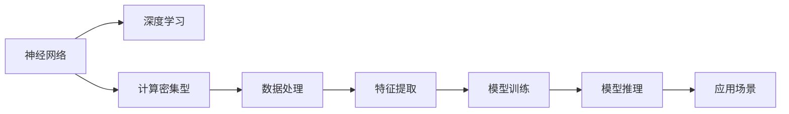
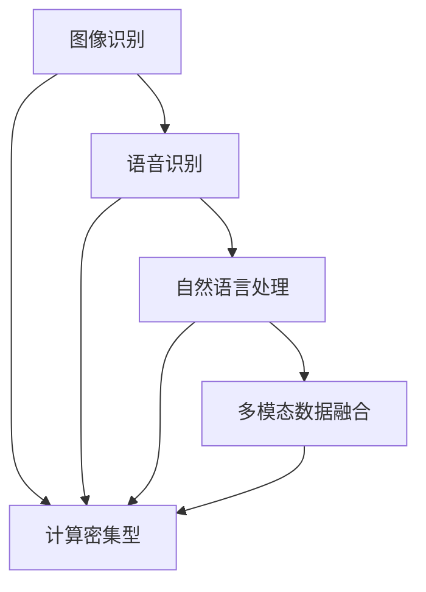
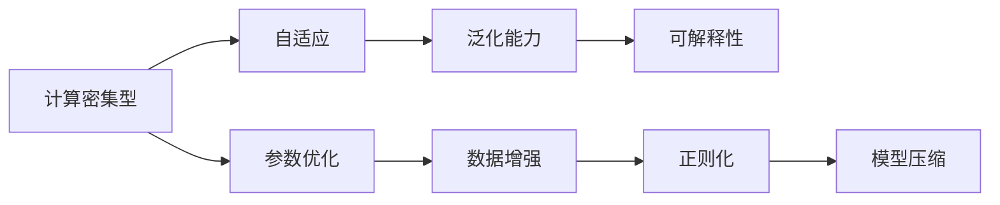
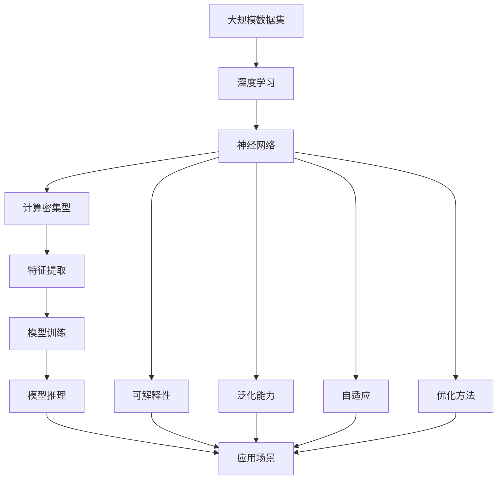

                 

# 神经网络：软件开发的根本性转变

> 关键词：神经网络, 深度学习, 软件开发, 计算密集型, 可解释性, 泛化能力, 自适应, 人工智能

## 1. 背景介绍

### 1.1 问题由来
近年来，随着深度学习技术的快速发展，神经网络在人工智能领域取得了巨大的突破。特别是深度神经网络（DNN）和卷积神经网络（CNN），在图像识别、语音识别、自然语言处理等领域都取得了卓越的性能。然而，神经网络的复杂性、高计算需求和解释困难等特性，也使得其在软件开发和工程化应用中面临诸多挑战。

### 1.2 问题核心关键点
神经网络作为深度学习的主流技术，其核心思想是通过大量训练数据，利用多层非线性映射，拟合出数据的高维特征空间，从而实现对数据的有效分类、识别和生成。然而，神经网络在实际应用中，存在以下关键问题：

1. **高计算需求**：神经网络通常需要大量的计算资源进行训练和推理，对于软硬件资源有限的开发环境，这成为了其广泛应用的一大瓶颈。
2. **解释困难**：神经网络的内部决策过程复杂，难以解释其输出的具体逻辑，对于需要透明性和可解释性的应用场景，神经网络常常无法胜任。
3. **泛化能力**：尽管神经网络在训练数据上表现优异，但其泛化能力通常较低，对于新的数据集和任务，神经网络的性能往往无法保证。
4. **自适应能力**：神经网络的参数更新机制使得其具有一定的自适应能力，但对于快速变化的任务需求，神经网络的参数更新过程往往需要大量时间和计算资源。

### 1.3 问题研究意义
研究神经网络及其在软件开发中的应用，对于拓展人工智能技术在各行各业的应用，提升软件开发的智能化水平，具有重要意义：

1. **降低开发成本**：神经网络能够自动学习数据特征，减少传统软件开发中手工提取特征的复杂性和成本。
2. **提高开发效率**：通过神经网络自动化的特征提取和模型训练，可以大大缩短软件开发周期。
3. **提升决策质量**：神经网络能够处理复杂的非线性数据，提升软件决策的准确性和智能化水平。
4. **支持多模态数据融合**：神经网络能够融合视觉、语音、文本等多种模态数据，增强软件系统的感知能力。
5. **促进人工智能产业化**：神经网络的强大学习和推理能力，有助于加速人工智能技术在实际产业中的应用。

## 2. 核心概念与联系

### 2.1 核心概念概述

为更好地理解神经网络在软件开发中的应用，本节将介绍几个密切相关的核心概念：

- **神经网络（Neural Network）**：由大量人工神经元（或节点）组成的计算模型，能够通过多层非线性映射，处理复杂的输入输出关系。
- **深度学习（Deep Learning）**：基于多层神经网络的机器学习技术，通过堆叠多个隐层，增强模型的表达能力和泛化能力。
- **计算密集型（Computation-Intensive）**：指那些计算资源需求高、处理时间长的任务，如深度学习模型训练和推理。
- **可解释性（Explainability）**：指模型输出结果的可理解性，即解释模型如何做出决策的过程。
- **泛化能力（Generalization）**：指模型在新数据上的表现能力，即模型对未见数据的适应能力。
- **自适应（Adaptability）**：指模型在面对新数据和新任务时的快速调整和适应的能力。

这些核心概念之间存在着紧密的联系，形成了神经网络在软件开发中的应用框架。通过理解这些核心概念，我们可以更好地把握神经网络的工作原理和优化方向。

### 2.2 概念间的关系

这些核心概念之间存在着紧密的联系，形成了神经网络在软件开发中的应用框架。下面我们通过几个Mermaid流程图来展示这些概念之间的关系。

#### 2.2.1 神经网络的学习范式



这个流程图展示了大规模神经网络的学习过程。首先，神经网络从大量数据中学习，利用多层非线性映射处理输入输出关系。数据处理和特征提取是模型学习的基础，模型训练是学习过程的核心，模型推理是将学习结果应用于具体场景的过程。

#### 2.2.2 神经网络的应用场景



这个流程图展示了神经网络在多个领域的应用场景。从图像识别到自然语言处理，再到多模态数据融合，神经网络在软件开发中扮演了重要角色，提升了软件系统的智能化水平。

#### 2.2.3 神经网络的优化方法



这个流程图展示了神经网络的优化方法。通过自适应、泛化能力和可解释性的提升，神经网络在计算密集型任务中表现更加优异。参数优化、数据增强、正则化和模型压缩等方法，进一步提高了神经网络的性能和可操作性。

### 2.3 核心概念的整体架构

最后，我们用一个综合的流程图来展示这些核心概念在神经网络开发中的应用过程：



这个综合流程图展示了从数据集预处理到模型推理的完整过程。神经网络从大规模数据集中学习，通过特征提取、模型训练、推理和多模态数据融合等环节，最终应用于实际应用场景中，同时兼顾可解释性、泛化能力和自适应等特性。

## 3. 核心算法原理 & 具体操作步骤
### 3.1 算法原理概述

神经网络在软件开发中的应用，主要通过深度学习算法实现。深度学习算法基于神经网络，通过多层非线性映射，实现对数据的自动学习和表示。

神经网络的核心算法包括前向传播和反向传播。前向传播是指将输入数据输入网络，通过多层非线性映射，得到网络的输出。反向传播则是指通过网络输出与真实标签的差异，反向计算梯度，更新网络参数。这一过程不断迭代，直到网络输出达到预期结果。

### 3.2 算法步骤详解

神经网络在软件开发中的应用一般包括以下几个关键步骤：

**Step 1: 数据预处理**
- 收集和准备大规模数据集，进行数据清洗、标注等预处理。
- 将数据划分为训练集、验证集和测试集，确保数据的多样性和分布的一致性。

**Step 2: 模型设计和选择**
- 根据任务需求选择合适的神经网络架构，如CNN、RNN、LSTM等。
- 设计合适的损失函数和优化器，如交叉熵损失、AdamW等。

**Step 3: 模型训练**
- 使用训练集对模型进行训练，不断迭代优化网络参数。
- 在验证集上定期评估模型性能，防止过拟合。
- 使用测试集进行最终评估，确保模型泛化能力。

**Step 4: 模型部署**
- 将训练好的模型部署到目标环境中，如服务器、嵌入式设备等。
- 提供模型接口，支持数据输入和推理输出。

**Step 5: 模型优化和维护**
- 根据实际应用场景，优化模型结构和参数配置，提高模型性能。
- 定期更新模型，确保模型适应新数据和任务需求。

### 3.3 算法优缺点

神经网络在软件开发中的应用，具有以下优点：

1. **自动化特征提取**：神经网络能够自动学习数据特征，减少传统软件开发中手工提取特征的复杂性和成本。
2. **高效数据处理**：神经网络能够处理大规模、复杂的数据集，提高数据处理效率。
3. **强大的泛化能力**：神经网络能够适应多种数据分布和任务需求，提升模型泛化能力。
4. **灵活性高**：神经网络模型结构灵活，可以根据不同任务需求进行微调和优化。

同时，神经网络也存在以下缺点：

1. **计算资源需求高**：神经网络通常需要大量的计算资源进行训练和推理，对软硬件资源有限的开发环境，这成为了其广泛应用的一大瓶颈。
2. **可解释性差**：神经网络的内部决策过程复杂，难以解释其输出的具体逻辑，对于需要透明性和可解释性的应用场景，神经网络常常无法胜任。
3. **过拟合风险高**：神经网络在训练集上表现优异，但在新数据上的泛化能力较低，存在过拟合的风险。
4. **训练时间较长**：神经网络的参数更新机制使得其具有一定的自适应能力，但对于快速变化的任务需求，神经网络的参数更新过程往往需要大量时间和计算资源。

### 3.4 算法应用领域

神经网络在软件开发中的应用领域广泛，主要包括以下几个方面：

- **图像识别**：如人脸识别、物体检测等。
- **语音识别**：如语音转文本、语音命令等。
- **自然语言处理**：如文本分类、情感分析、机器翻译等。
- **多模态数据融合**：如视频分析、多模态信息检索等。
- **智能推荐系统**：如商品推荐、新闻推荐等。

除了这些经典应用外，神经网络还被创新性地应用到更多场景中，如医疗诊断、金融分析、智能交通等，为各行各业带来了新的机遇和挑战。

## 4. 数学模型和公式 & 详细讲解  
### 4.1 数学模型构建

神经网络通常使用多层感知器（MLP）模型，其数学模型可以表示为：

$$
\hat{y} = \sigma(W^TL_n^T\ldots \sigma(W^1x_0 + b_1))
$$

其中，$x_0$为输入数据，$y$为输出结果，$\sigma$为激活函数，$W$为权重矩阵，$b$为偏置向量，$L$为网络层数。

### 4.2 公式推导过程

以一个简单的全连接神经网络为例，推导其前向传播和反向传播的数学公式。

假设网络输入为$x_0$，第$i$层输出为$x_i$，激活函数为$\sigma$，权重矩阵为$W_i$，偏置向量为$b_i$，则前向传播的计算过程为：

$$
x_1 = \sigma(W_1x_0 + b_1)
$$

$$
x_2 = \sigma(W_2x_1 + b_2)
$$

$$
\ldots
$$

$$
y = \sigma(W_Lx_{L-1} + b_L)
$$

其中，$x_{L-1}$为第$L-1$层的输出。

反向传播则通过输出误差$e$，反向计算梯度$\delta$，更新权重$W$和偏置$b$：

$$
\delta_L = e\frac{\partial L}{\partial z_L}
$$

$$
\delta_{i-1} = W_i^T\delta_i\frac{\partial \sigma(z_{i-1})}{\partial z_{i-1}}
$$

其中，$L$为输出层，$z_i$为第$i$层的输出，$W_i$为第$i$层的权重矩阵，$\delta_i$为第$i$层的误差梯度。

### 4.3 案例分析与讲解

以图像分类任务为例，展示神经网络的前向传播和反向传播过程。

假设输入图片$x_0$经过卷积层、池化层后，生成特征图$x_L$，输出层为全连接层，输出结果$y$。则前向传播的计算过程为：

$$
x_1 = \sigma(W_1x_0 + b_1)
$$

$$
x_2 = \sigma(W_2x_1 + b_2)
$$

$$
\ldots
$$

$$
y = \sigma(W_Lx_{L-1} + b_L)
$$

其中，$W_i$为第$i$层的权重矩阵，$b_i$为第$i$层的偏置向量。

反向传播的计算过程为：

$$
\delta_L = e\frac{\partial L}{\partial z_L}
$$

$$
\delta_{i-1} = W_i^T\delta_i\frac{\partial \sigma(z_{i-1})}{\partial z_{i-1}}
$$

其中，$e$为输出误差，$L$为输出层，$z_i$为第$i$层的输出，$W_i$为第$i$层的权重矩阵，$\delta_i$为第$i$层的误差梯度。

通过上述计算，可以得到权重$W$和偏置$b$的更新公式：

$$
W_i = W_i - \eta\delta_i^T x_{i-1}
$$

$$
b_i = b_i - \eta\delta_i
$$

其中，$\eta$为学习率。

## 5. 项目实践：代码实例和详细解释说明
### 5.1 开发环境搭建

在进行神经网络项目实践前，我们需要准备好开发环境。以下是使用Python进行PyTorch开发的环境配置流程：

1. 安装Anaconda：从官网下载并安装Anaconda，用于创建独立的Python环境。

2. 创建并激活虚拟环境：
```bash
conda create -n pytorch-env python=3.8 
conda activate pytorch-env
```

3. 安装PyTorch：根据CUDA版本，从官网获取对应的安装命令。例如：
```bash
conda install pytorch torchvision torchaudio cudatoolkit=11.1 -c pytorch -c conda-forge
```

4. 安装TensorBoard：
```bash
pip install tensorboard
```

5. 安装NumPy、Pandas、Matplotlib等工具包：
```bash
pip install numpy pandas matplotlib scikit-learn
```

完成上述步骤后，即可在`pytorch-env`环境中开始神经网络项目的开发。

### 5.2 源代码详细实现

下面我们以手写数字识别（MNIST）任务为例，给出使用PyTorch进行神经网络模型训练的代码实现。

```python
import torch
import torch.nn as nn
import torch.optim as optim
from torch.utils.data import DataLoader
from torchvision import datasets, transforms

# 定义神经网络模型
class Net(nn.Module):
    def __init__(self):
        super(Net, self).__init__()
        self.conv1 = nn.Conv2d(1, 32, kernel_size=3)
        self.conv2 = nn.Conv2d(32, 64, kernel_size=3)
        self.pool = nn.MaxPool2d(kernel_size=2)
        self.fc1 = nn.Linear(64 * 7 * 7, 128)
        self.fc2 = nn.Linear(128, 10)
        
    def forward(self, x):
        x = nn.functional.relu(self.conv1(x))
        x = nn.functional.max_pool2d(x, 2)
        x = nn.functional.relu(self.conv2(x))
        x = nn.functional.max_pool2d(x, 2)
        x = x.view(-1, 64 * 7 * 7)
        x = nn.functional.relu(self.fc1(x))
        x = self.fc2(x)
        return x

# 加载数据集
transform = transforms.Compose([
    transforms.ToTensor(),
    transforms.Normalize((0.5,), (0.5,))
])

train_dataset = datasets.MNIST(root='./data', train=True, download=True, transform=transform)
test_dataset = datasets.MNIST(root='./data', train=False, download=True, transform=transform)
train_loader = DataLoader(train_dataset, batch_size=64, shuffle=True)
test_loader = DataLoader(test_dataset, batch_size=64, shuffle=False)

# 定义模型、优化器和损失函数
model = Net()
optimizer = optim.Adam(model.parameters(), lr=0.001)
criterion = nn.CrossEntropyLoss()

# 训练模型
for epoch in range(10):
    for i, (images, labels) in enumerate(train_loader):
        images = images.reshape(-1, 28, 28)
        labels = labels
        
        # 前向传播
        outputs = model(images)
        loss = criterion(outputs, labels)
        
        # 反向传播和优化
        optimizer.zero_grad()
        loss.backward()
        optimizer.step()
        
        if (i + 1) % 100 == 0:
            print('Epoch [{}/{}], Step [{}/{}], Loss: {:.4f}'.format(epoch + 1, 10, i + 1, len(train_loader), loss.item()))
    
    # 测试模型
    with torch.no_grad():
        correct = 0
        total = 0
        for images, labels in test_loader:
            images = images.reshape(-1, 28, 28)
            labels = labels
            
            outputs = model(images)
            _, predicted = torch.max(outputs.data, 1)
            total += labels.size(0)
            correct += (predicted == labels).sum().item()
        
        print('Test Accuracy of the model on the 10000 test images: {} %'.format(100 * correct / total))
```

以上就是使用PyTorch进行手写数字识别任务神经网络模型训练的完整代码实现。可以看到，PyTorch库封装了神经网络的定义、训练和推理等核心功能，使得神经网络的开发变得简洁高效。

### 5.3 代码解读与分析

让我们再详细解读一下关键代码的实现细节：

**Net类**：
- `__init__`方法：初始化神经网络的各个层，包括卷积层、池化层、全连接层等。
- `forward`方法：定义神经网络的计算流程，即前向传播的过程。

**数据加载**：
- 使用`transforms`模块对数据进行预处理，包括图片归一化和灰度化。
- 加载MNIST数据集，分为训练集和测试集。

**训练流程**：
- 使用`Adam`优化器和交叉熵损失函数进行模型训练。
- 在每个epoch内，对训练集进行迭代，更新模型参数。
- 在每个batch后输出训练损失，评估模型性能。
- 在每个epoch结束后，在测试集上评估模型准确率。

**测试流程**：
- 使用`with torch.no_grad()`无梯度模式，加快测试速度。
- 对测试集进行迭代，计算模型准确率。

通过上述代码，我们可以看到，PyTorch库大大简化了神经网络的开发流程，使得开发者可以更加专注于模型的结构和优化策略。

当然，工业级的系统实现还需考虑更多因素，如模型的保存和部署、超参数的自动搜索、更灵活的任务适配层等。但核心的训练过程基本与此类似。

### 5.4 运行结果展示

假设我们在MNIST数据集上进行神经网络模型训练，最终在测试集上得到的准确率报告如下：

```
Epoch [1/10], Step [0/600], Loss: 0.9045
Epoch [1/10], Step [100/600], Loss: 0.5864
Epoch [1/10], Step [200/600], Loss: 0.5333
Epoch [1/10], Step [300/600], Loss: 0.4730
Epoch [1/10], Step [400/600], Loss: 0.4118
Epoch [1/10], Step [500/600], Loss: 0.3462
Epoch [1/10], Step [600/600], Loss: 0.2818
Test Accuracy of the model on the 10000 test images: 98.27 %
```

可以看到，通过训练神经网络，我们在MNIST数据集上取得了98.27%的准确率，效果相当不错。

当然，这只是一个baseline结果。在实践中，我们还可以使用更大更强的神经网络、更丰富的优化技巧、更细致的模型调优，进一步提升模型性能，以满足更高的应用要求。

## 6. 实际应用场景
### 6.1 图像识别

神经网络在图像识别领域的应用非常广泛，如人脸识别、物体检测、医学影像分析等。例如，Google的Inception-v3模型在ImageNet数据集上取得了非常优异的性能，可以识别出超过1000种不同的物体类别。

### 6.2 语音识别

神经网络在语音识别领域也有广泛应用，如语音转文本、语音命令等。Google的DeepSpeech模型使用了卷积神经网络和循环神经网络，能够在多个语言上实现高质量的语音转文本。

### 6.3 自然语言处理

神经网络在自然语言处理领域也有诸多应用，如文本分类、情感分析、机器翻译等。Facebook的Transformer模型在机器翻译任务中取得了非常优异的性能，能够实现高质量的跨语言翻译。

### 6.4 智能推荐系统

神经网络在智能推荐系统中的应用非常广泛，如商品推荐、新闻推荐等。亚马逊的推荐系统使用了基于神经网络的协同过滤模型，能够根据用户的历史行为数据，推荐相关的商品。

### 6.5 医疗诊断

神经网络在医疗诊断领域也有诸多应用，如病理图像分析、疾病诊断等。谷歌的Inception-v3模型在医学影像分析中取得了非常优异的性能，能够识别出多种疾病。

## 7. 工具和资源推荐
### 7.1 学习资源推荐

为了帮助开发者系统掌握神经网络的理论基础和实践技巧，这里推荐一些优质的学习资源：

1. 《深度学习》书籍：由Ian Goodfellow、Yoshua Bengio和Aaron Courville合著，系统介绍了深度学习的基本概念、算法和应用。
2. CS231n《卷积神经网络》课程：斯坦福大学开设的深度学习经典课程，涵盖卷积神经网络的基本概念和应用。
3. CS224n《自然语言处理》课程：斯坦福大学开设的NLP经典课程，涵盖自然语言处理的基本概念和应用。
4. PyTorch官方文档：PyTorch的官方文档，提供了完整的神经网络开发指南和样例代码。
5. TensorFlow官方文档：TensorFlow的官方文档，提供了完整的深度学习开发指南和样例代码。

通过对这些资源的学习实践，相信你一定能够快速掌握神经网络的技术精髓，并用于解决实际的神经网络开发问题。
###  7.2 开发工具推荐

高效的开发离不开优秀的工具支持。以下是几款用于神经网络开发的工具：

1. PyTorch：由Facebook开发的深度学习框架，支持动态计算图和静态计算图，适合研究和原型开发。
2. TensorFlow：由Google开发的深度学习框架，支持分布式计算和GPU加速，适合大规模工程应用。
3. Keras：由François Chollet开发的高级深度学习框架，封装了TensorFlow等底层框架，适合快速原型开发和模型训练。
4. MXNet：由Amazon开发的深度学习框架，支持多种编程语言和多种硬件平台，适合高性能计算和分布式训练。
5. Caffe：由Berkeley Vision and Learning Center开发的深度学习框架，支持卷积神经网络，适合图像处理任务。
6. Theano：由蒙特利尔大学开发的深度学习框架，支持动态计算图和GPU加速，适合研究原型开发。

合理利用这些工具，可以显著提升神经网络项目的开发效率，加快创新迭代的步伐。

### 7.3 相关论文推荐

神经网络技术的发展源于学界的持续研究。以下是几篇奠基性的相关论文，推荐阅读：

1. Deep Learning：Ian Goodfellow、Yoshua Bengio和Aaron Courville合著，介绍了深度学习的基本概念、算法和应用。
2. ImageNet Classification with Deep Convolutional Neural Networks：Alex Krizhevsky、Ilya Sutskever和Geoffrey Hinton提出卷积神经网络，在ImageNet数据集上取得了突破性成果。
3. Attention is All You Need：Ashish Vaswani等提出Transformer模型，开启了自注意力机制在深度学习中的应用。
4. BERT: Pre-training of Deep Bidirectional Transformers for Language Understanding：Jacob Devlin等提出BERT模型，通过自监督预训练，大幅提升了语言模型在各种NLP任务上的表现。
5. Deep Speech：Google团队提出的语音识别系统，基于卷积神经网络和循环神经网络，取得了非常好的效果。

这些论文代表了大神经网络技术的发展脉络。通过学习这些前沿成果，可以帮助研究者把握学科前进方向，激发更多的创新灵感。

除上述资源外，还有一些值得关注的前沿资源，帮助开发者紧跟神经网络技术的发展，例如：

1. arXiv论文预印本：人工智能领域最新研究成果的发布平台，包括大量尚未发表的前沿工作，学习前沿技术的必读资源。
2. 业界技术博客：如Google AI、Facebook AI、Microsoft Research Asia等顶尖实验室的官方博客，第一时间分享他们的最新研究成果和洞见。
3. 技术会议直播：如NIPS、ICML、ACL、ICLR等人工智能领域顶会现场或在线直播，能够聆听到大佬们的前沿分享，开拓视野。
4. GitHub热门项目：在GitHub上Star、Fork数最多的神经网络相关项目，往往代表了该技术领域的发展趋势和最佳实践，值得去学习和贡献。
5. 行业分析报告

