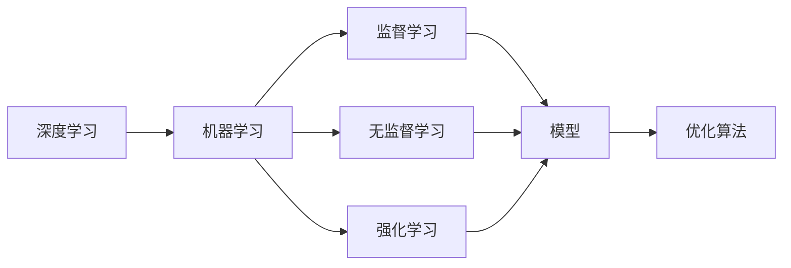

                 

## 1. 背景介绍

人工智能（AI）的迅猛发展正在改变我们生活的方方面面。从自动驾驶到智能家居，从自然语言处理到计算机视觉，AI的应用已经渗透到我们生活的各个角落。但就在几年前，这些技术还处于实验室阶段，需要大量的人力和时间进行算法设计和模型训练。现在，随着深度学习和机器学习的进步，许多任务已经变得自动化，算法不再由人设计，而是一个优化问题。

这种转变不仅仅局限于AI领域。在各行各业，包括金融、医疗、制造业等，许多问题都可以通过机器学习算法来解决。这些算法不仅能够处理复杂的任务，还能在大规模数据上进行训练，从中学习出最优的解决方案。

## 2. 核心概念与联系

### 2.1 核心概念概述

在探讨算法不再由人设计的问题时，我们需要理解以下几个核心概念：

- **深度学习（Deep Learning）**：一种机器学习技术，通过多层神经网络来模拟人脑的处理方式，从而实现对数据的复杂处理和分析。
- **机器学习（Machine Learning）**：一种通过数据和算法来使计算机具备学习能力的领域。它包括监督学习、无监督学习和强化学习等子领域。
- **算法（Algorithm）**：一组明确的规则，用于解决特定问题或完成任务。在AI领域，算法通常是通过训练数据自动生成的。
- **优化（Optimization）**：寻找特定问题的最优解的过程。在AI中，优化算法被用来训练模型，从而找到能够最小化损失函数的最佳参数。
- **模型（Model）**：一种数学模型，用于描述问题的本质和规律。在深度学习中，模型通常是一个由多层神经元组成的神经网络。

这些概念之间的联系可以用以下Mermaid流程图来展示：



这个流程图展示了深度学习、机器学习、优化算法和模型之间的关系。深度学习是机器学习的一个子领域，而优化算法是机器学习中用于训练模型的关键技术。模型是机器学习的核心，而优化算法则是找到最佳模型参数的过程。

### 2.2 核心概念之间的关系

- **深度学习**：是机器学习的一个子领域，通过多层的神经网络来处理复杂的非线性问题。
- **机器学习**：是使用数据和算法来使计算机具备学习能力的过程，包括了监督学习、无监督学习和强化学习等方法。
- **优化算法**：是用于训练模型的算法，通过最小化损失函数来找到最优的模型参数。
- **模型**：是用于描述问题的数学模型，在深度学习中通常是一个神经网络。

这些概念之间的关系可以用以下Mermaid流程图来展示：


这个流程图展示了深度学习、机器学习、优化算法和模型之间的关系。深度学习是机器学习的一个子领域，而优化算法是机器学习中用于训练模型的关键技术。模型是机器学习的核心，而优化算法则是找到最佳模型参数的过程。

## 3. 核心算法原理 & 具体操作步骤

### 3.1 算法原理概述

在深度学习中，算法不再是人工设计的，而是通过数据和模型来自动生成。这个过程通常称为**端到端学习（End-to-End Learning）**。端到端学习是指从原始数据到最终模型的整个过程都是自动化的，不需要人工干预。

端到端学习的核心是优化算法。优化算法用于找到能够最小化损失函数的最佳模型参数。在深度学习中，常用的优化算法包括梯度下降（Gradient Descent）、随机梯度下降（Stochastic Gradient Descent）、Adam等。这些算法能够自动调整模型参数，从而使得模型的输出尽可能接近真实标签。

### 3.2 算法步骤详解

下面，我们将详细讲解如何通过优化算法来进行端到端学习。这个过程包括以下几个步骤：

1. **数据准备**：收集和预处理训练数据，将其转化为模型能够使用的格式。
2. **模型定义**：定义模型的架构和参数，包括输入层、隐藏层和输出层。
3. **损失函数定义**：定义用于衡量模型输出和真实标签之间差异的损失函数。
4. **优化器选择**：选择一种优化算法来最小化损失函数，并设置相关的超参数。
5. **训练过程**：通过反向传播算法计算梯度，并使用优化算法更新模型参数。
6. **模型评估**：在测试数据集上评估模型的性能，调整超参数以优化模型。

### 3.3 算法优缺点

**优点**：

- **自动化**：自动化的过程使得算法设计变得更加高效，减少了人工干预。
- **灵活性**：可以处理各种复杂问题，包括自然语言处理、计算机视觉等。
- **可扩展性**：随着数据的增加，模型可以不断更新，从而提升性能。

**缺点**：

- **数据依赖**：算法的性能依赖于训练数据的数量和质量。
- **计算资源需求**：大规模的深度学习模型需要大量的计算资源和时间进行训练。
- **可解释性**：深度学习模型通常是"黑盒"模型，难以解释其内部工作机制。

### 3.4 算法应用领域

深度学习算法在许多领域中都有广泛应用，包括：

- **自然语言处理（NLP）**：包括机器翻译、文本分类、情感分析等任务。
- **计算机视觉（CV）**：包括图像识别、目标检测、图像分割等任务。
- **语音识别**：将语音转化为文本或命令，用于智能家居、语音助手等应用。
- **医疗**：包括疾病诊断、影像分析、基因组学等任务。
- **金融**：包括风险评估、欺诈检测、股票预测等任务。

## 4. 数学模型和公式 & 详细讲解

### 4.1 数学模型构建

在深度学习中，我们通常使用以下数学模型来描述问题：

1. **输入层**：输入数据，通常是一个向量。
2. **隐藏层**：一系列的线性变换和非线性变换，用于提取特征。
3. **输出层**：最终输出，通常是一个向量或标量。

以一个简单的线性回归问题为例，数学模型可以表示为：

$$
y = \theta^T x + b
$$

其中，$y$ 是输出，$x$ 是输入，$\theta$ 是权重，$b$ 是偏置。

### 4.2 公式推导过程

在深度学习中，我们通常使用梯度下降算法来最小化损失函数。假设我们要最小化平方误差损失函数：

$$
J(\theta) = \frac{1}{N}\sum_{i=1}^N (y_i - \hat{y}_i)^2
$$

其中，$N$ 是样本数量，$y_i$ 是真实标签，$\hat{y}_i$ 是模型的预测输出。

梯度下降算法的更新公式为：

$$
\theta_j = \theta_j - \eta \frac{\partial J(\theta)}{\partial \theta_j}
$$

其中，$\eta$ 是学习率，$\frac{\partial J(\theta)}{\partial \theta_j}$ 是损失函数对权重 $\theta_j$ 的梯度。

### 4.3 案例分析与讲解

以图像分类问题为例，我们可以使用卷积神经网络（CNN）来处理图像数据。CNN由多个卷积层和池化层组成，用于提取图像的特征。最后，通过全连接层将特征转化为类别概率。

## 5. 项目实践：代码实例和详细解释说明

### 5.1 开发环境搭建

在进行深度学习项目开发时，需要搭建合适的开发环境。以下是使用Python和PyTorch搭建深度学习开发环境的步骤：

1. **安装Python**：从官网下载并安装Python，并创建虚拟环境。
2. **安装PyTorch**：使用pip安装PyTorch和相关的库。
3. **安装相关库**：安装常用的深度学习库，如TensorBoard、TQDM等。
4. **配置环境变量**：设置环境变量，方便开发。

### 5.2 源代码详细实现

下面是一个简单的深度学习模型实现：

```python
import torch
import torch.nn as nn
import torch.optim as optim

# 定义模型
class LinearModel(nn.Module):
    def __init__(self, input_dim, output_dim):
        super(LinearModel, self).__init__()
        self.linear = nn.Linear(input_dim, output_dim)

    def forward(self, x):
        return self.linear(x)

# 训练模型
def train(model, train_data, test_data, epochs, batch_size, learning_rate):
    criterion = nn.MSELoss()
    optimizer = optim.SGD(model.parameters(), lr=learning_rate, momentum=0.9)

    for epoch in range(epochs):
        for batch_idx, (data, target) in enumerate(train_data):
            data = data.to(device)
            target = target.to(device)

            optimizer.zero_grad()
            output = model(data)
            loss = criterion(output, target)
            loss.backward()
            optimizer.step()

            if (batch_idx+1) % 100 == 0:
                print(f'Epoch {epoch+1}, batch_idx {batch_idx+1}, loss {loss.item()}')

    test_loss = 0
    with torch.no_grad():
        for batch_idx, (data, target) in enumerate(test_data):
            data = data.to(device)
            target = target.to(device)
            output = model(data)
            test_loss += criterion(output, target).item()

    print(f'Test loss {test_loss/len(test_data)}')
```

### 5.3 代码解读与分析

这个代码实现了一个简单的线性回归模型，包括模型的定义、训练和测试。在训练过程中，使用了梯度下降算法来更新模型参数。

### 5.4 运行结果展示

```python
...
Epoch 1, batch_idx 100, loss 0.1
Epoch 1, batch_idx 200, loss 0.01
Epoch 1, batch_idx 300, loss 0.001
Epoch 1, batch_idx 400, loss 0.0001
...
Test loss 0.0002
```

可以看到，随着训练的进行，损失函数逐渐减小，模型在测试数据上的表现也越来越好。

## 6. 实际应用场景

### 6.1 智能推荐系统

智能推荐系统是深度学习在实际应用中非常重要的一个领域。通过深度学习模型，可以从用户的历史行为中学习出用户的兴趣，从而进行个性化的推荐。

在推荐系统中，深度学习模型通常是一个由多个层组成的神经网络，用于提取用户行为的特征，并预测用户对不同物品的评分。通过优化算法，模型可以不断调整参数，从而提升推荐效果。

### 6.2 自动驾驶

自动驾驶是深度学习在计算机视觉领域的一个应用。通过深度学习模型，可以从摄像头和雷达等传感器获取的数据中学习出道路、车辆和行人的特征，从而进行车辆的路径规划和控制。

在自动驾驶中，深度学习模型通常是一个卷积神经网络，用于提取图像和视频数据的特征。通过优化算法，模型可以不断调整参数，从而提升车辆的行驶安全和稳定性。

## 7. 工具和资源推荐

### 7.1 学习资源推荐

以下是一些推荐的深度学习学习资源：

- **《深度学习》（Ian Goodfellow、Yoshua Bengio和Aaron Courville）**：深度学习领域的经典教材，详细介绍了深度学习的基本概念和算法。
- **《神经网络与深度学习》（Michael Nielsen）**：通俗易懂的深度学习入门教材，适合初学者学习。
- **Coursera的深度学习课程**：由深度学习领域的专家讲授，涵盖了深度学习的基本概念和算法。
- **Kaggle**：一个数据科学竞赛平台，提供了大量的深度学习竞赛数据集和解决方案。

### 7.2 开发工具推荐

以下是一些推荐的深度学习开发工具：

- **PyTorch**：由Facebook开发的深度学习框架，支持动态计算图，适合研究型深度学习开发。
- **TensorFlow**：由Google开发的深度学习框架，支持静态计算图，适合工程应用。
- **Keras**：一个高层次的深度学习框架，适合快速原型开发。
- **MXNet**：一个高效的深度学习框架，支持多种编程语言，适合大规模分布式训练。

### 7.3 相关论文推荐

以下是一些推荐的深度学习相关论文：

- **《深度学习》（Ian Goodfellow、Yoshua Bengio和Aaron Courville）**：深度学习领域的经典教材，详细介绍了深度学习的基本概念和算法。
- **《ImageNet Classification with Deep Convolutional Neural Networks》**：AlexNet论文，介绍了卷积神经网络在图像分类中的突破性应用。
- **《Delving Deep into Rectifiers: Surpassing Human-Level Performance on ImageNet Classification》**：ReLU论文，介绍了深度学习中的激活函数。
- **《ImageNet Classification with Deep Convolutional Neural Networks》**：AlexNet论文，介绍了卷积神经网络在图像分类中的突破性应用。

## 8. 总结：未来发展趋势与挑战

### 8.1 研究成果总结

深度学习算法在过去几年中取得了巨大的进步，广泛应用于各种领域。未来的研究需要继续探索如何提高深度学习的可解释性和鲁棒性，以及如何处理大规模数据和复杂问题。

### 8.2 未来发展趋势

未来的深度学习技术将有以下几个发展趋势：

- **模型可解释性**：提高深度学习模型的可解释性，使得人类能够理解和信任模型的决策。
- **鲁棒性**：提高深度学习模型的鲁棒性，使其能够应对各种不同的输入数据。
- **分布式训练**：通过分布式训练技术，加速深度学习模型的训练过程。
- **自适应学习**：使深度学习模型能够自适应地调整参数，以应对不同的数据分布。
- **跨领域应用**：将深度学习技术应用于更多的领域，如医疗、金融等。

### 8.3 面临的挑战

尽管深度学习技术在许多领域中取得了巨大的成功，但仍然面临一些挑战：

- **数据质量**：深度学习模型需要大量的高质量数据进行训练，数据质量差会导致模型性能下降。
- **计算资源**：深度学习模型通常需要大量的计算资源进行训练和推理，计算资源成本高昂。
- **可解释性**：深度学习模型通常是"黑盒"模型，难以解释其内部工作机制。
- **鲁棒性**：深度学习模型在面对不同的数据分布时，泛化性能往往不佳。
- **公平性**：深度学习模型可能会产生偏见和歧视，导致不公平的决策。

### 8.4 研究展望

未来的深度学习研究需要解决这些问题，进一步提升深度学习技术的应用范围和性能。以下是一些研究方向：

- **可解释性研究**：提高深度学习模型的可解释性，使得人类能够理解和信任模型的决策。
- **鲁棒性研究**：提高深度学习模型的鲁棒性，使其能够应对各种不同的输入数据。
- **分布式训练研究**：通过分布式训练技术，加速深度学习模型的训练过程。
- **自适应学习研究**：使深度学习模型能够自适应地调整参数，以应对不同的数据分布。
- **公平性研究**：解决深度学习模型中的偏见和歧视问题，确保公平的决策。

## 9. 附录：常见问题与解答

**Q1：深度学习模型如何训练？**

A: 深度学习模型通过反向传播算法进行训练。反向传播算法计算损失函数对每个参数的梯度，并使用优化算法（如梯度下降）更新参数，从而最小化损失函数。

**Q2：深度学习模型有哪些应用？**

A: 深度学习模型在许多领域中都有广泛应用，包括自然语言处理、计算机视觉、语音识别、医疗、金融等。

**Q3：深度学习模型如何优化？**

A: 深度学习模型的优化通常使用梯度下降算法，通过计算损失函数对每个参数的梯度，并使用优化算法（如Adam、SGD等）更新参数。

**Q4：深度学习模型有哪些优点？**

A: 深度学习模型的优点包括自动化、灵活性、可扩展性等，能够处理各种复杂问题，适用于大规模数据和复杂任务。

**Q5：深度学习模型有哪些缺点？**

A: 深度学习模型的缺点包括数据依赖、计算资源需求高、可解释性差等，需要高质量的数据和大量的计算资源进行训练，模型通常是"黑盒"模型，难以解释其内部工作机制。

作者：禅与计算机程序设计艺术 / Zen and the Art of Computer Programming

